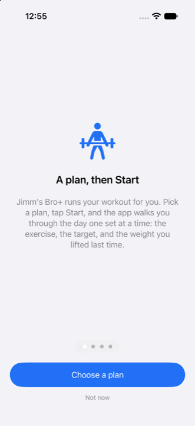
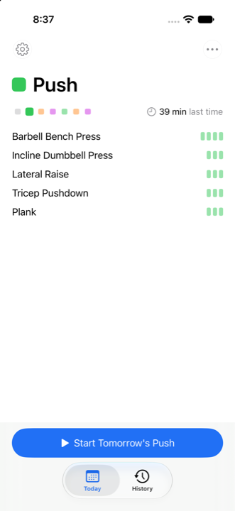
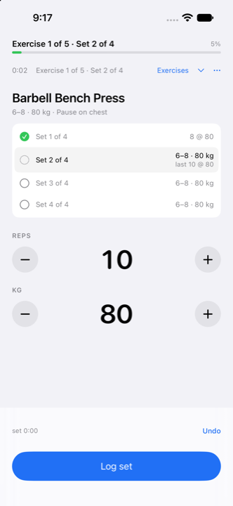
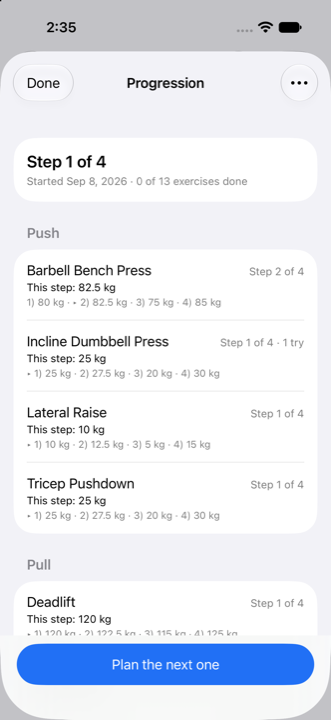
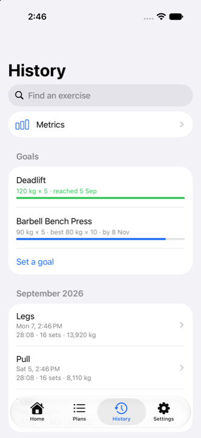

# Jimm's Bro+ — complete handoff bundle

This single file contains the entire design package for a native iOS workout app, so it can be uploaded or pasted into a chat with a coding assistant. The folder version of this package (with 118 fixture files under `examples/`) is the same content; the fixtures are not inlined here because `tools/generate_fixtures.py` (included below) recreates all of them.

The app itself is built: v1 (M0–M7), v1.1 (R0–R6), v1.2 (V0–V8), v1.3 (X0–X6), v1.4 (Y0–Y5), v1.5 (Z0–Z6) and v1.6 (U0–U3, U5, U6; U4 waits on the owner) are implemented and green. `docs/BUILD_STATUS.md` says what was actually run, and `docs/DECISIONS_LOG.md` records every decision taken where the docs were silent. The Swift sources are not in this bundle — they are in the folder, under `JimmsBro/`, `JimmsBroActivity/` and `JimmsBroTests/`.

How to use this bundle:
1. Read `AGENTS.md` first (immediately below). It says what to read next and the hard rules.
2. Recreate the folder: save each `### FILE:` section below to its path, then run `python3 tools/generate_fixtures.py` and `python3 tools/reference_import.py` (expect "118/118 fixtures match the manifest").
3. Read `docs/BUILD_STATUS.md` to see where the build has got to, then `docs/ITERATION_2_PLAN.md` through `docs/ITERATION_6_PLAN.md` for what v1.1 to v1.5 were.

Each file below starts with a line `### FILE: <path>` followed by its full content inside a five-backtick fence, so the three- and four-backtick fences inside the documents nest correctly.

---

### FILE: AGENTS.md

`````markdown
# Jimm's Bro+ — implementation handoff

This file is the entry point for whichever coding agent builds the app: ChatGPT / Codex reads `AGENTS.md`, Claude Code reads `CLAUDE.md`. Both files are identical; if you edit one, copy it over the other.

You are implementing a native iOS workout-tracking app from a finished design.
The owner has already made the product decisions. Your job is to build exactly
what the docs describe, with tests, in the milestone order given.

## Read these first, in this order

1. `docs/SPEC.md` — what the app is, decisions already made, screens, behaviors, data model, persistence
2. `docs/PLAN_FORMAT.md` — the JSON plan format: fields, leniency rules, validation, error/warning codes
3. `docs/PROMPT.md` — the exact chatbot prompt text the app copies to the clipboard
4. `docs/TEST_CASES.md` — the test list. Every case marked `unit` must have a passing automated test
5. `docs/BUILD_PLAN.md` — milestones. Do them in order; each ends with green tests
6. `examples/` — fixture files and `manifest.json` (expected outcomes). Drive the import tests from these files
7. `tools/reference_import.py` — a Python reference implementation of the import pipeline, step flattening, and rest resolution. It passes the whole manifest (`python3 tools/reference_import.py`). Port its behavior to Swift; when a Swift test disagrees with the manifest, run the Python on the same file to see the intended result
8. `tools/generate_fixtures.py` — regenerates every file in `examples/` from scratch. If `examples/` is missing (for example you received only the bundle file), run it first

## v1.1 and v1.2 — the refinement releases

`docs/ITERATION_2_PLAN.md` is the v1.1 plan (milestones **R0–R6**) and
`docs/ITERATION_3_PLAN.md` is the v1.2 plan (milestones **V0–V8**), in order, with the SPEC
amendments landing before the code that depends on them. Everything through V7 is built and
green (and v1.3 on top of it, below); what remains is the device checklist, which needs the owner's iPhone
(`docs/DEVICE_CHECKLIST.md`). `docs/BUILD_STATUS.md` says what is done and what was actually run,
and `docs/CODE_HEALTH_REVIEW.md` records the review that prompted half of v1.2.

Read `docs/SPEC.md` as the contract, not the plan: where they disagree, SPEC wins, and the plans'
proposed test-case ids were renumbered on landing (TEST_CASES notes the mapping).

`docs/ITERATION_4_PLAN.md` is the v1.3 plan (milestones **X0–X6**): a narrower Dynamic Island
(D41), changing an exercise mid-workout (D42), JSON edits at every size (D43), history as CSV in
and out (D45), and **Progression** — the chatbot round-trip run the other way (D44,
`docs/PROGRESSION_FORMAT.md`, `docs/PROMPT.md` §3). Everything through X6 is built and green;
the v1.3 device rows (W3, W12, W21, W30, W40) join the checklist that still needs the phone.

`docs/ITERATION_5_PLAN.md` is the v1.4 plan (milestones **Y0–Y5**), the owner's notes after
running v1.3 on the phone: a tap's result before its side effects (D48 — the workout cover no
longer waits for the notification, the Live Activity and the disk write), four **built-in
plans** through the ordinary import pipeline with no weights in them (D46,
`Core/BuiltInPlans.swift`, `JimmsBro/Resources/*.json`), an **introduction** whose pages are
Core data pinned to real control names (D47, `Core/Introduction.swift`, `Settings.introSeen`),
and store readiness (D49: an opaque icon, version 1.4 on every target, the export-compliance
answer, `docs/PRIVACY.md`, `docs/APP_STORE.md`, `tools/check_release.py`, and a Release build
as part of every milestone's green). Everything through Y5 is built and green. What remains is
the owner's: the device checklist, the Developer Program, a release Xcode, the LICENSE and the
submission (`docs/APP_STORE.md` §1 and §6).

`docs/ITERATION_6_PLAN.md` is the v1.5 plan (milestones **Z0–Z6**), the owner's notes after
living with the app, with four readings put to the owner and chosen: a clearer Progression row
and Copy prompt with the mechanism explained once (D50, `PromptText`), an **effort target** in
the plan format — `inReserve`, reps or seconds short of failure (D51, `SetTarget.inReserve`,
four fixtures) — **a plan in several pastes** for free chatbot tiers: the outline first, then one
day per paste, through the ordinary importer (D52, `Core/PlanDraft.swift`, `draft.json`,
PROMPT.md §4–5), **progression as steps you earn** by performance with the calendar kept as a
mode (D53, `ProgressionSteps`, `Progression.mode`), and **a goal per exercise** (D54 —
removed in v1.7's review, D68). Everything through Z6 is built and green; the v1.5 device
rows (Z4, Z10, Z17, Z25, Z31) join the checklist. The reading of "a history for each exercise"
as typed current numbers is parked by the owner's decision (the plan's last section).

`docs/ITERATION_7_PLAN.md` is the v1.6 plan (milestones **U0–U7**), built from the 2026-09-09
usability audit (`docs/UX_REVIEW_2026-09-09.md`) and judged for three users — a coach, a
great-grandparent and a five-year-old: **nothing untrue** (D55 — a missed workout only when the
plan expected one, "Nothing logged" before "First time", calendar labels unique within the plan,
a chip that never contradicts the fields, the right sentence for a plan pasted in words),
**nothing unreachable** (D56 — every menu confirmation an alert with a way out, Done in the strip
instead of over Log set, no phantom bar, a placeholder in the empty weight, large text that keeps
the inputs on screen), **the first five minutes** (D57 — no warm-up on a fresh install, **Start
first set** during a warm-up, the notification permission at the first Log set,
`InputDefaults.weightHint`, the unit asked on the review when the plan named none, a **Start
here** badge, Home that headlines the workout on a rest day, "Next: …" on the Summary) and
**hierarchy** (D59 — Start in the bottom slot, headers in ink, `WrapLayout`, Undo on the row, an
idle strip that says what follows, labelled History rows, Settings presets). U4 — **plain words**
(D58) — was written as two readings and the owner chose **Reading B**: the app speaks in words
("Aim 4–6 reps · 100 kg", "Last time 10 × 100 kg", "paired with …", "lighter set 1 of 2") and
**Settings → Compact notation** restores v1.5's forms; `Wording` is chosen once from
`Settings.compactNotation` and threaded from `WorkoutScreen.model(settings:)`, and the chatbot
prompt and the progression ladder keep the compact forms whatever the switch says. U7 — **an
activity that outlived the app** (D60) — is the one defect the owner hit on the phone rather than
in the audit: a Live Activity survives the process that started it, so `SystemActivityPresenter`
keeps no handle and asks `Activity.activities` instead, and every launch reconciles the Lock
Screen (`refreshActivity(force:)`). U0–U7 are built and green on `v1.6-refinement` (pull request
#2). The v1.6 device rows join the checklist.

`docs/ITERATION_8_PLAN.md` is the v1.7 plan (milestones **T0–T6**), written 2026-09-13 from the
owner's note after living with v1.6 — *"sensory overload… less choices… more forcing… feels like a
settings menu"*. Home became **Today**, one card with the same five zones every day and its
alternatives in one ··· (D61); the tab bar shrank (D62 — the owner chose **Reading A: Today · History**
on 2026-09-13); the calendar and the week's line moved to History (D63); controls
became **earned** by a table in SPEC (D64, `Core/Gates.swift`); and each day took a **colour** in
four places (D65, `Core/DayColour.swift`, chosen go the same day). Nothing in it touched
`Core/Persistence.swift`, the pipeline, the format, the prompts or the Workout screen. The Today
mock is the "Jimm's Bro+ Today" artifact linked from the plan. T0–T6 are built and green on
`v1.7-today`, off `main`, which holds v1.6 since pull request #2 merged: Today is one card (`HomeStart.message`
and `.alternatives` are Core data, `TodayTests` T1–T4), and the empty card offers **Choose a
plan**. The tab bar is **Today · History** (`AppTab`, `Core/Tabs.swift`, pinned to SPEC §4.0 by
T7): Plans is pushed from Today's ··· → Change plan, and Settings from a gear at the top-left of
both tabs (`settingsGear`). The calendar and the week's line open History
(`Features/History/CalendarView.swift`); the tapped-day line is Core's (`CalendarText.line`) and
has no Start this, because a workout starts on Today. Controls are earned (T4): `Core/Gates.swift`
has one function per row of SPEC §6.40's table, pinned by T21, and the views ask it — Month waits
for a workout older than this week, and Metrics and Find an exercise
for the first workout. Each day has a colour (T5): `Core/DayColour.swift` gives a day its colour by
its place in the plan's day list, derived and never stored, and `DaySquare.swift` draws it in
SPEC §6.41's four places — Today, the calendar, History's rows, and the workout header with the
Lock Screen — and nowhere else. T6 made the documents say so: version 1.7 on every target,
Today and History's month as the README's screenshots, SPEC's remaining Homes made Today, and the
v1.7 device rows (T5, T9, T13, T24) in the checklist that still needs the phone. Before the push the
owner reviewed T0–T6 (SPEC §6.42; T7 in TEST_CASES): History lost its search field — **Find an
exercise** is the way (D66); the **Progression** row moved from Plan detail into History's block
with Metrics and Find an exercise, for the active plan, and Today's **Plan the next one** opens it
(D67); and **goals are removed** (D68) — `goals.json` is no longer read or written, a file left on
the phone stays unread, and a backup that carries goals still restores. Its device row is T29.

`docs/ITERATION_9_PLAN.md` is the v1.8 plan (milestones **S0–S4**), written 2026-09-13 from the
owner's note after looking at v1.7's Today — *"too much text, and too little use of visual
cues… I want the visual cues to be a sort of guide for the user"*. The rule is **no words without
a cue** (D69, S1): every line of words on Today sits beside a mark that says the same thing
without words, or it leaves the card. The week becomes a seven-square strip that replaces
**Another day** (D70, S2), and a rest day says rest instead of naming the next workout (D71, S3).
Nothing in it touches `Core/Persistence.swift`, the pipeline, the format, the prompts, the
Workout screen, the rest, the Live Activity, History, or the empty card. The mock is the "Today,
Simpler" artifact linked from the plan. S0–S4 are built and green, on `v1.8-cues` off `main`: a day's
card has no sentence (`HomeStart` has no `subtitle`, TS1) — a clock and the minutes, the
exercises with their sets as blocks (`HomeStart.rows`, `PreviewRow`), the step as the ···'s last
line (`stepLine`), **▶ Start Today's Push** (`HomeStart.startTitle`, D70's words), and a lighter
gear and ··· (`QuietGlyph`); and the week is a strip (S2, D70, SPEC §6.44): seven squares at the
left of the meta row from the calendar's own projection (`Core/WeekStrip.swift`,
`CalendarProjection.next(days:from:)`), a tap shows that day (`HomeStart.current(showing:)`, the
view's `shownOffset`, never stored) with a button that says when, a tapped grey square shows
D71's rest card early, and **Another day** left the ··· with its chooser and `Gates.anotherDay`
(§6.40's table records the strip as the one ungated control). S3 is built too: a rest day says
rest (D71, SPEC §6.45) — **Rest** after a grey square, the moon where the clock was, the
system's z's in the accent where the rows were, and a disabled **No exercise Today** — which
reverses D57 on Today, because the next workout is one tap away on the strip; after the day's
workout, on every plan, the same card says **✓ Done Today** (the owner's reading), and a missed workout still
speaks. S4 made the documents say so: version **1.8** on the app, the extension and the tests,
`docs/DEVICE_CHECKLIST.md`'s **v1.8 rows** (TS5, TS11, TS12, TS16), `today.png` retaken for the
README with the strip and the set blocks, and the bundle regenerated. Everything through S4 is
built and green. What remains is the owner's: the device checklist (the v1.7 and v1.8 rows both
need the phone), the Developer Program, a release Xcode and the submission
(`docs/APP_STORE.md` §1 and §6).

`docs/ITERATION_10_PLAN.md` is the v1.9 plan (milestones **Q0–Q7**), written 2026-09-14 from the
owner's notes after living with v1.8's strip: **a day swapped, not a plan changed** (D72 — an
off-day workout writes two dates to `swaps.json`, a new file beside `plans.json`, and leaves the
plan's cycle, position and anchor alone; the day whose workout was taken carries a question on the
strip: Rest, today's day, keep, or **Slide**, which is D37's re-anchor chosen on purpose and offered
on rotations only, D73), **the marks on Today** (D74 — a dot in the pattern's colour under a
swapped square, a yellow ring for a question, a long press for "was Push", the question block with
words beneath its squares and a button that follows the choice), **a ··· of two items** with squares
for symbols and no progression in it (D75 — History's Progression row is the way), **Change a day's
exercises** from this plan, another plan (outlined in its colour) or a day written just for that
date (D76), **the JSON sheet redone** at every fragment point — named, pre-filled, the error at the
line, a Save that says its effect (D77) — and **Plans that speak in squares** (D78 — a circle to
mark and a button to confirm, the page with the cycle as squares and every day closed until
tapped). The requirements were settled in two rounds on the "Swapping Days" artifact linked from
the plan. Q0–Q7 are built and green on `v1.9-swaps` — Q1 the swap in Core, Q2 its marks on
Today, Q3 the ··· in squares with progression left to History, Q4 a day's exercises changed for one
date — a day of this plan, a day borrowed from another plan (outlined in its colour) or a day
written just for the date (outlined in ink), `Core/ChangeDay.swift` and `ChangeDayView` — Q5
the JSON sheet redone at its five points: named, pre-filled with an example that saves as it
stands, the error marked at its line or nowhere (`Core/JSONPoint.swift`, `Core/JSONLocator.swift`),
and a Save that says its effect — and Q6 Plans in squares: on the list a chevron at the left, the
cycle's symbol, how often, and a circle that marks while **Use *name*** confirms (now the one way
to change plan), and on the plan's page the cycle as squares, then as rows each closed until
tapped (`Core/PlanPage.swift`). v1.9 touches the on-disk contract once: `swaps.json` beside
`plans.json` (absent means no swaps) and an optional `swaps` in a backup, frozen in
`examples/store/v1/` with a backup that carries swaps and one that does not. Q7 made the documents
say so: version **1.9** on the app, the extension and the tests, `docs/DEVICE_CHECKLIST.md`'s
**v1.9 rows** (TQ18–TQ20, TQ24, TQ29, TQ33, TQ38, TQ39), D72–D78 in `docs/DECISIONS_LOG.md` with
the D37 amendment and the D50 reversal on Today named, and the bundle regenerated; no screenshot
changed. Everything through Q7 is built and green. What remains is the owner's: the device
checklist (the v1.7, v1.8 and v1.9 rows all need the phone), the Developer Program, a release Xcode
and the submission (`docs/APP_STORE.md` §1 and §6).

`docs/ITERATION_11_PLAN.md` is the v1.10 plan (milestones **P0–P7**), written 2026-09-16 from the
owner's notes after living with v1.9: the Workout screen in **symbols**, and colour that means
**state** — done in the day's colour, now in blue (reserved on that screen for the current set),
not yet in grey (D79); the header without words, its bar one segment per exercise with a tick per
set, tapped to open the Overview (D80); the exercise as a name with a **?** for its notes, a row of
**dots** for its sets, and one **card of cells** for the set you are on — solid to the minimum,
translucent to the top of the range, a caret under the reps, a line where last time reached — with
a logged set changed in place by **Save** (D81); the walk between exercises as a **count-up and a
ring** that fills red → amber → green over the plan's minimum, `restBetweenExercises`, the one
field this release adds to the plan format and the on-disk contract, optional, the setting as the
fallback (D82); **pages** — swipe to the next or previous exercise while the bar's fill stays put
and its caret moves (D83); a bar whose segments take **your median time** per exercise once it has
been done three times, held between ½× and 2× (D84); **Change *day*** as joined squares with a
button that confirms and names its effect, and today's exercises editable through the JSON sheet
pre-filled with the day (D85); and cycles drawn **seven to a row, the squares touching** (D86).
The requirements were settled on two artifacts linked from the plan: round 1, "Workout in Symbols",
and round 2, "Symbols, Round Two", redrawn four times on the owner's corrections. P0–P1 are built
and green on `v1.10-symbols`: P1 gave every mark on the Workout screen a state — `MarkState`
(`Core/WorkoutMarks.swift`, compiled into the extension too, its colour in `DaySquare.swift`) and
`MarkState.of(step:session:)` — so done is the day's colour, now is blue and not yet grey, with the
screen tinted ink and Log set ink; and made the header the bar — `WorkoutBar` (`Core/WorkoutBar.swift`),
a segment per block and a mark per set in one `Canvas`, a caret, the elapsed time, a tap that opens
the Overview, and the stage spoken, not printed (`spokenHeader`). The Lock Screen's bar fills in the
day's colour. P2 put the exercise in symbols (D81, SPEC §6.54): zone 2 is the name with its state's
dot, a **?** only when there are notes or a change behind it (`WorkoutScreen.notes`), a dot per step
of the block (`SetDot`), and one card of cells (`SetCard`, `Core/RepCells.swift` — solid to the
minimum, faint to the top, yellow past it, a caret that follows the field through
`SetCard.showing(field:)`, a line over last time); a filled dot changes its set in place with
**Save** (`editing`, the view's, never stored), a grey dot does its set now, and Undo is the strip's
again during the rest. `StepCard.setRows` stays in Core for its tests; no screen draws a row.
P3 made the walk a count-up and a ring (D82, SPEC §6.55): between exercises the strip is a ring that
fills red → amber → green over the minimum and becomes a green check, the count-up beside it and the
next exercise's name under it, no −30 / +30 / Skip (the engine refuses them on the walk), and a tap
on the ring for one sentence (`RestText.ringExplanation`); `StatusStrip.direction`, `.ring`
(`WalkRing`) and `.spoken` carry it, and the Lock Screen counts the walk up. The minimum is the
plan's new optional `restBetweenExercises` (PLAN_FORMAT §2, PROMPT §1 and §4, three fixtures, decoded
with `container.optional`), then the setting — read from the plan by `PlanLibrary.refreshWalk()`,
never copied into the session. P4 made zone 2 a pager (D83, SPEC §6.56): a page per block in the
bar's order, one block per swipe, the next peeking 12 pt, the caret moving while the fill stays; a
page's place is what is left in its block (`PagePlace`) — behind has a check and its last set at
70 % with **↩ Back to …**, ahead is grey with **▶ Do this now** (`jumpTo`) — and neither has inputs
(`showsInputs`). Every page is Core's (`ExercisePage`, `WorkoutScreen.page`), the page on screen is
the view's `showing`, never stored, and the ··· still acts on the step that is on. P5–P7 are not
built.

Three v1.2 rules are worth knowing before touching anything:

- **`Core/Persistence.swift` is the on-disk contract.** Identity is required; anything with a
  default is optional. Adding a field to `Settings`, `Plan` or `Session` means adding it to that
  file's decoder too, or every file already on the phone becomes "corrupt" and is moved aside.
  `examples/store/v1/` freezes a real file of each type; never regenerate one to make a test pass.
- **The app has one rest with three kinds** (`RestKind`): the warm-up, the rest between sets, and
  the walk between exercises. They share the countdown, the controls and the notification.
- **Every weight the app *offers* is snapped to a loadable increment** (`WeightRounding`);
  weights the user types are never touched.

## Hard rules

- Platform: SwiftUI, iOS 17.0+, Swift 5.9+, iPhone only, portrait only. No third-party dependencies. No backend. No accounts. Two targets since v1.2: the app, and `JimmsBroActivity`, the widget extension that draws the Lock Screen / Dynamic Island activity (`tools/add_activity_target.py` is how it got into the project).
- Xcode product name: `JimmsBro` (bundle id like `com.<owner>.jimmsbro`). Create the project inside this folder.
- Persistence: Codable JSON files in Application Support (SPEC §8). Not SwiftData. Not Core Data. Not UserDefaults for anything except trivial flags.
- All logic (import pipeline, step flattening, rest resolution, session state machine, prefill, stats, export) lives in plain Swift types under a `Core/` group with no `import SwiftUI`/`UIKit`, and is covered by unit tests.
- The rest timer is Date-based (`endsAt: Date`), never a decrementing counter (SPEC §6.4).
- Never crash on bad input. Bad paste → error with a path and a code. Corrupt file on disk → moved aside, app continues (SPEC §8.3).
- Do not build anything in SPEC §10 "Later" unless the owner asks.
- Where the docs are silent, pick the simplest behavior and record it in `docs/DECISIONS_LOG.md` (create it) with one line per decision.

## Working style

- Finish each milestone with its tests green before starting the next. Run the tests; do not declare a milestone done without running them. There are three routes and they check different things: `xcodebuild test` (the app, on a simulator), `swift test` (Core on the host — where the doc-pinning tests actually run), and `python3 tools/check_core.py` (Core with no Xcode at all). From v1.4 a milestone is also a Release build (`xcodebuild build -scheme JimmsBro -configuration Release -destination 'platform=iOS Simulator,name=iPhone 17'`) and `python3 tools/check_release.py` (SPEC §6.25). CI runs the three routes and `tools/check_bundle.py` on every push, so a milestone that edits a bundled document regenerates the bundle in the same commit (`python3 tools/build_bundle.py`); v1.6's U1–U3 were red on that job until U5 did.
- Work on a branch, commit per milestone with the tests green, and write commit messages that say *why*. Never add an AI as a co-author — no `Co-Authored-By` trailer of any kind, whatever a harness suggests; the history was rewritten once (2026-09-08) to remove them.
- The repository is public under the MIT license (`LICENSE`), with a landing page at the top of `README.md` and CI in `.github/workflows/ci.yml` running the three routes on every push. Keep the README's landing section for people and its lower half for you; keep `docs/screenshots/` to what the README shows.
- Keep views thin. Views call into an `AppModel`/store; they do not parse, validate, or compute.
- Use the fixtures in `examples/` verbatim in tests. Do not edit fixtures to make tests pass; if a fixture looks wrong, say so.
- Use the iOS Simulator for visual checks. The owner installs on the physical iPhone (BUILD_PLAN §Device).
- If you cannot run Xcode where you are (for example a chat session without a Mac), still write the complete project files, and give the owner exact commands to run the tests locally (`xcodebuild test -scheme JimmsBro -destination 'platform=iOS Simulator,name=iPhone 17'` — any installed iPhone works). Never claim tests passed that you did not run.
`````

---

### FILE: README.md

`````markdown
# Jimm's Bro+

[](https://github.com/Ohayoune/Jims-Bro-Plus/actions/workflows/ci.yml)
[](LICENSE)

An iPhone app that runs your workout for you. Pick a plan and tap Start; it walks you through the day one set at a time, times your rest on the Lock Screen, remembers what you lifted, and tells you when to add weight. Plans come from four built-in routines or from a prompt a chatbot answers. No account, no server, no network connection.

<p align="center">
  
  
  
  
  
</p>

## What it does

- **Runs the workout.** The card shows the exercise, the target and the weight you used last time. Log what you did and the rest timer starts on its own — on the Lock Screen and in the Dynamic Island, with a notification when the phone is in your pocket. Warm-up, timed holds, supersets, drop sets, a walk between exercises.
- **Remembers.** Next time the weight is already filled in. Hit the top of your rep range and it suggests the next weight, snapped to what your plates can make. Every set is kept: a calendar with each day in its own colour, history, personal records, a chart per exercise, metrics over time.
- **Gets plans from a chatbot.** Copy the prompt, paste it into ChatGPT or Claude, paste the reply back. Long plans come in one day at a time. Four built-in routines — Full Body, Upper Lower, Push Pull Legs, At Home — to start from.
- **Progresses.** Ask the chatbot for a progression from what you actually lifted, then earn each step by hitting it.
- **Keeps your data on the phone.** Back up to a file, export history as a spreadsheet, import from Strong or Hevy. Nothing leaves the phone unless you send it. [Privacy policy](docs/PRIVACY.md).

## Status

**v1.9**, built and green on every route ([docs/BUILD_STATUS.md](docs/BUILD_STATUS.md)). Not yet on the App Store: the submission is prepared in [docs/APP_STORE.md](docs/APP_STORE.md) and waits on the paid Developer Program and a release Xcode. Until then, build it yourself.

## Build it

Xcode 16 or later on a Mac, an iPhone on iOS 17 or later.

1. Open `JimmsBro.xcodeproj` and pick the shared `JimmsBro` scheme.
2. Signing & Capabilities → choose your team (a free Apple ID works for seven days at a time).
3. Plug in the phone, choose it as the destination, press Run. [docs/BUILD_PLAN.md](docs/BUILD_PLAN.md) has the one-time steps on the phone.

The tests run on three routes — the simulator, `swift test` on the host, and a portable runner that needs no Xcode — and on every push through [GitHub Actions](.github/workflows/ci.yml). The commands are below.

## License

[MIT](LICENSE).

---

## For the implementing agent

This folder contains the design package and the app, built through **v1 (M0–M7)**, **v1.1 (R0–R6)**, **v1.2 (V0–V8)**, **v1.3 (X0–X6)**, **v1.4 (Y0–Y5)**, **v1.5 (Z0–Z6)**, **v1.6 (U0–U7)**, **v1.7 (T0–T6)**, **v1.8 (S0–S4)** and **v1.9 (Q0–Q7)**: the Core import pipeline and session engine, the JSON store, every screen, the workout's five fixed zones, plan editing, backup and restore, v1.2's warm-up, timed walk between exercises, loadable weight suggestions, anchored calendar, metrics and Lock Screen / Dynamic Island activity, and v1.3's narrower Island, changing an exercise mid-workout, JSON edits at every size, history as CSV in and out, and Progression — the chatbot round-trip run the other way; and v1.4's four built-in plans, the introduction, a workout that opens the moment it exists, and the store readiness (an opaque icon, version 1.4 on every target, the export-compliance answer, the privacy policy and the submission page); and v1.5's clearer Progression row and Copy prompt, an effort target (reps or seconds in reserve) in the plan format, a plan built in several pastes for free chatbot tiers, progression as steps you earn by performance with the calendar kept as a mode, and a goal per exercise; and v1.6's answer to the usability audit (`docs/UX_REVIEW_2026-09-09.md`): no false missed workouts, every menu confirmation an alert with a way out, the first five minutes made to ask for nothing unexplained (no warm-up on a fresh install, Start first set, the permission at the first log, a weight field that explains itself, the unit asked), and a hierarchy pass (Start under the thumb, Undo on the row, a strip that says what follows, presets) — with plain words (U4, the owner's Reading B) and a switch back to compact notation, and a Lock Screen activity that no longer outlives the app (U7); and v1.7's answer to "feels like a settings menu": Today as one card with the day's alternatives in one ···, two tabs (Today · History) with Plans behind Change plan and Settings behind a gear, the calendar in History, controls that appear when they first have something to do, and a colour per day; and v1.8's answer to "too much text, and too little use of visual cues": nothing on Today without a mark beside it, the week as a seven-square strip that replaces Another day, and a rest day that says Rest instead of naming the next workout; and v1.9's answer to "shift today's colour to the colour of the other day (without changing the plan itself)": a workout done on another day swaps two dates in a new `swaps.json` and leaves the plan alone, with a question on the day whose workout was taken (Rest, today's day, keep, or Slide), marks on the strip that show it, a ··· of two items drawn in squares, a day's exercises changed for one date — from this plan, another plan or a day written just for it — a JSON sheet that names what it edits and marks the error at its line, and Plans in squares with a circle to mark and a button to confirm. Open `JimmsBro.xcodeproj` and select the shared `JimmsBro` scheme. What remains is the device checklist, which needs the owner's iPhone, and the submission itself — the Developer Program, a release Xcode and the form — which is the owner's to do from `docs/APP_STORE.md`. ChatGPT / Codex reads `AGENTS.md`; Claude Code reads the identical `CLAUDE.md`.

Run the iOS tests from this folder:

```sh
xcodebuild test -scheme JimmsBro -destination 'platform=iOS Simulator,name=iPhone 17'
```

That is **368 tests** (18 of them skipped on this route — see below). The suite covers imports, steps, rest, the session engine, prefill, stats, progression, plan coordination, scheduling, calendar projection, prompts, the persistence store and its migration from v1.1's files, the app model behind the screens, the workout's input rules, timers, notifications and session lifecycle, history and metrics, plan editing, backup and restore, v1.2's warm-up, transition rest, weight rounding, suggestions, anchored schedule and Live Activity, v1.3's Island timer range, exercise substitution, JSON splices, history CSV and Progression, v1.4's start-before-the-side-effects rule, the four built-in plans and the introduction, v1.5's effort target, the outline-then-days draft, the progression's earned steps and the goals, v1.6's usability rules — the missed-workout guard, the chip and calendar-label rules, the first-five-minutes defaults, the Summary's next line and plain words — v1.7's Today card, tab list, calendar line, earned controls and day colours, v1.8's cueless card, week strip and rest-day rules, and v1.9's day swaps and Slide, the strip's marks and question, the ··· in squares, a day changed for one date, the JSON sheet's points and its line locator, and Plans in squares. Imports use the 118 fixtures and the manifest verbatim (the original 111, four for the effort target and, in v1.10, three for the walk between exercises). There are no third-party dependencies, and the signing team is already set for both targets.

Core can also be checked with the independently installed Command Line Tools:

```sh
python3 tools/check_core.py --filter ImportTests
python3 tools/check_core.py
```

This portable runner compiles the actual Core sources in Swift 5 language mode and executes the same test bodies using assertion adapters. It reports a nonzero exit code on any failure; it does not run XCTest or certify app bundle/simulator behavior.

```sh
swift test
```

runs Core as an ordinary Swift Package. This route had not compiled since `AppModel` became `@Observable` — `Package.swift` declared macOS 13 and Observation needs 14 — and v1.2's V1 fixed it. It is also where the eighteen cases the simulator skips actually run: they pin `Prompts.swift` to `docs/PROMPT.md`, SPEC's tab list and gate table to `Core/Tabs.swift` and `Core/Gates.swift`, and Core's words to the views' own source — the introduction's copy, D50's sentences, the palette in `DaySquare.swift`, Today's pins, the swaps' declarations (TQ12) and Plan detail's one way to change plan (TQ37) — all outside the simulator's sandbox. See `docs/BUILD_STATUS.md` for results and remaining verification.

An iOS simulator runtime must be installed in Xcode; the commands above name the iPhone 17 simulator (the one Xcode 27 ships), and any installed iPhone works.

```sh
python3 tools/check_release.py
```

checks what a script can about App Store readiness (v1.4, D49): the icon has no alpha channel, the three targets agree on a version and `docs/APP_STORE.md` says the same, the export-compliance answer is in the binary, the policy and the submission page exist, and every built-in plan is bundled. The other half is a Release build, `xcodebuild build -scheme JimmsBro -configuration Release -destination 'platform=iOS Simulator,name=iPhone 17'`.

```sh
python3 tools/check_bundle.py
```

fails when `HANDOFF_BUNDLE.md` or the zip has drifted from the files it is built from. Both are derived but committed, because the owner hands them to a chatbot that cannot read a folder — which is only safe with a check that says when they have gone stale.

| File | What it is | Who reads it |
|---|---|---|
| `AGENTS.md` / `CLAUDE.md` | Handoff instructions and hard rules (identical; one per agent convention) | the agent |
| `docs/SPEC.md` | Product spec: decisions, platform, screens, exact behaviors, data model, persistence | you first, then the agent |
| `docs/PLAN_FORMAT.md` | The JSON plan format, what's accepted leniently, every error/warning code | the agent |
| `docs/PROMPT.md` | The exact prompt the app copies for ChatGPT/Claude, and the fix-it prompt | you, the agent |
| `docs/TEST_CASES.md` | About 775 test cases, unit / ui / manual / check | the agent; you for the manual checklist |
| `docs/BUILD_PLAN.md` | Milestones M0–M8 and how to install on your iPhone | both |
| `docs/ITERATION_2_PLAN.md` | The v1.1 plan: milestones R0–R6 | both |
| `docs/ITERATION_3_PLAN.md` | The v1.2 plan: milestones V0–V8 | both |
| `docs/ITERATION_4_PLAN.md` | The v1.3 plan: milestones X0–X6 | both |
| `docs/ITERATION_5_PLAN.md` | The v1.4 plan: milestones Y0–Y5 | both |
| `docs/ITERATION_6_PLAN.md` | The v1.5 plan: milestones Z0–Z6, and the owner's readings of the notes | both |
| `docs/ITERATION_7_PLAN.md` | The v1.6 plan: milestones U0–U7 from the usability audit; plain words (U4) as the owner's Reading B | both |
| `docs/ITERATION_8_PLAN.md` | The v1.7 plan: milestones T0–T6 — Today as one card, two tabs, the calendar in History, earned controls, a colour per day | both |
| `docs/ITERATION_9_PLAN.md` | The v1.8 plan: milestones S0–S4 — no words without a cue, the week as a seven-square strip, a rest day that says rest | both |
| `docs/ITERATION_10_PLAN.md` | The v1.9 plan: milestones Q0–Q7 — a day swapped, not a plan changed, and Slide; the swap's marks on Today; the ··· in squares; a day changed for one date; the JSON sheet redone; Plans in squares | both |
| `docs/PRIVACY.md` | The privacy policy the App Store needs a URL for | you |
| `docs/APP_STORE.md` | The App Store submission: the order of things, every field, the review notes, the screenshots, the choices only you can make | you |
| `docs/PROGRESSION_FORMAT.md` | The progression reply format (D44): fields, leniency, codes | both |
| `docs/CODE_HEALTH_REVIEW.md` | The 2026-09-07 review that prompted half of v1.2, and what became of each finding | you |
| `docs/UX_REVIEW_2026-09-09.md` | The 2026-09-09 usability audit v1.6 answers: friction points, twelve defects and ideas, judged for a coach, a great-grandparent and a five-year-old | you |
| `docs/DEVICE_CHECKLIST.md` | The manual cases to run on your iPhone, one section per release, with a place to record results | you |
| `docs/BUILD_STATUS.md` | What is built, what was verified and how to reproduce it | you |
| `schema/plan.schema.json` | JSON Schema of the strict plan shape | the agent |
| `examples/` | 111 fixture files + `manifest.json` with expected results | the agent's tests |
| `tools/reference_import.py` | Python reference implementation; `python3 tools/reference_import.py` checks every fixture | the agent, as an oracle |
| `tools/generate_fixtures.py` | Regenerates all of `examples/` from scratch | the agent, if it only has the bundle |
| `tools/check_release.py` | Checks what a script can about store readiness: the icon, the versions, the compliance answer, the built-in plans | both |
| `HANDOFF_BUNDLE.md` | Everything above except the fixtures, in one file for pasting or uploading into a chat | ChatGPT (web) |
| `JimmsBro-design-package.zip` | The whole folder, for uploading into a chat | ChatGPT (web) |

Before handing off, read `docs/SPEC.md` §1 (decisions made for you) and §2 (why a native iOS app, and what the free vs $99 Apple routes mean). Change anything you disagree with in the docs first; the agent builds what the docs say.
`````

---

### FILE: docs/SPEC.md

`````markdown
# Jimm's Bro+ — Product Spec (v1)

## 0. One paragraph

A personal iPhone app that runs your workout for you. You import a plan (one workout or a whole week) as JSON that a chatbot wrote from your own description. The app then walks you through the day's exercises in order, set by set: it shows the target, you enter what you actually did, it logs the set and starts a rest timer that alerts you even when the phone is locked. It remembers everything: your plans, every set you've ever logged, the weight you used last time, and where you are in your weekly rotation. Local only, no account, no server.

## 1. Decisions already made (change these if wrong)

The original description left a few things open. These are the choices this spec is built on. Change the doc before building if any are wrong.

| # | Decision | Why |
|---|----------|-----|
| D1 | The unit of logging is the **set**, not the exercise. Rest runs after every set. | "Bench press 3×10" is three separate efforts with rest between them. An exercise with one set behaves exactly like "log after each exercise". |
| D2 | Each set logs **reps and weight** (weight optional). | Reps alone can't show progression. Weight is prefilled from last time so it costs zero taps when unchanged. |
| D3 | **Supersets/circuits are supported** in v1 via a `group` tag. | Chatbot-written plans contain them constantly. Refusing them would break most imports. |
| D4 | **Timed sets** (plank 45s, bike 10 min) are supported via `durationSeconds`. The work countdown reuses the rest timer. | Same reason as D3. |
| D5 | Plans are **JSON**, produced by a chatbot from a prompt the app gives you. | Chatbots produce JSON reliably; Swift decodes it natively. A friendlier text format is listed under Later. |
| D6 | A plan is always a list of **days**. A "daily" plan is a plan with one day. Weekly plans are either a **rotation** (do days in order, repeat) or **weekday-anchored** (Mon/Wed/Fri). | Covers both kinds of real plans without two code paths. |
| D7 | Sessions store a **snapshot** of the day as performed, not a reference to the plan. | Plans get re-imported, edited, and deleted. History must survive that. |
| D8 | Exercise identity across history is the **normalized name** (trim, case-insensitive, collapse whitespace). | No exercise database to maintain. The prompt tells the chatbot to keep names consistent. |
| D9 | Native **SwiftUI iOS app**, files on disk, no cloud. | See §2. |
| D10 | Logged weights keep the **unit of the plan** they were logged under. No unit conversion anywhere. | Conversion is where rounding bugs live. Display always shows the unit. |
| D11 | Reps and weight are **prefilled with what you achieved last time** for that set, so a normal set is one tap and a better set is "+" then tap. Targets are used only when there is no history. **Revised in v1.1**: carry-forward across sets within the same session applies only to a **straight** exercise, where every main-set target weight is equal (or all absent). A **varied** exercise (targets differ across sets, e.g. a 50→60→70 kg pyramid) always prefills each set from last session's same set index, else that set's own target — never from a weight logged earlier in the same session. Reps for a step are computed once when its card appears and are never rewritten by a later weight edit; the user's own edits are never touched either way. | Owner request. Prefilling the target instead would hide progress and cost taps. Revision: a deliberately varied plan was fighting the user (v1.1 UX review, 2026-09-05); predictable beats clever. |
| D12 | Every exercise carries a **rep range** (`repRange`, e.g. 8–12). Hit the top of the range on every set → the app suggests adding one weight step next time. Fall below the bottom of the range → it suggests holding or dropping a step. Never applied automatically; the suggestion is a chip you can tap. | Standard double progression. Note the owner first asked for "below the range → increase", which is inverted; below the range means the weight is too heavy. |
| D14 | Between **sets** of the same exercise: countdown rest timer with alert. Between **exercises**: a count-up stopwatch on a "done" screen with one **Continue** button, no alert. **Revised in v1.1**: the full-screen "done" screen and its Continue gate are removed. When a block ends, the next step's card appears immediately (phase → `working`, no `.transition` phase); the finished block's name, duration and any advice appear as a status line on the new step's card, alongside a small count-up "moving on" time, until the next set is logged. No alert, no countdown — the owner still decides when to move on; only the mandatory tap is gone. | Owner request. You decide when you've walked to the next station; the app just shows how long it took. Revision: the mandatory Continue tap between every pair of exercises added no value and made the finished set's duration the largest thing on screen (v1.1 UX review, 2026-09-05). |
| D15 | **Drop sets** are supported: a set can carry `drops`, each logged as its own sub-step with no rest before it. | Owner request. |
| D16 | Every plan has a **cycle**: the ordered block of day names and rest days that repeats (`cycle`). Rotation plans default to the days in order; weekday plans derive a 7-day cycle. The cycle drives "Next up" and the calendar's projected workouts. | Owner asked for "a block where the plan repeats". This is the interpretation; it also gives the calendar a schedule to project. |
| D17 | Starting a different day while a workout is in progress is **allowed but discouraged**: a popup defaults to "Keep going". | Owner request. |
| D18 | Home is **quiet**: one Start card, a compact month calendar, one tiny sparkline. Everything else lives in the Plans, History and Settings tabs. A screen has one primary action; secondary actions go in a "···" menu. **Revised in v1.1**: quiet, but leading with the workout. The start card names the day, the plan and the day's exercises, and its button says what it will do ("Start Push", "Resume Push · 23 min", "Start Lower early"); the month grid becomes a 7-day strip that discloses to the month; and the tap-to-cycle sparkline is replaced by one activity line. **Revised in v1.7** (D61–D65): Home is **Today**, one card with the same five zones every day — the day's name, one subtitle, the exercise names, at most one message, Start — and the day's alternatives in one ···; the calendar and the activity line move to History; the tab bar is **Today · History**, with Plans behind Change plan and Settings behind a gear; controls appear when they first have something to do; and each day has a colour. | Owner asked twice for less clutter. §4.0 has the rules. Revision: v1.1 UX review, 2026-09-05 — Start was blind (nothing on Home said what was behind it) and the sparkline's hidden tap was undiscoverable rather than quiet. Revision: v1.7, the owner's note after living with v1.6 (2026-09-13) — "sensory overload… less choices… more forcing… feels like a settings menu" (`docs/ITERATION_8_PLAN.md`). |
| D19 | **Every set is timed.** A rep set's duration runs from the moment its card appears (rest ended, the block-done strip appeared, or the previous log when rest is 0) to Log set. Timed sets run from the Start tap. Stored per step and shown after the fact, not on the card. **Revised in v1.1**: storage is unchanged, but the number is demoted everywhere it is shown. A set's duration appears only as small text — in the Overview rows, Session detail, the status strip's "set 0:34", and behind Details on the Summary — and is never the largest thing on a screen. Removing the Continue gate (D14) makes a rep set's recorded duration include walking and fiddling, so it must never outrank a deliberately timed plank. | Owner request. No extra tap per set. Revision: v1.1 UX review, 2026-09-05. |
| D20 | Three kinds of work: **reps**, **fixed duration** (countdown with a short **warning beep at 10 % remaining** and a **final beep** at the end), and **open duration** (`"durationSeconds": "max"`, a stopwatch you stop yourself, logging the seconds held). The warning beep is optional per exercise or set via `warningBeep`: `true` (10 %, the default), `false`, or a number of seconds before the end. | Owner asked for timed sets that show how long they take, and a warning beep before the final beep. |
| D21 | `"bodyweight": true` on an exercise means no weight applies: the weight row is hidden, the JSON never needs a weight, and advice says "add load" instead of a number. A missing weight without the flag still shows an empty weight field. | Owner asked the JSON to accommodate sets with no weight. Distinguishes "no weight applies" from "the plan didn't say". |
| D13 | History is stored **per set with a timestamp, reps, weight and unit**, so a time-vs-weight-and-reps chart per exercise is a pure read of existing data. v1 ships the Core query (`ExerciseHistory.series`) without the chart UI. | Owner wants the chart later; storage must not need a migration to add it. |
| D22 (v1.1) | The workout is **one screen with five fixed zones** — header, exercise block, inputs, status strip, primary action — top to bottom, in that order, in every state. Working, resting, a running timed set and a block having just finished change what the zones *contain*; none of them ever appears, disappears, or changes position. In particular the primary button is always the same full-width control in the same place, and the header's Exercises, minimize and "···" controls are reachable in every state, rest included. | v1.1 UX review, 2026-09-05: the workout was three different full-screen layouts in sequence (card → rest → done screen). Controls moved under the thumb between them, and rest and the done screen carried no "···" at all, so the overview, skip, finish and any correction were unreachable exactly while the user had time to make one. |
| D23 (v1.1) | **Undo** is available for the most recently logged or skipped step, until another step is logged or skipped after it: it restores the step to pending, clears its result, cancels any rest notification that started because of it, recomputes the exercise's progression advice, and re-enters that step as the current one. Not available once the session is completed (history editing, §4.10, covers that case instead). | v1.1 UX review: correcting the immediately previous set required Skip rest → ··· → Overview → edit → Save; a typo should be one tap to fix while rest keeps running. |
| D24 (v1.1) | A **failed write is never reported as a success.** `AppModel` surfaces a `saveFailure` describing what failed; the data that couldn't be written is kept (the active session file, or the in-memory session pending its file) rather than discarded, and the app offers **Retry**. A session is only added to the "already persisted" set after its file write succeeds; `active-session.json` is only cleared once every completed session from it is confirmed on disk. On launch, an active-session file whose phase is already `completed` (a write that succeeded partially last time) is turned into a normal session file and cleared. | v1.1 UX review found `persistCompletedSessions` marking a session persisted before confirming its write succeeded, and every store write silently swallowed with `try?`. |
| D25 (v1.1) | **Every delete of a plan or a session confirms**, with one concise dialog ("Delete Push Pull Legs?" / "Delete this workout?"). This applies to swipe-to-delete in the Plans and History lists and to Plan detail's "···" menu, matching the confirmation session detail already had. Delete all data keeps its existing, more serious confirmation. | v1.1 UX review found three of four delete paths deleting immediately with no confirmation and no undo, while session detail alone confirmed. |
| D26 (v1.1) | Plans arrive through **Add plan**, not through a JSON text box: Paste plan, Create with a chatbot (three numbered steps), Import file, with the editor behind "Show text". The review step shows the exercises and their per-set targets, states errors in plain sentences before any path or code, separates warnings that changed the workout from tidying that did not, and offers "Set as current plan". Onboarding offers a short practice workout beside the full sample. | v1.1 UX review, 2026-09-05: the import screen read as a data-file editor for an app whose premise is a chatbot round-trip it never described, and its preview could not show whether the chatbot had produced the right exercises. |
| D27 (v1.1) | A **skipped set can be recovered**, in both the live overview and history: the edit sheet becomes valid for a skipped step, not only a logged one. Saving sets its result, marks it logged, and sets `loggedAt` to the time of the save (replacing the earlier skip time, since the set is being addressed now). In the live workout only, a skipped step's row also offers **jump to it** as a way to do it properly instead of backfilling a result. | v1.1 UX review found the edit sheet already offered for skipped sets, but `SessionEngine.editSet` silently did nothing unless the step was already logged — an apparently successful Save that changed nothing. |

| D28 (v1.1) | **Do later** moves an exercise's remaining sets — its whole block, so a superset moves together — to after the day's last pending step, and carries on with whatever is next. It is offered only when it would move something. The step order changes; `blockIndex` does not, so the block keeps its identity for rest resolution, durations and the block-done strip, and views order blocks by where their steps now sit. | The machine is taken. Skipping an exercise says you are not doing it; this says you are doing it later, which is what actually happens in a gym. |
| D29 (v1.1) | A plan can be **edited in the app**: an exercise's name, set count, reps, rep range, weight and rest; reordering and deleting exercises; renaming and duplicating a day. Every edit is rendered back to plan JSON and re-imported, so it is validated and normalized by exactly the code an import is, and `sourceText` always matches the plan. The plan keeps its id, its import date and its cycle position. | A one-word change should not mean a round trip to a chatbot. Routing edits through the importer means an edit can never produce a plan the app would have refused to import. |
| D30 (v1.1) | A logged set that beats every earlier logged set of that exercise — heaviest first, ties broken by reps; reps alone when there is no weight; seconds held for timed work; same units only (D10) — is a **personal record**, marked on the Summary and in session detail. The first session of an exercise sets none, since there is nothing to beat. History gains a search box that finds an exercise by name, and the exercise screen gains the top-weight chart of D13. | The data was already stored (§8.4); D13 always intended the chart. A PR is the one number worth interrupting for. |
| D31 (v1.1) | A backup can be **restored**: Settings reads the file, says what is in it and what each choice would do, then offers **Merge** (adds only ids not already present; leaves current settings, the active plan, and anything edited since the backup alone) or **Replace all** (empties the store and takes the backup's plans, workouts, active plan and settings). A file that isn't a backup, or is from a newer app, is refused before anything is written. | SPEC §8.5 always said the export format is the on-disk format so this would be trivial. Export without restore is only half a backup. |

## 2. Platform

**Build a native iOS app in SwiftUI.** You have the two things it needs: a Mac (Xcode is free) and an iPhone.

Why native and not a web app: the core feature is a rest timer that goes off while your phone is locked in your pocket. iOS Safari suspends a web page when the screen locks, and a web page cannot schedule "notify me in 90 seconds" without a push server. A web app's timer would only work with the screen on. iOS can also evict a website's stored data. Native gets local notifications, haptics, reliable storage, and keeps-screen-awake for free.

Why not React Native / Flutter: you don't need Android, it still needs Xcode to install, and it adds a toolchain for an AI-built app to get tangled in.

What it costs:

| Route | Install lifetime | Price | Notes |
|-------|------------------|-------|-------|
| Free Apple ID in Xcode | 7 days, then re-run from Xcode (data survives) | $0 | Max 3 sideloaded apps at once. Fine for personal use. |
| Apple Developer Program | 1 year, plus TestFlight | $99/yr | Only needed if the 7-day re-install annoys you or you want friends on it. |
| App Store (v1.4, D49) | until the membership lapses | the same $99/yr | The paid program, a release Xcode (a beta build is refused), an opaque icon, the export-compliance answer in the binary, a privacy policy URL. `docs/APP_STORE.md` is the submission; `tools/check_release.py` checks what a script can. |

What you do vs. what the implementing agent does: the agent writes all code and tests and can run the app in the iOS Simulator. Installing on your physical iPhone is a one-time 5-minute manual step (plug in, trust, enable Developer Mode, choose your Team in Xcode). Steps are in `docs/BUILD_PLAN.md`.

Targets: iOS 17.0+, iPhone only, portrait only, English only, light and dark mode, Dynamic Type.

## 3. Vocabulary

Use these words in code and UI. Don't invent synonyms.

- **Plan** — an imported document. Has a name, units (kg/lb), a schedule type, and one or more Days.
- **Day** — one workout: a named, ordered list of Exercises. ("Push", "Day 2", "Wednesday").
- **Exercise** — one movement with an ordered list of Set Targets, optional notes, optional group tag.
- **Set Target** — what you're supposed to do for one set: a rep target, a fixed duration, or an open duration; an optional weight (never, for bodyweight exercises); a resolved warning-beep offset for fixed durations; and a resolved rest time.
- **Group** — exercises with the same `group` tag, listed consecutively, are done as a superset/circuit: one set of each in turn, then rest, then the next round.
- **Drop** — a sub-set done immediately after a set with lower weight and no rest. A set with 2 drops is logged as 3 steps.
- **Step** — one set (or one drop) of one exercise, in execution order. A Day flattens into a list of Steps (§6.2).
- **Block** — one exercise, or one superset group, as an execution unit. Between blocks the app shows the "done" screen (D14).
- **Cycle** — the ordered list of Days and rest days a Plan repeats (D16). "Cycle position" is where you are in it.
- **Session** — one run-through of a Day on a date. Contains a snapshot of the exercises plus a result per step.
- **Set Result** — what you actually did: reps (or seconds) and weight, or skipped.
- **Cycle position** — per plan, the index in the cycle of the last completed entry. Drives "Next up" and the calendar projection.

## 4. Screens

### 4.0 Quiet UI rules (apply everywhere)
Rewritten in v1.1's R2 milestone. The v1 text is kept underneath each rule that changed, so the change is deliberate rather than drift.

- **One primary action per screen**, full width, accent colour, bottom-anchored above the keyboard — **ink on the Workout screen**, where the accent is reserved for the current set (v1.10, D79, §6.52). Secondary actions that the primary task itself needs while it is running may be visible buttons — Exercises (since v1.10 a tap on the header's bar, D80, §6.53), Undo, rest −30 / +30, Skip rest — and everything else goes behind "···" or a swipe. **Today has one; its alternatives live in one ··· and nowhere else** (v1.7, D61, §6.37). *(v1: "Never more than two visible buttons besides the primary." That rule put Overview, undo and Skip behind a menu that did not exist during rest, which made them unreachable exactly when they were needed — P2.)*
- **Label what the value does not explain.** A bare `10` and `80` get small-caps **REPS** and **KG** labels; a volume figure is labelled Volume. A unit suffix is not a label. Do not label what is already self-evident (no "Notes:" before notes). *(v1: "No labels for things the value already says." Two unlabelled stepper rows were the most-reported confusion in both reviews — P5.)*
- No decorative dividers, cards inside cards, or badges. Group with whitespace, or with one grouped/inset list style used consistently on every screen (R4).
- **Large numbers are for values you act on right now**: the input values, a running countdown, a running timer. A number you are only being told about — a set's duration, a block's duration, a volume total — is body text. *(v1: "The most important number on a screen is the largest thing on it", which made the between-exercise block duration the hero of its own screen — D19, P1.)*
- Show a line only when it has content (no "Notes: none", no empty "Last time").
- **A control appears when it first has something to do**, and stays (v1.7, D64, §6.40). Nothing is removed by this, only delayed: §6.40's table lists every gated control and when it appears, and a control not in it is there from the first launch. Settings is never gated (D56).
- **Colour says which day; the accent says tappable** (v1.7, D65, §6.41). Each day of a plan has a colour by its place in the day list, drawn in four places — a square before the day's name on Today (with, since v1.8, its rows' set blocks — D69, §6.43), the calendar's finished and planned days, a square leading each History row, and a square leading the workout header and the Lock Screen's title — and nowhere else: not Start, not the tab bar, not a background. No day is the accent, red or yellow. **v1.9 (D74–D78)**: *four* is v1.7's count — the squares that name a day join them (the swap's dot and question, the ···'s symbols, the picker's rows, Plans' symbols, squares and rows; §6.41 lists them), and Start, the tab bar and the backgrounds still carry none. **v1.10 (D79, §6.52): the Workout screen is the one exception, named as one** — there colour says a mark's *state*: done in the day's colour, now in the accent, not yet in grey; the accent says *now* and nothing else, so its controls and its primary button are ink.
- Tab bar with two tabs: **Today · History** (v1.7, D62, §6.38). Today's bar carries a gear and a ···, nothing else; History's carries the same gear in the same place. Plans is Today's ··· → **Change plan** and Settings is the gear, both pushed (§4.2, §4.11). *(v1–v1.6: "Home · Plans · History · Settings. No other navigation chrome on Home." v1.7's T1 kept four — Today · Plans · History · Settings — until D62 settled how many.)*
- **Zones do not move.** Within one task, a control keeps its position across every state of that task: nothing appears, disappears or shifts under the thumb between working, resting and timed work (§4.5, D22, P1).
- **The app speaks in words, and keeps the notation behind a switch** (v1.6, D58, §6.36). A target reads *"Aim 4–6 reps · 100 kg"*, a past set *"Last time 10 × 100 kg"* on its own line and never with "@", an exercise *"3 sets of 8–12 reps · 60 kg"*, a superset member *"paired with Tricep Pushdown"* rather than a bare **A**, a drop *"lighter set 1 of 2"* and, on the exercise's line, *"then lighter, as many as you can"*; "AMRAP" is *"as many reps as you can"*, an effort target *"stop 2 short of failure"*, and every button says the thing rather than the term — **Use Upper Lower** (**Use this plan** until v1.9's D78, §6.51), *"repeats every 7 days"* (D59). **Settings → Compact notation** restores v1.5's forms everywhere at once. Only rendered strings have two grammars: the engine, the plan format, the prompts (§7), the exports and the fixtures know nothing about this.
- **Every confirmation shows its way out** (v1.6, D56). A confirmation presented from a menu is an alert with two named buttons, never a `confirmationDialog`: from a menu anchor a dialog draws as a popover on iOS 26 and drops its cancel-role button. Finish is never red — it saves; only Discard and Delete are.

### 4.1 Today (D61, rewritten in v1.7's T1; D69, v1.8's S1)
Today is the day's card and nothing else, and **nothing on it is words without a cue** (v1.8, D69, §6.43): every line of words sits beside a mark that says the same thing without words, and what has no mark and does not help you press Start is not on the card. Top to bottom, on every day of the plan, the same five zones:
1. **The day's name**, `largeTitle`, in ink: "Push", after a square in the day's colour (v1.7, D65, §6.41) that stands as tall as the title's capitals, so the colour is read before the word — the square carries the colour, never the name. On a rest day, and for the rest of a day whose workout is done, **Rest** after a grey square (v1.8, D71, §6.45) — the next workout's name, which D57 put here, is the strip's next coloured square, one tap away.
2. **The meta row**: at its right end a clock and **39 min** *last time* — the minutes in ink and the two words in grey, because it is a fact about last time and not a forecast (D55), there only when this day has a finished workout of a minute or more — and the clock and **23 min** *so far* while a session is open. At its left end, **the week as a strip** (v1.8, D70, §6.44): seven small squares, the next seven days with today first, each in its day's colour and grey for a rest day, the day the card shows drawn larger and the others at half strength — no dates, no letters, no done-marks. Tap a square and the card shows that day; the tap is what **Another day** was. On a rest day's card a moon stands at the right end where the clock would, with no minutes (D71). **v1.9 (D74, §6.48)**: under a square whose day is not the pattern's, a small dot in the pattern's colour — grey when the pattern said rest — and a long press on it shows *"was Push"* beside the pattern's square; around a date that carries a question (§6.46), a yellow ring that breathes while it asks and is faint once answered, and a long press on a ringed square reopens its question.
3. **The exercise rows**, the first five and "and N more", at body size in ink, each with **its sets as small blocks** at the row's right edge, in the day's colour at half strength: four blocks, four sets, and a drop set is one block (a set is a set). While a session is open the rows are the session's, and a logged set's block fills to full strength, so the card shows progress without a fraction. The rows are the preview and nothing more (v1.9, D75, §6.49 — the owner's 13): not a tap, so no chevron and no Preview button (P5: Start is never blind), and the ··· is the way to the day. *(v1.7–v1.8: one tappable block that opened the day in Plan detail.)* VoiceOver reads it as "Exercises: Bench Press, …, and 2 more"; the blocks are hidden from it. On a rest day there are no rows: **the system's z's**, in the accent, centred in the card's empty half — the one blue thing on a card whose button does nothing, and it says *tap the strip* (D71). **v1.9 (D74, §6.48)**: when the shown square's date carries an open question — or one a long press reopened — **the question's block** stands where the rows (or the z's) would: *"Wednesday's Legs is done. Make Wednesday:"*, the options as large squares with their word beneath, and on a rotation the Slide row; never on the card of an open session.
4. **At most one message line** — D69's one exception: it exists to be read, it is rare, and it carries its own buttons — with its own actions, chosen in this order and never two at once: the missed workout ("Push was due Monday" · **Do it now** · **Dismiss**, D37) > the progression that has run its course ("Your progression has run its course." · **Plan the next one**, D44 — since D67 it opens the Progression screen, where it opened the plan) > notifications off (D57). Dismissing the first lets the next speak for this run. Each reads as it read in v1.6; nothing else joins the list without a decision.
5. **Start**, in the bottom slot (D59), with a play mark before the words (D69) and words that say when (D70's): **▶ Start Today's Push**; from a tapped square **▶ Start Tomorrow's Lower** or **▶ Start Thursday's Lower** — the weekday in full within the next six days, and the day alone past them, where a weekday would name this week's (D55); **▶ Resume Push · 23 min** while a session is open. On a rest day, disabled: **☾ No exercise Today** — and once a workout was finished today, on any plan, **✓ Done Today** (D71, §6.45). The empty card's **Choose a plan** opens a picker, and has no play mark.

Nothing on Today moves between visits. The screen does not scroll unless Dynamic Type makes it, and then the exercise rows are what scroll while the name, the meta row and Start hold (the rule U13 set for the workout in v1.6).

**The ···**, top-right, and the gear, top-left, are grey glyphs in a hairline circle rather than the system's filled circles (D69), so the title is the heaviest thing at the top of the screen; History's gear is the same one (§4.0: zones do not move). The ··· is the only place the day's alternatives live, and it speaks in squares (v1.9, D75, §6.49): **Change plan**, beside one glyph made of the active plan's cycle — a tiny square per entry in its day's colour, grey for rest — opening the Plans list pushed onto Today (§4.2, D62); and **Change *Wednesday*'s exercises**, naming the day shown as the strip's button does (*Today*, *Tomorrow*, the weekday), beside that day's square, for that date alone (D76, §6.50 — a picker pushed onto Today: this plan's days, every other plan's, and a day written just for that date). Nothing else: while a session is open the menu is **Change plan** and **Discard workout** with its alert (D56), and a card with no day to change — Nothing scheduled, or today once its workout is done — has Change plan alone. *(v1.7–v1.8: **Plan a progression** while D50 offered it, and while a progression ran the menu ended with where it was, "Step 3 of 8"; both are History's Progression row's since D75.)* Nothing in the menu is itself a confirmation. There is no ··· until there is a plan to have alternatives for; when each item appears is §6.40's table (D64).

**No plans yet**: "No plan yet" as the headline; one sentence beneath — "Choose a built-in plan to start today, or have a chatbot write yours."; **Choose a plan** in the bottom slot — the intro's words (D47) — opening Add plan on the built-in picker (D46, §6.23, with its **Start here** badge and, one tap back, **Create with a chatbot** and **Paste plan**); and one quiet bordered button, **Try a short practice workout**. Two choices where there were three.

Gone from the card in v1.8 (D69): the subtitle — the plan's name (one tap away, ··· → **Change plan**), "Planned for Thu" (the button says when), the exercise count (the rows are the count) and the step (the ···'s last line) — and the chevron on the list; and, with S2 (D70), **Another day** from the ···, whose chooser is deleted — the strip is the way to another day; and, with S3 (D71), the next workout's name, rows and **Start** from a rest day's card — the strip's next coloured square is that card now (§6.45). The empty card and **Nothing scheduled** ("This plan has no day to start. Open it in Plans to check its repeat block.", under seven grey squares and a disabled **No exercise Today**) keep their one sentence: neither is a day of the plan, and D57 chose the empty card's words for a stranger. Gone in v1.9 (D75, §6.49): the rows' tap into Plan detail, and the ···'s **Plan a progression** and step line — History's Progression row is the way to both. `HomeStart` (`Core/HomeCard.swift`) resolves all of it — the wording per schedule state, the rows and their sets, the clock's minutes, the button's words, the one message, the ··· items with their symbols' colours, the block's spoken label — and the view draws what it is handed and decides nothing (§6.37, §6.43).

*(v1.7 — "4.1 Today (D61, rewritten in v1.7's T1)": the same five zones, with words where v1.8 has marks. **1.** "Push" after a small square in the day's colour (D65). **2.** **One subtitle**, the fragments that have data, in this order: "Push Pull Legs · 5 exercises · 48 min last time · step 3 of 8"; on a rest day, "Planned for Thu ·" in front (D57). "In progress · 5 of 16 sets · 23 min" replaced it while a session was open. **3.** **The exercise names**, the first five and "and N more" in grey footnote type — and the block was one tappable row with a trailing chevron that opened the day in Plan detail. **4.** The message line, unchanged in v1.8. **5.** **Start Push**, **Resume Push · 23 min**, **Start Lower** on a rest day. Under Dynamic Type the exercise list scrolled while the name, the subtitle and Start held. The gear and the ··· sat in the system's filled circles, and the ··· had no step line. Gone from the screen in v1.7: the calendar and the week's line (to History, D63); **Preview** (the exercise block does it); **Another day** and **Plan a progression** as buttons (to the ···); the Week/Month control; the tapped-day line.)*

*(v1.6 — "4.1 Home (D18, rewritten in v1.1's R3)": three things, top to bottom, nothing else. **1.** **Start card**, which leads with the workout rather than with the calendar: the day's name as the headline ("Push"), a subtitle of the fragments that have data ("Push Pull Legs · 5 exercises · 48 min last time"), the day's first five exercise names and "and N more", then one button that says what it does — **Start Push**, **Resume Push · 23 min**, or, on a rest day, a "Rest day" headline with "Lower is next, Thu" and **Start Lower early**. **v1.6 (D57)*: the workout is the headline on a rest day too — "Lower" — the button is **Start Lower**, and the schedule is one quiet subtitle fragment in front of the rest, *"Planned for Thu · Upper Lower · 5 exercises"*; "Rest day" and "early" were schedule-speak to someone standing in a gym, and the calendar still shows the rest day. **Preview** opens the day in Plan detail; **Another day** offers the plan's other days (**v1.6, D59**: the Start button sits in the bottom slot every other screen keeps for its primary action, above the tab bar, and these small actions are bordered buttons that wrap, so only tappable text is blue); **Plan a progression** (D50, v1.5, §6.26) joins them only while the plan has no progression and every exercise on the day has a logged session, and opens the Progression screen. **v1.3 (D44)*: when the plan carries a progression, the subtitle also says where it is — "· week 3 of 8", or since v1.5 (D53) "· step 3 of 8", the lowest step among the day's exercises still climbing; when it has run its course, one line says so with **Plan the next one**, which opens the plan. Nothing else on Home moves. No plans yet → "No plan yet" with **Add plan**, plus "Choose a built-in plan" (D46, v1.4, §6.23) and "Try a short practice workout". (v1: "Next up · Pull" and a bare Start, which never said what you were about to do. v1.1–v1.3 offered "Try the sample plan" here — the owner's own Push Pull Legs, weights included, which is exactly wrong for a stranger.) **2.** **Calendar**: a **7-day strip of the current week** by default, with **Month** disclosing the full grid (7 columns, weeks as rows, ‹ › to change month, today outlined) and **Week** collapsing it again. Cells are at least 44 pt in both (P6). A day with a completed session shows a filled accent dot; a future day with a projected workout (§6.12) shows a hollow accent dot (**v1.6, D59**: its label in the accent and no box — twenty outlined boxes in a six-day month shouted as loudly as the done days and Start — while today is outlined in ink and the section header is ink, not accent); a scheduled rest day shows a filled grey dot; a day the plan says nothing about shows no dot at all. Tapping a day shows one line under the grid: "Wed 10 · Legs · 52 min" (tap again → session detail), "Sat 13 · Push · projected" with a small **Start this** if it's today, or "Sun 14 · Rest day". Days with no dot show no line. **3.** **One activity line**: "2 workouts this week · 1 h 32 min", or "No workouts yet this week". "This week" is the calendar week containing today, the same seven days the strip above shows. (v1 had a 44 pt sparkline whose metric changed on an undocumented tap. Both v1.1 reviews called it undiscoverable rather than quiet; `Sparkline`, `HomeMetric` and the Settings row that picked the metric were removed with it. `ExerciseHistory.series` — the per-exercise data behind the chart of D13/§10 — is untouched.))*

### 4.2 Plans
Reached from Today's ··· → **Change plan** and pushed onto Today (v1.7, D62, §6.38 — it was a tab until then). **v1.9 (D78, §6.51)**: each row is a chevron at its **left** — the accent one every row that opens a screen carries — the plan's cycle as one symbol (`CycleSymbol`, the ···'s own, §6.49), its name, and beneath the name **how often**: *6 days a week* for a cycle of seven (every weekday plan is one), *3 days every 10* otherwise, *Every day* when every entry is a workout; and at the **right** a circle. **The circle marks; the button confirms**: the active plan's circle is filled when the list opens; tapping another fills that one instead and puts **Use Upper Lower** in the bottom slot, and tapping the button makes the plan active and goes back to Today, which now runs it. With the active plan's own circle marked there is no button, and a mark left unconfirmed is forgotten with the screen. Tapping the row anywhere but the circle opens Plan detail. This is the one way to change plan, beside importing, which still asks (§6.8). **Add plan** (§4.4) sits at the top right, the bottom slot being Use's. Swipe to delete, with a confirmation dialog (D25 v1.1) — swiping no longer deletes immediately. *(v1–v1.8: "List of plans (active one marked)" — a check and "In use" on the active plan, "3 days · kg" under each name — a row that opened Plan detail, and **Add plan** as the primary action in the bottom slot.)*

### 4.3 Plan detail
- Name, units, schedule, and the **repeat block**: *"kg · repeats every 7 days"* (never "rotation", the format's word — v1.6, D59) over **the cycle as squares** (v1.9, D78, §6.51): a square per entry in order, each its day's colour (§6.41) and grey for rest, with the day's name beneath — "Rest" under a rest — and the entry Next up would start named in ink; the squares wrap rather than scrolling off the edge. Weekday plans show Mon…Sun, the weekday above each square and the day's name or "Rest" beneath, none marked. *(v1–v1.8: the cycle as a row of chips, `Push · Pull · Legs · Push · Pull · Legs · Rest`, with the current position highlighted in the accent; v1.6 made them wrap, gave each day an **Add exercise** row and a bordered **Start** button rather than a text link, and renamed the menu's "Set as active" **Use this plan**, which v1.9 took off the page.)*
- **Progression** (D44, v1.3, §6.21) is History's since v1.7 (D67, §4.10, §6.42), for the active plan *(v1.3–v1.7's T6: one row here, under the repeat block)*. The row reads "Plan it", "Week 3 of 8", "Step 3 of 8" (D53) or "Finished" — with, since v1.5 (D50), a second line saying what it is ("A chatbot plans your next steps from what you have lifted") and the accent chevron every row that opens a screen has, opening the Progression screen: the period (4 / 6 / 8 / 12 weeks), **Use my history** when there is any, the three chatbot steps, **Paste progression**, a review of every exercise's weeks with the material warnings in yellow, **Save progression**. With one saved, the same screen reads it back, week by week with this week's targets first, and offers **Plan the next one** and Remove.
- **Days** (v1.9, D78, §6.51): the whole cycle again as rows, repeats included — a square and a name per entry, a weekday plan's weekday beside the name — each **closed until tapped**; a rest is a row with a grey square and nothing to open, and a day the cycle never reaches follows the cycle, so no day is out of reach. An open day is v1.8's section: its exercises (sets, target, rest, drops, rep range, in v1.8's words), each opening its sheet, Edit mode's reorder and delete, an **Add exercise** row, the bordered **Start**, and the day's menu — Rename day · Duplicate day · Add exercise · Edit day as JSON — on its row. The same day opened twice shows the same exercises twice. Which rows are open is the screen's, never stored. *(v1–v1.8: "each expands to its exercises" — a section per day of the day list, always open, with its name and menu in the section header.)*
- **Editing** (D29, v1.1): tapping an exercise opens a sheet for its name, set count, reps, rep range, weight and rest. Edit mode reorders and deletes exercises within a day; the day header's menu renames the day and duplicates it. Every change goes back through the import pipeline, and one it would refuse says why rather than appearing to work.
- **JSON edits** (D43, v1.3, §6.19): the exercise sheet's **Edit as JSON** opens the exercise's own JSON — for what the fields cannot say: one set unlike the others, drop sets, a warning beep. The day's menu has **Add exercise** (an example to change, or a pasted list) and **Edit day as JSON**. One sheet does all of them: monospace text, a Paste button, the friendly error sentence with the real path behind Details, and a Save that says its effect. Every Save is a `PlanEdit.Operation` through the import pipeline. **v1.9 (D77, §6.19)**: the sheet is titled for what the JSON is — **One exercise**, **One day**, **Exercises to add**, **A day to add** (the ···'s Add day from JSON) — with a line beneath it saying where the text lands (*"Bench Press, exercise 3 of 5 in Push"*, *"Added at the end of Push"*); a refusal marks the line its path names, with the sentence beneath it; and Save reads **Replace Bench Press**, **Replace Push**, **Add to Push** or **Add to Push Pull Legs**. *(v1.3–v1.8: the titles "Edit exercise as JSON", "Add exercise", "Edit day as JSON" and "Add day", a template with a blank name, and a bare Save.)*
- "···": Rename, Copy JSON, **Edit JSON**, **Add day from JSON**, Delete. Edit JSON (v1.3, D43; v1.1 called it Replace) opens Import targeting this plan's id with the plan's text already open: saving it keeps the id, the cycle position and its anchor (D37) and, if this plan was active, keeps it active. Add day from JSON appends a pasted day — or every day of a pasted plan, which is how a week the chatbot cut short gets finished — and puts it into a rotation's repeat block. Delete confirms (D25 v1.1). *(v1–v1.8: **Set as active** came first — **Use this plan** from v1.6 (D59) — until v1.9 (D78) made the Plans list's circle the one way.)*
- Any day has **Start** (override). If a session is in progress this triggers the switch popup (D17): "You're in the middle of Pull (5 of 16 sets). Switching workouts mid-session isn't recommended." Buttons: **Keep going** (default), Finish Pull and start Legs, Discard Pull and start Legs.

### 4.4 Add plan (D26, rewritten in v1.1's R3)
The chatbot round-trip is this app's premise, and the v1 screen — a JSON text box — never explained it. **Add plan** offers four ways in, and the editor is a detail behind "Show text":

- **Choose a built-in plan** (D46, v1.4, §6.23), first in the list: one screen with the four routines the app ships — the name, a line, "3 days a week · about 45 min · barbell, rack, bench…", who it is for — and, beneath them, the sentence that says to build your own. **v1.6 (D57)**: Full Body carries a **Start here** badge while History is empty, and the sentence beneath sends the reader back to Add plan's **Copy prompt** by name rather than to a control that is not on this screen. Tapping one opens the same **Review plan** sheet a pasted plan gets, with the routine's paragraph on top; **Save plan** saves it like any plan. Not offered when the sheet is editing one plan's JSON.
- **Paste plan**, the one you use when the chatbot's reply is already on the clipboard. It imports immediately; the button does nothing when the clipboard holds no text (O3).
- **Create with a chatbot**, three numbered steps: 1 **Copy prompt** (the accent button since v1.5, D50; it reads "Copied" and goes back on its own after about two seconds) beside the sentence that explains the mechanism — "Copy the prompt. It tells the chatbot the exact format the app reads, so its reply pastes straight back in." — 2 paste it into your chatbot and describe your training, 3 copy its reply and come back. The section's footer says the other half: "The app never talks to the chatbot itself; you carry the text both ways." The draft in the editor survives leaving the app.
- **Build it day by day** (D52, v1.5, §6.28), beneath the three steps: the same round-trip in several pastes. **Copy outline prompt** asks the chatbot for the plan's outline — name, units, schedule, the day names, the repeat block, no exercises — and **Paste outline** turns it into a draft with one empty slot per day; each slot has **Copy day prompt** and Paste; **Review plan** appears when every slot is filled and opens the ordinary review; Save plan saves it like any plan. The draft survives leaving the app and says "Continue · 2 of 4 days pasted" on the row; the menu can discard it.
- **Import file**, for a `.json` on disk.

**Errors** lead with a plain sentence naming where the problem is — "Day 1, exercise 2, set 2 needs either a rep target or a duration." — with the path, the code and the importer's own message behind **Details (n)**, and **Copy fix-it prompt** unchanged. `IssueText.friendly` has a sentence for every `E_` code in PLAN_FORMAT §4 and falls back to the importer's message for one it doesn't know. **v1.6 (D55)**: a paste with no JSON in it at all — a plan written in words, the most natural first paste there is — gets its own sentence, *"This is a plan in words. Send it to a chatbot with the prompt and paste back what it writes."*; only JSON that will not parse is told the reply looks cut off.

**Review plan** replaces the v1 preview: name, units, schedule and cycle chips; the days as rows that expand to their exercises with **per-set** targets ("3 × 8–12 · 24 / 26 / 28 kg"), the first day already open; **material** warnings shown in yellow (a dropped unit, a removed load, a changed grouping, an inferred schedule) with **cleanup** warnings folded behind "Details (n)" (curly quotes, unknown fields, rounded weights — tidying that did not change the workout); a **"Set as current plan"** toggle, default on; then **Save plan**. **v1.6 (D57)**: when the plan did not name its unit — every built-in plan, and a pasted plan without `units` — a **kg / lb** control above the days asks for it, defaulted from Settings; the numbers on the sheet read in the chosen unit, and the choice is written into the plan and its JSON before it is saved (`ImportResult.unitsStated`). Same-name conflict → Replace / Keep both / Cancel. The toggle's value is passed through as `makeActive`; the very first plan ever saved always becomes active regardless of it, since there is nothing to compare it to.

### 4.5 Workout screen (v1.1, D22)
One screen, five fixed zones, top to bottom, identical across every state below. Only the zones' contents change; none of them appears, disappears, or moves position between working, resting, a timed set, or a block having just finished.

> **Build status**: built in R2. `WorkoutScreen.model(active:history:now:)` resolves the whole screen — zones, set rows (since v1.10's D81, dots and a card), prefilled inputs, strip and primary action — as a `WorkoutScreenModel`, and the view only renders it, which is what makes "the zones never move" a unit test (O50) rather than a convention.

1. **Header** (v1.10, D80, §6.53): **the bar**, and no words. The day's square at the left (v1.7, D65, §6.41), ⌄ and ··· at the right in the secondary label colour, and between them one segment per block in the order the day runs them — a 3 pt gap between segments, a tick at each set inside one, each set's mark in its state's colour (done the day's colour, now blue, not yet grey — D79, §6.52) — a caret under the segment being looked at, and the elapsed time, 11 pt monospaced, under the bar's right end. **Tap the bar** to open the Overview (§4.8), in every state including rest; the square, the bar and the elapsed time are one 44 pt target, and VoiceOver hears the stage in words (`WorkoutStage.title`, §6.15). Minimize returns to the tabs; the session and its timers keep running; Today shows the workout in progress with **Resume**. "···" holds Skip set, Skip exercise, Do later, **Change exercise** (v1.3, D42) and Finish workout — Rename exercise moved to Session detail, a history-editing task, not a mid-workout one. `WorkoutScreenModel.bar` (`WorkoutBar`, `Core/WorkoutBar.swift`) is everything the view draws, in one `Canvas`.
   *(v1.2–v1.9, D34: **Header** (v1.2, D34): the **stage** the workout is in, said in words, above a progress bar of the whole day — **Warm-up**, **Exercise 2 of 5 · Set 2 of 3**, **Resting**, **Between exercises** — led by a small square in the day's colour (v1.7, D65, §6.41), the header's one mark of which day it is. Then elapsed time · progress ("Exercise 2 of 5 · Set 2 of 3", or "· drop 1 of 2", or "A · round 2 of 3" for a superset member; **v1.6 (D56)**: omitted when it would only repeat the stage, which while working it did) · **Exercises** (opens the Overview sheet, §4.8, reachable in every state including rest) · minimize (returns to the tabs; the session and its timers keep running; Home shows "<Day> in progress · <elapsed>" with **Resume**) · "···" (Skip set, Skip exercise, Do later, **Change exercise** — v1.3, D42 — Finish workout — Rename exercise moved to Session detail, a history-editing task, not a mid-workout one).)*
2. **Exercise block** (v1.10, D81, §6.54): **in symbols, and no sentence** — and since D83 (§6.56) **a pager**, one page per block in the bar's order, the page that is on shown until the finger moves it, the next peeking 12 pt at the edge, one block per swipe; the bar's fill stays and its caret follows the page. A page behind (nothing left to do in it) has a check where the ? was and its last logged set's card at 70 %; a page ahead (a set still to do) is grey, its card its first set still to do; neither has inputs. A superset block is one page. Each page, top to bottom: **the name**, 22 pt bold, opening the exercise's history, led by a dot in the exercise's state (D79 — blue while one of its sets is now, the day's colour once every set is logged, grey ahead); in a superset block the name is the current step's exercise, changing as the round alternates. **The ?** at the right, a 24 pt circle in the secondary colour, opens a popover with the exercise's notes — and, for an exercise changed mid-workout (D42), *"was Barbell Row"* first — and is **present only when there is something behind it** (D56). **The dots**, one per step of the block, centred: filled in the day's colour when done, a blue ring round a blue centre for now, a grey ring ahead, a grey ring slashed for a skipped step; a drop is a step and so a dot, and a superset's rounds are its steps in order. **Tap a filled dot** to change that set in place: the card shows what was logged, the inputs take it and the primary reads **Save**; **tap a grey dot**, slashed or not, to do that set now (§6.6 `jumpTo`); the blue dot is the set already on — while another is being changed, it comes back to it. **The card**, the one card on the page and the only shadow, showing the set the dots point at: its range and weight at the left (**8–10** over *26 kg*; **30+** over *sec* for a hold), its **cells** at the right, one per rep (§6.54's rules). The Overview and Session detail keep their rows and the edit sheet (§4.8).
   *(v1.1–v1.9: **Exercise block**: the exercise's name (opens its history) and target line (with notes, truncated to one line), then the current exercise's set rows: finished rows show what was logged ("✓ 10 @ 80") and never how long it took (D19), the current row is highlighted with its target and last-time value, upcoming rows show their targets. A row carries the set's own target only — the exercise's notes appear once, on the target line above, rather than repeating on every row. In a block holding more than one exercise (a superset round) each row names its exercise instead of repeating the shared group tag, which would otherwise make two rows read identically. A superset shows the current round's members. Tapping a finished row opens the edit sheet; tapping an upcoming row jumps to it (§6.6 `jumpTo`).)*
3. **Inputs**: small-caps labels **REPS** and the unit (**KG**/**LB**) above the − value + rows; the weight row is omitted for bodyweight exercises (D21); an empty weight field reads *tap to type* in the secondary colour inside a soft outline, so a plan without weights (D46) does not show a blank gap between − and + (v1.6, D56), and while the field is empty and the exercise has no history one line under it says why — *"Type the weight you lift. The app remembers it from then on."* (`InputDefaults.weightHint`, v1.6, D57); a "72.5 suggested" chip appears under the weight when §6.11 produced one. Timed sets replace the reps row with the timer block described below; the weight row stays unless bodyweight.
4. **Status strip** (always present; its content depends on phase, per §4.6/§4.7 below). **v1.6 (D56)**: while a field is focused its trailing slot holds **Done**, which closes the keyboard — the system keyboard toolbar drew Done as a floating pill over the lower half of the primary button on iOS 26. At accessibility text sizes the strip drops its next-set line, so the inputs and the button are on screen together; since v1.10 (D81) zone 2 is the name, a row of dots and one card, whose cells wrap. *(v1.6–v1.9: the set list also showed the current row only.)*
5. **Primary action**, bottom-anchored above the keyboard, full width: **Log set** while working or resting (logging during rest ends the rest early); **v1.6 (D57)**: during the *warm-up* the button reads **Start first set** and ends the warm-up (`skipRest`) — nothing has been done yet, so it never logs — while between-set and between-exercise rests keep Log set; **Start timer** / **Done** / **Stop** for a timed set, per D20; **v1.10 (D81)**: **Save** while a logged set is being changed from its dot, which applies `.editSet` and returns to the set that is on; **v1.10 (D83, §6.56)**: on a page behind, **↩ Back to *Incline Dumbbell Press***, which returns the pager to the page that is on, and on a page ahead, **▶ Do this now**, which jumps to that block's first set still to do (§6.6 `jumpTo`) and leaves the block that was on to wait its turn. When the step waiting on the far side of a rest is a timed one, **Start timer** ends that rest and starts the work in the same tap, exactly as logging out of a rest does — the one button in the one slot is never inert.

After logging, a step's seconds (D19) remain editable in the Overview like any other value.

### 4.6 Rest, within the status strip (v1.2: one rest, three kinds)
There is one rest in the app, and it says which of three kinds it is, because "a break" that does not say what it is for is the thing the owner said was unclear:

| Kind | When | Length |
|---|---|---|
| **Warm-up** (D32) | Before the first set of the session | `Settings.warmUpSeconds`, 0 = off |
| **Rest** | Between sets of an exercise, and after a superset round | The set's resolved `restSeconds` (§6.3) |
| **Between exercises** (D33) | After a block's last step, before the next exercise | **v1.10 (D82)**: the plan's `restBetweenExercises`, then `Settings.transitionRestSeconds`; 0 from either = straight through, as v1.1. It is a minimum the strip counts up past (§4.7), not a countdown. *(v1.2–v1.9: the setting alone.)* |

For the warm-up and the rest between sets the strip shows: the kind, named; the countdown m:ss; −30 s / +30 s; **Skip** (whose label names the kind — "Skip rest", "Skip warm-up"); and "Set logged · **Undo**" (D23) for as long as the rest runs — **v1.10 (D81)**: at every text size again, during the rest the set started or the moment its block ended, and not after; from then on the set's dot is the way to change it (§4.5). *(v1.6–v1.9, D59: Undo sat on the set row that was just logged, ↺ beside its tick, and the strip kept its own only at accessibility text sizes.)* `WorkoutScreenModel.undoStep` is still the step Undo would take back. While working with nothing to report the strip says what the button will start — "Rest 1:30 starts when you log", or "Then on to Barbell Row" on a block's last set (`WorkoutScreen.idleLine`) — rather than sitting blank. Alert at zero (§6.4); at zero the strip reads "Rest over · +0:12" (or "Warm-up over") until the next log. "set 0:34" (how long the set just logged took, D19) appears in the strip in small text, never as the largest element on the screen.

None of the three gates anything. The next set's card is already on screen and the primary button works throughout — logging (or starting a timed set) during any of them ends it early, exactly as v1.1's rest did. **v1.10 (D82)**: the walk between exercises is drawn as §4.7 says — a count-up and a ring, with no −30 / +30 / Skip — and the other two keep their countdown, controls and words.

### 4.7 Between exercises: the status strip's block-done state (D14, revised in v1.1; timed in v1.2's D33)
There is no separate screen and no Continue gate. The moment a block's last step is logged or skipped, the next step's card appears immediately and the exercise block (zone 2) already shows the next exercise. The status strip reads the finished block's line — "Barbell Row done · 9:40 · try 72.5 kg next time".

**v1.10 (D82, §6.55): the walk is a count-up and a ring.** From the moment the block ends until the next set is logged or started, the strip is a **58 pt ring** at its left, the **count-up** from 0:00 as its large figure, and beneath the figure a walking figure, a blue dot and **the next exercise's name**. The ring fills clockwise over the walk's **minimum** — the plan's `restBetweenExercises`, then `Settings.transitionRestSeconds` (§6.3) — turning from red through amber to green; full, it is a green disc with a white check, and the count-up goes on, smaller and in the secondary colour, so you still see how long you have stood there. The alert fires when the ring fills — the rest's `endsAt`, where the countdown's zero was. **Tap the ring** for one sentence, `RestText.ringExplanation`: *"At least 2:00 between exercises. Your plan's minimum — when the ring is full, you're ready."* (*"Your minimum in Settings"* when the plan declared none). There is no −30 / +30 / Skip: a count-up has nothing to skip, and the engine refuses `adjustRest` and `skipRest` on this kind. **Log set** ends the walk, and so does **Start timer**, which since v1.10 clears the block's line as a log does. A minimum of 0 is straight through: no rest, and the ring is full from the start. The finished block's line — *"Barbell Row done · 9:40 · try 72.5 kg next time"* — is what VoiceOver hears with the figure and the next name (`StatusStrip.spoken`); in print the advice is the Summary's. The Lock Screen and the Island count the walk up from its start (§6.17), before the ring fills and after. `dismissBlockDone` still clears the strip directly (§6.6). Timed-set logic behaves as normal throughout.

*(v1.2–v1.9, D33: walking to the next machine ran a real countdown of `Settings.transitionRestSeconds` (default 120 s), with the same −30 / +30 / Skip controls as any other rest and the same alert at zero; the strip said "Between exercises" over the countdown and the block's line beneath it. Set to 0, v1.1's behavior came back: no countdown, and the count-up "moving on · 0:42" beneath the block's line.)*

### 4.8 Overview (a tap on the header's bar — v1.10, D80; the header's Exercises button until v1.9)
Every step grouped by exercise with status and set time ("10 @ 60 · 0:34"); finished blocks show duration and advice. A pending row carries the set's own target only; the exercise's note is said once, on the card, never on every row (v1.6, D55). Tap logged → edit; tap pending → jump (cancels rest, and clears any block-done strip). A **skipped** step (v1.1, D27) can also be edited: the sheet's Save now sets its result, marks it logged, and updates `loggedAt` — recovering it rather than silently doing nothing. Reachable in every workout state, including rest and a block-done strip (v1.1) — previously it was attached only to the step card and unreachable during rest.

### 4.9 Summary (rewritten in v1.1's R4)
Leads with "**Workout saved**", then one line of what happened — "Push · 48 min · 16 of 18 sets · Volume 12,400 kg", with the volume fragment omitted entirely when it is zero (a bodyweight day has no volume, and "Volume 0 kg" reads like a failure). **v1.6 (D57)**: one line under it says what comes next — *"Next: Full Body B, Friday"*: tomorrow, a weekday within the week, or a date — from the same schedule the calendar draws, read after the rotation has advanced; nothing for an imported session or a plan since deleted (`SummaryText.next`). Then one section per exercise: a **sentence** comparing it to last time — "2 more reps at the same weight", "+2.5 kg", "+2.5 kg, 1 fewer rep", "5 s longer held", "First time" — plus the progression advice when there is any. When the weights varied within the exercise no single sentence is true of it, so a compact "10 @ 60 → 10 @ 62.5" table appears under a volume headline instead. An exercise nothing was logged for today reads "Nothing logged", whether or not it has a past — "First time" is for a first time that happened (v1.6, D55). Set and block durations sit behind **Details** (D19). **Done**.

*(v1 printed both sessions' raw sets — "10, 8@60 · last 10, 9@60 · kg" — and left the reader to do the subtraction, with the block duration beside it as if it mattered as much.)*

*(v1.5–v1.7's T6, D54, §6.30: a goal this workout was the first to reach was said under the headline — "Goal reached: Barbell Bench Press 100 kg × 5" — in the reserved green, like a record. D68 removed goals, §6.42.)*

### 4.10 History
**The calendar first (v1.7, D63, §6.39).** History opens with the calendar that was Home's until v1.7, its drawing unchanged: a **7-day strip of the current week**, with **Month** — once a workout is older than this week (D64, §6.40) — disclosing the full grid (7 columns, weeks as rows, ‹ › to change month) and **Week** collapsing it again; cells at least 44 pt in both (P6). A finished day is filled and named in its day's colour, where v1.6 used the reserved green, and a day the plan expects is named in its day's colour, where v1.6 used the accent (D65, §6.41; §6.12: the active plan only, never more than 62 days ahead); a scheduled rest day is a short dash; a day the plan says nothing about is its number alone; today is outlined in ink. Tapping a day shows one line under the grid: "Wed 10 · Legs · 52 min ›", the way into that workout — pushed onto History like its row below, a chooser first when the day holds two — "Sat 13 · Push · planned", or "Sun 14 · Rest day"; tapping the same day again opens a finished one and otherwise clears the line. A day the plan says nothing about shows no line. There is no **Start this**: a workout starts on Today (§4.1). Under the calendar, **the week's line**: "2 workouts this week · 1 h 32 min", or "No workouts yet this week" — this week is the calendar week containing today, the seven days the strip shows. With no workouts at all the strip still shows the plan's week — worth seeing on day one — with "No workouts yet" under it, then **Import from another app** (D45) with "Finished workouts appear here." Below the calendar, as before: one block of Metrics, Find an exercise and — since D67 (§6.42), for the active plan — **Progression**, the row Plan detail had (§4.3), opening the same screen; then the months — the block from the first workout (D64, §6.40). *(v1.5–v1.7's T6: a Goals section between them, D54; D68 removed goals, §6.42.)* There is no search field (D66, §6.42): **Find an exercise** is the way to an exercise's history.

Sessions newest first by month, and under Metrics a **Find an exercise** row listing every exercise, most recently trained first, each opening its history (D59, v1.6) — since v1.7 the only way to find one. *(v1.1–v1.7's T6: also a **search box** that found an exercise by name, D30; D66 removed it, §6.42 — a second way to the list the row opens.)* (**v1.6, D59**: a session's row reads "28 min · 16 sets · 13,920 kg lifted", not "28:08 · 16 sets · 13,920 kg"; **v1.7, D65, §6.41**: each row leads with a small square in its day's colour, grey for a workout whose day is in no plan). Session detail (editable, deletable, with a confirmation on delete, and **Rename exercise**, which moved here from the workout menu in v1.1); exercise history with best set, every session that included it, and a **chart of top weight over time with the reps annotated** (D13, built in v1.1's R5). A set that beat everything before it carries a **PR** badge here and on the Summary (D30). Tapping an exercise name anywhere opens it. A skipped step in session detail can be recovered the same way as in the live Overview (D27 v1.1). *(v1.5–v1.7's T6, D54, §6.30: a **Goals** section at the top, under Metrics — each goal's exercise, its line ("100 kg × 5 · best 82.5 kg × 5 · by 1 Dec", or "reached 3 Sep" in green) and a bar of how far along it is; **Set a goal**; swipe to remove. An exercise's own screen had **Set a goal** too. D68 removed goals, §6.42.)*

### 4.11 Settings
Reached from the gear at the top-left of Today and of History, and pushed (v1.7, D62, §6.38 — it was a tab until then). Units, default rest, **warm-up length** (D32, v1.2), **between exercises** (D33, v1.2) — each with a row of preset buttons (Off · 1 · 2 · 3 · 5 min; 60 · 90 · 120 · 180 s) beside its stepper since v1.6 (D59) — sound, vibration, notifications state, keep awake, weight step, **smallest weight change** (D35, v1.2), Export backup, **Import backup** (D31, v1.1), **Export history (CSV)** and **Import history (CSV)** (D45, v1.3), Delete all data, About — the version, the counts, and **How the app works** (D47, v1.4, §6.24), which reopens the introduction with **Done** in place of Choose a plan. (The home-chart metric row went with the sparkline in v1.1's R3.)

The three v1.2 rows, in the owner's words:

- **Warm-up length** — "there should be a warm-up phase before you actually start the first exercise." A duration, 0 to 30 min, 0 meaning off.
- **Between exercises** — "type how long it takes between switching different exercises." A duration, 0 to 10 min; 0 restores v1.1's behavior of moving straight on.
- **Smallest weight change** — the smallest increment the equipment actually allows, per unit. It is what every suggestion is rounded to (§6.11), so the app never says "try 134 lb" when the plates only make 135.

## 5. Flows

### 5.1 First run
**The introduction** (D47, v1.4, §6.24) comes first, over the tabs, on a launch where the store holds no plans and it has not been dismissed: four pages — *A plan, then Start* · *Log the set, rest, repeat* · *It remembers* · *Your plan, your way* — and one primary action, **Choose a plan**, which opens Add plan on the built-in picker, with **Not now** beneath. Dismissed either way it does not come back; it lives in Settings → About → **How the app works**. It is never shown over a phone that already has plans.

Today's empty card offers two ways to have something to run today (§4.1):
- **Choose a plan** (D46, v1.4, §6.23; the introduction's words since v1.7, D61), in the bottom slot, opens Add plan on the picker: four routines with no weights in them, each through the ordinary import pipeline, saved with **Save plan** → Today shows the first day, its exercises and **Start Full Body A**. *(v1.4–v1.6: a link reading **Choose a built-in plan**.)* *(v1.1–v1.3: **Try the sample plan** imported the bundled `SamplePlan.json` — the fixture `examples/valid/weekly-rotation.json` — and made it active. The file stays in the bundle for the seeder, the screenshots and O1; it is no longer offered here.)*
- **Try a short practice workout** (v1.1) imports the bundled `PracticePlan.json`: one day, three straight-set exercises (one of them bodyweight), 60 s rest, no supersets, drops or timed work — small enough to run through in a few minutes to learn the app. It goes through the same import pipeline as any other plan; nothing in `examples/` is involved.

### 5.2 Getting a plan in (the loop that makes this app different)
1. Settings has units and default rest. **Add plan** → **Copy prompt** (step 1 of the three the screen lists).
2. User opens ChatGPT/Claude, pastes the prompt, adds their plan text below it ("Mon: bench 3×8 … " or "design me a 4-day upper/lower split").
3. Chatbot replies with a ```json block. User copies it.
4. Back in the app: **Paste plan** → **Review plan** (the exercises, the per-set targets, the warnings worth reading) → **Save plan**.
5. If it fails validation: the sentence on screen says what and where; **Copy fix-it prompt** → paste into the same chat → chatbot outputs corrected JSON → repeat step 4.

### 5.3 Running a workout
Today → Start → step card → Log set → rest → … → last set of the exercise → done screen (count-up) → Continue → next exercise … → last step → Summary → Done. Notification permission is requested the first time a session starts (not at app launch). **v1.6 (D57)**: at the first **Log set** or **Start timer** of the app's life — the moment the first rest, whose end the alert announces, is about to begin — not at Start over the first card; the intro's rest page says the app will ask. If denied, a one-time in-app banner explains that alerts only work with the app open. **v1.4 (D48, §6.22)**: the workout screen appears the moment the session exists; the notification, the Lock Screen activity and the disk write follow behind it.

### 5.4 Interrupted workout
The active session is written to disk after every event. If the app is killed (or the phone dies), Today's card offers **Resume** on next launch. Resume restores the exact step and, if a rest was running, shows it with the correct remaining or overrun time computed from `endsAt`; if the done screen was showing, its stopwatch continues from its `startedAt`.

## 6. Behaviors (precise rules)

### 6.1 Import pipeline
Four stages, each a pure function, each unit-tested:

1. **Extract** (`String → String`): strip BOM and zero-width characters; if the text contains a fenced code block, take the content of the first fence (any language tag); else take from the first `{` or `[` to the matching last `}` or `]`. Order of checks: over 1 MB → `E_TOO_LARGE`; blank → `E_EMPTY`; contains the prompt marker (PROMPT.md) and no fenced code block → `E_PROMPT_PASTED`; more than one fence, or a second top-level value after the first → `E_MULTIPLE_OBJECTS`; no `{`/`[` at all → `E_NOT_JSON`. The brace scan must be string-aware (braces inside string values don't count). Prose removed around the JSON → `W_SURROUNDING_TEXT` (a bare fence with nothing outside it is not prose).
2. **Decode** (`String → RawPlan`): strict `JSONDecoder` into lenient DTOs (every field optional, numbers-or-strings accepted where PLAN_FORMAT says so). If strict decode fails and the text contains curly quotes, replace them with straight quotes and retry; success → `W_CURLY_QUOTES_FIXED`. Still failing → `E_NOT_JSON` with the decoder's position/message.
3. **Normalize** (`RawPlan → Plan + [Issue]`): apply every leniency rule in PLAN_FORMAT §3 (wrap a bare day/array, expand `sets: 3` shorthand, parse rep strings, resolve rest via the fallback chain, infer schedule, normalize weekday and group strings, assign UUIDs, default missing names).
4. **Validate** (`Plan → [Issue]`): every rule in PLAN_FORMAT §4. Any `E_*` issue blocks import. `W_*` issues are shown in Preview and stored on the plan.

The original pasted text is kept on the Plan as `sourceText` for Copy JSON.

### 6.2 Flattening a Day into Steps
Input: `[Exercise]` in order. Output: `[Step]` where `Step = (exerciseIndex, setIndex, dropIndex, blockIndex, isLastInRound, isLastInBlock)`.

- Walk exercises in order. An exercise with no group, or whose group differs from its neighbors, is a block of one. Consecutive exercises with the same normalized group form one block. Blocks are numbered 0.. in order.
- A block of one exercise with sets S yields, for each set k, the step (e,k,0) followed by (e,k,1)…(e,k,D) for its D drops. `isLastInRound` is true on the last of those (the last drop, or the set itself if no drops).
- A block of exercises E1..En with set counts S1..Sn yields `max(S)` rounds. Round r yields, for each Ei with r < Si in listed order, the set step and its drop steps. `isLastInRound` is true only for the last step of each round.
- `isLastInBlock` is true for the final step of a block.
- Steps are numbered 0..N−1 in output order. Nothing else in the app reasons about groups or drops; it only sees Steps.

### 6.3 Rest resolution
Resolved at import into every Set Target as `restSeconds: Int`. Fallback chain, first non-nil wins:
`set.restSeconds → exercise.restSeconds → day.defaultRestSeconds → plan.defaultRestSeconds → user default rest setting (at import time)`.

At execution, after logging step i, with n = nextStep(after: i):
- n == nil → the session completes.
- `steps[i].isLastInBlock` and n is in a different block → **between exercises** (D14, timed in v1.2's D33): a rest of the **walk**, with the block's line in the strip. **v1.10 (D82)**: the walk is `plan.restBetweenExercises → Settings.transitionRestSeconds` (`RestResolution.walk`) — the plan's as it is when the block ends, read from the plan the session belongs to (`PlanLibrary.refreshWalk`), not copied into the session. The Set Target's own `restSeconds` is not used here — the gap between two exercises is about the room, not about the set. A walk of 0 means no rest, which is v1.1's behavior. *(v1.2–v1.9: `Settings.transitionRestSeconds` alone.)*
- `!steps[i].isLastInRound` (the next step is a drop of this set, or the next superset member) → 0: the next step card appears immediately.
- otherwise → countdown of `restSeconds` of step i's Set Target, except for grouped exercises where the rest after a round is the first explicit `restSeconds` found among the group's members in listed order, else the fallback chain. A value of 0 means no timer.

If n is in the same block but earlier (the user jumped ahead and comes back), the rule for "otherwise" applies. If n is in an earlier block, between exercises.

**Before the first step (v1.2, D32)**: a session starts in a warm-up rest of `Settings.warmUpSeconds` whose `nextStep` is the first step, unless that setting is 0, in which case the session starts on the first step exactly as v1.1 did.

### 6.4 Rest timer
- State is `RestState(endsAt: Date, nextStep: Int, startedAt: Date)`. Remaining = `endsAt − now`, recomputed on every tick (TimelineView, 1 s) and on every foreground event. Never store a countdown integer.
- **A count-up is a Date too (v1.10, D82).** The walk between exercises keeps `startedAt` and `endsAt = startedAt + minimum`; the strip shows `now − startedAt` (the block's `BlockDone.startedAt`, the same moment) and the ring `(now − startedAt) / minimum`, capped at 1. At `endsAt` the phase becomes working(nextStep) as any rest's does, and the count-up goes on from `BlockDone.startedAt` until the next log or timer start. `StatusStrip.direction` says which way the figure runs.
- On rest start: schedule one local notification, identifier `"rest-timer"`, fire date `endsAt`, title "Rest over", body "Next: <exercise> · set k of n · <target>". Always `removePendingNotificationRequests(withIdentifiers: ["rest-timer"])` before scheduling and on skip/jump/finish/discard/app-quit-of-session.
- +30 s / −30 s: `endsAt += 30` (or −30); if `endsAt <= now` the rest ends immediately. Reschedule the notification after each adjustment.
- At `endsAt` while foregrounded: haptic (`.success`) and the sound (if enabled), overlay dismisses, phase → working(nextStep). Overrun label shows `now − endsAt` until the next log.
- If the app is foregrounded after `endsAt` already passed: no sound (the notification did that), phase → working(nextStep), overrun label shown.
- Audio: `AVAudioSession` category `.playback`, options `[.mixWithOthers, .duckOthers]`, activated only for the duration of the beep, so music keeps playing and the beep is audible on silent. Sound setting off → no audio session activity at all.
- The done screen's stopwatch is `now − transition.startedAt`, rendered by the same TimelineView. It schedules nothing and plays nothing.
- Work countdown for fixed-duration sets uses the same component with `endsAt = now + duration`, notification body "Time! <exercise> set k of n". "Done" early logs the elapsed seconds (rounded down); at zero it logs the full duration and moves to rest.
- Warning beep (fixed durations, `warningBeepSeconds = w`, resolved at import per PLAN_FORMAT §3.12): at `endsAt − w` play a short, quieter tick plus a light haptic (respecting the sound and vibration settings). It is scheduled as a second local notification, identifier `"set-warning"`, body "{w} s left", with the bundled short `warning.caf`, so it also fires when the phone is locked. The final beep at `endsAt` is the normal alert plus the `"set-end"` notification. Both notifications are cancelled together on Done, Stop, skip, jump, finish, discard. Beep moments are computed from `startedAt`, never counted; a moment that passed while backgrounded is not replayed (the notification covered it).
- Open-duration sets run a stopwatch from `startedAt`; **Stop** logs `floor(now − startedAt)`. If the target has a minimum, one beep (tick + haptic, and a `"set-minimum"` notification "30 s reached") plays at `startedAt + min`. Nothing else fires; there is no end.

### 6.5 Memory: prefill and "last time"
Same-name lookup uses the normalized name (D8) and only considers **completed** sessions, newest first. "Last session" below means the most recent completed session containing this exercise **with the same units as the current plan** and at least one logged set of it.

Weight prefill for step (exercise E, set index k), first hit wins:
0. **v1.3 (D44)**: the exercise carries a progression week and the set's target has a weight → that weight. You asked a chatbot to plan it; the plan is what the card shows. ("Last" still says last time's weight underneath.)
1. Most recent logged weight for E **in the current session** (any earlier set index).
2. Last session: weight logged at set index k if present, else the last logged weight for E in that session.
3. The Set Target's weight.
4. Empty.

Reps prefill (D11), first hit wins:
0. **v1.3 (D44)**: a progression week → the target's reps (fixed n → n; range → min), else last time's.
1. Last session: reps logged at set index k, **if the prefilled weight equals that set's weight** (same number, same unit; both nil counts as equal). This is the normal case: you did 10 @ 60 last week, the card shows 10 @ 60, and one "+" makes it 11.
2. Last session has no set k (fewer sets last time) → the last logged reps for E in that session, same weight condition.
3. Otherwise the target: fixed n → n; range (min, max) → min; amrap → empty.

Dynamic rule: while the step card is showing, if the user changes the **weight** field to a value different from the last session's weight for that set, and has not yet edited the reps field, the reps field re-prefills from rule 3 (the target). Changing the weight back restores rule 1. Once the user edits reps, the app stops touching it.

Seconds prefill for fixed-duration sets: last session's seconds at index k, else the target duration. Open-duration sets have no prefill (the stopwatch decides); the "Last time" line shows last session's seconds ("0:52, **0:48**, 0:40").

Drops: lookups use (set index, drop index). Weight prefill for a drop, first hit: same drop last session (same conditions as above); the drop's target weight; the previous step's logged weight (so the user only taps −). Reps prefill for a drop: last session's reps at that drop if the weight matches, else the drop's target (AMRAP → empty).

"Last time" line: from the last session: reps per set joined by ", ", drops joined to their set with "↓" ("10↓8↓6"), and weight(s). The entry whose set index equals the current step's set index is rendered **bold**. If all weights equal show "@ 60 kg" once; if they differ show per set "10@60, 8@65"; if none show reps only. Skipped sets show "–". If the last session had fewer sets than the current index, nothing is bold.

Under the weight field: "Last: <last session's weight at index k, or last logged weight> kg". Absent if none. When §6.11 produced a suggestion for E in the last session, a chip "Suggested: 62.5 kg" appears next to it; tapping sets the weight field (and triggers the dynamic rule above).

### 6.6 Session state machine
Pure struct `SessionEngine` with `apply(_ event: Event, now: Date) -> [Effect]`. Effects: `scheduleNotification(at:body:)`, `cancelNotification`, `playAlert`, `persist`, `sessionCompleted`.

```
// v1.1 removed `.transition`; v1.2 folds the warm-up and the between-exercises gap into
// `resting`, which is where the countdown, the controls and the notification already lived.
enum Phase { case working(step: Int), resting(RestState), completed }
enum RestKind { case warmUp, betweenSets, betweenExercises }
struct RestState { var startedAt: Date; var endsAt: Date; var nextStep: Int; var kind: RestKind }

enum Event {
  case logSet(step: Int, result: SetResult)
  case editSet(step: Int, result: SetResult)      // no phase change, no timer
  case skipSet(step: Int)
  case skipExercise(exerciseIndex: Int)           // all pending steps of that exercise → skipped
  case jumpTo(step: Int)                          // cancels rest, phase → working(step)
  case adjustRest(seconds: Int)
  case skipRest
  case restElapsed                                // from tick or foreground check
  case startTimer(step: Int)                      // timed sets: begins the countdown/stopwatch
  case stopTimer(step: Int)                       // open duration: logs elapsed seconds
  case timerDone(step: Int)                       // fixed duration, early: logs elapsed seconds
  case timerElapsed(step: Int)                    // fixed duration reached zero: logs the target
  case dismissBlockDone                           // v1.1: clears the strip's block-done line
  case renameExercise(exerciseIndex: Int, name: String)
  case substituteExercise(exerciseIndex: Int, name: String, weight: Double?)  // v1.3 (D42): the remaining sets go to another exercise
  case finish                                     // remaining pending → skipped, → completed
}
```

Rules:
- Whenever the phase becomes `working(step)` (from any event), set `steps[step].startedAt = now` unless the step is a timed set, whose `startedAt` is set by `.startTimer` instead. Re-entering a step (jump back) resets it.
- `startTimer(step)`: timed sets only; sets `startedAt = now`, phase stays working. Effects: fixed duration → `scheduleNotification("set-end", endsAt)` and, if `warningBeepSeconds` is set, `scheduleNotification("set-warning", endsAt − w)`; open duration with a minimum → `scheduleNotification("set-minimum", startedAt + min)`. `stopTimer`/`timerDone`/`timerElapsed`/skip/jump emit `cancelNotification` for all three ids. `stopTimer` (open) / `timerDone` (fixed, early) log `floor(now − startedAt)` seconds via the normal logSet path; `timerElapsed` (fixed, at zero) logs the full duration.
- `nextStep(after i)`: first pending step with index > i; else first pending step with any index; else nil.
- `logSet(i)`: set result, status = logged, `loggedAt = now`. Let n = nextStep(after: i). If n == nil → completed. Else per §6.3: a block ended → `blockDone` is recorded for the strip and, when the walk (§6.3) is greater than 0, phase → `resting(kind: .betweenExercises)`; rest 0 → working(n); else `resting(kind: .betweenSets, endsAt: now + rest, nextStep: n)` + scheduleNotification.
- `skipSet(i)`: status = skipped, `loggedAt = now`, then the same advance logic but **never starts a between-sets countdown** — you skipped the set, you do not need the rest after it. A skipped set that ends a block still gets the between-exercises rest (v1.2): the walk to the next machine happens either way.
- `skipExercise`: mark that exercise's pending steps skipped (loggedAt = now), then the block-done strip if a block ended and another remains, else working(nextStep(after: current)) or completed.
- `dismissBlockDone`: clears the strip's block-done line; it does not end a between-exercises rest. **v1.10 (D82)**: `adjustRest` and `skipRest` are refused on a `.betweenExercises` rest — the walk has no −30 / +30 / Skip (§4.7) — and `startTimer` clears `blockDone` when the timer starts, as a log does. *(v1.2–v1.9: the walk had its own Skip.)*
- `substituteExercise(e, name, weight)` (v1.3, D42, §6.18): the exercise's **pending** steps become steps of `name`; logged and skipped ones keep their exercise. No phase change, no reorder, no change to `blockIndex` — a running rest keeps running. Refused when the session is completed, the name is blank, the exercise has nothing pending, or the name is unchanged and no weight was given.
- A session starts in `resting(kind: .warmUp, nextStep: firstStep)` when `Settings.warmUpSeconds > 0` (D32, §6.14), and on the first step otherwise.
- Any event that changes phase away from resting emits `cancelNotification`.
- `finish` with pending steps: the UI must confirm ("3 sets not done. Finish anyway?"); the engine just does it.
- `finish` or completing with **zero logged steps**: UI asks "Nothing was logged. Discard this workout?" → discard (no session saved, no rotation advance). "Save anyway" is not offered.
- Completed session: `endedAt = now`, moved from `active-session.json` to `sessions/<id>.json`, rotation pointer updated (§6.8), summary shown.
- Every event ends with `persist`.

### 6.11 Progression advice (D12)
Evaluated for an exercise E the moment its last step in the session is logged or skipped, and again on the Summary and in history. Pure function `ProgressionAdvice.evaluate(exercise: SessionExercise, steps: [SessionStep], weightStep: Double) -> Advice?`.

Inputs: `range = E.repRange` (min, max). The logged rep-based **main** sets of E this session (dropIndex 0; drops are ignored): `n` sets with reps `r_1..r_n` and weights `w_1..w_n`.

Preconditions (return nil if any fails): E has a rep range; n ≥ 1; every logged set is rep-based; all `w_i` are equal (one working weight; nil when E is bodyweight or no weight was logged). Skipped sets are ignored; if every set was skipped, nil.

Let `achieved = Σ r_i`, `ceiling = n × max`, `floor = n × min`, `tolerance = 1`.
- `achieved ≥ ceiling − tolerance` → `.increase(to: w + weightStep)`. Message: "All sets hit the top of {min}–{max}. Try {w + step} {unit} next time." Bodyweight (w nil) → `.increaseLoad`: "You've completed the range. Add load or a harder variation." `tolerance = 1` means missing a single rep across the whole exercise still counts as done; that is the owner's "close to completing" rule.
- `achieved < floor` → `.decrease(to: max(0, w − weightStep))`. Message: "Below {min}–{max} across {n} sets. Try {w − step} {unit} next time, or keep {w} and build up." Bodyweight → `.decreaseLoad`: "Below the range. Try an easier variation or fewer sets."
- otherwise → nil (inside the range; keep the weight). The UI shows nothing.

The advice is stored on the completed session's exercise (`advice`) so the next session can show the "Suggested" chip without recomputing across history. Advice is never applied to the weight field automatically.

**v1.3 (D44)**: in a progression week the set's target *is* the suggestion — the chip reads "Try 8 × 62.5 kg" with the reason "Week 3 of 8 of your progression" and outranks advice from last time, which the chatbot has already read. Advice is still evaluated and stored, so it is there the week after the progression ends.

**v1.2 (D35): every suggested weight is snapped to a weight you can actually load.** `w ± weightStep` is arithmetic, and arithmetic will happily produce 134 lb on a rack whose smallest plate pair makes 135. So the result is rounded to the nearest multiple of `Settings.weightIncrement(for: units)` — 2.5 kg or 5 lb by default — and never rounded down to a number that is not an increase when the advice was to increase (or up, when it was to decrease). A weight already on an increment is unchanged. The same rounding applies to the − / + steppers and the suggestion chip, so every number the app offers is loadable.

### 6.14 Warm-up (D32, v1.2)
"There should be a warm-up phase before you actually start the first exercise."

A session with `Settings.warmUpSeconds > 0` starts in `resting(kind: .warmUp, nextStep: <first step>)`. It is a rest in every mechanical sense — the same countdown, the same −30 / +30, the same notification, the same alert at zero, the same right to log straight out of it — and it differs only in what the strip says and in the fact that it comes before anything has been logged. At zero it becomes `working(firstStep)`; its Skip reads **Skip warm-up**.

It is not a set, it is not logged, and it does not appear in history. A session whose warm-up is the only thing that happened is still a session with nothing logged, and is discarded on finish exactly as before (§6.6).

`warmUpSeconds = 0` starts the session on its first step, which is what v1.1 did.

**v1.6 (D57)**: a fresh install's `Settings()` has `warmUpSeconds = 0` — a stranger's first tap on Start opened a five-minute countdown they had not asked for, under a permission alert — and a settings file that predates the setting decodes to `Settings.warmUpBeforeV16` (300), so the phones that lived with D32's default keep it. During the warm-up the primary button is **Start first set** (§4.5).

### 6.15 The stage (D34, v1.2)
"It should be a bit more clear what stage of the workout you're on."

`WorkoutStage` resolves, in Core, to one of: **Warm-up**, **Exercise k of n · Set j of m**, **Resting**, **Between exercises**, **Done** — plus a `progress` fraction of the whole day, which is logged-or-skipped steps over total steps. Nothing about the stage is computed in a view, so the wording per state is a unit test. **v1.10 (D80, §6.53): the stage in words is spoken and printed on the Lock Screen, not on the screen** — the header is the bar, VoiceOver hears `WorkoutScreenModel.spokenHeader`, which is `WorkoutStage.title` exactly, and the fraction is the bar's spoken value. A skipped set still counts for the fraction and draws grey on the bar, so the bar never says it happened. *(v1.2–v1.9: "The header renders both.")*

### 6.16 Metrics (D39, v1.2)
"Should be able to select a past workout and see … metrics for the past — I don't know exactly what metrics would be, but they should be included."

Everything is a `Metric`: a label, an already-formatted value, and a one-line note where the number needs one. Views render the list; they compute nothing.

**One workout** (`SessionMetrics.of(_:history:)`, shown in Session detail): duration; **working** and **resting** time with the share of the session each took; sets done of sets planned, with the skipped count; volume; reps; time under tension for timed work; the heaviest set; personal records with the exercises that set them; the average set. A metric with nothing to say is absent rather than zero — a bodyweight day has no volume, and "Volume 0 kg" reads like a failure.

**A run of workouts** (`TrendMetrics.summary(_:days:)`, on the **Metrics** screen under History, over 7 / 30 / 90 days): how many workouts and how many a week; time trained and the average length; volume; sets; consecutive weeks with at least one workout; the most-trained exercise; and the all-time count with the month it started. Volume only adds up within one unit, because the app never converts (D10). Under the numbers, the workouts of that window, so any figure can be traced back to the days that made it.

**Getting to a past workout** is one tap from three places: the History list, the **Metrics** screen, and the calendar at the top of History (Home's until v1.7, D63) — where the line under the grid is now the way in ("Sat 6 · Legs · 28 min ›"). v1.1 wanted a second tap on the cell, which nothing on the screen said you could do.

### 6.17 Lock Screen and Dynamic Island (D40, v1.2)
"Could also have the time appear at the lock screen at the top — that would also be useful — and in the Dynamic Island."

A **Live Activity** runs for as long as a workout does. It shows the stage (Warm-up, Rest, Between exercises, or the exercise's name), the line under it ("Bench Press · set 2 of 4 · 8–12 · 60 kg"), the timer, and a bar of the day's progress. In the Dynamic Island it is the same three states compact, expanded and minimal.

- **The countdown is drawn by the system**, from a `Date`, exactly as §6.4's rest timer is. The app does not push an update per second and does not have to be awake for the number to be right.
- **The walk counts up** (v1.10, D82, §6.55): between exercises the state has no `endsAt` and a `startedAt` at the walk's start, so the system draws it upward — while the walk's rest runs and after it, titled *Between exercises*, until the next set is logged or started. The ring is the app's; the Lock Screen has the figure. *(v1.2–v1.9: the walk counted down to its end, then showed the next exercise's name with no timer.)*
- **`WorkoutActivityState` is resolved in Core** from the same `ActiveSession` the workout screen reads, so the Island and the app cannot disagree. `WorkoutActivityState.swift` is compiled into both the app and the widget extension — it is the contract between them, and depends on nothing but Foundation. *(v1.2–v1.6: "the one file compiled into both".)*
- **The day's colour rides along** (v1.7, D65, §6.41): `WorkoutActivityState.dayColour`, resolved with the plans, draws a square before the title on the Lock Screen and in the expanded Island, and the compact Island's figure takes it while working. `DayColour.swift` (a name, Foundation only) and `DaySquare.swift` (the one mapping to a `Color`) are compiled into the extension alongside it.
- **The bar takes the Workout screen's states** (v1.10, D79, §6.52): done in the day's colour — in a break as while working — over the grey of the sets ahead, grey where the day has none. `WorkoutMarks.swift` (`MarkState`, Foundation only) is compiled into the extension beside `DaySquare.swift`, which maps a state to its colour. Nothing else about the activity changes: the title keeps the accent in a break, and the compact Island its figure in the day's colour. *(v1.2–v1.9: the accent in a break, green while working.)*
- **ActivityKit lives behind `ActivityPresenting`**, injected exactly as `NotificationScheduling` is, so what the Lock Screen would show is a unit test rather than something only a phone can answer.
- A state that has not changed is not pushed. A per-second tick that woke the system sixty times a minute would cost battery for no new information.
- The activity ends when the workout does — finished **or discarded**. A countdown for a workout that no longer exists is worse than none. **The app never assumes it is the process that started it** (D60, §6.35).
- Failure is silent: a Lock Screen widget that will not start is a missing convenience, not a lost set, and the workout screen is unaffected. The user can turn Live Activities off for the app in iOS Settings, and the app simply shows nothing.

The extension target is `JimmsBroActivity` (`com.ohayoune.jimmsbro.activity`), embedded in the app. It renders and nothing else.

**D41 (v1.3): the compact Island is the timer, boxed.** "The Dynamic Island is too big — it shouldn't be so wide." It was wide for two reasons, neither of them content: `Text(timerInterval:)` reserves the width of the widest string it might ever draw, and a count-up whose range ran to `.distantFuture` was allowed to grow to `h:mm:ss`. So:

- `WorkoutActivityState.timerRange(now:)` is the one range the system timer is given, resolved in Core: a countdown is `now…max(endsAt, now + 1 s)` (never inverted, which would crash the text), and a count-up is cut at 59:59 (`longestTimer`). Nothing here runs an hour — a rest is at most 3600 s, a warm-up 30 min, and an open hold that long is not a set.
- The timer is told not to show hours, and in the compact and minimal Island it sits in a fixed box the width of "59:59" in its font, with monospaced digits. Compact leading is one symbol. Nothing else is in the compact Island; the set line and the progress bar belong to the expanded view.
- The Lock Screen banner keeps its title, timer, one line of detail and the bar, with 4 pt less padding.

### 6.18 Changing an exercise mid-workout (D42, v1.3)
"Being able to change exercise mid workout." The machine is taken and **Do later** (D28) is not the answer, because you want to do *something* now, on the equipment that is free.

`Event.substituteExercise(exerciseIndex:name:weight:)`, in the engine, with these rules:

- **Only what is left changes.** The exercise's pending steps become steps of the new exercise; logged and skipped steps keep the name they were done under. Step order and `blockIndex` do not change, so the position in the day, the rest that is running and the block durations are all exactly what they were.
- **Nothing done yet → renamed in place.** The `SessionExercise` takes the new name and `substitutedFor` remembers the old one.
- **Something done → split.** A second `SessionExercise` is appended, a copy of the original with the new name, `substitutedFor` the original's name and `replaces` the original's index, and the pending steps are re-pointed to it. History then says "Bench Press 1 set, Dumbbell Press 2 sets", which is what happened. `SessionBlocks.canonical` folds the two into one position, so the header still reads "Exercise 2 of 5"; the set rows show the logged sets under their own name next to the pending ones, named the way a superset's rows are.
- **The substitute keeps its own identity (D8).** Prefill, "last time", the suggestion chip, advice and PRs all read the new name's history. Whether it is bodyweight follows its own history when it has one. The original earns **no advice** for an exercise it did not finish; the substitute earns its own.
- **A weight, if given, replaces every pending target's weight**; empty keeps the plan's. The same name with a weight is just a weight change for the remaining sets; the same name with nothing is nothing.
- **A superset member is substituted alone**; the round stays a round.
- Said once: "Dumbbell Press · was Bench Press" on the exercise's target line, "Instead of Bench Press" on the Summary — never on every row.

UI: "···" → **Change exercise**, offered whenever the exercise still has a set to do, in every state including rest. One sheet: the name (exercises done before, most recent first, narrow as you type), an optional weight, **Change**.

### 6.19 JSON edits, at every size (D43, v1.3)
"Single plan JSON edits, and specific JSON edits in general." D29's structured sheet covers the everyday change; sometimes the fastest edit is the text — one set unlike the others, a day the chatbot wrote wrong, a week it cut short. Every JSON edit goes through the same pipeline a paste does, so the app can never hold a plan it would have refused to import.

- **Fragments.** `PlanJSON.render(day:)` and `render(exercise:)` write one part as text, in the plan format, at the left margin. `PlanEdit.fragment(_:as:)` reads one back with the pipeline's own leniency — fences, prose around it, curly quotes — and is generous about shape, because a chatbot asked for "the missing day" may answer with a day, a whole plan holding it, or a bare list of exercises: read **as exercises**, a plan gives all its exercises, a day its exercises, an exercise itself; read **as days**, a plan gives its days, a day itself, loose exercises become one day, and an object that says nothing an exercise says is a day with nothing in it — refused with the importer's own "has no exercises".
- **The splice** (`PlanEdit.spliced`) works on the plan's own JSON *tree*, not its text, so a fragment lands at a real path and the pipeline's errors name it: `days[1].exercises[2].sets[0].reps` becomes "Day 2, exercise 3, set 1". Four operations: `replaceExerciseJSON`, `replaceDayJSON`, `insertExercisesJSON(day:at:)` and `insertDaysJSON`. After the re-import the plan keeps its id, import date, cycle position and anchor, and its text becomes the canonical rendering.
- **A replaced day keeps its identity.** An unnamed fragment keeps the old name; a renamed one takes the old name's place in the repeat block, which refers to days by name.
- **An added day is a day you mean to train.** It is named here if the fragment did not name it, and a rotation's repeat block gains it at the end. A weekday plan insists on a weekday, with the importer's own sentence.
- **Refusals stay in the sheet, with the text**, so a typo is fixed rather than retyped. A fragment that is not JSON, not a plan shape, or two exercises where one goes is refused before the pipeline runs.
- **The whole plan** is Plan detail's **Edit JSON** — the Add plan sheet targeting this plan's id (v1.1's Replace, renamed for what you came to do). It keeps the id, the position and the anchor.

**The sheet, redone (D77, v1.9).** *"Constantly interact with the app through JSONs in different points, with JSONs that only change a small part of the total plan."* Five points edit a fragment — an exercise in the plan, a day in the plan, exercises to add, a day to add, and a day just for a date (§6.50) — and the one sheet serves them all, told what it is by a `JSONPoint` (`Core/JSONPoint.swift`) built from the plan and the target; `FragmentTarget` is a thin map to it.

| Point | Title | Where it lands | Save |
|---|---|---|---|
| An exercise | One exercise | Bench Press, exercise 3 of 5 in Push | Replace Bench Press |
| A day | One day | Push, day 1 of 3 in Push Pull Legs | Replace Push |
| Exercises to add | Exercises to add | Added at the end of Push | Add to Push |
| A day to add | A day to add | Added at the end of Push Pull Legs | Add to Push Pull Legs |
| A day just for a date | A day just for Wednesday | For Wednesday 16 September. Not saved to Push Pull Legs. | Use for Wednesday |

- **Named.** The title says what the JSON is, and the line beneath it where the text lands and for how long. The hint about what to write stays under the box while there is nothing to fix.
- **Pre-filled.** An edit opens on the part's own text. An addition opens on the smallest example the importer takes as it stands — a Push-up, 3 sets of 8-12 with 90 s rest — or a day of it, named *Day 4* and, on a weekday plan, given the first free weekday; so a change is one number, and the Paste button replaces the box. *(v1.3–v1.8: a template whose blank name Save refused.)*
- **The error at the line.** The pipeline's path is the plan's (`days[1].exercises[2].sets[0].reps`); the point makes it the text's through the fragment reader's own record of where it read each value (`PlanEdit.located`), and `JSONLocator` (`Core/JSONLocator.swift`) walks the text as strict JSON to the line where that member's key, or that element, begins. The line is tinted, with a bar at its edge, and the sentence sits beneath it in a gap the text flows around — without its place, because the line is the place (*"The reps need to be a number, a range like 8-12, or AMRAP."*). **It never marks the wrong line**: text that is not exactly one JSON value (prose around it, a fence, a trailing comma, curly quotes), a key written twice, a path into a key or an index that is not there, the whole text, an error about the paste as a whole (two exercises where one goes), a day the reader gathered from loose exercises, and another part of the plan all mark nothing, and the sentence shows under the box with its place (*"Day 2, exercise 3, set 1: …"*). An edit to the text unmarks every line until the next Save, because a line that moved would be the wrong one; meanwhile the sentences are under the box.
- **Save says its effect** — never a bare Save.

The whole plan keeps the Add plan screen (Edit JSON), and a progression its own; a chatbot prompt per fragment is parked (ITERATION_10_PLAN).

A v1.2 defect fixed here, because the splice goes through the same `apply`: a plan edit and Replace both dropped `cycleAnchor`, so the next launch re-anchored the rotation to that day and the calendar moved — the compounding D37 had just fixed. Both now keep it (W20).

### 6.20 History as a file (D45, v1.3)
"An importable CSV history file, and an importable history file in general that you can add to another app." The JSON backup (D31) is for this app; it carries ids, plans, settings and the active session, and nothing else reads it. History for *another* app is a CSV: one row per logged set, columns named in the first line.

- **Export** (`HistoryCSV.render`): `Date, Workout Name, Duration, Exercise Name, Set Order, Weight, Reps, Distance, Seconds, Notes, Workout Notes, RPE` — the column order Strong writes and Hevy reads — with `Weight Unit` last, because this app never converts (D10) and a file that does not say its unit is a guess. Dates are local `yyyy-MM-dd HH:mm:ss`; the duration is Strong's "48m" / "1h 5m". Drops are rows of their own; skipped sets are not rows; a value holding a comma or a quote is quoted. Oldest first.
- **Import** (`HistoryCSV.parse`) finds its columns **by header name, not position**, so its own export, a Strong export (either delimiter, with or without a unit column) and a Hevy export (`weight_kg`, `start_time` in words, an `end_time`) all read. A row's unit comes from a unit column, then from the weight header (`weight_kg`, `Weight (lbs)`), then from the setting — and when the setting had to be used, the summary says so ("weights read as kg"). A weight of 0 is no weight, which is what Strong writes for a bodyweight set; an exercise none of whose sets has a weight is marked bodyweight. A row whose date cannot be read, that names no exercise, or that has neither reps nor seconds is skipped and named by line; a file with no usable columns, or no usable rows, is refused with a sentence.
- **Grouping**: a run of rows with the same start and workout name is one workout; its exercises come in order of first appearance; each row is a logged set. The duration is the file's, else the end time's, else a minute a set. Sets are spread evenly over it — the file says when the workout started and how long it took, not when each set was logged — so the metrics that need set times (D19) stay absent rather than invented.
- **Imported sessions are ordinary sessions**: `planId` nil, `planName` "Imported", the workout name as the day name, steps logged with their timestamps. Prefill, "last time", PRs, the chart and Metrics read them as if they had been logged here. They never advance a plan's rotation.
- **Nothing is written before it is described.** Settings → Import history reads the file and says "42 workouts (610 sets) from 12 Jan to 3 Sep · 5 already here · weights read as kg", then offers **Import**. A workout already in History — the same name at the same minute — is skipped, so a file imported twice adds nothing, and the dialog says "Nothing new in this file". A failed write is surfaced as any other save is (D24).
- The same flow is offered from an empty History tab ("Import from another app"), the one place an empty History can say what fills it.

### 6.21 Progression (D44, v1.3)
**v1.5 (D53, §6.29)**: a progression is a ladder of *steps* per exercise, earned by performance; what follows describes the calendar mode, kept as a choice.

"A feature called progression: based on the current workout plan, give the chatbot a JSON and have it calculate your progression over a certain period. When there is history, use it as context." The app's premise is the chatbot round-trip, and until now it ran one way. Progression runs it the other way: the app writes out what the plan is and what you have actually done, the chatbot plans the next N weeks, and the plan carries the answer week by week.

- **The model.** `Plan.progression: Progression?` — a start date, a number of weeks (1–52), and per (day, exercise) one `ProgressionWeek` per week: a weight and/or a work target for every set, or per-set overrides. Optional in `Persistence.swift`; a plan without one is exactly a v1.2 plan. `Session.progressionWeek` / `progressionWeeks` and `SessionExercise.progressionWeek` record which week a workout was.
- **The prompt** (`Prompts.progression`, marker `JIMMSBRO-PROGRESSION-PROMPT-V1`, PROMPT.md §3): the period, the plan as a compact listing (one line per exercise, not its JSON), the loadable increment (D35), and — when **Use my history** is on and there is any — the last six sessions of every exercise in the plan within 90 days, with the advice the most recent one earned. Kept under 9,000 characters by shortening the history first, never the plan.
- **The reply** (`ProgressionImport`, PROGRESSION_FORMAT.md): a small JSON — `weeks` and one entry per exercise with an array of week objects. Read with the plan importer's leniency, matched to the plan by day and exercise name (§6.9), every weight snapped to the loadable increment, weights on bodyweight exercises dropped, and everything dropped or short **said**: material warnings on the review, tidying behind Details. Nothing about the plan's structure changes.
- **The week** is calendar weeks from `startDate`, which is the day the progression is saved. `Session.start` applies the current week to the day's snapshot (D7 holds: the session records what it was asked to do) and stamps the week on the exercises it touched. An exercise, week or set the progression says nothing about keeps the plan's own target; a range of reps also becomes the rep range advice judges by. The day after the last week, the plan's own targets and advice are back — nothing lingers.
- **On the workout**, prefill shows the week's weight and reps (§6.5, rule 0) and the chip says which week (§6.11). The Summary's line and Session detail's first line carry "week 3 of 8". Home's subtitle carries it too, and when it has run out Home offers **Plan the next one**.
- **Edits keep it, Replace drops it.** A structured or JSON edit (D29, D43) carries the progression through — entries match by name, so a renamed exercise simply stops matching. Edit JSON / Replace of the whole plan, or a name-conflict Replace on import, starts a new plan without one.

### 6.22 A tap's result before its side effects (D48, v1.4)
"Sometimes when a button is pressed it takes a second for the app to load." The second was the workout cover waiting for `startDay` to finish, and `startDay` finished only when everything it causes had landed: the rest notification through `UNUserNotificationCenter` (one round-trip per request), `plans.json` through the store actor, and the Live Activity through ActivityKit, which is the slow one and the newest. The engine itself was ready in the first line; everything after it was the system being told, and Home and Plan detail both waited for the telling before setting `showWorkout`.

- **The rule.** The model changes its state synchronously and *then* tells the system; a view never waits for the telling to show the change. `AppModel.startedWorkouts` counts the workouts this run of the app has started, incremented the moment the engine exists, and `RootView` opens the workout cover on every change of it. No view sets the cover after awaiting `startDay`.
- `startDay` itself stays sequential and atomic: effects run in order, and every write lands before the next event's can. Only what the *view* waits for changed. Making the effects fire-and-forget would let a later event's write land before an earlier one's.
- **Resume** sets the cover directly, as before. A session restored at launch is offered as Resume on the card (§5.4), because `load` never touches the count. A start refused mid-session (D17) does not count; a switch does.
- Every other event already showed its result first — `library.apply` mutates before the first await, and `justCompleted` is set before the finish's writes — so Log set, Skip and the Summary were never waiting. Start was the one path whose visible result was a presentation the view held back.

### 6.23 Built-in plans (D46, v1.4)
"A couple of prebuilt plans that cover the major workout routines, with the suggestion that the user builds their own. The built-in plans should all be really well thought out." Until v1.4 the only plan without a chatbot was the sample — the owner's Push Pull Legs with the owner's weights in it. Built-in plans are four routines covering how most people actually train, written to the app's own format (`JimmsBro/Resources/<id>.json`), each through the ordinary import pipeline with **no errors and no warnings of either kind**, and offered next to — never instead of — writing your own.

- **The four**: **Full Body** (3 days a week: A and B alternating across a 14-day repeat block, A B A then B A B; new to lifting, or back after a break), **Upper Lower** (4 days: Upper A · Lower A · rest · Upper B · Lower B · rest · rest), **Push Pull Legs** (6 days: Push · Pull · Legs twice, one rest day) and **At Home** (3 days, A and B on the same 14-day block, no equipment at all). Rotation plans, every one, so the calendar and the start card work as they do for any other.
- **What "well thought out" means**, each a test (Y4–Y9): every day opens with the biggest movement and ends with the smallest, and rest never climbs as the day goes on; five to seven exercises and 15–22 sets a day; **every rep exercise carries a rep range**, so the advice of §6.11 works from the first session; every hold is a fixed duration with the warning beep on; rest is written on every exercise (180 s for the squat and the deadlift, 150 s for the presses, 90–120 s for rows and secondary work, 60 s for isolation, 30–45 s for core); two isolation exercises that share a rest are a superset in the two intermediate plans and nowhere in the two beginner ones; every exercise has a cue in its notes and the first note of every plan says what to do about the empty weight field.
- **No weights.** The app never guesses what a stranger can lift. `units` is omitted, so the plan takes the user's setting; `weight` is omitted everywhere, so the first set's field is empty, the user types what they lift, and from then on prefill (§6.5) and the advice fill it in. Bodyweight movements are flagged, so the card never asks for a weight on a push-up.
- **One spelling per movement across all four plans and the practice plan** — "Barbell Back Squat" in Full Body is "Barbell Back Squat" in Push Pull Legs — so moving from one routine to the next carries history, prefill and records along (§6.9).
- **The catalogue** is Core (`BuiltInPlan`, `BuiltInPlans.all`): the id, which is the resource name; the name; a tagline; the paragraph shown on top of the review, saying what the routine is and why it is built this way; who it is for; days a week; the equipment. Everything countable is read off the plan, not stated: the picker's "about 45 min" is `BuiltInPlans.estimatedMinutes` — the warm-up, the walk between exercises, forty seconds a set of reps or a hold's own seconds, and the plan's rest after every set that is followed by another in its block, through the real flattening — with the user's own settings, to the nearest five minutes.
- **The suggestion to build your own** is one sentence (`BuiltInPlans.buildYourOwn`), the picker's footer: these are starting points, not prescriptions; the best plan is the one written for you; **Create with a chatbot** is where that happens.
- **Where**: Add plan's first row (§4.4); Today's empty card (§4.1); the introduction's last page (§6.24). `AppModel.loadBuiltInPlan(id)` reads and imports without saving; **Save plan** saves through the ordinary path with `keepBoth`, so a built-in plan saved twice is "Full Body" and "Full Body (2)" like any plan (§6.8). An unknown id, or a file missing from the bundle, is `E_NO_BUILT_IN` with a sentence, never a crash.

### 6.24 The introduction (D47, v1.4)
"An introduction screen that explains how the app runs." The app's premise is a loop nobody has seen before — a plan, Start, log the set, the rest runs itself, the app remembers — and until v1.4 the first screen a stranger saw was "No plan yet". The introduction says the loop out loud, once, and then gets out of the way.

- **The content is Core.** `Introduction.pages`: four `IntroPage`s (a symbol, a line, a paragraph): *A plan, then Start* · *Log the set, rest, repeat* (the rest timer, the Lock Screen and the Island, a hold's own countdown, and — v1.6, D57 — that the app asks to send the alert the first time you log a set) · *It remembers* (prefill, the advice at the top of the range, History and records) · *Your plan, your way* (built-in plans, the chatbot round-trip, Progression). What the app claims about itself is a test: every control a page names — **Start**, **Log set**, **Add plan**, **Create with a chatbot**, **History**, **Progression**, a **built-in plan** — must exist by exactly that name (`Introduction.namedControls`, Y13), so a rename that leaves the intro behind goes red.
- **When.** `Introduction.isDue(plans:settings:)`: the store holds no plans and `Settings.introSeen` is false. `AppModel.introDue` adds "and the store has been read", so a launch never flashes it over a phone that turns out to have plans. A first launch, or the launch after Delete all data, which is a first launch by choice. Never over a phone with plans: the owner's phone gets the row in Settings, not a cover.
- **`Settings.introSeen`**, optional in `Persistence.swift` (absent → false, so the frozen v1 settings file still decodes), set by `markIntroSeen()` on either dismissal. In Settings rather than a flag on the side, so Delete all data brings the intro back and a backup carries it. The setting changes synchronously and the cover follows it; the write lands behind (D48).
- **The screen** (`IntroductionView`): pages you swipe with the system's page dots; one primary action — **Choose a plan**, which dismisses the intro and, once the cover is down, opens Add plan on the built-in picker (§4.4) — and one quiet **Not now**. Four screens is the ceiling; a page is one symbol, one line, one paragraph. Nothing on Home changes.
- **Reachable later** from Settings → About → **How the app works**, as a sheet with **Done** in place of Choose a plan.

### 6.25 Ready for the store (D49, v1.4)
"v4 should be getting the app ready for publishing." What actually stops an upload, fixed in the build; what the store asks for, written down once.

- **The icon is opaque.** App Store Connect rejects a 1024-pixel icon with an alpha channel, even one whose every pixel is opaque, and `tools/icon` wrote one (`premultipliedLast`). It now draws with `noneSkipLast`, the PNG's colour type is 2 (RGB), and `tools/check_release.py` reads the byte so it cannot come back.
- **Export compliance is answered in the binary**: `ITSAppUsesNonExemptEncryption = NO` on the app target, because the app uses no encryption beyond what iOS applies to its files. Without it every upload stops at a question.
- **Version 1.4, build 1**, the same on the app, the `JimmsBroActivity` extension and the tests — the extension's version must match the app's or validation fails. The number the store shows is the number the docs use.
- **A Release build compiles** (`xcodebuild build -configuration Release`), which proves that nothing outside `#if DEBUG` refers to the screenshot hooks, the read-only store or the seeded launch arguments. Run for every milestone from Y4 on; recorded in BUILD_STATUS.
- **`tools/check_release.py`** checks the static facts: the icon's colour type and size, the three versions agreeing and matching `docs/APP_STORE.md`, the compliance key on both app configurations, the extension's Info.plist not hard-coding a version of its own, the privacy policy and the submission page existing, and every catalogue id (§6.23) having its file in the bundle and in the project.
- **`docs/PRIVACY.md`** is the privacy policy the store requires a URL for: nothing leaves the phone unless you export it; no account, no analytics, no network; what you paste into a chatbot is that chatbot's business. The public repository's copy of the file is the URL.
- **`docs/APP_STORE.md`** is the submission: the order of things (the paid program, a release Xcode, Archive, the record, TestFlight for the device checklist, Submit, and how an update goes), every field of the record, the description and keywords, the review notes (a reviewer is in a workout in three taps through the built-in picker), the privacy questionnaire's answer and why it is true, the screenshot list with the `tools/shot.sh` line for each, and the choices only the owner can make: the LICENSE, the support URL, the name, the icon's design.
- **No privacy manifest** is needed: the app uses none of Apple's required-reason APIs — no `UserDefaults`, no file timestamps, no boot time, no disk space (checked in v1.4).

### 6.26 Clearer, not louder (D50, v1.5)
"Should make the progression button clearer, currently hidden, but don't make the button too obvious." and "Copy prompt button should be a bit clearer. Maybe a short explanation of the mechanism." Two controls the owner could not find, and one mechanism the app never explained.

- **The sentences are Core** (`PromptText`): the step beside Copy prompt, the footer under the chatbot section, the line under the Progression row, and — until v1.9, when D75 took the link off Today — the name of Home's link. The views that show them are pinned to them (Z1), so a rewording is one edit and a rename cannot leave a screen behind.
- **Copy prompt**, in Add plan (§4.4) and in Progression (§4.3), is the accent-filled small button its step deserves. The step's own text explains the mechanism once; the section's footer says the app never talks to the chatbot itself. No new screen.
- **The Progression row** stays a row — no badge, no button — with a second line saying what it is and the accent chevron. Since v1.7 (D67, §6.42) it is History's, in the block with Metrics and Find an exercise, for the active plan; until then it was Plan detail's. *Until v1.9 (reversed below):* **Today's ···** lists **Plan a progression** (`HomeStart.offersProgression`, from D64's `Gates.planProgression`) only while the plan has no progression, the card is not a running workout, and every exercise on the card's day has a logged session (`ExerciseHistory.last`) — the same history the prompt would send. It goes away the moment a progression is attached, and never appears for a plan with nothing to plan from. That is the whole of "not too obvious". *(v1.5–v1.6: a link in Home's footnote row beside Preview and Another day; v1.7's D61 put the card's alternatives in one ···, §4.1.)* **Reversed on Today in v1.9 (D75, §6.49)** — *"progression will just be in history"*: the offer, `HomeStart.offersProgression`, `Gates.planProgression` and the link's name in `PromptText` are gone, and History's Progression row (D67) is the one way. The Copy prompt, its sentence, the footer and the row's line stand.

### 6.27 The effort target (D51, v1.5)
"Also should add an effort target feature in the plan, showing how many reps/seconds to be away from failure." PLAN_FORMAT §5 kept RPE and RIR out of the format on purpose — "put them in notes" — and the owner has now asked for exactly this one, because it changes how a set is done rather than describing it.

- **The field**: `inReserve`, a whole number 0–20, at exercise or set level with the usual exercise-level default; `rir` accepted as an alias. It means *reps* in reserve on a rep set and *seconds* in reserve on a hold, which is why there is one field and not two. Anything else → `E_IN_RESERVE_INVALID`, with a sentence. Missing → none, and nothing is shown. `SetTarget.inReserve`, optional in `Persistence.swift`, so every plan and session already written still decodes; the session snapshot carries it (D7), and `Session.target(at:)` resolves it per step (a drop has none).
- **Where it shows**: the workout card's target line, after the numbers you act on, as body text — "6–8 · 80 kg · 2 in reserve" — and in the card's spoken form; `TargetText.summary` in Plan detail and the review says it once for the exercise when every set agrees ("3 × 6–8 · 80 kg · 2 in reserve"), and leaves it to the JSON when sets differ; the exercise edit sheet (D29) gets an **In reserve** field and `PlanEdit.Operation.setInReserve`; the JSON renderer writes it per set, so a JSON edit round-trips it.
- **The prompt** gains one rule — *inReserve: how many reps (or seconds, for holds) short of failure each set should stop, e.g. 2. Omit when I do not say.* — and "RPE" leaves the notes rule. `PROMPT.md` and the pin (M9) follow. The reference implementation, the schema and `generate_fixtures.py` gain the field, with four fixtures (exercise and set level, the alias, on a hold; a word; over 20) and a manifest check, `inReservePerSet`.
- **Advice does not read it** (§6.11): reps in reserve is for the person, not the algorithm. The Progression prompt's history lines carry it ("10,10,8 @ 60 kg · 2 in reserve"), so the chatbot knows the sets were not to failure.

### 6.28 A plan in several pastes (D52, v1.5)
"Main concerns include making the JSON too big. If the JSON is too big, it might be hard for people on free plans to use. Maybe include several different JSON entrances and a master JSON." A six-day plan is 4–5,000 characters of JSON, over what a free chatbot tier writes in one reply. X3's Add day from JSON already accepts one day at a time; this is the flow that starts that way on purpose, and the prompts that ask for it.

- **The outline** (`PlanDrafting.outline`): the plan prompt's shape without exercises — name, units, `defaultRestSeconds`, schedule, `cycle`, and days with names (and weekdays) only — read by the ordinary importer with `allowEmptyDays`, which skips exactly one check, `E_NO_EXERCISES`. Everything else is refused as for a plan: the prompt pasted, not JSON, no days, a cycle naming a day that is not there. A chatbot that writes the whole plan anyway is not refused: its days arrive already filled.
- **A day into its slot** (`PlanDrafting.day`): the fragment is read as generously as any (D43) — a day, a plan holding it (the day named like the slot is taken), a list of exercises — and **the slot names the day**: the outline decided the names and the repeat block refers to them, so a day the chatbot renamed takes the slot's name, and lends its weekday when the fragment has none. It is then checked alone, under the outline's header and without the repeat block (which names days not here yet), through the ordinary import; errors come back with the slot's real path, so the sentence says "Day 3, exercise 1". A refused paste changes nothing.
- **The assembly** (`PlanDrafting.assemble`): the outline's own JSON tree with every slot's day in place of its empty one, rendered with sorted keys and put through the ordinary import once, so the app holds nothing it would refuse. The plan's text is the canonical rendering, as after any edit. Incomplete → `E_DRAFT_INCOMPLETE` with "2 of 4 days still to paste."
- **`PlanDraft`** — the outline's text as pasted, the outline as a plan, one fragment per slot as pasted, the date — lives in `draft.json` (§8.1), written after every paste and removed when the plan is saved or the draft discarded; optional in the decoder's sense (a slot list defaults to empty), set aside when corrupt like any file, not part of the backup (a draft is not data worth carrying), gone with Delete all data. `AppModel.draft`; `startDraft`, `pasteDraftDay`, `assembleDraft`, `saveDraftPlan` (which saves like any plan, name conflicts included, and lets the draft go only when the save went through), `discardDraft`.
- **The prompts** (PROMPT.md §4, §5): the outline prompt asks for the outline only, under the plan prompt's marker so it cannot be pasted back as a plan; the day prompt names the day, restates the outline as a listing (`Prompts.outlineListing`: "Push Pull Legs · kg · rotation / Days: … / Repeat block: …"), shows a four-exercise example, and gives the plan prompt's rules minus the three the outline settled — computed from the same text (`Prompts.dayRules`), so the two cannot drift (Z16). A seven-day outline's day prompt is under 4,000 characters.
- **Where**: Add plan → Create with a chatbot → **Build it day by day** (§4.4), a screen of its own inside the sheet; saving there closes the sheet. The whole-plan prompt stays the default way. Add day from JSON stays where it is, for a plan already saved with one day cut short.

### 6.29 Progression by performance (D53, v1.5)
"The progression should be by performance instead of by calendar. Maybe a legacy calendar increase, but should include the progression steps." v1.3's progression was a list of weeks and the calendar turned the page; a week you missed was a week the plan skipped.

- **A ladder of steps.** `Progression.weeks` is the number of steps (the on-disk and reply name is kept), `ProgressionEntry.weeks` an exercise's steps in order, and each entry has its own `step` (0-based, the one it is on now) and `tries` (workouts at that step without achieving it). `Progression.mode` is `performance` (the default when planning) or `calendar` (v1.3's behaviour, the owner's "legacy" case). All three are optional in `Persistence.swift`: a progression written by v1.3 reads as calendar at step 0.
- **What advances a step** (`ProgressionSteps.achieved`): every main set of the exercise logged; the reps at or above the target — the top of a range, the minimum of an AMRAP — within the one-rep tolerance the advice already uses (§6.11), summed across the exercise; every logged weight at or above the set's; every hold held for its seconds (or an open hold's minimum). The targets judged are the session's own snapshot, which in a step *is* the step.
- **When**: only when the workout completes (`PlanLibrary.completeSession`, next to the rotation's advance). Each exercise the session stamped with the entry's *current* step moves on (`step + 1`, `tries = 0`) or tries again (`tries + 1`). A session started before the step moved, or a substitute (D42) with no entry, changes nothing; editing history later never moves a step.
- **Which step a workout gets** (`Progression.apply(to:on:)`): each entry's own step in performance mode — including a `{}` step, which keeps the plan's own targets but is still counted, because the workout still has to earn it — and the calendar week for all in calendar mode, where a `{}` week touches nothing (v1.3, W33). Each exercise is stamped with its step (`SessionExercise.progressionWeek`); the session's own number is the lowest of its exercises', which is what Home says, and `Session.progressionMode` records which kind it was.
- **Finished** when every entry is past its last step (performance) or the day after the last week (calendar). Today then offers **Plan the next one**, as its message line (§4.1, D61).
- **The words**: "Step 3 of 8" in performance mode, "Week 3 of 8" in calendar mode — on the Progression row, the chip's reason ("Step 3 of 8 of your progression"), the Summary and Session detail ("step 3 of 8") *(and, until v1.9, as the last line of Today's ··· — its subtitle until v1.8, D69 — which D75 took off Today, §6.49)*. The Progression screen shows each exercise's ladder with its current step marked (▸) and "Step 3 of 8 · 2 tries" when a step has repeated; the review says "8 steps, each earned".
- **The prompt** (PROMPT.md §3) plans *steps* and carries a cadence sentence by mode: *one step is one workout's targets; I move to the next step only when I hit the current one, so make each step a small, achievable increase* — or *one step is one calendar week, starting the day I save it*. **The reply** (PROGRESSION_FORMAT.md) says `steps`; `weeks` is read as the alias with a cleanup warning. Paths say `steps[…]` and the sentences say "step".
- **Planning**: the screen asks how many steps (4 / 6 / 8 / 12) and how to advance — **When I hit the target** (default) or **Every week** — and the choice is the progression's mode; the reply never sets it.

### 6.30 Goals (D54, v1.5 — removed in v1.7, D68)
**Removed before v1.7 shipped (D68, §6.42)**: the owner took goals out on 2026-09-13. Nothing below is in the app any more; it stays as the record of what v1.5 to v1.7's T6 had. What goals left behind is harmless: a `goals.json` on the phone is not read (§8.1), and a backup that carries goals restores everything else (§8.5).

*(v1.5–v1.7's T6:)* "Goals or milestones — also be a feature." A goal per exercise: a target you name — a weight for so many reps, a hold of so long, or a number of reps — with an optional date.

- **`Goal`** (`Core/Goals.swift`): the exercise (matched by §6.9), its units (sessions in the other unit never count, D10), the target, an optional date (said, never enforced), and — once reached — the date and the workout that did it. Kept in `goals.json` (§8.1), all of them rewritten when one changes, and in the backup (§8.5). Independent of any plan: a goal outlives the plan and the progression it was reached under.
- **Progress** (`Goals.progress`): the best logged set that counts, and the fraction of the target. For a weight goal only sets at or above its reps count — a heavier set for fewer reps is not the goal; for a hold the longest; for reps the most.
- **Reached**: when a workout completes (`PlanLibrary.completeSession`, beside the rotation's advance and the progression's steps), every goal it is the first to meet is marked with that workout. Reached stays reached; a later workout is not credited. The Summary says "Goal reached: …" for that workout (§4.9).
- **Where**: History's Goals section (§4.10) and the exercise's own screen. One sheet sets one: the exercise, spelt as in history (suggestions from history and the plans), the kind, the numbers, the date.
- **The chatbot knows**: the progression prompt (PROMPT.md §3, `{{goals}}`) carries the plan's unreached goals in the plan's units as a MY GOALS block, so the steps it plans climb towards them. The app never sets weights from goals itself: the chatbot plans, the app runs (D12).

### 6.31 Nothing untrue (D55, v1.6)
The 2026-09-09 usability audit (`docs/UX_REVIEW_2026-09-09.md`) walked v1.5 as a stranger and found five sentences the app volunteered that the person could contradict. Every sentence the app offers unasked must be one the person could not. The five, each a Core rule with a unit test (U1–U6):

- **A missed workout is one the plan expected** (§6.12): after the plan's import day and after its anchor; a plan with nothing completed has missed nothing.
- **"Nothing logged" outranks "First time"** (§4.9): a comparison is only a first time when something happened.
- **A calendar cell tells the plan's days apart** (§6.12, D38): labels are unique within the plan.
- **The suggestion chip never contradicts the fields** (§6.11): "do that again" is what was done — last time's reps at last time's weight, never the plan's reps at last time's weight — and a chip that says exactly what the fields already show is not drawn. In practice the chip is now advice (§6.11) or a progression step (D44/D53); "Try 8 reps · The plan's target" under a reps field reading 8 said nothing.
- **A paste that is not JSON gets the right sentence** (§4.4): a plan in words is told to send it to a chatbot, not that a reply looks cut off.

And two things that were simply wrong: the overview repeated each exercise's note on every set row (§4.8), and About said 1.4 for a repository tagged v1.5.

### 6.32 Nothing unreachable (D56, v1.6)
Six places the audit found where the way forward, or the way out, was hidden or under something — mostly for the great-grandparent, who does not guess.

- **Every confirmation shows its way out** (§4.0): Finish workout, Discard workout, Delete plan, Delete workout, Discard draft and Remove progression are presented from a ··· menu, and a `confirmationDialog` presented from a menu anchor draws as a popover on iOS 26 that omits the cancel-role button. All six are alerts with two named buttons. The list swipes keep their dialogs, which present as sheets with a Cancel.
- **Nothing sits on Log set** (§4.5): the system keyboard toolbar goes; while a field is focused the status strip's trailing slot holds Done, and the primary button commits what is typed.
- **An empty bottom action draws nothing**: `bottomAction(if:)` adds the inset only when there is a button. The padded, bar-backed inset used to be drawn around empty content, a small white rectangle at the bottom of Add plan, Build it day by day and Progression.
- **The empty weight field looks like a field** (§4.5): a placeholder and an outline while it is empty.
- **Finish is not red** (§4.0): it saves. Discard and Delete are.
- **At accessibility text sizes the inputs come first** (§4.5): the set list shows the current row, the strip drops its next-set line.
- **The stage is said once** (§4.5): `WorkoutScreenModel.progressLine` is nil while working, when the stage title already reads "Exercise 1 of 5 · Set 1 of 4".

### 6.33 The first five minutes (D57, v1.6)
The path a stranger takes, made to ask for nothing it has not explained. The audit's fresh install met, in order: a picker with no default, a unit chosen silently, a permission alert over a five-minute warm-up countdown with a button reading Log set before anything had been done, an empty field with no hint it was one, a summary that said "First time" about exercises never touched, and a Home that spoke schedule.

- **The warm-up is off until you turn it on** (§6.14): `Settings()` has no warm-up; an old file keeps its five minutes.
- **During a warm-up the button starts the set** (§4.5): **Start first set** ends the warm-up; Log set appears once the set is under way.
- **Notifications are asked for when they are about to matter** (§5.3): the first Log set or Start timer, awaited so the first rest's alert is scheduled after the answer, with the strip already counting (D48).
- **The first empty weight explains itself** (§4.5): `InputDefaults.weightHint` under the field, gone once it has a value; the built-in plans' first notes no longer carry the sentence.
- **The unit is asked, not assumed** (§4.4): `ImportResult.unitsStated`; the review's kg / lb control when it is false.
- **The picker recommends** (§4.4): **Start here** on Full Body while History is empty; the sentence beneath names Add plan's Copy prompt.
- **Today leads with the workout on every day** (§4.1; Home until v1.7): the day's name as the headline, **Start Lower**, "Planned for Thu · …" as the subtitle. *v1.8 (D69)*: the subtitle is gone and the button says when — **Start Thursday's Lower** (D70's words). *v1.8 (D71)*: **superseded on Today by §6.45** — a rest day says rest, and the next workout is one tap away on the strip. The rest of this list stands.
- **The Summary says what happens next** (§4.9): `SummaryText.next`.

### 6.34 Hierarchy (D59, v1.6)
Where the eye lands, and what looks tappable. The audit's great-grandparent tapped headers that were blue and missed links that were small; the coach asked for presets and a search they could see.

- **Today** (§4.1; Home until v1.7): Start in the bottom slot, like every primary button; headers in ink; planned days on the grid — History's since v1.7 (D63) — as a label, not a box. *(v1.6: also "the small actions as bordered buttons that wrap"; v1.7's D61 moved them into the ···.)*
- **The workout** (§4.5, §4.6): the idle strip names what the button will start; Plan detail's Start is a button. *(v1.6–v1.9: also Undo on the logged row; since v1.10, D81, the rows are dots and Undo is the strip's again.)*
- **Plans** (§4.3, §4.4): "kg · repeats every 7 days"; chips that wrap; an Add exercise row per day; **Use this plan** for "Set as current plan" and "Set as active"; the plan in use marked with a check in the list. *(v1.6–v1.8. Since v1.9, D78, §6.51: the list's filled circle is the mark, **Use *name*** in the bottom slot is the button, and Use this plan left Plan detail.)*
- **History** (§4.10): labelled rows; a Find an exercise row.
- **Settings** (§4.11, §8.6): duration presets; sentences without "prompt", "imports" or "Xcode"; the goal sheet said the app never nags (the sheet went with goals, D68).

### 6.35 An activity outlives the app (D60, v1.6)
"After starting a workout the popup in the Dynamic Island and on the Lock Screen never goes away — I had to uninstall the app." Found on the phone, invisible to the simulator suite, and the first defect in this app that the user could not clear at all.

A Live Activity is owned by the system, not by the app: it stays on screen when the app is terminated — swiped away, stopped from Xcode, or reclaimed while the phone sits in a pocket through a long rest — which is the entire point of one. `SystemActivityPresenter` held the `Activity` handle in a stored property, so the process that came back afterwards owned nothing:

- `end()` returned early on a `nil` handle, so nothing the app could do would take the activity off the screen. It sat there until ActivityKit's own ceiling hours later, or until the app was deleted.
- `show()` requested a **second** activity, because a `nil` handle also means "none is running" — so a resumed workout could stack activities rather than continue one.
- The launch never asked at all: `refreshActivity` returns when the state has not changed, and on a fresh process with no workout the state is `nil` and the remembered state is `nil`.

**The rule: the system's list is the only truth.** `Activity.activities` survives the launch; a stored handle does not. So `SystemActivityPresenter` keeps no state of its own:

- `show` adopts whatever is already on screen (`.active` or `.stale`) and updates it, ending any duplicate; it requests a new activity only when the system has none.
- `end` ends **every** activity of the type, not merely one this process started.
- **Every launch reconciles**, `AppModel.load` → `refreshActivity(force: true)`: a workout still in progress adopts its activity, and anything left over from a run that was killed is ended. `force` exists because `nil == nil` is exactly the case that must not be skipped.
- It runs after `loaded`, so D48 still holds — the launch paints before it tells the system anything.

The seam is unchanged: `ActivityPresenting` still has only `show` and `end`, so the reconciliation is testable with the recorder, and what only a phone can answer is one device row (U33).

### 6.36 Plain words (D58, v1.6)
The 2026-09-09 audit's largest finding was not a defect. "5 (4–6) · 100 kg · last 10 @ 100" is correct, dense and exactly what a coach reads at a glance — and it was the single biggest reason the audit's other two readers, a great-grandparent and a five-year-old, could not read the screen at all. Two readings went to the owner; **Reading B** was chosen: the app speaks plainly by default, and the notation becomes a setting.

`Wording` (`.plain` / `.compact`) is chosen in one place — `Settings.compactNotation`, off on a fresh install and absent from any file written before v1.6, which reads as off. `WorkoutScreen.model(settings:)` passes it down; no view decides for itself. **Its reach since v1.10 (D81, §6.54)**: the Workout screen's exercise block has no sentence to choose for — the target line and the rows became a card and dots — so the switch reaches the screens that still speak (the Overview, Session detail, the Summary, History, the Lock Screen) and, on the Workout screen, only the strip's next line. `StepCard.setRows` keeps the rows' grammar for its tests.

| | Compact (v1.5, and the switch) | Plain (the default) |
|---|---|---|
| A target | `4–6 · 100 kg` | `Aim 4–6 reps · 100 kg` |
| A fixed count in a range | `5 (4–6) · 100 kg` | `Aim 4–6 reps · 100 kg` — the range is what is asked; the prefill puts 5 in the field |
| Timed | `45 s`, `30+ s` | `For 45 seconds`, `For at least 30 seconds` |
| AMRAP | `AMRAP`, `10+` | `As many reps as you can`, `Aim at least 10 reps` |
| An exercise | `3 × 8–12 · 60 kg` | `3 sets of 8–12 reps · 60 kg` |
| Climbing weights | `24 / 26 / 28 kg` | `24, then 26, then 28 kg` |
| A superset member | `A · Set 2 of 4` | `Set 2 of 4 · paired with Tricep Pushdown` |
| A superset round | `A · round 2 of 3 · Incline Press` | `Round 2 of 3 · Incline Press` |
| A drop | `drop 1 of 2`; `· 2 drops` | `lighter set 1 of 2`; `· then lighter, as many as you can` |
| A logged set | `10 @ 80` | `10 × 80` |
| The row's second line | `last 10 @ 100` | `Last time 10 × 100 kg`, on its own line |
| An effort target | `2 in reserve` | `stop 2 short of failure` |

- **A row that names its own exercise does not also carry the pairing** — in a superset the rows are already distinguishable, and either form would only repeat what the row beside it says (`StepCard.rowLabel`, `group: false`).
- **VoiceOver speaks the plain forms** whatever the switch says (§9): it was already written out rather than read off the screen, and "lighter set" is what it now says for a drop.
- **Two things keep the compact forms whatever the setting**, because no person reads them as a sentence: the chatbot prompt (§7 — PROMPT.md pins it, and a machine reads it), and the progression ladder's columns (`w1 8 × 80 kg · w2 …`, which is a specification of what the plan will do). The CSV export has no grammar to choose: every value is its own column, so nothing there was ever a sentence.

*(The other reading, kept for the record: leave the notation and explain each form once per install the first time it appears. It was the smaller change and would have left the numbers exactly as the owner reads them, but it teaches a notation rather than removing the need for one, and it says nothing on the four-hundredth day.)*

### 6.12 Calendar projection
`Calendar.entries(month, plans, sessions, swaps, today) -> [DayEntry]`, `DayEntry = .completed([Session]) | .projected(planId, dayIndex) | .rest | .none | .own(Day)`, for the active plan only. *(v1.9, D72: `swaps` has no default, and `.own` is a day written just for one date, §6.46; until then `Calendar.entries(month, plans, sessions, today)`, and no `.own`.)* `.rest` is a day the plan schedules as rest; `.none` is a day the plan says nothing about (the past, beyond the horizon, or no active plan). The two are drawn differently: `.rest` gets a grey dot, `.none` gets nothing.
- Past and today: `.completed` for days with ≥ 1 completed session (any plan). Past days without a session are `.none`, never `.rest` — a day you didn't train is not a scheduled rest day.
- Future days (and today if no session yet):
  - weekday plan → `.projected` for days whose weekday has a Day, `.rest` for every other weekday (a weekday plan names all its training days, so the remainder are rest).
  - rotation plan (v1.2, D37) → the cycle entry for a date is `cycle[(cyclePosition + daysFrom(cycleAnchor)) mod count]`. Every rotation is painted this way, rest entries or not: `.day` → projected, `.rest` → rest, and a `.day` entry whose index no longer exists is `.none`, not `.rest`.
- Projection never shows more than 62 days ahead (two months); past that every day is `.none`.

**D37 (v1.2): the anchor, and why.** v1.1 walked the cycle forward from *today* — `cyclePosition + daysFromToday` — and `cyclePosition` moved only when a session completed. Miss a workout and every later day slid by one, and by one more for each further day missed. The owner: *"if one day of the week is messed up then it compounds."*

`Plan.cycleAnchor` is the day `cyclePosition` describes, so the pattern is nailed to the calendar:

- Missing a workout changes **nothing** about what any other day says.
- The pattern moves only when the workout it **expected** finishes, which re-anchors it, once, to the day it was actually done. **v1.9 (D72, §6.46)**: *"the workout it expected"* — v1.2–v1.8 said *"a workout"*, and re-anchored on any finished day; any other finished day is now a swap on two dates, where a re-anchor was, and the pattern stays where it is. Slide (D73, §6.47) is that re-anchor chosen on purpose.
- A rest-free cycle is painted for the whole horizon, because it is now a real repeating pattern rather than a guess about tomorrow. v1.1 projected only tomorrow and left the month blank.
- A plan that predates the anchor is anchored to today at launch, once, and written down. Nothing it says today changes; from tomorrow it stops sliding.
- The day the schedule expected and did not get is **said**, on Today — "Push was due Monday", with **Do it now** and **Dismiss** — rather than resolved behind your back. Only the most recent one, and only within a week: a plan you came back to after a fortnight is a fresh start, not a missed Tuesday. **v1.6 (D55)**: and only a day the plan actually expected — after its import day, and after its anchor, the day of its most recent completed workout. A plan with nothing completed has missed nothing. v1.5 anchored such a plan to today and projected the pattern backwards over the week before the plan existed ("Full Body B was due Sunday", three minutes after a fresh install), and a completion re-anchored the pattern over days already lived through ("Pull was due Tuesday" after a day run out of order).

Today's card and the grid in History's calendar (Home's until v1.7, D63) read the same function (`PlanSchedule.next(_:today:)`; since v1.9 `PlanSchedule.slot`, swaps read, through `next(_:today:swaps:)` — §6.46), so they cannot disagree. In v1.1 they were computed two different ways, which is the other half of why the calendar felt clunky.

**D38 (v1.2): what a cell says.** v1.1 drew every day as the same 5 pt dot — filled for done, outlined for planned, grey for rest — so a month of training looked like a month of anything else, and the shape of a week could not be read off the grid ("the spacing … is not perfectly clear"). A cell now carries the day's short name under its number, a finished day is filled in the reserved green, a planned day is outlined in the accent, and a rest day is a dash: a visible gap rather than another kind of dot. **v1.6 (D55)**: the short name is chosen *within the plan* — the first word when it is the only day of the plan that starts with it, else the initials of every word, else the day's number — so Full Body A and Full Body B read "FBA" and "FBB" rather than both "Full…", and Upper A / Lower B read "UA" / "LB". The spoken cell always says the whole name. Each cell reads as one VoiceOver sentence ("Monday 7 September. Planned: Push"). **v1.7 (D65, §6.41)**: a finished day is filled, and a planned day named, in its day's colour; the reserved green and the accent gave way to it.

### 6.7 Stats
- Session duration = `endedAt − startedAt` wall clock. No pause feature. Elapsed time is shown in the workout header and on the rest overlay.
- Set duration (D19) = `loggedAt − startedAt` for a logged step, in whole seconds; nil if `startedAt` is missing (pre-D19 data) or the step was skipped. Shown as "0:34". Average set time per session appears on the Summary.
- Exercise duration (for an ungrouped exercise, or for a whole superset block): `end − start` where `end` = `loggedAt` of the block's last logged-or-skipped step, and `start` = `loggedAt` of the last step logged before the block began (the previous block's last step), or `session.startedAt` for the first block. Transition time between blocks therefore counts toward the exercise that follows it, so block durations sum to the session duration. The done screen shows the block that just finished (its duration excludes the stopwatch now running). Not shown until the block is finished (all its steps logged or skipped); never shown for a block with zero logged steps. Skipped steps get `loggedAt` set to the skip time so this works.
- `ExerciseHistory.series(name, units) -> [ExercisePoint]`: one point per completed session containing the exercise, oldest first: `date`, `sets: [SetResult]`, `setSeconds: [Int?]`, `topWeight`, `topSetReps` (reps at topWeight), `topSeconds` (longest duration set), `volume`, `units`. This is the data source for the time-vs-weight-and-reps chart, which v1.1's R5 built on top of it with no schema change (D13, D30); it must run under 50 ms for 1000 sessions.
- Sets logged/total counts steps; skipped steps count in total only.
- Volume = Σ (reps × weight) over logged rep-based steps (drops included) that have a weight. Timed steps and weightless steps contribute 0. Displayed in the session's units. Never summed across sessions with different units (History list shows per-session volume only).
- Exercise best = the logged set with the highest weight; tie → more reps. Rep-based sets only. Shown as "Best: 100 kg × 5". If no weighted sets: most reps.
- "This time vs last time" on Summary compares per exercise to the most recent earlier completed session containing that exercise.

### 6.8 Plans, active plan, cycle, weekday (D16)
- Many plans may exist; exactly one is active (or none). Importing a plan makes it active if none is active; otherwise it asks.
- Every plan has `cycle: [CycleEntry]`, `CycleEntry = .day(dayIndex) | .rest`, length 1–31, resolved at import (PLAN_FORMAT §3.10): explicit `cycle` for rotation plans, else the days in order with no rest; weekday plans always derive `[Mon…Sun]` with `.rest` for unlisted weekdays and ignore an explicit cycle.
- Rotation: `cyclePosition: Int?` = index in the cycle of the last completed entry. **Next up** = the first `.day` entry after `cyclePosition` (wrapping; from index 0 if nil). Rest entries are skipped by Next up but used by the calendar.
- On session completion for plan P, day D (matched by normalized name in P's current days): `cyclePosition` = the first index after the current position (wrapping) whose entry is D; if D isn't in the cycle, unchanged. Discarded sessions never move it. Deleted plan / unknown day: nothing happens. **v1.9 (D72, §6.46)**: only when D is the day the pattern projected for that date — the position becomes that date's entry and the anchor that date, a refresh that changes nothing on the grid; a plan with nothing completed still anchors on its first workout, whatever the day. Any other finished day writes a swap on two dates and moves nothing.
- Replacing a plan: keep the position by matching the day name at the old position to the new cycle (first occurrence); if it doesn't exist, nil.
- Weekday plans: Today shows the day whose weekday equals today (local calendar); else "Rest day" and the next weekday that has one. `cyclePosition` is unused.
- Starting any Day from Plan detail or the calendar is always allowed regardless of the cycle. If a session is in progress it triggers the D17 popup; "Finish X and start Y" finishes X exactly like Finish (pending → skipped, advice, cycle advance) then starts Y; "Discard X and start Y" discards X.
- Two sessions on the same calendar day are allowed. A session's `date` for grouping = local calendar date of `startedAt`.

### 6.9 Exercise name matching
`normalized(name) = name.trimmingCharacters(whitespacesAndNewlines).lowercased()` then collapse runs of whitespace to one space. No diacritic folding. Used for history lookup, plan-name conflicts, day lookup for the pointer, and group tags (uppercased instead of lowercased).

### 6.10 Input rules
- Reps field: digits only, max 3 characters, 0 allowed (a failed set logs as 0, no confirmation), empty disables Log set.
- Weight field: digits plus one decimal separator; accept both `.` and `,`; one decimal place kept; 0 allowed; empty allowed (logs no weight); max 10000.
- Seconds field (timed sets): digits, max 5 characters, 0 allowed.
- − / + buttons never go below 0. Long-press repeats.

### 6.37 Today is one card (D61, v1.7)
The owner's note after living with v1.6 — *"sensory overload… less choices… more forcing… feels like a settings menu"* — counted from the code (`docs/ITERATION_8_PLAN.md`): Home on an ordinary workout day had 16 to 19 tappable things before any notice appeared (Start; Preview, Another day, Plan a progression; Week/Month and ‹ ›; seven cells and Start this; four tabs), two competing headlines and five type sizes. §4.1 still opened "three things, top to bottom, nothing else"; each of the three had grown by decisions taken one at a time (D37, D44, D50, D57, D59), and the sum was a dashboard. The plan names what the note names — one primary action per screen (§4.0's first rule, on the books since v1.1), progressive disclosure, Hick's law, a control that appears when it first has something to do — and draws one line it does not cross: **deferred, never unreachable** (D56 stands). Everything Home offered in v1.6, Today still offers: one tap later, in one place, and only when it applies.

The app decides the **order**, never the **availability**:

- **Today's workout is the screen.** The same five zones on every day of the plan (§4.1); nothing moves between visits; the calendar and the week's line leave for History (D63).
- **Everything else is one tap away, in one place.** The exercise block is the preview; Change plan, Change *day*'s exercises and, mid-workout, Discard are the ··· (*until v1.8, Another day too — D70 made the week strip the way to another day, and the chooser went, §6.44; until v1.9, Plan a progression too — D75 left it to History's row, §6.49*). `HomeStart.alternatives` lists the items in order — Change plan, then Change *day*'s exercises on a day's card, or Discard last while a session is open, nothing at all with no plan — and the view draws the list.
- **One message at a time.** `HomeStart.message` is chosen by priority — the missed workout (the only one with a date on it) > the progression that has run its course > notifications off — and Dismiss on the first lets the next speak. Two never share the screen. The view's per-run dismissal (D37) is an input to Core (`missedDismissed`), as is the declined permission (`notificationsOff`, D57), so the choice is a unit test.
- **The empty card makes two offers, not three**: the built-in picker in the button (**Choose a plan**, the intro's own words, with the chatbot and paste routes one tap back inside the sheet, D57) and the practice workout in a quiet link.
- **In progress, nothing leaves.** The block shows the session's exercises and opens its plan; the subtitle counts the session's steps ("5 of 16 sets"); Resume still goes to the session. *v1.8 (D69)*: there is no subtitle — each row's set blocks fill as its sets are logged, and the clock says "23 min" *so far*. *v1.9 (D75, §6.49)*: the block opens nothing — its rows are the preview, and the plan is ··· → Change plan.

Home became **Today** in the tab bar. `RootView.Tab.today` replaces `.home` (`-uiScreen today`; `home` still resolves for older scripts); how many tabs there are is D62's (§6.38 — two, and the list moved to Core as `AppTab`).

### 6.38 Two tabs (D62, v1.7)
The tab bar read as a settings menu from the first screen because two of its four tabs were not daily destinations: Plans is visited when a plan changes, every few weeks, and Settings a handful of times in the app's life, yet both sat as peers of the workout. Three readings were put to the owner on 2026-09-13 (`docs/ITERATION_8_PLAN.md`, T2): two tabs, Today · History (A); three, keeping Plans because the chatbot round trip is the app's premise (B); or none, with History, Plans and Settings behind Today's ··· (C — which fails D56, because a menu is not a visible way out, and History is the second screen people use). **A was chosen.**

- **The tab bar says what the app is**: a workout to do and a record of the ones done. `AppTab` (`Core/Tabs.swift`) is the list, in order; `RootView` draws `AppTab.allCases` and nothing else, and a test holds the list to §4.0's (T7).
- **Plans is Today's ··· → Change plan**, pushed onto Today's stack; a plan's detail pushes onto the same stack, and back returns to Today. With no plan there is no ··· (D61) and no list to reach — it would offer only Add plan, which the empty card's **Choose a plan** opens.
- **Settings is the gear**, top-left, on Today and on History — one control in one place on both (P1) — and it is pushed, not presented, so what Settings presents, and the introduction that Delete all data makes due again, present over the tabs as they did when Settings was a tab. The gear is there with no plan too: Import backup is how a new phone gets its data back.
- **Deferred, never unreachable** (§6.37): Add plan is one tap further from launch than in v1.6 (··· → Change plan → Add plan). The owner judged that the coach notices once and the stranger never does, because the introduction and the empty Today lead to Add plan by the hand.

The screenshot hook still takes `-uiScreen plans` and `-uiScreen settings`: both land on Today, which pushes the screen.

### 6.39 The calendar lives in History (D63, v1.7)
The calendar was always the record's: it shows what happened and what the plan expects, and the one thing it did for *today* — **Start this** on today's line — Today does (§6.37). It moved, its drawing unchanged, to the top of History (§4.10), with the week's line beneath it.

- **The strip is History's first zone on every visit**, with Month a tap away. With no workouts it still shows the plan's week — the projection is worth seeing on day one — and "No workouts yet" and **Import from another app** (D45) sit under it.
- **The tapped-day line is text unless it opens something.** `CalendarText.line` returns the line and the finished sessions it opens — none for a planned day, today's included, or a rest day — so "no Start this" is a unit test (T11). It says "planned", not "projected".
- **A finished day opens pushed onto History's stack**, like its row, with the chooser first when the day holds two; over Home it opened in a sheet.
- **The week's line** is `HomeActivity.line`, unchanged (O66, re-homed as T10); "this week" is still the calendar week the strip shows.

Nothing about the projection changed (§6.12): the grid, Today's subtitle and the Summary's "Next: …" read the same schedule as before.

### 6.40 Controls are earned (D64, v1.7)
The rule behind §6.37, made a table (`docs/ITERATION_8_PLAN.md`, T4, which proposed it as §6.39 before T3's calendar took that number). A control appears the first time it has something to do, and once shown it stays. **No control is removed from the app by this, only delayed** — §6.37's line, deferred and never unreachable. The one control that left again was D50's, when a progression was attached; since v1.9 (D75, §6.49) it is not on Today at all, so none does.

| Control | Appears when | Core |
|---|---|---|
| **Month** (History's calendar) | a session exists that is older than the current week — the calendar week the strip shows | `Gates.month` |
| **Metrics**, **Find an exercise** and **Progression** (History) | at least one session — and, for Progression, an active plan, whose progression it opens | `Gates.metricsAndFind` |
| **The strip and its tap** (Today's meta row) | from the first plan — deliberately *not* earned (v1.8, D70, §6.44): a square you can see but cannot tap is worse than no square, the tap starts nothing (Start still does), and the button names what the tap chose. Should the owner want the tap earned after the first workout, that is a condition in this cell and one function in `Gates` | — |
| **The swap's marks** — the dot, the ring, the long press and the question block (Today's strip and card) | whenever a swap says so (v1.9, D74, §6.48): facts drawn from `swaps.json`, not controls to earn — a question is there because a workout raised it, and a gate would hide it from the person who just did that workout | — |
| **The bar's tap** (the Workout screen's header) | from the first workout — deliberately *not* earned (v1.10, D80, §6.53): it is the only way to the Overview, which a workout needs from its first set and which needs no history | — |
| **Change plan** and, since v1.9 (D75), **Change *day*'s exercises** (Today's ···) | at least one plan — and, for Change *day*'s exercises, a day's card with no session open whose date's workout is not yet done (§6.49) | `Gates.changePlan` |
| The notifications-off line (Today) | as D57: after the first **Log set** of the run has asked for the permission, and the answer was no | `Gates.notificationsOff` |

- **Settings is not gated**: a switch someone goes looking for must be there (D56).
- **A session is a finished one.** A workout still running earns nothing; History does not list it.
- **Nothing is stored.** Each gate is a function of the sessions, the plans and the date (`Core/Gates.swift`), and those only grow with time and use, so "once shown it stays" needs no flag and no field in `Settings` — the on-disk contract is untouched. Deleting what earned a control takes it back: Delete all data returns the app to its first day.
- **Week stays while the month grid is open**, so the grid can always be closed, even when the history that earned Month has been deleted under it.
- **A control that is not there from the first launch adds its row here first**, and its function to `Gates`; the views ask `Gates` rather than counting for themselves, and a test holds the table and the type together (T21). A row whose Core cell is `—` records what the table deliberately leaves ungated — the strip, since v1.9 the swap's marks, and since v1.10 the bar's tap — and T21 counts them as such.
- **Plan a progression** (Today's ···, D50) left the table with v1.9's D75 (§6.49): the item, its row and `Gates.planProgression` are gone, and T21 counts four functions.

### 6.41 A colour per day (D65, v1.7)
Parked from iteration 7 and chosen with v1.7's plan (`docs/ITERATION_8_PLAN.md`, T5) — the one addition in a release of subtractions. History was a column of identical grey rows, and a five-year-old reads a colour before a word. **Colour says which day; the accent says tappable** (§4.0).

- **A day's colour is its place in the plan's day list**: the first day green, then orange, purple, pink, teal and indigo, and the seventh green again (`DayColour.index(dayIndex:)`, `Core/DayColour.swift`). Six system colours, so they follow dark mode; none is the accent (tappable, D59), red (destructive) or yellow (a warning), and a test holds the palette to that (T23).
- **Derived, never stored.** Nothing joins `Plan`, `Session` or `Settings`, so no file on the phone changes shape; reordering a plan's days recolours them, which is the price of leaving the on-disk contract alone. **v1.9 (D72)**: a swap *is* stored (`swaps.json`, §6.46) and a colour still is not — the dot under a swapped square is the pattern's day's colour, derived like every other, and a swap names its day rather than indexing it, so it survives a reorder the way a colour does not. A workout's colour is its day's in its plan as the plan is now, found by the plan's id and the day's name, as the calendar finds its label (`DayColour.of(session:plans:)`); a workout whose plan is gone, or whose day was renamed, has none.
- **Four places**, each saying *which day* and none saying *tap here* — and since v1.9 the squares that name a day, after them (*v1.7–v1.8: "Exactly four places"*):
  1. **Today**: a filled square before the day's name — never the name itself, which is ink (§4.1) — and, since v1.8 (D69, §6.43), each exercise row's set blocks: half strength for a set to do, full once it is logged.
  2. **The calendar**: a finished day is filled, and a planned day named, in its day's colour, where the reserved green and the accent were (§4.10, D38). A day with two workouts takes the first's, the one its label names; a finished day with no colour is grey.
  3. **History**: the same square leading each workout's row, grey for a workout with no colour, so the column stays a column (§4.10).
  4. **The workout header**: the square leads the stage line — the header names no day, since D34 made it the stage — and the Lock Screen activity carries it too, before its title there and in the expanded Island; the compact Island, which has room for a colour and nothing else (D41), draws its figure in it while working, and a break keeps the accent (§4.5, §6.17).
- **v1.9 (D74–D78): the squares that name a day.** Beside the four, a day's colour fills the small squares and dots that stand for a day wherever one is chosen or a cycle is drawn: the swap's dot under a strip square and the question block's options (§6.48), the ···'s cycle symbol and the shown day's square (§6.49), the picker's rows (§6.50), and Plans — a list row's cycle symbol, the page's squares and its rows (§6.51). Each names a day; none is a control's colour, and Start and the tab bar still carry none.
- **v1.9 (D76, §6.50): the outline**, a mark beside the fill that says *not from this plan* while the colour still says *which day*: a day borrowed from another plan for one date is outlined in that plan's colour, and a day written just for a date is outlined in ink. Today's strip, Today's square before the name and the picker's rows draw it; the calendar, History and the workout header do not — a borrowed day's session is its own plan's, coloured by it, and an own day's has no colour.
- **v1.10 (D79, §6.52): the fifth place — *happened*, on the Workout screen.** There a logged set's mark fills in the colour of the day it belongs to, as the calendar's fill says *happened*, so the bar fills with Push's green as Push goes; and there, as an exception to §4.0 named as one, the accent is reserved for *now*. The reserved green of §4.0 (*this happened*, v1.1) was already the first day's colour; on that screen the day's colour takes the job for every day. The Lock Screen's bar takes the same (§6.17).
- **Nowhere else**: not Start, not the tab bar, not a background, not the Summary. Core decides the colour — `HomeStart.dayColour`, `DayEntry.dayColour(plans:)`, `DayColour.of(session:plans:)`, `WorkoutActivityState.dayColour` — and the view layer owns the mapping to a `Color` in one file, `DaySquare.swift`, compiled into the app and the widget extension alike (T23 reads it).
- **Green is also the colour reserved for "this happened"** (§4.0, v1.1) — a logged set, a record. The palette keeps it for the first day, as the plan chose: in the calendar the fill now says *happened* and the colour says *which day*, so a plan's first day reads as it did in v1.6.

### 6.42 Before v1.7 shipped: the owner's review (D66–D68)
The owner walked v1.7 on 2026-09-13, before it went to `main`, and asked for the release's own rule once more — one way to a thing, in the place it belongs.

- **One way to find an exercise (D66).** History's search field is gone. It and the **Find an exercise** row (D59) led to the same exercises, and the field was the screen's top control, above the calendar it was meant to sit under. The row stays, under Metrics, from the first workout (§6.40); `ExerciseText.search` still orders its list, most recently trained first (J28). A pin holds `HistoryView` to no search field (T27).
- **Progression lives in History (D67).** The Progression row (D44, D50) left Plan detail for History's block, under Metrics and Find an exercise: a progression is planned from what was lifted, which is History's, while Plan detail is the plan's contents. The row is unchanged — its second line, its step or "Plan it", the accent chevron — and opens the same screen as a sheet, for the **active plan**, the plan Today runs. So it needs an active plan as well as the block's first workout (§6.40); another plan's progression is planned by making it the active plan first (Plan detail's ··· → **Use this plan**; since v1.9, D78, the Plans list's circle and **Use *name***, §6.51). Before the first workout there is no Progression row anywhere — nothing lifted to plan from, which is also when D50's offer stays away. Today's **Plan the next one** opens the Progression screen itself, since Plan detail no longer leads there; Today's ··· kept **Plan a progression** while D50 offered it, until v1.9 (D75, §6.49). Pins hold the row to `HistoryView` and out of `PlanDetailView` (T28; Z3's and Y13's pins moved with it).
- **No goals (D68).** Goals (D54, §6.30) are removed: History's Goals section, **Set a goal** on an exercise's screen, the Summary's "Goal reached" line and the progression prompt's MY GOALS block, with `Core/Goals.swift` and `Gates.goals` (§6.40 lost its row). The on-disk contract holds the other way round. `goals.json` is no longer read or written, and a file v1.5–v1.7 left on the phone stays where it is, unread — the Store sets aside what it cannot read and deletes nothing, and a file it does not open is neither — until Delete all data removes the folder (§8.1). A backup that carries `goals` still restores; the key is ignored (§8.5). T30 holds both, and that the prompt carries no MY GOALS.

### 6.43 Nothing without a cue (D69, v1.8)
The owner's note on 2026-09-13, after looking at v1.7's Today: *"too much text, and too little use of visual cues… I want the visual cues to be a sort of guide for the user. I want the user to feel like everything is really simple."* (`docs/ITERATION_9_PLAN.md`, S1.) On v1.7's card the things that mattered were small and made of words — one grey sentence carrying four facts, five names in a footnote — and nothing said, before it was read, how big today was or what shape it had. The rule, applied to Today first and to the other screens one pass at a time (the Workout screen is next, and not yet): **every line of words sits beside a mark that says the same thing without words, or it leaves.** Each element is asked *does this help you press Start?*; if not, it goes or it recedes:

| On the card in v1.7 | Verdict | Why |
|---|---|---|
| The colour square and the name | stays, bigger | the identity of the day |
| "Planned for Mon" | goes | whoever holds the phone knows the day; the strip (D70) shows it anyway |
| "Push Pull Legs" | goes | chosen once; one tap away under ··· → Change plan |
| "5 exercises" | goes | the list under it is five rows |
| "39 min last time" | stays, as a clock and a number | the one fact you cannot see otherwise |
| The five names in 13-point grey | stay, as the body of the card at a readable size | what today is |
| The chevron on the list | goes | the list itself is the tap into the day (D61's block, unchanged in what it opens) — and since v1.9 no tap at all: the ··· is the way to the day (D75) |
| The gear and the ··· | stay, drawn lighter | they were competing with the title |
| Start | stays, the only blue thing above the tab bar | the point of the screen |

- **A mark is drawn from a fact** (D55): the clock from the day's last finished workout, the blocks from the plan's sets or the session's steps, the step from the progression. Nothing is a guess, and a clock with no last time is not drawn.
- **Dual coding** (Paivio): a fact carried by a word *and* a mark is recognised faster than either alone — "Push" beside its colour, "39 min" beside a clock, a name beside its sets. **Signifiers** (Norman): the play mark says Start starts something; blocks say sets.
- **What leaves the card is one tap away, never gone** (D56): the plan's name under ··· → Change plan, the step as the ···'s last line (History's Progression row's since v1.9, D75), the count in the rows themselves.
- **The exceptions are the cards that are not a day** — the empty card keeps the sentence D57 chose for a stranger, and Nothing scheduled keeps its one — **and the message line** (§4.1's fourth zone), which is read because it is rare.
- **The blocks take the day's colour** (§6.41): half strength for a set to do, full once logged — still *which day*, never *tap here*. If five rows of blocks read as noise on the phone, the fallback is one square per row, decided on the device (the plan's Parked list).
- **Core hands the view the facts** — `HomeStart.rows` (`PreviewRow`: a name, a set count and, mid-session, the engine's count of logged sets), `lastDuration` and `elapsed` behind `clock`, `stepLine` (until v1.9, D75), and `startTitle` for the button's words — and the view draws them and computes nothing (§6.37). `HomeStart` has no `subtitle`, and a test holds it so (TS1).

### 6.44 The week is the strip (D70, v1.8)
Under the name, at the left of the meta row, **seven small squares: the next seven days, today first.** Each square is its day's colour (§6.41), grey for a rest day; the day the card shows is drawn larger, the others at half strength, as the set blocks are (§6.43). No dates, no letters, no month, no done-marks: this is not the calendar, which stays in History (D63) — it is the page dots under a carousel, and it says *where in the week* in a centimetre.

- **Tap a square and the card shows that day**: the name, the colour, the rows, the minutes and the button follow it, and the button names *when*, so nobody has to count squares — **Start Today's Push**, **Start Tomorrow's Pull**, **Start Friday's Legs** (the weekday in full). A grey square's button is **No exercise Today** / **Tomorrow** / **Thursday**, disabled, with a moon before the words (D71), and its card is D71's: a grey square and **Rest** as the title, the moon in the meta row where the clock would be, no rows. The message line (§4.1's fourth zone) does not follow the square — it is about the plan, not the day shown. Since S3 the card behind the first square on a rest day is that card too (§6.45). *(S2: until S3 landed D71, the first square on a rest day was grey while the card behind it was still D57's, the next workout's.)*
- **The tap is the choice.** Starting from a square other than today's is what **Another day** did from the ··· in v1.7, without the chooser: Another day left the ···, the chooser is deleted, and `Gates.anotherDay` went with its row in §6.40's table. Change plan, Plan a progression and Discard workout stayed where they were — until v1.9's D75 made the ··· Change plan and Change *day*'s exercises (§6.49). Starting a different day while a session is open raises the switch popup (D17, O36: *Keep going · Finish and start · Discard and start*) on Today, as it does on Plan detail — the strip is just a second way in.
- **Not stored.** The shown day is a value in the view (`shownOffset`, beside the missed notice's per-run dismissal) and dies with the process: the phone put down and picked up again still shows the tapped day; a relaunch shows today. Starting a workout resets it to today. Nothing joins `Settings`, and TS10 holds the decoder to it.
- **Live from the first plan.** A deliberate exception to §6.40's table, recorded there: a square you can see but cannot tap is worse than no square, the tap is harmless (it starts nothing; Start still does), and the button names what the tap chose. The ··· keeps its gates.
- **Drawn from the calendar's own projection** (D37: Today and the grid can never disagree). A weekday plan's seven days come from its days' weekdays; a rotation's from the anchored projection — `CalendarProjection.next(days:from:)` projects a run of days exactly as `entries(month:)` projects a month, across a month boundary — and `WeekStrip.days(plan:sessions:today:)` (`Core/WeekStrip.swift`) hands the view seven squares of *day or rest*, colour by `DayColour`, each with its **when** in words. Today's square after today's workout is that workout's colour, as the calendar draws it; the card behind the first square is always Today's own. A plan with no resolvable day (Nothing scheduled) draws seven grey squares and the disabled button, and the ··· still offers Change plan.
- **Colour is never the only cue.** The shown square is larger and the button names the day in words, so the strip works in monochrome and for anyone who cannot tell green from orange. VoiceOver reads each square as its day — "Today, Push", "Tomorrow, rest", "Thursday, Legs" — and the shown one as selected.
- **v1.9 (D74, §6.48): the swap's marks.** A square whose day is not the pattern's carries a dot beneath it in the pattern's colour — grey when the pattern said rest — and a date carrying a question wears a yellow ring. A long press does what `WeekStrip.Square.hold` says: on a ringed square it reopens the question, on a dotted one it raises a small callout — the pattern's square and *"was Push"* — and anywhere else it is a tap. No double tap: it fights the single tap and VoiceOver's activate gesture.
- **v1.9 (D76, §6.50): a day from another plan, for one date.** v1.8's plan kept other plans off the strip — a day from another plan stayed behind ··· → Change plan. On the owner's ask a date can take a day of another plan through **Change *day*'s exercises**, and the strip draws it outlined in that plan's colour: one date, not a plan on the strip. A day written just for the date is outlined in ink. `WeekStrip.days` takes the library's plans, to name and colour a borrowed day.

`HomeStart.current(library:now:calendar:notificationsOff:missedDismissed:showing:)` takes the shown offset and resolves the card for it: `strip`, `shownOffset`, `isRest`, `buttonMark` (play or moon; since S3 also the check, §6.45) and `buttonEnabled` join the card, `WeekStrip.buttonTitle(dayName:offset:weekday:)` says the words, and the view draws them and decides nothing (TS6–TS10).

### 6.45 A rest day says rest (D71, v1.8)
On a rest day the card says rest, and it says it in marks before words (`docs/ITERATION_9_PLAN.md`, S3):

1. A grey square and **Rest** as the title.
2. The strip with its first square grey and larger; the **moon** in the meta row where the clock would be, and no minutes.
3. Where the rows would be, **the system's `zzz`** — three z's rising to the right — in the accent, centred in the card's empty half. Blue because it is the one thing on the card that says *do something*: tap the strip.
4. The button, disabled: a moon and **No exercise Today**.

- **This reverses D57 on Today** (§6.33). From v1.6 the card on a rest day headlined the next workout ("Lower", *Planned for Thu*, **Start Lower**), because "Rest day" and "early" were schedule-speak to someone standing in a gym. The strip (§6.44) is why the reversal is safe: the next workout is one tap away on a square in its colour, and the button then says **Start Tomorrow's Lower**. Someone standing in a gym on a rest day taps once; someone on the sofa sees the truth. D57 stands for everything else it covered — the permission at the first Log set, the warm-up off, the unit on review, **Start here**, the Summary's next line.
- **After the day's workout** (the owner's reading, 2026-09-13): once a workout was finished today, on any plan, today's card is the rest card — **Rest**, the moon, the z's — and its button reads **✓ Done Today**, disabled, under a check instead of the moon, because "No exercise Today" would not be true; today's square keeps the workout's colour, as the calendar draws it. A rotation gets there by re-anchoring on the day its workout is done (D37), so its next workout is tomorrow's; a weekday plan keeps its day after the workout and, until S3, offered the same workout again (as it had since v1.1); a weekday rest day on which a workout was started from the strip and finished gets it too. "Done" is said exactly when a workout was finished today — the calendar's own test — and a later square is never done: the next workout is one tap away, and the day just done can still be started again from Plan detail.
- **The message still speaks**, because it is the plan's, not the day's (§6.44): a missed workout (D37) reads *"Legs was due Wednesday"* with **Do it now**, which starts the missed day exactly as before, and a progression that has run its course still offers **Plan the next one**, for the active plan — on today's rest card and on a tapped grey square. The ··· is Change plan and **Change *day*'s exercises** for the date shown — a rest date can take a workout for that date (D75, D76) — and Change plan alone once today's workout is done; while a session is open, Change plan and Discard workout (§6.49). *(v1.8: Plan a progression waited for a day's card; since D75 it is History's Progression row's alone.)*
- **Core decides it.** `StartCard.restDay` keeps its payload — the next day's index, name, weekday and distance — and `StartCard.target` still names that day, for the screenshot runs; the rest card from `HomeStart.current` has no `planId` or `dayIndex`, empty `rows`, no clock, `isRest` true, `buttonMark` `.moon` or `.check` with `buttonEnabled` false, and `HomeStart.doneTitle` for the check's words. A tapped grey square's card (S2) is the same card, from the same function. VoiceOver reads "Rest", the seven days, then the dimmed button; the moon and the z's are marks, hidden from it (TS13–TS17).

### 6.46 A day swapped, not a plan changed (D72, v1.9)
When a workout finishes on a date the active plan's pattern expected a different day — or rest — the plan is not moved (`docs/ITERATION_10_PLAN.md`, Q1). v1.2–v1.8 re-anchored a rotation the moment any workout finished (D37): do Wednesday's Legs on Monday and tomorrow became whatever follows Legs, and the whole week slid — which the owner called *changing the plan*. Two dates are written down instead, in `swaps.json` (§8.1, `Core/DaySwap.swift`):

- **today**: what the pattern said (*Push*) and what happened (*Legs*);
- **the day whose workout was taken** — the next date within the horizon (§6.12, 62 days) whose projected slot is Legs, Wednesday — what the pattern said (*Legs*) and, **applied at once**, the default: *today's* day, Push. This date carries a **question**, open until answered, gone once the date is past.

Nothing in `Plan` changes: not the cycle, not `cyclePosition`, not `cycleAnchor`.

**Completion, exactly** (`PlanLibrary.settle`). For a finished session of plan P on date *d* with day *X*, let *base* be the pattern's slot for *d* (`PlanSchedule.base`) and *slot* the projected one, swaps read (`PlanSchedule.slot`):
1. *X* is *base* → the pattern re-anchors to *d*, at the entry it projected for *d* — a refresh that changes nothing on the grid, even when the cycle holds the day twice. A rotation with nothing completed has no pattern on the calendar yet (D55), so its first workout anchors it whatever the day (D37's `advance`).
2. *X* is *slot* but not *base* (Push on Wednesday, after the swap) → nothing moves, nothing is written: it is what the date said.
3. Otherwise → *d* is written (`original: base, replacement: X, answered: true`) — unless *base* was done on *d* already, in which case *d* keeps what it has; and if *X* is a day of this plan, the next date whose projected slot is *X* is written with today's option — *base*, or rest when today was a rest day or *base* was done on *d* already — and the question (`askedOn: d, answered: false`). No such date within the horizon → no question, only *d*.

Discarded sessions, and sessions with nothing logged, write nothing; a session of another plan writes nothing (the owner's 8); a finished day the plan no longer names writes nothing. A weekday plan follows the same three cases, with *base* from its weekdays.

**The answers** (`SwapQuestion.options`, `PlanLibrary.answer`), in this order:

| Option | Wednesday becomes | Then |
|---|---|---|
| **Rest** | rest | Legs is not repeated; Push does not happen this week, and the app says nothing about it (the owner's 22) |
| **Push** — *today's* day, the default | Push | a true swap; nothing is lost |
| **Legs** — keep | Legs | Legs twice this week, Push not at all; the app says nothing |
| **Slide** — rotations only (D73, §6.47) | what the pattern says once it carries on from Legs | Tuesday Rest, Wednesday Push, Thursday Pull, Friday Legs … |

Two of them merge: when today was a rest day, *today's* day **is** rest, and the question offers Rest, Keep (and Slide). When today's own day was already done before the off-day workout, *today's* is not offered either — today's colour is taken — and the default is Rest (the owner's 8). **Keep** sets the date back to what the pattern said and leaves the swap in place, answered, so the ring goes faint and the question can be reopened until its date is past; the rule that a replacement equal to its original deletes the swap is for what the picker writes (D76), not for an answer. Answering persists `swaps.json`, and `plans.json` when a slide moved the anchor (`AppModel.answerSwap`).

**The projection reads swaps.** `CalendarProjection.entries`, `next(days:from:)` and `week(containing:)` take `swaps: [DaySwap]` with no default, so no caller can forget them and the compiler is the pin (TQ12; the strip and the missed rule take them the same way). For a date at or after today with a swap for the active plan: `.rest` → `.rest`; `.day(name)` → `.projected` by name — a name the plan no longer has projects `.none`, as a dead cycle entry does (§6.12); `.borrowed` → `.projected` with the other plan's id and index (D76, Q4 — `.none` until Q4 hands the projection the other plans); `.own(day)` → `DayEntry.own(day)`, drawn as a planned day with no colour, in ink; `.slide` → the pattern, which the slide already re-anchored. Past dates keep D37's rule: `.completed` or `.none`. Today's card (`PlanSchedule.next(_:today:swaps:)`, on both schedules), the strip (`WeekStrip.days`), the History grid and the missed rule read the same slot, so none of them can disagree about a swapped day; the grid draws a swapped day as what it now is and nothing more — no dot, no ring (the owner's 9).

**Missed** (`PlanSchedule.missed`) reads the projected slots: Monday's Push, moved to Wednesday, is not "due Monday"; a Wednesday Push not done by Thursday is *"Push was due Wednesday"*, and **Do it now** starts the swapped day; a date whose replacement is rest is never missed; a missed own or borrowed day is named by its own name, and **Do it now** starts it as its card would (§6.50).

**The strip's marks** (`WeekStrip.Square`; drawn since Q2, §6.48): a square whose slot is not the pattern's carries a **dot** in the pattern's colour (grey when the pattern said rest); a borrowed or own day is **outlined**; a question is a **ring** — pulsing while it asks, faint once answered — and VoiceOver reads *"Wednesday, Push, question"*. The shown square's card carries its question (`HomeStart.question`). A question is reachable while its date is today or later; past dates are history.

**Where it lives.** `swaps.json` beside `plans.json` (§8.1), a `VersionedFile<SwapsPayload>`: one swap per date per plan — writing a date that has one replaces it, and a replacement equal to the original deletes it; identity is required (`id`, `planId`, `date`, `original`, `replacement`, `answered`) and `askedOn` and `slideUndo` are optional (§8.3's rule); a slot is written as a kind (`{ "kind": "day", "name": "Legs" }`), and an unknown kind is a corrupt file, not a silent rest day. A missing file is no swaps, so a v1.8 phone opens without a word; an unreadable one is set aside (§8.3). `PlanLibrary.swaps` sits beside `plans` and `sessions`; deleting a plan deletes its swaps; Delete all data removes the folder. The backup gains an optional `swaps` (§8.5), and `examples/store/v1/` freezes a `swaps.json` the app wrote, a backup that carries one and a backup as v1.7 wrote it, which does not. Sessions do not change: the done day's session is the ordinary one. A day is named, not indexed (§6.9): reordering a plan's days keeps its swaps, and renaming a day loses its swap the way it loses its colour (§6.41).

### 6.47 Slide carries on from the workout you did (D73, v1.9)
**Slide** is the question's last answer, on rotations only: D37's re-anchor, applied when chosen rather than when the workout finished. It is `PlanSchedule.advance` for the day that was done (the question's `original`) on the day it was done (`askedOn`) — Legs on Monday — so the pattern continues *after Legs*: Tuesday Rest, Wednesday Push, Thursday Pull, Friday Legs. That is what v1.8 did after every off-day workout, chosen now on purpose. The owner asked which of two readings, and whether both; the plan chose one, because two slides is one feature too many: the other reading (everything one day later — Push, Pull, Legs, Rest from Tuesday) differs only in where this week's rest falls, and both weeks agree from the next one on.

- A weekday plan's days are pinned to weekdays, so there is nothing to slide: the option is not offered, and refused if asked.
- A slide remembers the position and anchor it replaced (`slideUndo`), so reopening the question and choosing otherwise puts them back first; while a question is open, that is the only way the anchor moves.
- The swap's replacement is `.slide` — no override, the re-anchored pattern decides — so the square carries no dot, and Monday's Legs, now the pattern's own, loses its dot too.

### 6.48 Today shows the swap (D74, v1.9)
The owner asked for the swap to be seen rather than read — *"a small grey dot below today … a slowly pulsing yellow outline of another day, which indicates that there is a question"* (`docs/ITERATION_10_PLAN.md`, Q2). Five marks, every one drawn from a Core fact (D69), on the plan's example — Legs finished on Monday, which expected Push:

1. **The dot.** Under a square whose slot is not the pattern's (§6.46), a 5-point dot in the pattern's colour — green under Monday's Legs, purple under Wednesday's Push — and grey when the pattern said rest. One rule for a swap a workout made and one Q4's picker makes: *this day was something else*. A slide (D73) leaves no dot, since the pattern decides.
2. **The long press** on a dotted square: a small callout, the pattern's square and *"was Push"* (or *"was rest"*). No double tap. VoiceOver reads the same words as the square's value — *"Today, Legs, was Push"*.
3. **The ring.** A yellow outline around the date that carries a question, breathing slowly (2.4 s a breath) while unanswered and held still at full strength under Reduce Motion; faint and still once answered, until the date is past. Yellow is the warning colour (§6.41) and no day's; a question is the one other thing that may wear it. The ring is not a colour alone: the block says the question in words, and VoiceOver reads the square as *"Wednesday, Push, question"*.
4. **The question's block**, on the ringed square's card, where the rows (or a rest card's z's) would be: the heading *"Wednesday's Legs is done. Make Wednesday:"* (*"Sunday's Legs is done. Make Sunday:"* after a rest-day workout), then §6.46's options in their order as **large squares with their word beneath** — Rest in grey, Push green, Legs purple — the chosen one checked; beneath them, on a rotation, the **Slide** row: an arrow, three small squares for the date and the two after it as Slide would make them, an ellipsis, and the word. **The button follows the chosen option** — *▶ Start Wednesday's Push*, *☾ No exercise Wednesday*, *▶ Start Wednesday's Legs* — because the default is applied the moment the question is raised (§6.46) and every answer is the projection's. One tap chooses and closes; the ring turns faint; the ordinary card returns. A long press on the ringed square brings the block back with the current choice checked, and VoiceOver offers the same as an action, *Reopen the question*.
5. **The card's title** is what the day now is (*Push*, green); the meta row keeps its clock or moon for that day; the message line (§4.1's fourth zone) is not the block's, and keeps its zone and its priority beneath it.

- **A date whose workout is done asks nothing.** Once a workout was finished on the question's date — the calendar's own test for a done day — no answer could change the day, so the ring goes and the block does not open; the dot stays, which is still true. A workout done on the date is its answer.
- **Never on the card of an open session** (the owner's 11): while a session is open, today's card is the session's, and the question waits on its square. A tapped square's card is a day's card, and carries its question.
- **The heading names the weekday** even when the date is today or tomorrow — it is *that day's* Legs that was done, earlier — and the strip never reaches a day a weekday would misname (D55).
- **Slide's three squares are the answer's own projection**: Core answers Slide on a copy of the library and reads the date and the two after it, so the preview and the answer cannot disagree; once slid, it is the pattern as it is. A reopened question offers what it first offered even after a slide moved the anchor — it reads today's day from the pattern the slide replaced (`slideUndo`). An own or borrowed day in the preview is grey until Q4 draws them (D76).
- **Nothing else on Today moves.** Today's own square after an off-day workout is what §6.44 already says — the done workout's colour — now with its dot. The rest card (D71), the empty card and Nothing scheduled are untouched.

**Core decides it** (§6.37). `WeekStrip.Square` carries `hasDot`, `original`, `was`, `ring` and `hold` (question, was or tap); `SwapQuestion` (`Core/DaySwap.swift`) carries `heading`, `options` — each with its `colour` and `isChosen` — `squares` (all but Slide), `slideOption` and `slide` (`SlidePreview`: three `DayColour?` and the words VoiceOver reads, *"Slide: Push, Pull, Legs"*); and `HomeStart.current(…showing:reopened:)` hands the shown card its `question` and `showsQuestion` — true while the question asks, or once a long press reopened it — with the button's words, mark and state from the projection as before (`WeekStrip.buttonTitle`). The view — `WeekStripView` and `QuestionRing` in `HomeView.swift`, and `SwapQuestionView.swift` — draws the dot, the ring, the callout and the block, and decides nothing. §6.40's table records the marks as facts, not controls (TQ14–TQ20).

### 6.49 The ··· speaks in squares (D75, v1.9)
The owner's notes — *"The three buttons up top should bring two options; change plan, and change exercises"*, and of the progression, *"progression will just be in history"* (`docs/ITERATION_10_PLAN.md`, Q3). D69 carried past the card: the ··· says what each item is in a square before it says it in words. On a day's card, with no session open, it holds **two items and nothing else**:

| Item | Symbol | Opens |
|---|---|---|
| **Change plan** | one glyph made of the active plan's cycle — a tiny square per entry in its day's colour, grey for rest | the Plans list, pushed onto Today (§4.2, in squares since D78, §6.51) |
| **Change *Wednesday*'s exercises** — the day shown, named as the strip's button names it: *Today*, *Tomorrow*, the weekday | that day's square, grey on a rest day | the picker for that date alone (§6.50) |

- **The symbol** is `CycleSymbol` (`DaySquare.swift`, compiled into both targets as `DaySquare` is): one row of squares of one size — a rotation's repeat block as written, from its first entry, so it is the plan's shape rather than this week (the strip is this week), and a weekday plan's Monday to Sunday, as Plan detail lays it out; an entry that names no day is grey. A cycle longer than fourteen is drawn as its first fourteen and a trailing mark, three grey dots. Core hands the colours (`DayColour.cycle(of:)`) and says where it cuts (`CycleGlyph`).
- **The menu keeps the colours.** It is still a SwiftUI `Menu` whose items are `Label`s: the symbol is drawn by the view, rendered to a picture in the screen's colour scheme (`ImageRenderer`) and handed over as an image in its original colours, since a menu item takes an image and nothing else and draws a template in one grey. The iPhone 17 simulator showed both symbols in their colours, so the plan's fallback — a small sheet of our own with the same two rows — was not needed.
- **Where Change *day*'s exercises is offered**: on every day's card with no session open — a workout day's, a rest day's (a rest date can take a workout for that date) and a tapped square's — except today's once its workout is done, when no change could be true of the date (§6.48's rule for a question). Nothing scheduled has no day to change and offers Change plan alone.
- **While a session is open** the menu is v1.8's, Change plan and Discard workout with its alert (D56), on the session's card and on a tapped square's alike: nothing about a day changes from Today mid-workout (the owner's 11).
- **Progression leaves Today's menu.** **Plan a progression** and the *"Step 3 of 8"* line are gone, and with them `HomeStart.offersProgression`, `HomeStart.stepLine`, `Alternative.planProgression`, `Gates.planProgression` (§6.40 lost its row) and `PromptText.planProgression`, which named the link. History's Progression row (D67) is the one way to plan a progression, and it says where one is. Today's message line still says when a progression has run its course, with **Plan the next one** — a message is not a menu item. D50's *offer* on Today is the part reversed (§6.26); its Copy prompt and sentences stand.
- **The rows are no longer tappable** (the owner's 13): the exercise block is the preview and the ··· is the way to the day. The spoken label reads "Exercises: Bench Press, …, and 2 more" without "Opens Push", and `HomeStart.previewPlanId`, the plan the block opened, is gone.
- **The introduction** names no **Plan a progression** and tells nobody to tap the list; the **Progression** it names is History's row, which Y13's pin still finds.

**Core decides it** (§6.37): `HomeStart.Alternative` is `.changePlan(cycle: [DayColour?])`, `.changeExercises(dayName: String, colour: DayColour?)` or `.discardWorkout`, each with its words in `title` ("Change Wednesday's exercises"), and `HomeStart.alternatives` lists them in order; the view draws a `Label` per item and decides nothing (TQ21–TQ24).

### 6.50 Change a day's exercises (D76, v1.9)
The owner's ask — *"change exercises"* in the ···, and *"JSONs that only change a small part of the total plan"* (`docs/ITERATION_10_PLAN.md`, Q4). A date, not the plan: whatever is chosen is a swap on that one date (§6.46), and nothing in `Plan` moves.

- **The picker**, pushed onto Today from the ···'s second item, is titled with the item's words — *"Change Wednesday's exercises"* — over the line *"For Wednesday 16 September only. The plan does not change."* This plan's days come first, under *Push Pull Legs · this plan*, each a square in its colour and a name; then every other plan that has days, under its own name (no such section with one plan); and last one row, **Write a day just for Wednesday**. The row the date is now carries a check. A tap writes the date's swap — `askedOn` nil, answered — and goes back to Today, whose card already shows it; choosing the pattern's own day removes the swap (§6.46: a replacement equal to its original is no swap). A date that carries a question is answered rather than overwritten: the question stays, answered, and leaving a slide puts the anchor back (D73).
- **Three kinds, three marks:**

| Chosen | Swap | On the strip, and Today's square | Its session |
|---|---|---|---|
| a day of this plan | `.day(name)` | filled in its colour, with the pattern's dot beneath | the plan's, as any |
| a day of another plan | `.borrowed(planId:name:)` | **outlined in that plan's colour** — Lower is orange in Upper Lower as Pull is here | that plan's, coloured by it in History; it moves neither plan's anchor and writes no swap |
| a day written just for the date | `.own(Day)` | **outlined in ink**, no colour; the rows are its exercises | the active plan's, under the day's own name — a name no plan has, so History draws it grey (§6.41) — and `advance` ignores it (§6.8) |

- **A day just for the date** opens the JSON sheet (§6.19, D77) titled **A day just for Wednesday**, with *"For Wednesday 16 September. Not saved to Push Pull Legs."* beneath it, on the example day left without a name, or on the date's own day when it has one, and its Save reads **Use for Wednesday**. The text is read as generously as any fragment — fences, prose around it, a plan holding one day (`PlanEdit.fragment(_:as: .days)`) — and checked by the importer as that day alone, in the plan's units, so a day the app would refuse to import is refused here with the importer's sentence; more than one day is refused. A nameless day is called *"Wednesday's own day"* — the weekday even for today, so that History says which — and its button reads **Start Wednesday's own day**, saying when once. The swap holds the `Day`; nothing joins the plan.
- **Starting it.** A borrowed day starts as its plan's day; an own day through `startOwnDay(_:on:)`, which starts the active plan's session from a copy of the plan holding the day — the plan's id, name and units, and no progression, so the day's targets are its own. Both raise D17's switch popup when a session is open, as every start does, and a missed one's **Do it now** starts it the same way. Nothing on the Workout screen knows the difference.
- **Finishing it.** A session of another plan that the active plan borrowed — on its date, or in the missed rule's week for a late Do it now — moves neither plan and writes nothing (`PlanLibrary.isBorrowed`). An own day's session is what its date said, §6.46's second case: nothing moves and nothing is written.
- **The projection** finds a borrowed day in the plan it came from: `CalendarProjection.entries`, `next(days:)` and `week(containing:)` take `plans:` — the library's — and `.borrowed` projects as `.projected(otherPlanId, index)`, named and coloured by that plan on the grid, where until Q4 it was a day the grid could not name. `WeekStrip.days` takes `plans:` too, and a square carries the plan its day came from (`planId`) and an own day (`own`). A day written for today is `StartCard.own`.

**Core decides it** (§6.37): `DayChoices` (`Core/ChangeDay.swift`) — the title, the line, the sections with their squares and checks, the own row and the sheet's words — from `PlanLibrary.dayChoices(for:now:)`; `choose(_:for:now:)` writes; `ownDay(_:named:units:settings:now:)` reads a pasted day. `ChangeDayView` draws a row per choice and decides nothing (TQ25–TQ29).

### 6.51 Plans speak in squares (D78, v1.9)
The owner's notes — *"The change plan page should have each plan's squarishes"*, a circle to mark a plan and a button to confirm it, and the plan's page with the whole cycle, every day closed until tapped (`docs/ITERATION_10_PLAN.md`, Q6; the "Swapping Days" mock, questions 28–30). D69 carried to the Plans list and the plan's page: a plan is named by its cycle's squares before its name, and a day by its square.

- **The list** (§4.2): a row is a chevron at its left, the plan's `CycleSymbol` — the glyph the ···'s Change plan draws (§6.49), from `DayColour.cycle(of:)` — its name, **how often** beneath it, and a circle at its right. How often (`PlanText.howOften`) is counted from the symbol's squares, so the two cannot disagree: *6 days a week* for a cycle of seven, which every weekday plan is; *3 days every 10* otherwise; *Every day* when every entry is a workout; nothing when none is. At the accessibility sizes the symbol stands above the name.
- **The circle marks; the button confirms** (the owner's 15). The filled circle is the marked plan — the active one until another is tapped. A marked plan that is not active puts **Use *name*** in the bottom slot (`PlanText.toUse`, `.useTitle`); the button makes it active and empties Today's stack, so Today runs it at once (D48). The mark is the screen's and never stored: leave without confirming and nothing has changed. With the active plan marked, or the marked plan deleted, there is no button. **This is the one way to change plan** — Plan detail's ··· no longer has **Use this plan** — beside importing, which still asks (§6.8). **Add plan** moved to the top right, as the mock drew it, since the bottom slot is Use's.
- **The page** (§4.3): the repeat block's chips became squares (`RepeatBlock.squares`: the colour, the name beneath, a weekday plan's weekday above, and `isNow` — the entry Next up would start, named in ink; a weekday plan marks none, as its chips highlighted none since v1.1). Below them the whole cycle again as rows (`PlanPage.rows`): a rotation's entries as written, repeats included, an entry naming no day a rest as the projection draws it (§6.12); a weekday plan's Monday to Sunday; then any day the cycle never reaches. A day's row is closed until tapped; open, it is v1.8's section with the day's menu on its row. A rest is a row with nothing to open.
- **Nothing Plan detail could do is removed** (the owner's 30): the exercise sheet, reorder and delete, Add exercise, Start with D17's popup, Rename day, Duplicate day, Edit day as JSON, and the ···'s Rename, Copy JSON, Edit JSON, Add day from JSON and Delete. Only **Use this plan** left, for the circle.
- `RepeatBlock.chips` stays where the cycle is still written in words — Add plan's review, the draft's outline and the prompt's repeat-block line.

**Core decides it** (§6.37): `PlanText`, `RepeatBlock.squares` and `PlanPage` (`Core/PlanPage.swift`); `PlansView` and `PlanDetailView` draw what they are handed (TQ34–TQ39).

### 6.52 Three states, three colours (D79, v1.10)
The owner's words, over four drawings of the "Symbols, Round Two" mock (`docs/ITERATION_11_PLAN.md`, P1): *"incompleted exercises grey, current set blue (a reserved colour), and finished sets the colour of the day."* On the Workout screen and the Lock Screen activity, every mark that stands for a set or an exercise is in one of three colours, and the colour says its **state**:

| State | Colour | Where it shows |
|---|---|---|
| **Done** — logged, or skipped and then given a result | the day's colour (§6.41), grey when the day has none, as History draws it | the bar's done sets; a done dot; the card's cells while a logged set is changed; the exercise's dot once every set is logged; the Lock Screen's bar |
| **Now** — the current set, and only it | **blue**, the accent | the bar's one blue mark; the blue dot; the card's cells for the set that is on; the exercise's dot while one of its sets is now |
| **Not yet** — every set ahead, and a skipped set | grey (`secondarySystemFill`; as a 2 pt ring, the system's third grey, since the fill all but vanishes as a stroke) | the bar's track and the sets ahead on it; a grey dot, slashed when skipped; the exercise's dot ahead |

*(v1.10 P1: a logged set row's tick, and the current row's mark and highlight, until P2's dots replaced the rows — D81.)*

- **One rule, written once.** `MarkState` (`Core/WorkoutMarks.swift`, Foundation only, compiled into the extension too) and `MarkState.of(step:session:)` (`Core/WorkoutBar.swift`, beside its first caller, since the rule reads a running workout and the extension builds none): a logged step is done; the step the workout is on — the working step, or the one a rest leads to (`ActiveSession.currentStep`) — is now; every other step, a skipped one included, is not yet. The exercise's own dot is `MarkState.of(exercise:session:)`, beside it (D81).
- **Blue is reserved on this screen.** §4.0's *the accent says tappable* holds everywhere else; on the Workout screen the accent says *now* and nothing else is blue. The primary button is **ink** — label colour with the system background as its label, black in light and white in dark (`PrimaryButton(ink:)`) — ⌄ and ··· are the secondary label colour, and every other control takes ink, the screen being tinted `.primary`: the suggestion chip, the rest capsules, the keyboard's Done and Undo. The empty weight's outline was already grey. The rest-over figure and a timed set's warning keep the accent: both are the current set's. *(The plan's choice, C2 on the mock; the alternative is the day's colour on Log set. Blue on the button is the one answer ruled out, because it would unreserve the colour.)*
- **Grey has one job.** Not "disabled", not "secondary": *not yet*. Nothing on the screen is disabled, since every control is earned before it appears (§6.40).
- **The view layer maps a state to a `Color` in `DaySquare.swift`**, beside the day colours (T23, TP2): done → the day's colour or the no-colour grey (`DaySquare.noColour`), now → `.accentColor`, not yet → `Color(.secondarySystemFill)`. None is red, amber or yellow: the walk's ring (P3) is a traffic light — a duration, not a set — and yellow past the top of a range (P2) is a warning, as §6.41 keeps it.

### 6.53 The header is the bar (D80, v1.10)
Zone 1 loses its words (§4.5). What left: the stage title (*Exercise 2 of 5 · Set 2 of 3*), the percentage, the elapsed · progress line and the **Exercises** button. What stays: the day's square at the left, ⌄ and ··· at the right. Between them, **the bar**:

- **One segment per block**, in the order the day runs them (`SessionBlocks.indices`, so Do later moves a segment with its block), with a 3 pt gap between segments so an exercise is the bigger unit, and **a tick at each set** inside a segment — a 1 pt cut, so it reads on a done set, the blue one and the track alike. Each step is a set here: a drop and a superset member's set take a mark of their own. Done sets fill from the left in the day's colour, the current set is one blue stretch, the rest is the grey track. **A skipped set counts for the fill** (§6.15, D34) and draws grey in its place, so the bar never says it happened.
- **A caret** in ink beneath the segment being looked at — the page on screen's (§6.56), the current step's until the finger moves the pager (`WorkoutBar.of(session:showing:)`). Only the caret follows the page; the marks are the record.
- **The elapsed time**, 11 pt monospaced, under the bar's right end. *(The plan's choice, C6: it is the one number the Lock Screen shows that the screen would otherwise lack; dropping it is one line.)*
- **Widths by set count** (`Segment.weight`) until P5 gives each block its own pace (D84), so a 4-set block is a third longer than a 3-set one from the first workout.
- **Tap the bar** to open the Overview (§4.8), which was the Exercises button's job. The square, the bar and the elapsed time are one target, 44 pt tall; VoiceOver hears the stage in words (`spokenHeader`, which is `WorkoutStage.title` exactly), the day's percentage and the elapsed time as its value, and a hint that it opens the Overview. §6.40's table carries the tap as an ungated row: it is the only way to the Overview and needs no history.
- *(The owner wrote "a visual marking at each of the different set percentages … a smaller visual marker for each exercise" — sets the larger mark. The plan draws exercises as the larger unit because five gaps read and sixteen notches do not, the reading the owner reviewed through four draws without correction; round 1's notches-and-dots is the alternative.)*

**Core decides it** (§6.37): `WorkoutBar` — `segments`, each with `blockIndex`, `weight`, `sets: [MarkState]` and `caret` — built by `WorkoutBar.of(session:showing:)`; `WorkoutScreenModel` gains `bar` and `spokenHeader` and loses nothing — `stage`, `completion`, `elapsed` and `progress` stay for the Lock Screen, the spoken line and the tests. The view draws the bar in one `Canvas`, no view per set: a sixteen-set day is one shape (TP1–TP6).

### 6.54 The exercise in symbols (D81, v1.10)
Zone 2 loses its sentences (§4.5). What left: the target line (*"Aim 8–10 reps · 26 kg · Bench at 30°"*), the set rows with their labels, values and *"Last time 9 × 26 kg"*, and D59's ↺ on the row. What replaced them: **the name** with its dot, **the ?**, **the dots** and **the card**. The owner, over the round-two mock: *"remove the plus and minus for the set, the upper end of the range transparent."*

**The cells** — the format of a mark, so written out:

- **One cell per rep**; for a timed set **one per five seconds, rounded up** — 30–45 s would be nine cells, six solid (`RepCells.secondsPerCell`).
- **A target** (the set that is on): **solid to the minimum**, **faint** — the colour at 24 %, no outline — **to the top of the range**. A range of one is all solid; a range with no top (as many as you can, a hold with a minimum) draws the minimum alone. A **caret** in ink beneath the cell of the number in the field — the number and the cells never disagree, so the caret moves as the number is typed or stepped. A hold waiting to start has no field and no caret.
- **Past the top of the range** the extra cells are **yellow** — faint on a target, solid on a logged set: a warning, not a state (§6.52). Past a minimum with no top there is no top to pass, so the cells are faint, never yellow.
- **A logged set** (a set being changed): solid to what was done, faint up to the top of the range. The cells follow the field as it changes.
- **Last time**: a 2.5 pt line in ink above the cell the same set reached last time (`Prefill.historicalResult`, the number `SetRow.lastTime` spoke). When last time went past everything else on the card, its cell is drawn.
- **A gap after every fifth cell**, so 12–15 counts at a glance; 8 × 22 pt each, 3.5 pt apart, wrapping onto another line when the range is long; **at most sixty cells** — three lines — because a field holds 999 reps and a hold 99,999 seconds.
- **The range as the card writes it**: *8–10*; *8* for a range of one; *8+* with a minimum and no top; *max* with neither. A fixed count inside the exercise's range draws and writes the range, as the plain target line said it (§6.36). The line under it is the set's **weight** (*26 kg*), what the set asks rather than what the field holds, and *sec* for a hold.
- **The card's colour** is its set's state: now for the set that is on, done for a logged set being changed and for a page behind's last logged set (at 70 %), not yet for a page ahead's first set still to do (§6.56's pages, D83).

**The dots** are 18 pt with 10 pt between, each in a 28 × 44 pt target, wrapping when a block has more than a line holds. A dot being changed wears a ring in ink. VoiceOver hears each as *"Set 2 of 3, done"* (`SetDot.spoken`), with *skipped*, *now* or *not yet* for the others.

**Changing a set in place.** A tapped filled dot makes the model's `editing` that step — the view's state, passed to `WorkoutScreen.model(…, editing:)` and never stored, as Today's `shownOffset` is; a step that is not a logged one of the block is ignored, so an undone set ends the change. The inputs take the logged result — reps, or seconds for a hold, stepped five at a tap — the primary reads **Save** (`PrimaryAction.Kind.save`), and Save applies `.editSet` and comes back to the set that is on. A skipped set is given a result from the Overview (D27), not from its dot, which does it now. The Overview's edit sheet and Session detail's stay; the Workout screen no longer opens one.

**Undo** is the strip's again (§4.6): during the rest the set started, or the moment its block ended, at every text size.

**Core decides it**: `Core/RepCells.swift` — `RepCells { cells }`, each `Cell { fill: solid | faint, over, caret, last, group }`, built by `RepCells.target(_:reps:lastTime:)`, `.logged(_:result:lastTime:)` and `.timed(_:seconds:logged:lastTime:)` from `RepCells.Bounds.of(_:range:)`; `Core/WorkoutScreen.swift` — `SetDot { step, state, skipped, spoken }`, `SetCard { range, unit, weight, cells, colour, bounds, timed, lastTime }` with `showing(field:)` so the view redraws the cells for the number in the field without computing them, `WorkoutScreen.notes`, `InputDefaults.seconds`, and on the model `exerciseMark`, `notes`, `dots`, `card` and `editing` in place of `targetLine` and `rows`. `StepCard.setRows`, `rowLabel` and `targetLine` stay in Core — the Overview and Session detail speak with the last two, and the first keeps its tests (TP8–TP16).

### 6.55 The walk: a count-up and a ring (D82, v1.10)
The owner: *"the timer should move up, but next to it there should be a circle that gradually fills up, turning from red to green. Once full, a checkmark appears. The circle represents the minimum time to take between exercises (as declared in the plan guide). When you tap the circle it gives you a really short explanation."* "Move up" is read as counting up, not as moving higher on the screen — the zones do not move (D22).

**The minimum** is the plan's, then the setting's (§6.3): `Plan.restBetweenExercises`, whole seconds 0–3600, optional in the format (PLAN_FORMAT §2, §3.6, validated as a rest, `E_REST_INVALID` at `restBetweenExercises`) and on disk (`Core/Persistence.swift` decodes it with `container.optional`, so every `plans.json` written before v1.10 and the frozen `examples/store/v1/plans.json` read nil), rendered by `PlanJSON.render` so an edit keeps it, and asked for by the plan and outline prompts (PROMPT §1, §4) — *"restBetweenExercises: whole seconds to walk between exercises; if unspecified, 120"* — and not by the day prompt, since a day cannot carry a plan's field. The session does not copy it: the engine's `restBetweenExercises` is set from the session's plan by `PlanLibrary.refreshWalk()` when a session begins, before every event and when one is restored, and nil hands the walk to `Settings.transitionRestSeconds`. A day's estimate on the built-in picker walks the same minimum.

**The strip** (§4.7) while the walk lasts — its rest running, or after it with the block's line still up — is `StatusStrip.kind == .blockDone`, `restKind == .betweenExercises`, `direction == .up`, the count-up in `countdown`, the next exercise's name in `next`, the finished block's line in `title`, what VoiceOver hears in `spoken`, no rest controls, and `ring: WalkRing { fraction, minimum, fromPlan, full, explanation, colour }`. While the rest runs the minimum is the rest's own span; after it, the engine's `walk`. `WalkRing.colour(fraction:)` runs `#FF3B30` → `#FF9F0A` over the first half and `#FF9F0A` → `#34C759` over the second, and is `#34C759` from full. The ring's traffic light is not a state (§6.52): it says *how long*, not *which set*, and it appears nowhere but the walk.

**The view** draws the ring 58 pt with a 5.5 pt track in the system's tertiary fill, the arc from twelve o'clock with round caps, and full, a filled disc with a white check; the figure 36 pt heavy rounded while filling and 28 pt secondary when full; a walking figure, a 10 pt blue dot (`MarkState.now`) and the next name in caption semibold beneath it. Tapping the ring opens a popover with `ring.explanation`. When the ring fills VoiceOver hears *"Ready for the next exercise"*.

**The Lock Screen** (§6.17) counts the walk up from its start — `WorkoutActivityState.endsAt` nil and `startedAt` the walk's start, so `timerCountsDown` is false — before the ring fills and after, titled *Between exercises*. The notification (§6.4) is where it was, at `endsAt`.

Tests: TP17–TP22 in `SymbolsTests`, TP23 on the phone. *(v1.2–v1.9: §4.7's countdown with −30 / +30 / Skip.)*

### 6.56 Pages (D83, v1.10)
The owner: *"sideways swipe the screen into the current and next exercises (should indicate where you are in the progress bar, but the progress bar doesn't move. If you go to something completed, it makes what was completed a bit more translucent, and if you go into the future, a grey something indicates)."*

**Zone 2 is a pager** (§4.5): one page per block, in the bar's order (`SessionBlocks.indices`, so Do later moves a page with its segment), the page that is on shown until the finger moves it. A swipe moves one block — on iOS 18 a view-aligned scroll limited to one view, on iOS 17 to a container's width, which a page is. The pager has the screen's 20 pt margin and 8 pt between pages, so **the next page peeks 12 pt** at the edge — the phone's way of saying *swipe*; there are no ‹ › and no page dots, because **the bar's caret is the page indicator**. The zones do not move (D22): only the pages do, and the pager is as tall as its tallest page.

**The bar's fill never moves; the caret does.** Looking at any page, the done sets are still the day's colour and the current set still blue — the bar is the record (§6.53).

**A page's place is what is left in its block**, not where it sits on the bar, because Do later and Do this now leave sets behind the caret:

| Place | When | Name | ? | Dots | Card | Zone 3 | Zone 5 |
|---|---|---|---|---|---|---|---|
| **Current** | the block holds the step that is on | the step that is on (§6.54) | the notes | as §6.54 | the set that is on, following the field | the inputs | as §4.5 |
| **Behind** | every step logged or skipped | its last logged set's (its last set's when none was) | **a check** in the day's colour when every step is logged; otherwise the notes | as they are | its last logged set as logged, **at 70 %** — *"a bit more translucent"* — its cells the day's colour; its last set's target in grey when none was logged | empty | **↩ Back to *Incline Dumbbell Press*** |
| **Ahead** | a step still to do, not the one on | its first set still to do | the notes | as they are — grey ahead, filled where logged | that set's target, **grey**, with no caret | empty | **▶ Do this now** |

- **Back** returns the pager to the page that is on. **Do this now** is `jumpTo` the block's first step still to do (§6.6, v1.1's): out of a rest too, whose notification it cancels, and the block that was on keeps its sets pending and waits its turn — after the block you jumped to, the day runs on in order and comes back to it, as Do later leaves one (D28). *(Round 1's Q10; the plan says yes, because a page you can look at but not start is a control that leads nowhere.)*
- **A dot on any page does what it does on the current one** (§6.54): a filled dot changes its set in place — the inputs appear for it and zone 5 reads **Save** — a grey one does that set now, and the pager follows. A set being changed belongs to the page on screen; swiping away ends the change.
- **A superset block is one page**, its rounds the dots, its name the current step's as the round alternates (§6.54) — since a block is what the engine advances through (`StepBuilder.flatten`). *(The owner's "better handling between different current exercises" was put to them as R8; two pages that the log slides between is the alternative.)*
- **During a rest** the page that is on is the one the rest leads to, as the card already is (§4.7); the strip — the rest, the walk, Undo — is the same on every page.
- **The ··· acts on the step that is on**, whatever page is looked at: Skip set, Skip exercise, Do later and Change exercise name the exercise that is on.
- **What was typed survives a look away**: off the current page zone 3 is empty, but the inputs it would show are the current set's, unchanged.
- **Nothing stores the page.** It is the view's, passed to `WorkoutScreen.model(…, showing:)` as Today's `shownOffset` is; the Lock Screen and the engine never see it. A block the day does not have is the page that is on.
- **VoiceOver** reads the page on screen; a three-finger swipe turns it.

**Core decides it** (§6.37): `PagePlace` — current, behind, ahead — and `ExercisePage { blockIndex, place, exerciseIndex, exerciseName, exerciseMark, notes, checked, dots, card, live, cardOpacity, firstPending, spoken }` with `card(field:)`, which follows the field only on the page holding the inputs, so a neighbour never takes the current set's number; `WorkoutScreen.page(active:block:history:current:field:edited:)`; on the model `pages`, `page`, `currentBlock`, `showing`, `showsInputs`, `currentName` and `page(_:)` for a neighbour, with `exerciseName`, `exerciseMark`, `notes`, `dots`, `card` and `spoken` now the page on screen's; `PrimaryAction.Kind.back` and `.doNow`, and `PrimaryAction.step` for the jump; `WorkoutText.back(to:)` and `.doNow`. `SessionEngine` does not change (TP24–TP29).

## 7. Data model (Core, Codable, no UI imports)

```swift
struct Plan: Codable, Identifiable {
    var id: UUID
    var name: String
    var units: WeightUnit                 // kg | lb
    var schedule: Schedule                // rotation | weekday
    var days: [Day]
    var importedAt: Date
    var sourceText: String                // original paste
    var warnings: [Issue]                 // W_* from import
    var cycle: [CycleEntry]               // resolved at import (§6.8)
    var cyclePosition: Int?
    var restBetweenExercises: Int?        // v1.10 (D82): the walk's minimum, seconds; nil → the setting
}
struct Day: Codable, Identifiable { var id: UUID; var name: String; var weekday: Weekday?; var exercises: [Exercise] }
struct Exercise: Codable, Identifiable { var id: UUID; var name: String; var group: String?; var notes: String?; var repRange: RepRange?; var bodyweight: Bool; var sets: [SetTarget] }
struct RepRange: Codable, Equatable { var min: Int; var max: Int }   // 1 ≤ min ≤ max ≤ 1000
struct SetTarget: Codable { var work: WorkTarget; var weight: Double?; var restSeconds: Int; var warningBeepSeconds: Int?; var drops: [DropTarget]; var inReserve: Int? }   // rest and warning offset already resolved; warning only on fixed durations; inReserve is v1.5's effort target (D51), optional on disk
struct DropTarget: Codable, Equatable { var work: WorkTarget; var weight: Double? }   // work defaults to .reps(.amrap(min: nil))
enum WorkTarget: Codable { case reps(RepTarget); case duration(seconds: Int); case openDuration(minSeconds: Int?) }
enum RepTarget: Codable { case fixed(Int); case range(min: Int, max: Int); case amrap(min: Int?) }
enum Weekday: String, Codable, CaseIterable { case monday, tuesday, wednesday, thursday, friday, saturday, sunday }

struct Step: Equatable { let exerciseIndex: Int; let setIndex: Int; let dropIndex: Int; let blockIndex: Int; let isLastInRound: Bool; let isLastInBlock: Bool }
enum CycleEntry: Codable, Equatable { case day(Int), rest }

struct Session: Codable, Identifiable {
    var id: UUID
    var planId: UUID?; var planName: String; var dayName: String
    var units: WeightUnit
    var startedAt: Date; var endedAt: Date?
    var exercises: [SessionExercise]      // snapshot; names editable for this session
    var steps: [SessionStep]              // flattened, in order
}
struct SessionExercise: Codable, Identifiable { var id: UUID; var name: String; var group: String?; var notes: String?; var repRange: RepRange?; var bodyweight: Bool; var targets: [SetTarget]; var advice: Advice? }
enum Advice: Codable, Equatable { case increase(to: Double), increaseLoad, decrease(to: Double), decreaseLoad }
struct ExercisePoint: Equatable { var date: Date; var sets: [SetResult]; var setSeconds: [Int?]; var topWeight: Double?; var topSetReps: Int?; var topSeconds: Int?; var volume: Double; var units: WeightUnit }
struct SessionStep: Codable { var exerciseIndex: Int; var setIndex: Int; var dropIndex: Int; var blockIndex: Int; var isLastInRound: Bool; var isLastInBlock: Bool; var status: StepStatus; var result: SetResult?; var startedAt: Date?; var loggedAt: Date? }   // setSeconds = loggedAt − startedAt
enum StepStatus: String, Codable { case pending, logged, skipped }
enum SetResult: Codable { case reps(count: Int, weight: Double?); case duration(seconds: Int, weight: Double?) }

// v1.1 added the last five fields; `blockDone` replaced the removed `.transition` phase, and
// `lastCompletedStep` is what D23's Undo acts on.
struct ActiveSession: Codable { var session: Session; var phase: Phase; var lastRestEndedAt: Date?; var workWeight: Double?; var timerRunning: Bool; var deliveredBeeps: Set<TimerBeep>; var blockDone: BlockDone?; var lastCompletedStep: Int? }
struct BlockDone: Codable { var finishedBlock: Int; var startedAt: Date }
struct RestState: Codable { var startedAt: Date; var endsAt: Date; var nextStep: Int; var kind: RestKind }
enum RestKind: String, Codable { case warmUp, betweenSets, betweenExercises }   // v1.2, §4.6

// `homeMetric` went with the sparkline in v1.1's R3. The last three are v1.2's (D32, D33, D35).
struct Settings: Codable { var units: WeightUnit; var defaultRestSeconds: Int; var sound: Bool; var vibration: Bool; var keepAwake: Bool; var weightStepKg: Double; var weightStepLb: Double; var warmUpSeconds: Int; var transitionRestSeconds: Int; var weightIncrementKg: Double; var weightIncrementLb: Double }

// Every one of these may be absent from a file written by an older version; `Core/Persistence.swift`
// says which keys are required (identity) and which take a default (everything else).

struct Issue: Codable, Equatable { var severity: Severity; var code: String; var path: String; var message: String }   // e.g. ("error","E_REPS_INVALID","days[0].exercises[2].reps","…")
```

**D72 (v1.9), `Core/DaySwap.swift`** — beside the plans, not in them (§6.46):

```swift
struct DaySwap: Codable, Identifiable {
    enum Slot { case rest, day(name: String), borrowed(planId: UUID, name: String), own(Day), slide }
    var id: UUID
    var planId: UUID          // the active plan when it was written
    var date: Date            // start of the local day it is about
    var original: Slot        // what the pattern said: .rest or .day
    var replacement: Slot     // what the date is now
    var askedOn: Date?        // the date whose off-day workout raised the question; nil from the picker
    var answered: Bool        // false: the ring pulses; true: it is faint
    var slideUndo: SlideUndo? // the cyclePosition and cycleAnchor a slide replaced (D73)
}
```

## 8. Persistence

### 8.1 Layout
```
<Application Support>/JimmsBro/
  settings.json            Settings
  plans.json               { "fileVersion": 1, "activePlanId": UUID?, "plans": [Plan] }
  active-session.json      { "fileVersion": 1, ...ActiveSession }   present only during a workout
  draft.json               { "fileVersion": 1, ...PlanDraft }       present only while a plan is built day by day (D52, v1.5)
  swaps.json               { "fileVersion": 1, "swaps": [DaySwap] }  the day swaps (D72, v1.9, §6.46); absent means none
  goals.json               v1.5–v1.7 only (D54): no longer read or written (D68); a file left there stays, unread
  sessions/<uuid>.json     { "fileVersion": 1, ...Session }          one file per completed session
```
Application Support is included in iCloud/iTunes device backups by default. Set file protection to `.completeUntilFirstUserAuthentication` so background writes never fail on a locked phone.

### 8.2 Writes
All I/O goes through one `Store` actor. Every write is atomic: encode to `Data`, write to a temp file in the same directory, then `FileManager.replaceItemAt`. The active session is written after every engine event. Encoder uses ISO-8601 dates and sorted keys (stable diffs, testable).

### 8.3 Reads and corruption
On launch, load settings, plans, active session, and all session files into memory. Any file that fails to decode is renamed to `<name>.corrupt-<unixtime>` and treated as absent; the app shows one alert "A data file couldn't be read and was set aside" listing the file names. Never crash. Never delete.

### 8.4 Why this is enough for charts
Every logged set carries `loggedAt`, reps or seconds, weight and the session's unit, and sessions are immutable snapshots. A per-exercise chart over time (D13) is `ExerciseHistory.series` over the in-memory session list. No index, no migration, no extra file.

### 8.5 Export and restore
`{ "exportedAt", "appVersion", "fileVersion": 1, "settings", "plans", "sessions": [...], "activePlanId", "swaps": [...] }` written to a temp file and offered via ShareLink. `activePlanId` was added in v1.1 and is optional, so a v1 backup still restores — it just leaves the first plan active. `swaps` was added in v1.9 (D72, §6.46) and is optional too: a backup without it restores with none; Replace all takes the backup's, and Merge adds only the swaps it does not already hold, by id. *(v1.5–v1.7 also wrote `goals`, D54: Replace all took the backup's, Merge added the new ones.)* Since D68 (§6.42) the key is ignored — a backup that carries it restores everything else, and nothing about goals.

**Restoring** (D31, v1.1): Settings → Import backup reads the file and reports its date, its app version, how many plans and workouts it holds, and how many of each a Merge would actually add. Nothing is written until **Merge** or **Replace all** is chosen. Merge adds only ids not already on disk and leaves the current settings, the active plan and anything edited since the backup untouched; Replace all empties the store first and takes the backup's settings and active plan. A running workout is discarded before either. A file that isn't a backup, or whose `fileVersion` is newer than this app's, is refused with a message before anything is written.

**History as CSV** (D45, v1.3, §6.20): the backup is the app-to-app format; CSV is the app-to-*other*-app one. `HistoryCSV.render` writes one row per logged set in the column order Strong writes and Hevy reads, plus the unit last; `HistoryCSV.parse` reads that, a Strong export and a Hevy export by header name. Import is read-then-describe-then-Import, like a backup, and a workout already in History is never added twice.

### 8.6 Data survival on the free-account 7-day reinstall
Re-running from Xcode over the existing install keeps the container. Deleting the app deletes everything. Settings says so next to Export — since v1.6 (D59) without the word Xcode, which a stranger does not have.

## 9. Non-functional
- Launch to Today under 1 s with 1000 sessions on disk.
- No network permission needed. No analytics.
- VoiceOver: every control labeled; timer end announced; step card reads as one element ("Bench press, set 2 of 4, target 8 to 12 reps at 60 kilograms").
- Dynamic Type up to accessibility XL without clipping the Log button off screen.
- 44 pt minimum tap targets; the Log set button spans the width above the keyboard.

## 10. Later (explicitly out of v1)
- Live Activity / Dynamic Island rest timer (the Date-based design makes this a drop-in).
- Sync across devices. Apple Watch. Apple Health. (~~Import a backup file~~ — built in v1.1's R5, D31.)
- Estimated 1RM; PR *celebrations* (the marker itself shipped in v1.1's R5, D30). ~~The time-vs-weight-and-reps chart per exercise~~ — built in v1.1's R5 (D13, D30).
- Add an exercise mid-session; per-session notes. (~~Reorder~~ within a workout is D28's Do later; reordering a *plan's* exercises is D29.)
- ~~Editing plans inside the app~~ — built in v1.1's R5 (D29). ~~Still out: adding an exercise to a day, and editing an individual set independently of the others.~~ Both built in v1.3's X3 (D43), as JSON edits.
- ~~Add a pasted single Day to an existing plan (helps when the chatbot truncates a long week).~~ Built in v1.3's X3 (D43): **Add day from JSON** takes a day or a whole plan's days.
- An optional nudge on the done screen after N minutes; `transitionSeconds` between superset members.
- A warning beep before the **rest** timer ends ("get ready"); a "Start set" tap for exact rep-set timing.
- An agenda view for the calendar; tapping a projected day to reschedule. (~~Week view~~ — built in v1.1's R3, D18.)
- Manual rest start (auto-start off), pause, custom sounds.
- Applying progression advice to the weight field automatically; per-exercise `tolerance`.
- A compact text plan format (`Bench 3x10 @60 r90`).
- Localization, iPad, landscape.

## 11. Open questions for the owner
None block v1. Confirm D1, D2 and D10 in §1, and pick the free vs paid Apple route in §2.
`````

---

### FILE: docs/PLAN_FORMAT.md

`````markdown
# Plan format (schemaVersion 1)

This is the JSON the app imports. A chatbot writes it from the prompt in `docs/PROMPT.md`; humans may hand-edit it. The strict shape is in `schema/plan.schema.json`. This document adds the leniency rules (what the app accepts beyond the strict shape) and the validation rules with their codes. Test fixtures for every rule are in `examples/` with expected outcomes in `examples/manifest.json`.

## 1. Canonical example

```json
{
  "schemaVersion": 1,
  "name": "Push Pull Legs",
  "units": "kg",
  "defaultRestSeconds": 90,
  "restBetweenExercises": 120,
  "schedule": "rotation",
  "cycle": ["Push", "rest"],
  "days": [
    {
      "name": "Push",
      "defaultRestSeconds": 120,
      "exercises": [
        { "name": "Barbell Bench Press", "sets": 4, "reps": "6-8", "weight": 80, "restSeconds": 150, "notes": "Pause on chest" },
        { "name": "Incline Dumbbell Press", "sets": [ { "reps": 12, "weight": 24 }, { "reps": 10, "weight": 26 }, { "reps": 8, "weight": 28 } ], "repRange": "8-12", "restSeconds": 90 },
        { "name": "Lateral Raise", "group": "A", "sets": 3, "reps": 15, "repRange": "12-15", "weight": 10, "restSeconds": 60 },
        { "name": "Tricep Pushdown", "group": "A", "sets": 3, "reps": 12, "repRange": "10-12", "weight": 25, "restSeconds": 60, "drops": [ { "weight": 20 }, { "weight": 15 } ] },
        { "name": "Plank", "sets": 3, "durationSeconds": 45, "warningBeep": true, "bodyweight": true, "restSeconds": 45 },
        { "name": "Dead Hang", "sets": 2, "durationSeconds": "max", "bodyweight": true, "restSeconds": 60 }
      ]
    }
  ]
}
```

## 2. Fields

### Plan (top level)
| Field | Type | Required | Notes |
|---|---|---|---|
| `schemaVersion` | int | no | Missing → 1. Greater than the app supports → `E_SCHEMA_VERSION`. |
| `name` | string | no | Missing/blank → "Imported plan <yyyy-MM-dd>" + `W_DEFAULT_NAME`. Max 100 chars (truncate + `W_NAME_TRUNCATED`). |
| `units` | "kg" \| "lb" | no | Case-insensitive; "kgs", "lbs", "pounds", "kilograms" accepted. Missing → user's setting. Other → `E_UNITS_INVALID`. |
| `defaultRestSeconds` | int ≥ 0 | no | Fallback for all days. |
| `restBetweenExercises` | int 0–3600 | no | **v1.10 (D82).** Seconds to walk between exercises — the minimum the Workout screen's ring fills over (SPEC §6.55). Missing → the user's *Between exercises* setting, at the moment of the walk. 0 = straight through. Read as every rest is: `"90"` accepted (§3.7); negative, over 3600 or non-integer → `E_REST_INVALID` at `restBetweenExercises`. |
| `schedule` | "rotation" \| "weekday" | no | Missing → inferred: every day has a weekday → weekday; none has → rotation; mixed → `E_SCHEDULE_MIXED`. Present but conflicting with the days → the days win with `W_SCHEDULE_INFERRED`. |
| `days` | array of Day | yes | 1–31 entries. Empty/missing → `E_NO_DAYS`. Over 31 → `E_LIMIT_EXCEEDED`. |
| `cycle` | array of string | no | The repeating block: day names in order with `"rest"` for rest days, e.g. `["Push","Pull","Legs","rest"]`. See §3.10. |

### Day
| Field | Type | Required | Notes |
|---|---|---|---|
| `name` | string | no | Missing/blank → "Day N" + `W_DEFAULT_NAME`. Duplicates within a plan → auto-suffix " (2)", " (3)" + `W_DAY_RENAMED`. Max 100 chars. |
| `weekday` | string | weekday schedule only | Case-insensitive full names or 3-letter abbreviations ("Mon", "monday", "MONDAY"). Other → `E_WEEKDAY_INVALID`. Same weekday twice → `E_WEEKDAY_DUPLICATE`. Present in a rotation plan → ignored + `W_WEEKDAY_IGNORED`. |
| `defaultRestSeconds` | int ≥ 0 | no | Fallback for this day's exercises. |
| `exercises` | array of Exercise | yes | 1–50 entries. Empty/missing → `E_NO_EXERCISES`. Over 50 → `E_LIMIT_EXCEEDED`. |

### Exercise
| Field | Type | Required | Notes |
|---|---|---|---|
| `name` | string | yes | Blank after trim → `E_MISSING_NAME`. Max 100 chars. |
| `group` | string | no | Trimmed, uppercased. Blank → treated as absent. See §3.5. |
| `sets` | int **or** array of Set | no | Missing → 1 set built from the exercise-level fields. Int: 1–50, all sets identical, built from exercise-level `reps`/`durationSeconds`/`weight`/`restSeconds`. Array: 1–50 Set objects; exercise-level `reps`/`durationSeconds`/`weight`/`restSeconds` act as defaults for any set that omits them. 0, negative, non-integer (2.5), or over 50 → `E_SETS_INVALID` / `E_LIMIT_EXCEEDED`. `3.0` is accepted as 3. |
| `reps` | int or string | see Set | Exercise-level default for sets. |
| `durationSeconds` | int or string | see Set | Exercise-level default for sets. `"max"` = open duration (§3.12). |
| `warningBeep` | bool or int | no | Warning beep before a fixed-duration set ends (§3.12). Exercise-level default for sets. |
| `bodyweight` | bool | no | `true` = no weight applies to this exercise (§3.13). |
| `weight` | number or string | no | Exercise-level default for sets. |
| `restSeconds` | int ≥ 0 | no | Rest after each set of this exercise. |
| `repRange` | string or int | no | The rep range the working weight should stay in, e.g. `"8-12"`; drives progression advice (SPEC §6.11). See §3.9 for defaults and leniency. |
| `inReserve` | int 0–20 | no | **v1.5 (D51)**: the effort target — reps (or seconds, on a hold) to stop short of failure. `rir` is accepted as an alias. Exercise-level default for sets. Anything else → `E_IN_RESERVE_INVALID`. Missing → none, and nothing is shown. |
| `drops` | array of Drop | no | Drop sets applied to every set of this exercise that doesn't define its own. See §3.11. |
| `notes` | string | no | Max 500 chars (truncate + `W_NOTES_TRUNCATED`). Shown on the step card. |

### Set
| Field | Type | Required | Notes |
|---|---|---|---|
| `reps` | int or string | exactly one of `reps`/`durationSeconds` | See §3.2. |
| `durationSeconds` | int 1–86400 or string | exactly one of `reps`/`durationSeconds` | 0 or negative → `E_DURATION_INVALID`. `"max"`, `"30+"` → open duration (§3.12). |
| `warningBeep` | bool or int | no | Overrides the exercise. Only meaningful on fixed-duration sets (§3.12). |
| `weight` | number ≥ 0 or string | no | See §3.3. Over 10000 → `E_WEIGHT_INVALID`. |
| `restSeconds` | int 0–3600 | no | Overrides the exercise. Negative or over 3600 → `E_REST_INVALID`. Non-integer (90.5) → `E_REST_INVALID`; `90.0` accepted. |
| `inReserve` | int 0–20 | no | Overrides the exercise (v1.5, D51). `rir` accepted. |
| `drops` | array of Drop | no | Overrides the exercise-level drops for this set. See §3.11. |

### Drop
| Field | Type | Required | Notes |
|---|---|---|---|
| `weight` | number or string | no | Same forms as Set weight. Omit to let the app prefill from the previous step. |
| `reps` | int or string | no | Same forms as Set reps. Missing → AMRAP. |

Any field not listed above, at any level, is ignored with `W_UNKNOWN_FIELD` (path + field name). This keeps old app versions tolerant of newer plans and tolerates chatbot inventions like `tempo` or `rpe`.

`null` for any optional field is the same as absent.

## 3. Leniency rules (Normalize stage)

### 3.1 Top-level shape
- Object with `days` → a plan.
- Object with `exercises` but no `days` → wrapped as a plan with one day. Plan name and day name both come from `name` (or defaults). `W_WRAPPED_SINGLE_DAY`.
- Array whose elements look like days (have `exercises`) → plan with those days. `W_WRAPPED_SINGLE_DAY`.
- Array whose elements look like exercises (have `name` and no `exercises`) → plan with one day. `W_WRAPPED_SINGLE_DAY`.
- Anything else (string, number, object with neither) → `E_NOT_A_PLAN` with a message naming what was found.

### 3.2 `reps` values
Accepted forms (whitespace trimmed; strings case-insensitive):

| Input | Result |
|---|---|
| `10` (int), `10.0`, `"10"` | fixed(10) |
| `"8-12"`, `"8 - 12"`, `"8–12"` (en dash), `"8—12"` (em dash), `"8 to 12"`, `"8/12"` | range(8, 12) |
| `"12-8"` | range(8, 12) + `W_RANGE_SWAPPED` |
| `"8-8"` | fixed(8) |
| `"AMRAP"`, `"amrap"`, `"max"`, `"failure"`, `"to failure"`, `"as many as possible"` | amrap(min: nil) |
| `"10+"`, `"10 +"` | amrap(min: 10) |
| `"8-12 reps"`, `"10 reps"` | trailing word "reps"/"rep" stripped, then as above |
| `0`, negative, `10.5`, `"ten"`, `""`, `"8-"`, `"-12"`, `"8-12-15"`, `true`, `{}` | `E_REPS_INVALID` |
| any number over 1000 (either bound) | `E_REPS_INVALID` |

### 3.3 `weight` values
| Input | Result |
|---|---|
| `60`, `62.5`, `"60"`, `"62,5"` | 60 / 62.5 |
| `"60kg"`, `"60 kg"`, `"135lb"`, `"135 lbs"` | number part; if the unit word disagrees with the plan's units → `W_WEIGHT_UNIT_IGNORED` |
| `"bw"`, `"bodyweight"`, `"body weight"`, `"BW"` | no weight, and the exercise becomes bodyweight (§3.13) |
| `"none"`, `""`, `null` | no weight |
| `"+10kg"`, `"+10"` | 10 (added load) |
| negative, `"heavy"`, `true`, `{}` | `E_WEIGHT_INVALID` |
| over 10000 | `E_WEIGHT_INVALID` |
Weights keep one decimal place (62.5 stays; 62.55 → 62.6 with `W_WEIGHT_ROUNDED`).

### 3.4 Sets shorthand expansion
`"sets": 3` + exercise-level `reps: "8-12"`, `weight: 60`, `restSeconds: 90` → three identical Set Targets. If neither `reps` nor `durationSeconds` is given at the exercise level → `E_TARGET_MISSING` at path `…exercises[i]`. If both → `E_TARGET_CONFLICT`.

`"sets": [ {...}, {...} ]`: each set object takes its own fields; missing `reps`/`durationSeconds`/`weight`/`restSeconds` are filled from the exercise level. A set that ends up with neither target → `E_TARGET_MISSING` at `…sets[k]`; both → `E_TARGET_CONFLICT`. A set with `reps` while the exercise-level has `durationSeconds` (or vice versa): the set's own field wins and the exercise-level one is not applied to that set (no error).

### 3.5 Groups
- Normalize: trim, uppercase. Blank → absent.
- Consecutive exercises with the same group → one block (SPEC §6.2).
- A group tag that appears on only one exercise → treated as ungrouped + `W_GROUP_SINGLE`.
- A group tag that re-appears after a different exercise (A, B, A) → the later run is a separate block, renamed "A2" + `W_GROUP_SPLIT`.
- Members with different set counts → rounds = max, shorter members drop out of later rounds + `W_GROUP_SET_MISMATCH`.

### 3.6 Rest fallback chain
Per set: `set.restSeconds → exercise.restSeconds → day.defaultRestSeconds → plan.defaultRestSeconds → user default (at import)`. Resolved values are stored on every Set Target. Missing everywhere → user default and no warning.

Between exercises (v1.10, D82): `plan.restBetweenExercises → user's Between exercises setting (at the walk)`. Not a set's rest, and not resolved into the Set Targets: the plan keeps the value as written (nil when absent), and the walk reads it when a block ends (SPEC §6.3). A set's own `restSeconds` is never used for the walk.

### 3.7 Numbers given as strings
Any integer field accepts a string of digits (`"3"`, `"90"`). Any number field accepts a numeric string with `.` or `,` as the decimal separator. Anything else → the field's `E_*_INVALID`.

### 3.8 Names
Trimmed. Internal whitespace collapsed for matching only (display keeps the original). Unicode allowed. Over 100 chars → truncated + `W_NAME_TRUNCATED`.

### 3.9 `repRange`
- Accepts the range forms of §3.2 (`"8-12"`, `"8 to 12"`, `"8–12"`, `"12-8"` swapped with `W_RANGE_SWAPPED`) and a single whole number `n` (or `"n"`), meaning `n-n`.
- `"AMRAP"`, `"10+"`, words, 0, negatives, fractions, anything over 1000 → `E_REPRANGE_INVALID` at `…exercises[i].repRange`.
- Missing: if the exercise-level `reps` is a range, `repRange` = that range. Otherwise no range (no progression advice for this exercise). Per-set rep ranges are not used for the default.
- Given on an exercise whose exercise-level target is `durationSeconds` → ignored + `W_REPRANGE_IGNORED`.
- Given with an exercise-level fixed `reps` n outside the range → kept + `W_REPRANGE_OUTSIDE` (the range wins for advice; the target stays n).

### 3.10 `cycle` (the repeat block)
- Rotation plans: if present, a non-empty list of 1–31 strings. Each entry is a day name (matched by normalized name, §3.8) or `"rest"` (case-insensitive; `"off"` also accepted). Unknown name → `E_CYCLE_UNKNOWN_DAY` at `cycle[i]`. Not a list, empty, over 31, or a non-string entry → `E_CYCLE_INVALID` at `cycle`. A day that never appears in the cycle → `W_CYCLE_MISSING_DAY` at `cycle` (once). Missing `cycle` → the days in listed order, no rest days.
- Weekday plans: the cycle is always derived as Monday…Sunday from the days' weekdays, with rest for unlisted weekdays. An explicit `cycle` → `W_CYCLE_IGNORED`.

### 3.11 `drops`
- A list of 1–5 Drop objects; each Drop is an object with optional `weight` and `reps`. Empty list, over 5, non-list, or non-object entry → `E_DROPS_INVALID` at the field's path. Weight/reps values follow §3.2 / §3.3 and report `E_WEIGHT_INVALID` / `E_REPS_INVALID` at `…drops[j].weight` / `…drops[j].reps`.
- Exercise-level `drops` apply to every set; a set's own `drops` replace them for that set (`"drops": []` at set level is `E_DROPS_INVALID`, not "no drops").
- Drops on a timed set → dropped with `W_DROPS_IGNORED`.
- Unknown fields inside a Drop → `W_UNKNOWN_FIELD`.

### 3.12 Timed sets: fixed, open, and beeps
- `durationSeconds` integer (or numeric string) 1–86400 → **fixed duration**: countdown, alert at the end.
- `durationSeconds` `"max"`, `"open"`, `"AMSAP"`, `"as long as possible"`, `"to failure"` (case-insensitive) → **open duration**: a stopwatch the user stops; the seconds held are logged. `"30+"` → open duration with a 30 s minimum shown as the target.
- Any other string, 0, negatives, fractions, over 86400 → `E_DURATION_INVALID`.
- Every fixed-duration set ends with a **final beep**. Before it, an optional **warning beep**, controlled by `warningBeep`:
  - missing or `true` → 10 % of the duration before the end, rounded half up to whole seconds, minimum 1 s; no warning at all for durations under 10 s.
  - `false` → no warning beep.
  - a whole number `n` (1–86399) → `n` seconds before the end. `n ≥ duration` → dropped with `W_WARNING_BEEP_IGNORED`.
  - anything else (`0`, negatives, fractions, strings) → `E_WARNING_BEEP_INVALID`.
  - given explicitly on a rep-based or open-duration set (or exercise) → dropped with `W_WARNING_BEEP_IGNORED`. A missing field on those never warns.
  The resolved offset is stored per set as `warningBeepSeconds` (nil = off).
- Open-duration sets with a minimum (`"30+"`) beep once when the minimum is reached. Open sets without a minimum never beep.

### 3.13 Bodyweight exercises
- `"bodyweight": true` on an exercise → the app never asks for a weight on it. Non-boolean → `E_BODYWEIGHT_INVALID`.
- A `weight` string of `"bw"`, `"bodyweight"`, `"body weight"` at exercise or set level also sets the flag (so chatbots that write `"weight": "bodyweight"` still work).
- A numeric `weight` (exercise, set, or drop level) on a bodyweight exercise → dropped with `W_BODYWEIGHT_WEIGHT_IGNORED`. For weighted calisthenics (dips +10 kg) don't set the flag; give the added load as the weight.
- An exercise with neither a weight nor the flag simply shows an empty weight field.

## 4. Validation rules (Validate stage) — full code list

Errors block import. Warnings are shown in Preview and saved on the plan. `path` uses JSON-pointer-like notation: `days[1].exercises[3].sets[0].reps`.

| Code | Severity | When |
|---|---|---|
| `E_EMPTY` | error | Nothing to parse after extraction |
| `E_TOO_LARGE` | error | Input over 1,048,576 bytes |
| `E_PROMPT_PASTED` | error | Input contains the prompt marker and no fenced code block (checked before anything else except size/empty) |
| `E_MULTIPLE_OBJECTS` | error | More than one top-level JSON value |
| `E_NOT_JSON` | error | No `{` or `[` found in the text, or strict decode failed (message includes the decoder error and, when available, line/column). A bare `null`, number, or string at top level lands here too |
| `E_NOT_A_PLAN` | error | JSON parsed but no recognizable shape (§3.1) |
| `E_SCHEMA_VERSION` | error | `schemaVersion` > supported |
| `E_UNITS_INVALID` | error | `units` not kg/lb |
| `E_SCHEDULE_MIXED` | error | Some days have weekdays, some don't, and no explicit schedule |
| `E_NO_DAYS` | error | `days` missing or empty |
| `E_NO_EXERCISES` | error | A day has no exercises |
| `E_MISSING_NAME` | error | Exercise name missing or blank |
| `E_SETS_INVALID` | error | `sets` is 0, negative, non-integer, or not int/array |
| `E_REPS_INVALID` | error | §3.2 rejected forms |
| `E_REPRANGE_INVALID` | error | §3.9 rejected forms |
| `E_DROPS_INVALID` | error | §3.11 rejected forms |
| `E_CYCLE_INVALID` | error | §3.10: not a list, empty, over 31, non-string entry |
| `E_CYCLE_UNKNOWN_DAY` | error | §3.10: cycle entry names no day |
| `E_DURATION_INVALID` | error | `durationSeconds` ≤ 0, > 86400, non-integer, or an unrecognized string (§3.12) |
| `E_WARNING_BEEP_INVALID` | error | `warningBeep` not a boolean or a whole number 1–86399 |
| `E_BODYWEIGHT_INVALID` | error | `bodyweight` not a boolean |
| `E_IN_RESERVE_INVALID` | error | `inReserve` / `rir` not a whole number from 0 to 20 (v1.5, D51) |
| `E_TARGET_MISSING` | error | A set has neither reps nor duration |
| `E_TARGET_CONFLICT` | error | A set has both reps and duration |
| `E_WEIGHT_INVALID` | error | §3.3 rejected forms |
| `E_REST_INVALID` | error | Rest negative, > 3600, or non-integer (any level, and `restBetweenExercises` since v1.10) |
| `E_WEEKDAY_INVALID` | error | Unrecognized weekday string |
| `E_WEEKDAY_DUPLICATE` | error | Two days share a weekday |
| `E_WEEKDAY_MISSING` | error | Explicit `schedule: "weekday"` and a day lacks `weekday` |
| `E_LIMIT_EXCEEDED` | error | > 31 days, > 50 exercises in a day, > 50 sets in an exercise |
| `W_SURROUNDING_TEXT` | warning | Prose/fences were stripped |
| `W_CURLY_QUOTES_FIXED` | warning | Decode succeeded only after replacing curly quotes |
| `W_WRAPPED_SINGLE_DAY` | warning | Top level was a day or array and was wrapped |
| `W_DEFAULT_NAME` | warning | Plan or day name defaulted |
| `W_NAME_TRUNCATED` | warning | Name over 100 chars |
| `W_NOTES_TRUNCATED` | warning | Notes over 500 chars |
| `W_DAY_RENAMED` | warning | Duplicate day name suffixed |
| `W_UNKNOWN_FIELD` | warning | Field ignored |
| `W_RANGE_SWAPPED` | warning | `"12-8"` read as 8–12 (reps or repRange) |
| `W_REPRANGE_IGNORED` | warning | `repRange` on a timed exercise |
| `W_REPRANGE_OUTSIDE` | warning | Fixed `reps` target outside `repRange` |
| `W_DROPS_IGNORED` | warning | `drops` on a timed set |
| `W_WARNING_BEEP_IGNORED` | warning | `warningBeep` on a rep-based or open-duration set, or not before the end |
| `W_BODYWEIGHT_WEIGHT_IGNORED` | warning | A weight given on a bodyweight exercise |
| `W_CYCLE_MISSING_DAY` | warning | A day never appears in the cycle |
| `W_CYCLE_IGNORED` | warning | `cycle` given on a weekday plan |
| `W_WEIGHT_UNIT_IGNORED` | warning | Weight string carried a unit that differs from the plan's |
| `W_WEIGHT_ROUNDED` | warning | Weight rounded to one decimal |
| `W_GROUP_SINGLE` | warning | Group with a single member |
| `W_GROUP_SPLIT` | warning | Non-consecutive reuse of a group tag |
| `W_GROUP_SET_MISMATCH` | warning | Group members have different set counts |
| `W_WEEKDAY_IGNORED` | warning | Weekday given on a rotation plan |
| `W_SCHEDULE_INFERRED` | warning | Explicit schedule contradicted the days |

Every error message is a full sentence a non-programmer can act on, and names the accepted forms. Example: `days[0].exercises[2].reps: "ten" is not a valid reps value. Use a whole number, a range like "8-12", "AMRAP", or "10+".`

## 5. Things the format deliberately does not have
- Rest days as Day entries (rest days live in `cycle` for rotation plans, and are the unlisted weekdays for weekday plans).
- Tempo, RPE, equipment fields (put them in `notes`). *Reps in reserve joined the format in v1.5 as `inReserve` (D51), because it changes how a set is done rather than describing it.*
- Warm-up flags (list warm-ups as their own exercises if wanted).
- Per-set notes.
`````

---

### FILE: docs/PROMPT.md

`````markdown
# Chatbot prompts

The app copies these texts to the clipboard. Placeholders in `{{ }}` are filled from Settings at copy time. The line `JIMMSBRO-PLAN-PROMPT-V1` is the **prompt marker**. Rule: if the pasted text contains the marker and **no fenced code block** (three backticks), the app reports `E_PROMPT_PASTED` ("That's the prompt. Paste the chatbot's JSON reply instead."). A chatbot reply always has a fence, and the prompt itself must never contain three backticks, which is why the prompts below say "code block tagged json" instead of writing the fence. The prompt does contain an example JSON object, so a plain "marker and no JSON" check would import the example by mistake.

## 1. Plan prompt (Import → Copy prompt)

```
JIMMSBRO-PLAN-PROMPT-V1
Convert my workout plan to JSON for a workout-tracking app. Reply with ONE complete JSON object in a single code block tagged json, with no other text.

FORMAT (schemaVersion 1):
{
  "schemaVersion": 1,
  "name": "Push Pull Legs",
  "units": "{{units}}",
  "defaultRestSeconds": {{defaultRest}},
  "restBetweenExercises": 120,
  "schedule": "rotation",
  "cycle": ["Push", "rest"],
  "days": [
    {
      "name": "Push",
      "exercises": [
        { "name": "Barbell Bench Press", "sets": 4, "reps": "6-8", "weight": 80, "restSeconds": 150, "notes": "Pause on chest" },
        { "name": "Incline Dumbbell Press", "sets": [ { "reps": 12, "weight": 24 }, { "reps": 10, "weight": 26 }, { "reps": 8, "weight": 28 } ], "repRange": "8-12", "restSeconds": 90 },
        { "name": "Lateral Raise", "group": "A", "sets": 3, "reps": 15, "repRange": "12-15", "weight": 10, "restSeconds": 60 },
        { "name": "Tricep Pushdown", "group": "A", "sets": 3, "reps": 12, "repRange": "10-12", "weight": 25, "restSeconds": 60, "drops": [ { "weight": 20 }, { "weight": 15 } ] },
        { "name": "Plank", "sets": 3, "durationSeconds": 45, "warningBeep": true, "bodyweight": true, "restSeconds": 45 },
        { "name": "Dead Hang", "sets": 2, "durationSeconds": "max", "bodyweight": true, "restSeconds": 60 }
      ]
    }
  ]
}

RULES
- days: training days in order; one workout = one day. Do not list rest days as days.
- schedule: rotation = repeat days in order. Use weekday only for a fixed weekly schedule; give every day a weekday (monday…sunday) and omit cycle.
- cycle: rotation's full repeating block, using day names and "rest", including rest days. Example: ["Push","Pull","Legs","Push","Pull","Legs","rest"]. This drives the calendar.
- sets: a count for identical sets; otherwise an array of set objects. Exercise-level fields default each set. Prefer the count form.
- Each set needs exactly one of reps or durationSeconds. Duration is seconds for holds/cardio; "max" = stopwatch until stopped, "30+" = at least 30 seconds.
- Fixed durations beep at the end. warningBeep: true or omitted = warning at 10% remaining, false = off, or a number of seconds before the end (e.g. 5). Fixed durations only.
- bodyweight: true when no weight applies (push-ups, planks, hangs); omit weight. For weighted calisthenics use added load as weight and omit the flag.
- reps: whole number, "8-12", "AMRAP" (as many as possible), or "10+" (at least 10). Nothing else.
- repRange: give every rep exercise a working range for weight progression, e.g. "8-12". Omit if reps already is a range. For fixed targets choose a range containing it (10 → "8-12", 5 → "4-6"). No repRange for timed exercises.
- weight: number in {{units}}, without unit text. Omit for bodyweight or unspecified weight.
- restSeconds: always include whole seconds. If unspecified: 120-180 for heavy compounds, 60-90 for isolation, 30-60 for circuits/core.
- restBetweenExercises: whole seconds to walk between exercises; if unspecified, 120.
- drops: list on exercise or individual set, e.g. [{"weight":20},{"weight":15}], done immediately after the main set with no rest. Reps default to AMRAP.
- Supersets/circuits: same group letter, consecutive exercises, equal set counts. Rest after each round.
- Names: specific and consistent ("Barbell Back Squat", not "Squats"); reuse spelling across days for history matching.
- Keep execution order. If I supply exercises, use exactly those: no additions, removals, or reordering. If I request a plan, design a sensible one.
- inReserve: how many reps (or seconds, for holds) short of failure each set should stop, e.g. 2. Omit when I do not say.
- Put tempo, cues and "each side" in notes.
- Return ALL JSON, never abbreviate with "...".

My plan:
```

The user types or pastes their description after "My plan:".

Rendered length: 3,745 characters with kg and rest 90 (v1.10, with `restBetweenExercises`; 3,510 when the length was first checked, before `inReserve`). Keep it under 4,000. Chat apps may handle longer pastes differently; see `COPY_PASTE_NOTES.md`. 

## 2. Fix-it prompt (Import error → Copy fix-it prompt)

```
JIMMSBRO-PLAN-PROMPT-V1
The workout app rejected the JSON with these errors:
{{errorLines}}

Fix them and reply with the complete corrected JSON only, in one code block tagged json, keeping the same format and rules as before. Do not change anything else.
```

`{{errorLines}}` is one line per error: `- <path>: <message>`. Include at most 20 errors; if more, add `- …and N more`. Include the original decoder message for `E_NOT_JSON` (e.g. "Unexpected end of file" tells the chatbot its output was cut off).

## 3. Progression prompt (History → Progression → Copy prompt)

**v1.5 (D53).** The progression is a ladder of *steps*; `{{cadence}}` says what a step is — in performance mode (the default) one workout's targets, earned by hitting them; in calendar mode one calendar week, as in v1.3. `{{steps}}` is the number chosen on the screen. The reply's `weeks` key is still read, as an alias. *(v1.5–v1.7: `{{goals}}`, the plan's unreached goals as a MY GOALS block; D68 removed goals.)*

The line `JIMMSBRO-PROGRESSION-PROMPT-V1` is this prompt's marker, with the same rule as §1: the marker and no fenced code block means the prompt itself was pasted (`E_PROMPT_PASTED`). `{{weeks}}` is the period the owner picked (4, 6, 8 or 12), `{{units}}` and `{{increment}}` come from the plan and Settings, `{{plan}}` is the plan as a compact listing — one line per exercise, not its JSON — and `{{history}}` is empty or a block headed `MY HISTORY (most recent last)` with one line per exercise: its last sessions (up to six, within 90 days) and the advice the most recent one earned. The history is shortened first, never the plan, to stay under 9,000 characters (`COPY_PASTE_NOTES.md`).

```
JIMMSBRO-PROGRESSION-PROMPT-V1
Plan my progression as {{steps}} steps for the workout plan below. {{cadence}} Reply with ONE complete JSON object in a single code block tagged json, with no other text.

FORMAT:
{
  "steps": {{steps}},
  "exercises": [
    { "day": "Push", "name": "Barbell Bench Press", "steps": [ { "weight": 80, "reps": "6-8" }, { "weight": 82.5, "reps": "6-8" }, {} ] }
  ]
}

RULES
- One entry per exercise in the plan, with its day and its exact name as written below. Leave an exercise out only if nothing about it should change.
- steps: exactly {{steps}} objects per exercise, step 1 first. An object gives the weight (in {{units}}, no unit text) and/or the reps for every set at that step; {} means no change from the plan at that step.
- reps: a whole number, a range like "8-12", "AMRAP", or "10+". For timed exercises give durationSeconds instead of reps. For bodyweight exercises give reps only.
- To vary the sets within a step, give "sets": [ { "weight": 60, "reps": 10 }, { "weight": 65, "reps": 8 } ] instead of weight and reps.
- Every weight must be loadable: a multiple of {{increment}} {{units}}.
- Progress conservatively from the plan and from my history below. If there are 6 steps or more, make one of them easier.
- Return ALL JSON, never abbreviate with "...".

MY PLAN
{{plan}}{{history}}

```

The reply format is `docs/PROGRESSION_FORMAT.md`.

## 4. Outline prompt (Add plan → Build it day by day → Copy outline prompt)

**v1.5 (D52).** A plan built in several pastes, for long plans and free chatbot tiers. The outline first: the header, the day names and the repeat block, no exercises. **v1.10 (D82)**: the header includes the walk between exercises, `restBetweenExercises`, as the plan prompt's does. It carries the plan prompt's marker, so pasting it into the app is refused the same way.

```
JIMMSBRO-PLAN-PROMPT-V1
I am building my workout plan for a workout-tracking app one day at a time. First, reply with ONE JSON object holding only the plan's OUTLINE, in a single code block tagged json, with no other text.

FORMAT (schemaVersion 1):
{
  "schemaVersion": 1,
  "name": "Push Pull Legs",
  "units": "{{units}}",
  "defaultRestSeconds": {{defaultRest}},
  "restBetweenExercises": 120,
  "schedule": "rotation",
  "cycle": ["Push", "Pull", "Legs", "Push", "Pull", "Legs", "rest"],
  "days": [ { "name": "Push" }, { "name": "Pull" }, { "name": "Legs" } ]
}

RULES
- days: training days in order, each with a name only — NO exercises yet. Do not list rest days as days.
- schedule: rotation = repeat days in order. Use weekday only for a fixed weekly schedule; give every day a weekday (monday…sunday) and omit cycle.
- cycle: rotation's full repeating block, using day names and "rest", including rest days. This drives the calendar.
- restBetweenExercises: whole seconds to walk between exercises; if unspecified, 120.
- Keep the day names short and distinct; I will ask for each day's exercises separately, one per message.
- Return ALL JSON, never abbreviate with "...".

My plan:
```

## 5. Day prompt (Add plan → Build it day by day → Copy day prompt)

**v1.5 (D52).** One per day of the outline. `{{day}}` is the day's name, `{{outline}}` the outline as a listing (`Prompts.outlineListing`), `{{units}}` the outline's units. The rules are the plan prompt's minus the four the outline settled (days, schedule, cycle and, since v1.10, `restBetweenExercises` — a day cannot carry a plan's field), computed from the same text in the app so they cannot drift.

```
JIMMSBRO-PLAN-PROMPT-V1
Now write ONLY the day "{{day}}" of my plan for the workout-tracking app. Reply with ONE JSON object in a single code block tagged json, with no other text.

FORMAT:
{
  "name": "{{day}}",
  "exercises": [
    { "name": "Barbell Bench Press", "sets": 4, "reps": "6-8", "weight": 80, "restSeconds": 150, "notes": "Pause on chest" },
    { "name": "Lateral Raise", "group": "A", "sets": 3, "reps": 15, "repRange": "12-15", "weight": 10, "restSeconds": 60 },
    { "name": "Tricep Pushdown", "group": "A", "sets": 3, "reps": 12, "repRange": "10-12", "weight": 25, "restSeconds": 60 },
    { "name": "Plank", "sets": 3, "durationSeconds": 45, "warningBeep": true, "bodyweight": true, "restSeconds": 45 }
  ]
}

THE OUTLINE (already agreed)
{{outline}}

RULES
- sets: a count for identical sets; otherwise an array of set objects. Exercise-level fields default each set. Prefer the count form.
- Each set needs exactly one of reps or durationSeconds. Duration is seconds for holds/cardio; "max" = stopwatch until stopped, "30+" = at least 30 seconds.
- Fixed durations beep at the end. warningBeep: true or omitted = warning at 10% remaining, false = off, or a number of seconds before the end (e.g. 5). Fixed durations only.
- bodyweight: true when no weight applies (push-ups, planks, hangs); omit weight. For weighted calisthenics use added load as weight and omit the flag.
- reps: whole number, "8-12", "AMRAP" (as many as possible), or "10+" (at least 10). Nothing else.
- repRange: give every rep exercise a working range for weight progression, e.g. "8-12". Omit if reps already is a range. For fixed targets choose a range containing it (10 → "8-12", 5 → "4-6"). No repRange for timed exercises.
- weight: number in {{units}}, without unit text. Omit for bodyweight or unspecified weight.
- restSeconds: always include whole seconds. If unspecified: 120-180 for heavy compounds, 60-90 for isolation, 30-60 for circuits/core.
- drops: list on exercise or individual set, e.g. [{"weight":20},{"weight":15}], done immediately after the main set with no rest. Reps default to AMRAP.
- Supersets/circuits: same group letter, consecutive exercises, equal set counts. Rest after each round.
- Names: specific and consistent ("Barbell Back Squat", not "Squats"); reuse spelling across days for history matching.
- Keep execution order. If I supply exercises, use exactly those: no additions, removals, or reordering. If I request a plan, design a sensible one.
- inReserve: how many reps (or seconds, for holds) short of failure each set should stop, e.g. 2. Omit when I do not say.
- Put tempo, cues and "each side" in notes.
- Return ALL JSON, never abbreviate with "...".
```

## 6. Behavior notes for the app
- All five prompts are plain strings in `Core/Prompts.swift` with a `render(settings:)` / `render(errors:)` function, unit-tested (placeholders substituted, marker present, length bound).
- After **Copy prompt**, show a toast for 3 s. Don't navigate away.
- The prompt marker line must never appear in the JSON example, or a chatbot might echo it inside the plan.
- The example JSON inside the plan prompt is also exposed as `Prompts.exampleJSON` so a test can import it (TEST_CASES M4). `examples/valid/prompt-example.txt` is that same text; `examples/invalid/prompt-pasted-full.txt` preserves the original full prompt as an unchanged regression fixture; the shortened prompt has its own automated marker test.
- Never put three backticks anywhere in either prompt (see the marker rule above).
`````

---

### FILE: docs/PROGRESSION_FORMAT.md

`````markdown
# Jimm's Bro+ — the progression reply (D44, v1.3; steps since D53, v1.5)

What the chatbot sends back to the prompt in `PROMPT.md` §3, and how the app reads it. It is
deliberately small: the plan's structure never changes, a progression is *attached* to the
plan you have, and only the step-by-step targets travel.

**v1.5 (D53).** A progression is a ladder of **steps** per exercise. In **performance mode**
(the default) an exercise moves to its next step when a workout achieves the current one, and
the calendar plays no part; in **calendar mode** (v1.3's behaviour, kept) one step is one
calendar week from the day the progression is saved. The mode is chosen on the screen, not in
the reply. The reply's word is `steps`; `weeks`, v1.3's word, is read as the same thing.

## 1. Canonical example

```json
{
  "steps": 4,
  "exercises": [
    { "day": "Push", "name": "Barbell Bench Press",
      "steps": [ { "weight": 80, "reps": "6-8" }, { "weight": 82.5 }, {}, { "weight": 85, "reps": "5-7" } ] },
    { "day": "Push", "name": "Plank",
      "steps": [ { "durationSeconds": 45 }, { "durationSeconds": 50 }, {}, { "durationSeconds": 60 } ] },
    { "day": "Pull", "name": "Barbell Row",
      "steps": [ { "sets": [ { "weight": 60, "reps": 10 }, { "weight": 65, "reps": 8 } ] }, {}, {}, {} ] }
  ]
}
```

## 2. Fields

| Field | Type | Required | Notes |
|---|---|---|---|
| `steps` | int 1–52 | no | The number of steps. Missing → the longest entry's length. Anything else → `E_PROGRESSION_WEEKS_INVALID`. `weeks` is accepted as an alias (`W_PROGRESSION_WEEKS_ALIAS`, cleanup). |
| `exercises` | array of Entry | yes | Empty or missing → `E_PROGRESSION_INVALID`. A bare top-level array is read as this list. The whole object may also sit under a `progression` key. |

### Entry
| Field | Type | Required | Notes |
|---|---|---|---|
| `day` | string | no | Matched to a plan day by name (SPEC §6.9). Missing → every day that has the exercise gets the same steps (`W_PROGRESSION_DAY_ASSUMED` when that is more than one). |
| `name` | string | yes | Matched to a plan exercise by name. Blank or missing → `E_PROGRESSION_EXERCISE_INVALID`. Not in the plan (on that day) → `W_PROGRESSION_UNMATCHED`, the entry is left out. |
| `steps` | array of Step | yes | Step 1 first. Missing → `E_PROGRESSION_WEEKS_INVALID`. Longer than `steps` → truncated (`W_PROGRESSION_LONG`); shorter → `W_PROGRESSION_SHORT`, and the plan's own targets apply after the last one. `weeks` is accepted as an alias. |

### Step
`null` or `{}` is "no change from the plan at this step". In performance mode such a step is
still a step: the workout has to achieve the plan's own targets to move on.

| Field | Type | Notes |
|---|---|---|
| `weight` | number or string | For every set at this step, in the plan's units. `"62.5 kg"` is accepted; `"bw"` / `"bodyweight"` / `"none"` mean no weight. Snapped to the smallest loadable change (D35, `W_PROGRESSION_ROUNDED`). Ignored on a bodyweight exercise (`W_PROGRESSION_WEIGHT_IGNORED`). Over 10000 or negative → `E_WEIGHT_INVALID`. |
| `reps` | int or string | For every set at this step: `8`, `"8-12"`, `"8 to 12"`, `"AMRAP"`, `"10+"`, `"max"`. A range also becomes the rep range advice judges by. Else `E_REPS_INVALID`. |
| `durationSeconds` | int or string | For timed exercises: seconds, `"max"`, `"30+"`. With `reps` as well → `E_TARGET_CONFLICT`. |
| `sets` | array of { `weight`, `reps` / `durationSeconds` } | Per-set values instead of `weight`/`reps`; set *n* of the plan's exercise takes entry *n*; extra entries are ignored. 1–50 objects, else `E_SETS_INVALID`. |

Any other field, at any level, is ignored with `W_UNKNOWN_FIELD`. Anything that is not an object where a Step is expected → `E_PROGRESSION_WEEK_INVALID`; where an Entry is expected → `E_PROGRESSION_EXERCISE_INVALID`. A reply in which no entry matched the plan → `E_PROGRESSION_EMPTY`.

## 3. Leniency

The reply goes through the same extract and decode stages as a plan (PLAN_FORMAT §3): a fenced block with prose around it, curly quotes, numbers as strings. The marker rule applies to *this* prompt's marker.

## 4. How the app uses it

- **Performance mode** (D53): every entry starts at step 1. **Starting a day** writes each entry's *current* step into the session's snapshot (D7) — an entry on a `{}` step keeps the plan's own targets but is still counted — and stamps each exercise with its step; the session's own number is the lowest of its exercises', which is what Home says ("step 3 of 8"). **Finishing the workout** moves every exercise that **achieved** its step to the next one — every main set logged, the reps at or above the target (the top of a range, the minimum of an AMRAP) within one rep across the exercise, every weight at or above the set's, every hold held for its seconds — and counts a try against every exercise that did not. Only the workout that completes moves a step; editing history later never does, and a session started before the step moved, or a substitute (D42), changes nothing. The progression is finished when every entry is past its last step; the day after, Home offers to plan the next one.
- **Calendar mode**: step 1 starts the day the progression is saved (`Progression.startDate`, midnight local), and steps are calendar weeks from there, exactly as v1.3's weeks. On the day after the last week the plan's own targets and advice are back.
- **Prefill** shows the step's weight and reps even when last time was different (SPEC §6.5, rule 0); the suggestion chip's reason reads "Step 3 of 8 of your progression" — or "Week 3 of 8" in calendar mode.
- **Plan edits** (D29, D43) keep the progression; entries match by name, so a renamed exercise simply stops matching. **Edit JSON** / Replace of the whole plan drops it — that is a new plan.

## 5. Codes

Errors: `E_PROMPT_PASTED`, `E_NOT_JSON`, `E_MULTIPLE_OBJECTS`, `E_EMPTY`, `E_TOO_LARGE` (as for a plan); `E_PROGRESSION_INVALID`, `E_PROGRESSION_WEEKS_INVALID` (the steps count or list — the code keeps v1.3's name), `E_PROGRESSION_EXERCISE_INVALID`, `E_PROGRESSION_WEEK_INVALID` (a step that is not an object), `E_PROGRESSION_EMPTY`, `E_REPS_INVALID`, `E_DURATION_INVALID`, `E_TARGET_CONFLICT`, `E_WEIGHT_INVALID`, `E_SETS_INVALID`.

Warnings, **material** (shown on the review): `W_PROGRESSION_UNMATCHED`, `W_PROGRESSION_SHORT`, `W_PROGRESSION_WEIGHT_IGNORED`. **Cleanup** (behind Details): `W_PROGRESSION_ROUNDED`, `W_PROGRESSION_LONG`, `W_PROGRESSION_DAY_ASSUMED`, `W_PROGRESSION_WEEKS_ALIAS`, `W_UNKNOWN_FIELD`, `W_SURROUNDING_TEXT`, `W_CURLY_QUOTES_FIXED`.
`````

---

### FILE: docs/TEST_CASES.md

`````markdown
# Test cases

Type: **unit** = automated test on Core types (required, must pass). **ui** = SwiftUI/XCUITest or simulator check. **manual** = physical-device checklist in BUILD_PLAN. **check** (v1.4) = a script in `tools/` that must exit 0.
Fixtures referenced as `valid/x.json` / `invalid/x.txt` live in `examples/`; `examples/manifest.json` lists the expected codes for each. Tests for A–D should iterate the manifest, plus the specific assertions below. `tools/reference_import.py` passes the whole manifest and is the oracle for any disputed case.

## A. Import — Extract stage
| ID | Type | Case | Expected |
|---|---|---|---|
| A1 | unit | Bare JSON object | Passed through unchanged, no warnings |
| A2 | unit | ```` ```json { … } ``` ```` fence | Inner JSON; `W_SURROUNDING_TEXT` not raised (fence only) |
| A3 | unit | Prose before and after a fence ("Here's your plan: … Let me know!") | Inner JSON; `W_SURROUNDING_TEXT` |
| A4 | unit | Fence tagged ```` ```javascript ```` or untagged ```` ``` ```` | Inner JSON |
| A5 | unit | No fence, prose then `{…}` then prose | From first `{` to its matching `}` (string-aware scan); `W_SURROUNDING_TEXT` |
| A6 | unit | Two fences, each a plan | `E_MULTIPLE_OBJECTS` |
| A7 | unit | Two top-level objects with no fence `{…} {…}` | `E_MULTIPLE_OBJECTS` |
| A8 | unit | Empty string / whitespace only / only newlines | `E_EMPTY` |
| A9 | unit | Leading BOM `\u{FEFF}` and zero-width spaces `\u{200B}` | Stripped; parses |
| A10 | unit | Input of 1,048,577 bytes | `E_TOO_LARGE` before any parsing |
| A11 | unit | The plan prompt itself pasted (`invalid/prompt-pasted-full.txt`: marker, an example JSON object, no fence) | `E_PROMPT_PASTED`, not an import of the example |
| A11b | unit | Marker with plain text and no braces (`invalid/prompt-pasted.txt`) | `E_PROMPT_PASTED` |
| A12 | unit | Marker present AND a valid JSON block | Imports normally (marker in prose ignored) |
| A13 | unit | Top-level array `[ … ]` | Extracted the same way as an object |
| A14 | unit | Braces inside string values (`"notes": "hold {tight}"`) | Matching uses a JSON-aware scan, not naive first/last brace; parses |

## B. Import — Decode stage
| ID | Type | Case | Expected |
|---|---|---|---|
| B1 | unit | Trailing comma `{"days": [],}` | `E_NOT_JSON`; message contains the decoder's description |
| B2 | unit | Comments `// …` in JSON | `E_NOT_JSON` |
| B3 | unit | Curly quotes `“name”: “Push”` | Retry succeeds; `W_CURLY_QUOTES_FIXED` |
| B4 | unit | Curly quotes inside a string value only (`"notes": "“slow”"`) | Strict decode succeeds first try; no warning; value preserved |
| B5 | unit | Truncated JSON (cut mid-array) | `E_NOT_JSON`; message mentions unexpected end so the fix-it prompt is useful |
| B6 | unit | Single-quoted strings `{'days': []}` | `E_NOT_JSON` |
| B7 | unit | `NaN` / `Infinity` literals | `E_NOT_JSON` |
| B8 | unit | Deeply nested unrelated JSON (e.g. a package.json) | Decodes as raw, then `E_NOT_A_PLAN` in Normalize |
| B9 | unit | `null`, a number, or a string at top level (no `{`/`[`) | `E_NOT_JSON` ("No JSON found") |

## C. Import — Normalize stage
### C.1 Top-level shape
| ID | Type | Case | Expected |
|---|---|---|---|
| C1 | unit | Object with `days` | Plan |
| C2 | unit | Object with `exercises`, no `days` (`valid/single-day-bare.json`) | One-day plan; day name = plan name; `W_WRAPPED_SINGLE_DAY` |
| C3 | unit | Array of day objects (`valid/array-of-days.json`) | Plan with those days; `W_WRAPPED_SINGLE_DAY` |
| C4 | unit | Array of exercise objects | One-day plan; `W_WRAPPED_SINGLE_DAY` |
| C5 | unit | Object with neither `days` nor `exercises` | `E_NOT_A_PLAN` |
| C6 | unit | `"days": {}` (object not array) | `E_NO_DAYS` |
| C7 | unit | Missing plan name / `""` / `"   "` | "Imported plan <date>"; `W_DEFAULT_NAME` |
| C8 | unit | `schemaVersion` missing | Treated as 1 |
| C9 | unit | `schemaVersion: 2` | `E_SCHEMA_VERSION` |
| C10 | unit | `schemaVersion: "1"` | Accepted as 1 |
| C11 | unit | `units` "KG", "kgs", "lbs", "Pounds", "kilograms" | kg / kg / lb / lb / kg |
| C12 | unit | `units: "stone"` | `E_UNITS_INVALID` |
| C13 | unit | `units` missing, settings = lb | Plan units lb |

### C.2 Schedule and weekdays
| ID | Type | Case | Expected |
|---|---|---|---|
| C14 | unit | No `schedule`, all days have weekdays | schedule = weekday, no warning |
| C15 | unit | No `schedule`, no weekdays | rotation |
| C16 | unit | No `schedule`, some weekdays | `E_SCHEDULE_MIXED` |
| C17 | unit | `schedule: "weekday"`, one day lacks weekday | `E_WEEKDAY_MISSING` at that day's path |
| C18 | unit | `schedule: "rotation"`, days have weekdays | rotation; `W_WEEKDAY_IGNORED` per day |
| C19 | unit | `schedule: "Weekly"` (unknown value) | Inferred from days + `W_SCHEDULE_INFERRED` |
| C20 | unit | Weekday "Mon", "monday", "MONDAY", "  tue " | monday, monday, monday, tuesday |
| C21 | unit | Weekday "Funday", "M", "Mondays" | `E_WEEKDAY_INVALID` |
| C22 | unit | Two days both "friday" | `E_WEEKDAY_DUPLICATE` on the second |

### C.3 Days and names
| ID | Type | Case | Expected |
|---|---|---|---|
| C23 | unit | Day without name | "Day 1", "Day 2"… by position; `W_DEFAULT_NAME` |
| C24 | unit | Two days named "Push" and "push " (matched after trim + case-fold) | Second becomes "push (2)" (trimmed original + suffix); `W_DAY_RENAMED` |
| C25 | unit | Three days "A", "A", "A" | "A", "A (2)", "A (3)" |
| C26 | unit | Name 150 chars | Truncated to 100; `W_NAME_TRUNCATED` |
| C27 | unit | Name with emoji and CJK "🏋️ 胸" | Preserved |
| C28 | unit | Exercise name missing / `""` / `"  "` / `null` | `E_MISSING_NAME` at `days[i].exercises[j].name` |
| C29 | unit | Exercise name `"  Bench   Press "` | Display "Bench   Press" trimmed; normalized "bench press" |
| C30 | unit | Notes 600 chars | Truncated to 500; `W_NOTES_TRUNCATED` |

### C.4 Sets, reps, duration
| ID | Type | Case | Expected |
|---|---|---|---|
| C31 | unit | `sets: 3, reps: 10` | 3 SetTargets fixed(10) |
| C32 | unit | `sets: 3.0` | 3 sets |
| C33 | unit | `sets: "4"` | 4 sets |
| C34 | unit | `sets: 0` / `-1` / `2.5` / `true` / `"three"` | `E_SETS_INVALID` |
| C35 | unit | `sets: 51` | `E_LIMIT_EXCEEDED` |
| C36 | unit | `sets` missing, `reps: 10` | 1 set |
| C37 | unit | `sets` missing, no `reps`, no `durationSeconds` | `E_TARGET_MISSING` at exercise path |
| C38 | unit | `sets: 3` with both `reps` and `durationSeconds` at exercise level | `E_TARGET_CONFLICT` |
| C39 | unit | `sets: []` | `E_SETS_INVALID` |
| C40 | unit | `sets: [{reps:12},{reps:10},{reps:8}]`, exercise-level `weight: 60` | All three sets weight 60 |
| C41 | unit | `sets: [{reps:12, weight: 50},{reps:10}]`, exercise-level `weight: 60` | 50 then 60 |
| C42 | unit | `sets: [{weight: 60}]`, exercise-level `reps: 10` | fixed(10) @ 60 |
| C43 | unit | `sets: [{}]`, no exercise-level target | `E_TARGET_MISSING` at `…sets[0]` |
| C44 | unit | `sets: [{reps: 10, durationSeconds: 30}]` | `E_TARGET_CONFLICT` at `…sets[0]` |
| C45 | unit | `sets: [{durationSeconds: 30}]`, exercise-level `reps: 10` | Set is duration(30); exercise reps not applied; no error |
| C46 | unit | `sets: [{reps: 10}, {restSeconds: 120}]`, exercise-level `reps: 8`, `restSeconds: 60` | set0 fixed(10) rest 60; set1 fixed(8) rest 120 |
| C47 | unit | reps `10`, `10.0`, `"10"`, `" 10 "` | fixed(10) |
| C48 | unit | reps `"8-12"`, `"8 - 12"`, `"8–12"`, `"8—12"`, `"8 to 12"`, `"8/12"` | range(8,12) |
| C49 | unit | reps `"12-8"` | range(8,12) + `W_RANGE_SWAPPED` |
| C50 | unit | reps `"8-8"` | fixed(8) |
| C51 | unit | reps `"AMRAP"`, `"amrap"`, `"Max"`, `"failure"`, `"to failure"`, `"as many as possible"` | amrap(nil) |
| C52 | unit | reps `"10+"`, `"10 +"` | amrap(min 10) |
| C53 | unit | reps `"8-12 reps"`, `"10 reps"`, `"1 rep"` | range(8,12), fixed(10), fixed(1) |
| C54 | unit | reps `0`, `-5`, `10.5`, `"ten"`, `""`, `"8-"`, `"-12"`, `"8-12-15"`, `true`, `{}`, `[]` | `E_REPS_INVALID` each, message lists accepted forms |
| C55 | unit | reps `1001`, `"5-2000"` | `E_REPS_INVALID` |
| C56 | unit | reps `1000` | fixed(1000) (boundary accepted) |
| C57 | unit | `durationSeconds: 45`, `"45"`, `45.0` | duration(45) |
| C58 | unit | `durationSeconds: 0`, `-1`, `30.5`, `"30s"`, `86401` | `E_DURATION_INVALID` |
| C59 | unit | `durationSeconds: 86400` | Accepted |

### C.5 Weight
| ID | Type | Case | Expected |
|---|---|---|---|
| C60 | unit | `60`, `62.5`, `"60"`, `"62,5"`, `"62.5"` | 60, 62.5, 60, 62.5, 62.5 |
| C61 | unit | `"60kg"`, `"60 kg"`, `"60 KG"` on a kg plan | 60, no warning |
| C62 | unit | `"135lb"`, `"135 lbs"` on a kg plan | 135 + `W_WEIGHT_UNIT_IGNORED` |
| C63 | unit | `"bw"`, `"BW"`, `"bodyweight"`, `"body weight"` | no weight, exercise `bodyweight = true`, no warning |
| C63b | unit | `"none"`, `""`, `null` | no weight, flag unchanged, no warning |
| C64 | unit | `"+10kg"`, `"+10"` | 10 |
| C65 | unit | `-5`, `"heavy"`, `true`, `{}` | `E_WEIGHT_INVALID` |
| C66 | unit | `10001` | `E_WEIGHT_INVALID`; `10000` accepted |
| C67 | unit | `62.55` | 62.6 + `W_WEIGHT_ROUNDED`; `62.5` unchanged, no warning |
| C68 | unit | `0` | weight 0 (kept, not treated as absent) |

### C.6 Rest
| ID | Type | Case | Expected |
|---|---|---|---|
| C69 | unit | Only plan `defaultRestSeconds: 100` | Every set rest 100 |
| C70 | unit | Plan 100, day 80 | 80 for that day's sets; other days 100 |
| C71 | unit | Plan 100, day 80, exercise 70 | 70 |
| C72 | unit | Plan 100, day 80, exercise 70, set 60 | 60 for that set, 70 for the others |
| C73 | unit | Nothing anywhere, settings default 90 | 90 |
| C74 | unit | `restSeconds: 0` | 0 (no rest), not treated as missing |
| C75 | unit | `restSeconds: -1`, `3601`, `90.5`, `"1m30"` | `E_REST_INVALID` at the right path |
| C76 | unit | `restSeconds: "90"`, `90.0`, `3600` | 90, 90, 3600 |

### C.7 Groups
| ID | Type | Case | Expected |
|---|---|---|---|
| C77 | unit | `group: "a"` and `"A"` on consecutive exercises | Same group "A" |
| C78 | unit | `group: " "` | Absent |
| C79 | unit | One exercise with group "A", neighbors ungrouped | Ungrouped + `W_GROUP_SINGLE` |
| C80 | unit | A, A, B, A | Blocks: [A,A], [B], [A2]; `W_GROUP_SPLIT`; the lone A2 also gets `W_GROUP_SINGLE` |
| C81 | unit | A (3 sets), A (2 sets) | `W_GROUP_SET_MISMATCH`; block rounds = 3 |
| C82 | unit | `group: 1` (number) | Accepted as "1" |

### C.8 Unknown fields and nulls
| ID | Type | Case | Expected |
|---|---|---|---|
| C83 | unit | `"tempo": "3010"`, `"rpe": 8` on an exercise | Ignored; `W_UNKNOWN_FIELD` ×2 with path and field name |
| C84 | unit | Unknown top-level field `"author"` | `W_UNKNOWN_FIELD` |
| C85 | unit | `"weight": null`, `"notes": null`, `"group": null` | As absent, no warning |
| C86 | unit | `"days": null` | `E_NO_DAYS` |

### C.9 repRange (`valid/reprange-cases.json`)
| ID | Type | Case | Expected |
|---|---|---|---|
| C87 | unit | `reps: 10, repRange: "8-12"` | RepRange(8,12) |
| C88 | unit | `reps: "8-12"`, no repRange | RepRange(8,12) inherited from reps |
| C89 | unit | `reps: 10`, no repRange | nil (no advice for this exercise) |
| C90 | unit | `reps: 15, repRange: "8-12"` | RepRange(8,12) + `W_REPRANGE_OUTSIDE`; target stays 15 |
| C91 | unit | `durationSeconds: 30, repRange: "8-12"` | nil + `W_REPRANGE_IGNORED` |
| C92 | unit | `repRange: 10` (int) or `"10"` | RepRange(10,10) |
| C93 | unit | `repRange: "12-8"` | RepRange(8,12) + `W_RANGE_SWAPPED` at the repRange path |
| C94 | unit | Per-set reps `[{reps:"8-12"},…]` and no exercise-level reps or repRange | nil (per-set ranges don't set the default) |
| C95 | unit | `repRange: "lots"`, `"AMRAP"`, `"0-5"`, `"10+"`, `2.5`, `true` | `E_REPRANGE_INVALID` at `…exercises[i].repRange` |

### C.10 drops (`valid/drop-sets.json`)
| ID | Type | Case | Expected |
|---|---|---|---|
| C96 | unit | Exercise-level `drops: [{weight:15},{weight:10,reps:"8-10"}]`, 3 sets | Every set has 2 drops: (amrap, 15), (range 8–10, 10) |
| C97 | unit | Set-level `drops` on set 2 only, none at exercise level | Sets 0–1 have 0 drops, set 2 has 1 |
| C98 | unit | Set-level drops when exercise-level drops exist | Set's own list replaces the exercise's |
| C99 | unit | Drop without `reps` | AMRAP |
| C100 | unit | Drop without `weight` | weight nil (prefilled at run time from the previous step) |
| C101 | unit | Drops on a timed set / timed exercise | Removed + `W_DROPS_IGNORED` |
| C102 | unit | `drops: []`, 6 drops, `drops: {…}`, `drops: [5]` | `E_DROPS_INVALID` at the drops path |
| C103 | unit | `drops: [{weight:"heavy"}]`, `[{reps:"ten"}]` | `E_WEIGHT_INVALID` / `E_REPS_INVALID` at `…drops[0].weight` / `.reps` |
| C104 | unit | Unknown field inside a drop | `W_UNKNOWN_FIELD` |

### C.11 cycle (`valid/cycle-cases.json`, `valid/cycle-weekday-ignored.json`)
| ID | Type | Case | Expected |
|---|---|---|---|
| C105 | unit | `cycle: ["upper","REST","Lower","off"]` with days Upper, Lower, Arms | [Upper, rest, Lower, rest]; `W_CYCLE_MISSING_DAY` (Arms) |
| C106 | unit | No cycle, rotation, 3 days | [day 0, day 1, day 2] |
| C107 | unit | Weekday plan with Tue and Sat | [rest, A, rest, rest, rest, B, rest]; an explicit cycle → `W_CYCLE_IGNORED` |
| C108 | unit | `cycle: ["A","Legs"]` where Legs isn't a day | `E_CYCLE_UNKNOWN_DAY` at `cycle[1]` |
| C109 | unit | `cycle: []`, `"A, rest"`, 32 entries, `[1,2]` | `E_CYCLE_INVALID` at `cycle` |
| C110 | unit | Cycle names matched case-insensitively with collapsed whitespace | True |

### C.12 Timed sets, beeps, bodyweight (`valid/timed-sets.json`, `valid/bodyweight.json`)
| ID | Type | Case | Expected |
|---|---|---|---|
| C111 | unit | `durationSeconds: "max"`, `"open"`, `"AMSAP"`, `"as long as possible"`, `"to failure"` | openDuration(min nil) |
| C112 | unit | `durationSeconds: "30+"` | openDuration(min 30) |
| C113 | unit | `durationSeconds: "forever"`, `"0+"`, `"30s"` | `E_DURATION_INVALID` |
| C114 | unit | Set-level `durationSeconds: "AMSAP"` under an exercise-level fixed 60 | That set is open; the others fixed 60 |
| C115 | unit | Fixed 45 s set, `warningBeep` missing or `true` | warningBeepSeconds 5 (10 %, rounded half up) |
| C115b | unit | Fixed 25 s → 3; 30 s → 3; 600 s → 60; 8 s → nil (under 10 s never warns) | As listed |
| C116 | unit | Exercise-level `warningBeep: 15`, set-level `5` on one set | 15 for the others, 5 for that set |
| C116b | unit | `warningBeep: false` | nil |
| C117 | unit | `warningBeep` given on a rep-based or open-duration set/exercise | nil + `W_WARNING_BEEP_IGNORED`; missing on those → nil, no warning |
| C117b | unit | `warningBeep: 45` on a 30 s set | nil + `W_WARNING_BEEP_IGNORED` |
| C118 | unit | `warningBeep: 0`, `-1`, `2.5`, `"soon"`, `86400` | `E_WARNING_BEEP_INVALID` |
| C119 | unit | `bodyweight: true` with no weight | flag true, weights nil |
| C120 | unit | `bodyweight: true` with `weight: 5` (exercise or set level) | weight nil + `W_BODYWEIGHT_WEIGHT_IGNORED` |
| C121 | unit | `bodyweight: true` with weighted drops | drop weights nil + `W_BODYWEIGHT_WEIGHT_IGNORED` |
| C122 | unit | `bodyweight: "yes"`, `1` | `E_BODYWEIGHT_INVALID` |
| C123 | unit | `bodyweight: false` with `weight: 10` | normal weighted exercise |
| C124 | unit | Drops on an open-duration set | `W_DROPS_IGNORED` |

### C.13 Rendering a plan back to JSON (D29, v1.1)
| ID | Type | Case | Expected |
|---|---|---|---|
| C40 | unit | Render every valid fixture with `PlanJSON.render` and import the result | No errors; the re-imported plan renders byte-identically, and its days, exercises, set counts, cycle and schedule all match. This fixpoint is what lets an edit go out through the real import pipeline instead of around it. A `warningBeep` of "off" must be written as an explicit `false`, since an absent field means the 10 % default |

## D. Import — Validate stage (limits, plan-wide)
| ID | Type | Case | Expected |
|---|---|---|---|
| D1 | unit | 32 days | `E_LIMIT_EXCEEDED` at `days` |
| D2 | unit | 31 days | Accepted |
| D3 | unit | 51 exercises in one day | `E_LIMIT_EXCEEDED` at `days[i].exercises` |
| D4 | unit | `days: []` | `E_NO_DAYS` |
| D5 | unit | A day with `exercises: []` | `E_NO_EXERCISES` at `days[i].exercises` |
| D6 | unit | Multiple errors in one plan | All reported, ordered by path; import blocked |
| D7 | unit | Errors and warnings together | Errors returned; warnings also present in the issue list |
| D8 | unit | Every fixture in `valid/` | Zero errors; warnings exactly as manifest says |
| D9 | unit | Every fixture in `invalid/` | The manifest's error code present, at the manifest's path when given |
| D10 | unit | Resulting `Plan` re-encodes and re-decodes to an equal value (round trip) | Equal |
| D11 | unit | Import is deterministic except UUIDs and `importedAt` | Two imports of the same text produce equal plans after zeroing those |

## E. Flattening a Day into Steps
| ID | Type | Case | Expected order (exercise.set) |
|---|---|---|---|
| E1 | unit | One exercise, 3 sets | 0.0, 0.1, 0.2; all isLastInRound |
| E2 | unit | Two ungrouped exercises, 2 sets each | 0.0, 0.1, 1.0, 1.1 |
| E3 | unit | Superset A: ex0 (3 sets), ex1 (3 sets) | 0.0, 1.0, 0.1, 1.1, 0.2, 1.2; isLastInRound only on ex1 steps |
| E4 | unit | Circuit of 3 exercises × 2 rounds | 0.0,1.0,2.0, 0.1,1.1,2.1 |
| E5 | unit | Group with 3/2 sets | 0.0,1.0, 0.1,1.1, 0.2; step 0.2 isLastInRound |
| E6 | unit | Ungrouped, group A ×2, ungrouped | 0.0…, then interleaved 1/2, then 3.x |
| E7 | unit | Empty day (shouldn't happen post-validation) | Returns [] without crashing |
| E8 | unit | Step indices are 0..N−1 contiguous; count = total sets | True for all fixtures |
| E9 | unit | 50 exercises × 50 sets | Completes in < 10 ms |
| E10 | unit | One exercise, 2 sets, 2 drops each | 0.0, 0.0.1, 0.0.2, 0.1, 0.1.1, 0.1.2; isLastInRound only on the .2 drops |
| E11 | unit | Superset A: ex0 (2 sets, 1 drop), ex1 (2 sets) | 0.0, 0.0.1, 1.0, 0.1, 0.1.1, 1.1; isLastInRound on 1.0 and 1.1 |
| E12 | unit | Three blocks | blockIndex 0,1,2 assigned; isLastInBlock true on exactly three steps, the last of each block |
| E13 | unit | Single exercise, single set, no drops | one step: isLastInRound, isLastInBlock both true |
| E14 | unit | Drop steps of a set are contiguous and follow their set | True for all fixtures |

## F. Rest at execution (SPEC §6.3)
| ID | Type | Case | Expected |
|---|---|---|---|
| F1 | unit | Log the last set of the last exercise | No rest; session completes |
| F2 | unit | Log a set not last in round (superset member 1 of 2) | Rest 0 → working(next) immediately |
| F3 | unit | Log last in round of group where member 1 has rest 60, member 2 has none | 60 |
| F4 | unit | Group where only member 2 has explicit rest 45 | 45 |
| F5 | unit | Group with no explicit rests, day default 80 | 80 |
| F6 | unit | Ungrouped set with rest 0 | working(next) immediately, no notification effect |
| F7 | unit | Log last set of exercise 0 while exercise 1 remains | `RestResolution.after` returns `.blockDone` (was called "transition" before v1.1) — see F9 |
| F8 | unit | Log the final pending step while an earlier pending step exists (user jumped ahead) | Rest starts; nextStep = the earlier pending step |
| F9 | unit | Log the last set of exercise 0 while exercise 1 remains | `.blockDone` (v1.1; was `.transition`); **behavior revised in v1.1**: the engine advances straight to `working(next)` instead of a separate phase — see G29/G49; the set's restSeconds unused |
| F10 | unit | Log the last step of a superset block (last round, last member) with another block after | `.blockDone` |
| F11 | unit | Log a main set that has drops | 0 (next step is the drop) |
| F12 | unit | Log the last drop of a set, more sets remain in the exercise | countdown of the set's rest |
| F13 | unit | Log the last step of the last block | session completes (no blockDone) |
| F14 | unit | Jumped ahead: log last step of block 2 while a pending step in block 0 remains | `.blockDone` (next step is in another block) |
| F15 | unit | (v1.1, D14) A block-ending log's effects | No `.transition` phase exists; phase → `working(next)` in the same event; `ActiveSession.blockDone` records `(finishedBlock, startedAt: now)`; no scheduleNotification effect |

## G. Session engine
| ID | Type | Case | Expected |
|---|---|---|---|
| G1 | unit | New session from a Day | steps all pending; phase working(0); effects [persist] |
| G2 | unit | logSet(0, 10 @ 60) | step0 logged with loggedAt=now; phase resting(endsAt=now+rest, next=1); effects contain scheduleNotification(endsAt, body mentions next exercise and "set 2 of") and persist |
| G3 | unit | logSet on an already-logged step | Overwrites result; behaves like a log (starts rest) |
| G4 | unit | editSet on a logged step during rest | Result updated; phase unchanged; no timer effects |
| G5 | unit | skipSet(0) | step0 skipped; phase working(1); no notification effect |
| G6 | unit | skipSet on the last pending step | completed; sessionCompleted effect |
| G7 | unit | skipExercise(e) with 2 pending and 1 logged step in e | The 2 pending → skipped; logged untouched; phase → next pending outside e |
| G8 | unit | jumpTo(5) during rest | cancelNotification; phase working(5); rest state cleared; lastRestEndedAt set |
| G9 | unit | jumpTo a logged step | phase working(that step) (edit mode in UI) |
| G10 | unit | adjustRest(+30) | endsAt += 30; effects cancelNotification then scheduleNotification(new endsAt) |
| G11 | unit | adjustRest(−30) when 20 s remain | endsAt ≤ now → rest ends: phase working(next); cancelNotification; no playAlert |
| G12 | unit | skipRest | cancelNotification; working(next); no playAlert |
| G13 | unit | restElapsed at exactly endsAt while foreground | playAlert; working(next); lastRestEndedAt = endsAt |
| G14 | unit | restElapsed observed 5 min late (foreground after background) | working(next); **no** playAlert; overrun computable as now − endsAt |
| G15 | unit | restElapsed while not resting | No-op, no effects except nothing (idempotent) |
| G16 | unit | logSet on step i where nextStep(after i) wraps to an earlier pending | resting with nextStep = earlier index |
| G17 | unit | nextStep when all pending are after i | First pending > i |
| G18 | unit | nextStep when none pending | nil |
| G19 | unit | finish with 3 pending | They become skipped; completed; endedAt=now; sessionCompleted |
| G20 | unit | finish with 0 logged | Engine reports `loggedCount == 0` so the UI can offer discard; no rotation advance if discarded |
| G21 | unit | renameExercise(1, "DB Bench") | session.exercises[1].name updated; targets and steps untouched; persist |
| G22 | unit | renameExercise to blank | Rejected (no change) |
| G23 | unit | Log timed set with duration result 40 of target 45 | result duration(40); rest starts normally |
| G24 | unit | Any event → last effect is persist | True for every event type |
| G25 | unit | Event sequence for a full 18-step workout | Ends completed, 18 logged, one notification scheduled per rest, one cancel per rest end |
| G26 | unit | Engine is a value type; applying events to a copy doesn't affect the original | True |
| G27 | unit | `elapsed(now)` = now − startedAt regardless of phase | True |
| G28 | unit | Session completed exactly when logging the last pending | endedAt == that loggedAt |
| G29 | unit | logSet on the last step of block 0 | **Revised in v1.1** (was a separate `transition(startedAt, nextStep, finishedBlock)` phase): phase → `working(first step of block 1)` in the same event; `active.blockDone == BlockDone(finishedBlock: 0, startedAt: now)`; `session.steps[nextStep].startedAt == now`; no scheduleNotification; persist |
| G30 | unit | dismissBlockDone (was continueTransition) | Clears `active.blockDone`; phase already `working(nextStep)`, so it is unchanged; no effects but persist |
| G31 | unit | dismissBlockDone when `blockDone` is nil | no-op |
| G32 | unit | jumpTo while `blockDone` is set | working(step); `blockDone` cleared |
| G33 | unit | skipExercise that ends a block with another block remaining | `blockDone` set for the finished block; phase already `working(next)` |
| G34 | unit | skipSet on the last step of a block | `blockDone` set, never a countdown |
| G35 | unit | ActiveSession with `blockDone` persisted and restored | `blockDone.startedAt` preserved; the "moving on" stopwatch continues from it |
| G36 | unit | `adviceForBlockJustFinished` while `blockDone` is set | equals ProgressionAdvice.evaluate for that block's exercise(s); `[]` once `blockDone` is nil |
| G37 | unit | Switch-day: `finishAndStart(day)` | old session completed (pending → skipped), cycle advanced, new session working(0) |
| G38 | unit | Switch-day: `discardAndStart(day)` | old session removed, cycle unchanged, new session working(0) |
| G39 | unit | Phase becomes working(i) for a rep step | `steps[i].startedAt = now` |
| G40 | unit | Phase becomes working(i) for a timed step | `startedAt` stays nil until `startTimer(i)` |
| G41 | unit | `startTimer` on a fixed 45 s set with warning 5 | startedAt = now; effects scheduleNotification("set-end", now+45) and scheduleNotification("set-warning", now+40) |
| G41b | unit | `startTimer` on a fixed set with warning nil | only "set-end" scheduled |
| G41c | unit | `startTimer` on an open set with minimum 30 | only scheduleNotification("set-minimum", now+30) |
| G42 | unit | `timerElapsed` after `startTimer` | logged duration 45, loggedAt = now, then the normal rest/transition rule; cancels "set-end", "set-warning", "set-minimum" |
| G43 | unit | `timerDone` at 30 s | logged duration 30 |
| G44 | unit | `startTimer` on an open set, `stopTimer` at 52.8 s | logged duration 52; no notification was scheduled |
| G45 | unit | `startTimer` on a rep step / `stopTimer` while not running | no-op |
| G46 | unit | Jump back to a logged rep step and re-log | startedAt reset on re-entry; new duration measured from re-entry |
| G47 | unit | Skipped step | startedAt kept, setSeconds nil |
| G48 | unit | Warning moment = endsAt − warningBeepSeconds; `beepDue(now)` reports warning / end / minimum exactly once each | True; nothing reported for moments that passed while backgrounded |
| G49 | unit | (D27, v1.1) editSet on a **skipped** step with a valid result | Result set; status → logged; `loggedAt` set to the edit's `now` (replacing the skip time); no phase change, no timer effects; advice recomputed |
| G50 | unit | editSet on a **pending** step | No-op (unchanged from v1: only logged or skipped steps can be edited) |
| G51 | unit | (D23, v1.1) undoLog on the step named by `active.lastCompletedStep` | Step → pending; result and `loggedAt` cleared; `startedAt` reset to `now`; phase → `working(step)`; `blockDone` cleared; the exercise's `advice` cleared if it now has a pending step |
| G52 | unit | undoLog on any step other than `lastCompletedStep` | No-op |
| G53 | unit | undoLog after the rest that followed the log it undoes has started | Cancels the pending `"rest-timer"` notification; phase → `working` |
| G54 | unit | undoLog on a step logged via `skipSet` | Same as G51 (skip and log are both undoable) |
| G55 | unit | undoLog on a drop step | Same as G51, for a `dropIndex > 0` step |
| G56 | unit | undoLog when the session is `.completed` | No-op (history editing, §4.10, covers correcting a finished session instead) |
| G57 | unit | `canUndo` | True only when `lastCompletedStep` names a non-pending step and the session isn't completed |
| G58 | unit | Log step A, then log step B, then undoLog(A) | No-op — A is no longer `lastCompletedStep` |
| G59 | unit | A v1 `ActiveSession` file whose `phase` is the old `.transition(startedAt, nextStep, finishedBlock)` | Decodes without throwing: `phase == .working(step: nextStep)`; `blockDone == BlockDone(finishedBlock: finishedBlock, startedAt: startedAt)` |

| G61 | unit | (D28, v1.1) Do later on an exercise with sets left | Its whole block's steps move after the day's last pending step; `blockIndex` is unchanged, and the Overview orders blocks by position so the new order shows |
| G62 | unit | (D28, v1.1) Do later on a partly-done exercise | The logged sets move with it and keep their results; the undo target follows its step through the move |
| G63 | unit | (D28, v1.1) Do later during a rest, or with a block-done strip showing | The rest is cancelled (no stale notification) and the strip is cleared; work resumes on the next pending step |
| G64 | unit | (D28, v1.1) Do later when it would change nothing | A no-op: nothing pending in that block, nothing pending outside it, a one-block superset day, or a completed session |

## H. Rest timer, notifications, audio (UI + manual)
| ID | Type | Case | Expected |
|---|---|---|---|
| H1 | ui | Start rest 90 s | Display 1:30 counting down each second |
| H2 | ui | +30 twice, −30 once | Display reflects +30 net; notification rescheduled (assert via a mock notification center in engine tests G10) |
| H3 | manual | Lock phone during 90 s rest | Notification arrives at the right second, with the next exercise in the body |
| H4 | manual | Skip rest while locked-notification pending, then unlock | No stale notification fires later |
| H5 | manual | Background for 3 min mid-rest, return | Step card shows next step with overrun "+1:30" |
| H6 | manual | Kill the app during rest, relaunch, Resume | Rest resumes with correct remaining (or overrun) from `endsAt` |
| H7 | manual | Notification permission denied | Foreground alerts still work; one-time banner shown; Settings row shows "Off · Open Settings" |
| H8 | manual | Phone on silent, sound on, no headphones | Beep is audible (playback category) |
| H9 | manual | Music playing in headphones | Music keeps playing; beep ducks it briefly; music resumes at full volume |
| H10 | manual | Sound off | No audio session activation (music never ducks) |
| H11 | manual | Vibration on, phone face down on bench | Haptic felt at zero |
| H12 | manual | Two rests in a row quickly (log, skip rest, log) | Only one pending notification at any time |
| H13 | manual | Rest of 10 minutes | Notification fires at 10:00, display shows m:ss throughout |
| H14 | manual | Incoming phone call during rest | Notification still delivered as banner |
| H15 | manual | Timed set countdown 45 s, tap Done at 30 s | Logs 30; rest begins |
| H16 | manual | Timed set countdown reaches zero while locked | Notification "Time!"; on return the logged duration is 45 and rest is running/overrun |
| H17 | ui | Low Power Mode | Countdown still accurate (Date-based) |
| H18 | manual | Change device clock forward during rest | Rest ends immediately on next tick; no crash (accepted behavior) |
| H19 | manual | Fixed 45 s plank, default warning | Short quieter beep at 40 s, final beep at 45 s, nothing else |
| H20 | manual | Open-duration dead hang with "30+" | One beep at 30 s; Stop logs the seconds; no beep without a minimum |
| H21 | manual | Lock the phone at 12 s of a 45 s set | "5 s left" notification at 40 s, "Time!" at 45 s; on unlock nothing replays |
| H22 | manual | Sound off, vibration on, timed set | Light haptic at the warning and a stronger one at the end; no audio session activation |
| H23 | manual | Tap Done at 30 s of a 45 s set | Neither the warning nor the end notification fires later |
| H33 | manual | (D24, v1.1) Launch with `-uiReadOnlyStore`, start a workout and log a set | "Couldn't save the workout…" appears **over the workout screen** with Retry — an alert attached only to the view behind the cover would show nothing; the set stays on screen; relaunching without the argument and tapping Retry saves it |
| H24 | manual | (D22, v1.1) Minimize mid-rest, lock the phone, wait past the rest notification, reopen and Resume | The notification fires at the right second; Resume returns to the same step with the strip already reading the overrun, and no stale rest notification fires afterwards |

## I. Prefill and "last time" (SPEC §6.5)
"Last" below = most recent completed session containing the exercise in the same units.
| ID | Type | Case | Expected |
|---|---|---|---|
| I1 | unit | No history, target 8–12 @ 60 | reps 8, weight 60 |
| I2 | unit | No history, fixed 10, no weight | reps 10, weight empty |
| I3 | unit | Last: set k = 10 @ 62.5; target 8–12 @ 60 | weight 62.5, reps 10 (last achieved, weight matches) |
| I4 | unit | Last: set k = 14 @ 60; target 8–12 @ 60 | reps 14 (last achieved wins even above the range) |
| I5 | unit | Last had only 2 sets, current set index 3 | weight = last logged weight of that exercise; reps = last logged reps of it |
| I6 | unit | Current session set 0 logged @ 65; last session set 1 was 10 @ 60; set 1 prefill | weight 65 (current session); reps = target min (weight differs from last's set 1 weight) |
| I7 | unit | Last in lb, current plan kg | history ignored; target values used |
| I8 | unit | A session that is in progress (not completed) | Ignored |
| I9 | unit | Newest session has the exercise fully skipped | Falls through to the older session |
| I10 | unit | "bench press" vs history "Bench  Press" | Matches |
| I11 | unit | AMRAP target, last = 12 @ 0 (bodyweight), prefilled weight empty | reps 12 (nil weights count as equal) |
| I12 | unit | AMRAP target, no history | reps empty; Log set disabled until typed |
| I13 | unit | Timed target 45, last = 40 s | seconds field 40; no history → 45 |
| I14 | removed (v1.1) | **D11 revised**: the v1 dynamic rule ("changing weight before touching reps re-prefills reps from the target; the RepsDraft API this needed is gone") was removed in v1.1 — see I38. Was: "User changes weight 60 → 62.5 before touching reps (last was 10 @ 60, target 8–12)" → "reps re-prefills to 8". |
| I15 | removed (v1.1) | Same removal as I14. Was: "Then changes weight back to 60" → "reps back to 10". |
| I16 | removed (v1.1) | Same removal as I14. Was: "User edits reps to 11, then changes weight" → "reps stays 11". |
| I17 | unit | Tapping "Suggested: 62.5" chip | weight 62.5; reps → target min via I14 |
| I18 | unit | "Last time" line, all weights equal, current set index 1 | "10, **10**, 8 @ 60 kg" (bold marks index 1) |
| I19 | unit | "Last time" line, weights differ | "10@60, **10@60**, 8@65 kg" |
| I20 | unit | "Last time" line, no weights | "10, 10, 8" |
| I21 | unit | "Last time" line, skipped set in the middle, current index 1 | "10, **–**, 8 @ 60 kg" |
| I22 | unit | Current set index 3, last had 3 sets | nothing bold |
| I23 | unit | "Last:" weight line under the weight field | "Last: 60 kg"; absent with no history |
| I24 | unit | Suggested chip appears only when the last session stored advice for this exercise | True; `.increase(to:)` shows the number, `.increaseLoad` shows "Add load" with no chip |
| I25 | unit | Rename exercise mid-session ("Bench" → "DB Bench") | Later sets prefill from "DB Bench" history |
| I26 | unit | Deleted session | No longer used for prefill |
| I27 | unit | Edited past session value | New value used for prefill |
| I28 | unit | Bodyweight exercise, last = 12 reps, no weight | reps 12, weight empty, "Last: –" line hidden |
| I29 | unit | Drop prefill: last session drop (k,1) = 8 @ 15 | weight 15, reps 8 |
| I30 | unit | Drop prefill, no history, drop target weight nil, previous step logged @ 20 | weight 20 (user taps −), reps empty (AMRAP) |
| I31 | unit | "Last time" line with drops: sets 10 (drops 8, 6), 10, 9 | "10↓8↓6, 10, 9 · 60 kg" (per-set weights shown when the drops' weights differ) |
| I32 | unit | Bold in "Last time" for a drop step (k=0, drop 1) | The "8" inside "10↓**8**↓6" is bold |
| I33 | unit | Open-duration set, last session 52, 48 s | No prefill; "Last time: 0:52, **0:48**" |
| I34 | unit | Bodyweight exercise | Weight prefill nil and the weight row is not rendered (view model exposes `showsWeight = false`) |
| I35 | unit | (D11 v1.1) 50 → 60 → 70 kg pyramid (`hasVariedTargets == true`); log set 1 at 50 kg | Set 2 prefills 60 kg, set 3 prefills 70 kg — never 50 |
| I36 | unit | A straight exercise (uniform target weight) | `hasVariedTargets == false`; carry-forward within the session is unchanged from v1 (I2's behavior) |
| I37 | unit | Varied pyramid with last-session history logged at 52.5 / 62.5 / 72.5; log this session's set 1 at 50 kg | Set 2 prefills 62.5 kg (last session's own set 2), set 3 prefills 72.5 kg — not carried from set 1 |
| I38 | unit | (D11 v1.1) Reps are computed once when a step's card loads | No API exists to re-prefill reps from a later weight edit (`RepsDraft`/`Prefill.draft` removed); the suggestion chip (§6.11) is unaffected — see the retained assertion in I39 |
| I39 | unit | Suggestion chip still works after the I14–I16 removal | Last session's `advice` still produces `suggestedWeight` and an unaffected `weight` prefill |
| I40 | unit | (v1.1, D22) `StepCard.progress` | "Exercise 2 of 5 · Set 2 of 3" for a plain exercise; "· drop 1 of 2" appended for a drop; "A · round 2 of 3 · Incline Press" for a superset member |
| I41 | unit | (v1.1, D22) `StepCard.setRows` for a straight exercise | One row per set of that exercise, in order, with `isCurrent` true only on the given step; logged rows show the result, pending rows the target, skipped rows "skipped" |
| I42 | unit | `StepCard.setRows` for a superset member | Only the current round's members (one row per exercise sharing that block and set index), not every round |
| I43 | unit | (v1.1, D14) `StepCard.blockDoneLine` for a finished block with advice | "<exercise> done · <duration>" plus the progression message; `nil` when the block has no identifiable exercise |

## J. Stats (SPEC §6.7)
| ID | Type | Case | Expected |
|---|---|---|---|
| J1 | unit | 3 sets 10@60, 10@60, 8@65 | volume 1720 |
| J2 | unit | Sets without weight | contribute 0 |
| J3 | unit | Timed sets with weight | contribute 0 |
| J4 | unit | Skipped sets | excluded from volume and logged count; included in total |
| J5 | unit | Best set among 100×5, 100×3, 95×8 | 100 × 5 |
| J6 | unit | Best set with no weights | most reps |
| J7 | unit | Best set with only timed sets | none (nil) |
| J8 | unit | Duration | endedAt − startedAt; a session crossing midnight still grouped under start date |
| J9 | unit | Summary comparison when exercise has no prior session | `ExerciseComparison(headline: "First time", rows: [])`. **Rewritten in v1.1's R4**: it used to return one raw string, "10, 8@60 · last 10, 9@60 · kg", which printed both sessions and left the reader to subtract |
| J10 | unit | History list per-session volume in lb and kg sessions | Each shows its own unit; no cross-unit totals anywhere |
| J11 | unit | Exercise duration, first block: session started 10:00:00, its last step logged 10:09:40 | 9:40 |
| J12 | unit | Exercise duration, second block: previous block's last log 10:09:40, this block's last step 10:17:00 | 7:20 (rest before the block counts toward it) |
| J13 | unit | Block durations across a completed session | Sum to session duration (±1 s rounding) |
| J14 | unit | Block with pending steps | Duration nil (not finished) |
| J15 | unit | Block whose steps were all skipped | Duration nil; skipped steps still carry `loggedAt` |
| J16 | unit | Superset block A/B, 3 rounds | One duration for the block, not per exercise |
| J17 | unit | `ExerciseHistory.series("Bench Press")` over 3 sessions (one lb, two kg), units kg | 2 points, oldest first, each with sets, topWeight, topSetReps, volume |
| J18 | unit | series point for session with sets 10@60, 8@65, 6@65 | topWeight 65, topSetReps 8, volume 1510 |
| J19 | unit | series on 1000 sessions | < 50 ms |
| J20 | unit | series for an exercise with only timed sets | Points exist; topWeight nil; volume 0; topSeconds = longest set |
| J21 | unit | Set seconds: startedAt 10:00:00, loggedAt 10:00:34.9 | 34 |
| J22 | unit | Set seconds for a step with no startedAt (old data) | nil, rendered as "–" |
| J23 | unit | Average set time on Summary | Mean of non-nil set seconds over logged steps |
| J24 | unit | series point `setSeconds` | One entry per set in order, nil for skipped |

| J25 | unit | (v1.1) `SessionStats.comparison` for the comparable, non-comparable, varied-weight and first-time cases | Same weight → "2 more reps at the same weight"; a moved weight → "+2.5 kg", plus ", 1 fewer rep" when the reps moved too; identical → "Same as last time"; bodyweight → reps alone; timed → "5 s longer held"; weights that varied within the session → a volume headline and one "10 @ 60 → 10 @ 62.5" row per set; no prior session → "First time" |

| J26 | unit | (D30, v1.1) `SessionStats.personalRecords` | A set that beats every earlier logged set of that exercise is a record; equalling it is not; a session that sets two records marks both; the first session ever sets none |
| J27 | unit | (D30, v1.1) Records across units and statuses | A session in other units is not history for the comparison (D10); a skipped set is never a record; bodyweight compares reps and timed work compares seconds held |
| J28 | unit | (D30, v1.1) History's exercise search, and the chart's data | Search matches on normalized name, most recently trained first, de-duplicated; the chart plots only points that have a weight, so a bodyweight exercise gets no chart rather than a flat line at zero |

## P. Progression advice (SPEC §6.11)
weightStep = 2.5 unless stated. Range 8–12, 3 sets, all @ 60 unless stated.
| ID | Type | Case | Expected |
|---|---|---|---|
| P1 | unit | 12, 12, 12 | `.increase(to: 62.5)` |
| P2 | unit | 12, 12, 11 (one rep short overall) | `.increase(to: 62.5)` (tolerance 1) |
| P3 | unit | 12, 11, 11 (two short) | nil |
| P4 | unit | 8, 8, 8 (floor exactly) | nil |
| P5 | unit | 8, 8, 7 (below floor by one) | `.decrease(to: 57.5)` |
| P6 | unit | 5, 5, 5 | `.decrease(to: 57.5)` |
| P7 | unit | 12, 12, 5 (total 29 ≥ floor 24) | nil |
| P8 | unit | Weights differ: 12@60, 12@60, 12@65 | nil (no single working weight) |
| P9 | unit | Bodyweight, 12, 12, 12 | `.increaseLoad` |
| P10 | unit | Bodyweight, 6, 6, 6 | `.decreaseLoad` |
| P11 | unit | No repRange | nil |
| P12 | unit | Timed sets | nil |
| P13 | unit | 12, 12, skipped | Evaluates on 2 sets: achieved 24 ≥ 24−1 → `.increase(to: 62.5)` |
| P14 | unit | All sets skipped | nil |
| P15 | unit | One set, 12 | `.increase` |
| P16 | unit | One set, 7 | `.decrease` |
| P17 | unit | Weight 2 with step 2.5, below floor | `.decrease(to: 0)` (clamped) |
| P18 | unit | Weight step 5 (lb plan) | `.increase(to: 65)` from 60 |
| P19 | unit | Advice is stored on the completed session's exercise | Present after completion; nil when none |
| P20 | unit | Editing a past session's reps re-evaluates advice | Updated |
| P21 | unit | Advice evaluated when the exercise's last step is logged mid-session | Rest overlay text includes it; engine exposes `adviceForBlockJustFinished` |
| P22 | unit | Message text for increase, kg | "All sets hit the top of 8–12. Try 62.5 kg next time." |
| P23 | unit | Message text for decrease | "Below 8–12 across 3 sets. Try 57.5 kg next time, or keep 60 kg and build up." |
| P24 | unit | Range 10–10 (single number), 10, 10, 10 | `.increase` |
| P25 | unit | Main sets 12, 12, 12 with drops 8, 6 each | `.increase` (drops ignored) |

## S. Home sparkline — **removed in v1.1's R3**

The sparkline, `HomeMetric` and SPEC §6.13 went together: a chart whose metric changed on an
undocumented tap was undiscoverable rather than quiet, and `HomeActivity.line` (O66) replaced it.
These rows are kept as the record of what was tested and then deleted; **none of them is a `unit`
case any more**, and nothing implements them.

| ID | Type | Case | Expected |
|---|---|---|---|
| S1 | removed | duration, sessions on 3 of the last 7 days | 7 values; 4 nil; minutes for the rest |
| S2 | removed | Two sessions on one day, duration | summed |
| S3 | removed | volume with a lb session in a kg window | lb session excluded |
| S4 | removed | avgWeight | mean over weighted rep-based steps of that day's sessions |
| S5 | removed | avgReps over rep-based steps including drops | mean |
| S6 | removed | exercises = blocks with ≥ 1 logged step | count |
| S7 | removed | Caption for duration, avg 52 | "Workout length · last 7 days · avg 52 min" |
| S8 | removed | Caption for volume | "Volume · last 7 days · total 12,400 kg" |
| S9 | removed | No sessions in the window | all nil; caption "No workouts in the last 7 days" |
| S10 | removed | Window is the last 7 calendar days ending today (injected), local time zone | Sessions 8 days ago excluded; today included |
| S11 | removed | Tap cycles metrics in enum order and wraps; persisted in Settings | True |
| S12 | removed | A session crossing midnight counts on its start day | True |

## Q. v1.2 — the code-health defects (V1)

Each row is a defect the 2026-09-07 review found, with the test that would have caught it.
`JimmsBroTests/DefectFixesTests.swift`.

| ID | Kind | Case | Expected |
|---|---|---|---|
| Q1 | unit | (v1.2) A no-op rename of a superset member, applied through `PlanEdit` | The between-round rest is unchanged; `groupRestSeconds` survives the render/re-import that every edit is |
| Q2 | unit | (v1.2) Every `PlanEdit.Operation` applied to a plan with a superset | None of them changes the round rest |
| Q3 | unit | (v1.2) `setRest` on a superset member | Changes the round rest the whole group shares — the value rest resolution actually reads — not only the per-set value nothing in a group reads |
| Q4 | unit | (v1.2) `PlanJSON.render` for an ungrouped exercise | No exercise-level `restSeconds`; only a group member carries the round rest there |
| Q5 | unit | (v1.2) `setWorkWeight` | Takes effect but emits no `.persist`; the next log carries it to disk. Typing "62.5" is no longer four writes of `active-session.json` |
| Q6 | unit | (v1.2) Decoding a `Phase` payload this version does not know | Throws, so the file is set aside as corrupt rather than silently read as a completed workout; `working` and v1's `transition` still decode |
| Q7 | unit | (v1.2) `exportData` / `readBackup` / `restore` over a store holding an undecodable file | The file is reported but **not** renamed aside; a real `load` still sets it aside and names it |
| Q8 | unit | (D24, v1.2) Retry after the alert's dismissal has cleared `saveFailure` | The captured failure is retried and the value actually reaches disk |
| Q9 | unit | (D31, v1.2) The restore failure message | **Replace all** says what it had already cleared; only **Merge** may say nothing you had was changed |
| Q10 | ui | (v1.2) Hold − or + on the reps or weight stepper | The value keeps changing while the finger is down, and stops when it lifts |
| Q11 | manual | (v1.2) `swift test` from a clean checkout | Compiles and runs the Core suite |

### V2 — schema durability and one definition per rule

`JimmsBroTests/StoreMigrationTests.swift`. The frozen files live in `examples/store/v1/` and are
what v1.1 actually wrote; they are never regenerated to make a test pass.

| ID | Kind | Case | Expected |
|---|---|---|---|
| Q12 | unit | (v1.2) Decode `examples/store/v1/settings.json` | Every setting v1.1 held comes back |
| Q13 | unit | (v1.2) Decode `examples/store/v1/plans.json` | The plan, its active id, its superset's `groupRestSeconds`, and it still flattens into a runnable session |
| Q14 | unit | (v1.2) Decode `examples/store/v1/session.json` | Logged and skipped sets, results and set durations |
| Q15 | unit | (G59, v1.2) Decode `examples/store/v1/active-session.json` | Resumes mid-rest with its next step, work weight and undoable step |
| Q16 | unit | (v1.2) A file missing every defaulted key, and one missing an identity key | The first decodes to defaults (a plan with no cycle repeats its days in order); the second throws, so §8.3 still sets it aside |
| Q17 | unit | (v1.2) `fileVersion` 0, 1 and 2 | A reader reads its own version and older; only a newer file is refused |
| Q18 | unit | (v1.2) A whole store of v1.1 files through `Store.load` | Loads with `corruptFiles` empty |
| Q19 | unit | (v1.2) `AlertIdentifier` | Each id carries its own title and sound; only the warning uses the bundled sound; the engine can no longer spell one wrong |
| Q20 | unit | (v1.2) `SessionBlocks` | One grouping rule for the Overview and Session detail: blocks ordered by where their steps sit, names de-duplicated by §6.9's matching, rows named only in a superset |
| M9 | unit | (v1.2) `Prompts.planTemplate` and `fixTemplate` | Equal, character for character, to the fenced blocks of `docs/PROMPT.md`; the example JSON appears once in the source and still imports cleanly |

### V3 — warm-up, the walk between exercises, and the stage

`JimmsBroTests/WarmUpAndTransitionTests.swift`. Every row came from the owner using v1.1 on the
phone: the workout did not say where in it you were, there was no warm-up, and the gap between
two exercises was given no time at all.

| ID | Kind | Case | Expected |
|---|---|---|---|
| Q21 | unit | (D32, v1.2) Start a session with `warmUpSeconds = 300` | Phase is `resting(kind: .warmUp, nextStep: 0)`, ending 5 min out, with its own scheduled alert |
| Q22 | unit | (D32, v1.2) −30 / Skip / log during a warm-up | Adjusting keeps the kind; Skip goes to the first set; logging out of it logs the set, exactly as any other rest |
| Q23 | unit | (D32, v1.2) A warm-up that runs out | Becomes the first set, alerts at zero, and logs nothing — a warm-up is not a set |
| Q24 | unit | (D32, v1.2) `warmUpSeconds = 0` | Starts on the first set with nothing to schedule: v1.1 exactly |
| Q25 | unit | (D33, v1.2) Log a block's last set | A `betweenExercises` rest of `transitionRestSeconds`, with the next exercise already on screen, −30 / +30 / Skip, and the finished block's line on the strip. *(v1.10, D82: the strip counts up — 0:05 — beside a ring of 120, names the next exercise, keeps the block's line as its title, and has no −30 / +30 / Skip; TP20)* |
| Q26 | unit | (D33, v1.2) **Skip** a block's last set | Still gets the walk; a skipped set mid-block still gets no rest |
| Q27 | unit | (D33, v1.2) `transitionRestSeconds = 0` | The v1.1 block-done strip with its count-up, and no countdown. *(v1.10, D82: the count-up is the strip's figure, 0:42, and the ring is full; the model is given the engine's `walk`)* |
| Q28 | unit | (D33, v1.2) A rest between sets | Still resolved from the set (§6.3), not from the new setting |
| Q29 | unit | (D34, v1.2) `WorkoutStage` through a whole session | Warm-up → Exercise 1 of 2 · Set 1 of 3 → Resting → Between exercises, each named, and each break flagged as one |
| Q30 | unit | (D34, v1.2) `WorkoutStage.progress` | Counts logged **and** skipped sets over the day's sets, so the bar moves within a long exercise |
| Q31 | unit | (v1.2) A v1.1 `RestState` with no `kind` | Decodes as `betweenSets`, which is the only thing it could have been |
| Q32 | ui | (v1.2) The workout header | Names the stage above a progress bar; the stage is accented while you are in a break and reads in the reserved green while you are working |
| Q33 | ui | (v1.2) Settings | **Warm-up** and **Between exercises** rows read in minutes and say "Off" at 0; **Smallest change** says what suggestions are rounded to |

### V4 — a weight you can actually load, and a suggestion per set

`JimmsBroTests/SuggestionTests.swift`.

| ID | Kind | Case | Expected |
|---|---|---|---|
| Q34 | unit | (D35, v1.2) `WeightRounding.snap` | 134 → 135 on a 5 lb grid, 61 → 60 on 2.5 kg, never below zero, and unchanged when the increment is 0 ("the equipment can make anything") |
| Q35 | unit | (D35, v1.2) `heavier`/`lighter` | Always move: 132 + 2.5 rounds *down* to 130 on a 5 lb grid, so it goes to 135 instead. Never past zero |
| Q36 | unit | (D35, v1.2) Three sets of 8 at 132 lb, top of 6–8, 5 lb grid | `.increase(to: 135)` — never 134. And 61 kg below the range gives `.decrease(to: 57.5)` |
| Q37 | unit | (D35, v1.2) − and + | From a loadable weight, one step, rounded onto the grid; from an off-grid weight (134 lb), the first tap lands on the grid — 135, not 140 |
| Q38 | unit | (D36, v1.2) A set with no history | "Try 8 × 60 kg", reason "The plan's target" |
| Q39 | unit | (D36, v1.2) A set done before, no advice | Repeats last time's weight and says "Last time 10 × 70 kg" |
| Q40 | unit | (D36, v1.2) A set whose exercise earned advice | Advice wins, and the reason names the rule: "You hit the top of 8–12 last time" |
| Q41 | unit | (D35/D36, v1.2) Stored advice of 61 kg on a 2.5 kg grid | Snapped to 60 on the way out — a suggestion stored by another version or another setting is still made loadable |
| Q42 | unit | (D36, v1.2) A timed set | Suggested in seconds, with no reps and no weight |
| Q43 | ui | (D36, v1.2) The suggestion chip | Reads "Try 8 × 62.5 kg" with its reason beneath; one tap fills in **both** numbers |

### V5 — an anchored rotation, and a calendar you can read

`JimmsBroTests/ScheduleAnchorTests.swift`.

| ID | Kind | Case | Expected |
|---|---|---|---|
| Q44 | unit | (D37, v1.2) `PlanSchedule.entry` around its anchor | The anchor day is the one that was done; the cycle runs forward and backward from it |
| Q45 | unit | (D37, v1.2) **Miss three days in a row** | Every other day says exactly what it said before — the compounding is gone |
| Q46 | unit | (D37, v1.2) Finish a workout | Re-anchors, once, to the day it was actually done; the following days follow from there |
| Q47 | unit | (D37, v1.2) `PlanSchedule.next` | The next training day at or after today, never the one just done, and it says which date |
| Q48 | unit | (D37, v1.2) Home's card and the month grid | Both read `PlanSchedule.next`, so the day named on the card is the day ringed on the grid |
| Q49 | unit | (D37, v1.2) A training day with no session on it | Reported as "Pull was due Monday"; nothing is reported when you trained that day |
| Q50 | unit | (D37, v1.2) A plan that predates anchors | Anchored to the day of its most recent completed session — or today when it has none — once, and never again |
| Q51 | unit | (D38, v1.2) `CalendarText.label` | Names the day, cut to fit a cell; a rest day has no label, which is what makes the gap visible |
| Q52 | unit | (D38, v1.2) `CalendarText.spoken` | One sentence per cell: "Monday 7 September. Planned: Pull" |
| Q53 | ui | (D38, v1.2) The week strip | Finished days filled in the reserved green with what was done, planned days outlined with what is coming, rest days a dash |
| Q54 | ui | (D37, v1.2) A rotation whose next day is not today | The card reads "Rest day", "Push is next, Tue" and **Start Push early**, matching the grid |

### V6 — what a workout was, and what a run of them adds up to

`JimmsBroTests/MetricsTests.swift`.

| ID | Kind | Case | Expected |
|---|---|---|---|
| Q55 | unit | (D39, v1.2) `SessionMetrics.of` a 30-minute session | Duration, working and resting time with their share, sets, volume, reps, heaviest set, average set |
| Q56 | unit | (D39, v1.2) A session with a skipped set | "2 of 3" with "1 skipped", and the volume counts only what was logged |
| Q57 | unit | (D39, v1.2) A bodyweight, timed session | No volume and no reps at all — not "0 kg" — and time under tension instead |
| Q58 | unit | (D39, v1.2) A session that beat its history | A personal-record count, naming the exercises that set them |
| Q59 | unit | (D39, v1.2) `TrendMetrics.summary` over 30 days | Workouts and workouts-a-week, time trained and average length, volume, sets, most trained, all-time count; nothing at all reports nothing |
| Q60 | unit | (D39, v1.2) `TrendMetrics.streakWeeks` | Consecutive calendar weeks with at least one workout; a gap ends it; a week with none is zero |
| Q61 | ui | (D39, v1.2) Session detail | Leads with the Metrics section; every value has a label and, where it needs one, a note |
| Q62 | ui | (D39, v1.2) History → **Metrics** | 7 / 30 / 90 day windows, the numbers, and the workouts that produced them |
| Q63 | ui | (D39, v1.2) Home's calendar | Tapping a finished day shows its line; the line itself opens the workout |

### V7 — the Lock Screen and the Dynamic Island

`JimmsBroTests/ActivityTests.swift`. ActivityKit is behind `ActivityPresenting`, so all of this
is testable without a phone; Q71–Q73 need the device and live in `DEVICE_CHECKLIST.md`.

| ID | Kind | Case | Expected |
|---|---|---|---|
| Q64 | unit | (D40, v1.2) A warm-up | The activity is a countdown titled "Warm-up", with the first exercise named under it |
| Q65 | unit | (D40, v1.2) Working, then resting | Working shows the exercise and no timer; logging turns it into a countdown and moves the progress |
| Q66 | unit | (D40, v1.2) A running timed set | Counts up from `startedAt`; a fixed duration also carries its end, an open hold does not |
| Q67 | unit | (D40, v1.2) A finished session | No activity at all |
| Q68 | unit | (D40, v1.2) Start a workout, then finish it | One activity started; ended exactly once when the workout ends |
| Q69 | unit | (D40, v1.2) Five seconds of ticks with nothing changing | Nothing pushed — the system draws the countdown itself |
| Q70 | unit | (D40, v1.2) Discard a workout | The activity ends; a countdown for a workout that no longer exists is worse than none |
| Q71 | manual | (D40, v1.2) Lock the phone mid-rest | The countdown is on the Lock Screen and stays right without opening the app |
| Q72 | manual | (D40, v1.2) The Dynamic Island | Compact, expanded and minimal all show the timer; the expanded view shows the set line and progress |
| Q73 | manual | (D40, v1.2) Live Activities turned off in iOS Settings | The app is unaffected and shows nothing on the Lock Screen |


## W. v1.3 — the Island, changing an exercise, JSON edits, history as CSV, Progression

`docs/ITERATION_4_PLAN.md` is the plan; one subsection per milestone, added as it lands.

### X1 — a narrower Dynamic Island (D41)

`JimmsBroTests/ActivityTests.swift`.

| ID | Kind | Case | Expected |
|---|---|---|---|
| W1 | unit | (D41, v1.3) `timerRange` for a rest, now and two minutes after it ended | Counts down from now to the end; once the end has passed it is a one-second range, never an inverted one |
| W2 | unit | (D41, v1.3) `timerRange` for a running open hold, and for a working state | Counts up from `startedAt` and is cut at 59:59 rather than running to the end of time; a working state has no range at all |
| W3 | manual | (D41, v1.3) The compact Dynamic Island during a rest and during a timed set | One symbol on the left, the timer on the right, no wider than a phone's own Timer; the expanded view is unchanged |

### X2 — changing an exercise mid-workout (D42)

`JimmsBroTests/ChangeExerciseTests.swift`.

| ID | Kind | Case | Expected |
|---|---|---|---|
| W4 | unit | (D42, v1.3) Change an exercise before any of its sets, with a weight | Renamed in place: same exercise count, same step order and blocks, `substitutedFor` set, every target at the new weight, the card's prefill re-read |
| W5 | unit | (D42, v1.3) Change it after one set was logged, mid-rest | A second `SessionExercise` with `replaces` pointing back; the logged step keeps the old name, the pending steps take the new one; the rest is untouched; the rows show both, named |
| W6 | unit | (D42, v1.3) The substitute has its own history | Prefill, the card's weight, "last time" and the suggestion all read the substitute's last session, not the original's and not the plan's target |
| W7 | unit | (D42, v1.3) The header after a split | Still "Exercise 1 of 3 · Set 2 of 2"; the exercise's line ends "· was Bench Press"; no row repeats it. *(v1.10, D81: the Workout screen's ? leads with "was Bench Press"; `StepCard.targetLine`, the Overview's, still ends with it)* |
| W8 | unit | (D42, v1.3) Finishing the substitute at the top of the range | The substitute earns the increase; the original, with one set, earns nothing; the block-done line names the substitute |
| W9 | unit | (D42, v1.3) A superset member | Substituted alone; the group and the round are unchanged; the round's rows name all three |
| W10 | unit | (D42, v1.3) A blank name, an unknown index, a bad weight, the same name with no weight, nothing pending, a finished session | Each refused with no effects; the same name *with* a weight changes the remaining targets' weight and nothing else |
| W11 | unit | (D42, v1.3) The active session through the store's coder; a session exercise written before v1.3 | Round-trips with both new fields; the old one decodes with both nil |
| W12 | manual | (D42, v1.3) "···" → Change exercise during a rest | The sheet opens over the running rest; after Change, the card shows the new exercise with its own last time, and the rest is still counting |

### X3 — JSON edits at every size (D43)

`JimmsBroTests/JSONEditTests.swift`.

| ID | Kind | Case | Expected |
|---|---|---|---|
| W13 | unit | (D43, v1.3) Every day and every exercise of every valid fixture, rendered as a fragment and spliced back over itself | The plan renders identically — the fragment renderer and the splice are exact inverses |
| W14 | unit | (D43, v1.3) One exercise replaced from compact JSON (`"sets": 5, "reps": 5`) | Five identical sets; neighbours, days, id, import date, cycle position and anchor unchanged; the plan's text is the canonical rendering |
| W15 | unit | (D43, v1.3) An exercise whose second set differs (`sets` as a list) | The sets keep their own weight and rest, and survive the structured editor's round trip |
| W16 | unit | (D43, v1.3) A fragment with `"reps": "eight"`; not JSON; `[1, 2]`; two exercises where one goes; a day with no exercises; an index off the end | Refused with `E_REPS_INVALID` at `days[0].exercises[1].sets[0].reps` ("Day 1, exercise 2, set 1"); `E_NOT_JSON`; `E_NOT_A_PLAN`; `E_EDIT_INVALID`; `E_NO_EXERCISES`; `E_EDIT_INVALID` — and the plan untouched |
| W17 | unit | (D43, v1.3) Add exercises: one at the end, two at the start from a fenced list with prose, a day pasted as exercises, an empty list, the blank template | Added where asked; a day adds its exercises and no day; `[]` refused; the template's blank name refused with "Every exercise needs a name" |
| W18 | unit | (D43, v1.3) Add days: a bare day; a whole plan holding two days, one unnamed; to a weekday plan without a weekday, then with a free one | Appended and added to the rotation's repeat block, named "Day N" if unnamed, the pasted plan's name ignored; `E_WEEKDAY_MISSING` at `days[n].weekday`; placed on its weekday in the derived cycle |
| W19 | unit | (D43, v1.3) Replace a day renamed, and unnamed | The renamed day keeps its place in the repeat block; the unnamed one keeps its old name, with no default-name warning |
| W20 | unit | (D37, v1.3) `cycleAnchor` through a plan edit and through Replace | Kept — v1.2 dropped it in both, and the next launch re-anchored the rotation to that day |
| W21 | manual | (D43, v1.3) Plan → exercise → **Edit as JSON**, make the second set heavier, Save; then day menu → **Add exercise**, Save with the blank name | The sets show "24 / 26 / 24 kg"; the blank name is refused with a sentence and the text stays in the sheet |

### X4 — history as a file another app can read (D45)

`JimmsBroTests/HistoryCSVTests.swift`.

| ID | Kind | Case | Expected |
|---|---|---|---|
| W22 | unit | (D45, v1.3) `render` over three sessions: straight sets, one skipped set and a comma in the name, timed work | The exact header; one row per logged set, oldest first; the skipped set absent and the set order closed up; the name quoted; seconds and no reps for timed work; the unit last; "1h 5m" |
| W23 | unit | (D45, v1.3) `parse(render(history))` | The same workouts: names, starts to the second, units, every result, exercise order, duration to the minute, bodyweight where no set had a weight; and `ExerciseHistory.last` finds them |
| W24 | unit | (D45, v1.3) A Strong export, newer (comma, no unit) and older (semicolon, `Weight Unit`, `Workout Duration`) | Both read; the newer one's unit is the setting and is reported; 0 kg is no weight; "52m" and "1h 5m" become the duration |
| W25 | unit | (D45, v1.3) A Hevy export (`weight_kg`, "12 Jan 2024, 07:30", `end_time`, `set_type`, `superset_id`) | Reads in kg from the header; the duration from the end time; warm-up sets kept; columns this app has no use for ignored |
| W26 | unit | (D45, v1.3) No usable columns; an empty file; a file whose rows have a bad date, no exercise, no reps | `E_CSV_COLUMNS`; `E_EMPTY`; the good rows read and each bad one named by line (`W_CSV_ROW_SKIPPED`); a file with only bad rows is `E_CSV_NO_ROWS` |
| W27 | unit | (D45, v1.3) `new(_:against:)` and the summary | The same file twice adds nothing; the same minute with another name is new; the summary counts only what would be added |
| W28 | unit | (D45, v1.3) `Summary.text` | "2 workouts (6 sets) from Nov 12 to Nov 14 · 1 already here · weights read as kg"; one workout on one day says "on" |
| W29 | unit | (D45, v1.3) `AppModel.read(csv:)` then `importHistory` | Reading writes nothing; importing writes one file per session and no `saveFailure`; a second import adds nothing; the workout screen's prefill reads an imported session as last time; a non-history file fails with a sentence; `exportHistoryCSV` yields a file |
| W30 | manual | (D45, v1.3) Settings → **Export history (CSV)**, AirDrop it to the Mac and open it; then delete a workout in History and **Import history (CSV)** with that file | A spreadsheet shows one row per set with the columns named; the dialog says "1 workout … · N already here"; Import brings only the deleted one back |

### X5 — Progression (D44)

`JimmsBroTests/ProgressionTests.swift`; the prompt pin is in `PromptPinningTests.swift`.

| ID | Kind | Case | Expected |
|---|---|---|---|
| W31 | unit | (D44, v1.3) `weekIndex` on the start day, day 6, day 7, day 27, day 28 and the day before the start | 0, 0, 1, 3, nil, nil; `isFinished` flips on day 28; the status reads "Week 2 of 4" then "Finished" |
| W32 | unit | (D44, v1.3) `apply` for a weight-and-range week, a weight-only week, `{}`, a per-set week, and a day with no entry | Only what the week says changes; a range also sets the rep range; a bodyweight exercise takes reps and no weight; `{}` touches nothing; the per-set week leaves the third set as the plan had it |
| W33 | unit | (D44, v1.3) `Session.start` in week 2, after the last week, and for a plan without one | Week 2's targets in the snapshot and the week stamped on the exercises it touched; the plan's own targets after the last week; nothing stamped without one |
| W34 | unit | (D44, v1.3) Prefill in week 2 when last time was heavier; after the last week; a bodyweight exercise in its week | The week's weight and reps, with "Last 70 kg" still said, and the chip "Try 8 × 62.5 kg — Week 2 of 4 of your progression"; last time wins again afterwards; nothing invented for a bodyweight AMRAP |
| W35 | unit | (D44, v1.3) A fenced reply with prose, a name the plan does not have, a lower-cased match, a weight on a bodyweight exercise, an unloadable 52 kg, a short list, `null`, an unknown field and per-set values | Three entries under the plan's own names; 52 → 52.5; the material warnings are exactly unmatched, weight-ignored and short; rounding, surrounding text and the unknown field are cleanup |
| W36 | unit | (D44, v1.3) Words; the prompt itself; `weeks: 0`; nothing matching; an entry with no name; `"reps": "eight"`; reps and a duration; a bare list of numbers; a number where a week goes | `E_NOT_JSON`, `E_PROMPT_PASTED`, `E_PROGRESSION_WEEKS_INVALID`, `E_PROGRESSION_EMPTY`, `E_PROGRESSION_EXERCISE_INVALID`, `E_REPS_INVALID` at `exercises[0].weeks[0].reps` ("exercise 1, week 1"), `E_TARGET_CONFLICT`, `E_PROGRESSION_EXERCISE_INVALID`, `E_PROGRESSION_WEEK_INVALID`; and the wrapper key, an inferred period, "55 kg" and "bw" are all read |
| W37 | unit | (D44, v1.3) The prompt for a plan with one session of history, with and without history | The marker, the period three ways, the increment, every exercise of every day as one line, the history block with the sets and the advice; no fence anywhere; under the bound; no history block when off; pinned to PROMPT.md §3 |
| W38 | unit | (D44, v1.3) A plan with a progression through the store's coder; the frozen v1.2 plans file; a session with a week; a structured edit; a JSON edit; Replace | Round-trips; the old file has none; the week survives; both edits keep it; Replace drops it |
| W39 | unit | (D44, v1.3) Home in week 2, after the last week, and with no progression | "· week 2 of 4" in the subtitle — the ···'s line "Week 2 of 4" in v1.8 (D69), and since v1.9 (D75) History's Progression row's (`ProgressionText.status`), "Finished" after the last week; `progressionFinished` afterwards; neither without one |
| W40 | manual | (D44, v1.3) Plans → a plan → **Progression**, pick 4 weeks, Copy prompt, paste it into a chatbot, paste its reply, Save; then start today's workout | The review shows every exercise's four weeks; Plan detail reads "Week 1 of 4"; Home's subtitle ends "week 1 of 4"; the first set's card shows the week's weight with the chip's reason naming the week |

## Y. v1.4 — a tap before its side effects, built-in plans, the introduction, the store

`docs/ITERATION_5_PLAN.md` is the plan; one subsection per milestone, added as it lands.

### Y1 — a tap's result before its side effects (D48)

`JimmsBroTests/ResponsivenessTests.swift`.

| ID | Kind | Case | Expected |
|---|---|---|---|
| Y1 | unit | (D48, v1.4) `startDay` against a scheduler that never returns | While the first notification is still being held, the engine exists, `hasActiveSession` is true and `startedWorkouts` is already 1; releasing the scheduler finishes the start with the count unchanged |
| Y2 | unit | (D48, v1.4) A start refused mid-session; a switch; a session restored at launch | The refusal leaves the count alone; the switch counts; `load` with an active session on disk resumes it with the count at 0 |
| Y3 | manual | (D48, v1.4) Tap **Start** on the phone | The workout screen is up before the notification prompt or the Island appears; nothing waits on them |

### Y2 — built-in plans (D46)

`JimmsBroTests/BuiltInPlanTests.swift`, reading the files that ship from `JimmsBro/Resources`.

| ID | Kind | Case | Expected |
|---|---|---|---|
| Y4 | unit | (D46, v1.4) Every built-in plan through `PlanImport.run`, in kg and in lb | No errors and no warnings of either kind; the catalogue's four ids in order; each plan's name is the catalogue's; the plan takes the setting's unit; the build-your-own sentence names **Create with a chatbot** |
| Y5 | unit | (D46, v1.4) The repeat blocks | Whole weeks; training days per week equal the catalogue's; every day is in the block; Full Body and At Home run A B A then B A B over 14 days; Upper Lower is four days on seven; Push Pull Legs is Push Pull Legs twice on seven |
| Y6 | unit | (D46, v1.4) Every exercise of every plan | One kind of set per exercise; every rep exercise has a rep range and every set is that range; every hold is a fixed duration with the warning beep on and is bodyweight; no weight and no drops anywhere; At Home is entirely bodyweight; the gym plans flag only the plank, the pull-up and the knee raise |
| Y7 | unit | (D46, v1.4) The shape of every day | Five to seven exercises, 15–22 sets, rest never climbing through the day, the day opening on a big lift's rest, every rest 30–180 s, a note on every exercise under 500 characters, and the first note of every plan explaining the empty weight field |
| Y8 | unit | (D46, v1.4) Every exercise name across the four plans and the practice plan | One spelling per movement (compared with punctuation and case stripped), and more than thirty movements in all |
| Y9 | unit | (D46, v1.4) `Session.start` on every day, and `estimatedMinutes` | Every day flattens to one step per set; every day estimates between 35 and 65 minutes with the default settings; the plan's typical day is to the nearest five minutes and heads the summary line; v1.1's settings take exactly the warm-up and the walks off; an index off the end is nil |
| Y10 | unit | (D46, v1.4) `AppModel.loadBuiltInPlan` and `save(_:conflict:makeActive:)` | An unknown id is `E_NO_BUILT_IN` with a sentence; the empty card reads "Choose a built-in plan, or get one from a chatbot."; loading saves nothing; saving makes it active; saving again keeps both as "Full Body" and "Full Body (2)" without taking over; the card then reads "Full Body A" / **Start Full Body A**; a relaunch reads both plans back |
| Y11 | manual | (D46, v1.4) Home → **Choose a built-in plan** → At Home → Save plan → Start | The picker's rows show days, minutes and equipment; the review opens on the paragraph; Home names At Home A; the first card asks for reps only; the plan's minutes are about what the day took |

### Y3 — the introduction (D47)

`JimmsBroTests/IntroductionTests.swift`.

| ID | Kind | Case | Expected |
|---|---|---|---|
| Y12 | unit | (D47, v1.4) `Introduction.pages` | Four pages in order, each with a symbol, a line and a paragraph of 80–400 characters; every name in `namedControls` appears in the copy; the three button titles |
| Y13 | unit | (D47, v1.4) Every control the intro names exists by that name | "Add plan" and "Start Push" (since v1.8, **Start Today's Push**) are the card's buttons; "Log set" is the workout's primary action; "Create with a chatbot", "History", "Progression" and "Choose a built-in plan" are read from the views' own source on the host routes (skipped on the simulator, like the prompt pins) |
| Y14 | unit | (D47, v1.4) `isDue` and `AppModel.introDue` | Due with no plans and not seen; not with a plan; not once seen; false before `load`; true on a fresh store; false after `markIntroSeen` and still false on relaunch; never true on a store with plans; true again after Delete all data |
| Y15 | unit | (D47, v1.4) `introSeen` on disk | Written and read back; the frozen v1.1 settings file decodes with it false and everything else intact; a file that says true reads true |
| Y16 | manual | (D47, v1.4) Delete the app, install, launch; then Settings → About → **How the app works** | The intro covers the tabs; swiping reaches four pages; **Choose a plan** lands on the built-in picker; after Cancel, Home is the empty card and the intro does not return on relaunch; the Settings row reopens it with **Done** |

### Y4 — ready for the store (D49)

Type **check** = a script in `tools/` that must exit 0; it runs on the host with no Xcode.

| ID | Kind | Case | Expected |
|---|---|---|---|
| Y17 | check | (D49, v1.4) `python3 tools/check_release.py` | Exit 0: the icon is a 1024 × 1024 PNG of colour type 2 (no alpha); every `MARKETING_VERSION` is 1.4 and every `CURRENT_PROJECT_VERSION` is 1, and `docs/APP_STORE.md` says the same; `ITSAppUsesNonExemptEncryption = NO` is on both app configurations; the extension's Info.plist hard-codes no version; `docs/PRIVACY.md` carries an effective date and `docs/APP_STORE.md` exists; every catalogue id has `JimmsBro/Resources/<id>.json` and the project copies it |
| Y18 | check | (D49, v1.4) `xcodebuild build -scheme JimmsBro -configuration Release -destination 'platform=iOS Simulator,name=iPhone 17'` | Builds: nothing outside `#if DEBUG` refers to the screenshot hooks, the read-only store or the seeded launch arguments |
| Y19 | manual | (D49, v1.4) The TestFlight build on the phone | Installs from TestFlight; the icon is the barbell; Settings → About reads 1.4 (1); the device checklist is run against this build rather than a cable install |

## Z. v1.5 — clearer buttons, an effort target, a plan in several pastes, steps you earn, goals

`docs/ITERATION_6_PLAN.md` is the plan; one subsection per milestone, added as it lands.

### Z1 — clearer, not louder (D50)

`JimmsBroTests/ClarityTests.swift`.

| ID | Kind | Case | Expected |
|---|---|---|---|
| Z1 | unit | (D50, v1.5) `PromptText` | Three sentences — four until v1.9, when the link's name went with the link (D75) — none empty; the step names the prompt and the reply, the footer says the app never talks to the chatbot, the row line names the chatbot and lifting |
| Z2 | removed | (D50, v1.5) `HomeStart.offersProgression` — removed with Today's offer in v1.9 (Q3, D75): History's Progression row is the way, and TQ22 pins the offer's absence | False with no plan, with a plan whose day has an exercise never logged, with a progression attached, and while a workout is running; true once every exercise on the day has a logged session; a second day's history does not count for the first |
| Z3 | unit | (D50, v1.5) The views that show the sentences | Add plan's and Progression's source reference `PromptText.copyStep` and `.mechanism`, History's `.progressionRow` (Plan detail's until D67), and Today's ··· draws Core's `alternative.title` — until v1.9 Home referenced `.planProgression` and Core's one list of ··· items offered it while D50 did, which D75 took out (TQ22) — read from the checkout on the host routes, skipped on the simulator |
| Z4 | manual | (D50, v1.5) Add plan and Plan detail on the phone | Copy prompt is the filled accent button beside the sentence; the footer is under the steps; the Progression row has its line and an accent chevron; Home shows **Plan a progression** only on a day whose every exercise has history, and not once one is attached (since v1.9, D75, not on Today at all: History's Progression row is the way) |

### Z2 — the effort target (D51)

`JimmsBroTests/InReserveTests.swift`; the four fixtures `valid/in-reserve.json`, `valid/in-reserve-alias.json`, `invalid/in-reserve-word.json` and `invalid/in-reserve-too-many.json` run through the manifest in `ImportTests`, with the `inReservePerSet` check.

| ID | Kind | Case | Expected |
|---|---|---|---|
| Z5 | unit | (D51, v1.5) `inReserve` at exercise level, overridden on one set; `rir`; on a hold; a word; 25 | Sets carry 2, 2, 1; the alias reads; a hold takes seconds; the word and the number over 20 are `E_IN_RESERVE_INVALID` at the field's own path, with a sentence that says 0 to 20; a plan that says nothing has nil everywhere and shows nothing |
| Z6 | unit | (D51, v1.5) The card, its spoken form, the next line and the summary | "6–8 · 80 kg · 2 in reserve"; the spoken card says "2 in reserve"; "Next: … · 2 in reserve"; the summary says it once when every set agrees and not at all when they differ; a drop's target has none |
| Z7 | unit | (D51, v1.5) On disk | A set with `inReserve` round-trips through the store's coder; the frozen v1 plans and session decode with nil; a session started from the plan carries it in its snapshot |
| Z8 | unit | (D51, v1.5) `PlanEdit.setInReserve` | Every set takes the value and the plan re-imports; nil clears it; 21 is refused with `E_EDIT_INVALID`; the rendered JSON carries `"inReserve"` per set and imports back identically |
| Z9 | unit | (D51, v1.5) The prompts | The plan prompt carries the `inReserve` rule and no longer sends RPE to notes; the progression prompt's history line ends "· 2 in reserve" when every logged set of the exercise had it, and says nothing when the plan did not |
| Z10 | manual | (D51, v1.5) A plan with `"inReserve": 2` on the phone | The card reads "… · 2 in reserve" under the exercise, the review and Plan detail say it once per exercise, and the edit sheet's In reserve field changes it |

### Z3 — a plan in several pastes (D52)

`JimmsBroTests/DraftPlanTests.swift`, and the two new pins in `PromptPinningTests`.

| ID | Kind | Case | Expected |
|---|---|---|---|
| Z11 | unit | (D52, v1.5) `PlanDrafting.outline` on an outline, a whole plan, the prompt, not JSON, no days, an unknown cycle day | Three empty slots with the outline's name, days and block; a whole plan arrives with every slot filled; `E_PROMPT_PASTED`, `E_NOT_JSON`, `E_NO_DAYS`, `E_CYCLE_UNKNOWN_DAY`; and the ordinary importer still refuses an empty day |
| Z12 | unit | (D52, v1.5) `PlanDrafting.day` with a day, a renamed day, a whole plan, a list of exercises, an invalid exercise, two days, an index off the end, nothing | The slot fills; the slot's name wins; the day named like the slot is taken from the plan; the list becomes the day; the error carries `days[2].exercises[0].reps` and "Day 3, exercise 1", and the draft is unchanged; `E_EDIT_INVALID` at `days[2]`; `E_EDIT_INVALID`; `E_EMPTY` |
| Z13 | unit | (D52, v1.5) `PlanDrafting.assemble` | Incomplete is `E_DRAFT_INCOMPLETE` saying how many are left; complete gives the outline's name, units, block and days with every exercise, no issues, the canonical text, and a plan the importer takes again; a weekday outline lends its weekdays |
| Z14 | unit | (D52, v1.5) `draft.json` | Written on the outline and after each paste; read back on relaunch with the fragments as pasted; a file without slots decodes with empty ones; a corrupt one is set aside and named; Discard and Delete all data remove it |
| Z15 | unit | (D52, v1.5) The model end to end | No draft refuses a paste and an assembly; outline, three pastes (one refused), assemble without saving, `saveDraftPlan` saves it active and the draft goes; a cancelled name conflict keeps the draft and Keep both resolves it; Home's card is the saved plan's |
| Z16 | unit | (D52, v1.5) The prompts | Both carry the marker and no placeholder; the outline prompt says NO exercises; the day prompt names the day, lists the outline, uses the outline's units and drops the days/schedule/cycle rules (and, since v1.10, the `restBetweenExercises` rule — TP18); every rule line of the day prompt is a line of the plan prompt; both refused if pasted back; a seven-day outline's day prompt is under 4,000 characters; §4 and §5 of PROMPT.md match the code |
| Z17 | manual | (D52, v1.5) Add plan → Create with a chatbot → **Build it day by day**, with a free ChatGPT tab | The outline pastes into slots; each day prompt fits one reply; a slot refused says which day and why; leave the app and come back to "Continue · 2 of 3 days pasted"; Review plan, Save plan; the plan is on Home and the draft is gone |

### Z4 — progression by performance (D53)

`JimmsBroTests/StepProgressionTests.swift`; W31–W39 keep passing for the calendar mode.

| ID | Kind | Case | Expected |
|---|---|---|---|
| Z18 | unit | (D53, v1.5) `stepIndex`, `currentStep`, `isFinished`, `status` in performance mode | The same on any date; a day's step is the lowest among its exercises still climbing; an entry past its last step is nil; finished only when every entry is; "Step 1 of 4" / "Finished"; the calendar mode answers as in v1.3 |
| Z19 | unit | (D53, v1.5) `apply(to:on:)` and `Session.start` | Each entry's own step applied; a `{}` step keeps the plan's targets and still counts; each exercise stamped with its step, the session with the lowest and the mode; in calendar mode a `{}` week touches nothing; past the last step nothing is stamped |
| Z20 | unit | (D53, v1.5) `ProgressionSteps.achieved` | All sets at the top: yes; one rep short across the exercise: yes; two: no; a lighter weight: no; a heavier one: yes; a skipped set: no; a hold short of its seconds: no; an AMRAP's minimum met: yes; nothing done: no |
| Z21 | unit | (D53, v1.5) A workout completed through the model | The exercise that hit its step moves on with tries reset; the one that missed stays with a try counted; an untrained day's entry is untouched; the plan is on disk with the new steps; a session stamped at a step already left, or of a substitute, changes nothing; the calendar mode never moves by performance |
| Z22 | unit | (D53, v1.5) The reply and the words | `steps` read with the mode from the screen; `weeks` read as the alias with a cleanup warning; paths say `steps[…]` and locations "step 1"; "Step 2 of 4 of your progression"; "Step 1 of 4 · 2 tries" and "Done"; the ladder with ▸ on the current step; the chip's reason; Home's "step 1 of 4" (the ···'s "Step 1 of 4" in v1.8, D69; since v1.9 History's row's, D75) and the offer when every exercise is done |
| Z23 | unit | (D53, v1.5) On disk | A v1.3 progression (no mode, step or tries) reads as calendar at step 0; the performance fields round-trip; a session's mode round-trips and a frozen v1 session has none |
| Z24 | unit | (D53, v1.5) The prompt | "as 8 steps", `"steps": 8`, the performance cadence sentence, the calendar one in calendar mode, no placeholder left, under the bound; §3 of PROMPT.md matches the code (W37) |
| Z25 | manual | (D53, v1.5) Plan a progression with **When I hit the target**, run a day hitting one exercise and missing another | The chip reads "Step 1 of 4 of your progression"; after Finish, the Progression screen shows the first exercise at step 2 and the other at "Step 1 of 4 · 1 try" with ▸ on its ladder; Home reads "step 1 of 4" (in v1.8 the last line of Today's ···, D69; since v1.9 History's Progression row, D75) until every exercise of the day moves |

### Z5 — goals (D54) — removed in v1.7 (D68)

*Goals went before v1.7 shipped (SPEC §6.42), and `GoalTests.swift` with them: the rows below are marked removed and kept for the record. T30 is what remains.*

`JimmsBroTests/GoalTests.swift`.

| ID | Kind | Case | Expected |
|---|---|---|---|
| Z26 | removed | (D54, v1.5) `Goals.progress` and `meets` | Nothing logged is nil at 0; the best set at or above the goal's reps counts and a heavier set for fewer reps does not; the fraction and reached; other units and other exercises never count; a hold's longest and reps' most |
| Z27 | removed | (D54, v1.5) A workout that meets a goal, through the model | The goal is marked with that workout and the Summary can name it; a far goal and a goal in the other unit are untouched; reached stays reached and a later workout is not credited; the file is written, read back, a goal removed, and Delete all data removes the file |
| Z28 | removed | (D54, v1.5) The decoder and the backup | A file with only the identity decodes with defaults; a full goal round-trips; the backup carries the goals; Merge adds only what is new and the same backup twice adds nothing; Replace all takes the backup's; a backup without goals restores with none |
| Z29 | removed | (D54, v1.5) The progression prompt | Carries the plan's unreached goals as MY GOALS after the plan, in the plan's units; not a reached one, not another exercise's; nothing when there are none |
| Z30 | unit | (D54, v1.5) The words | "100 kg × 5", "1:30", "1 rep"; the line with best and by, with nothing logged yet, and with reached; the prompt's line with and without a date |
| Z31 | removed | (D54, v1.5) History → **Set a goal** for an exercise you do, then a workout that meets it | The Goals section shows the line and the bar climbing; the Summary says "Goal reached: …" in green; the goal reads "reached" with the date; Progression's prompt has MY GOALS |

## U. v1.6 — nothing untrue, nothing unreachable, the first five minutes, hierarchy

`docs/ITERATION_7_PLAN.md` is the plan and `docs/UX_REVIEW_2026-09-09.md` the review it answers; one subsection per milestone, added as it lands.

### U1 — nothing untrue (D55)

`JimmsBroTests/UsabilityTests.swift`; Q38, Q39 and W6 were rewritten for the chip rule.

| ID | Kind | Case | Expected |
|---|---|---|---|
| U1 | unit | (D55, v1.6) `PlanSchedule.missed` | Nil for a plan with no anchor, however old; nil for a day before the import day or on or before the anchor day; Pull on the 8th when Push was done on the 7th and today is the 9th; nil after a completion re-anchors the pattern over the 8th; nil a fortnight away; Home's `missed` agrees |
| U2 | unit | (D55, v1.6) `SessionStats.comparison` | "Nothing logged" for an exercise with nothing logged today, with and without history; "First time" only for a first time that happened |
| U3 | unit | (D55, v1.6) `CalendarText.short(_:among:)` and `label` | Push/Pull/Legs unchanged; Full Body A/B → FBA/FBB; Upper A/Lower A/Upper B/Lower B → UA/LA/UB/LB; Day 1/2/3 → D1/D2/D3; names whose initials collide → their numbers; a name the plan lacks, or a one-day plan, keeps the plain rule; a projected cell and a completed session of the same plan read the same; the spoken cell says the whole name |
| U4 | unit | (D55, v1.6) The chip | "Do that again" is "10 × 100 kg · Last time 10 × 100 kg", never "5 × 100 kg"; with the fields prefilled to last time no chip is drawn; advice ("Try 5 × 102.5 kg") is; the first set of a weightless plan has none; a held set keeps its "60 s" chip |
| U5 | unit | (D55, v1.6) `IssueText.friendly` for `E_NOT_JSON` | A plan in words → "This is a plan in words. Send it to a chatbot with the prompt and paste back what it writes."; JSON cut short → the "looks cut off" sentence |
| U6 | unit | (D55, v1.6) `StepCard.targetLine(notes: false)` | The set's target without the exercise's note, which the overview's rows now render |
| U7 | check | (v1.6) `tools/check_release.py` | Version 1.5, build 1, on every target and in `docs/APP_STORE.md` |

### U2 — nothing unreachable (D56)

`JimmsBroTests/UsabilityTests.swift` for the one Core rule; the rest are the simulator screens in `build/u2-*.png`.

| ID | Kind | Case | Expected |
|---|---|---|---|
| U8 | unit | (D56, v1.6) `WorkoutScreenModel.progressLine` | Nil while working (the stage title already says "Exercise 1 of 5 · Set 1 of 3"); "Exercise 1 of 5 · Set 2 of 3" while resting; a superset member's "A · round 1 of 3 · …" while working |
| U9 | ui | (D56, v1.6) ··· → Finish workout with sets left; ··· → Finish with nothing logged; Plan detail ··· → Delete; Session detail ··· → Delete workout; Build it day by day ··· → Discard draft; Progression ··· → Remove | Each is an alert with two buttons — Finish workout / Keep going, Discard / Keep going, Delete / Cancel, Discard / Keep it, Remove / Cancel — and Finish is not red |
| U10 | ui | (D56, v1.6) Tap the weight field | The keyboard rises with no system toolbar; the strip's trailing slot reads **Done**; nothing overlaps Log set; Done closes the keyboard and the rest controls return |
| U11 | ui | (D56, v1.6) Add plan, Build it day by day and Progression before anything is pasted | No white rectangle at the bottom; the button appears once there is text |
| U12 | ui | (D56, v1.6) The first set of a built-in plan | The weight field reads *tap to type* inside a soft outline; both go once a number is typed |
| U13 | ui | (D56, v1.6) Accessibility XL text on the workout | The header without its elapsed line, the target line cut to one, the current set row only, the strip without its next-set and set-time lines; the reps and weight rows and Log set on screen without scrolling (`build/u2-ax-2.png`); Exercises still lists every set |
| U14 | ui | (D56, v1.6) The header while working | "Exercise 1 of 5 · Set 1 of 3" once, over the bar; the small line reads the elapsed time alone; resting, it reads "Resting" over "Exercise 1 of 5 · Set 2 of 3" |

### U3 — the first five minutes (D57)

`JimmsBroTests/UsabilityTests.swift`; O63 (HomeAndAddPlanTests), Y1 (ResponsivenessTests) and Q21–Q30's settings (WarmUpAndTransitionTests) were rewritten for the new defaults and wording.

| ID | Kind | Case | Expected |
|---|---|---|---|
| U15 | unit | (D57, v1.6) The warm-up default | `Settings().warmUpSeconds` is 0; a settings file with no `warmUpSeconds` decodes to 300; one that says 0 means 0; the walk between exercises is unchanged |
| U16 | unit | (D57, v1.6) `WorkoutScreen.primary` | "Start first set" (`.startSet`) during a warm-up for a rep set and a hold; "Log set" between sets and between exercises; through the model, a warm-up's card offers `.startSet` and, after `skipRest`, Log set |
| U17 | unit | (D57, v1.6) `InputDefaults.weightHint` | Set on the first set of a plan without weights and no history; nil once a weight is typed and carried to the next set, nil with a history, nil for a bodyweight exercise |
| U18 | unit | (D57, v1.6) `ImportResult.unitsStated` | True for a plan that names `units`; false for one that took the setting's; true for a refusal |
| U19 | unit | (D57, v1.6) The picker's recommendation and sentence | `recommendedId` is Full Body and in the catalogue; `buildYourOwn` names Add plan, Copy prompt and Create with a chatbot |
| U20 | unit | (D57, v1.6) `HomeStart` on a rest day | A rotation resting on the 8th titles "Push", offers "Start Push" (since v1.8, **Start Tomorrow's Push**), says "Planned for Wed · PPL" (since v1.8 nothing — the button says when, D69), and reports nothing missed; the weekday case (O63) titles "Lower" with "Planned for Thu · Upper Lower" — *since v1.8's S3 (D71)*: the 8th titles **Rest** with **No exercise Today**, and Push is the strip's next square, **Start Tomorrow's Push** (`testARestDaySaysRestAndTheWorkoutIsOneTapAway`); the weekday case titles Rest, and its Thursday square Lower |
| U21 | unit | (D57, v1.6) `SummaryText.next` | "Next: Pull, tomorrow" after Push on a Wednesday; "Next: Pull, Friday" with a rest day between; "Next: Push, on …" a week away; "Next: Lower, Thursday" for a weekday plan done Monday; nil for a deleted plan or an imported session |
| U22 | ui | (D57, v1.6) A clean install, through the first workout | The picker shows **Start here** on Full Body; the review asks kg / lb above the days; Home titles the day and offers **Start Full Body A**; Start opens the first card with no warm-up and no permission alert; the empty weight reads *tap to type* with the hint under it; the first Log set raises the permission alert over a counting rest; the Summary ends with "Next: Full Body B, …" (`build/u3-*.png`) |
| U23 | ui | (D57, v1.6) A phone with the warm-up on | The card opens in the warm-up with **Start first set**; tapping it shows the first set with **Log set** |

### U5 — hierarchy (D59)

`JimmsBroTests/UsabilityTests.swift` for the Core rules; the rest are the simulator screens in `build/u5-*.png`.

| ID | Kind | Case | Expected |
|---|---|---|---|
| U24 | unit | (D59, v1.6) `WorkoutScreenModel.undoStep` | Nil before anything is logged; the step just logged afterwards; nil again after `undoLast` |
| U25 | unit | (D59, v1.6) `WorkoutScreen.idleLine` and the idle strip | "Rest 1:30 starts when you log" on a set with rest after it; "Then on to <exercise>" on a block's last set; nil on the day's last set; the working strip's title carries it |
| U26 | unit | (D59, v1.6) `ExerciseText.summary` | Minutes, sets, and "… kg lifted"; no clock-time duration |
| U27 | ui | (D59, v1.6) Home | Start above the tab bar; "This week" in ink; Preview / Another day as small bordered buttons; planned days as labels without boxes, today outlined |
| U28 | ui | (D59, v1.6) The workout | ↺ on the row just logged; the strip's Undo only at accessibility sizes; the idle strip reads "Rest … starts when you log". *(v1.10, D81: the rows are dots and Undo is the strip's at every size, during the rest — TP13, TP15)* |
| U29 | ui | (D59, v1.6) Plan detail and the review | "kg · repeats every 7 days"; chips wrapping onto a second line; an Add exercise row and a bordered Start per day; **Use this plan** in the menu and on the review's toggle; a check on the plan in use in the list |
| U30 | ui | (D59, v1.6) History and Settings | "28 min · 16 sets · 13,920 kg lifted" rows; a Find an exercise row that lists every exercise; preset buttons under the three duration rows, the current one tinted; the rewritten footers |
| U31 | unit | (D60, v1.6) A launch with no workout | `AppModel.load` calls `end()` once even though it has shown nothing — an activity left by a run that was killed is not the app's to remember, and it is the app's to clear |
| U32 | unit | (D60, v1.6) A launch mid-workout | The resumed state is pushed exactly once, `end()` is not called, and `shownActivity` is the state of the session on disk; an unchanged tick after it pushes nothing |
| U33 | device | (D60, v1.6) The real activity on the phone | Start a workout, force-quit the app mid-rest, reopen: one activity, still counting, not two. Finish it — the Island and the Lock Screen clear. Force-quit mid-rest, then open the app on a day with no workout: the leftover activity goes within a second |
| U34 | unit | (D58, v1.6) The plain grammar | `TargetText.target` reads "Aim 4–6 reps · 100 kg" (and the same for a fixed 5 inside 4–6), "As many reps as you can", "Aim at least 10 reps", "For 45 seconds", "For at least 30 seconds", "… · stop 2 short of failure"; `summary` reads "3 sets of 8–12 reps · 60 kg" and "… · then lighter, as many as you can"; `setLine` reads "Set 1 of 2 · paired with <partner>" and "lighter set 1 of 1"; a row that names its exercise carries no pairing; the current row's second line is "Last time 9 × 60 kg" and no row contains "@" |
| U35 | unit | (D58, v1.6) Compact notation | `Settings().wording == .plain`; with `compactNotation` on, the same screen reads "8–12 · 60 kg" and "last 9 @ 60" (since v1.10, D81: `StepCard.targetLine` and `setRows` read them, and the Workout screen's card and dots are the same either way); the setting round-trips through the store, and a file written before v1.6 reads as off |
| U36 | unit | (D58, v1.6) What the setting must not reach | `Prompts.render` is byte-identical with the switch on and off |
| U37 | ui | (D58, v1.6) Settings → Compact notation | The toggle sits under Keep screen awake; its footer quotes the forms in force; turning it on changes the workout card, the set rows, Plan detail, the review, the Overview, Session detail and the Summary together |

## T. v1.7 — Today as one card, fewer tabs, earned controls, a colour per day

`docs/ITERATION_8_PLAN.md` is the plan; one subsection per milestone, added as it lands. The plan's proposed ids are kept where they were free.

### T1 — Today is one card (D61)

`JimmsBroTests/TodayTests.swift`; O63's empty-card row, Y11's subtitle and Y13's pins were rewritten for the new button.

| ID | Kind | Case | Expected |
|---|---|---|---|
| T1 | unit | (D61, v1.7) `HomeStart.message` | Nil with no plan and on an ordinary day; `.notificationsOff` when the permission was declined; `.progressionFinished` outranks it; `.missed` outranks both; with the missed workout dismissed the next in the order speaks; never two. Each reads as it read in v1.6: "… was due …" · Do it now · Dismiss; "Your progression has run its course." · Plan the next one; the notifications sentence with no actions |
| T2 | unit | (D61, v1.7) `HomeStart.alternatives` | Empty with no plan; since v1.9 (D75) Change plan with the plan's cycle, then Change *day*'s exercises with the shown day's name and colour (TQ21); while a session is open Change plan, Discard workout — ending with Discard; the titles are Change plan, Change Wednesday's exercises, Discard workout. (Until v1.8 the list began with Another day — since S2, D70, the strip is the way to another day and the item is gone, TS9; until v1.9 Plan a progression joined last while D50 offered it, D75.) |
| T3 | unit | (D61, v1.7) The exercise block is the preview | `exerciseLabel` reads "Exercises: Bench Press, Incline Press, Lateral Raise, Tricep Pushdown, Plank, and 2 more", and "Exercises: Squat" with fewer than five — each ended "Opens Push", "Opens Legs" until v1.9, when D75 made the block the preview and nothing more; in progress the block comes from the session with the same label, the clock reads "23 min" *so far* (v1.7: the subtitle "In progress · 0 of 7 sets · 23 min"; D69) and `planId` stays nil |
| T4 | unit | (D61, v1.7) The empty card | "No plan yet"; "Choose a built-in plan to start today, or have a chatbot write yours."; **Choose a plan** — `Introduction.choosePlan`, the same words as the intro's button — and the one link **Try a short practice workout**; no ···, no message, no exercises; the link is on no other card |
| T5 | ui | (D61, v1.7) Today at accessibility XL | On the smallest supported iPhone, in every state — a workout day, a rest day, mid-workout, the empty card — the name, the subtitle and Start stay visible without scrolling, and the exercise list is what scrolls (device; `DEVICE_CHECKLIST.md` T5) |
| T6 | ui | (D61, v1.7) The screenshot hook | `tools/shot.sh build/today.png -uiScreen today` shows Today: the name, the subtitle, the exercise block with its chevron, the ··· top-right, Start in the bottom slot; no calendar, no week line, no small buttons under the names |

### T2 — How many tabs (D62)

`JimmsBroTests/TodayTests.swift` (T7) and `JimmsBroTests/IntroductionTests.swift` (T8 is Y13, whose History pin moved from `RootView.swift`'s literal to `AppTab`).

| ID | Kind | Case | Expected |
|---|---|---|---|
| T7 | unit | (D62, v1.7) The tab bar is SPEC's list | `AppTab.allCases` is Today, History, in that order, and equals the bold list on SPEC §4.0's "Tab bar with" line; `RootView.swift` draws `ForEach(AppTab.allCases` and has one `.tabItem`, so no tab is drawn outside the list (the SPEC and source reads run on the host routes and skip on the simulator) |
| T8 | unit | (D62, v1.7) The intro's controls still exist (Y13, re-run) | Every `Introduction.namedControls` entry exists by that name: **Choose a plan** and **Start …** on Today's cards, **Log set** on the workout, **History** as `AppTab.history.title`, and the view literals — Create with a chatbot, Progression, built-in plan, and **Add plan** on the Plans list, which Today now pushes |
| T9 | ui | (D62, v1.7) Plans and Settings from Today | With a plan: Plans is two taps from Today (··· → Change plan) and a plan's detail one more; Settings is one (the gear, top-left); the gear sits in the same place on Today and History; back returns to the tab it left; the tab bar shows Today and History and nothing else (device; `DEVICE_CHECKLIST.md` T9) |

### T3 — The calendar lives in History (D63)

`JimmsBroTests/HistoryTests.swift`; O66's test moved there from `HomeAndAddPlanTests.swift` as T10, its cases unchanged. O65 (the week strip is the month grid's projection) stands where it is.

| ID | Kind | Case | Expected |
|---|---|---|---|
| T10 | unit | (D63, v1.7) The week's line, re-homed (O66) | `HomeActivity.line` reads "2 workouts this week · 1 h 32 min" for the calendar week containing today, "1 workout this week · 48 min" for one, "No workouts yet this week" for none; a workout still running does not count |
| T11 | unit | (D63, v1.7) The tapped-day line | `CalendarText.line` for today's planned day ends "· Upper · planned" and opens nothing (no **Start this**); a finished day's ends "· Push · 48 min" and opens its sessions; a rest day's ends "· Rest day" and opens nothing; a day the plan says nothing about, or a planned day whose plan is gone, has no line; no line says "projected" |
| T12 | unit | (D63, v1.7) The plan's week before the first workout | With no sessions, `CalendarProjection.week` for a weekday plan (Upper on Monday, Lower on Thursday) lists Upper and Lower as planned, in that order, and the other five days as rest, and every day has a line — what History's strip draws above "No workouts yet" |
| T13 | ui | (D63, v1.7) History's calendar by hand | History opens with the strip and the week's line; **Month** and **Week** switch; a done day tapped once shows its line, tapped again lands on the session pushed onto History, and back returns to History; today's planned day shows "… · planned" with no button; a fresh install with a plan shows the plan's week above "No workouts yet" and **Import from another app** (device; `DEVICE_CHECKLIST.md` T13) |

### T4 — Controls are earned (D64)

`JimmsBroTests/GatesTests.swift`. T2's ··· cases in `TodayTests` now run through `Gates`, unchanged. The plan's T14–T21 kept their ids; SPEC's table is §6.40, not the plan's §6.39, which T3 took.

| ID | Kind | Case | Expected |
|---|---|---|---|
| T14 | unit | (D64, v1.7) `Gates.month` | False with no workouts; true on a Monday for a workout six days old (last Tuesday); on a Sunday, the same age (last Monday) is false when the week starts on Monday — it is this week, the strip's first day — and true when it starts on Sunday; still true a day and a month later; a workout still running earns nothing |
| T15 | unit | (D64, v1.7) `Gates.metricsAndFind` | False with no workouts, true with one, false with only a running one |
| T16 | removed | (D64, v1.7) `Gates.goals` — removed with goals (D68) | False with no workouts, true with one, false with only a running one |
| T17 | removed | (D64, v1.7) `Gates.anotherDay` — removed with the chooser in v1.8 (S2, D70): the strip's tap is not earned, and TS9 pins the gate's absence | Showing a day: true for a two-day plan, false for a one-day plan; with nothing scheduled: true for a one-day plan, false for a plan with no days |
| T18 | unit | (D64, v1.7) `Gates.changePlan` | False with no plans, true with one |
| T19 | removed | (D64, v1.7) `Gates.planProgression` — removed with Today's Plan a progression in v1.9 (Q3, D75); TQ22 pins it gone | False with no sessions, or with a session of another exercise only; true once every exercise on the day has one; false again once the plan carries a progression; false for an index past the plan's days |
| T20 | unit | (D64, v1.7) `Gates.notificationsOff` | False before the first Log set whatever the answer would be; after it, true when refused and false when allowed; through `AppModel`, Start leaves the line off and the first Log set with the permission refused turns it on |
| T21 | unit | (D64, v1.7) The table is SPEC's | Every `static func` in `Core/Gates.swift` is named in a row of SPEC §6.40's table, every row names one, and there are as many rows as functions — four since v1.9 (five in v1.8, until D75 took Plan a progression's) — except the rows whose Core cell is `—` — the strip's (S2, D70) and, since v1.9, the swap's marks' (Q2, D74) — which the table records as deliberately ungated and the test counts as such (the SPEC and source reads run on the host routes and skip on the simulator) |

### T5 — A colour per day (D65)

`JimmsBroTests/DayColourTests.swift`. The plan's T22–T24 kept their ids; T25 is new, so that T24 on the phone checks the drawing rather than the arithmetic. SPEC's section is §6.41, after T4's §6.40.

| ID | Kind | Case | Expected |
|---|---|---|---|
| T22 | unit | (D65, v1.7) `DayColour.index(dayIndex:)` | Six days take positions 0–5 — green, orange, purple, pink, teal, indigo — and the seventh wraps to green; the fourteenth is orange; a negative index is still in range |
| T23 | unit | (D65, v1.7) The palette is not the accent, red or yellow | `DayColour.allCases` is the plan's six and no name contains accent, blue, red or yellow; `DaySquare.swift` draws each as the system colour of its own name and names no `accentColor`, `.red`, `.yellow`, `.blue`, `.tint` or `Color.done` (the source read runs on the host routes and skips on the simulator) |
| T24 | ui | (D65, v1.7) One day, one colour, on the phone | The same day is the same colour on Today, in the calendar, on its History rows, in the workout header and on the Lock Screen, in light and in dark, and nothing else took a colour (device; `DEVICE_CHECKLIST.md` T24) |
| T25 | unit | (D65, v1.7) One day, one colour, in Core | `HomeStart.dayColour` is the colour of the day the card names, the running session's mid-workout (Legs: purple), and nil on the empty card; `DayEntry.dayColour` is the day's for a planned day and the first workout's for a finished one, nil for a rest day and an empty one; `DayColour.of(session:plans:)` finds the day by the plan's id and the normalized name, is nil when the plan is gone or the day renamed, and follows the day when the days are reordered; `WorkoutActivityState.of(…, plans:)` carries the day's colour working and resting, and none without the plans |

### T6 — Docs, checklist, bundle, screenshots, 1.7

No app code beyond the version; the check is the script's, as U7 was for v1.6.

| ID | Kind | Case | Expected |
|---|---|---|---|
| T26 | check | (v1.7) `tools/check_release.py` | Version 1.7, build 1, on every target and in `docs/APP_STORE.md` |

### T7 — The owner's review before the push (D66–D68)

What the owner asked for on 2026-09-13, after walking T0–T6 and before v1.7 went to `main` (SPEC §6.42). The pins read source files, so, like T21, they run on the host routes.

| ID | Kind | Case | Expected |
|---|---|---|---|
| T27 | unit | (D66, v1.7) One way to find an exercise | `HistoryView.swift` draws no `.searchable` field and keeps the **Find an exercise** row |
| T28 | unit | (D67, v1.7) Progression is History's | `HistoryView.swift` has the row — `Text("Progression")`, `PromptText.progressionRow` — and opens `ProgressionView`; `PlanDetailView.swift` has neither; Today's **Plan the next one** sets the Progression sheet, not the plan preview. Z3's and Y13's pins point at `HistoryView.swift` |
| T29 | ui | (D66–D68, v1.7) History's block on the phone | As DEVICE_CHECKLIST T29: no search field; Metrics, Find an exercise and Progression in one block from the first workout; Progression opens the active plan's screen; Plan detail has no Progression row; no Goals section and no **Set a goal** |
| T30 | unit | (D68, v1.7) What goals left behind is harmless | A store holding a `goals.json` loads with nothing set aside and the file untouched; a backup that carries `goals` reads and restores its plans and sessions by Replace all and by Merge; the progression template has no `{{goals}}` and the prompt no MY GOALS |

## TS. v1.8 — No words without a cue, the week as a strip, a rest day that says rest

`docs/ITERATION_9_PLAN.md` is the plan; one subsection per milestone, added as it lands. Every single letter is taken, so the prefix is **TS**; the plan's proposed ids are kept where they were free.

### S1 — Nothing without a cue (D69)

`JimmsBroTests/TodayTests.swift`. The rows that read v1.7's subtitle were rewritten for the clock, the rows and the step line, each noting the change: T3, O64, U20, W39, Z22, Z25 and Y13 (the ready card's button is **Start Today's Push**); T4's sentence is `HomeStart.sentence`, and `BuiltInPlanTests`' card follows.

| ID | Kind | Case | Expected |
|---|---|---|---|
| TS1 | unit | (D69, v1.8) A day's card carries no sentence | `HomeStart` has no `subtitle` (a `Mirror` of it names none); on a workout day with last time's workout, on a weekday plan's rest day and mid-session, `sentence` is nil and nothing the card shows — title, button, clock, message, row names — contains "Planned for", the plan's name or "exercises", nor does the block's spoken label contain the first two; the clock reads "2 min" *last time*; the rest day's button reads **No exercise Today** (since S3, D71; **Start Thursday's Lower** until then), and the Thursday square tapped from it — held to the same rules — reads **Start Thursday's Lower** |
| TS2 | unit | (D69, v1.8) The rows and their sets | Six exercises of 4, 3, 2 (one of them a drop set), 1, 5 and 2 sets: `rows` are the first five with 4, 3, 2, 1 and 5 — the drop set one block — `more` is 1, the spoken label ends "and 1 more" ("and 1 more. Opens Full" until D75), and nothing is logged before a session |
| TS3 | unit | (D69, v1.8) Mid-session, the filled blocks are the engine's | Two exercises of two drop sets each; with Bench Press's first set and its drop logged through the engine, the rows read Bench Press 2 sets, 1 logged, and Row 2 sets, 0 logged — the engine's count of logged first steps — and the clock "2 min" *so far* |
| TS4 | removed | (D69, v1.8) The step line — removed in v1.9 (Q3, D75): where a progression is, is History's Progression row's, and TQ22 pins `stepLine` gone | Nil without a progression; "Week 2 of 4" by the calendar in week 2, with a ··· there to hold it; "Step 1 of 4" by performance; nil once the progression has run its course, when the message says so instead |
| TS5 | ui | (D69, v1.8) Today at accessibility XL | On the smallest supported iPhone: the name, the meta row, the list and Start on screen, the list scrolling (U13's rule), and the set blocks grown with the text (device; `DEVICE_CHECKLIST.md`'s v1.8 rows, written with S4) |

### S2 — The week is the strip (D70)

`JimmsBroTests/TodayTests.swift` (TS6–TS10) and `GatesTests` (T21 counts the strip's ungated row; T17 went with `Gates.anotherDay`). T2 lost Another day, and Z3's pin follows the ··· list into `HomeStart.alternatives(plans:offersProgression:running:)`.

| ID | Kind | Case | Expected |
|---|---|---|---|
| TS6 | unit | (D70, v1.8) Seven squares, today first, on a weekday plan | Mon Push, Wed Pull, Fri Legs from a Monday: `WeekStrip.days` is Push rest Pull rest Legs rest rest — offsets 0–6, day indices 0 · nil · 1 · nil · 2 · nil · nil, colours green · nil · orange · nil · purple · nil · nil, *when* Today, Tomorrow, Wednesday … Sunday, spoken "Today, Push" / "Tomorrow, rest"; from a Thursday the week wraps (rest Legs rest rest Push rest Pull); the card's `strip` is the same with `shownOffset` 0; the empty card has no strip and no button mark; a plan whose days have no weekday is Nothing scheduled with seven grey squares, **No exercise Today** under a moon and disabled, Change plan in the ···, and its sentence kept |
| TS7 | unit | (D70, v1.8) The strip agrees with the calendar | On a rotation anchored on the 7th, from the 9th and from the 28th: `CalendarProjection.next(days:from:)` hands seven days whose entries equal the month grid's for the same dates, and each square's index, name and colour are the entry's (`.projected`) or nil (`.rest`); the 9th reads Legs rest Push Pull Legs rest Push and the 28th, across the month's end, Pull Legs rest Push Pull Legs rest; with Push done on the 9th, today's square is Push, green, and the other six unchanged |
| TS8 | unit | (D70, v1.8) The button names when, and a tap shows that day | `WeekStrip.buttonTitle`: **Start Today's Push**, **Start Tomorrow's Pull**, **Start Friday's Legs**; for a rest square **No exercise Today** / **Tomorrow** / **Friday**. Through the card on a Monday with a two-minute Pull behind it, showing 2: Pull, orange, Row's one block, the clock "2 min" *last time*, **Start Wednesday's Pull** with the play mark and enabled, the plan and day 1 as target and preview, no sentence, not a rest, Change plan alone; showing 1: **Rest**, `isRest`, no colour, no rows, no clock, no sentence, **No exercise Tomorrow** with the moon and disabled, no target, Change plan alone, the same strip; showing 0 equals the card with nothing shown (Push, **Start Today's Push**); 9 clamps to 6 and −1 to 0; with a session open the first square is the Resume card and a tapped square is that day's card with its Start and Change plan, Discard workout |
| TS9 | unit | (D70, v1.8) Another day left the ··· | No card — a rotation, a weekday plan on a workout day and a rest day, nothing scheduled, a tapped square — lists an item titled Another day; the rotation's and nothing-scheduled's ··· is Change plan alone; `HomeCard.swift` has no `case anotherDay`, `Gates.swift` no `func anotherDay`, and Today no "Which day?" chooser but a `WeekStripView` (the source reads run on the host routes) |
| TS10 | unit | (D70, v1.8) The shown day is not stored | `examples/store/v1/settings.json` decodes with its rest of 90 s and round-trips equal; no field of `Settings` and no key the decoder in `Core/Persistence.swift` reads (thirteen, unchanged) contains *shown*, *strip*, *offset* or *week*, and every key it reads is a field; `HomeStart` does carry `shownOffset` |
| TS11 | ui | (D70, v1.8) The strip at accessibility XL | The strip wraps nothing and stays one row beside the clock (device; `DEVICE_CHECKLIST.md`'s v1.8 rows, written with S4) |
| TS12 | ui | (D70, v1.8) The shown day dies with the process | Tap Pull on a Tuesday, background the app, return: the card still shows Pull; kill and relaunch: it shows Tuesday (device; the checklist's v1.8 rows) |

### S3 — A rest day says rest (D71)

`JimmsBroTests/TodayTests.swift` (TS13–TS15, TS17). TS1, O63 and U20 were rewritten, each noting the change: their rest days say rest, and the workout they used to headline is the strip's tapped square. TS17 is the owner's reading of a case the plan did not name — the rest of a day whose workout is done.

| ID | Kind | Case | Expected |
|---|---|---|---|
| TS13 | unit | (D71, v1.8) A rest day says rest | A weekday plan (Mon Push, Wed Pull, Fri Legs) on Tuesday the 15th, with Pull done on the 9th: **Rest**, `isRest`, no colour, no rows and no spoken label, no target or preview, no clock (not Pull's), no sentence or step line, **No exercise Today** under the moon and disabled, Change plan alone, the strip rest Pull rest Legs rest rest Push with its first square grey; `StartCard` is still `.restDay` naming Wednesday's Pull; a rotation's rest entry (Legs done on the 9th, on the 10th) is the same card, with nothing missed and no message |
| TS14 | unit | (D71, v1.8) The next workout is one tap away | The same Tuesday showing 1: Pull, orange, the plan and day 1 as target, Row's one block, "2 min" *last time*, **Start Tomorrow's Pull** with the play mark and enabled; showing 3: Legs, Squat, **Start Friday's Legs**; showing 4: a rest card, **No exercise Saturday**; the rotation's rest day showing 1: Push, day 0, five rows and 2 more, **Start Tomorrow's Push** |
| TS15 | unit | (D71, D37, v1.8) A missed workout still speaks on a rest day | A rotation anchored on the 7th with a progression that has run its course, on the 10th: the rest card, **No exercise Today**, no target; the missed day is Legs, index 2, on the 9th, "Legs was due …", as the message with Do it now · Dismiss; dismissed, the progression that has run its course speaks — on today's rest card and on a tapped grey square (showing 4) |
| TS16 | ui | (D71, v1.8) The rest card drawn | The z's and the moon in light and dark; VoiceOver reads "Rest", the seven days ("Today, rest", "Tomorrow, Pull", …), then "No exercise Today", dimmed (device; the checklist's v1.8 rows) |
| TS17 | unit | (D71, v1.8, the owner's reading) Done Today | A rotation whose Push was finished on the 9th: `StartCard` is `.restDay` naming Thursday's Pull; the card is **Rest** with **Done Today** (`HomeStart.doneTitle`) under a check, disabled, with no target, rows or clock, a grey square before the title and today's strip square Push, green; showing 1 is **Start Tomorrow's Pull**; showing 3 is **No exercise Saturday** under the moon; a weekday plan's Tuesday with Wednesday's Pull done early is **Done Today** too, its first square Pull; and a weekday plan's own Monday after its Push — `StartCard` still `.today` — is **Done Today** with no target and no rows, its first square Push, green, and Wednesday's Pull one tap away (**Start Wednesday's Pull**), while the next Monday is an ordinary **Start Today's Push** |

## TQ. v1.9 — A day swapped, not a plan changed

`docs/ITERATION_10_PLAN.md` is the plan; one subsection per milestone that landed a decision, Q1–Q6 (Q7 is documents and adds no case). Every single letter is taken and TS was v1.8's, so the prefix is **TQ**; the plan's proposed ids were kept as they landed, so none was renumbered. The device cases (TQ18–TQ20, TQ24, TQ29, TQ33, TQ38, TQ39) are the **v1.9 rows** of `DEVICE_CHECKLIST.md`.

### Q1 — A day swapped, not a plan changed (D72), and Slide (D73)

`JimmsBroTests/SwapTests.swift`, on the plan's example: Push · Pull · Legs · Rest · Push · Pull · Legs, anchored so Monday 14 September 2026 is Push; Legs finished on Monday. `CalendarProjection`'s three functions, `WeekStrip.days` and `PlanSchedule.missed` took `swaps:` with no default, so every test that called them names `swaps: []`; `PlanSchedule.next(_:today:)` became `nextInPattern` (the repeat block's), and the swap-aware `next(_:today:swaps:)` is Today's; `missed` returns a `MissedDay` whose index is optional. L7 was rewritten for D72.

| ID | Kind | Case | Expected |
|---|---|---|---|
| TQ1 | unit | (D72, v1.9) Legs on a Monday expecting Push | Two swaps: Monday's, original Push, replacement Legs, no `askedOn`, answered; Wednesday's — the next date the pattern projects Legs — original Legs, replacement Push (the default, today's day), `askedOn` Monday, unanswered; `cyclePosition` and `cycleAnchor` unchanged; nothing on Tuesday |
| TQ2 | unit | (D72, v1.9) The projection reads the swaps | Monday…Sunday: Legs (completed), Pull, Push, rest, Push, Pull, Legs; the strip's Monday is purple with a green dot, its Wednesday green with a purple dot and an asking ring, spoken "Wednesday, Push, question", Tuesday plain; today's card is **Done Today** with no question, Tuesday's `StartCard` is Pull, and the Wednesday square's card reads **Start Wednesday's Push** with a question whose options are Rest, Push (default), Legs, Slide, chosen Push, unanswered; the month grid names Wednesday Push in green |
| TQ3 | unit | (D72, v1.9) The same workout on a Thursday rest day | Thursday's original is rest, replacement Legs; Sunday's — the next Legs — original Legs, replacement rest, asked on Thursday; the options are Rest (default), Legs, Slide; Thursday's square is purple with a grey dot, Sunday's grey with a purple dot and the ring, spoken "Sunday, rest, question" |
| TQ4 | unit | (D72, v1.9, the owner's 8) Push already done Monday, then Legs | The expected Push re-anchors to Monday and writes no swap; Legs then writes only Wednesday's, replacement rest, options Rest (default), Legs, Slide; Monday's square is Push with no dot; today's card is **Done Today** |
| TQ5 | unit | (D72, v1.9) Each answer's projection | Rest: Wednesday is rest, its ring answered, a purple dot, spoken "Wednesday, rest", the question answered and chosen rest, and no missed message on Tuesday; Push: Wednesday is Push, ring answered; Legs (keep): Wednesday is Legs with no dot and an answered ring, the swap kept, no missed message; every answer leaves the position and anchor alone |
| TQ6 | unit | (D73, v1.9) Slide | Re-anchors exactly as `advance` would have for Legs on Monday — position 2, anchor Monday — `slideUndo` holds 0 and the 7th, the swap reads `.slide` answered, Tuesday…Friday are rest, Push, Pull, Legs, and neither Wednesday nor Monday carries a dot; answering Push afterwards restores the position and anchor, clears `slideUndo`, and Wednesday is Push again |
| TQ7 | unit | (D72, v1.9) What the date said is no swap | Push on Wednesday after the swap leaves the plan and the swaps as they were, with a second session; Push on Monday, as expected, writes no swap and re-anchors to Monday at the projected entry — position 0, not `advance`'s 4 — so the week's grid is unchanged though Push is twice in the cycle |
| TQ8 | unit | (D72, v1.9, the owner's 8) Another plan, a discard, nothing logged | A session of a second, inactive plan writes no swap and leaves the active plan; a started then discarded Legs writes nothing and leaves the anchor; a finished session with nothing logged writes nothing |
| TQ9 | unit | (D72, v1.9) Missed reads the swaps | Nothing missed on Tuesday and no message; on Thursday, "Push was due Wednesday" — date Wednesday, name Push, index 0 for Do it now — on the card too; after answering Rest, Wednesday is never missed and Thursday reports Tuesday's Pull |
| TQ10 | unit | (D72, v1.9) Swaps on disk | A fresh store has none and no file; saved swaps load back equal, the file carries `fileVersion` and a slot as a `kind`; an unreadable file loads as none, is listed as `swaps.json` and set aside as `swaps.json.corrupt-…`; `examples/store/v1/swaps.json` decodes to the two swaps of TQ1; a swap missing its optional keys decodes, one missing its identity or with an unknown kind throws; `backup-1.7.json` (with goals, no swaps) restores with none and `backup-1.9.json` with its two, Merge adds only by id, the export carries them, and merging the old backup takes none away; deleting the plan deletes its swaps |
| TQ11 | unit | (D72, v1.9) A weekday plan | Legs on Monday (a Push day): Monday's original Push, replacement Legs; Friday's original Legs, replacement Push, asked on Monday, options Rest, Push, Legs and no Slide; the week reads Legs (done), rest, Pull, rest, Push, rest, rest; Friday's `StartCard` is `.today` Push with **Start Today's Push**, its square ringed; Slide asked for anyway changes nothing |
| TQ12 | unit | (D72, v1.9, pin) The swaps have no default | The declarations of `CalendarProjection.entries`, `next(days:)`, `week(containing:)`, `WeekStrip.days` and `PlanSchedule.missed` each contain `swaps: [DaySwap],` and none `swaps: [DaySwap] =` (skipped in the simulator's sandbox, run on the host routes) |
| TQ13 | unit | (D72, v1.9) A day whose name left the plan, and the past | A swap naming a day the plan does not have projects `.none` — the square unnamed, uncoloured, still dotted; with Push renamed Upper, Wednesday's Push projects `.none`, the question still says Push was chosen and offers today's day as Upper; a swap on a past date is history — `.none` with no session, `.completed` with one; another plan's swap does not touch this plan's Tuesday |

### Q2 — Today shows it (D74)

`JimmsBroTests/SwapTests.swift`, on the same example. `HomeStart.current` took `reopened:` (default false) beside `showing:`; `SwapQuestion` gained `heading`, `slide`, and each option's `colour` and `isChosen`; `WeekStrip.Square` gained `was` and `hold`. T21 counts two ungated rows in §6.40's table, the strip's and the swap's marks'.

| ID | Kind | Case | Expected |
|---|---|---|---|
| TQ14 | unit | (D74, v1.9) The strip's marks | After TQ1: Monday dotted green, "was Push", no ring, a long press shows what it was; Wednesday ringed `.asking`, "was Legs", a long press reopens; Tuesday and Thursday–Sunday plain — no dot, no ring, no words, a long press is a tap; answered, Wednesday's ring is `.answered` and a long press still reopens; on Thursday nothing is marked; with Wednesday's Push done and the question open, Wednesday has no ring and its card no question, and keeps its dot ("was Legs") |
| TQ15 | unit | (D74, v1.9) The block's words and squares | Wednesday's: "Wednesday's Legs is done. Make Wednesday:", squares Rest · Push · Legs in grey, green and purple, Push checked and Slide not; the Slide row green, orange, purple — the strip's own Wednesday–Friday once Slide is answered — read "Slide: Push, Pull, Legs", and previewing moves nothing; reopened after the slide, still Rest · Push · Legs, none checked, Slide checked, the preview unchanged. Sunday's after a Thursday rest-day workout: "Sunday's Legs is done. Make Sunday:", Rest · Legs, Rest checked, the preview the slid strip's Sunday–Tuesday. A weekday plan's Friday: Rest · Push · Legs and no Slide row |
| TQ16 | unit | (D74, v1.9) The card follows the choice | Wednesday's card while it asks: the block, title Push in green, **Start Wednesday's Push**, enabled. Each answer — Rest: **Rest** and **No exercise Wednesday** under the moon, disabled; Push: **Start Wednesday's Push**; Legs: **Start Wednesday's Legs**; Slide: **Start Wednesday's Push** — closes the block, and reopened it stands again with the choice checked and the button unchanged. Tuesday's card has no block, reopened or not; on Wednesday the block is on today's card with **Start Today's Push**; with a session open it is not on the session's card, and the ring still asks |
| TQ17 | unit | (D74, v1.9) What VoiceOver reads | "Wednesday, Push, question" while it asks and "Wednesday, Push" once answered; "Today, Legs" with the value "was Push"; after a Thursday rest-day workout, Thursday's value "was rest", and Sunday "Sunday, rest, question" with "was Legs" |
| TQ18 | device | (D74, v1.9) The ring on the phone | The ring breathes, about 2.4 s a breath, while the question asks; with Reduce Motion on it holds still at full strength; once answered it is faint and still |
| TQ19 | device | (D74, v1.9) The long press | After an off-day workout, a long press on today's square shows the callout — the pattern's square and "was Push" — and a tap elsewhere dismisses it; a long press on an answered, ringed square shows its day with the block back and the choice checked; a quick tap on any square is still a tap |
| TQ20 | device | (D74, v1.9) The block at accessibility XL | The block keeps its four options on screen — the squares wrap rather than leave it, and the block scrolls if it must — with the name, the strip and the button in the bottom slot held |

### Q3 — The ··· speaks in squares (D75)

`JimmsBroTests/TodayTests.swift` (TQ21–TQ22) and `DayColourTests` (TQ23). `HomeStart.Alternative` carries what its symbol draws — `.changePlan(cycle:)`, `.changeExercises(dayName:colour:)`, `.discardWorkout` — and `HomeStart` lost `stepLine`, `offersProgression` and `previewPlanId`; `Gates.planProgression` and `PromptText.planProgression` went with the item. Rewritten for it, each noting the change: T2, T3, T21 (four functions), TS2, W39, Z1, Z3, Z22 and Z25; removed: T19, TS4 and Z2.

| ID | Kind | Case | Expected |
|---|---|---|---|
| TQ21 | unit | (D75, v1.9) The ···'s two items | On Legs today (Push Pull Legs Rest, anchored): Change plan with the cycle green, orange, purple, grey, then Change Today's exercises in purple; a tapped rest square gives Change Tomorrow's exercises with no colour, and Friday's Push Change Friday's exercises in green; a weekday plan's tapped Pull, Change Wednesday's exercises in orange, and today's rest, Change Today's exercises with no colour; a one-day plan's card is the same two, before and after every exercise has history; once today's workout is done, Change plan alone; Nothing scheduled, Change plan alone; with a session open, Change plan and Discard workout, on the session's card and on a tapped square's; the titles "Change plan", "Change Wednesday's exercises", "Discard workout" |
| TQ22 | unit | (D75, v1.9, pin) The progression left Today | A `Mirror` of `HomeStart` names no `stepLine`, `offersProgression` or `previewPlanId`; a plan whose day has history for every exercise and a plan mid-progression both list only Change plan and Change Today's exercises, with no message; `HomeCard.swift` has no `case planProgression`, `Gates.swift` no `func planProgression`, `Prompts.swift` no `planProgression`, and `HomeView.swift` no step line and no tap from the rows into Plan detail (the source reads run on the host routes); T21 counts four gates |
| TQ23 | unit | (D75, v1.9) The cycle as a symbol | `DayColour.cycle(of:)`: a rotation's repeat block as written — green, orange, purple, grey, green, orange, purple — an entry naming no day grey, and a weekday plan Monday to Sunday (green, grey, orange, grey, purple, grey, grey); `CycleGlyph`: seven and fourteen drawn whole, thirty-one as its first fourteen in order and a trailing mark; `CycleSymbol` cuts through `CycleGlyph` and Change plan draws it (source reads on the host routes) |
| TQ24 | device | (D75, v1.9) The menu's symbols | On the phone, the ··· shows the plan's cycle in its colours beside Change plan and the shown day's square beside Change *day*'s exercises, in light and in dark, and the squares read as squares at the menu's size |

### Q4 — Change *day*'s exercises (D76)

`JimmsBroTests/SwapTests.swift` (TQ25–TQ28). The picker is Core's — `DayChoices` from `PlanLibrary.dayChoices(for:now:)`, written by `choose(_:for:now:)`, a pasted day read by `ownDay(_:named:units:settings:now:)` (`Core/ChangeDay.swift`) — and `ChangeDayView` draws it. `CalendarProjection`'s three functions and `WeekStrip.days` take `plans:`; `StartCard.own`, `HomeStart.ownDay` and `.isOutlined`, `MissedWorkout.planId` and `.own`, `WeekStrip.Square.planId` and `.own`, and `PlanLibrary.startOwnDay` and `.isBorrowed` join them. No earlier case changed.

| ID | Kind | Case | Expected |
|---|---|---|---|
| TQ25 | unit | (D76, v1.9) The picker's sections | Wednesday from Monday: "Change Wednesday's exercises" and "For Wednesday 16 September only. The plan does not change."; one section, "Push Pull Legs · this plan" — Push, Pull, Legs in green, orange and purple, filled, Legs checked — and no others section with one plan; the own row "Write a day just for Wednesday", the name "Wednesday's own day", Save "Use for Wednesday". With Upper Lower and a plan of no days: a second section, "Upper Lower" — Upper and Lower in green and orange, outlined, Lower's slot borrowed from it — and none for the plan of no days. Today's: "Change Today's exercises", "For Monday 14 September…", "Write a day just for Today", "Monday's own day", "Use for Today"; tomorrow's title says Tomorrow; no plan, no picker |
| TQ26 | unit | (D76, v1.9) Choosing a day of this plan | Pull on Wednesday writes original Legs, replacement Pull, no `askedOn`, answered, and moves nothing in the plan; the square orange with a purple dot, no ring, filled; the card **Start Wednesday's Pull**; the picker checks Pull. Choosing Legs, the pattern's own, deletes the swap, and the square is purple with no dot. After Legs on Monday, choosing Pull for Wednesday answers the question: the same swap, replacement Pull, answered, still asked on Monday, its ring faint |
| TQ27 | unit | (D76, v1.9) A day of another plan | Lower from Upper Lower on Wednesday: the swap is borrowed; the projection reads `.projected(Upper Lower, 1)`, orange, labelled Lower; the square named Lower, orange, outlined, with the other plan's id and a purple dot; the card Lower, orange, outlined, Deadlift, **Start Wednesday's Lower**, Upper Lower's day 1. Not done by Thursday: missed as Lower on Wednesday, with Upper Lower's id and index for Do it now. Finished on Wednesday: the session is Upper Lower's and orange in History; neither plan's position or anchor moves — Upper Lower's first workout does not anchor it — and no swap is written; the square stays orange and outlined, and the card says **Done Today**. Chosen for today: `StartCard` is `.nextUp` Upper of Upper Lower, and the card Upper, green, outlined, **Start Today's Upper** |
| TQ28 | unit | (D76, v1.9) A day just for the date | `valid/fenced-with-prose.txt` is accepted as day A (Row), with no weekday; a nameless day is named "Wednesday's own day"; a day with no exercises is refused with the importer's own codes and sentences; `valid/array-of-days.json`, two days, is refused. Chosen for Wednesday: the swap holds the `Day`, the plan still has three days, and the picker's own is it; the square named A, no colour, outlined, carrying the day; the card A, no colour, outlined, Row, **Start Wednesday's A**, `ownDay` set and no `dayIndex`; missed on Thursday it carries the day for Do it now; a nameless one's button is **Start Wednesday's own day**. Chosen for today: `StartCard.own` and **Start Today's A**. Started on Wednesday: the active plan's session named A, with Row; finished, the plan does not move, no swap is written, and the session has no colour |
| TQ29 | device | (D76, v1.9) The outline on the phone | An outlined square beside filled ones on the strip reads as a square at the strip's size, shown and not, in light and in dark — a borrowed day's in its plan's colour, an own day's in ink — and so does Today's square before the name |

### Q5 — The JSON sheet, redone (D77)

`JimmsBroTests/JSONEditTests.swift` (TQ30–TQ32). `JSONPoint` (`Core/JSONPoint.swift`) — the kind, title, place, template, Save and hint, `operation(_:)` and `marks(for:in:)` — is built by `FragmentTarget.point(_:)` in Plan detail and by `dayChoices` for the own day (`DayChoices.point`, in place of Q4's `ownFooter` and `saveTitle`); `JSONLocator` (`Core/JSONLocator.swift`) finds a path's line; `PlanEdit.located(_:as:)` is `fragment(_:as:)` keeping where each value was read. TQ25 now reads Save from `DayChoices.point` and checks its title and place; W17's message no longer speaks of the template's blank name. No other earlier case changed.

| ID | Kind | Case | Expected |
|---|---|---|---|
| TQ30 | unit | (D77, v1.9) Every point opens on text it can save | On Push Pull Legs and `valid/weekly-weekday.json`: the exercise's and the day's own text, saved over themselves, change nothing; Exercises to add saved as it opens adds a Push-up of 3 × 8-12; A day to add adds the next "Day N" holding it, with a free weekday on the weekday plan; the own day's example is read by the importer as "Wednesday's own day" with a Push-up, and has no plan operation; the date's own day opens on itself |
| TQ31 | unit | (D77, v1.9) Titles, places and Save | On Push Pull Legs: One exercise · "Bench Press, exercise 3 of 5 in Push" · Replace Bench Press; One day · "Push, day 1 of 3 in Push Pull Legs" · Replace Push; Exercises to add · "Added at the end of Push" · Add to Push; A day to add · "Added at the end of Push Pull Legs" · Add to Push Pull Legs; A day just for Wednesday · "For Wednesday 16 September. Not saved to Push Pull Legs." · Use for Wednesday. Edits open on the part's own rendering and additions on the example (a rotation's new day without a weekday, the own day nameless); each Save is D43's operation on the right part; a point past the plan's end is nil |
| TQ32 | unit | (D77, v1.9) The error at its line, or nowhere | `JSONLocator`: `days[0].exercises[1].sets[0].reps` in a rendered plan is the line `"reps": 11,`; in a written exercise, a member's key line (not its value's) and an element's first line, CRLF counted as lines; nil for the empty path, a missing key, an index past the end, a path through a scalar, an unclosed index, a fenced fragment with prose, a trailing comma, curly quotes and a key written twice. Through a point: a day's bad reps at `days[1].exercises[1].sets[0].reps` marks line 5 of the day with "The reps need to be a number, a range like 8-12, or AMRAP."; an exercise's bad weight, the second of two exercises to add, a day inside a pasted plan and an own day's `exercises[0].reps` each mark their own line; prose around the day, two exercises where one goes, a day gathered from loose exercises and `cycle[2]` mark nothing and keep the sentence, with its place, under the box |
| TQ33 | device | (D77, v1.9) The marked line on the phone | Edit a day as JSON, break a number and Save: the line is tinted with a red bar at its edge, the sentence beneath it pushes the lines below down rather than covering them, the box scrolls to it, and typing unmarks it — at the default size and at accessibility XL, in light and in dark |

### Q6 — Plans speak in squares (D78)

`JimmsBroTests/PlansTests.swift` (TQ34–TQ37). `PlanText` — `howOften(_:)`, `toUse(marked:activePlanId:plans:)` and `useTitle(_:)` — `RepeatBlock.squares(_:today:calendar:)` and `PlanPage.rows(_:)` are Core's (`Core/PlanPage.swift`); `PlansView` draws the rows with their circles and the button, and `PlanDetailView` the squares and the rows. Y13's Add plan pin now reads the list's top-right button (`Button("Add plan") { addPlan = .plan }`), the bottom slot being Use's. No other earlier case changed.

| ID | Kind | Case | Expected |
|---|---|---|---|
| TQ34 | unit | (D78, v1.9) How often, and the button | `howOften`: "6 days a week" (Push Pull Legs, a seven-entry rotation), "4 days a week" (a weekday plan of four), "3 days every 10", "Every day" (a cycle of one, and seven workouts in seven), "1 day a week" (a weekday plan of one, and one workout in seven), "1 day every 2" for an entry naming no day beside one that does, nil for no days and for nothing but rest. `toUse`: nil with nothing tapped and with the active plan's own circle marked, the marked plan otherwise — with no plan active too — and nil for a plan deleted since; `useTitle` is "Use Upper Lower" |
| TQ35 | unit | (D78, v1.9) The cycle as squares | Push Pull Legs on Monday 14 September: Push, Pull, Legs, Rest, Push, Pull, Legs in green, orange, purple, grey, green, orange, purple — `DayColour.cycle(of:)` exactly — with no weekdays and the first marked; on Thursday's rest the fifth, Friday's Push, is marked. A weekday plan: Mon…Sun above; Upper A, Lower A, Rest, Upper B, Lower B, Rest, Rest beneath; green, orange, grey, purple, pink, grey, grey; none marked |
| TQ36 | unit | (D78, v1.9) The page's rows | Push Pull Legs: Push, Pull, Legs, Rest, Push, Pull, Legs, opening days 0, 1, 2, none, 0, 1, 2, with ids 0–6; the third and seventh open the same exercises and the rest opens nothing. A weekday plan: Monday…Sunday, each with its day or Rest. A rotation whose cycle names a missing day and never reaches Arms: …, Rest, Rest, Arms (pink, day 3); a plan with no cycle opens every day; no days, no rows |
| TQ37 | unit | (D78, v1.9, pin) The circle is the one way | `PlanDetailView` has no "Use this plan" and no `setActivePlan`, and draws `RepeatBlock.squares(plan)` and `PlanPage.rows(plan)` and no `RepeatBlock.chips(`; `PlansView` draws `CycleSymbol(cycle: DayColour.cycle(of: plan))`, `PlanText.howOften(plan)`, both circles, `PlanText.toUse(` and `PrimaryButton(title: PlanText.useTitle(`, calls `setActivePlan`, and has no `NavigationLink(` (source reads on the host routes) |
| TQ38 | device | (D78, v1.9) The page and the list at accessibility XL | The squares row wraps with every name legible, an open day keeps its Start reachable, and a list row's symbol stands above its name — in light and in dark |
| TQ39 | device | (D78, v1.9) A mark left unconfirmed | Mark another plan's circle and see **Use *name***; go back to Today without tapping it and return to Plans: the active plan's circle is filled, there is no button, and Today runs the plan it ran |

## TP. v1.10 — The Workout screen in symbols

`docs/ITERATION_11_PLAN.md` is the plan; one subsection per milestone that lands a decision. TQ was v1.9's, so the prefix is **TP**. The plan's proposed ids are kept where they land as proposed; where one changed, the subsection says so.

### P1 — Three states, three colours (D79), and the header is the bar (D80)

`JimmsBroTests/SymbolsTests.swift` (TP1–TP6), on the plan's example: Push Pull Legs, Push's Barbell Bench Press 4 × 6–8 at 80 kg, Incline Dumbbell Press 3 × 8–10 at 26 kg, Lateral Raise 3 × 12–15 at 10 kg, Tricep Pushdown 3 × 10–12 at 30 kg and Plank 3 × 30+ s; Bench logged, Incline's first set logged at 10, and the rest before its second running. `MarkState` is `Core/WorkoutMarks.swift`'s, `MarkState.of(step:session:)` and `WorkoutBar` are `Core/WorkoutBar.swift`'s, `ActiveSession.currentStep` is the one "step the workout is on" (the engine's and `AppModel`'s read it), `SetRow` gained `mark`, and `WorkoutScreenModel` gained `bar` and `spokenHeader`. Two earlier cases changed: **T21** counts three ungated rows of §6.40's table — the bar's tap joins the strip and the swap's marks — and **T23** reads the `DayColour` mapping of `DaySquare.swift` alone, since the same file now maps a mark's state and *now* is the accent there (TP2). **TP6** was proposed as a ui case; it landed as a source pin, run on the host routes, with the drawing looked at on the simulator (BUILD_STATUS). TP3's "thirteen todo" in the plan was a miscount: sixteen sets less five done and one now is ten.

| ID | Kind | Case | Expected |
|---|---|---|---|
| TP1 | unit | (D79, v1.10) One rule for every step | On the example: Bench's and Incline's logged steps `done`; step 5, the one the rest leads to, `now`; the steps ahead and a step that does not exist `todo`. Skip step 5: it is `todo` and step 6, the working step, `now`. Give step 5 a result: `done`, and step 6 still `now`. One step is `now` among all sixteen; the states are `done`, `now`, `todo`; Incline's rows carry `done`, `done`, `now` |
| TP2 | unit | (D79, v1.10, pin; extends T23) Three state colours | `DaySquare.swift`'s `MarkState` mapping has three cases — done `day?.color ?? DaySquare.noColour`, now `.accentColor`, todo `Color(.secondarySystemFill)` — and names no red, yellow, orange, amber or green; `noColour` is `Color.secondary.opacity(0.4)`, the grey History draws; the Lock Screen's bar tints `MarkState.done.color(day: state.dayColour)` and names neither the accent nor green (source reads on the host routes) |
| TP3 | unit | (D80, v1.10) The bar on the example | Five segments with 4, 3, 3, 3, 3 marks and the same weights, block indices 0–4 — the model's bar is `WorkoutBar.of`'s; Bench done ×4, Incline done, now, todo; five done, one now, ten todo; the caret under Incline alone. `showing: 3` moves the caret to Tricep Pushdown and changes no mark; Do later on Lateral Raise orders the segments 0, 1, 3, 4, 2 |
| TP4 | unit | (D80, v1.10) A skipped set fills but draws not yet | Skipping Incline's second set moves the day's completion from 5/16 to 6/16, and Incline's marks read done, todo, now — still five done on the bar |
| TP5 | unit | (D80, v1.10; extends O50) The header speaks the stage | In the warm-up, working, resting, between exercises and a running timed set: the five zones in order, five segments, one caret and one `now`, and `spokenHeader` is `stage.title` — "Warm-up", "Exercise 1 of 5 · Set 1 of 4", "Resting", "Between exercises"; the walk's caret is under the exercise it leads to, the timed set's under Plank |
| TP6 | unit | (D80, D79, v1.10, pin) No words in zone 1 but the elapsed time | Zone 1 of `WorkoutView.swift`, comments aside, has one `Text(` — `Text(screen.elapsed)` — and no `stage.title`, `progressLine`, "Exercises", `ProgressView` or percentage; it draws `BarView(bar: screen.bar, day: dayColour)`, the day's square, ⌄ and ···, speaks `screen.spokenHeader`, and sets `showOverview = true`. The screen's `PrimaryButton` is `ink: true` (since P4 with its `systemImage: primaryMark` before it, for Back and Do this now), the screen is tinted `.primary`, and the bar is a `Canvas` (source reads on the host routes) |
| TP7 | device | (D80, v1.10) The bar at sixteen sets on a 6.1-inch screen | Ticks visible, gaps visible, the blue mark findable at arm's length — in light and in dark |

### P2 — The exercise in symbols (D81)

`JimmsBroTests/SymbolsTests.swift` (TP8–TP15), on the same example, with last week's Push — Incline 10, 9, 8 — as history where last time matters. `RepCells` is `Core/RepCells.swift`'s; `SetDot`, `SetCard` and `WorkoutScreen.notes` are `Core/WorkoutScreen.swift`'s; `MarkState.of(exercise:session:)` is beside `of(step:)`. `WorkoutScreenModel` lost `targetLine` and `rows` and gained `exerciseMark`, `notes`, `dots`, `card` and `editing`; `SetRow` lost P1's `mark`, which nothing sets now. Five earlier cases changed, each keeping its assertions: **O57** and **U34** read `StepCard.setRows` directly rather than through the screen, **U35** reads `targetLine` and `setRows` for the two notations and checks the card and dots are the same under both, **W7** reads the ? and the Overview's line, and **TP1** reads Incline's dots where it read its rows. **TP13** also carries the strip's Undo — during the rest the set started, not after — which the plan left unnumbered. **TP15** was proposed as a ui case and landed as a source pin, as TP6 did.

| ID | Kind | Case | Expected |
|---|---|---|---|
| TP8 | unit | (D81, v1.10) `RepCells.target` | 8–10 at 10 reps: ten cells, eight solid, two faint, the caret under the tenth, groups 0 × 5 then 1 × 5, none yellow, no line. At 12: twelve cells, the eleventh and twelfth yellow and faint, the caret under the twelfth. At 6: ten cells and the caret under the sixth; no number, no caret. 8 alone: eight solid. A minimum of 10 with no top: ten solid; at 13, three faint and none yellow. Last time 11 on 8–10: eleven cells, the line over the eleventh. 999 reps: sixty cells. `Bounds.of`: a fixed 10 in 8–12 is 8–12; a fixed 5 is 5–5; AMRAP is 0 with no top; 45 s is 45–45; an open hold of 30 is 30 with no top. `SetCard.range`: "8–10", "8", "10+", "max" |
| TP9 | unit | (D81, v1.10) `RepCells.logged` | 12 on 8–10: twelve cells, ten solid and two yellow solid, no caret; 6: ten cells, six solid, four faint, none yellow |
| TP10 | unit | (D81, v1.10) `RepCells.timed` | Five seconds a cell. 30–45 s: nine cells, six solid, three faint, no caret; 50 s logged: ten solid, the tenth yellow; 32 s: seven cells; last time 41 s: the line over the ninth |
| TP11 | unit | (D81, v1.10) The card and last time | On the example with last week: range "8–10", weight "26 kg", no unit, colour `now`, `lastTime` 9 and the line over the ninth cell, the caret under the cell of the number in the field; `showing(field: 7)` moves the caret to the seventh and keeps the line and ten cells. With no history: no `lastTime`, no line. Plank's card: "30+", "sec", no weight, six cells, no caret |
| TP12 | unit | (D81, v1.10) The dots | Bench with three logged: done, done, done, now. The example: Incline's steps 4, 5, 6 as done, now, todo, spoken "Set 1 of 3, done", "Set 2 of 3, now", "Set 3 of 3, not yet"; the exercise's dot `now`, Bench's `done`, Lateral Raise's `todo`. Skip step 5: todo slashed between done and now, "Set 2 of 3, skipped"; skip Incline: its dot `todo`. Two sets with a lighter set each: four dots. A superset of two × two, one logged: steps 0–3 as done, now, todo, todo, and the name is Row |
| TP13 | unit | (D81, v1.10) Changing a logged set in place | Resting after Incline's first set: no `editing`, Log set, "Set logged · Undo". `editing: 4`: Save (`.save`), the inputs "10" and "26" with the weight shown, no seconds, no chip; the card `done` with ten solid cells, twelve in the field draws two yellow; the step still 5, the dots and zones unchanged. `editing` 6 (pending), 0 (Bench's) and 99: ignored, Log set. `.editSet` to 9 × 26: the result changes, the card is `now` on step 5 with Log set, and the rest still runs. Skip the rest: `canUndo` still, and no Undo in the strip. A logged 40 s hold: `editing: 0` takes "40" as seconds, no weight, no timer, a "sec" card of eight cells — without `editing` the timer is back; undo the hold and `editing: 0` is ignored |
| TP14 | unit | (D81, v1.10) The ? | Incline with no notes and no change: nil. Notes "  Bench at 30°.  ": "Bench at 30°."; whitespace alone: nil; a change from Barbell Row: "was Barbell Row", with notes after it on the next line; a plan's Bench with notes: the screen's `notes` are them |
| TP15 | unit | (D81, v1.10, pin) No sentence in zone 2 | Zone 2 of `WorkoutView.swift`, comments aside, has one `Text(` — `Text(screen.exerciseName)`, since P4 `Text(page.exerciseName)` — and no `targetLine`, `screen.rows`, `SetRowView`, `InsetGroup` or string literal in a `Text`; it draws `SetCardView(card: screen.card.showing(field: InputRules.repsValue(repsText)), day: dayColour)` — since P4 a page's, `page.card(field: InputRules.repsValue(repsText))` — `NotesButton`, `DotView`, the history route and the spoken line (`page.spoken` since P4), jumps on a grey dot and edits on a filled one. `SetCardView` has three `Text(`s: the range, the unit, the weight. The file has no `EditResultSheet`, applies `.editSet` on Save, and shows the strip's Undo at every size (source reads on the host routes) |
| TP16 | device | (D81, v1.10; extends D56's row) Zone 2 at accessibility text sizes | At accessibility XL on a 6.1-inch phone: a long range's cells wrap inside the card, the dots wrap, and the inputs and Log set stay on screen — in light and in dark |

### P3 — The walk: a count-up and a ring (D82)

`JimmsBroTests/SymbolsTests.swift` (TP17–TP22), on two lifts of one set each so a log ends a block, with the plan's walk as each case gives it; and the manifest through `ImportTests` and `tools/reference_import.py`, with three new fixtures — `valid/rest-between-exercises.json` (90, with its rests and the step that ends the block checked), `valid/rest-between-exercises-string.json` (`"90"`) and `invalid/rest-between-exercises-negative.json` (-1) — and a new manifest check, `restBetweenExercises`, which `rest-precedence.json` also carries as null. The plan's one proposed fixture became three, one per case of TP18, so both importers read each. The plan named the code `E_REST_NEGATIVE`; the format's code for every bad rest is `E_REST_INVALID`, and that is the one reused. Three earlier cases changed, each noted on its row: **Q25**, **Q27** and **O61**.

| ID | Kind | Case | Expected |
|---|---|---|---|
| TP17 | unit | (D82, v1.10) The walk is the plan's, then the setting's | `RestResolution.after` between blocks: `.blockDone(rest: 90)` with the plan's 90 and the setting's 120; 120 when the plan has none; 0 from the plan's zero and from the setting's; a rest between sets stays the set's 45. Through `PlanLibrary`: logging the block's last set of a plan with 90 starts a `betweenExercises` rest ending at +90, and the engine's `walk` is (90, from the plan). A day's estimate with the plan's 600 equals one with the setting's 600 |
| TP18 | unit | (D82, v1.10; extends the manifest) The format reads the walk | The fixture imports with 90 and no `W_UNKNOWN_FIELD`, its sets' rests stay 60; `"90"` imports as 90; `rest-precedence.json` has nil; -1 has no plan and `E_REST_INVALID` at `restBetweenExercises`. The plan prompt carries `"restBetweenExercises": 120` and its rule, the outline prompt the rule, the day prompt neither; the example JSON has it and still imports (M9). The manifest's check agrees with `reference_import.py` (118/118) |
| TP19 | unit | (D82, v1.10) On disk | The frozen `examples/store/v1/plans.json` decodes with every plan's walk nil; a plan with 90 round-trips through `StoreCoder` equal, one without stays nil; `PlanJSON.render` writes the field only when it is set; a rename and a day replaced as JSON both keep 90 |
| TP20 | unit | (D82, v1.10) The strip between exercises | At 0, 45 and 90 s of a 90 s walk: kind `.blockDone`, `restKind` `.betweenExercises`, direction up, figure 0:00, 0:45, 1:30, fraction 0, ½, 1, full only at 1, no rest controls, next "Row", primary Log set; the colour red, amber, green; the spoken line leads "Between exercises, 0:45. at least 1:30. next, Row". After `restElapsed` at 90: working, and at 200 s the figure 3:20, full, minimum 90, still up, no controls. `adjustRest` and `skipRest` change nothing on the walk, and the warm-up keeps its controls. Log set clears the block's line; Start timer on a timed next set clears it too and the strip is `.timed` with no ring. A zero walk: working at once, the ring full, 0:00. The Lock Screen's state during the walk and after has no `endsAt`, starts at the walk's start, counts up, titled "Between exercises", a break |
| TP21 | unit | (D82, v1.10; extends Q25's notification) The alert is at the ring's end | Logging the block's last set with a 90 s walk schedules the rest notification at +90; `restElapsed` at +90 plays the end alert |
| TP22 | unit | (D82, v1.10) The ring explains itself | `RestText.ringExplanation`: "At least 2:00 between exercises. Your plan's minimum — when the ring is full, you're ready."; with the setting's 90, "At least 1:30 … Your minimum in Settings — …"; with 0, "No minimum between exercises. The ring starts full — go when you're ready."; `WalkRing.explanation` is the same sentence |
| TP23 | device | (D82, v1.10) The ring on the phone | The ring's hue at 0, ½ and 1 reads red, amber and green on a Push day and on a Pull day beside the orange, in light and dark; the check appears at the minimum, the count-up keeps going, and a tap on the ring shows its sentence |

### P4 — Pages: swipe to the next and previous exercise (D83)

`JimmsBroTests/SymbolsTests.swift` (TP24–TP28), on the plan's example. `PagePlace`, `ExercisePage` and `WorkoutScreen.page` are `Core/WorkoutScreen.swift`'s; the model's `exerciseName`, `exerciseMark`, `notes`, `dots`, `card` and `spoken` became the page on screen's, read as before. The plan's `inputs` *absent off the current page* landed as `showsInputs`, so what was typed survives a look away (TP24 checks the inputs are unchanged). **TP28** was proposed as a ui case and landed as a source pin, as TP6 and TP15 did; its swipe, peek and 70 % were seen on the simulator through a debug-only `-uiShowPage`, and the gesture itself joins TP29 on the phone. Two earlier pins changed, each noted on its row: **TP6** (the primary button's mark) and **TP15** (zone 2's page).

| ID | Type | Title | Expected |
|---|---|---|---|
| TP24 | unit | (D83, v1.10) A page behind | `showing: 0` on the example: the caret under Bench only, `showing` 0 and `currentBlock` 1, place behind, the name Barbell Bench Press with its dot done, four done dots, a check and no notes; the card is step 3's as logged (eight solid cells) at 0.7, not live, and `card(field: 3)` is the same card; no inputs, no timer, primary **Back to Incline Dumbbell Press** (`.back`); `step` 5, `exerciseIndex` 1, `currentName` Incline Dumbbell Press, and the inputs and the strip equal the current page's. The current page: place current, live, opacity 1, Log set, the places behind, current, ahead, ahead, ahead. `editing: 0` on Bench's page: Save, inputs 8 and 80, the card live, opaque and done, following the field, the current page not live; `editing: 4` there, and `editing: 0` on the current page, ignored. Bench with its fourth set skipped: behind, no check, its dot not yet, the fourth dot slashed, the card the third set as logged, Back |
| TP25 | unit | (D83, v1.10) A page ahead, and Do this now | `showing: 2`: the caret under Lateral Raise, place ahead, its dot and three dots not yet, no check; the card not yet, "12–15", "10 kg", twelve solid and three faint cells with no caret, the same for any field, opacity 1; no inputs, no timer, `firstPending` 7, primary **Do this now** (`.doNow`, step 7). `.jumpTo(step: 7)` out of the rest cancels the rest's notification and works step 7, Incline's 5 and 6 still pending; the page that is on is Lateral Raise with Log set, and `showing: 2` is the same screen. Incline is then a page ahead: done, not yet, not yet, its dot not yet, Do this now to step 5, the card step 5's target. Lateral Raise logged: the day goes on to step 10, Lateral Raise is behind with a check and **Back to Tricep Pushdown**, and Incline is still ahead |
| TP26 | unit | (D83, v1.10) The fill does not move | For `showing` 0, nil, 2 and 99: the segments' marks, weights, completion, stage and pages are identical; the pages are the segments' blocks in order; the one caret is under `showing` — 0, 1, 2, and 1 for 99, whose screen equals nil's. `page(_:)`: from 0, -1 nil and +1 1; from 2, +1 3, -1 1, +3 nil. After Do later on Incline: the pages are still the segments' order, the page that is on is Lateral Raise, and Incline's page is ahead with its first pending step in its own block |
| TP27 | unit | (D83, v1.10) A superset is one page | Lateral Raise and Tricep Pushdown grouped: four pages and four segments; the superset ahead has six dots, the name Lateral Raise and Do this now to step 7. Jumped to and one set logged: still page 2, the name Tricep Pushdown, dots done, now, then four not yet. Every round logged: behind, a check, the name Tricep Pushdown and the card step 12's as logged |
| TP28 | unit | (D83, v1.10, pin) Zone 2 is a pager | Zone 2 of `WorkoutView.swift` is a `ScrollView(.horizontal)` with `.scrollTargetLayout()`, `OnePagePerSwipe`, `.containerRelativeFrame(.horizontal)`, `.scrollPosition(id: $scrolled)` and `.contentMargins(.horizontal, Self.gutter, for: .scrollContent)`, a 20 pt gutter and an 8 pt gap (a 12 pt peek), a page per `screen.pages` by block, the card at `page.cardOpacity`, the check, and `showing` set from the scroll; the file has no `TabView`, page style, arrows or page control, limits iOS 18 to `.alwaysByOne`, passes `showing` to the model from `@State`, handles Back and `jumpTo` for Do this now, empties zone 3 off the page, and names `currentName` for Change exercise; neither `AppModel.swift` nor `WorkoutActivity.swift` has `showing:` (source reads on the host routes) |
| TP29 | device | (D83, v1.10) Pages on the phone | A swipe moves one block and the edge peeks, in light and dark; a page behind is fainter; a swipe during a rest and during the walk leaves the strip counting; Log set from the current page after swiping away and back logs what was typed; Do this now on a page ahead works that block, and the block that was on comes back once the blocks after it are done, as Do later's does; VoiceOver's three-finger swipe turns the page; the Lock Screen does not change when a page is looked at |

## K. Persistence and recovery (SPEC §8)
| ID | Type | Case | Expected |
|---|---|---|---|
| K1 | unit | Save then load plans | Equal |
| K2 | unit | Save is atomic: temp file replaced; no partial file on simulated failure mid-write | Old file intact |
| K3 | unit | Corrupt `plans.json` (garbage bytes) | Renamed to `plans.json.corrupt-<t>`; store loads empty; `corruptFiles` reports it |
| K4 | unit | Corrupt one of 5 session files | 4 load; 1 set aside |
| K5 | unit | `fileVersion: 99` | Treated as corrupt (set aside), not crash |
| K6 | unit | Missing directory on first launch | Created |
| K7 | unit | Active session written after each event | File on disk decodes to the engine's current state |
| K8 | unit | Complete session | `active-session.json` removed; `sessions/<id>.json` exists |
| K9 | unit | Discard session | `active-session.json` removed; no session file; notification cancelled |
| K10 | unit | Dates round-trip through ISO-8601 with fractional seconds | Equal to the millisecond |
| K11 | unit | Encoder uses sorted keys | Same value → byte-identical output |
| K12 | unit | 1000 session files | Load under 1 s on simulator |
| K13 | unit | Export JSON | Contains settings, all plans, all sessions; decodes back into the same types |
| K14 | unit | Delete all data | Directory empty except nothing; in-memory state reset; active plan nil |
| K15 | unit | Two rapid writes | Serialized by the actor; last write wins; no interleaving |
| K16 | manual | Kill app mid-workout, relaunch | Resume banner with correct elapsed; Resume restores exact step and inputs' prefill |
| K17 | manual | Reinstall from Xcode over the existing app | Plans and history still present |
| K18 | unit | (D24, v1.1) `store.save(session:)` when its directory can't be created | Throws (a genuine error, not a silent no-op); succeeds once unblocked |
| K19 | unit | (D24, v1.1) A session's completion write fails (its directory blocked) | `AppModel.saveFailure == .session(that session)`; the session's id is **not** added to `persistedSessionIds`; `active-session.json` **survives**; `retrySaveFailure()` after unblocking clears the failure, persists the session and then clears `active-session.json` |
| K20 | unit | (D24, v1.1) Launch with an `active-session.json` whose `phase` is already `.completed` (a prior run's file-clear didn't finish) | The session ends up in `sessions/` (added if missing); `active-session.json` is removed; `hasActiveSession == false` — recovered, not resumed, not lost |

| K22 | unit | (D31, v1.1) Read a backup | Reports its date, app version, plan and workout counts, and how many of each a Merge would add; the store is unchanged until a mode is chosen |
| K23 | unit | (D31, v1.1) Restore with **Replace all** | The store ends holding exactly the backup: its plans, its workouts, its active plan and its settings, and nothing that was there before |
| K24 | unit | (D31, v1.1) Restore with **Merge** | Only ids not already present are added; a workout edited here since the backup was taken is left alone; the active plan and the current settings are untouched |
| K25 | unit | (D31, v1.1) A file that isn't a backup, or is from a newer app | Refused with a message before anything is written; `.notABackup` / `.unsupportedFileVersion` |
| K26 | unit | (D31, v1.1) Restore through `AppModel` | A running workout is discarded first, the store is reloaded, and the app shows what was written; an unreadable file comes back as a message and changes nothing |

## L. Plans, active plan, rotation, weekday (SPEC §6.8)
| ID | Type | Case | Expected |
|---|---|---|---|
| L1 | unit | Import into empty library | Becomes active |
| L2 | unit | Import when another plan is active | Not active until chosen (UI asks) |
| L3 | unit | Import with the same normalized name ("push pull legs" vs "Push Pull Legs") | Conflict detected; Replace keeps id and pointer-by-name; Keep both → "Push Pull Legs (2)" |
| L4 | unit | Rotation, pointer nil | Next up = days[0] |
| L5 | unit | Rotation 3 days, pointer 2 | Next up = days[0] (wrap) |
| L6 | unit | Complete days[1] when pointer was nil | Pointer = 1; next up days[2] |
| L7 | unit | Complete a day picked out of order (days[2] while next was days[0]) | Pointer = 2 while nothing was completed yet (the first workout anchors the pattern); once anchored, since v1.9 (D72, §6.46) the pointer stays and a swap is written — `LibraryCalendarPromptTests` asserts 0 and one swap where it asserted 2 until v1.8 (TQ4) |
| L8 | unit | Complete a session with skips | Pointer advances |
| L9 | unit | Discard a session | Pointer unchanged |
| L10 | unit | Complete a session whose plan was deleted | No crash; nothing updated |
| L11 | unit | Complete a session whose day name no longer exists in the plan (plan replaced) | Pointer unchanged |
| L12 | unit | Replace plan; old pointer pointed at "Pull" which is now index 3 | Pointer = 3 |
| L13 | unit | Replace plan; "Pull" gone | Pointer nil |
| L14 | unit | Weekday plan, today Wednesday, has a Wednesday day | Today = that day |
| L15 | unit | Weekday plan, today Tuesday, days Mon/Wed/Fri | "Rest day", next = Wed |
| L16 | unit | Weekday plan, today Saturday, days Mon/Wed/Fri | Next = Mon (wraps the week) |
| L17 | unit | Weekday lookup uses the device's local time zone and calendar | Test with a fixed calendar/time zone injected |
| L18 | unit | Delete plan with sessions | Sessions remain; their planName still displays |
| L19 | unit | Delete the active plan | Active becomes nil (or the only remaining plan if exactly one remains) |
| L20 | unit | Two sessions same day | Both saved and listed |
| L21 | unit | Start a day while an active session exists | Allowed only through the D17 popup; `startDay` without the flag throws `sessionInProgress` |
| L22 | unit | Cycle [P, Pu, L, P, Pu, L, rest], position nil | Next up = P (index 0) |
| L23 | unit | Position 2 (L) | Next up = P at index 3 |
| L24 | unit | Position 5 (L) | Next up = P at index 0 (rest at 6 skipped, wraps) |
| L25 | unit | Complete "Pull" from position 0 | position = 1 (first Pull after 0) |
| L26 | unit | Complete "Pull" from position 3 | position = 4 |
| L27 | unit | Complete "Legs" from position 5 | position = 2 (wraps) |
| L28 | unit | Complete a day not in the cycle | position unchanged |
| L29 | unit | Replace plan; old position pointed at "Pull", new cycle has Pull at index 4 first | position 4; Pull gone → nil |
| L30 | unit | Calendar, weekday plan Mon/Wed/Fri, month view | projected on every future Mon/Wed/Fri, ≤ 62 days ahead |
| L31 | unit | Calendar, rotation cycle with rest, position 2, today Tue | Wed = entry 3, Thu = 4, Fri = 5, Sat = rest (none), Sun = entry 0 … |
| L32 | unit | Calendar, rotation cycle without rest | only tomorrow projected |
| L33 | unit | Calendar, day with 2 completed sessions | `.completed([2 sessions])` |
| L34 | unit | Calendar, today with a completed session | `.completed`, not projected |
| L35 | unit | Calendar uses the injected today/time zone | Deterministic in tests |
| L36 | unit | (D26, v1.1) Import a second plan with the preview's activation choice off, then a third with it on | The second does not change `activePlanId`; the third does; both persist and survive reload |
| L37 | unit | (D25, v1.1) Plan detail's Replace, given a plan whose new JSON renamed it entirely | Keeps the same id (no second plan created); keeps active status if it was active; persists; a missing id is a no-op |
| L38 | unit | (D18, v1.1) Start a weekday plan's next day early from a rest day | `HomeStart` targets that day, and starting it runs that day's session |
| L39 | unit | (D29, v1.1) Edit an exercise's name, sets, reps, rep range, weight and rest | Each goes through the import pipeline; the plan keeps its id, importedAt and cycle position, and `sourceText` is regenerated so Copy JSON and the export file match |
| L40 | unit | (D29, v1.1) Reorder and delete exercises within a day | The order changes as asked; deleting leaves the rest untouched |
| L41 | unit | (D29, v1.1) Duplicate a day | A copy named "<day> copy" is inserted after it with its own ids; the cycle is deliberately unchanged |
| L42 | unit | (D29, v1.1) An edit the import pipeline would refuse | Refused with errors, and the plan is left exactly as it was — a blank name, 0 or 51 sets, unparseable reps, rest outside 0–3600, a backwards rep range, an out-of-range index, or deleting a day's last exercise |
| L43 | unit | (D29, v1.1) The reps field's vocabulary | Accepts a number, "8-12", "8–12", AMRAP, "5+", "45s", "30s+" and "open"; refuses everything else |
| L44 | unit | (D29, v1.1) An edited plan still flattens and runs | Changing the set count changes the step count by the same amount, and the session logs normally |
| L45 | unit | (D29, v1.1) `PlanEdit.text(for:)` and `parseWork` are inverses | Every `WorkTarget` prints as text that parses back to the same value, so opening the edit sheet on a timed set and saving cannot turn it into a rep set |

## M. Prompt rendering (docs/PROMPT.md)
| ID | Type | Case | Expected |
|---|---|---|---|
| M1 | unit | Render with units lb, rest 120 | `"units": "lb"`, `"defaultRestSeconds": 120`, "a number in lb" |
| M2 | unit | Rendered prompt contains marker line first | True |
| M3 | unit | Rendered prompt under 4,000 characters | True |
| M4 | unit | The JSON example inside the prompt imports cleanly through the pipeline | Zero errors, zero warnings |
| M5 | unit | Fix-it prompt with 3 errors | Three "- path: message" lines; marker present |
| M6 | unit | Fix-it prompt with 25 errors | 20 lines + "…and 5 more" |
| M7 | unit | Fix-it prompt for `E_NOT_JSON` | Includes the decoder message |
| M8 | unit | (D26, v1.1) Every error code in PLAN_FORMAT §4 has a friendly sentence | `IssueText.friendly` returns a non-empty sentence for each, distinct from the raw code, and an unknown code falls back to the importer's own message rather than to nothing |

## N. Settings, units, input parsing
| ID | Type | Case | Expected |
|---|---|---|---|
| N1 | unit | Default units by locale: en_US → lb; en_GB, de_DE, fr_CA → kg | As listed |
| N2 | unit | Weight step default: kg → 2.5, lb → 5 | As listed |
| N3 | unit | Weight text "62,5" and "62.5" | 62.5 |
| N4 | unit | Weight text "62.55" | 62.6 on commit |
| N5 | unit | Weight text "abc", "1.2.3", "-5" | Rejected (field keeps last valid) |
| N6 | unit | Reps text "1000" (4 digits) | Truncated to 3 digits by the field |
| N7 | unit | Weight − from 2.5 with step 2.5 | 0; − again stays 0 |
| N8 | unit | Default rest setting 0 | Allowed; plans without rest get 0 |
| N9 | unit | Changing units setting after plans exist | Existing plans unchanged; only the prompt and unit-less future imports change |
| N10 | unit | Settings file missing | Defaults used and written |
| N11 | ui | (D26, v1.1) Import preview's "Set as current plan" toggle | Present and on by default when another plan is already active; hidden during Plan detail's Replace (which already preserves active status) |

## O. UI, accessibility, device (mostly manual)
| ID | Type | Case | Expected |
|---|---|---|---|
| O1 | ui | Empty Home | Two links; "Try the sample plan" imports and activates the sample. **v1.4 (D46)**: the link is "Choose a built-in plan" and opens the picker (Y10, Y11); `importSamplePlan` remains for the seeder and the screenshots |
| O2 | ui | Import screen Paste with text on clipboard | Editor filled |
| O3 | ui | Paste with an image on clipboard | Nothing happens; PasteButton disabled or no-op |
| O4 | ui | Import error list | Each row shows path, message, code; Copy fix-it button present |
| O5 | ui | Preview shows warnings in yellow and day table | Correct counts |
| O6 | ui | Name conflict dialog | Replace / Keep both / Cancel work |
| O7 | ui | Step card renders every target kind | "8–12 reps @ 60 kg", "10 reps (range 8–12) @ 60 kg", "AMRAP", "10+ reps", "45 s" |
| O8 | ui | Log set with empty reps | Button disabled |
| O9 | ui | Step card order and fit: name, target, last-time (bold entry), reps row, weight row + Last/Suggested line, Log set; all visible above the keyboard on an iPhone 15/16 at default text size | True; Log set never hidden by the keyboard |
| O9b | ui | Tapping the reps number opens the number pad; tapping the weight number opens the decimal pad; ± buttons don't open a keyboard | True |
| O9c | ui | Rest overlay shows workout elapsed; after an exercise's last set it also shows "Bench Press done · 9:40" and the advice line | True |
| O9d | ui | Overview list shows duration and advice on finished exercises | True |
| O9e | ui | Summary per exercise shows duration, this vs last, advice | True |
| O29 | ui | Home shows exactly three things: start card, calendar, sparkline; tab bar has four tabs | True; no other controls |
| O30 | ui | Calendar dots: filled accent for completed, hollow accent for projected, grey for a scheduled rest day, none for a day the plan says nothing about; today outlined | True; tapping a dotted day shows one line beneath |
| O31 | ui | Sparkline is ≤ 44 pt tall, no axes, one caption line; tapping it changes the metric and caption | True |
| O32 | ui | Done screen after an exercise: block name, duration (largest), advice, running stopwatch, one Continue button | True; no countdown, no sound, no notification |
| O33 | manual | Lock the phone on the done screen for 5 minutes | Nothing fires; on unlock the stopwatch reads ~5:00 |
| O34 | ui | Drop step card shows "Set 2 of 3 · drop 1 of 2" and weight prefilled from the previous step | True |
| O35 | ui | Plan detail shows the repeat block chips with the current position highlighted and "repeats every N days" | True |
| O36 | ui | Start another day mid-session | Popup with Keep going (default), Finish X and start Y, Discard X and start Y |
| O37 | ui | Step card has no visible label text other than exercise name, set line, target, last-time, and the "kg" suffix; secondary actions only in "···" | True |
| O38 | ui | Preview sheet shows cycle chips | True |
| O39 | ui | Bodyweight exercise step card | No weight row; card is shorter; Log set still under the reps row |
| O40 | ui | Open-duration card: 0:00 large, Start; running: counting up, Stop | Stop logs; the "30+" minimum turns the number accent at 30 |
| O41 | ui | Fixed-duration card: 0:45 large, Start; running: countdown, Done | Number turns accent at the warning; at zero: final beep, auto-log, rest |
| O42 | ui | Rest overlay top line shows "set 0:34" after a rep set | True |
| O43 | ui | Overview and session detail show set time per logged step | "10 @ 60 · 0:34" |
| O44 | ui | (v1.1) Tap a completed calendar day, then tap it again | First tap shows the summary line; second tap opens that session's detail |
| O45 | ui | (v1.1) Tap-then-tap-again a day with two completed sessions | A chooser lists both by day name and time; picking one opens it |
| O46 | ui | (D27, v1.1) Overview: tap a skipped row | Offers **Do this set** (jumps to it, cancelling rest/blockDone) and **Add result** (opens the edit sheet); saving through Add result survives reopening the session |
| O47 | ui | (D25, v1.1) Swipe-to-delete in Plans and History, and Plan detail's Delete | Every path confirms with one dialog before deleting; cancelling leaves the row untouched |
| O48 | ui | (D14, v1.1) After a block finishes, no full-screen "done" gate appears | The next step's card shows immediately, with a dismissible banner naming the finished block, its duration and any advice — a temporary placeholder for R2's status strip |
| O49 | ui | (D23, v1.1) The workout's "···" menu after logging a set | Offers **Undo last set**, which restores it to pending with its inputs re-prefilled; the item is absent once another set is logged or the session is completed — a temporary placeholder for R2's "Set logged · Undo" strip |
| O10 | ui | Overview list statuses and tap-to-edit / tap-to-jump | Work as SPEC 4.4 |
| O11 | ui | Finish with pending sets | Confirmation names the count |
| O12 | ui | Finish with nothing logged | "Nothing was logged. Discard?" |
| O13 | ui | Summary comparison lines | Match J25's sentences; the set-by-set table appears only when the weights varied |
| O14 | ui | History grouping by month, newest first | Correct |
| O15 | ui | Edit a value in a past session | Saved; volume updates; prefill next time uses it |
| O16 | ui | Exercise history reachable from step card, session detail, and summary | All three |
| O17 | ui | Dark mode | All screens legible; timer colors distinct |
| O18 | ui | Dynamic Type at accessibility XL | Log button still on screen; no text clipped |
| O19 | ui | VoiceOver reads step card as one element and announces "Rest over" | True |
| O20 | manual | Screen stays awake during workout; turns off normally after Done | True |
| O21 | manual | Keep-awake setting off | Screen locks per system setting |
| O22 | manual | Rotate the phone | Stays portrait |
| O23 | manual | Sweaty-thumb test: all workout controls ≥ 44 pt and reachable one-handed | True |
| O24 | manual | Free-account 7-day expiry: app refuses to open after a week | Re-run from Xcode restores it with data intact |
| O25 | manual | Full end-to-end: copy prompt → ChatGPT → paste → import → 3-exercise workout with a superset and a plank → summary → history | Works without touching a keyboard except reps/weight |
| O26 | manual | Chatbot output truncated (long weekly plan) | `E_NOT_JSON` with "end of file" message; fix-it prompt gets a complete plan back |
| O27 | manual | Chatbot added `rpe` and `tempo` fields | Imports with warnings, no errors |
| O28 | manual | Chatbot wrote weights as "60kg" strings | Imports; no warning if unit matches |
| O50 | unit | (D22, v1.1) `WorkoutScreen.model` in the working, resting, timed-running and block-done states | The five zones — header, exercise, inputs, strip, primary — are present in that order in every one of them; only their contents differ |
| O51 | unit | (D22, v1.1) Log a set while the previous set's rest is still running | The set logs, the rest ends, its notification is cancelled, and the following step becomes current |
| O52 | unit | (D23, v1.1) Undo from the status strip | The row goes back to pending, `canUndo` becomes false, and the values that had been logged are handed back so the inputs come back filled |
| O53 | ui | (D22, P2, v1.1) Open **Exercises** while resting, and again while a block-done strip is showing | The overview opens in both; the header's Exercises, minimize and "···" are present in every state |
| O54 | unit | (v1.1) Minimize mid-rest, then Resume | Same step, same prefilled inputs, and rest remaining derived from `endsAt` rather than from a counter that stopped |
| O55 | ui | (P6, v1.1) Keyboard raised over the reps or weight field | A **Done** toolbar item dismisses it, and the primary button sits above the keyboard, not behind it |
| O56 | ui | (P5, v1.1) The input rows | Small-caps **REPS** and **KG**/**LB** labels are visible, and VoiceOver reads each field with that label |
| O57 | unit | (D22, v1.1) `StepCard.setRows` for the current exercise | Finished rows carry what was logged, the current row is flagged with its target and last-time value, upcoming rows carry targets; a superset lists only the current round's members |
| O58 | unit | (D14, v1.1) Run a whole multi-exercise day through, logging every set | The session completes without `dismissBlockDone` ever being applied and without entering any phase but working and resting — zero Continue taps |
| O59 | unit | (v1.1) `.logged` feedback on Log set | Played exactly once per logged set, and not for an edit, a skip, or an input the engine rejected |
| O60 | ui | (P6, v1.1) The workout screen at accessibility XL | No zone clipped or pushed off screen; the input numbers keep their size; the layout reflows around them |
| O61 | unit | (D14, v1.1) The status strip once a block ends | Names the finished block with its duration, carries that exercise's advice, and reports the count-up "moving on" time. *(v1.10, D82: the count-up is the strip's figure, direction up; the block's line stays the title, spoken)* |
| O62 | unit | (D20, D22, v1.1) A timed set's primary action | **Start timer**, then **Done** (fixed) or **Stop** (open), in the same bottom slot the reps sets use; the timer replaces the reps row and the weight row stays |

| O63 | unit | (D18, v1.1) `HomeStart.current` for every schedule state | Rotation and weekday name the day and the plan and read "Start &lt;day&gt;"; a rest day reads "Rest day", says which day is next, and offers "Start &lt;day&gt; early" (*v1.6–v1.8's S2*: the next day's name and **Start Thursday's Lower**; *since S3, D71*: **Rest** and **No exercise Today**, with Thursday's Lower one tap away on the strip); a running session reads "Resume &lt;day&gt; · N min"; no plan reads "No plan yet" with **Add plan** |
| O64 | unit | (D18, v1.1) The start card's exercise preview | Names the day's first five exercises and counts the rest as "and N more"; the subtitle carries the plan name, the exercise count and "N min last time", each only when it has data — since v1.8 (D69) there is no subtitle: the rows count themselves, and the clock reads "48 min" *last time* only when there was one |
| O65 | unit | (D18, v1.1) `CalendarProjection.week(containing:)` | Seven days of the calendar week containing today, with the same entries the month grid gives, including across a month boundary |
| O66 | unit | (D18, v1.1) `HomeActivity.line` | "2 workouts this week · 1 h 32 min"; a week with none reads "No workouts yet this week"; only completed sessions count |
| O67 | ui | (D26, v1.1) Add plan's three rows | Paste plan, Create with a chatbot (three numbered steps), Import file; the JSON editor is behind "Show text" and starts collapsed |
| O68 | unit | (D26, v1.1) The review sheet's day rows | Each day expands to its exercises with per-set targets — "3 × 8–12 · 24 / 26 / 28 kg" rather than the first set repeated |
| O69 | unit | (D26, v1.1) Warning classification | A dropped unit, a removed load, a changed grouping and an inferred schedule are material; curly quotes, unknown fields, truncated names and rounded weights are cleanup, and go behind "Details (n)" |
| O70 | unit | (D26, v1.1) An import error | `IssueText.friendly` leads with a sentence naming where it is ("Day 1, exercise 2, set 2 needs either a rep target or a duration."); path, code and the importer's own message stay behind Details |
| O71 | unit | (D26, v1.1) The practice plan | `PracticePlan.json` imports through the normal pipeline with no errors, three exercises, one bodyweight, 60 s rest, and becomes active |
| O72 | ui | (N12, v1.1) Copy prompt | The button reads "Copied" and goes back to "Copy prompt" about two seconds later, without needing another tap |
| O73 | ui | (P6, v1.1) Calendar cells | Every cell is at least 44 pt in the week strip and the month grid alike |
| O74 | unit | (v1.1) The Summary's headline line | "Push · 48 min · 16 of 18 sets · Volume 12,400 kg"; the volume fragment is omitted entirely when it is zero (a bodyweight day) |
| O75 | ui | (v1.1) The Summary | Leads with "Workout saved"; one sentence per exercise; set durations only under **Details** |
| O76 | unit | (v1.1) Plan detail's exercise rows | Show per-set variation via `TargetText.summary` rather than the first set repeated |
| O77 | ui | (v1.1) One list style per screen | Home, the workout screen, Add plan, the review sheet, Plans, Plan detail, History, Session detail and Settings all use the same grouped/inset list idiom and the same 20 pt horizontal margin |
| O78 | ui | (v1.1) The stepper buttons and set rows | Show a pressed state; done rows use the reserved green, not the accent blue |
| O79 | ui | (D28, v1.1) "Do later" in the workout menu | Present only when it would move something; the deferred exercise appears at the end of the Overview and comes round again later in the workout |
| O80 | ui | (D29, v1.1) Plan detail's edit affordances | Tapping an exercise opens the edit sheet; Edit reorders and deletes; the day header's menu renames and duplicates; a refused edit says why |
| O81 | ui | (D30, v1.1) The exercise chart and PR badges | The chart draws top weight over time with reps annotated when there are two or more weighted sessions; a PR badge shows on the Summary and in session detail, in the reserved green |
| O82 | ui | (D31, v1.1) Settings → Import backup | Names the backup's date and counts, says what Merge would add, and offers Merge / Replace all / Cancel; a file that isn't a backup says so and changes nothing |

`ITERATION_2_PLAN.md` §R2 proposed these as O48–O60. O48 and O49 were already taken by R1's
placeholder rows above, so the R2 block runs O50–O62 instead; the order is otherwise the plan's.
§R3 proposed O61–O70 and they follow at O63–O73 for the same reason. L38, M8 and N12 kept their
proposed ids; N12 is covered by O72 above, and M8 and L38 sit in their own sections.
`````

---

### FILE: docs/BUILD_PLAN.md

`````markdown
# Build plan

Milestones in order. Each ends with its tests green. Don't start UI before the Core logic for it is tested.

## M0 — Project skeleton (½ day)
- Xcode project `JimmsBro` in this folder: iOS App, SwiftUI, Swift, iOS 17.0 deployment target, iPhone only, portrait only.
- Groups: `Core/` (no UI imports), `Store/`, `Features/` (one folder per screen), `Resources/` (SamplePlan.json = `examples/valid/weekly-rotation.json`, beep sound).
- Unit test target `JimmsBroTests` with a helper that loads `examples/` fixtures and `manifest.json` (add the `examples` folder to the test bundle as a folder reference).
- `xcodebuild test -scheme JimmsBro -destination 'platform=iOS Simulator,name=iPhone 16'` runs green with one placeholder test.
- Capabilities: none needed. Add `NSUserNotificationsUsageDescription`? Not required for local notifications; no Info.plist keys needed except none. Background modes: none.

## M1 — Core: plan model + import pipeline (1–2 days)
- Types from SPEC §7. Import pipeline SPEC §6.1 as four functions. Issue codes from PLAN_FORMAT §4.
- Tests: A, B, C, D, plus D8/D9 driven by the manifest.
- Done when every fixture matches the manifest and all A–D unit tests pass.

## M2 — Core: steps, rest, engine, prefill, stats, prompts (1–2 days)
- `flatten(day) -> [Step]` (SPEC §6.2). `SessionEngine` (SPEC §6.6) with effects, injected `now`. Prefill and last-time (SPEC §6.5). Stats, exercise duration and `ExerciseHistory.series` (SPEC §6.7). Progression advice (SPEC §6.11). Cycle/weekday helpers (SPEC §6.8), calendar projection (§6.12), sparkline points (§6.13). Prompt rendering (PROMPT.md).
- Tests: E, F, G, I, J, L, M, P, S.

## M3 — Store (½–1 day)
- `Store` actor, file layout SPEC §8, atomic writes, corrupt-file handling, export document.
- Tests: K1–K15 using a temp directory injected into the store.

## M4 — Plan library + Import UI (1 day)
- Tab bar. Home (start card, calendar, sparkline; no workout yet), Plans list, Import screen with Paste / Copy prompt / Import, error list with Copy fix-it, Preview sheet, conflict dialog, Plan detail with the repeat block, Settings (units, default rest only for now), sample plan. Follow SPEC §4.0 quiet rules.
- Tests: O1–O6 (UI), N1–N2, N8–N10.

## M5 — Workout UI + rest timer + notifications (1–2 days)
- Workout screen, step card in the exact order of SPEC §4.4 (Log set directly under the weight row, above the keyboard), inputs (SPEC §6.10), bold last-time entry, Last/Suggested line and chip, rest overlay, the between-exercises done screen with count-up stopwatch and Continue, the switch-day popup, overview list, fixed and open timed sets with the warning and final beeps (two notification ids, `warning.caf` bundled), set timing, summary, resume banner and discard, keep-awake, notification scheduling via a `NotificationScheduler` protocol (mockable), audio via `AlertPlayer`.
- Tests: H1, H2, H17, N3–N7, O7–O13. Then the manual H checklist on a physical phone.

## M6 — History (½–1 day)
- History list, session detail with editing and delete, exercise history with best set.
- Tests: O14–O16, I19–I20 covered by Core already.

## M7 — Polish (½ day)
- Remaining Settings rows (sound, vibration, notifications state, keep awake, weight step, export, delete all, about). Dark mode pass, Dynamic Type pass, VoiceOver labels, app icon, launch screen.
- Tests: O17–O19; manual O20–O28.

## M8 — Device checklist (owner + agent together)
Run every `manual` case in TEST_CASES.md on the owner's iPhone. Log results in `docs/DEVICE_CHECKLIST.md`.

## Device: installing on the owner's iPhone (owner does this once)
1. Xcode → Settings → Accounts → add your Apple ID.
2. Project → Signing & Capabilities → Team = your personal team; "Automatically manage signing" on. Bundle identifier must be unique, e.g. `com.<yourname>.jimmsbro`.
3. iPhone: Settings → Privacy & Security → Developer Mode → on (restarts the phone).
4. Plug in the iPhone, tap "Trust this computer", pick the phone in Xcode's run destination, press Run.
5. First launch on the phone: Settings → General → VPN & Device Management → trust your developer certificate.
6. Free account: the build expires after 7 days; just press Run again with the phone plugged in. Data survives. Paid account ($99/yr): builds last a year and TestFlight becomes available. **v1.4**: with the paid program, install from TestFlight instead; `docs/APP_STORE.md` §1 is the order of things from there to the store.

## Simulator note for the agent
The simulator can't do notifications-while-locked, real haptics, or the silent switch. Everything in the manual column must be verified on the phone; everything else should be verified on the simulator before handing over.
`````

---

### FILE: docs/ITERATION_2_PLAN.md

`````markdown
# Iteration 2 — the refinement release (v1.1)

Written 2026-09-05 from SPEC v1, the current code (M0–M7, 97 tests green), `docs/UX_REVIEW.md`, and a second
independent review that drove the app in the simulator. This is a proposal. Nothing in it is accepted until
SPEC §1 and the relevant sections are amended; the docs stay the contract for whichever agent builds it.

## 0. One paragraph

v1.1 adds almost no capability. It makes the five things you do every session effortless: start the
intended workout, log a normal set in one tap, fix the last set while the rest runs, see what is left,
and minimize and come back without losing your place. It also stops the app from ever looking like it
did something it did not. Visual polish comes last and is applied to a layout that has stopped moving.

## 1. Principles for this release

Each principle is a rule the implementing agent can check, not a mood.

| # | Principle | Rule for this app | Source |
|---|---|---|---|
| P1 | One layout per task | Logging, resting and timed work share one screen with fixed zones. The primary button never changes position. | HIG consistency; NN/g heuristic 4 |
| P2 | Never hide what the task needs | Exercises (overview), undo, skip and finish are reachable in every workout state, including rest. | NN/g on minimalism: remove decoration, not task content |
| P3 | Undo beats confirmation for frequent reversible actions; concise confirmation for irreversible ones | Log set gets Undo. Deletes confirm, consistently, everywhere. No dialog on the happy path. | NN/g heuristic 3 (user control and freedom); HIG |
| P4 | Never report success that did not happen | A Save that changes nothing is a bug. A failed write shows Retry and keeps the data. | NN/g heuristics 1 and 9 |
| P5 | Label what the value does not explain | `10` and `80` get "Reps" and "kg" labels. A volume number is labelled Volume. Units alone are not labels. | Recognition over recall |
| P6 | Reachable and accessible by default | Primary action bottom-anchored above the keyboard; keyboard has Done; every target ≥ 44 pt; Dynamic Type reflows rather than shrinking numbers. | Apple design tips; HIG Dynamic Type |
| P7 | Docs first, Core first, green per milestone | Amend SPEC and TEST_CASES before code. Core logic tested before any view. No milestone is done without running the tests. | CLAUDE.md, unchanged |
| P8 | Judge by tasks, not taste | §6 lists the acceptance tasks. A milestone passes when the tasks pass on the phone. | Usability testing practice |

Where SPEC v1 §4.0 conflicts with P2 or P5 (the "no labels" and "one primary action, everything else in ···"
rules), §4.0 is rewritten in R2. Both reviews independently reached that conclusion.

## 2. What the two reviews agree on, and the one fork

Consensus (both reviews, confirmed against the code on 2026-09-05):

- Rest and the between-exercise "done" screen replace the workout instead of sitting inside it. During rest the
  `···` menu is gone (it belongs to `StepCardView`), so overview, skip, finish and corrections are unreachable.
- The "done" screen is a mandatory tap between every pair of exercises and makes the block duration the
  largest thing on screen.
- No undo exists anywhere. Correcting a typo is Skip rest → ··· → Overview → row → sheet → Save.
- The two input rows are unlabelled.
- Log set floats mid-screen with over half the screen empty below it; no keyboard dismissal; no haptic on log.
- Editing a skipped set through the overview or session detail silently does nothing (`SessionEngine.editSet`
  returns early unless the step is logged; both views open the sheet anyway).
- Save failures are swallowed (`try?`), and `persistCompletedSessions` marks a session persisted before its
  write is known to succeed.
- Carry-forward prefill overrides explicitly varied targets (50 → 60 → 70 kg prefills 50 for set 2).
- Home spends its space on a month of projected dots and a hidden tap-to-cycle sparkline while saying nothing
  about the workout behind Start; calendar taps do not open the session.
- Import reads as a data-file editor; the preview cannot show whether the chatbot produced the right exercises;
  a second import never offers to become active; Plan detail's specified Replace action is missing.
- Deletion asks for confirmation in one place and deletes directly in three others.
- The app speaks two visual languages (bare stacks on Home and Workout; grouped lists elsewhere).
- New features should be few: the per-exercise chart, "Do later", basic plan editing, backup restore.

The fork: **what the workout screen is.**

| Option | Shape | Pros | Cons |
|---|---|---|---|
| A. Stable step card (review 1) | Current exercise expanded with its set rows, inputs and action in fixed slots; rest as a strip inside the same screen; an Exercises button opens the full overview as a sheet | Keeps the guided one-tap model that is this app's reason to exist (D1, D11, D19); presentation-only refactor, engine phases largely intact; less scrolling with a bar in one hand | You still open a sheet to see the whole day |
| B. Full scrolling list (review 2) | The overview becomes the main screen: every exercise, every set row, logging in place; rest as a bottom bar | Industry pattern (Strong, Hevy); the whole workout is always visible | Changes the product model from "runs your workout" to "a list you fill in"; more to rebuild; the one-tap prefilled log is easier to lose in a long list |

**Recommendation: A**, with the full overview one visible tap away at all times. A is what the owner asked
for in spirit (quiet, guided) with the context and controls that were missing. If A still feels cramped after
the R2 walkthrough on the phone, B is a presentation change on the same Core and can be revisited.

Second, smaller fork: **what happens between exercises.** Review 1 keeps D14's "no alert, you decide when
you've walked over" and only removes the tap. Review 2 runs a real rest countdown with an alert between
blocks. Recommendation: review 1's version, because D14's rationale was the owner's and still holds; the
alerting variant is listed under Later.

## 3. Decisions to re-open (SPEC §1)

Amend the table in SPEC §1 before any R1/R2 code. Proposed text:

| # | Now | Proposed | Why |
|---|---|---|---|
| D11 | Prefill carries the current session's last weight forward; changing the weight re-prefills reps | Carry-forward applies only to **straight** exercises (all main-set target weights equal or absent). For **varied** exercises (targets differ across sets) prefill is: last session at the same set index → the set's target → empty. Reps initialize once per step and are never rewritten by a weight change. | A pyramid should look like a pyramid after set 1. Predictable beats clever. |
| D14 | Between exercises: full-screen done screen, count-up stopwatch, Continue | Between exercises the next set's card appears **immediately**. A status strip shows "Bench Press done · 9:40 · try 82.5 kg next time" and a small "moving on 0:42" until the next log. No alert, no countdown, no Continue. | Removes one tap per exercise and keeps context; keeps D14's "you decide when to move" rationale. |
| D18 | Home is one Start card, a month calendar, a tappable sparkline | Home leads with the workout: day name, plan, exercise preview, and a button that names the action ("Start Push", "Start Pull early", "Resume Push · 23 min"). A week strip expands to the month. One activity line ("2 workouts this week") replaces the sparkline. | Start is currently blind. Hidden tap-to-cycle is not quiet, it is undiscoverable. |
| D19 | Every set is timed; shown after the fact | Unchanged in storage. Set durations are shown only in the overview rows, session detail and Summary details, never as a hero number and not on the rest strip. | Rep-set timing includes walking and fiddling; it must not outrank a deliberately timed plank. |
| D22 (new) | — | The workout is **one screen with fixed zones**: header, exercise block with the current exercise's set rows, labelled inputs, status strip, bottom-anchored primary action. Working, resting, timed and between-exercise states change the strip's contents, never the zones. | P1, P2. |
| D23 (new) | — | **Undo** after Log set and Skip set, available until the next log/skip, while the rest keeps running. | P3. |
| D24 (new) | — | A failed write is **shown** with Retry and never marks the data as saved. A completed session that could not be written stays in `active-session.json` and is recovered on the next launch. | P4. |
| D25 (new) | — | Every delete of a plan or session **confirms** with one concise dialog; Delete all data keeps its explicit confirmation. No silent swipe-deletes. | Consistency; file deletion has no undo stack. |
| D26 (new) | — | Plans arrive through **Add plan**: Paste plan, Create with a chatbot (three numbered steps), Import file. The JSON editor is a detail, not the front door. The review step shows the actual exercises and targets, plain-language errors first, and a "Set as current plan" choice. | The chatbot round-trip is the product's premise and the screen never explained it. |
| D27 (new) | — | Skipped sets can be **recovered**: "Do this set" (jump back) or "Add result" (log after the fact). Both work in the live overview and in history. | The current sheet's Save is a no-op. |

§4.0 is rewritten in R2 to: one primary action per screen, bottom-anchored; secondary actions may be visible
buttons when a task needs them during the primary task (Exercises, Undo, rest ±30); labels are allowed where a
value does not explain itself; no decorative dividers, badges or cards-in-cards; large numbers only for values
you act on right now (the input values, a running countdown).

## 4. Scope

**In**, in this order: R0 truthfulness, R1 Core for the new loop, R2 workout screen, R3 Home and Add plan,
R4 visual system and Summary, R5 narrow additions, R6 device checklist v2.

**Out** of v1.1 (stays in SPEC §10): Live Activity, Apple Watch/Health, sync, in-app chatbot, social,
badges/streaks, nutrition, recovery scores, themes, an analytics dashboard, plate math, warm-ups, session
notes, automatic progression, the compact text plan format, localization, iPad, landscape. Also out: the
"real rest with alert between exercises" variant, and a "Start set" tap for exact rep timing.

**Preserved untouched**: local files, no accounts, Date-based timers, per-event persistence of the active
session, the import pipeline and every fixture in `examples/`, supersets, drops, timed sets with warning
beeps, bodyweight, progression advice, export, the four tabs.

## 5. Milestones

Sizes are relative to BUILD_PLAN's, for one agent. Each milestone: amend docs → Core → tests green → UI →
simulator screenshots into `build/` → DECISIONS_LOG entries. New test IDs continue TEST_CASES numbering
(G49+, I35+, K18+, L36+, M8+, N11+, O44+, J25+, F15+, H24+).

### R0 — Truthful behavior and finished workflows (½–1 day)

No layout changes. Everything here is "the app already claims to do this."

Docs first: SPEC §8.3 gains a "Writes that fail" paragraph (D24); §4.4 gains the activation choice; §4.8 and
§4.10 gain "Add result" for skipped sets (D27); D25 added. §4.1's "tap again → session detail" and §4.3's
Replace are already specified; those are bugs.

Core / Store:
- `SessionEngine.editSet` accepts a **skipped** step: result set, status → logged, `loggedAt` set if nil,
  advice recomputed, no phase change, no timer. `PlanLibrary.editSession` does the same for history.
- `jumpTo` on a skipped step resets it to pending before entering working (so "Do this set" is a plain jump).
- `AppModel` gets `saveFailure: SaveFailure?` (what failed, the error, a retry). Every `try?` around
  `store.save`/`deleteSession`/`clearActiveSession` becomes a caught error that sets it.
- `persistCompletedSessions` inserts an id into `persistedSessionIds` only after the write succeeds, and
  clears `active-session.json` only when every completed session is on disk. On launch, an active session
  whose phase is `.completed` is written to `sessions/` and cleared (recovery).
- `AppModel.save(plan, makeActive:)` is driven by the user's choice from the preview.

UI:
- Import preview: a "Set as current plan" toggle, default on. Plan detail `···` gains **Replace**
  (opens Add plan targeting this plan's id; saving replaces it and keeps it active if it was).
- Home calendar: tapping a completed day opens the session (a short chooser when a day has two); a projected
  today keeps "Start this"; rest days keep the line.
- Overview and Session detail: skipped rows show **Do this set** (live only) and **Add result**.
- Deletes: swipe-to-delete in Plans and History and the Plan detail menu confirm ("Delete Push Pull Legs?").
- A save-failure alert: "Couldn't save the workout. It's still here; try again." **Retry** / **Later**.
  Retry is also attempted automatically on the next successful write and on launch.

Tests: G49 editSet on skipped → logged, loggedAt set, advice recomputed, no timer effects; G50 jumpTo skipped
→ pending then working; K18 `save(session:)` throws → id not in persisted set, active file kept, Retry
succeeds and clears it; K19 launch with a completed active session → moved to `sessions/`; K20 plans write
failure surfaces `saveFailure`; L36 import with makeActive on/off; L37 Replace from Plan detail keeps id and
active state; N11 activation toggle default; O44 calendar tap opens the session; O45 two sessions on one day
→ chooser; O46 Add result on a skipped row survives reopening; O47 every delete path confirms.

Exit: the three silent no-ops (skipped edit, failed save, second import not active) are gone; the suite is
green on the iPhone 16 simulator.

### R1 — Core for the new workout loop (1–2 days)

Same branch as R2, but its tests go green first and the app must still build at the end (TransitionView
deleted, a temporary banner in its place).

Docs first: D11, D14, D19, D22, D23 in §1; §4.5–§4.8 replaced by one "Workout screen" section (written
now, built in R2); §6.3 block-end rule; §6.5 prefill precedence and removal of the dynamic reps rule;
§6.6 events; §7 `ActiveSession`. TEST_CASES F7/F9, G-section rows that assert `.transition`, and I-section
rows that assert carry-forward on varied targets are rewritten deliberately, with the old expectation noted.

Core:
- **Block end**: `.transition` phase removed. After the last step of a block, phase → `working(next)`
  immediately and `ActiveSession.blockDone: BlockDone?` records `(finishedBlock, at, nextStep, advice)`.
  Cleared by the next log, skip, jump or an explicit `dismissBlockDone` event (replaces
  `continueTransition`). Persisted, so Resume shows the strip with the right "moving on" time. A v1
  `active-session.json` holding `.transition` decodes into `working(nextStep)` + `blockDone`.
- **Undo**: `undoLog(step)` is valid only for the most recently logged or skipped step and only if nothing
  was logged after it. It restores pending, clears result and `loggedAt`, sets `startedAt = now`, clears
  `blockDone`, cancels the rest notification, recomputes the exercise's advice, and enters `working(step)`.
  Not available once the session is completed (history editing covers that). The UI captures the logged
  values before applying so the inputs come back filled.
- **Prefill** (§6.5 revised): `SessionExercise.hasVariedTargets` (main-set target weights not all equal).
  Varied → last session at the same set index → target → empty. Straight → unchanged. `RepsDraft.changeWeight`
  removed; reps initialize once per step.
- **Progress text**: `StepCard.progress` → "Exercise 2 of 5 · Set 2 of 3", "· drop 1 of 2",
  "A · round 2 of 3 · Incline Press" for superset members. The header's "Set 5 of 22" (which counts drops)
  is replaced by this.
- **Set rows**: `StepCard.setRows(session, step, history) -> [SetRow]` — for the current exercise (or the
  current superset round's members): set number, status, logged text ("10 @ 80"), target text, last-time
  text, `isCurrent`. Pure and tested; the view only renders it.
- **Strip text**: `StepCard.blockDoneLine` → "Barbell Bench Press done · 9:40 · try 82.5 kg next time".
- `AlertPlaying` gains a `.logged` feedback kind so the haptic on Log set is testable through the protocol.

Tests: F15 block end → working(next) + blockDone, no notification; G51 blockDone cleared on the next log;
G52 dismissBlockDone; G53 old `.transition` file decodes; G54–G58 undo: valid on the latest step, no-op after
a later log, cancels the rest notification, restores pending and clears advice, works after skipSet and for a
drop step; G59 undo is a no-op when completed; I35 50/60/70 kg → set 2 prefills 60 after logging 50;
I36 straight sets still carry forward; I37 varied with last-session history at index k; I38 reps not rewritten
on weight change; I39 setRows for straight, superset and drop cases; I40 progress text; K21 `blockDone`
round-trips.

Exit: both runners green (`xcodebuild test` and `python3 tools/check_core.py`).

### R2 — Workout screen rebuild (2–3 days)

Docs first: the new §4.5 "Workout screen" (written in R1) is the contract; §4.0 rewritten as in §3 above.

Zones, top to bottom, identical in every state:

1. **Header**: elapsed · progress ("Exercise 2 of 5") · **Exercises** (opens the overview sheet) ·
   **minimize** (chevron) · `···` (Skip set, Skip exercise, Finish workout). Rename exercise leaves the
   mid-workout menu; it stays in Session detail.
2. **Exercise block**: name (link to history), target line with notes, then the current exercise's set rows
   from `setRows`: done rows "✓ 10 @ 80", the current row highlighted with its target and last-time value,
   upcoming rows with targets. Tap a done row → edit sheet; tap an upcoming row → jump. Supersets list the
   round's members. "Last time" appears once, in the rows, not as a separate line and a "Last 80 kg" line.
3. **Inputs**: small-caps labels **REPS** and **KG/LB** above the values; − value +; weight row hidden for
   bodyweight; "82.5 suggested" chip under the weight. Timed sets show the timer in the reps slot; the weight
   row stays. Numbers keep one size across Dynamic Type; the layout reflows instead.
4. **Status strip** (always present, may be empty): during rest a progress line, `2:26`, −30 / +30, Skip,
   and "Set logged · **Undo**" for the rest duration; at zero "Rest over · +0:12" until the next log;
   between blocks the blockDone line and "moving on 0:42"; for timed sets the running/warning state.
5. **Primary action**: bottom-anchored with `safeAreaInset`, above the keyboard, full width. Reads
   **Log set** in working and resting states (logging during rest ends the rest), **Start timer** /
   **Done** / **Stop** for timed sets. A keyboard toolbar with **Done**; `.success` haptic on log.

Minimize dismisses the cover; Home shows "Push in progress · 23 min" with Resume; timers and notifications
keep running (already Date-based); Resume returns to the identical state. The overview sheet keeps its
current content and is reachable from every state.

Tests: O48 zones present and in the same order in working, resting, timed and between-block states;
O49 Log set during rest logs and ends rest; O50 Undo restores the inputs and the row; O51 Exercises opens
during rest; O52 minimize then Resume restores step, inputs and rest remaining; O53 keyboard Done dismisses;
O54 labels present and read by VoiceOver; O55 set rows: done/current/upcoming; O56 six-exercise day needs
zero Continue taps; O57 `.logged` feedback recorded once per log; O58 accessibility XL: no clipped zone,
numbers unchanged in size; O59 the strip between blocks shows advice and moving-on time; O60 timed set uses
the same primary slot. Manual H24: minimize, lock, rest notification fires, Resume.

Screenshots `build/o9-*`, `o9c-*`, `o32-*` replaced. Exit: the owner runs the sample Push day on the iPhone
and tasks T2–T6 in §6 pass without coaching.

### R3 — Home and Add plan (1–2 days)

Docs first: §4.1 (D18 revised), §4.2, §4.4 (D26), §5.1, §5.2, §6.13 removed or moved to History.

Home:
- Start card: "**Push**", "Push Pull Legs · 5 exercises · 48 min last time" (each fragment only when it has
  data), the first five exercise names, then **Start Push** / **Resume Push · 23 min** / on a rest day
  "Rest day · Pull is next" with **Start Pull early**. "Preview" opens the day in Plan detail; "Another day"
  opens a compact chooser.
- A 7-day strip with today's dots and a disclosure to the month grid; cells ≥ 44 pt; taps behave as in R0.
- One line, "2 workouts this week · 1 h 32 min". The sparkline and the home-metric setting are removed
  (`Sparkline` and `HomeMetric` code deleted; `ExerciseHistory.series` stays for R5).

Add plan:
- Entry point renamed **Add plan** on Plans and the empty Home. Three rows: **Paste plan** (primary when the
  clipboard has text), **Create with a chatbot** (steps: 1 Copy prompt, 2 paste it into your chatbot with your
  workout, 3 come back and paste the reply; "Copied" resets after two seconds; the draft survives app
  switches), **Import file**. The text editor is behind "Show text".
- **Review plan** replaces the modal-over-modal: days as compact rows that expand to exercises with per-set
  targets ("50 / 60 / 70 kg"); material warnings (unit mismatch, load removed, grouping changed) in yellow;
  cleanup warnings behind "Details (3)"; the "Set as current plan" toggle; **Save plan**.
- Errors lead with a sentence: "Bench Press, set 2 needs a rep target." Path and code under Details; the
  fix-it prompt unchanged. Core gains `IssueText.friendly(issue, plan context)` with a sentence for every
  E_ code in PLAN_FORMAT §4 and a generic fallback.
- Onboarding: "Try a short practice workout" next to "Try the full sample". `PracticePlan.json` (three
  straight-set exercises, one bodyweight, 60 s rest) is a new Resource, imported through the normal pipeline.
  `examples/` and the manifest are not touched.

Tests: L38 start-early target on a rest day; M8 every E_ code has a non-empty friendly sentence; N12 Copied
resets; O61 Home card wording per schedule state; O62 exercise preview; O63 week strip expands; O64 activity
line; O65 Add plan rows and default primary; O66 review shows per-set targets; O67 material vs cleanup
warnings; O68 friendly error first, details behind; O69 practice plan imports and activates; O70 draft
survives backgrounding.

### R4 — Visual system, Summary, Plan detail, accessibility (1–2 days)

- One design language: grouped/inset lists on every screen (content is list-shaped); one horizontal margin;
  a 4/8/12/20 spacing scale; three type tiers (input numbers, body, small-caps labels and secondary).
- Accent: keep the blue or pick one committed colour; add a green reserved for done rows and PRs.
  `StepButton` becomes a `Button` with a pressed state.
- Summary (§4.9): "**Workout saved**" · Push · 48 min · 16 of 18 sets · "Volume 12,400 kg" (omitted when 0);
  per exercise one readable comparison ("2 more reps at the same weight", "+2.5 kg", "first time") and a
  compact table when weights vary; set durations behind Details; Done.
- Plan detail: compact day rows with disclosure; exercise summaries show per-set variation
  ("3 × 8–12 · 24 / 26 / 28 kg") instead of the first target repeated.
- Accessibility: 44 pt calendar cells; Dynamic Type reflow; VoiceOver pass on the new workout screen, with
  the exercise-name link verified operable.

Tests: J25 comparison text for the comparable, non-comparable, varied-weight and first-time cases;
O71 volume omitted when zero; O72 Plan detail per-set variation; O73 calendar cell ≥ 44 pt; O74 pressed state;
O75 one list style per screen (snapshot); re-run O17–O19.

### R5 — Narrow additions (after R0–R4; each optional, in this order)

1. **Do later** (1 day): `deferExercise(exerciseIndex)` moves the block's pending steps after the last
   pending step of the day; overview shows the new order; `···` and the exercise block get "Do later".
   G61–G64.
2. **Basic plan editing** (2 days): edit exercise name, sets, targets, weight, rest, rep range; reorder
   exercises; duplicate a day. `PlanEdit` operations produce a new `Plan` that is re-normalized and
   re-validated by the existing pipeline; `sourceText` is regenerated so Copy JSON and export reflect the
   edit. L39+, C-section additions.
3. **Exercise chart and PR marker** (1 day): Swift Charts line of `topWeight` over date with reps annotated,
   in `ExerciseHistoryView`; exercise search in History; "PR" on a set that beats the previous best, on the
   Summary and in history. J26–J28. (Moves the chart out of SPEC §10.)
4. **Backup restore** (1 day): Settings → Import backup → validate → counts → Replace all / Merge. K22+.

Live Activity stays out until device use shows rest checks while locked are frequent.

### R6 — Device checklist v2 (owner + agent)

Re-run H3–H23, K16–K17 and O20–O28 on the new screen. Add H24 (minimize, lock, notification, Resume),
O76 (workout at accessibility XL, one-handed), O77 (VoiceOver through one full exercise), K23 (write
failure simulated with a debug launch argument that makes the store directory read-only; the app keeps the
data and Retry succeeds after the flag is removed). Record results in `DEVICE_CHECKLIST.md`.

## 6. Acceptance tasks

A milestone is done when its tasks pass on the iPhone with the sample plan, without coaching.

| Task | Passes when | Milestone |
|---|---|---|
| T1 Start the intended workout | Home names the day and the plan; one tap starts it; on a rest day the button says which day starts early | R3 (R0 for the calendar) |
| T2 Log a normal set | One tap, values prefilled, haptic, row fills in, rest starts in the strip | R2 |
| T3 Correct the last set while resting | Undo (one tap) or tap the done row (two taps); the rest keeps running | R2 |
| T4 Recover a skipped set | Add result saves; the value is there after reopening the session | R0 |
| T5 See what is left, then minimize and resume | Exercises opens in any state; minimize, switch tabs, Resume returns to the same step and remaining rest | R2 |
| T6 Run a pyramid | 50 → 60 → 70 kg prefills each set's own target after logging the first | R1 |
| T7 Import a second plan | Review shows the exercises; material warnings are readable; the plan is active if you said so | R0, R3 |
| T8 Tap a calendar day | A completed day opens the session; two sessions offer a choice | R0 |
| T9 Large text and VoiceOver | All of T2–T5 at accessibility XL and with VoiceOver | R2, R4 |
| T10 A failed write | Data stays, Retry works, nothing says "saved" until it is | R0, R6 |
| T11 Read the Summary | Name, duration, sets and one comparison per exercise are understood in a few seconds | R4 |

## 7. Order and process

Why this order: R0 is small, needs no design decisions, and removes every place the app lies, so trust is
restored before anything moves. R1/R2 is where the clunkiness lives and where the walkthrough happens; Home
and Import (R3) matter less per session and would otherwise be redesigned around a workout screen that was
about to change. Visual polish (R4) is applied once to layouts that have stopped moving. Features (R5) come
only after the everyday loop feels effortless.

Process for the implementing agent:

1. On approval, add one line to `CLAUDE.md`/`AGENTS.md` (both, identically) pointing to this file and
   stating "v1.1: milestones R0–R6 in order; SPEC amendments per ITERATION_2_PLAN §3 land before code."
2. Each milestone starts with the SPEC and TEST_CASES edits, committed on their own. Rewritten expectations
   note the previous behavior so the change is deliberate, not a test made to pass.
3. Core before views; both runners green; simulator screenshots into `build/` with the same `-ui*` debug
   arguments; every deviation in `DECISIONS_LOG.md`.
4. After R2, stop for the owner's phone walkthrough (T2–T6) before starting R3.
5. When the docs are final, regenerate `HANDOFF_BUNDLE.md` and the design-package zip so the bundle matches
   the folder.

Fixtures in `examples/` and `manifest.json` are never edited. `PracticePlan.json` lives in Resources only.

## 8. Risks

- **Removing the `.transition` phase** touches F/G tests, resume (K16) and the persisted `ActiveSession`.
  Mitigation: tolerant decoding of the v1 file (G53), and R1's tests green before any view changes.
- **Undo and notifications**: undo must cancel `rest-timer` and never leave a stale notification. G56 and the
  device check H24 cover it.
- **Prefill change** alters I-section expectations on purpose. Any fixture-driven test that disagrees is
  checked against the amended §6.5, not adjusted to pass.
- **Set timing (D19) gets longer** without the Continue gate. Accepted; the number is demoted everywhere.
- **Scope creep in R5**: each item is optional and stops on its own; none starts before R4 is green.

## 9. Owner decisions needed before R1

1. Workout screen: stable step card (recommended) or full scrolling list.
2. Between exercises: strip with no alert (recommended, keeps D14's rationale) or a real rest with an alert.
3. Reps rule: initialize once and never rewrite (recommended) or keep the dynamic re-prefill from D11.
4. Deletes: confirm everywhere (recommended) or an undo toast with deferred file deletion.
5. Sparkline: remove (recommended) or move to History with an explicit metric picker.
6. Tabs: keep four (recommended for this release).

Answer these in SPEC §1 and the agent builds what the docs say.
`````

---

### FILE: docs/ITERATION_3_PLAN.md

`````markdown
# Jimm's Bro+ — v1.2 plan (iteration 3)

Two inputs drove this release.

1. **The code-health review** (2026-09-07): four confirmed defects, one broken build route,
   repository hygiene, and three structural concerns. Recorded in `docs/CODE_HEALTH_REVIEW.md`.
2. **The owner's notes after using v1.1 on the phone**: the workout does not say clearly
   enough where you are in it, there is no warm-up, the gap between exercises is neither
   timed nor settable, the set suggestions are weak and can suggest a weight you cannot
   load, the timer should reach the Lock Screen and the Dynamic Island, the calendar and
   the next-day choice feel clunky and compound after a missed day, and a past workout
   should be openable with real metrics attached.

Milestones **V0–V8, in order**. Each ends with the full suite green
(`xcodebuild test -scheme JimmsBro -destination 'platform=iOS Simulator,name=iPhone 16'`)
and one commit. SPEC amendments land **before** the code that depends on them, as in v1.1.

---

## V0 — Repository hygiene (no app code)

- Delete the leftover history-rewrite refs (`refs/original/*`, `refs/backup/pre-rewrite`,
  `refs/codex/turn-diffs/*`), expire the reflog, `git gc --prune=now`. **Done.**
- Work on the `v1.2-refinement` branch; commit per milestone; never Claude as co-author.
- Move the two real sources out of the git-ignored `build/` folder into `tools/`
  (`tools/icon/main.swift`, `tools/seed/main.swift`) so a clean clone keeps them.
- Delete the ten stale `.gitkeep` files in Feature folders that now hold real files.
- Keep `HANDOFF_BUNDLE.md` and the zip, but add `tools/check_bundle.py`, which fails when
  either has drifted from the sources it is built from, and regenerate both at V8.

## V1 — The four confirmed defects, and the broken build route

| # | Defect | Fix |
|---|---|---|
| 1 | Editing a plan silently changes a superset's between-round rest | `PlanJSON.render` emits the group's round rest as an exercise-level `restSeconds`, so re-import reconstructs `groupRestSeconds`. Round-trip test over every grouped fixture. |
| 2 | Retry on the save-failure alert is a no-op | Capture the failure synchronously in the button action; `retrySaveFailure(_:)` takes it as a parameter. |
| 3 | Hold-to-repeat on − / + cancels itself | `minimumDuration: .infinity`, so `pressing(false)` only ever means "finger lifted". |
| 4 | Every weight keystroke writes `active-session.json` | `setWorkWeight` no longer emits `.persist`; the view pushes the weight when editing ends, not per keystroke. |
| 5 | `swift test` does not compile | `Package.swift` → `.macOS(.v14)` (`@Observable`), and the one bundle-resource test reads the source tree under SwiftPM. |

Smaller, same milestone: bound the DEBUG polling loop in `HistoryView`; make
`Store.restore` truthful about `.replaceAll` (it deletes before writing); give
`exportData`/`readBackup`/`restore` a read path that does not silently set corrupt files
aside; `Phase.init(from:)` throws on an unrecognised payload instead of decoding it as
`.completed`; replace the two `\.first!` key paths.

## V2 — Schema durability (prerequisite for V3's new fields)

Adding one field to `Settings` today makes every existing `settings.json` "corrupt" and
moves it aside, because synthesized `Codable` treats a defaulted property as a required key.
V3 adds three. So this comes first.

- Hand-written, lenient `init(from:)` for `Settings`, `SetTarget` and `Plan`: every field
  optional, missing keys take the default.
- Freeze a v1 file of each type under `examples/store/` and decode each in a test, so a
  future field cannot break an old file without a red test (this is G59's missing test).
- `IssueCode` and `AlertIdentifier` as enums, used everywhere (ten raw literals today).
- One definition each for: block grouping (Overview + Session detail), `ExerciseText.result`,
  and the date/stat maths Summary, ExerciseHistory and Home each re-derive.
- Pin `Prompts.planTemplate` to `docs/PROMPT.md` with a test, and stop carrying the example
  JSON twice.
- Test hygiene: `makeRoot()`/`discard()` once in `CoreTestSupport`; `RecordingAlerts` moves
  out of the app target; the three wall-clock assertions get tolerances.

## V3 — Warm-up, the gap between exercises, and where you are (owner notes 1–3)

SPEC §4.5, §4.7, §6.3 and §6.6 amended first.

- **Warm-up (D32).** A session starts in a warm-up stage rather than on set 1: a settable
  duration (`Settings.warmUpSeconds`, default 5 min, 0 = off), the first exercise already
  named, **Start warm-up** / **Skip warm-up**, and the same status strip everything else uses.
- **Between-exercise rest (D33).** A finished block no longer advances with no rest at all.
  `Advance.blockDone` carries a rest, from the plan's optional `transitionRestSeconds` or
  `Settings.transitionRestSeconds` (default 120 s). It does not gate the next set — the next
  exercise's card is already up, exactly as in v1.1 — it runs a visible countdown in the strip.
- **Stage (D34).** The screen says which stage it is in, in words and as one progress bar:
  `Warm-up → Exercise 2 of 6 · Set 2 of 4 → Between exercises → Done`. `WorkoutStage` is
  resolved in Core, so the wording is a unit test.

## V4 — Sets and suggestions (owner notes 4–5)

- **`WeightRounding` (D35).** No suggestion is ever a weight you cannot load. A new
  `Settings.weightIncrementKg` / `weightIncrementLb` (the smallest change the equipment
  actually allows; default 2.5 kg / 5 lb) snaps every suggested and stepped weight.
  "134 lb next time" becomes "135 lb".
- **`SetSuggestion` (D36).** Per set, not per exercise: the target, what you did last time
  for *that* set, and the suggestion with its reason in one line — "last time 8 × 60, try
  8 × 62.5". Shown on the current set row and behind the suggestion chip.

## V5 — The calendar and the next day (owner note 7)

- **Anchored rotation (D37).** A rotation projects from an anchor date, so one missed day no
  longer slides the whole calendar forward for ever. A day you missed is surfaced on Home as
  a choice — **Do it next** or **Skip it** — rather than resolved silently.
- **Legible spacing.** Cells name the day, rest days are drawn as gaps rather than as dots
  the same size as everything else, and the month grid paints the whole horizon for a
  rest-free cycle instead of only tomorrow.

## V6 — Past workouts and metrics (owner note 8)

- Open any past workout from Home, the calendar, or History, and read what it actually was:
  duration, working time, rest time, volume, sets, PRs, per-exercise comparison.
- A **Metrics** section over time: sessions a week, volume a week, and per-exercise best.
  All computed in Core (`SessionMetrics`, `TrendMetrics`), all unit-tested.

## V7 — Live Activity: Lock Screen and Dynamic Island (owner note 6)

- A widget extension target (`JimmsBroActivity`) with an ActivityKit rest/warm-up/timed-set
  activity: time remaining, exercise, set, and the same −30 / +30 / Skip controls.
- Core stays free of ActivityKit: the engine emits `Effect.activity(...)`, and an
  `ActivityPresenting` protocol is injected exactly as `NotificationScheduling` is, so the
  behavior is unit-tested and the extension is a thin renderer.

## V8 — Docs, bundle, checklist

- Reconcile README, `BUILD_STATUS.md`, `DECISIONS_LOG.md`, SPEC §8, `TEST_CASES.md` and the
  simulator name with what the machine actually does.
- New test cases added to `TEST_CASES.md` as they land, per milestone, not in a batch at the end.
- `DEVICE_CHECKLIST.md` gains a v1.2 section (warm-up, transition rest, Live Activity,
  calendar, metrics), still marked not-run until the owner runs it.
- Regenerate `HANDOFF_BUNDLE.md` and the zip; `tools/check_bundle.py` must pass.
`````

---

### FILE: docs/ITERATION_4_PLAN.md

`````markdown
# Jimm's Bro+ — v1.3 plan (iteration 4)

One input drove this release: the owner's list after v1.2, with one instruction attached to
all of it — *"implement them seamlessly; the app should feel extremely intuitive and simple to
use."*

1. The Dynamic Island is too big; it should not be so wide.
2. A feature called **Progression**: based on the current plan, give the chatbot a JSON and
   have it calculate your progression over a period. When there is history, use it as context.
3. An importable CSV history file, and an importable history file in general — one you can
   add to another app.
4. Single-plan JSON edits, and specific JSON edits in general.
5. Changing an exercise mid-workout.

Milestones **X0–X6, in order**. Each ends with the full suite green
(`xcodebuild test -scheme JimmsBro -destination 'platform=iOS Simulator,name=iPhone 16'`,
`swift test`, `python3 tools/check_core.py`) and one commit on `v1.3-refinement`. SPEC
amendments land **before** the code that depends on them, as in v1.1 and v1.2. Each feature is
one decision, D41–D45, and one Core type that a view only renders.

"Seamless" is read the way the v1.1 reviews read it: nothing new on Home unless it has
something to say, every new action in the menu of the thing it acts on, every paste going
through the one import pipeline, and every number the app offers still loadable (D35).

---

## X0 — This plan, the branch, and the decisions

- Branch `v1.3-refinement` off `v1.2-refinement` (v1.2 is not yet merged to main; merging is
  the owner's call).
- D41–D45 are written into SPEC §6 and `DECISIONS_LOG.md` by the milestone that lands
  them, as v1.2 did with D32–D40; §1's table stops at v1.1.
- No app code.

## X1 — A narrower Dynamic Island (owner note 1, D41)

The compact Island was wide for two reasons, neither of them content: `Text(timerInterval:)`
reserves the width of the widest string it might ever show, and a count-up whose range runs to
`.distantFuture` is allowed to grow to `h:mm:ss`.

- `WorkoutActivityState.timerRange(now:)` in Core: the closed date range the system timer
  draws, bounded so it never shows hours — a countdown clamps at `now + 1 s`, a count-up is
  cut at 59:59. Unit-tested, since it is the one rule the Island's width depends on.
- The widget's compact trailing view is the timer alone at a fixed width with monospaced
  digits; compact leading is one symbol; minimal is the timer at a smaller fixed width. The
  expanded view keeps the set line and the progress bar. The Lock Screen banner loses 4 pt of
  padding and one line of detail.
- Checklist row Q74 for the phone.

## X2 — Change exercise mid-workout (owner note 5, D42)

The machine is taken and **Do later** is not the answer because you want to do *something*
now. `Event.substituteExercise(exerciseIndex:name:weight:)`:

- Pending steps of the exercise become steps of the new exercise; logged and skipped ones stay
  what they were. If nothing has been logged, the exercise is renamed in place; if something
  has, a second `SessionExercise` is appended and the pending steps re-pointed to it, so
  history says "Bench Press 1 set, Dumbbell Press 2 sets". `blockIndex` and step order do not
  change, so the rest that is running keeps running.
- The new exercise keeps its own identity: prefill, "last time", the suggestion chip, advice
  and PRs all read *its* history (D8). `substitutedFor` records the original's name, so the
  Overview, Session detail and the Summary can say "Dumbbell Press · was Bench Press".
- An optional weight replaces every pending target's weight; empty keeps the plan's. A
  superset member is substituted alone.
- UI: "···" → **Change exercise** opens one sheet: a name field with recent exercises from
  history as suggestions, an optional weight, **Change**. Reachable in every state, like
  Skip and Do later.

## X3 — JSON edits, at every size (owner note 4, D43)

Plan editing (D29) is structured — a sheet per exercise. Sometimes the fastest edit is the
text: the chatbot wrote one day wrong, or truncated the week, or you want a second set to
differ from the first. Every JSON edit goes through the same pipeline a paste does, so the
app cannot end up holding a plan it would refuse to import.

- `PlanJSON.render(day:)` and `render(exercise:)` render a fragment; `PlanEdit.Operation`
  gains `replaceDayJSON`, `replaceExerciseJSON`, `insertDaysJSON` and `insertExercisesJSON`.
  A splice decodes the fragment leniently (a bare object, an array of them, or a whole plan
  whose days or exercises are taken), puts it into the plan's own JSON tree, and re-imports.
  Errors carry the full path (`days[1].exercises[2].sets[0].reps`), so the sentence the
  editor shows names the real place.
- The plan itself: Plan detail's **Replace** becomes **Edit JSON** — the same sheet, titled
  for what it does, with the text already open. Replace's semantics (keep the id, keep it
  active, remap the cycle position) are unchanged.
- The parts: the exercise sheet gains **Edit as JSON**; the day's menu gains **Edit day as
  JSON** and **Add exercise from JSON**; the plan menu gains **Add day from JSON**. Adding
  opens the editor with a template, so an exercise can be typed in from nothing. One
  `JSONFragmentSheet` does all of them: monospace text, Paste, the friendly error sentence
  with Details, Save.
- This closes two things SPEC §10 still listed as out: adding an exercise to a day, and
  editing an individual set independently of the others.

## X4 — History as a file other apps can read (owner note 3, D45)

- **Export history (CSV)**, from Settings → Data: one row per logged set, in the column
  order Strong writes and Hevy reads — `Date, Workout Name, Duration, Exercise Name, Set
  Order, Weight, Reps, Distance, Seconds, Notes, Workout Notes, RPE` — plus `Weight Unit`
  last, because this app never converts (D10). Drops are their own rows; skipped sets are
  not rows. `HistoryCSV.render`.
- **Import history (CSV)**, from the same section: the file is read and *described* before
  anything is written — "42 workouts from 12 Jan to 3 Sep · 5 already here · weights read as
  kg" — then **Import**. `HistoryCSV.parse` reads its own export, a Strong export and a Hevy
  export by header name, not by position; it takes the unit from a unit column, a `_kg` /
  `_lbs` header, or the setting, and says which. A workout already in History (same start,
  same name) is skipped, so importing the same file twice adds nothing.
- Imported sessions are ordinary sessions: `planId` nil, the workout name as the day name,
  steps logged with their timestamps, so prefill, PRs, the chart and Metrics read them as
  if they had been logged here.
- The JSON backup (D31) stays the app-to-app format; CSV is the app-to-*other*-app one.

## X5 — Progression (owner note 2, D44)

The app's premise is the chatbot round-trip, and until now it ran one way. **Progression**
runs it the other way: the app writes out what the plan is and what you have actually done,
the chatbot plans the next N weeks, and the plan carries the answer week by week.

- `Progression` on a `Plan`: a start date, a number of weeks, and per (day, exercise) the
  week-by-week targets — weight, reps, or seconds, or per-set overrides. Optional in
  `Persistence.swift`; a plan without one is exactly a v1.2 plan.
- **The prompt** (`Prompts.progression`, marker `JIMMSBRO-PROGRESSION-PROMPT-V1`): the plan
  as a compact listing (not its JSON — a week of exercises fits a chat paste), the period,
  and, when the owner keeps the toggle on and history exists, the last six sessions of every
  exercise in the plan with the advice they earned. Under the paste bound.
- **The reply** (`docs/PROGRESSION_FORMAT.md`): a small JSON — `weeks`, and one entry per
  exercise with an array of week objects. `ProgressionImport` parses it with the import
  pipeline's leniency (numbers as strings, the reps vocabulary of PLAN_FORMAT §3.2, unknown
  fields ignored), matches entries to the plan by day and exercise name (§6.9), snaps every
  weight to the loadable increment (D35), and reports what it dropped. Nothing in the plan's
  structure changes: a progression is attached to the plan you have.
- **The week** is calendar weeks from the start date. `Session.start` applies the current
  week's targets to the day's snapshot (D7 holds: the session records what it was asked to
  do), and `SessionExercise.progressionWeek` says which week it was. Prefill reads the week's
  weight before last time's (§6.5, rule 0), and the suggestion chip's reason reads "Week 3 of
  8 of your progression". After the last week, the plan's own targets and advice are back.
- **UI**: Plan detail gets a **Progression** row — "Plan your progression" or "Week 3 of 8 ·
  started 8 Sep". It opens one screen: the period (4 / 6 / 8 / 12 weeks), **Use my history**
  when there is any, the three steps Add plan already taught (Copy prompt, paste it into
  your chatbot, paste its reply), the review (each exercise's weeks in one row, warnings in
  yellow), and **Save progression**. With one saved, the same screen reads it back, with
  **Plan the next one** and **Remove**. Home's subtitle says "week 3 of 8"; when it has run
  out, one line says so with **Plan the next one**. Nothing else moves.
- Plan edits (D29, X3) carry the progression through; Edit JSON / Replace of the whole plan
  drops it, because that is a new plan.

## X6 — Docs, checklist, bundle

- SPEC §4, §6, §8 and §10 reconciled; `PLAN_FORMAT.md` §5 unchanged (the plan format itself
  did not grow); `PROGRESSION_FORMAT.md` new and bundled; `PROMPT.md` gains the progression
  prompt and its marker rule.
- `TEST_CASES.md` gains section **W** (v1.3), per milestone as they land.
- `DEVICE_CHECKLIST.md` gains v1.3 rows; `BUILD_STATUS.md`, `DECISIONS_LOG.md`, README and
  `HANDOFF_BUNDLE.md` regenerated; `tools/check_bundle.py` passes.
`````

---

### FILE: docs/ITERATION_5_PLAN.md

`````markdown
# Jimm's Bro+ — v1.4 plan (iteration 5)

The owner ran v1.3 on the phone: *"everything works."* Then four things, in their words:

1. *"Sometimes when a button is pressed it takes a second for the app to load."*
2. *"v4 should be getting the app ready for publishing"* — the repository goes public, then
   the App Store.
3. *"An introduction screen that explains how the app runs."*
4. *"A couple of prebuilt plans that cover the major workout routines, with the suggestion
   that the user builds their own. The built-in plans should all be really well thought
   out."*

Milestones **Y0–Y5, in order**. Each ends with the full suite green
(`xcodebuild test -scheme JimmsBro -destination 'platform=iOS Simulator,name=iPhone 17'`,
`swift test`, `python3 tools/check_core.py`) and one commit on `v1.4-release`, off `main`.
SPEC amendments land **before** the code that depends on them, as in every iteration since
v1.1. Each feature is one decision, D46–D49, and one Core type that a view only renders.

This is the first release strangers will install. Until now every plan came from the owner's
own chatbot round-trip, the owner's weights were in the sample, and the owner knew what the
five zones were before the screen drew them. v1.4 is the app meeting someone who knows none of
that — and it has to do it without adding chrome to Home, which is still three things (§4.1).

---

## Y0 — This plan, the branch, and the decisions

- Branch `v1.4-release` off `main` (v1.3 is merged and pushed; the repo is
  `github.com/Ohayoune/Jims-Bro-Plus`, private until the owner flips it).
- D46–D49 are written into SPEC §6 and `DECISIONS_LOG.md` by the milestone that lands them.
- The version the App Store will show is **1.4**, the same number the docs use. The first
  public build being "1.4" is honest about what it is: the fourth refinement of a working app.
- No app code.

## Y1 — A tap's result before its side effects (owner note 1, D48)

The second the owner waits is not the main thread being busy. It is the **workout cover
waiting for `startDay` to finish**, and `startDay` finishes only after everything it causes has
landed: the rest notification scheduled through `UNUserNotificationCenter` (one XPC round-trip
per request), `plans.json` rewritten through the store actor, and the Live Activity requested
through ActivityKit — which is the slow one, and the newest. Home and Plan detail both read
`try await model.startDay(...)` **then** `showWorkout = true`. On a Debug build on a phone, with
the Island being asked for the first time, that is about a second between the tap and the
screen — with nothing on screen to say the tap was heard.

The engine itself is ready in the first line of `startDay`: `library.startDay` is synchronous.
Everything after it is the system being told.

- **The rule (D48)**: a tap's visible result is on screen before its side effects run. The
  model changes state synchronously and *then* tells the system; a view never waits for the
  telling to show the change. `AppModel.startedWorkouts` counts the workouts this run of the
  app has started, incremented right after the engine exists, and `RootView` opens the cover on
  every change of it. Home's Start, "Do it now", "Another day", Plan detail's Start and the
  switch dialog stop setting `showWorkout` after their awaits. Resume already sets it directly
  and keeps doing so; a session restored at launch is offered as **Resume** on the card, exactly
  as SPEC §5.4 says, because `load` never touches the count.
- `startDay` itself stays sequential and atomic. Making the effects fire-and-forget would let
  a later event's write land before an earlier one's, and every test that calls `startDay`
  then reads the scheduler would have to learn to wait. Nothing about persistence order changes.
- **Tested with a scheduler that does not return**: a `BlockingAlerts` double whose `schedule`
  waits on a continuation. `startDay` is launched in a task; while the double is still holding
  the first notification, `hasActiveSession` is already true and `startedWorkouts` is already 1.
  A start refused with `sessionInProgress` does not count; a switch counts; `load` with an
  active session on disk does not.
- Two more things the owner should know, recorded in BUILD_STATUS rather than changed: a
  Debug build from Xcode runs SwiftUI and the import pipeline unoptimised, and TestFlight's
  Release build is what the store ships; and the first tap into a text field in a session pays
  the keyboard's own warm-up, which no app controls.

## Y2 — Built-in plans (owner note 4, D46)

Until now the only plan without a chatbot was the sample — the owner's Push Pull Legs with the
owner's weights in it, which is exactly wrong for a stranger. **Built-in plans** are four
routines covering how most people actually train, written to the app's own format, with no
weights in them, and offered next to — never instead of — writing your own.

- **The four**, one JSON each in `JimmsBro/Resources`, each through the ordinary import
  pipeline with **no errors and no warnings of either kind**:

  | Plan | Days a week | Split | Who | Equipment |
  |---|---|---|---|---|
  | **Full Body** | 3 | A / B, alternating across a 14-day repeat block (A B A, then B A B) | New to lifting, or back after a break | Barbell, rack, bench, a lat pulldown or pull-up bar |
  | **Upper Lower** | 4 | Upper A · Lower A · rest · Upper B · Lower B · rest · rest | A few months in and wanting more | A gym |
  | **Push Pull Legs** | 6 | Push · Pull · Legs, twice, one rest day | Enthusiasts who want to lift most days | A gym |
  | **At Home** | 3 | A / B on the same 14-day block | No gym, or travelling | A floor, a wall, a chair and a sturdy table |

- **What "well thought out" means here**, and what the tests check:
  - Every day opens with the biggest movement and ends with the smallest: squat, hinge, press
    or pull first; isolation and core last. Sets per day between 15 and 22; five to seven
    exercises; a session of 45–60 minutes with the plan's own rests.
  - **Every rep-based exercise carries a rep range**, so the app's own advice (§6.11) works
    from the first session: hit the top of the range on every set and it tells you to add
    weight; fall below the bottom and it says so. Main lifts run 4–6 or 6–8; secondary 8–12;
    isolation 10–15; core and holds are timed with the warning beep on.
  - Rest is written on every exercise, never left to the setting: 180 s for the squat and
    the deadlift, 150 s for the presses, 90–120 s for rows and secondary work, 60 s for
    isolation, 45 s for core. Two isolation exercises that share a rest are a superset, so the
    session stays short; the beginner plans have none, because a superset is one more thing to
    learn.
  - **No weights.** The app never guesses what a stranger can lift. The first exercise of
    every plan says so in its notes: start light, type the weight on the first set, and from
    then on the app fills it in and tells you when to add. `units` is omitted, so the plan
    takes the user's setting.
  - **One spelling per exercise across all four plans** — "Barbell Back Squat" in Full Body is
    "Barbell Back Squat" in Push Pull Legs — so moving from one routine to the next carries your
    history, prefill and records with you (§6.9). A test reads every name in every built-in
    plan and fails on two spellings of one movement.
  - Bodyweight movements are flagged, so the card never asks for a weight on a push-up. Notes
    carry the cue that matters and the substitution when the equipment is missing ("No pull-up
    bar? Lat pulldown, or a band"), under the 500-character cap. Push Pull Legs' deadlift note
    says what to do if two heavy pulls a week is too much — **Change exercise** (D42) — because
    a built-in plan should teach the app as well as the lift.
- **The catalogue** is Core: `BuiltInPlan` (an id, the name, a one-line tagline, a paragraph
  saying what the routine is and why it is built this way, who it is for, days a week, minutes,
  equipment, the resource name) and `BuiltInPlans.all`. A test checks the catalogue and the
  bundle agree: every entry has its file, every file has its entry.
- **The suggestion to build your own** is the catalogue's one shared sentence,
  `BuiltInPlans.buildYourOwn`, shown as the picker's footer: these are starting points; the
  best plan is the one written for you, and **Create with a chatbot** is where that happens.
- **Where it is offered**: Add plan gains **Choose a built-in plan** as its first row, above
  Paste plan. Home's empty state offers **Choose a built-in plan** where it offered the sample,
  next to the practice workout. The picker is one screen: four rows (name, tagline, "3 days a
  week · 45–60 min · a gym"), tapping one opens the ordinary **Review plan** sheet with the
  paragraph on top — the same days, exercises and per-set targets a pasted plan gets, the same
  "Set as current plan" toggle, the same **Save plan**. A built-in plan saved twice is kept
  both, suffixed, like any plan.
- `SamplePlan.json` stays in the bundle: the seeder, the screenshots and O1 read it, and it is
  the fixture `examples/valid/weekly-rotation.json`. It is simply no longer offered on Home.
  `PracticePlan.json` and its link stay: a six-set run to learn the app is still the fastest
  way to learn it.

## Y3 — The introduction (owner note 3, D47)

The app's premise is a loop nobody has seen before — a plan, Start, log the set, the rest runs
itself, the app remembers — and the first screen a stranger sees is "No plan yet". The
**introduction** says the loop out loud, once, and then gets out of the way.

- **The content is Core**: `Introduction.pages`, four `IntroPage`s (a symbol, a title, a
  paragraph), so what the app claims about itself is a test rather than a screenshot: every
  page names a control that exists — **Start**, **Log set**, **Add plan**, **Create with a
  chatbot**, **History**, **Progression** — and a test fails when one is renamed without the
  intro following. The four: *A plan, then Start* · *Log the set, rest, repeat* (the rest
  timer, the Lock Screen and the Island) · *It remembers* (prefill, the advice at the top of
  the range, History and records) · *Your plan, your way* (built-in plans, the chatbot
  round-trip, Progression).
- **When it appears**: on a launch where the store holds **no plans** and the intro has not
  been dismissed — a first launch, or after Delete all data, which is a first launch by choice.
  Never over a phone that already has plans: the owner's phone gets the row in Settings, not a
  cover. `Settings.introSeen` is the flag, optional in `Persistence.swift` (absent → false, so
  the frozen v1 settings file still decodes), set by dismissing the intro either way.
- **The screen**: pages you swipe with the system's page dots, one primary action —
  **Choose a plan**, which dismisses the intro and opens Add plan with the built-in picker in
  front — and one quiet **Not now**. Four screens is the ceiling; a page is one symbol, one
  line, one paragraph. Nothing on Home changes.
- **Reachable later** from Settings → About → **How the app works**, with **Done** instead of
  Choose a plan, so the explanation is there the day a friend asks.

## Y4 — Ready for the store (owner note 2, D49)

What actually stops an upload, fixed; what the store asks for, written down so the owner's
submission is a form-filling afternoon rather than a research project.

- **The icon** is re-exported **opaque**: App Store Connect rejects a 1024-pixel icon that
  carries an alpha channel, and this one does (`sips -g hasAlpha` says so). `tools/icon`
  draws it without one from now on, so regenerating it cannot bring the channel back.
- **Export compliance** answered in the binary: `ITSAppUsesNonExemptEncryption = NO` on the
  app target, because the app opens no connection at all. Without it every upload stops at a
  question.
- **Version 1.4, build 1**, on the app, the extension and the tests alike — the extension's
  version must match the app's or validation fails.
- **A Release build compiles** (`xcodebuild build -configuration Release`), which proves that
  nothing outside `#if DEBUG` refers to the screenshot hooks, the read-only store or the
  seeded launch arguments. Run, recorded in BUILD_STATUS, and one line of
  `tools/check_release.py` — the new script that checks the static facts: the icon has no
  alpha, the three versions agree, the compliance key is set, the privacy page exists, the
  catalogue's files are in the bundle.
- **`docs/PRIVACY.md`**: the privacy policy the store requires a URL for, in the app's own
  voice — nothing leaves the phone unless you export it; no account, no analytics, no
  network. The public repository's copy of the file is the URL.
- **`docs/APP_STORE.md`**: everything App Store Connect will ask, answered: the name and
  subtitle, the description, keywords, the category (Health & Fitness), the age rating
  answers, the privacy label ("Data Not Collected", and why that is true), the review notes
  (a reviewer taps Choose a built-in plan and is in a workout in three taps — no chatbot
  needed), which screenshots to take and the `tools/shot.sh` line for each, and the submission
  order: the paid Developer Program, the release Xcode (27.0 on this Mac is a beta build, which
  the store refuses), Archive, TestFlight for the device checklist, then Submit. Also the two
  things only the owner can decide, stated as choices: the LICENSE for a public repository,
  and the support URL.
- **README** gains a short first section for people rather than agents: what the app is, a
  screenshot, how to build it, where the privacy policy is. The handoff material below it is
  unchanged.

## Y5 — Docs, checklist, bundle

- SPEC §4.1, §4.4, §4.11, §5.1, §5.3 and §10 reconciled; §6.22–6.25 for D46–D49.
- `TEST_CASES.md` gains section **Y** (v1.4), per milestone as they land.
- `DEVICE_CHECKLIST.md` gains v1.4 rows: the intro on a clean install, Start opening before the
  Island appears, a built-in plan run end to end, the Release build from TestFlight.
- `BUILD_STATUS.md`, `DECISIONS_LOG.md`, README, `CLAUDE.md`/`AGENTS.md` and
  `HANDOFF_BUNDLE.md` regenerated; `tools/check_bundle.py` passes.
- The memory of what is left: the device checklist, the owner's Developer Program enrolment,
  the release Xcode, the LICENSE choice, and the submission itself.
`````

---

### FILE: docs/ITERATION_6_PLAN.md

`````markdown
# Jimm's Bro+ — v1.5 plan (iteration 6)

The owner's notes after living with the app on the phone, in their words:

1. *"Should make the progression button clearer, currently hidden, but don't make the button
   too obvious."*
2. *"Copy prompt button should be a bit clearer. Maybe a short explanation of the mechanism."*
3. *"The progression should be by performance instead of by calendar. Maybe a legacy calendar
   increase, but should include the progression steps."*
4. *"Goals or milestones — also be a feature."*
5. *"Before progression is made there should be a history for each exercise. The first time
   using the app should also include a history."* — **not now**, by the owner's decision on
   2026-09-08 (the reading offered was a sheet of current numbers per exercise, typed, never
   counted as a workout; it is kept at the end of this file for when it is wanted).
6. *"When people first use the app there should be a welcome screen explaining how to use the
   app."* — built in v1.4 as the introduction (D47, SPEC §6.24).
7. *"Also should add an effort target feature in the plan, showing how many reps/seconds to be
   away from failure."*
8. *"Main concerns include making the JSON too big. If the JSON is too big, it might be hard
   for people on free plans to use. Realistically, people should already have a plan ready
   before pasting the JSON. Maybe include several different JSON entrances and a master
   JSON."*

Milestones **Z0–Z6, in order**. Each ends with the full suite green on the three routes, a
Release build and `tools/check_release.py` (v1.4's rule), and one commit on
`v1.5-refinement`, off `main`. SPEC amendments land before the code that depends on them.
Each feature is one decision, D50–D54, and one Core type that a view only renders.

Four of the notes read more than one way, and the readings lead to different builds. Each was
written up under **the reading**, with the alternative it was chosen over, and the owner chose
on 2026-09-08: achievement-based steps, a goal per exercise, the outline-then-days flow, and
no current-numbers feature for now. The milestones below are the chosen readings.

---

## Z0 — This plan, the branch, and the decisions

- Branch `v1.5-refinement` off `main` (v1.4 is merged and pushed).
- D50–D54 are written into SPEC §6 and `DECISIONS_LOG.md` by the milestone that lands them.
- No app code.

## Z1 — Clearer, not louder (notes 1 and 2, D50)

Two controls the owner could not find, and one mechanism the app never explains.

- **The Progression row** in Plan detail stays a row — no badge, no button — but says what it
  is: a second line under "Progression", *"A chatbot plans your next steps from what you have
  lifted"*, and the accent chevron that every other row that opens a screen has. Home's start
  card gains one quiet footnote link, **Plan a progression**, in the row that already holds
  Preview and Another day, shown only when the plan has no progression and every exercise on
  the card's day has a logged session to plan from. It goes away the moment a progression is
  attached. That is the whole of "not too obvious".
- **Copy prompt**, in Add plan and in Progression, becomes the accent-filled small button its
  step deserves, and the step's own text explains the mechanism once: *"Copy the prompt. It
  tells the chatbot the exact format the app reads, so its reply pastes straight back in."*
  The section's footer says the other half: *"The app never talks to the chatbot itself; you
  carry the text both ways."* No new screen; two sentences where the buttons are.
- Tests: the sentences are Core strings (`PromptText`), so the intro's pin (Y13) can name them
  and a rename cannot leave the intro behind; Home's link is a `HomeStart` field with a rule.

## Z2 — An effort target (note 7, D51)

"How many reps or seconds to be away from failure." `PLAN_FORMAT.md` §5 kept RPE and RIR out
of the format on purpose — "put them in notes" — and the owner has now asked for exactly this
one, because it changes how a set is done rather than describing it.

- **The field**: `inReserve`, a whole number 0–20, at exercise or set level with the usual
  exercise-level default; `rir` accepted as an alias. It means *reps* in reserve on a rep set
  and *seconds* in reserve on a timed set, which is why one field and not two. Anything else →
  `E_IN_RESERVE_INVALID`. Missing → none, and nothing is shown. `SetTarget.inReserve`,
  optional in `Persistence.swift`; the session snapshot carries it (D7).
- **Where it shows**: the workout card, under the target, as *"2 in reserve"* — body text,
  not a number you act on (§4.0); `TargetText.summary` in Plan detail and the review adds
  "· 2 in reserve"; the exercise edit sheet (D29) gets a stepper for it; the JSON template
  (D43) includes it blank.
- **The prompt** gains one rule: *"inReserve: how many reps (or seconds, for holds) short of
  failure each set should stop, e.g. 2. Omit when I do not say."* `PROMPT.md` and the pin
  (M9) follow. The reference implementation and `generate_fixtures.py` gain the field and
  four fixtures (valid, alias, invalid, on a timed set); the manifest grows by four.
- Advice (§6.11) does not read it — reps in reserve is for the person, not the algorithm — but
  the Progression prompt's history lines carry it, so the chatbot knows the sets were not to
  failure.

## Z3 — A plan in several pastes (note 8, D52)

The owner's main concern. Today's prompt asks for the whole plan in one reply, and a six-day
plan is 4–5,000 characters of JSON — over what a free chatbot tier will write in one message,
and a long paste to carry. X3's **Add day from JSON** already accepts one day at a time; what
is missing is a flow that starts that way on purpose, and a prompt that asks for it.

**The reading** — *a master and its days*: Add plan's chatbot section gains a second way,
**Build it day by day**, for long plans and free chatbots. 1 **Copy the outline prompt**: the
chatbot answers with the plan's *outline* only — name, units, schedule, the day names and the
repeat block, no exercises — which the app reads as a draft with empty days. 2 For each day,
**Copy day prompt** (it carries the outline and the day's name, so the chatbot writes just that
day) and paste the reply into its slot. 3 **Save plan** when every slot is filled; the whole
thing then goes through the ordinary import once, so the app holds nothing it would refuse. The
draft survives leaving the app, as the editor's text does. *Chosen over* a prompt line asking
the chatbot to split long replies itself (it will not, reliably) and over trimming the example
in the prompt (it is the format).

- `PlanOutline` (Core): the master's importer — the plan's header fields and its days' names
  and weekdays, through the same normalise rules, with `E_NO_EXERCISES` deliberately not
  raised. `Prompts.outline` and `Prompts.day(outline:dayName:)`, both under the marker rule.
- `PlanDraft` (Core): the outline plus a day fragment per slot, assembled into one plan for
  the ordinary import; stored as `draft.json` in the store, optional, removed on save.
- The whole-plan prompt stays the default; the day-by-day way sits beneath it in the same
  section. **Add day from JSON** stays where it is for the case where a plan is already
  saved and one day was cut short.

## Z4 — Progression by performance (note 3, D53)

"The progression should be by performance instead of by calendar. Maybe a legacy calendar
increase, but should include the progression steps." v1.3's progression (D44) is a list of
weeks and the calendar turns the page; a week you miss is a week the plan skips.

**The reading** — *steps you earn*: a progression is a ladder of **steps** per exercise (what
the weeks were), and an exercise moves to its next step when a workout **achieves** the current
one — every logged set at or above the step's reps, within the one-rep tolerance the advice
already uses (§6.11); a hold held for its seconds. Miss it and the step repeats next time, and
the card says so ("Step 3 again"). The calendar stops mattering. **By calendar** stays as the
per-progression choice at planning time, for the owner's "legacy" case, and both modes show
the ladder. *Chosen over* advancing one step per completed workout whatever happened (that is
the calendar with extra steps) and over keeping calendar weeks with only a steps view added.

- `Progression.mode` (`performance` | `calendar`), optional on disk — absent reads as calendar,
  which is what every existing progression is — and `ProgressionEntry.step`, the current step
  in performance mode, advanced when a session completes (`library.apply(.finish)`), never by
  editing history later (recorded as a decision). The on-disk names `weeks` and
  `progressionWeek` are kept for the files already written; the words on screen are *step*.
- **The reply** (`PROGRESSION_FORMAT.md`): `steps` in place of `weeks`, with `weeks` read as an
  alias (`W_PROGRESSION_WEEKS_ALIAS`, cleanup) so a reply to the old prompt still imports.
  **The prompt** (`Prompts.progression`) asks for steps and says the rule: *"one step is one
  workout's targets; I move to the next step when I hit the current one."* PROMPT.md §3 and
  the pin (W37) follow.
- **The ladder on screen**: Progression's screen shows every exercise's steps in one line with
  the current one bold, and "Step 3 of 8 · 2 tries" where a step has repeated; Home's subtitle
  reads "step 3 of 8" (the lowest current step among the day's exercises); the chip's reason
  reads "Step 3 of 8 of your progression". Finished when every exercise is past its last step;
  Home offers **Plan the next one**, as now.
- Prefill (§6.5 rule 0), the Summary's line and Session detail's first line keep working with
  the word changed.

## Z5 — Goals and milestones (note 4, D54)

**The reading** — *a goal per exercise*: a target you name — a weight × reps, seconds, or reps
on a bodyweight exercise — with an optional date. *Chosen over* milestones that live only
inside a progression (a goal outlives any one progression) — though a progression's last step
that meets a goal is shown as reaching it, so both readings meet in the middle.

- `Goal` (Core): exercise name (matched by §6.9, independent of plan), the target, the date,
  and `reachedAt`. Stored in `goals.json`, a new file in the store (§8.1), optional in the
  backup document (§8.5) so a v1.4 backup still restores.
- **Where**: History → an exercise → **Set a goal**; Plan detail's exercise sheet → Goal; and a
  **Goals** section at the top of History listing each with its progress — *"Barbell Bench
  Press 100 kg × 5 · best 82.5 × 5 · by 1 Dec"* — progress being the best logged set that
  meets the reps, against the target weight (or seconds, or reps).
- **Reached**: the first logged set that meets it. The Summary says *"Goal reached: Bench Press
  100 kg × 5"* in the reserved green, like a PR (D30); the goal stays listed as reached, with
  the date, until you remove it.
- **The chatbot knows**: the Progression prompt includes the goals for the plan's exercises
  (*"Goal: Barbell Bench Press 100 kg × 5 by 1 Dec"*), so the steps it plans climb towards
  them. The one thing the app does not do is set weights from goals itself: the chatbot plans,
  the app runs (D12).

## Z6 — Docs, checklist, bundle

- SPEC §4, §5, §6.26–6.30 and §8 reconciled; `PLAN_FORMAT.md` §2, §4 and §5 for `inReserve`;
  `PROGRESSION_FORMAT.md` for steps; `PROMPT.md` for the three prompts and the rule.
- `TEST_CASES.md` gains section **Z** (v1.5), per milestone as they land.
- `DEVICE_CHECKLIST.md` gains v1.5 rows; `BUILD_STATUS.md`, `DECISIONS_LOG.md`, README,
  `CLAUDE.md`/`AGENTS.md` and `HANDOFF_BUNDLE.md` regenerated; `tools/check_bundle.py` and
  `tools/check_release.py` pass; a Release build compiles.

---

## Parked — your numbers, before there is history (note 5)

"Before progression is made there should be a history for each exercise. The first time using
the app should also include a history." The built-in plans have no weights (D46), so the first
session asks for them; Progression's prompt sends the last six sessions of each exercise and
has nothing to send for an exercise never done.

The reading offered, not built. *Current numbers*: a **baseline** per exercise — the weight and reps (or
seconds, or reps on a bodyweight exercise) you can do now — entered by you, never counted as
a workout. *Chosen over* requiring an import from another app (most people have none) and over
writing a fake session into History (a lie the chart would draw).

- `Baseline` on the plan, keyed by normalised exercise name (§6.9), optional in
  `Persistence.swift`: weight, work, and the date entered.
- **Where it is entered**: the review sheet — for a built-in plan or a pasted one — gains
  **Enter your current numbers**, optional, a list of the plan's exercises with a weight and a
  reps field each (reps only when bodyweight; seconds when timed); Plan detail's menu has the
  same as **Current numbers**; and Progression's planning screen lists the exercises that have
  neither a session nor a number and offers the same sheet. The intro's **Choose a plan** path
  reaches the review sheet, which is where the note's "first time" lands.
- **What it does**: prefill rule 2½ (§6.5) — after last time, before the plan's target — so the
  first card is not empty; the suggestion chip's reason reads "Your current numbers"; the
  Progression prompt sends *"Current: 60 kg × 8 (entered, not logged)"* for an exercise with
  no session. Never in History, PRs, the chart or Metrics.
- **The rule for Progression**: Copy prompt is enabled only when every exercise the prompt
  would plan has a logged session or a number; until then the screen names the ones that have
  neither and offers the sheet. That is the note's "before progression is made there should
  be a history for each exercise", made literal.
`````

---

### FILE: docs/ITERATION_7_PLAN.md

`````markdown
# Jimm's Bro+ — v1.6 plan (iteration 7)

The owner's note, in their words: *"Something about it feels clunky, hard to understand, hard
to get started. I want my app to be useful for a professional and usable for a 5 year old and
his great grandparent."*

The evidence is `docs/UX_REVIEW_2026-09-09.md`: v1.5 walked on the simulators as a stranger
(a clean install, the intro, a built-in plan, a first workout) and as a returning user (three
weeks of history, every tab and sheet, accessibility-XL text, a plain-text paste). It found four
habits that compound — the app speaks gym-programmer, everything is text of one weight, the first
five minutes are a gauntlet, and the schedule model says things the person knows are false — and
twelve outright defects. This plan is the audit's ranked backlog turned into milestones.

The bar is the owner's three users. **The coach** wants density, speed and correctness and is
mostly served. **The great-grandparent** needs big targets, plain words, one thing at a time and
a visible way out of everything. **The five-year-old** needs pictures, colour and one giant button,
and is served today by exactly one screen: the timed set. Each milestone says which of the three
it moves.

Milestones **U0–U6, in order**. Each ends with the full suite green on the three routes, a
Release build and `tools/check_release.py` (v1.4's rule), and one commit on `v1.6-refinement`,
off `main`. SPEC amendments land before the code that depends on them. Each milestone is one
decision, D55–D59, recorded in SPEC §6 and `DECISIONS_LOG.md` by the milestone that lands it.
Test cases take the prefix **U** in `TEST_CASES.md`.

One milestone, **U4 — plain words**, changes the app's voice rather than its behaviour, and is
written up as two readings for the owner to choose between. It is not built until chosen; the
milestones after it do not depend on it.

---

## U0 — This plan, the branch, the review

- Branch `v1.6-refinement` off `main` (v1.5 is merged, tagged and pushed).
- `docs/UX_REVIEW_2026-09-09.md` committed as the review this plan answers, the way
  `CODE_HEALTH_REVIEW.md` was for v1.2. Its screenshots stay in the ignored `build/` folder,
  as the v1.1 review's did.
- No app code.

## U1 — Nothing untrue (D55)

Every sentence the app volunteers must be one the person could not contradict. Five places said
something false in the audit; all five are Core rules, so all five become unit tests
(`JimmsBroTests/UsabilityTests.swift`). Moves all three users: a false sentence costs the coach
trust and the other two their confidence.

- **A missed workout is one the plan actually expected.** `PlanSchedule.missed` walked up to
  seven days back through the projection and never asked whether the plan existed then, or
  whether a later completion had re-anchored the pattern over those days. It reported "Full
  Body B was due Sunday" three minutes after a fresh install, and "Pull was due Tuesday" after
  a day run out of order. The rule: a day is missed only if it is **after the plan's import
  day** and **after the plan's most recent completed session**, within the week. A plan with no
  completed workout has missed nothing.
- **"Nothing logged" outranks "First time".** `SessionStats.comparison` answered "First time"
  for an exercise with no history even when nothing was logged for it today; the Summary of a
  first workout said "First time" five times for four exercises the person never touched.
- **A calendar cell can tell the plan's days apart.** `CalendarText.short` cut every name to
  its first word, so Full Body A and Full Body B were both "Full…" and Upper A and Upper B both
  "Uppe…". Labels are now chosen **within the plan**: the first word when it is unique among the
  plan's days, else the initials of every word ("FBA" / "FBB", "UA" / "LB", "D1" / "D2"), else
  a number. The spoken cell still says the whole name.
- **The suggestion chip never contradicts the fields.** Two rules in `Prefill`: the "do that
  again" suggestion proposes what was done last time — last time's reps at last time's weight —
  never the plan's reps at last time's weight, which read "Try 5 × 100 kg" under "Last time
  10 × 100 kg"; and a chip that says exactly what the fields already show is not shown at all
  ("Try 4 reps · The plan's target" under a reps field reading 4). A progression's chip keeps
  showing, because its reason — which step this is — is the point of it.
- **The right sentence for a paste that is not JSON.** `IssueText` gave every `E_NOT_JSON` the
  same sentence, "the chatbot's reply looks cut off", including for a plan pasted in plain
  words, which is the most natural first paste there is. Two sentences now: no JSON at all →
  *"This is a plan in words. Send it to a chatbot with the prompt and paste back what it
  writes."*; JSON that will not parse → the cut-off sentence, unchanged.
- **The overview says a note once.** `OverviewView` printed each exercise's whole note on every
  set row; it now renders `StepCard.targetLine(notes: false)`, which already existed for the
  purpose, and the note stays on the exercise. (A view fix, landed here because it is one word.)
- **1.5 is 1.5.** `MARKETING_VERSION` and `docs/APP_STORE.md` said 1.4 for a repository tagged
  v1.5; both read 1.5, as `APP_STORE.md` step 8 describes, and `check_release.py` agrees.

## U2 — Nothing unreachable (D56)

Six places where the way forward, or the way out, was hidden or under something. Views, checked
on the simulator (`build/u2-*.png`), with a Core rule and a test wherever the view was deciding
something. Moves the great-grandparent most.

- **Every confirmation shows its way out.** Finish workout, Discard workout and Delete plan are
  presented from a menu, and on iOS 26 and later a `confirmationDialog` presented from a menu
  anchor draws as a popover that drops the cancel-role button: "14 sets not done. Finish
  anyway?" offered one red button and no visible way to say no. All three become **alerts** with
  two named buttons ("Finish workout" / "Keep going", "Discard" / "Keep going", "Delete" /
  "Cancel"). The list swipes keep their dialogs, which present as sheets.
- **Nothing sits on Log set.** The system keyboard toolbar's Done drew as a floating pill over
  the primary button's lower half, and a tap there did nothing. The toolbar goes; while a field
  is focused the **status strip** carries a Done button in its trailing slot (the same slot the
  rest controls use), and Log set commits whatever is typed. Zones do not move (D22).
- **An empty bottom action draws nothing.** `bottomAction` padded and painted its bar even
  when its content was empty, leaving a small white rectangle at the bottom of Add plan and
  Progression before anything was pasted. The inset is only added when there is a button.
- **The empty weight field looks like a field.** A placeholder, *"tap to type"*, in the
  secondary colour, and a soft outline while the field is empty. (The one-time explanation of
  *why* it is empty is U3's.)
- **Finish is not red.** "Finish workout" saves; only "Discard" destroys, and only it is red.
- **At accessibility text sizes the inputs come first.** At AX sizes the strip took forty
  percent of the screen and the reps and weight rows sat below the fold of a zone with no
  scroll indicator. At those sizes the set list shows the current row only and the strip drops
  its second line, so the inputs are on screen with the button.
- **The stage is said once.** While working, the header's stage title and the small line beneath
  it both read "Exercise 1 of 5 · Set 1 of 4". `WorkoutScreenModel.progressLine` is nil when it
  would repeat the stage, and the small line then carries only the elapsed time.

## U3 — The first five minutes (D57)

The path a stranger takes, made to ask for nothing it has not explained. Core rules with tests;
the screens checked on a clean simulator (`build/u3-*.png`). Moves the great-grandparent and
the five-year-old, and costs the coach nothing they will notice.

- **The warm-up is off until you turn it on.** A fresh install's `Settings()` has
  `warmUpSeconds = 0`; a settings file that predates the setting still reads 300, which is
  D32's behaviour for the phones that have it. The Settings footer already says what the row
  does. The owner's phone, which wrote the value in v1.2, is unchanged.
- **During a warm-up the primary button starts the set, it does not log one.** The button reads
  **Start first set** and ends the warm-up (`skipRest`); **Log set** appears once the set is
  under way. Between-set and between-exercise rests keep Log set, because by then a set has
  been done and logging straight out of the rest is the coach's flow. `WorkoutScreen.primary`
  gains the rest kind and a `.startSet` kind.
- **Notifications are asked for when they are about to matter.** Not at Start, over the first
  card, but at the first **Log set** or **Start timer** of the app's life — the moment the
  first rest, whose end the alert announces, is about to begin. The intro's rest page says the
  app will ask. The banner for a refusal is unchanged.
- **The first empty weight explains itself.** `InputDefaults.weightHint` — *"Type the weight you
  lift. The app remembers it from then on."* — under the weight row while the field is empty
  and the exercise has no history; gone the moment it has a value. The built-in plans' first
  note no longer has to carry that sentence in a line that truncates.
- **The unit is asked, not assumed.** `ImportResult.unitsStated` says whether the plan named its
  unit. When it did not — every built-in plan, and any pasted plan without `units` — the
  review sheet asks with a full-width **kg / lb** control above the days, defaulted from
  Settings; the choice is written into the plan and its JSON before it is saved.
- **The picker recommends.** Full Body carries a **Start here** badge while History is empty,
  and the sentence under the routines points at a control on the screen the reader is on.
- **Home leads with the workout on every day.** The headline is the day's name even on a rest
  day, the button is **Start Full Body B** (never "early"), and the schedule is one quiet
  subtitle: *"Planned for Fri · Full Body · 5 exercises"*. The calendar still shows the rest day.
  `HomeStart` changes; `StartCard`, the resolver, does not.
- **The Summary says what happens next.** One line under the headline: *"Next: Full Body B,
  Friday"*, from the same schedule the calendar draws, now that the rotation has advanced.

## U4 — Plain words (D58) — **Reading B, chosen 2026-09-09**

The audit's largest finding is not a defect: the app's notation — "5 (4–6) · 100 kg · last
10 @ 100", "12 (8–12) · 24 kg", "AMRAP · 20 kg", "drop 1 of 2", the A / B badges, "kg ·
rotation", "Set as current plan" — is correct and is what a coach reads at a glance, and it is
also the single biggest reason the other two users cannot. This changes the app's voice, so it is
the owner's call. Two readings, and the second was recommended and **chosen**; it is built,
with SPEC §4.0's rule rewritten and §6.36 added, and U34–U37 in `TEST_CASES.md`:

- **Reading A — compact stays, words are a tap away.** Notation unchanged; the first time a
  screen shows a group badge, a drop or an AMRAP, a one-line explanation appears beneath it, once
  per install. Smallest change; the numbers stay exactly as the owner reads them.
- **Reading B — words by default, compact as a setting.** `TargetText` grows a plain grammar
  used everywhere a stranger reads: the card's target line *"Aim 4–6 reps · 100 kg"*, the set
  row *"Last time 10 × 100 kg"* on its own line and never "@", *"paired with Tricep Pushdown"*
  for a group, *"then lighter, as many as you can"* for a drop, *"Use this plan"* for "Set as
  current plan", *"repeats every 7 days"* for "rotation". A **Compact notation** switch in
  Settings restores today's forms for the coach. The engine, the format, the prompts and the
  fixtures do not change; the strings the views render do, and the tests that pin them.

Whichever is chosen lands as its own milestone with the SPEC §4.0 rule rewritten to say which
words the app uses, and a pin test that the views use them.

## U5 — Hierarchy (D59)

Where the eye lands, and what looks tappable. Mostly views, checked on the simulator
(`build/u5-*.png`); the Core strings that change are tested. Moves the great-grandparent and
gives the coach two things they asked for in the audit.

- **Home**: Start moves to the bottom slot every other screen uses for its primary button;
  section headers are ink, not accent, so only tappable text is blue; the three footnote links
  become small bordered buttons; projected days on the month grid are a label in the secondary
  colour rather than an outlined box, so done days and today stand out.
- **The workout**: Undo sits on the row that was just logged (↺ beside the tick) rather than at
  the end of a wrapping line; the idle strip earns its space with the next set's rest — *"Rest
  2:30 starts when you log"* — instead of a blank band; Plan detail's **Start Legs** is a
  bordered button rather than a text link.
- **History**: rows read *"28 min · 16 sets · 13,920 kg lifted"*; a visible **Find an exercise**
  row under Metrics, because the search field is not shown on every iOS.
- **Settings**: duration presets (Off · 1 · 2 · 3 · 5 min) beside the steppers for the warm-up
  and the walk, and (60 · 90 · 120 · 180 s) for the default rest; the developer sentences
  rewritten for a stranger ("Re-running from Xcode…", "the prompt and future imports…", "said,
  never enforced").
- **Plans**: the repeat block's chips wrap instead of scrolling off the edge; an **Add exercise**
  row at the end of each day; Plan detail's subtitle says *"kg · repeats every 7 days"*.

## U6 — Docs, checklist, bundle

- SPEC §4.1, §4.4, §4.5, §4.9, §5.1, §5.3, §6.12 and §6.14 reconciled; §6.31–6.34 for
  D55–D57 and D59 (and D58 when chosen).
- `TEST_CASES.md` section **U**, per milestone as it lands; `DEVICE_CHECKLIST.md` gains the
  v1.6 rows; `BUILD_STATUS.md`, `DECISIONS_LOG.md`, README, `CLAUDE.md`/`AGENTS.md` updated;
  `ITERATION_7_PLAN.md` and `UX_REVIEW_2026-09-09.md` added to the bundle and
  `HANDOFF_BUNDLE.md` regenerated; `tools/check_bundle.py` and `tools/check_release.py` pass; a
  Release build compiles.

## U7 — An activity that outlived the app (D60)

Not from the audit: the owner hit it running v1.6 on the phone. *"After starting a workout the
popup in the Dynamic Island and on the Lock Screen does not go away — I had to uninstall the app
to make it go away."* It is the first defect in this app the user could not clear by any means
the app offered, and no simulator run would have shown it, because it needs the app to be killed
with a workout running.

A Live Activity belongs to the system and survives the app that started it — that is what it is
for. `SystemActivityPresenter` kept the `Activity` in a stored property, so after a termination
the new process owned nothing: `end()` returned early on the `nil` handle and the orphan could
never be cleared, `show()` requested a *second* activity beside it, and the launch never asked at
all, because `refreshActivity` returns when the state has not changed and a fresh process with no
workout compares `nil` to `nil`.

- **The presenter holds nothing.** `Activity.activities` is the system's own list and survives the
  launch; a stored handle does not. `show` adopts what is on screen (`.active` or `.stale`),
  updates it, and ends any duplicate — requesting a new one only when there is none. `end` ends
  every activity of the type. The type becomes stateless, and its lock goes with the state.
- **Every launch reconciles**: `AppModel.load` ends with `refreshActivity(force: true)`, after
  `loaded = true` so D48 still holds. A workout in progress adopts its activity; anything left by
  a killed run is ended.
- `ActivityPresenting` does not change, so this is testable with the recorder: **U31** (a launch
  with no workout still asks for the end) and **U32** (a launch mid-workout resumes rather than
  ending or stacking). What only a phone can answer is **U33** on the device checklist.
- SPEC gains §6.35 and a line in §6.17.

---

## Parked for v1.7 — the bigger bets

The audit's ideas that need design the owner should see first, not code:

- **A pictogram per exercise and a colour per day.** The system's figure symbols (strength
  training, core, rowing, running) next to every exercise name, and one colour per plan day
  used on Home, the calendar and the workout header. Recognition without reading — the
  five-year-old's whole request, and it helps everyone else find their place.
- **An in-app number pad** under the inputs, with plate arithmetic behind the weight (tap 100:
  "20 + 2 × 20 + 2 × 10"). Bigger keys than the system keyboard, nothing hides the exercise, and
  the keyboard collision cannot come back.
- **One big Done for a rep set** modelled on the timed-set screen: when the prefill is right, the
  whole set is one giant "Done · 10 × 100 kg" button with the steppers a tap away.
- **Opening the chatbot directly** with the prompt (URL scheme when the app is installed, the web
  page otherwise), and a *"Looks like a plan. Add it?"* banner when the app returns with the
  marker or a JSON fence on the clipboard.
- **An introduction made of real screens** — the intro's pages as live miniatures of the card,
  the rest and the summary, with one caption each — instead of four paragraphs.
`````

---

### FILE: docs/ITERATION_8_PLAN.md

`````markdown
# Jimm's Bro+ — v1.7 plan (iteration 8)

The owner's note, in their words, on 2026-09-13 after living with v1.6: *"The home page gives me
sensory overload. I want the app to give the individual less choices and be more forcing in its
approach towards how we want the user to use the app. The app feels somewhat like a settings
menu."*

This plan answers that note the way iteration 7 answered *"clunky, hard to understand, hard to
get started"*. It is smaller than v1.6 and it is mostly subtraction. The mock the owner should
look at first is the **"Jimm's Bro+ Today"** artifact — https://claude.ai/code/artifact/458034b6-5f7b-4f6a-b4cc-df7a62a6bd5d — seven phone
frames: v1.6's Home beside v1.7's Today on a workout day, a rest day, mid-workout, with no plan,
with the **···** open, and History with the calendar on top. T1 describes every frame in words,
so the plan stands without it.

## What the note names

The complaint has names in the literature, and naming them says what the app is allowed to do
about it:

- **Opinionated design** (37signals, *Getting Real*): the software takes a side on how it is
  meant to be used and offers one good way, not several equal ones.
- **Progressive disclosure**: what the moment needs is on the screen; the rest is one deliberate
  step away. This is the honest form of "forcing" — fewer choices *at once*, never fewer choices
  in total.
- **One primary action per screen** (SPEC §4.0's first rule; GOV.UK's "one thing per page";
  Apple's "focus on the primary task"). The rule has been on the books since v1.1. Home stopped
  obeying it by accretion, not by decision.
- **Hick's law**: the time to decide grows with the options in view. Three small buttons under
  Start are three decisions, however quietly they are drawn.
- **Defaults and forcing functions** (Norman; Thaler and Sunstein's choice architecture): the
  default path is the recommended path, and a side path costs one more tap.
- **Progressive unlocking** (game design): a control appears when it first has something to do.
  The app does this once already, with **Plan a progression** (D50); v1.7 makes it the rule.
- **A guided flow, not a hub**: a dashboard presents peers; a flow presents the next step. Home
  is a dashboard today.

One line the plan does not cross: **deferred, never unreachable** (D56 stands). Everything
Home offers in v1.6 is still offered in v1.7 — one tap later, in one place, and only when it
applies.

## The evidence

Home on an ordinary workout day in v1.6 (`JimmsBro/Features/Home/HomeView.swift`, SPEC §4.1),
counted from the code:

| On the screen | Tappable things |
|---|---|
| Start, in the bottom slot | 1 |
| Preview · Another day · Plan a progression | 3 |
| Week / Month, and ‹ › when expanded | 1–3 |
| The seven day cells, and **Start this** on a tapped today | 7–8 |
| The tab bar | 4 |
| **Total, before any notice** | **16–19** |

Plus, when they apply: the missed-workout notice with **Do it now** and **Dismiss** (D37), *"Your
progression has run its course"* with **Plan the next one** (D44), the notifications-off
sentence (D57), and the in-progress **···** with Discard. Two headlines compete — the day's name
at `largeTitle` and **This week** — and five type sizes share the screen, down to the 9 pt labels
inside the cells. SPEC §4.1 still opens *"three things, top to bottom, nothing else"*; each of
the three grew appendages, each justified alone (D37, D44, D50, D57, D59), and the sum is a
dashboard.

Why the whole app reads as a settings menu, not only Home:

- `RootView` gives **Home · Plans · History · Settings** equal rank. Plans and Settings are
  maintenance. The daily job has one peer it deserves: the record.
- Nearly every screen is a grouped `List` with chevrons, a **···** and system text — Settings.app's
  vocabulary, used consistently (R4 asked for consistency, and got it).
- One visual register: the accent, footnotes, capsules. Nothing on any screen is coloured by what
  it *is*, only by whether it is tappable (D59).

## What "forcing" means in this app

The app decides the **order**, never the **availability**:

1. Today's workout is the screen. Everything else is one tap away, in one place.
2. A control appears the first time it has something to do, and then it stays.
3. One message at a time.
4. The accent means "tappable" and nothing else; a day's colour means *which day*.
5. Nothing on Today moves between visits: the same five zones on every day of the plan.

The three users of iteration 7, re-checked against this plan: **the coach** loses nothing and
gains one tap to Plans; **the great-grandparent** gets the one-button screen the audit asked for,
with the exercise names still in front of Start (P5); **the five-year-old** gets a colour per day
(T5) — the first thing on any screen that is not a word.

## Milestones

**T0–T6, in order.** Each ends with the full suite green on the three routes, a Release build
and `tools/check_release.py`, and one commit on `v1.7-today`, off `main` once v1.6 (pull request
#2) has merged. SPEC amendments land before the code that depends on them. Each milestone is one
decision, **D61–D65**, recorded in SPEC §6 and `DECISIONS_LOG.md` by the milestone that lands it.
Test cases take the prefix **T** in `TEST_CASES.md`; the ids below are proposals, and
TEST_CASES renumbers on landing as it did for every earlier plan.

Two milestones were the owner's call and were put to them on 2026-09-13, the day the plan was
written: **T2** (how many tabs — three readings, one recommended) is **Reading A, Today ·
History**, and **T5** (a colour per day) is **go**. Both are built in order with the rest.

Nothing in this plan touches `Core/Persistence.swift`: no field is added to `Settings`, `Plan`
or `Session`, so no file on the phone changes shape. Nothing touches the import pipeline, the
plan format, the prompts, the fixtures, the Workout screen, the rest or the Live Activity.

---

## T0 — This plan, the branch, the mock

- Branch `v1.7-today` off `main` after PR #2 merges.
- This plan, added to `tools/build_bundle.py`'s list with the bundle regenerated in the same
  commit (the v1.6 lesson: U1–U3 were red on CI until U5 did).
- The Today mock is the **"Jimm's Bro+ Today"** artifact linked above; its frames are the states
  T1 names. It is not committed: `docs/screenshots/` stays what the README shows.
- No app code.

## T1 — Today is one card (D61)

Home becomes **Today**, and Today is the day's card and nothing else. Top to bottom, on every
day of the plan, the same five zones:

1. **The day's name**, `largeTitle`, in ink: *Push*. On a rest day, the next workout's name
   (D57, unchanged).
2. **One subtitle**, the fragments that have data, in this order: *Push Pull Legs · 5 exercises ·
   48 min last time · step 3 of 8*; on a rest day, *Planned for Thu ·* in front (D57). *In
   progress · 5 of 16 sets · 23 min* replaces it while a session is open.
3. **The exercise names**, the first five and *"and N more"*, exactly as now — and the block is
   one tappable row with a trailing chevron that opens the day in Plan detail. This is
   **Preview**; the button goes. *(P5: Start is never blind.)*
4. **At most one message line**, with its own actions, chosen in this order and never two at
   once: the missed workout (*"Pull was planned for Tue."* · **Do it now** · **Dismiss**, D37) >
   the progression that has run its course (**Plan the next one**, D44) > notifications off
   (D57). Each reads as it reads today; nothing else may join the list without a decision.
5. **Start**, in the bottom slot (D59): **Start Push**, **Resume Push · 23 min**, **Start Lower**
   on a rest day.

Gone from the screen: the calendar and the activity line (to History, T3); **Preview** (the
exercise block does it); **Another day** and **Plan a progression** (to **···**); the
Week/Month control; the tapped-day line. The screen does not scroll unless Dynamic Type makes
it, and then the exercise list is what scrolls while the name, the subtitle and Start hold
(U13's rule).

**The ··· menu**, top-right of Today, is the only place the day's alternatives live: **Another
day** (the plan's other days, the existing dialog), **Change plan** (the Plans list, pushed —
see T2), **Plan a progression** while D50 offers it, and, while a session is open, **Discard
workout** with its alert (D56). Nothing in the menu is itself a confirmation.

**The empty Today** (no plans): *No plan yet* as the headline; one sentence beneath — *"Choose a
built-in plan to start today, or have a chatbot write yours."*; **Choose a plan** in the bottom
slot, opening Add plan on the built-in picker (D46, with its **Start here** badge and, one tap
back, **Create with a chatbot** and **Paste plan**); and one quiet bordered button, **Try a short
practice workout**. Two choices where there were three; the paste route is inside the sheet the
button opens, where D57 already sends the reader.

Core: `HomeStart` (`JimmsBro/Core/HomeCard.swift`) grows `message: Message?` — one value,
chosen by the priority above — and `alternatives: [Alternative]`, the ··· items in order; both
are plain data the tests pin, and the view stops deciding either. `HomeActivity.line` is kept
for History (T3).

SPEC: §4.1 rewritten as **Today**, the v1.6 text kept in italics beneath; §4.0's "one primary
action" rule gains the sentence *"Today has one; its alternatives live in one ··· and nowhere
else"*; new §6.37.

Tests (proposed): **T1** `HomeStart.message` is nil, missed, finished or notifications and
never two — one case per priority pair; **T2** `alternatives` on a one-day plan omits Another
day, on a plan with a progression omits Plan a progression, and while in progress ends with
Discard; **T3** the exercise block's accessibility label reads *"Exercises: …, and N more. Opens
Push"*; **T4** the empty card's button title is *Choose a plan* and its one link *Try a short
practice workout*; **T5** (device) Today at accessibility XL keeps the name, the subtitle and
Start visible without scrolling on the smallest supported iPhone, in every state; **T6** the
screenshot hook produces `today.png`.

Moves: the great-grandparent (one button, nothing under it) and the coach (nothing lost, one tap
to Another day).

## T2 — How many tabs (D62) — **Reading A, chosen 2026-09-13**

Plans and Settings are the reason the app reads as a settings menu from its first screen: they
sit as peers of the daily job. Three readings were put to the owner; A was recommended and
**chosen**.

- **Reading A — two tabs: Today · History.** *(recommended)* Plans is reached from Today's
  **··· → Change plan**; Settings from a gear at the top-left of Today and of History, the same
  place on both (P1: zones do not move). The tab bar then says what the app is — a workout to do
  and a record of the ones done. Trade-off: the round-trip screen is two taps from launch instead
  of one, which the coach will notice once and the stranger never will, because the intro and
  the empty Today both lead there by the hand.
- **Reading B — three tabs: Today · Plans · History**, Settings behind the gear. Keeps the
  round-trip at one tap because it is the app's premise. Trade-off: Plans keeps its rank as a
  daily destination, which it is not, and the settings-menu reading survives at reduced strength.
- **Reading C — one screen, no tab bar.** Today is the app; **···** leads to History, Plans and
  Settings. The most forcing reading, and the one the audit's great-grandparent fails: a menu is
  not a visible way out (D56), and History — the second most-used screen — would sit behind a
  glyph.

Under A: `RootView.Tab` shrinks and `applyScreenshotArguments` follows it; the
intro's `Introduction.namedControls` still resolves (*History* stays, and *Home* was never
pinned); the README's landing text stops walking four tabs; and §4.0's tab rule is rewritten:
*"Tab bar with two tabs: **Today · History**. Today's bar carries a gear and a ···,
nothing else."*

Tests (proposed): **T7** a pin test that `RootView.Tab`'s cases match SPEC §4.0's list; **T8**
every `namedControls` entry still exists by name (Y13, re-run); **T9** (device) from a clean
install, Plans and Settings are each reached in two taps from Today, and the gear sits in the
same place on both tabs.

## T3 — The calendar lives in History (D63)

The calendar was always the record's: it shows what happened and what the plan expects, and the
one thing it did for *today* — **Start this** — Today does. `CalendarView` moves, its drawing
unchanged, to the top of History: the week strip, **Month**, the tapped-day line (*"Wed 10 ·
Legs · 52 min"*, tap again for the session; *"Sat 13 · Push · planned"*; *"Sun 14 · Rest
day"*), the week's line *"2 workouts this week · 1 h 32 min"* beneath it, then Metrics, Find an
exercise, Goals and the months as now. **Start this** goes: a workout starts on Today.

When History has no sessions it still shows the strip — the plan's projection is worth seeing
on day one — with *"No workouts yet"* under it.

SPEC: §4.1's calendar and activity paragraphs move to §4.10, edited for their new home; new
§6.38.

Tests (proposed): **T10** `HomeActivity.line`'s existing cases, re-homed; **T11** the tapped-day
line for today reads *planned* and carries no button; **T12** the projection with no sessions
still lists the week's planned days; **T13** (device) History, week and month, tap a done day
twice and land on the session.

## T4 — Controls are earned (D64)

The rule, made a table. A control appears the first time it has something to do, and once shown
it stays; the one exception is already on the books (**Plan a progression** leaves when a
progression is attached, D50). No control is removed from the app by this rule; it is delayed.

| Control | Appears when |
|---|---|
| **Month** (History's calendar) | a session exists that is older than the current week |
| **Metrics**, **Find an exercise** (History) | at least one session |
| **Goals** section (History) | at least one session |
| **Another day** (Today's ···) | the plan has more than one day |
| **Change plan** (Today's ···) | at least one plan |
| **Plan a progression** (Today's ···) | as D50: every exercise on the day has a session, and no progression is attached |
| The notifications-off line (Today) | as D57: after the first **Log set** |

Settings is not gated: a switch someone goes looking for must be there (D56).

Core: a `Gates` type (`JimmsBro/Core/Gates.swift`) with one static function per row, taking the
sessions, the library and a date — pure and testable — and the views ask it rather than
counting for themselves. SPEC: new §6.39 carrying this table verbatim, so that a future control
has to add a row before it may appear.

Tests (proposed): **T14–T20**, one per row, each at its boundary (zero and one session; a
session six days old on a Monday and the same session on a Sunday); **T21** a pin test that
every `Gates` function is named in SPEC §6.39.

Moves: the stranger's first week — History with a strip and one sentence, Today with a name,
five exercises and Start.

## T5 — A colour per day (D65) — **go, chosen 2026-09-13**

Parked from iteration 7, put to the owner with this plan and **chosen**: the one addition in a
plan of subtractions. Every plan day gets a
colour by its position in the plan's day list — six colours, none of them the accent (which
stays "tappable", D59), red (destructive) or yellow (warnings): green, orange, purple, pink,
teal, indigo, the system's so they follow dark mode. It is derived, never stored; reordering days
recolours them, which is the price of not touching the on-disk contract.

The colour appears in exactly four places, all of which say *which day* and none of which say
*tap here*:

1. A small filled square before the day's name on Today (not the name itself — headers are ink,
   D59).
2. The done-day fill in the calendar, in place of the accent, and the projected day's label
   likewise.
3. The leading square on a History session row.
4. The same square before the day's name in the workout header, so the Lock Screen activity,
   which already draws the name, can carry it too (D40's compact form has room for a colour and
   nothing else).

Nowhere else. Not the Start button, not the tab bar, not a background.

Core: `DayColour.index(dayIndex:)` (`JimmsBro/Core/DayColour.swift`) returns a palette
position; the view layer owns the mapping to `Color`. SPEC: §4.0 gains *"Colour says which day;
the accent says tappable"*; new §6.40 with the four places.

Tests (proposed): **T22** six days, six positions, the seventh wraps; **T23** a pin test that
the palette names no accent, red or yellow entry; **T24** (device) the same day is the same
colour on Today, in the calendar, in History and in the workout header, in light and in dark.

Moves: the five-year-old, and everyone who has opened History and seen a column of identical
grey rows.

## T6 — Docs, checklist, bundle, screenshots, 1.7

- SPEC: the amendments above consolidated; §4.1 is *Today*; the *(v1…)* italics preserved under
  each changed rule, as in every earlier release.
- `TEST_CASES.md`: the T rows, renumbered as they landed. `DEVICE_CHECKLIST.md`: a **v1.7 rows**
  section (T5, T9, T13, T24, and Today at accessibility XL in every state).
- `BUILD_STATUS.md`; `DECISIONS_LOG.md` (D61–D65, one line each); the v1.7 paragraph in
  `CLAUDE.md` and `AGENTS.md` made past tense.
- README: the landing section's screenshots (`home.png` retired for `today.png`, `history.png`
  retaken with the calendar) and the paragraph that walks the tabs.
- Version **1.7** on both targets; the bundle regenerated; Release build and `check_release.py`
  green.

---

## What this plan deliberately does not do

- **It does not remove any route.** Every action on v1.6's Home is reachable in v1.7 in at most
  two taps; T4 delays some until they apply.
- **It does not redesign Plan detail, Add plan or Settings.** They are the app's forms and are
  allowed to look like forms. If Today, two tabs and a colour per day do not lift the
  settings-menu feeling, the next candidates are Plan detail's day rows (a coloured header per
  day, the exercises as cards) and History's session rows (the day's colour and the exercise
  names, not only "28 min · 16 sets").
- **It does not add a streak, a ring or a score.** The week line in History is the whole of the
  app's opinion about how you are doing. The owner may want more later; it is a separate
  decision, and a different kind of app.

## Parked

Carried from iteration 7, still wanting design before code:

- **A pictogram per exercise** — a name-to-symbol table is fuzzy, and a wrong picture is worse
  than none; the colour per day (T5) is the half of that idea that can be done without guessing.
- **An in-app number pad** with plate arithmetic behind the weight.
- **One big Done for a rep set**, modelled on the timed set.
- **Opening the chatbot directly**, and the *"Looks like a plan. Add it?"* banner.
- **An introduction made of real screens.**
`````

---

### FILE: docs/ITERATION_9_PLAN.md

`````markdown
# Jimm's Bro+ — v1.8 plan (iteration 9)

The owner's note, in their words, on 2026-09-13 after looking at v1.7's Today: *"The home
screen feels empty, while the text in the home screen contributes to a feeling of sensory
overload. A recurring problem in the app is that there is too much text, and too little use of
visual cues. I want the visual cues to be a sort of guide for the user. I want the user to feel
like everything is really simple."*

Both halves of the note are one defect. On v1.7's Today the things that matter are small and
made of words — one grey sentence carrying four facts, five exercise names in a footnote — and
the one big element is the void under them. Nothing on the screen says, before you read it, how
big today is, what shape it has, or where it sits in the week.

This plan is the first pass of a rule the owner wants applied screen by screen: **no words
without a cue**. It is applied to Today here; the Workout screen is the next candidate and is
not in this plan. The mock the owner iterated on is the **"Today, Simpler"** artifact —
https://claude.ai/code/artifact/710faaab-996a-404b-8f5f-26ec66346a26 — four phone frames: an
ordinary day, a rest day, and the rest day after tapping tomorrow and after tapping Friday. S1–S3
describe every frame in words, so the plan stands without it.

## The test every element must pass

**Does this help you press Start?** If not, it goes or it recedes. Run v1.7's card through it:

| On the card in v1.7 | Verdict | Why |
|---|---|---|
| The colour square and the name | stays, bigger | the identity of the day |
| "Planned for Mon" | goes | whoever holds the phone knows the day; the strip (D70) shows it anyway |
| "Push Pull Legs" | goes | chosen once; one tap away under ··· → Change plan |
| "5 exercises" | goes | the list under it is five rows |
| "39 min last time" | stays, as a clock and a number | the one fact you cannot see otherwise |
| The five names in 13-point grey | stay, as the body of the card at a readable size | what today is |
| The chevron on the list | goes | the list itself is the tap into the day (D61's block, unchanged in what it opens) |
| The gear and the ··· | stay, drawn lighter | they were competing with the title |
| Start | stays, the only blue thing above the tab bar | the point of the screen |

So Today is: a colour, a name, a time, a strip, a list, a button. No sentence anywhere. The
empty space stays empty on purpose — a simple screen has room in it, and filling the void with
decoration would trade one noise for another.

## What the note names

- **Preattentive cues** (Ware; Tufte's *small multiples*): colour, size and position are read
  before words are. A big green square beside "Push" says *which day* before "Push" is read;
  seven small squares say *where in the week* without a date on them.
- **Dual coding** (Paivio): a fact carried by a word *and* a mark is remembered and recognised
  faster than either alone. The rule below is dual coding made mandatory.
- **Recognition over recall** (Nielsen): "Start Tomorrow's Pull" names what a tap on the strip
  chose, so nobody has to remember which square they pressed.
- **Signifiers** (Norman): the play mark says a button starts something; the moon says a day is
  for sleeping; blocks say sets. Words on their own signify only to readers.
- **Progressive disclosure** (v1.7's line, unchanged): what leaves the card is one tap away
  under ···, never gone (D56 stands).

One line this plan does not cross: **nothing untrue** (D55). Every cue is drawn from a fact the
app has — the plan's cycle, an exercise's set count, a session's duration — and never from a
guess.

## Milestones

**S0–S4, in order.** Each ends with the full suite green on the three routes, a Release build
and `tools/check_release.py`, and one commit on `v1.8-cues`, off `main` once v1.7 (its branch
`v1.7-today`, plus the owner's review D66–D68 that is in the working tree as this is written)
has merged. SPEC amendments land before the code that depends on them. Each milestone is one
decision, **D69–D71** (numbering assumes the v1.7 review ends at D68 — if it takes more, shift),
recorded in SPEC §6 and `DECISIONS_LOG.md` by the milestone that lands it. Test cases take the
prefix **TS** in `TEST_CASES.md` — every single letter is taken — and the ids below are
proposals; TEST_CASES renumbers on landing as it did for every earlier plan.

Nothing in this plan touches `Core/Persistence.swift`: no field is added to `Settings`, `Plan`
or `Session`, so no file on the phone changes shape. The day the strip shows is a view-model
value that dies with the process (S2). Nothing touches the import pipeline, the plan format, the
prompts, the fixtures, the Workout screen, the rest, the Live Activity, History, or the empty
card (no plan yet).

---

## S0 — This plan, the branch, the mock

- Branch `v1.8-cues` off `main` after v1.7 merges.
- This plan, added to `tools/build_bundle.py`'s list with the bundle regenerated in the same
  commit (the v1.6 lesson).
- The mock is the **"Today, Simpler"** artifact linked above. It is not committed:
  `docs/screenshots/` stays what the README shows.
- No app code.

## S1 — Nothing without a cue (D69)

Every line of words on Today sits beside a mark that says the same thing without words, and
anything that has no such mark and does not help you press Start leaves the card.

Top to bottom, on every day of the plan, the same zones (§4.1 is rewritten to this):

1. **The day's name**, `largeTitle`, in ink, after the day's colour square (D65) — the square
   grows to match the title's cap height. On a rest day: *Rest* after a grey square (D71).
2. **The meta row**: the seven-day strip on the left (D70) and, on the right, a clock glyph
   and **39 min** *last time* in secondary — the minutes in ink, the two words in grey, because
   39 min is a fact about last time and not a forecast (D55). While a session is open: the
   clock and **23 min** *so far*. On a rest day: a moon where the clock was, and no minutes.
   The sentence of v1.7 (*"Planned for Mon · Push Pull Legs · 5 exercises · 39 min last time ·
   step 3 of 8"*) is gone; **the step count** (D44/D53's *"step 3 of 8"*) is the one fragment
   with nowhere to go, and it moves under ··· → **Plan a progression**'s neighbour as a
   non-tappable line, *"Step 3 of 8"*, only while the plan carries a progression.
3. **The exercise rows**, the first five and *"and N more"* (D61's limit), at body size in ink,
   each with **its sets as small blocks** at the row's right edge, in the day's colour at half
   strength: four blocks, four sets. A drop set counts as one block (a set is a set). While a
   session is open, the blocks of a logged set fill to full strength, so the card shows
   progress without a fraction. The block is still one tappable row that opens the day in Plan
   detail; the chevron goes — the list is the thing to tap.
4. **At most one message line** (D61, unchanged) — the one exception to the rule: it exists to
   be read, it is rare, and it carries its own buttons.
5. **Start**, in the bottom slot, with a play mark before the words: **▶ Start Today's Push**
   (the words are D70's). **▶ Resume Push · 23 min** while a session is open.

The gear and the ··· lose their filled circles and are drawn as grey glyphs in a hairline
circle, so the title is the heaviest thing at the top of the screen.

Core: `StartCard` (`Core/HomeCard.swift`) loses `subtitle` and gains `lastDuration:
TimeInterval?`, `elapsed` for the open session, and `rows: [PreviewRow]` where a row is a
name, a set count and, mid-session, a logged count; `HomeStart.buttonTitle` is D70's. The view
draws what Core hands it and computes nothing.

SPEC: §4.1 rewritten as above with the v1.7 text preserved in italics under it, as every
earlier release did; new §6.43 *Nothing without a cue (D69)* with the table from this plan's
first section.

Tests (proposed): **TS1** the card carries no plan name, no weekday and no count — a pin that
`StartCard` has no `subtitle` and `HomeStart` produces no string containing "Planned for", the
plan's name or "exercises"; **TS2** `rows` are the first five exercises with their set counts,
and the sixth is *"and N more"*; **TS3** mid-session, a row's logged count is the engine's;
**TS4** the step line exists only while the plan carries a progression; **TS5** (device) the
card at accessibility XL: name, strip, list and Start on screen, the list scrolling (U13's
rule).

Moves: the great-grandparent, who reads the card in one glance instead of one sentence; the
coach, who sees the shape of the session in the blocks before reading a name.

## S2 — The week is the strip (D70)

Under the name, on the left of the meta row, **seven small squares: the next seven days, today
first.** Each square is its day's colour (D65), grey for a rest day. The day the card shows is
drawn slightly larger. No dates, no letters, no month, no done-marks: this is not the calendar,
which stays in History (D63 stands) — it is the page dots under a carousel, and it says *where
in the week* in a centimetre.

**Tap a square and the card shows that day**: the name, the colour, the list, the minutes and
the button follow it. The button names *when*, so nobody has to count squares:

| Square | Button |
|---|---|
| the first | **Start Today's Push** |
| the second | **Start Tomorrow's Pull** |
| any later one | **Start Friday's Legs** — the weekday, in full |
| a grey one | **No exercise Today** / **Tomorrow** / **Thursday**, disabled, with a moon before the words (D71) |

Starting from a square other than today's is what **Another day** did from the ··· in v1.7,
without the chooser: the tap is the choice. So **Another day leaves the ···**, its chooser is
deleted if the strip was its only caller, and `Gates.anotherDay` goes with its row in §6.40's
table. **Change plan**, **Plan a progression** and **Discard workout** stay where they are.
Starting a different day while a session is open keeps O36's popup (*Keep going · Finish X and
start Y · Discard X and start Y*) — the strip is just a second way in.

**Not stored.** The shown day is a value in the view model. The phone put down and picked up
again shows today; so does a relaunch. Nothing joins `Settings`.

**The strip is drawn from the first plan, and every square is live from the first plan.** This
is a deliberate exception to D64's "earned" table, taken here rather than by accident: a square
you can see but cannot tap is worse than no square, the tap is harmless (it starts nothing;
Start still does), and the button names what the tap chose. The ··· keeps its gates. If the
owner wants the tap earned after the first workout, that is one row in §6.40 and one call to
`Gates`, and the plan says so rather than pretending the choice was not made.

**Weekday plans** take the seven days from the days' weekdays. **Rotation plans** take them from
the same anchored projection the calendar draws (D37: Today and the grid can never disagree) —
`CalendarProjection.entries` already projects a month; S2 adds `CalendarProjection.next(days:
from:)` for a run of days, and `WeekStrip.days(plan:sessions:today:)` in Core hands the view
seven entries of *day index or rest*, colour resolved by `DayColour`. A plan with no
resolvable day (`nothingScheduled`) draws seven grey squares and the disabled button, and the
··· still offers Change plan.

**Colour is never the only cue.** The shown square is larger, and the button names the day in
words, so the strip works in monochrome and for anyone who cannot tell green from orange.

SPEC: §4.1's meta row; §6.40's table loses Another day's row and gains *"The strip and its
tap: from the first plan"*; new §6.44 *The week is the strip (D70)*; §6.37's second bullet
("Another day … are the ···") amended.

Tests (proposed): **TS6** seven entries, today first, on a weekday plan (Mon Push, Wed Pull,
Fri Legs → Push rest Pull rest Legs rest rest from a Monday); **TS7** the same on a rotation
plan agrees with `CalendarProjection.entries` for the same seven dates; **TS8** `buttonTitle`
for offsets 0, 1, 4 and for a rest square at each; **TS9** `HomeStart.alternatives` never
contains Another day, and `Gates` has no `anotherDay` (pin); **TS10** the shown day is not in
`Settings` — `examples/store/v1/settings.json` decodes unchanged and the decoder gains no key;
**TS11** (device) the strip at accessibility XL wraps nothing and stays one row; **TS12**
(device) tap Pull on a Tuesday, background the app, return: the card still shows Pull; kill
and relaunch: it shows Tuesday.

Moves: the five-year-old, who taps a colour and gets that day; the great-grandparent, who
sees the week without a calendar.

## S3 — A rest day says rest (D71)

On a rest day the card says rest, and it says it in marks before words:

1. A grey square and **Rest** as the title.
2. The strip with its first square grey and large; the **moon** in the meta row where the
   clock would be, and no minutes.
3. In the body, where the list would be, **three blue z's rising to the right** — the system's
   `zzz` symbol, in the accent, centred in the card's empty half. Blue because it is the one
   thing on the card that says *do something*: tap the strip.
4. The button, disabled: a moon and **No exercise Today**.

This **reverses D57's rule on Today** — since v1.6 the card on a rest day headlined the next
workout ("Lower", *Planned for Thu*, **Start Lower**), because "Rest day" and "early" were
schedule-speak to someone standing in a gym. The strip is why the reversal is safe: the next
workout is one tap away on a square that is its colour, and the button then says **Start
Tomorrow's Lower**. Someone standing in a gym on a rest day taps once. Someone on the sofa sees
the truth. D57's rule stays for everything else it covered (the notification permission at the
first Log set, the intro, the unit on review, Start here).

`HomeStart.current`'s `.restDay` case keeps its payload (the next day's index, name, weekday
and distance) — the strip needs it — and the card it produces changes: no target for the
button, `isRest` true, `rows` empty. A missed workout (D37) still speaks on a rest day: *"Push
was due Monday"* with **Do it now**, which starts it exactly as before.

SPEC: §4.1's rest-day sentences; §6.29 (D57) gains a v1.8 note that its Today rule is
superseded by §6.45; new §6.45 *A rest day says rest (D71)*, with the reversal and the reason.

Tests (proposed): **TS13** on a rest day `StartCard.target` is nil, `isRest` is true, `rows` is
empty and `buttonTitle` is *No exercise Today*; **TS14** tapping the next workout's square on a
rest day yields that day's `target`, rows and *Start Tomorrow's …* / the weekday; **TS15** a
missed workout on a rest day keeps **Do it now** and its target; **TS16** (device) the z's and
the moon in light and dark, and VoiceOver reads the card as *"Rest. No exercise today. Seven
days: today rest, tomorrow Pull, …"*.

Moves: everyone who opened the app on a rest day in v1.6 and v1.7 and read *Planned for Thu*
in grey under a big **Lower**.

## S4 — Docs, checklist, bundle, screenshots, 1.8

- SPEC: the amendments above consolidated; §4.1 reads as S1–S3 with the *(v1.7 …)* italics
  under each changed rule.
- `TEST_CASES.md`: the TS rows, renumbered as they landed. `DEVICE_CHECKLIST.md`: a **v1.8
  rows** section (TS5, TS11, TS12, TS16, and Today on a rest day at accessibility XL).
- `BUILD_STATUS.md`; `DECISIONS_LOG.md` (D69–D71, one line each, and the D57 reversal named as
  a reversal); the v1.8 paragraph in `CLAUDE.md` and `AGENTS.md`.
- README: `today.png` retaken (the card with the strip and the blocks); a second capture is not
  added — the landing section stays two screenshots.
- `Core/Introduction.swift` (D47): its pages are pinned to real control names; a page that names
  **Another day** or *Planned for* changes with them (as this is written, none does — the pin
  test says so on landing).
- Version **1.8** on both targets; the bundle regenerated; Release build and `check_release.py`
  green.

---

## What this plan deliberately does not do

- **The Workout screen.** The same rule applied there is the next pass, planned after this one
  ships and the owner has lived with Today.
- **The empty card** (no plan yet): it is the first five minutes (D57) and its words were
  chosen for a stranger; it keeps them.
- **Done-marks in the strip.** A filled square for a day already trained this week is true and
  cheap, but it is a fact about the past on a screen that is about now; History has it. Parked.
- **A day from another plan on the strip.** Other plans on the strip is where the overload would
  come back; a day from another plan stays behind ··· → Change plan.
- **Letters under the squares** (M T W T F S S): considered and rejected because the button
  names the day, and seven letters are seven more words.

## Parked

- **One block per row.** If five rows of set-blocks read as noise on the phone, the fallback is
  one square per row in the day's colour — a bullet that cues without counting. Decide on the
  device, not in the mock.
- **Blocks that fill in History's rows** — the same mark, on the session row, showing sets
  done of sets planned. Belongs to History's own pass.
`````

---

### FILE: docs/ITERATION_10_PLAN.md

`````markdown
# Jimm's Bro+ — v1.9 plan (iteration 10)

The owner's notes, on 2026-09-14 after living with v1.8's strip, in their words: *"After finishing
another day's workout today, [it] should shift today's colour to the colour of the other day
(without changing the plan itself), while keeping a small grey dot below today … a slowly pulsing
yellow outline of another day, which indicates that there is a question … The three buttons up top
should bring two options; change plan, and change exercises … The change plan page should have each
plan's squarishes … My goal is to have the option to constantly interact with the app through JSONs
in different points, with JSONs that only change a small part of the total plan."*

Three things under the notes. **First**, a rotation today re-anchors the moment any workout
finishes (D37): do Wednesday's Legs on Monday and tomorrow becomes whatever follows Legs, and the
whole week slides. The owner calls that *changing the plan*. What they want instead is a **swap**:
an override on two dates, the pattern untouched, and a question on the strip about the day whose
workout was taken. **Second**, the ··· and the Plans list are asked to speak in the strip's language
— a square for a day, a row of squares for a plan — so choosing a plan or a day is a tap on a
colour, which is D69 carried past Today. **Third**, the JSON sheet, which D43 built once for every
size, is asked to be a place you go on purpose: named, pre-filled, and honest about where the text
lands.

The requirements were settled in two rounds of questions (1–17 in words, 18–30 as drawings) on the
**"Swapping Days"** artifact — https://claude.ai/code/artifact/37184c95-17a2-4bf3-9bbd-d7a1640d016b —
eight phone frames on one example plan. Q1–Q6 describe every frame in words, so the plan stands
without it. Where the owner left a choice to the plan (Slide, the JSON points) the choice is made
below and named as the plan's.

## The example this plan speaks in

Push Pull Legs, a rotation of seven — Push · Pull · Legs · Rest · Push · Pull · Legs — anchored so
Monday is Push. Push is green, Pull orange, Legs purple (§6.41). Today is **Monday 14 September**;
the plan expected Push; the owner tapped Wednesday's square and finished **Legs**.

## Milestones

**Q0–Q7, in order.** Each ends with the full suite green on the three routes, a Release build and
`tools/check_release.py`, and one commit on `v1.9-swaps`, off `main` at v1.8 (d9bab05). SPEC
amendments land before the code that depends on them. Each milestone is one decision, **D72–D78**,
recorded in SPEC §6 and `DECISIONS_LOG.md` by the milestone that lands it. Test cases take the
prefix **TQ** in `TEST_CASES.md` (every single letter is taken; TS was v1.8's) — the ids below are
proposals, and TEST_CASES renumbers on landing as it did for every earlier plan.

**This plan touches the on-disk contract once**, in Q1: one new file, `swaps.json`, beside
`plans.json`. No field joins `Settings`, `Plan` or `Session`; `examples/store/v1/` gains a frozen
`swaps.json` and a backup that carries one, and keeps the backup that does not. Nothing touches the
import pipeline's rules, the plan format's fields, the fixtures, the prompts, the Workout screen, the
rest, the Live Activity, or what Today shows while a session is open (the owner's 11). The calendar
in History is not redrawn (the owner's 9): it reads the same projection, so a swapped day shows
there as what it now is, and nothing else changes on it.

| Milestone | Decision | Lands |
|---|---|---|
| Q0 | — | this plan, the branch, the mock |
| Q1 | D72, D73 | the swap in Core: `DaySwap`, `swaps.json`, the projection, completion, missed; Slide |
| Q2 | D74 | the swap on Today: the dot, the ring, the long press, the question block |
| Q3 | D75 | the ···: two items with symbols; progression leaves Today's menu |
| Q4 | D76 | Change *day*'s exercises: this plan, other plans, a day just for that date |
| Q5 | D77 | the JSON sheet, redone at every point |
| Q6 | D78 | Plans: the list with a circle, the plan's page with the cycle |
| Q7 | — | docs, checklist, bundle, 1.9 |

---

## Q0 — This plan, the branch, the mock

`docs/ITERATION_10_PLAN.md` (this file) on `v1.9-swaps`, the file added to `tools/build_bundle.py`
and the bundle regenerated in the same commit (CI checks it), and the paragraph in `CLAUDE.md` and
`AGENTS.md` that introduces v1.9 — as S0 did for v1.8, ending *"Q0 is written; nothing else is
built"* until Q7 rewrites it. The mock stays an artifact; nothing is copied into the repo but the
link above.

## Q1 — A day swapped, not a plan changed (D72), and Slide (D73)

**The rule.** When a workout finishes on a date the active plan's pattern expected a different
day — or rest — the plan is not moved. Two dates are written down instead:

- **today**: what the pattern said (*Push*) and what happened (*Legs*);
- **the day whose workout was taken** — the next date the pattern projects Legs, Wednesday —
  what the pattern said (*Legs*) and, **applied at once**, the default: *today's* day, Push.
  This date carries a **question**, open until answered, gone once the date is past.

Nothing in `Plan` changes: not the cycle, not `cyclePosition`, not `cycleAnchor`. D37's line *"the
pattern moves only when a workout finishes"* is amended to *"…when the workout it expected
finishes"*: `PlanSchedule.advance` (`Core/PlanLibrary.swift`) runs only when the finished day is
the **pattern's own** day for that date — a refresh of the anchor that changes nothing on the grid.
A finished day that matches the date's *swap* (Push on Wednesday, after the swap) moves nothing and
writes nothing: it is what the date said. A finished day that matches neither writes a new swap.

**The answers.** The question offers, in this order, as `SwapQuestion.options`:

| Option | Wednesday becomes | Then |
|---|---|---|
| **Rest** | rest | Legs is not repeated; Push does not happen this week, and the app says nothing about it (the owner's 22) |
| **Push** — *today's* day, the default | Push | a true swap; nothing is lost |
| **Legs** — keep | Legs | Legs twice this week, Push not at all; the app says nothing |
| **Slide** — rotations only (D73) | what the pattern says once it carries on from Legs | Tuesday Rest, Wednesday Push, Thursday Pull, Friday Legs … |

Two of them merge: when today was a rest day, *today's* day **is** rest, and the block offers Rest
and Keep (and Slide). When today's own day was already done today before the off-day workout, the
*today's* option is not offered either — today's colour is taken — and the default is Rest (the
owner's 8).

**D73 — Slide carries on from the workout you did.** The owner asked which of two readings, and
whether both; the plan chooses one, because two slides is one feature too many. Slide is D37's
re-anchor, applied when chosen rather than when the workout finished: `PlanSchedule.advance` for
Legs on Monday, so the pattern continues *after Legs* — Rest, Push, Pull, Legs — which is what the
app did in v1.8 after every off-day workout. The other reading (everything one day later: Push,
Pull, Legs, Rest from Tuesday) differs only in where this week's rest falls, and both weeks agree
from the next one on. Slide is offered on **rotations only**: a weekday plan's days are pinned to
weekdays, and there is nothing to slide. A slide remembers the position and anchor it replaced
(`slideUndo`), so reopening the question and choosing otherwise puts them back; while the question
is open, that is the only way the anchor moves.

**The type.** `Core/DaySwap.swift`:

```swift
struct DaySwap: Codable, Equatable, Identifiable {
    enum Slot: Codable, Equatable {
        case rest
        case day(name: String)                 // a day of the active plan, by normalised name (§6.9)
        case borrowed(planId: UUID, name: String)   // Q4: a day of another plan
        case own(Day)                          // Q4: a day written just for this date
        case slide                             // D73: no override; the re-anchored pattern decides
    }
    var id: UUID
    var planId: UUID          // the active plan when it was written
    var date: Date            // start of the local day it is about
    var original: Slot        // what the pattern said for that date: .rest or .day
    var replacement: Slot     // what the date is now
    var askedOn: Date?        // the date whose off-day workout raised it; nil when chosen from Q4's picker
    var answered: Bool        // false: the ring pulses; true: it is faint
    var slideUndo: SlideUndo? // the cyclePosition and cycleAnchor a slide replaced
}
```

Identity — `id`, `planId`, `date`, `original`, `replacement`, `answered` — is required; `askedOn`
and `slideUndo` are optional (§8.2's rule). A day is named, not indexed, so a plan whose days are
reordered keeps its swaps and a renamed day loses its swap the way it loses its colour (§6.41). A
`.day` whose name no longer exists resolves to `.none` in the projection, as a dead cycle entry
does (§6.12). One swap per date per plan; writing a date that has one replaces it; a replacement
equal to the original deletes it.

**Where it lives.** `swaps.json` in Application Support, a `VersionedFile<SwapsPayload>` beside
`plans.json` (`Store/StoreFiles.swift`), read by `Store.load` into `StoreSnapshot.swaps`, written by
`Store.saveSwaps`, set aside when unreadable like every other file (§8.3) — and **a missing file is
no swaps**, so v1.8's phones open without a word. `PlanLibrary` holds `swaps: [DaySwap]` beside
`plans` and `sessions`; deleting a plan deletes its swaps; Delete all data removes the folder as it
does. The backup (§8.5) gains an optional `swaps` key: a backup without it restores with none, and
`examples/store/v1/` freezes a `swaps.json` the app wrote and a backup that carries one, beside the
v1.7 backup that does not. Sessions do not change: the done day's session is the ordinary one.

**The projection reads swaps.** `CalendarProjection.entries`, `next(days:from:)` and
`week(containing:)` (`Core/CalendarProjection.swift`) take `swaps: [DaySwap]` with no default, so
no caller can forget them and the compiler is the pin. For a date in the future (or today, unfinished)
with a swap for the active plan: `.rest` → `.rest`; `.day(name)` → `.projected(planId:dayIndex:)`
by name; `.borrowed` → `.projected` with the *other* plan's id and index (the case already carries a
plan id — nothing new for a borrowed day); `.own(day)` → a new `DayEntry.own(Day)`; `.slide` → the
pattern, which the slide already re-anchored. Past dates keep D37's rule: `.completed` or `.none`.
`PlanSchedule.entry(_:on:)` and `next(_:today:)` read the same function, so Today's card behind the
first square honours a swap made for today from Q4's picker. `HomeStart.current` reads
`library.swaps`; the History calendar passes them too, and draws `.own` as a planned day with no
colour, in ink — nothing else on the grid changes (the owner's 9).

**Completion, exactly.** In `PlanLibrary.completeSession()`, after the session is appended, for a
session of the active plan on date *d* with day *X*: let *base* be the pattern's slot for *d*
(without swaps) and *slot* the projected slot for *d* (with swaps).
1. *X == base* → `PlanSchedule.advance` as today; a swap for *d* whose replacement is *X* stays.
2. *X == slot*, *X ≠ base* → nothing moves, nothing is written.
3. otherwise → write *d*: `original: base, replacement: .day(X), askedOn: nil, answered: true`
   (unless today's base day was finished on *d* already, in which case *d* keeps what it has); and
   if *X* is a day of this plan, find the next date within the horizon (§6.12, 62 days) whose
   *projected* slot is *X* and write it: `original: .day(X), replacement: today's option (base, or
   .rest), askedOn: d, answered: false`. No such date within the horizon → no question, only *d*.
Discarded sessions write nothing. A session of another plan writes nothing (the owner's 8). A
weekday plan follows the same three cases with *base* from its weekdays.

**Missed** (`PlanSchedule.missed`) reads the projected slots, so Monday's Push, moved to Wednesday,
is not "due Monday"; a Wednesday Push not done by Thursday is *"Push was due Wednesday"*, and its
**Do it now** starts the swapped day. A date whose replacement is `.rest` is never missed. A missed
`.own` or `.borrowed` day is named by its own name.

**Answering.** `PlanLibrary.answer(swap: UUID, with: Slot)` sets `replacement` and `answered:
true`; `.slide` also calls `advance` for the done day on `askedOn` and stores `slideUndo`; leaving
`.slide` restores it first. `AppModel.answerSwap(_:with:)` persists `swaps.json` and, for a slide,
`plans.json`. The question is reachable while `date` is today or later; past dates are history.

**What the strip gets.** `WeekStrip.Square` gains four facts:
`original: DayColour?` with `hasDot: Bool` (a date whose slot is not the pattern's; the dot is the
pattern's colour, grey when the pattern said rest), `outline: Bool` (a borrowed or own day, Q4),
`ring: Ring` (`.none`, `.asking`, `.answered`), and `question: SwapQuestion?` on the shown square's
card. `spoken` reads *"Wednesday, Push, question"* while the ring asks. `WeekStrip.days` takes
`swaps:`.

SPEC: §6.8's completion bullet and §6.12's D37 paragraph amended (*"the workout it expected"*, and
a swap where a re-anchor was); new §6.46 *A day swapped, not a plan changed (D72)* with the table
above and the three completion cases, and §6.47 *Slide carries on from the workout you did (D73)*;
§8.1's file list gains `swaps.json`, §8.5's backup gains `swaps`; §6.41's "derived, never stored"
gains the sentence that a swap is stored and a colour still is not.

Tests (proposed): **TQ1** Legs on a Monday expecting Push writes two swaps, Wednesday's answered
false with the default Push, and `cyclePosition`/`cycleAnchor` unchanged; **TQ2** the projection
for Monday…Sunday reads Legs (completed), Pull, Push, rest, Push, Pull, Legs; **TQ3** the same
workout on a Thursday rest day: Thursday's original is `.rest`, the question's default is `.rest`,
and its options are Rest, Keep, Slide; **TQ4** Push already done Monday, then Legs: Monday keeps
its Push, Wednesday's options are Rest and Keep (and Slide), default Rest; **TQ5** each answer's
projection — Rest, Push, Legs — and that Keep or Rest raise no missed message on Tuesday; **TQ6**
Slide re-anchors exactly as `advance` would have on Monday, `slideUndo` holds the old values, and
answering Push afterwards restores them; **TQ7** Push on Wednesday after the swap moves nothing
and writes nothing; Push on Monday, as expected, calls `advance`; **TQ8** a session of another
plan, or a discarded one, writes nothing; **TQ9** the missed rule: no "Push was due Monday" after
the swap; "Push was due Wednesday" on Thursday when the swapped Push was not done; **TQ10**
`swaps.json` round-trips, a missing file is no swaps, an unreadable one is set aside, the frozen
`examples/store/v1/swaps.json` decodes, the v1.7 backup restores with none and the new one with its
swaps, and deleting a plan deletes its swaps; **TQ11** weekday plan: Legs on Monday (a Push day),
Friday's Legs becomes Push, no Slide offered; **TQ12** (pin) `CalendarProjection`'s three functions
have no default for `swaps`; **TQ13** a day whose name left the plan projects `.none`, and the
past keeps D37's rule.

## Q2 — Today shows it (D74)

The marks, as drawn on the mock's first three frames, all from Core facts (D69):

1. **The dot.** Under a square whose day is not the pattern's, a 5-point dot in the pattern's
   colour — Push green under Monday's Legs — and grey when the pattern said rest. One rule for a
   swap the workout made and one Q4's picker made: *this day was something else*.
2. **The long press** on such a square: a small callout, the pattern's square and *"was Push"*
   (or *"was rest"*). No double tap — it fights the single tap and VoiceOver's activate gesture.
3. **The ring.** A yellow outline on the date that carries a question, pulsing slowly (2.4 s) while
   unanswered, **still under Reduce Motion**, and faint and still once answered, until the date is
   past. Yellow is the warning colour (§6.41) and no day's; a question is the one other thing that
   may wear it. The ring is not a colour alone: the block beneath says the question in words, and
   VoiceOver reads the square as *"Wednesday, Push, question"*.
4. **The question block**, on the ringed square's card, where the rows would be: the heading
   *"Wednesday's Legs is done. Make Wednesday:"* (*"Sunday's Legs is done. Make Sunday:"* on a
   rest-day swap), then the options as **large squares with their word beneath** — Rest · Push ·
   Legs — the chosen one marked with a check, and beneath them, on a rotation, the **Slide** row:
   an arrow, three small squares for that day and the two after it as Slide would make them, an
   ellipsis, and the word. **The button follows the marked option** — *▶ Start Wednesday's Push*,
   *☾ No exercise Wednesday*, *▶ Start Wednesday's Legs* — so the choice is in words as well.
   One tap chooses and closes; the ring turns faint; the ordinary card returns. **Long press** on
   the square brings the block back with the current choice marked.
5. The card's title is what the day now is (*Push*, green); the meta row keeps its clock or moon
   for that day; the message line (§4.1's fourth zone) is not the block's and keeps its priority.

Nothing else on Today moves. Today's own square after an off-day workout is what §6.44 already
says — the done workout's colour — now with the dot. The rest card (D71), the empty card, Nothing
scheduled and the card while a session is open are untouched.

Core: `SwapQuestion` (`Core/DaySwap.swift`) — `heading`, `options: [Option]` (each `slot`,
`colour: DayColour?`, `word`, `isChosen`), `slide: SlidePreview?` (three `DayColour?`), and
`HomeStart.question` on the shown square's card, with `buttonTitle`, `buttonMark` and
`buttonEnabled` following the chosen option through `WeekStrip.buttonTitle`. The view
(`WeekStripView`, `HomeView.swift`) draws the dot, the ring and the callout, and a `SwapQuestionView`
draws the block; neither decides anything.

SPEC: §4.1's zones 2 and 3 amended (the dot, the ring, the block in the rows' place); §6.44 gains
the dot, the ring and the long press; new §6.48 *Today shows the swap (D74)* with the five points
above; §6.40's table records the dot, the ring and the block as facts, not controls (ungated).

Tests (proposed): **TQ14** `WeekStrip.days` after TQ1: Monday `hasDot` with `original` green,
Wednesday `ring == .asking`, the rest plain; after answering, `.answered`; on Thursday, none;
**TQ15** `SwapQuestion` words for a workout day and a rest day, and the slide preview's three
colours agree with the re-anchored pattern; **TQ16** the shown card's button follows each option;
**TQ17** `spoken` reads "Wednesday, Push, question" while asking; **TQ18** (device) the ring pulses
on the phone and is still with Reduce Motion on; **TQ19** (device) long press on today's square
shows "was Push"; long press on an answered square reopens the block; **TQ20** (device) the block
at accessibility XL keeps its four options on screen and the button in the bottom slot.

## Q3 — The ··· speaks in squares (D75)

On a day's card, with no session open, the ··· holds **two items and nothing else**:

| Item | Symbol | Opens |
|---|---|---|
| **Change plan** | one glyph made of the plan's cycle, seven tiny squares in their colours | the Plans list (Q6) |
| **Change Wednesday's exercises** — the shown day, named | the day's square | Q4's picker |

**Progression leaves Today's menu** — *"progression will just be in history"* (the owner's 23):
**Plan a progression** and the *"Step 3 of 8"* line go, `HomeStart.offersProgression`,
`Alternative.planProgression`, `stepLine` and `Gates.planProgression` with them (§6.40's table
loses the row, and T21's count goes from five to four). History's Progression row (D67) is the one
way, and Today's message line still says when a progression has run its course, with **Plan the
next one** — a message is not a menu item. D50's *offer* on Today is the part reversed; its words
in `PromptText` and the Copy prompt are not.

**The rows are no longer tappable** (the owner's 13): the exercise block is the preview and the
menu is the way to the day — `HomeStart.exerciseLabel` loses "Opens Push" and the block loses its
button. **While a session is open** the menu is v1.8's — Change plan and Discard workout — and
nothing about the running day changes from Today (the owner's 11).

**The symbol.** `CycleSymbol` in `DaySquare.swift` (compiled into both targets, as `DaySquare` is)
draws `[DayColour?]` as one image: one row, squares of equal size, a cycle longer than fourteen
drawn as its first fourteen and a trailing mark. Core hands the colours: `HomeStart.Alternative`
becomes `.changePlan(cycle: [DayColour?])`, `.changeExercises(dayName: String, colour: DayColour?)`
and `.discardWorkout`. The menu is still a SwiftUI `Menu` whose items are `Label`s with the image
in `.renderingMode(.original)`. **If the simulator shows the symbol in one grey**, iOS has decided,
and the ··· becomes a small sheet of our own with the same two rows — the mock said so, and the
landing commit records which it was.

SPEC: §4.1's ··· paragraph rewritten; §6.26's D50 offer marked reversed on Today; §6.40's table;
new §6.49 *The ··· speaks in squares (D75)*; `Core/Introduction.swift`'s pages checked for a page
that names **Plan a progression** or tells the reader to tap the list (the pin test says).

Tests (proposed): **TQ21** `alternatives` on a day's card are exactly Change plan (with the plan's
cycle colours) and Change *day*'s exercises (with the shown day's name and colour), in that order;
with a session open, Change plan and Discard workout; **TQ22** (pin) `HomeStart` has no `stepLine`
or `offersProgression`, `Alternative` no `planProgression`, `Gates` four functions, and §6.40's
table matches; **TQ23** `CycleSymbol`'s colours are `DayColour` per cycle entry and a 31-day cycle
draws fourteen and the mark; **TQ24** (device) the menu's symbols show their colours — or the
fallback sheet does.

## Q4 — Change *day*'s exercises (D76)

**The picker**, pushed from the ···, titled *"Change Wednesday's exercises"* with the line *"For
Wednesday 16 September only. The plan does not change."*: this plan's days first, under its name
(*Push Pull Legs · this plan*), each a square and a name; then every other plan under its own name,
its days the same way (a section only when there are other plans); and last, one row —
**"Write a day just for Wednesday"** — the owner asked for better words than *custom temporary*.
A tap writes a swap for the date (`askedOn: nil, answered: true`) and pops to Today, whose card
now shows it; the pattern's own day removes the swap.

- **A day of this plan** → `.day(name)`.
- **A day of another plan** → `.borrowed(planId:name:)`. It keeps its own plan's colour, and the
  strip draws it **outlined in that colour** rather than filled (the owner's 24): Upper is green
  in Upper Lower as Push is here, and the outline says *not from this plan*. Its session is that
  plan's session — `planId` the other plan's, coloured by it in History — and it moves neither
  plan's anchor. This reverses v1.8's "a day from another plan stays behind Change plan", on the
  owner's ask, and the day is one date, not a plan on the strip.
- **A day just for Wednesday** → Q5's sheet with a day template; Save reads **Use for
  Wednesday**; the text goes through `PlanEdit.fragment(_:as: .day)` and the importer, so a day the
  app would refuse to import is refused here with the same sentence, and a nameless one is named
  *"Wednesday's own day"*. The swap holds the `Day` itself (`.own(day)`); nothing joins the plan.
  The strip draws it **outlined in ink**, with no colour, and `HomeStart.rows` are its exercises.
  Its session is the active plan's with the day's own name — a name no plan has, so History draws
  it grey, as it draws a renamed day (§6.41) — and `advance` ignores it (§6.8: not in the cycle).

`AppModel.startDay` gains a way to start a `Day` that is in no plan (`startOwnDay(_:on:)`, through
`PlanLibrary`), with D17's switch popup as every start has. Nothing on the Workout screen knows the
difference.

SPEC: §4.1's ··· (the picker as the second item's destination); §6.44's "a day from another plan"
line reversed; new §6.50 *Change a day's exercises (D76)* with the three kinds and their marks;
§6.41's four places gain the outline as a fifth mark that says *not this plan*, still *which day*.

Tests (proposed): **TQ25** the picker's sections: this plan first, others by name, the own-day row
last, and no others section with one plan; **TQ26** choosing Pull writes `.day(Pull)` answered, and
choosing Legs (the pattern's own) deletes the swap; **TQ27** a borrowed day projects
`.projected(otherId, index)`, its square is outlined in its plan's colour, and its finished session
moves neither anchor; **TQ28** an own day: a fixture day pasted with prose around it is accepted,
one with no exercises is refused with the importer's sentence, the swap holds the `Day`, the square
is outlined with no colour, and its session's name gives no colour; **TQ29** (device) the outlined
square beside filled ones at the strip's size reads as a square, in light and dark.

## Q5 — The JSON sheet, redone (D77)

`JSONFragmentSheet` is kept — one sheet for every size (D43) — and given four things it lacked, at
**every point where a fragment is edited**: an exercise in the plan, a day in the plan, exercises to
add, a day to add, and Q4's day just for a date. (The whole plan keeps the Add plan screen and a
progression its own; a chatbot prompt per fragment is parked below.)

1. **Named.** The title says what the JSON is — *One exercise*, *One day*, *Exercises to add*, *A
   day to add*, *A day just for Wednesday* — and a line beneath says where it lands and for how
   long: *"Bench Press, exercise 3 of 5 in Push"*, *"Added at the end of Push"*, *"For Wednesday 16
   September. Not saved to Push Pull Legs."*
2. **Pre-filled.** An edit opens on the current text, as now; an addition opens on the smallest
   valid example — one exercise, one day of one exercise — so a change is one number and a paste
   replaces the box.
3. **The error at the line.** The pipeline's path (`days[1].exercises[2].sets[0].reps`) is found
   in the text and that line is marked, with the sentence beneath it in words (*"reps: write a
   number, or a range like 6-8"*). `Core/JSONLocator.swift` walks the text as JSON, tracking
   offsets, and answers the path's line or nothing — when it finds nothing (prose around the JSON,
   a fence, a shape it cannot follow) the sentence still shows under the box and no line is
   marked. It never marks the wrong line.
4. **Save says its effect.** *Replace Bench Press*, *Replace Push*, *Add to Push*, *Add to Push Pull
   Legs*, *Use for Wednesday* — never a bare Save.

Core: `JSONPoint` (`Core/JSONPoint.swift`) — `kind`, `title`, `place`, `template`, `saveTitle` —
built from the plan and the target; `FragmentTarget` (`JSONFragmentSheet.swift`) becomes a thin
map to it, and the sheet takes a `JSONPoint` and the commit. The Paste button, the fence and prose
leniency, and the refusal that keeps the text (§6.19) stay.

SPEC: §6.19 gains the four points and the locator's honesty rule; §4.3's JSON bullet names the new
titles.

Tests (proposed): **TQ30** every `JSONPoint` template parses through the pipeline as its own kind;
**TQ31** titles, places and save words for each of the five points on the example plan; **TQ32**
`JSONLocator` finds the line for `days[0].exercises[1].sets[0].reps` in a rendered day, for
`exercises[2].weight` in a rendered plan, and answers nil for a fenced fragment with prose and for a
path into a missing key; **TQ33** (device) the marked line and the sentence at accessibility XL.

## Q6 — Plans: the list with a circle, the page with the cycle (D78)

**The list** (`PlansView.swift`), each row: a chevron at the **left**, the plan's `CycleSymbol`, its
name, and beneath the name **how often** — *6 days a week* for a seven-day cycle or a weekday plan,
*3 days every 10* otherwise, *every day* for a cycle of one; and at the **right** a circle. **The
circle marks; the button confirms** (the owner's 15): tapping a circle marks it and a button appears
in the bottom slot reading **Use Upper Lower**; tapping the button makes the plan active and pops to
Today, which now runs it. With the active plan's own circle marked there is no button. Tapping the
row anywhere but the circle opens the page. **Use this plan** leaves Plan detail's ··· — this is the
one way (D66's rule) — and Add plan, swipe to delete with its alert, and the import's own "Use this
plan" (§6.8: importing asks) stay. `PlanText.howOften(_:)` in Core says the words.

**The page** (`PlanDetailView.swift`), top to bottom:

1. Name; *kg · repeats every 7 days* as now.
2. **The cycle as squares**, in order, each with its name beneath and the current position marked
   in ink — where D59's chips were; `RepeatBlock.chips` becomes `RepeatBlock.squares(_:)` handing
   `(colour, name, isNow)`. Weekday plans show Mon…Sun with the name or *rest* beneath, as now.
3. **The whole cycle again as rows**, repeats included (the owner's 16): a square and a name, each
   **closed until tapped**; a rest entry is a row with a grey square and nothing to open. An open
   day is today's section, unchanged — the exercise rows and their sheet, Edit mode's reorder and
   delete (D29), **Add exercise**, the bordered **Start**, and the header's menu (Rename day ·
   Duplicate day · Add exercise · Edit day as JSON). The exercise line keeps v1.8's words. The
   same day opened twice shows the same exercises twice.
4. The ··· keeps Rename, Copy JSON, Edit JSON, Add day from JSON, Delete — and loses Use this plan.

Nothing Plan detail can do is removed (the owner's 30); only the shape changes. `PlanPage.rows(_:)`
in Core lists the cycle's entries as rows, so the view opens what it is handed.

SPEC: §4.2 rewritten (the row, the circle, the button); §4.3's first bullet (squares for chips) and
its "Days" bullet (closed until tapped, the whole cycle); the ··· bullet loses "Set as active"; new
§6.51 *Plans speak in squares (D78)*.

Tests (proposed): **TQ34** `howOften` — "6 days a week" (seven-entry rotation), "4 days a week"
(weekday plan), "3 days every 10", "every day", "1 day a week"; **TQ35** `RepeatBlock.squares`
colours and names follow `DayColour` and the position; **TQ36** `PlanPage.rows` on the example is
Push, Pull, Legs, rest, Push, Pull, Legs, with the third and seventh opening the same exercises;
**TQ37** (pin) `PlanDetailView` has no Use this plan and `PlansView` has the circle and the confirm
button; **TQ38** (device) the page at accessibility XL: the squares row wraps and the open day keeps
Start on screen; **TQ39** (device) mark a circle, leave without confirming, return: nothing changed.

## Q7 — Docs, checklist, bundle, 1.9

- SPEC: the amendments above consolidated, with *(v1.8 …)* italics under each changed rule.
- `TEST_CASES.md`: the TQ rows, renumbered as they landed. `DEVICE_CHECKLIST.md`: a **v1.9 rows**
  section (TQ18, TQ19, TQ20, TQ24, TQ29, TQ33, TQ38, TQ39).
- `BUILD_STATUS.md`; `DECISIONS_LOG.md` (D72–D78, one line each, the D37 amendment and the D50
  reversal on Today named as such); the v1.9 paragraph in `CLAUDE.md` and `AGENTS.md` rewritten
  for what shipped (`docs/PRIVACY.md` names no files, so `swaps.json` changes nothing in it).
- README: no screenshot changes — the ordinary card is unchanged, and the strip's marks appear only
  after a swap.
- Version **1.9** on every target (`MARKETING_VERSION`, five places) and in `docs/APP_STORE.md`;
  the bundle regenerated (`tools/build_bundle.py`); Release build and `check_release.py` green.

---

## What this plan deliberately does not do

- **Two slides.** One rule for Slide (D73); the other reading is one line in SPEC saying why not.
- **JSON for the week's swaps, or for sets mid-workout.** The owner's 11: nothing during an active
  workout changes. The swaps have a block, not a text.
- **A chatbot prompt per fragment** ("write one exercise in this shape"). Parked, below.
- **Marks on the calendar.** The dot and the ring are the strip's; the grid shows a swapped day as
  what it now is, and nothing more (the owner's 9).
- **Colour in the tab bar, on Start, or anywhere §6.41 forbids.** The symbol and the outline are
  two more marks that say *which day*; none says *tap here*.
- **The Workout screen's no-words pass.** Still the next candidate after this one.

## Parked

- **A prompt for a fragment.** The sheet could copy a prompt asking a chatbot for exactly this
  shape — one exercise, one day — the way Copy prompt asks for a plan (`PromptText`). It is
  `docs/PROMPT.md` §6 when the owner wants it, and the sheet's third button.
- **A question that expires unanswered** could say so once, on the strip's card, the morning after.
- **Reordering the plan's days from the page** — the squares row as a drag handle.
`````

---

### FILE: docs/ITERATION_11_PLAN.md

`````markdown
# Jimm's Bro+ — v1.10 plan (iteration 11)

The owner's notes, on 2026-09-14 after living with v1.9, in their words: *"Following what we made
with plan or an active day, I want to make everything symbols, and the app colorful … Reps should
be vertical bars one next to another … for the required range, you should have solid vertical bars,
and for the remaining bars in the recommended range you should have transparent vertical bars.
Remove the text at the top of the screen … Remove the text describing the exercise, and instead
have a question mark symbol … remove the set 1 of three … In between different exercises, the timer
should move up, but next to it there should be a circle that gradually fills up, turning from red to
green. Once full, a checkmark appears … Status bar should be smart and each 'step' should be
proportional to the median time it takes to complete one exercise … you should be able to sideways
swipe the screen into the current and next exercises … Should be a confirmation button before
changing a different day's exercise … Should just say 'change [day]'. Also, looks too much like a
settings menu. When there is a sequence of squarishes above one week, there should be a row below.
Also, make a sequence look more combined."*

Two things under the notes. **First**, the Workout screen is the one screen v1.7–v1.9 left in
words: Today, the ···, the picker and Plans all learned to speak in squares (D69, D75, D78), and the
screen you spend an hour on still says *"Exercise 2 of 5 · Set 2 of 3"* above a row that says
*"Aim 8–10 reps · 26 kg"*. The owner wants the same rule there — **no words without a cue**, and
then no words — with the reps drawn, not written. **Second**, colour. v1.7 gave each day a colour
and forbade it everywhere but four places (D65). The owner asked for a colourful app and then, over
four drawings, chose what colour should *mean* on the workout screen: not which exercise, but
**which state** — done is the day's colour, now is blue, not yet is grey. That is one rule for every
mark on the screen, and it is what makes the page colourful without a second palette.

The requirements were settled over two mocks: round 1, *"Workout in Symbols"* —
https://claude.ai/artifact/V49usY7oPtizg3Xbq9ZHfw — read the notes and asked Q1–Q14; round 2,
*"Symbols, Round Two"* — https://claude.ai/artifact/HXHE2R3QtKy2xmGjo4FwEb — was redrawn four
times on the owner's corrections (*"looks the same, ugly, only two colours"*; *"so many bars feels
unnecessary"*; *"remove the plus and minus for the set, the upper end of the range transparent,
incompleted exercises grey, current set blue, a reserved colour, finished sets the colour of the
day"*) and is the page this plan builds. Every phone on it works. Where the owner left a choice to
the plan (the marks' hierarchy on the bar, the pace rule, the walk's minimum, a superset's page, the
button's colour) the choice is made below and named as the plan's, with the alternative in one line.

## The example this plan speaks in

Push Pull Legs, Push green. Today is **Wednesday 16 September**, Push: Barbell Bench Press
4 × 6–8 at 80 kg, Incline Dumbbell Press 3 × 8–10 at 26 kg, Lateral Raise 3 × 12–15 at 10 kg,
Tricep Pushdown 3 × 10–12 at 30 kg, Plank 3 × 30–45 s. Bench is done; the owner is on Incline's
second set, having logged 10 on the first; last time the second set was 9.

## Milestones

**P0–P7, in order.** Each ends with the full suite green on the three routes, a Release build and
`tools/check_release.py`, and one commit on `v1.10-symbols`, off `v1.9-swaps` at v1.9 (3dc52f1) —
or off `main` once v1.9 is fast-forwarded onto it. SPEC amendments land before the code that
depends on them. Each milestone is one or two decisions, **D79–D86**, recorded in SPEC §6 and
`DECISIONS_LOG.md` by the milestone that lands it. Test cases take the prefix **TP** in
`TEST_CASES.md` (TQ was v1.9's) — the ids below are proposals, and TEST_CASES renumbers on landing
as it did for every earlier plan.

**This plan touches the on-disk contract once**, in P3: one optional field, `restBetweenExercises`,
on `Plan`. It is decoded with a default of nil, so every `plans.json` already on a phone and every
frozen file in `examples/store/v1/` reads as it did; a test proves the frozen plan decodes without
it. The plan format gains the same field (§2's plan table, §3.6's fallback chain) and the prompt
asks for it, so one new fixture joins `examples/` through `tools/generate_fixtures.py` and
`tools/reference_import.py`. Nothing else touches the pipeline, the fixtures, the sessions, the
swaps, Today, the calendar, History, the Summary or Settings. **The five zones stay** (§4.5, D22):
only their contents change, which is what makes every milestone below a change to
`WorkoutScreen.model` and a unit test rather than a new screen.

| Milestone | Decision | Lands |
|---|---|---|
| P0 | — | this plan, the branch, the mocks |
| P1 | D79, D80 | three states, three colours; the header is the bar |
| P2 | D81 | the exercise in symbols: the ?, the dots, the card of cells, Save |
| P3 | D82 | the walk: a count-up and a ring; `restBetweenExercises` |
| P4 | D83 | pages: swipe to the next and previous exercise |
| P5 | D84 | a bar that learns your pace |
| P6 | D85, D86 | Change *day* in squares, with a button; squares that join |
| P7 | — | docs, checklist, bundle, 1.10 |

---

## P0 — This plan, the branch, the mocks

`docs/ITERATION_11_PLAN.md` (this file) on `v1.10-symbols`, the file added to
`tools/build_bundle.py` and the bundle regenerated in the same commit (CI checks it), and the
paragraph in `CLAUDE.md` and `AGENTS.md` that introduces v1.10 — ending *"P0 is written; nothing
else is built"* until P7 rewrites it. The mocks stay artifacts; nothing is copied into the repo but
the two links above.

---

## P1 — Three states, three colours (D79), and the header is the bar (D80)

### D79 — three states, three colours

On the Workout screen and the Lock Screen activity, every mark that stands for a set or an
exercise is in one of three colours, and the colour says its **state**:

| State | Colour | Where it shows |
|---|---|---|
| **Done** — logged, or skipped and then given a result | the day's colour (§6.41) | the bar's done sets, the filled dots, a logged set's cells when reopened, a finished exercise's dot by its name |
| **Now** — the current set, and only it | **blue**, the accent | the bar's one blue tick, the ringed dot, the card's cells, the reps number, the current exercise's dot by its name |
| **Not yet** — every set and exercise ahead, and a skipped set | grey (`secondarySystemFill`) | the bar's track, the hollow dots, the cells of an exercise looked at ahead |

The owner's words: *"incompleted exercises grey, current set blue (a reserved colour), and
finished sets the colour of the day."* Three consequences:

- **Blue is reserved on this screen.** §4.0's *the accent says tappable* holds everywhere else;
  on the Workout screen the accent says *now* and nothing else is blue. The primary button is
  **ink** (label colour on the system background — black in light, white in dark); ⌄, ···, the ?
  and the name's link are the secondary label colour; the suggestion chip, the empty-weight outline
  and the strip's Undo are ink or grey. *(The plan's choice, C2 on the mock; the alternative is the
  day's colour on Log set, one line in SPEC. Blue on the button is the one answer that is ruled
  out, because it would unreserve the colour.)*
- **The day's colour gains a fifth meaning-place** (§6.41): on this screen it says *happened*, as
  the calendar's fill says it — a logged set fills in the colour of the day it belongs to, so the
  bar fills with Push's green as Push goes. The reserved green of §4.0 (*this happened*, v1.1) was
  already the first day's colour; on this screen the day's colour takes that job for every day.
- **Grey has one job.** Not "disabled", not "secondary": *not yet*. Nothing on the screen is
  disabled, since every control is earned before it appears (§6.40).

`Core/WorkoutMarks.swift`: `enum MarkState: String { case done, now, todo }`, and a
`MarkState.of(step:session:)` that every model below calls, so the rule is written once and pinned
by one test. The view layer maps a state to a `Color` in `DaySquare.swift` beside the day colours
(T23 reads it), compiled into the widget extension too: done → the day's colour (grey when the day
has none, as History draws it), now → `.accentColor`, todo → `Color(.secondarySystemFill)`.

The ring (P3) is red, amber and green and is none of these: it is a duration, not a set, and its
colours are a traffic light. Yellow past the top of a range (P2) is a warning, as §6.41 keeps it.
A test holds the three state colours apart from both.

### D80 — the header is the bar

Zone 1 loses its words. What leaves: the stage title (*Exercise 2 of 5 · Set 2 of 3*), the
percentage, the elapsed · progress line, and the **Exercises** button. What stays: the day's square
at the left, ⌄ and ··· at the right. Between them, the **bar**:

- **One segment per block**, in the order the day runs them, with a 3 pt gap between segments so
  an exercise is the bigger unit; **a hairline tick at each set** inside a segment. Done sets fill
  from the left in the day's colour, the current set is one blue stretch, the rest is the grey
  track. Skipped sets count as done for the fill (§6.15, D34 kept that) and draw in grey with no
  tick moved, so the bar never says a skipped set happened.
- **A caret** beneath the segment being looked at — the current one until P4 lets the finger move
  it.
- **The elapsed time**, 11 pt monospaced, under the bar's right end. *(The plan's choice, C6: it is
  the one number the Lock Screen shows that the screen would otherwise lack; dropping it is one
  line.)*
- **Widths**: by set count until P5 gives each block its own pace, so a 4-set block is a third
  longer than a 3-set one from the first workout.
- **Tap the bar** to open the Overview (§4.8), which was the Exercises button's job. The whole
  header row is the target, 44 pt tall; a VoiceOver user hears the stage in words —
  `WorkoutStage.title` stays exactly as it is, spoken, and printed nowhere on the screen. §6.40's
  table gains the bar's tap as its second ungated control, beside the strip: it is the only way to
  the Overview and needs no history.

*(The owner wrote "a visual marking at each of the different set percentages … a smaller visual
marker for each exercise" — sets the larger mark. The plan draws exercises as the larger unit
because five gaps read and sixteen notches do not, the reading the owner reviewed through four
draws without correction; round 1's notches-and-dots is the alternative, one line in SPEC.)*

The Lock Screen activity's bar takes the same states — done in the day's colour where it drew the
accent, grey ahead — and nothing else about it changes; the compact Island still has room for a
colour and nothing else (D41) and keeps drawing its figure in the day's colour.

Core: `Core/WorkoutBar.swift` — `struct WorkoutBar { segments: [Segment] }`,
`Segment { blockIndex, weight: Double, sets: [MarkState], caret: Bool }`, built by
`WorkoutBar.of(session:showing:pace:)`; `WorkoutScreenModel` gains `bar: WorkoutBar` and loses
nothing yet — `stage`, `completion`, `elapsed` and `progress` stay on the model for the activity,
the spoken line and the tests, and the view stops drawing them. `Features/Workout/WorkoutView.swift`
zone 1 becomes `BarView` (a `Canvas`, one draw call, no per-set views: a 16-set day is one shape).

SPEC: §4.5 zone 1 rewritten; §6.15 (*the stage in words is spoken and printed on the Lock Screen,
not on the screen*); §6.17 (the activity's bar colours); §6.40's table (the bar's tap, ungated);
§6.41 (the fifth place: *happened* on the Workout screen, and the accent reserved for *now* there,
as an exception to §4.0 named as one); new §6.52 *Three states, three colours (D79)* and §6.53 *The
header is the bar (D80)*.

Tests (proposed): **TP1** `MarkState.of` for every step state — pending ahead is `todo`, the
current step `now`, logged `done`, skipped `todo`, a skipped step given a result `done`;
**TP2** the state colours are three, none is red, amber or yellow, and done with no day colour is
grey (extends T23); **TP3** `WorkoutBar.of` on the example: five segments with 4/3/3/3/3 ticks,
Bench's four sets done, Incline's first done and second now, thirteen todo, the caret on Incline;
**TP4** a skipped set fills the bar but draws `todo`; **TP5** `WorkoutScreenModel.zones` is the same
five in the same order in every state (extends O50), and the header's spoken line is
`WorkoutStage.title`; **TP6** (ui) no text in zone 1 but the elapsed time; **TP7** (device) the bar
at 16 sets on a 6.1-inch screen: ticks visible, gaps visible, the blue tick findable at arm's
length, in light and dark.

---

## P2 — The exercise in symbols (D81)

Zone 2, top to bottom:

1. **The name**, 22 pt bold, opening the exercise's history as it does today, led by a dot in the
   exercise's state (D79) — blue while it is the one being done, the day's colour once every set
   is logged, grey ahead. In a superset block the name is the *current step's* exercise, changing
   as the round alternates, which is what the row label did (§4.5, *"each row names its
   exercise"*).
2. **The ?** at the name's right, a 24 pt circle in the secondary colour, opening a popover with
   the exercise's notes and, for an exercise changed mid-workout (D42), *"was Barbell Row"* as its
   first line. **Present only when there is something to show** — an exercise with no notes and no
   change has no ?, because a ? that opens nothing is a control that leads nowhere (D56). The
   target line leaves the screen: the range moves into the card, the notes behind the ?, *"paired
   with …"* into the dots, which draw the pairing.
3. **The dots**, one per step of the block, centred: filled in the day's colour when done, a blue
   ring with a blue centre for the current one, a grey ring ahead, a grey ring with a slash for a
   skipped one. A drop (§3 of the format) is a step and so a dot; a superset's rounds are its steps
   in order. **Tap a filled dot** to change that set: the card shows what was logged, the inputs
   take it, and the primary reads **Save** (`.editSet`, the Overview's sheet made inline — the
   sheet stays for the Overview and Session detail). **Tap a grey dot** to do that set now
   (`jumpTo`, as tapping an upcoming row did). A slashed dot is `jumpTo` too; *Add result* for a
   skipped set stays in the Overview (D27). The blue dot does nothing. The dots are 18 pt with
   10 pt between, the row 44 pt tall (P6's rule).
4. **The card**, the one card on the page, showing the set the dots point at: its range and weight
   at the left in two lines (**8–10** and *26 kg*; **30–45** and *sec* for a timed set; a single
   number when the range is one), and at the right its **cells**, one per rep:
   - **a target**: solid to the minimum, translucent — the colour at 24 %, no outline — to the top
     of the range; a range with no top shows the minimum alone; a caret beneath the cell of the reps
     in the field, so the number and the cells never disagree; past the top of the range the extra
     cells are yellow, translucent (a warning, not a state); a 2 pt line above the cell you reached
     last time (`SetRow.lastTime`'s number, now a mark);
   - **a logged set**: solid to what was done, yellow solid past the range;
   - **a timed set**: one cell per 5 seconds, rounded up, so 30–45 s is nine cells with six solid;
   - a gap after every fifth cell, so 12–15 counts at a glance; cells wrap onto a second line when
     a range is long, 8 × 22 pt each with 3.5 pt between, 320 pt of width holding twenty.
   The card is white on the wash (P1's ground), the only shadow on the page; on an exercise looked
   at ahead (P4) its cells are grey; on one behind, the day's colour.
5. **Undo** returns to the strip: *Set logged · Undo* while the rest after it runs (§4.6's v1.2
   place), since D59's row is gone; after the rest, the set's dot is the way. `undoStep` stays on
   the model; the strip reads it.

**The set rows leave.** `WorkoutScreenModel.rows` becomes `dots: [SetDot]` and `card: SetCard`;
`StepCard.setRows`, `rowLabel` and `targetLine` in `InputRules.swift` stay for the Overview and
Session detail, which still speak (§4.8). `Wording` and **Settings → Compact notation** (D58) stay
for the screens that still have sentences — the Overview, the Summary, History, the Lock Screen —
and no longer reach the Workout screen, which has none; SPEC §6.34 says so in one line.

Core: `Core/RepCells.swift` — `struct RepCells { cells: [Cell] }`, `Cell { fill: solid | faint,
over: Bool, caret: Bool, last: Bool, group: Int }`, built by `RepCells.target(_:reps:lastTime:)`,
`RepCells.logged(_:result:)` and `RepCells.timed(…)`; `Core/WorkoutScreen.swift` — `SetDot { step,
state: MarkState, skipped: Bool }`, `SetCard { range: String, weight: String?, cells: RepCells,
colour: MarkState }`, `PrimaryAction.Kind.save`, and an `editing: Int?` on the model that
`WorkoutScreen.model(…, editing:)` takes from the view, never stored, as Today's `shownOffset` is.
`SessionEngine` needs nothing new: `.editSet` and `.jumpTo` exist.

SPEC: §4.5 zone 2 and zone 5 (Save) rewritten with *(v1.1–v1.9: …)* italics; §4.6 (Undo back in
the strip during the rest); §6.34 (Compact notation's reach); new §6.54 *The exercise in symbols
(D81)*, with the cells' rules as a list, because they are the format of a mark and will be asked
about.

Tests (proposed): **TP8** `RepCells.target` for 8–10 at 10 reps: ten cells, eight solid, two faint,
the caret under the tenth, one group gap after the fifth; at 12 reps: two yellow cells past the top;
a range of 8 alone: eight solid and no faint; a range with no top: the minimum alone; **TP9**
`RepCells.logged` for 12 on 8–10: ten solid and two yellow; for 6: six solid and four faint, none
yellow; **TP10** `RepCells.timed` for 30–45 s: nine cells, six solid; for 50 s logged: ten, the
tenth yellow; **TP11** `SetCard` carries the last-time line under the cell last time reached, and
none when there was no last time; **TP12** the dots on the example: four done, one done, one now,
one todo per block, a skipped step slashed, a superset's rounds in order; **TP13** tapping a filled
dot yields a model with `editing`, the inputs holding the logged result and the primary **Save**,
and Save applies `.editSet` and returns to the current set; **TP14** the ? is offered only with
notes or a change, and its text leads with *was …*; **TP15** (ui) zone 2 has no sentence: the name,
the dots, the card's range and unit; **TP16** (device) cells at accessibility text sizes wrap and
the inputs and the button stay on screen (extends D56's row).

---

## P3 — The walk: a count-up and a ring (D82)

Between exercises the strip changes shape, and only then. The owner: *"the timer should move up,
but next to it there should be a circle that gradually fills up, turning from red to green. Once
full, a checkmark appears. The circle represents the minimum time to take between exercises (as
declared in the plan guide). When you tap the circle it gives you a really short explanation."*

- **The count-up.** The walk counts from 0:00, as v1.1's *moving on · 0:42* did, in the strip's
  large figure; it is Date-based (`startedAt`, §6.4) like every timer. *(The plan reads "move up"
  as counting up, not as moving higher on the screen — the zones do not move, D22.)*
- **The ring**, 58 pt, at the strip's left: fills clockwise over the **minimum** and turns from red
  through amber to green as it fills; full, it becomes a green disc with a white check, and the
  count-up keeps going in the secondary colour so you still see how long you have stood there. The
  alert (§6.4) fires when the ring fills, where today's fires when the countdown ends — same
  moment, same `endsAt`. **Tap the ring** for one sentence: *"At least 2:00 between exercises.
  Your plan's minimum — when the ring is full, you're ready."* (`RestText.ringExplanation`, Core).
- **−30 / +30 / Skip leave this kind of rest**: a count-up has nothing to skip, and Log set — or
  Start timer — already ends the walk, as it ends every rest (§4.6). The warm-up and the rest
  between sets keep their countdown, their controls and their words. *(The owner named the circle
  for the walk; C5 on the mock offers one ring for all three kinds, and it is one line in SPEC
  because `RestKind` already makes the three one thing.)*
- **The minimum comes from the plan** — *"as declared in the plan guide"* — with the setting as
  the fallback: a new optional `restBetweenExercises` on the plan, whole seconds, in
  `RestResolution.after`'s between-exercise branch before `Settings.transitionRestSeconds`.
  `docs/ITERATION_3_PLAN.md` meant this in v1.2 and never built it. Zero means straight through, as
  the setting's zero does.

**The format** (`docs/PLAN_FORMAT.md`): §2's plan table gains `restBetweenExercises` (optional,
seconds); §3.6's fallback chain gains the step; §4 validates it as it validates `restSeconds`
(a non-negative integer; a string of digits accepted by the same leniency; `E_REST_NEGATIVE`
reused). **The prompt** (`docs/PROMPT.md` §1 and §5, the two lines that ask for `restSeconds`):
one clause more — *"restBetweenExercises: whole seconds to walk between exercises; if unspecified,
120"*. **The fixtures**: one new file, `rest_between_exercises.json`, a plan with the field, in
`manifest.json` with its expected value, produced by `tools/generate_fixtures.py` and read by
`tools/reference_import.py`, which learns the field in the same commit so the Python and the Swift
agree. **The contract** (`Core/Persistence.swift`): `Plan.restBetweenExercises: Int?` decoded with
`container.optional`, so a `plans.json` without it is unchanged; the frozen plan in
`examples/store/v1/` is not regenerated and a test decodes it.

Core: `RestState` for `.betweenExercises` keeps `startedAt` and `endsAt` (= start + minimum);
`TimerDisplay` gains `direction: up | down` and `fraction: Double`; the strip's `.blockDone` kind
carries the ring; `RestResolution.after` reads the plan first. The Live Activity shows the count-up
for this kind — its timer already takes a range (`timerRange(now:)`); it gains a direction.

SPEC: §4.6's table (the walk's length: *the plan's, then the setting*); §4.7 rewritten for the ring
and the count-up, with −30/+30/Skip leaving it; §6.3 (the fallback chain); §6.4 (a count-up is a
Date too); new §6.55 *The walk: a count-up and a ring (D82)*; PLAN_FORMAT §2, §3.6, §4; PROMPT §1,
§5.

Tests (proposed): **TP17** `RestResolution.after` between blocks: the plan's 90 before the
setting's 120, the setting when the plan has none, zero from either meaning straight through;
**TP18** the fixture imports with `restBetweenExercises` 90 and `"90"` alike, `-1` refused with
`E_REST_NEGATIVE` at `restBetweenExercises`, and the manifest's expectation matches
`reference_import.py` (extends the manifest test); **TP19** the frozen v1 plan decodes with nil,
and a plan with the field round-trips; **TP20** the strip between exercises: direction up, fraction
0 at start, ½ at half the minimum, 1 and a check at the minimum and after, the count-up continuing
past it, no −30/+30/Skip, Log set present throughout; **TP21** the alert is scheduled for `endsAt`
as it was (extends the notification test); **TP22** `RestText.ringExplanation` names the minimum
in m:ss; **TP23** (device) the ring's hue at 0, ½ and 1 reads red, amber and green on a Push day
and on a Pull day beside the orange, in light and dark; the check appears at the minimum, the
count-up keeps going.

---

## P4 — Pages: swipe to the next and previous exercise (D83)

Zone 2 becomes a pager, one page per block, the current page shown until the finger moves it.
The owner: *"sideways swipe the screen into the current and next exercises (should indicate where
you are in the progress bar, but the progress bar doesn't move. If you go to something completed,
it makes what was completed a bit more translucent, and if you go into the future, a grey
something indicates)."*

- **The bar's fill never moves; the caret does.** Looking at any page, the done sets are still the
  day's colour and the current set still blue — the bar is the record. The caret sits under the
  page being looked at.
- **A page behind**: every dot filled, the name's dot in the day's colour and a check where the ?
  was, the card showing the block's last set at 70 % opacity — *"a bit more translucent"* — and
  its cells in the day's colour. Tap a dot to change that set (P2's Save). Zone 3 is empty; zone 5
  reads **↩ Back to Incline Dumbbell Press**, which returns to the current page.
- **A page ahead**: grey dots, a grey card showing its first set's target, the name's dot grey.
  Zone 5 reads **▶ Do this now**: it jumps to the block's first pending step (`jumpTo`), and the
  block you were on waits its turn as **Do later** leaves it (D28). *(Round 1's Q10; the plan says
  yes, because a page you can look at but not start is a control that leads nowhere.)*
- **The next page peeks** 12 pt at the edge, which is the phone's way of saying *swipe*; no ‹ ›,
  no page dots — the bar's caret is the page indicator.
- **A superset block is one page**, its rounds the dots, its name the current step's — since a
  block is what the engine advances through (`StepBuilder.flatten`). *(The owner's "better
  handling between different current exercises" was put to them as R8; the reading here is one
  page per block, and two pages that the log slides between is the alternative, one line in SPEC.)*
- **During a rest** the page is the one the rest leads to, as the card already is (§4.7).

Core: `WorkoutScreen.model(…, showing: Int?)` — the block being looked at, nil for the current
one, held by the view and never stored; the model's `bar.caret`, `dots`, `card`, `inputs` (absent
off the current page) and `primary` (`.back`, `.doNow`) follow from it, so the page states are a
unit test. `PrimaryAction.Kind` gains `back` and `doNow`. Nothing in `SessionEngine` changes:
`jumpTo` is what Do this now sends.

SPEC: §4.5 zone 2 (the pager) and zone 5 (Back, Do this now); §6.6 unchanged (`jumpTo` is v1.1's);
new §6.56 *Pages (D83)*.

Tests (proposed): **TP24** `model(showing: 0)` on the example: the caret on Bench, dots all done,
the card its fourth set logged, no inputs, primary **↩ Back to Incline Dumbbell Press**;
**TP25** `model(showing: 2)`: the caret on Lateral Raise, grey dots, the card its first target,
primary **▶ Do this now**, and applying it makes Lateral Raise's first step current with Incline's
two pending steps still pending; **TP26** the bar's fill is identical for `showing` 0, nil and 2;
**TP27** a superset block is one page whose name follows the current step; **TP28** (ui) the swipe
moves one block per gesture, the edge peeks, and a page behind is at 70 %; **TP29** (device) a
swipe during a rest, and Log set from the current page after swiping away and back, both work; the
Lock Screen does not change when a page is looked at.

---

## P5 — A bar that learns your pace (D84)

The owner: *"Status bar should be smart and each 'step' should be proportional to the median time
it takes to complete one exercise, with a min and max limit. (Only once a history is established)."*

- **A block's stretch of the bar is as long as that exercise usually takes you.** Its duration in
  a past session is from its first step's `startedAt` to its last step's `loggedAt`, plus the walk
  after it (the rest of kind `.betweenExercises` that followed, which the next block's first
  `startedAt` bounds) — so the segment holds the ring too. The **median** over past sessions of the
  same exercise, by name, from the sessions on the phone (`SessionStep.startedAt` and `loggedAt`
  have been written since v1.2, D19; nothing new is stored).
- **History counts from the third time.** An exercise done fewer than three times before uses the
  day's average time per set × its sets; a day with no history at all is by set count, as P1 drew
  it (every exercise the same per set).
- **Held between ½× and 2× the day's average stretch**, so one long exercise cannot squeeze four
  others into slivers and a quick one is still findable.
- **Timed sets count their seconds**, as they count them now; a changed exercise (D42) uses the
  name it now has; a skipped block uses its sets.

*(The rule is the plan's — round 1's Q7 and R9 were not answered — and it is one function, so
another count or another clamp is a two-line change.)*

Core: `Core/Pace.swift` — `Pace.weights(day:history:)` → `[Double]`, one per block; pure, tested
on fixtures; `WorkoutBar.of` takes it. The Live Activity's bar stays by set count (D41: room for a
figure and a fill, not for a pace).

SPEC: §6.53 gains the widths' rule; new §6.57 *A bar that learns your pace (D84)*.

Tests (proposed): **TP30** `Pace.weights` on a day with no history: proportional to set count;
**TP31** with three past sessions: Bench's median of 14, 12 and 15 minutes → 14, Plank at 4, and
the walk after each counted in; **TP32** an exercise done twice uses the day's average per set;
**TP33** the clamp: a 40-minute block on a 7-minute average is held at 14, a 1-minute one at 3.5;
**TP34** a renamed exercise's history is found by its current name, a skipped block by its sets.

---

## P6 — Change *day* in squares, with a button (D85), and squares that join (D86)

### D85 — the picker, redone

The owner: *"Should be a confirmation button before changing a different day's exercise. Should
have the option to change to a different day, custom day at the bottom, and also change the
specifics of today. Should just say 'change [day]'. Also, looks too much like a settings menu."*

The sheet Q4 built (§6.50) keeps its three kinds and changes its shape:

- **Its name is the day it changes**: the ··· item and the title both read **Change Push**, after
  the day the strip is showing, with the day's square before it; the line *"For Wednesday 16
  September only. The plan does not change."* stays under the title, as the one sentence that is
  needed (D55: nothing untrue).
- **Squares, not rows.** This plan's days as one **joined strip** of 58 pt tiles under the plan's
  name — the day being changed marked *today* in its tile — then every other plan's days as a strip
  of outlined tiles under its name (the outline as §6.50 draws it), then one dashed tile,
  **Custom**, at the bottom. No section headers, no grouped list: the strips are the sections.
- **A tap marks; the button confirms.** A tapped tile takes an ink ring and a check; the primary
  button at the bottom is disabled and reads **Change Push** until something is marked, then names
  the effect with both squares — **Push → Pull** — or, for Custom, **Write a day for Wednesday**,
  which opens Q5's sheet (§6.50's *day just for Wednesday*) with Save reading **Use for Wednesday**
  as it does. Nothing changes before the button is pressed; the picker pops to Today on it, as it
  did on the tap. *(This reverses D48's one-tap on this sheet on the owner's ask: a day changed by
  accident is the case the button is for.)*
- **Today's exercises**, one card under the strips: the shown day's square and name, its exercises
  with their set blocks, a chevron. Tapping it opens Q5's sheet **pre-filled with the day as it
  stands** (D77's pre-fill, with the day's JSON) and Save reading **Use for Wednesday** — the
  owner's *"change the specifics of today"* through the sheet that exists, as a day of its own
  (`.own(day)`), the plan untouched. *(An in-place editor — swap, drop, add — is parked; it is a
  second screen, and the sheet already accepts any edit the format allows.)*

Core: `DayChoices` (`Core/ChangeDay.swift`) gains the button's title (`ChangeDayText.confirm`) for
a marked choice and the disabled state; `HomeStart.alternatives`' item title becomes *Change
<day>*. The sheet is `ChangeDayView` redrawn with `CycleStrip` (below) at tile size.

### D86 — squares that join

The owner: *"When there is a sequence of squarishes above one week, there should be a row below.
Also, make a sequence look more combined."*

- **Seven to a row.** A cycle longer than seven wraps at seven, the second row under the first, in
  the Plans list's symbol, on the plan's page and in the ··· (§6.49, §6.51). No weekday letters:
  a rotation's rows are not weeks, and a letter above a rotation's square would be untrue (D55).
- **The squares touch**, 2 pt apart, the row's first and last corners rounded and the inner ones
  square, so a cycle reads as one thing; a rest day is a grey square in the strip, not a gap.
  Today's square is outlined in ink as the calendar outlines it. The picker's strips (D85) are the
  same drawing at tile size.
- **Today's week strip stays apart** (§6.44): its squares are days you tap one at a time.

Core: `PlanText.squares` gains `rows(of: 7)`; the view is one `CycleStrip` in `DaySquare.swift`
that `CycleSymbol`, the plan page (which drops its `WrapLayout`) and `ChangeDayView` all use.

SPEC: §4.1's ··· (the item's name); §6.50 rewritten for the button, the strips and the card; §6.49
and §6.51 for the joined rows; new §6.58 *Change day in squares (D85)* and §6.59 *Squares that join
(D86)*.

Tests (proposed): **TP35** the ··· item and the sheet's title read *Change Push* after the shown
day, *Change Pull* after a swapped one; **TP36** `ChangeDayText.confirm`: disabled *Change Push*
with nothing marked, *Push → Pull* with both names, *Write a day for Wednesday* for Custom;
**TP37** marking writes nothing; confirming writes the swap Q4 wrote, and the pattern's own day
still deletes it (extends TQ26); **TP38** Today's exercises opens the sheet pre-filled with the
day's JSON and Save produces `.own(day)` (extends TQ28); **TP39** `PlanText.squares.rows(of: 7)`:
a 10-day cycle is 7 + 3, a 7-day one row, a 14-day two full rows, a weekday plan one row; **TP40**
(ui) the strips have no section headers and the cycle's squares touch; **TP41** (device) a 10-day
cycle in the Plans list, on the page and in the picker reads as one thing at the list's size and
the tile's.

---

## P7 — Docs, checklist, bundle, 1.10

- SPEC: the amendments above consolidated, with *(v1.9 …)* italics under each changed rule;
  §4.5's five zones rewritten once, top to bottom, as the page now is.
- `TEST_CASES.md`: the TP rows, renumbered as they landed. `DEVICE_CHECKLIST.md`: a **v1.10 rows**
  section (TP7, TP16, TP23, TP29, TP41).
- `BUILD_STATUS.md`; `DECISIONS_LOG.md` (D79–D86, one line each, the D48 reversal on the picker,
  the D59 move of Undo and the §4.0 exception named as such); the v1.10 paragraph in `CLAUDE.md`
  and `AGENTS.md` rewritten for what shipped. `docs/PRIVACY.md` names no fields, so
  `restBetweenExercises` changes nothing in it.
- README: `docs/screenshots/workout.png` retaken — it is the one screenshot this release changes,
  and the landing section shows it.
- Version **1.10** on every target (`MARKETING_VERSION`, six places) and in `docs/APP_STORE.md`;
  the bundle regenerated (`tools/build_bundle.py`); Release build and `check_release.py` green.

---

## What this plan deliberately does not do

- **Colour per exercise.** Drawn in round 2's second draw and replaced by the owner with the three
  states. The day's colour stays the only colour that names anything.
- **The states outside the Workout screen.** Today's set blocks, the Summary and History keep D65's
  rule — the day's colour says *which day*, full for done and half for to-do on Today — because
  before a workout everything on Today would be grey. C3 on the mock is open; if the owner wants
  the states there, it is a plan of its own.
- **A + cell, or − / + for sets.** Both drawn and both removed by the owner. **Skip set** in the
  ··· is the way to do fewer, and the plan's day the way to do more.
- **Words on the workout screen.** The exercise's name, the range and its unit, the button, the
  strip's figure and the next exercise's name are the words left; each is a name or a number.
  VoiceOver hears the sentences Core still writes.
- **A ring between sets** and **the warm-up's ring**: one line in SPEC each, C5.
- **Weekday letters over a cycle**; **an in-place editor for today's exercises**; **two pages for
  a superset**: the alternatives named in P6, P6 and P4.
- **The tab bar, Today's card, the calendar, the Summary, Settings**: untouched, which is what
  keeps this release to one screen and one sheet.

## Parked

- **The states everywhere** (C3): Today's blocks turning the day's colour as the workout goes
  would make Today and the workout one drawing; it needs the Summary and History to agree first.
- **A rep target per set drawn as cells on Today's card**, where the blocks are now one per set.
- **The in-place editor** for a day's exercises: swap ⇄, drop −, add +, reorder — under the
  Today's exercises card, when the JSON sheet proves too far for the common change.
- **A superset as two pages** the log slides between, if one page per block reads wrong on the
  phone.
`````

---

### FILE: docs/PRIVACY.md

`````markdown
# Privacy policy — Jimm's Bro+

Effective 8 September 2026. This is the privacy policy for the Jimm's Bro+ iPhone app.

## The short version

Everything you put into Jimm's Bro+ stays on your iPhone. The app has no account, no server,
no analytics and no advertising, and it opens no network connection. Nothing leaves your phone
unless you export it yourself.

## What the app stores, and where

- **Your plans, your workouts and your settings.** Every plan you add, every set you log and
  every setting you change is written to files inside the app's own container on your iPhone.
  Nobody else can read them, and the app does not send them anywhere.
- **Nothing else.** The app does not ask for your name, your email, your location, your
  contacts, your photos or your health data. It does not use Apple Health.

## What the app never does

- It never connects to the internet. There is no server, no sync and no account.
- It never collects analytics, crash reports or usage statistics.
- It never shows advertising, and it contains no third-party software that could.
- It never tracks you across other apps or websites.

## Things that happen on your phone, under your control

- **Notifications.** The app asks permission to show local notifications so a rest timer can
  alert you while your phone is locked. They are scheduled on your phone and go nowhere else.
  You can refuse, and the app keeps working with alerts only while it is open.
- **Lock Screen and Dynamic Island.** During a workout the app can show a Live Activity with
  the current timer. It is drawn on your phone from data on your phone.
- **Exports.** Settings → Export backup and Export history create a file only when you tap
  them, and hand it to the iPhone share sheet. Where it goes from there — AirDrop, a message,
  a cloud drive — is your choice, and that service's privacy policy applies to it.
- **The chatbot prompt.** Add plan and Progression copy a prompt to your clipboard for you to
  paste into a chatbot of your choosing. The prompt contains your plan and, if you keep the
  option on, a summary of your recent workouts. What you paste into a chatbot is governed by
  that chatbot's privacy policy, not this one, and the app never talks to a chatbot itself.
- **Device backups.** Because the app's files live in its container, they are included in
  your iPhone's own backups (iCloud Backup, or a backup to a computer) under Apple's terms.

## Deleting your data

Settings → Delete all data removes every plan, workout and setting. Deleting the app removes
everything, including its container.

## Children

The app is not directed at children under 13 and collects no personal information from anyone.

## Changes

If this policy changes, the new version will be published at the same address with a new
effective date. Since the app collects nothing, a change would most likely be a clarification.

## Contact

Questions about this policy can be raised on the app's public repository:
https://github.com/Ohayoune/Jims-Bro-Plus/issues
`````

---

### FILE: docs/APP_STORE.md

`````markdown
# App Store submission (v1.4, D49)

Everything App Store Connect will ask, answered here so the submission is a form-filling
afternoon rather than a research project. `python3 tools/check_release.py` checks the facts in
the build that can be checked; the rest is typed into the form from this page.

## 1. The order of things

1. **Enrol in the Apple Developer Program** as an individual (99 USD a year). This Mac holds
   only an *Apple Development* certificate and the checklist assumed a free account with the
   seven-day expiry; publishing, TestFlight and a distribution certificate all need the paid
   membership. Enrolment usually clears within a couple of days.
2. **Install a release Xcode.** The Xcode on this Mac (27.0, build `27A5252f`) is a beta
   build, and App Store Connect refuses uploads made with a beta Xcode or SDK. The release
   normally arrives in mid-September alongside the new iOS. When it is installed, run the
   three test routes once on it (`docs/BUILD_STATUS.md`) before archiving.
3. **Make the repository public** if the privacy policy URL below is to work, and decide the
   LICENSE (§6).
4. **Archive and upload.** Xcode → the `JimmsBro` scheme → destination *Any iOS Device* →
   Product → Archive → Distribute App → App Store Connect → Upload. Automatic signing creates
   the distribution certificate and profile on first use.
5. **Create the app record** in App Store Connect → My Apps → **+** → New App: iOS, the name
   below, English (U.K. or U.S.), bundle id `com.ohayoune.jimmsbro`, SKU `jimmsbro`.
6. **TestFlight first.** Add your own Apple ID as an internal tester, install the build on the
   phone, and run `docs/DEVICE_CHECKLIST.md` on it. A TestFlight build lasts 90 days and is the
   same binary reviewers get.
7. **Fill in the form** from §2–§5, attach the build, and **Submit for Review**. First reviews
   usually take one to two days.
8. **Updating later**: bump `MARKETING_VERSION` (1.9 → 2.0) and `CURRENT_PROJECT_VERSION`
   (1 → 2) on all three targets, tests green, Archive, Upload, Submit. Screenshots only need
   redoing when the screens changed. `tools/check_release.py` fails if the three versions
   disagree.

## 2. The record

| Field | Value |
|---|---|
| Name | **Jimm's Bro+** (30 characters max; the store requires it to be unique — if it is taken, *Jimm's Bro+ Workout*) |
| Subtitle | *Your workout, one set at a time* |
| Primary category | Health & Fitness |
| Secondary category | none |
| Price | Free |
| Availability | All territories |
| Bundle id | `com.ohayoune.jimmsbro` |
| Version | **1.9**, build **1** — the same on the app, the `JimmsBroActivity` extension and the tests; the extension's must match the app's or validation fails |
| Content rights | Contains no third-party content |
| Age rating | None of the descriptors apply; Unrestricted Web Access: No; Gambling: No → **4+** |

## 3. Description, keywords, notes

**Promotional text** (170 characters, can change without a new build):

> A plan, then Start. Log each set while the app times your rest, remembers what you lifted, and tells you when to add weight.

**Description** (4,000 characters max):

> Jimm's Bro+ runs your workout for you.
>
> Pick a plan and tap Start. The app walks you through the day one set at a time: the exercise, the target, and the weight you lifted last time. Type what you did, tap Log set, and the rest timer starts on its own — on the Lock Screen and in the Dynamic Island, with a notification when it ends, even with the phone in your pocket.
>
> It remembers everything. Next time the weight is already filled in. Hit the top of your rep range on every set and the app tells you to add weight; fall below it and it says so. History keeps every workout, your personal records and a chart for every exercise.
>
> Start with a built-in plan — Full Body, Upper Lower, Push Pull Legs, or At Home with no equipment — or have a chatbot write one from your own description: copy the prompt, paste it into ChatGPT or Claude, paste back the plan. Progression runs the loop the other way: the app writes out what you have actually lifted and the chatbot plans your next weeks.
>
> Everything stays on your phone. No account, no subscription, no ads, no network connection. Export a backup or your history as a spreadsheet whenever you like, and bring history in from Strong or Hevy.
>
> • Rest timer that alerts you while the phone is locked
> • Warm-up and a timed walk between exercises
> • Supersets, drop sets, timed holds with a warning beep
> • Weights snapped to what you can actually load
> • Change an exercise mid-workout when the machine is taken
> • Four built-in routines, and a prompt that gets a chatbot to write yours
> • History as CSV, in and out
> • Lock Screen and Dynamic Island

**Keywords** (100 characters, comma-separated, no spaces after commas):

`workout,lifting,gym,rest timer,strength,training plan,sets,reps,progression,log,weights`

**What's New** (first release): *First release.*

**Support URL**: `https://github.com/Ohayoune/Jims-Bro-Plus/issues` (once the repository is
public; see §6 for the alternative).

**Marketing URL**: none.

**Privacy policy URL**: `https://github.com/Ohayoune/Jims-Bro-Plus/blob/main/docs/PRIVACY.md`
(once the repository is public).

**Copyright**: `2026 <your name>`.

**App Review notes** (the reviewer installs cold and must be able to use the app):

> No account or sign-in. To try a workout in three taps: on the first screen tap "Choose a plan", pick "At Home" (no equipment needed), tap "Save plan", then "Start At Home A". Log a set with "Log set"; the rest timer starts on its own and can be skipped. Notifications are optional — the app asks the first time a workout starts, and everything works without them. The chatbot features (Add plan → Create with a chatbot, and Progression) copy text to the clipboard for the user to paste into a chatbot of their own; the app itself makes no network connection.

## 4. App privacy

The questionnaire's answer is **Data Not Collected**, and it is true: the app has no network
code at all, no analytics, no third-party SDKs, no account. The two things that look like data
leaving the phone are user-initiated — Export writes a file and hands it to the share sheet;
Copy prompt puts text on the clipboard — and neither is collection by the developer.

**Export compliance**: answered in the binary. `ITSAppUsesNonExemptEncryption = NO` is in the
app target's Info settings, because the app uses no encryption beyond what iOS applies to its
files, so the upload does not stop at the question.

**Required-reason APIs**: none. The app uses no `UserDefaults`, no file-timestamp APIs, no
system boot time and no disk-space APIs (checked in v1.4), so no privacy manifest is required.

## 5. Screenshots

App Store Connect requires the **6.9-inch** set (iPhone 17 Pro Max) and scales it for the
other sizes; 1320 × 2868 pixels, portrait, up to ten. `tools/shot.sh` takes them from the
simulator, seeded through the app's own store, so what they show is what the app writes:

| # | What it shows | How |
|---|---|---|
| 1 | Today with a plan: the day, its exercises, **Start** | `SEED=1 DEVICE="iPhone 17 Pro Max" tools/shot.sh build/store-1.png -uiNoAsk` |
| 2 | The workout mid-set: the card, the inputs, **Log set** | `SKIP_BUILD=1 DEVICE="iPhone 17 Pro Max" tools/shot.sh build/store-2.png -uiScreen workout -uiNoAsk -uiSkipWaits -uiAdvance 1` |
| 3 | The rest countdown | `SKIP_BUILD=1 DEVICE="iPhone 17 Pro Max" tools/shot.sh build/store-3.png -uiScreen workout -uiNoAsk -uiAdvance 1` |
| 4 | The built-in picker | `SKIP_BUILD=1 DEVICE="iPhone 17 Pro Max" tools/shot.sh build/store-4.png -uiScreen import -uiBuiltIns -uiNoAsk` |
| 5 | History: the calendar, then the workouts | `SKIP_BUILD=1 DEVICE="iPhone 17 Pro Max" tools/shot.sh build/store-5.png -uiScreen history -uiNoAsk` |
| 6 | The introduction's first page | uninstall the app, then `SKIP_BUILD=1 DEVICE="iPhone 17 Pro Max" tools/shot.sh build/store-6.png -uiNoAsk` |

The Lock Screen and the Dynamic Island cannot be captured on the simulator; take those two on
the phone (Settings → Developer → Live Activities is not needed, a workout's rest is enough).
Screenshots may not be shown inside device frames with home-screen backgrounds that are not
the app's own; the plain captures above are fine as they are.

## 6. Choices only the owner can make

- **LICENSE.** Chosen: MIT, in `LICENSE` at the root, with the GitHub handle as the holder.
  Change the holder to a legal name if that is preferred; the app itself does not need a
  license to ship.
- **Support URL.** The repository's issues page, above, or any page with a way to reach you.
  App Review checks that it loads.
- **The name.** "Jimm's Bro+" must be unique on the store; the fallback in §2 is one option.
- **The icon.** Opaque now, as the store requires. It is a white barbell on blue, drawn by
  `tools/icon`; a more distinctive one would be the first thing strangers see, and is a
  design decision rather than a build step.
`````

---

### FILE: docs/CODE_HEALTH_REVIEW.md

`````markdown
# Code-health review — 2026-09-07

A full read of the repository at `783c18f` (v1.1, R0–R5 landed, R6 written but not run):
every `Core/` and `Store/` file, the 13 view files, the 19 test files, the project
configuration, the docs and the tools. What was actually run at review time:

| Route | Result |
|---|---|
| `xcodebuild test`, iPhone 17 / iPhone 16 simulator | 148 tests, 0 failures, 0 compiler warnings |
| `python3 tools/check_core.py` | 147 bodies, 2,939 assertions, 0 failures |
| `python3 tools/reference_import.py` | 111/111 fixtures match |
| `swift test` via `Package.swift` | **does not compile** |

The verdict: the Core / Store / Views split is real, there are no force unwraps or `try!` in
Core, no `print`, no `UserDefaults`, and every on-disk write is atomic. Against that, four
confirmed defects, one broken build route, and a set of hygiene and structural issues.

**Every finding below is closed.** v1.2 (V0–V8) landed them all; `docs/ITERATION_3_PLAN.md` is
the plan, `docs/BUILD_STATUS.md` the result. The one thing left open is not a finding but a
limitation: the Live Activity of V7 has never been watched on a real Lock Screen (Q71–Q73 in
`DEVICE_CHECKLIST.md`).

## Confirmed defects

| # | Defect | Where | Status |
|---|---|---|---|
| 1 | Editing a plan silently changes a superset's between-round rest. The importer stores the round rest in `groupRestSeconds` from the first member's exercise-level `restSeconds`; `PlanEdit` only ever writes per-set `restSeconds`, so the re-import in `PlanEdit.apply` sees no exercise-level rest and sets `groupRestSeconds` to nil. A no-op rename turned a 120 s round rest into 90 s. | `Core/PlanEdit.swift` | Fixed in V1 |
| 2 | Retry on the save-failure alert is a no-op: the binding's setter clears `saveFailure` on dismissal, and by the time the button's `Task` runs, `retrySaveFailure`'s guard sees nil. | `RootView.swift` | Fixed in V1 |
| 3 | Hold-to-repeat on the − / + steppers cancels itself: `onLongPressGesture(minimumDuration: 0.4, pressing:)` calls `pressing(false)` when the gesture recognises, killing the repeater as its own 400 ms sleep ends. | `Features/Workout/WorkoutView.swift` | Fixed in V1 |
| 4 | Every weight keystroke writes `active-session.json`: the field's setter commits, which applies `setWorkWeight`, and the engine appends `.persist` to every accepted event. Typing "62.5" is four disk writes. | `Core/SessionEngine.swift`, `WorkoutView.swift` | Fixed in V1 |
| 5 | The SwiftPM route is broken: `Package.swift` declares macOS 13, but `AppModel` uses `@Observable`, which needs macOS 14. README claims `swift test` works. | `Package.swift` | Fixed in V1 |

Smaller, all fixed in V1: a DEBUG polling loop in `HistoryView` that busy-spins on the main
actor if cancelled before load finishes; `Store.restore(.replaceAll)` deletes before writing,
so the "nothing was changed" failure message is untrue for that mode; `exportData`,
`readBackup` and `restore` call `load()`, which renames corrupt files aside as a side effect
without surfacing the alert; `Phase.init(from:)` decodes any unrecognised payload as
`.completed` instead of throwing; two `\.first!` key paths in Overview and Session detail.

## Repository and GitHub hygiene

- **Nothing sensitive is published.** The repo is private and holds no keys or tokens. Two
  things to know before it ever goes public: `DEVELOPMENT_TEAM` is committed in the pbxproj,
  and every commit carries the owner's personal address as author.
- Leftover history-rewrite refs (`refs/original/*`, `refs/backup/pre-rewrite`, a stray
  `refs/codex/turn-diffs/…`) kept the pre-rewrite chain reachable. **Deleted in V0**, reflog
  expired, `git gc --prune=now` run.
- `HANDOFF_BUNDLE.md` and the zip are derived, committed, and were stale.
  **`tools/check_bundle.py` (V0)** now fails when either drifts.
- `build/icon/main.swift` and `build/seed/main.swift` were real sources inside the ignored
  `build/` folder. **Moved to `tools/` in V0**; the binaries are still built into `build/`.
- Docs disagreed with each other and with the machine. **Reconciled in V8**: README's "what
  remains is M8" and its `swift test` claim, `BUILD_STATUS.md`'s duplicated heading and its
  obsolete beta-Xcode note, `DECISIONS_LOG.md`'s claim that the signing team was unset (it is
  set, and v1.2's second target now carries it too), SPEC §7's three-field `ActiveSession` and
  `Settings.homeMetric`, and `TEST_CASES.md`'s twelve `unit` rows for the sparkline that v1.1
  deleted — now marked `removed`, with a note saying so rather than being quietly dropped.
- Ten stale `.gitkeep` files. **Deleted in V0.**

## Structural

- **The on-disk schema had no migration path.** `VersionedFile` refuses any `fileVersion`
  other than 1, and synthesized `Codable` makes a defaulted property a required key, so
  adding one field to `Settings` would move every existing file aside as corrupt.
  **V2** makes `Settings`, `SetTarget` and `Plan` decode leniently and freezes a v1 file of
  each type as a fixture that a test decodes.
- **Persisted shapes are the compiler's**: enums with associated values encode as
  `{"reps":{"_0":…}}`, and the legacy decoder already reaches for `_0` by name. Renaming a
  case silently breaks old files. V2's frozen fixtures are what makes that a red test.
- **String-typed codes and identifiers**: issue codes are bare strings with severity inferred
  from an `E_`/`W_` prefix, and `AlertIdentifier` exists but ten call sites still use raw
  literals. **Both become enums in V2.**
- Block grouping was implemented twice with different name matching, Overview re-implemented
  `ExerciseText.result`, and Summary, ExerciseHistory and Home each recomputed date or stat
  maths Core already knows. `Prompts.swift` carried the example JSON twice with nothing
  pinning it to `docs/PROMPT.md`. **All deduplicated in V2.**
- The test suite is broad and manifest-driven and caught real bugs during v1.1. Its
  weaknesses are hygiene: `makeRoot()`/`discard()` pasted into eight files, three assertions
  that depend on wall-clock timing under `-Onone`, and `RecordingAlerts` — a test double —
  shipping inside the app target. **V2.**
`````

---

### FILE: docs/BUILD_STATUS.md

`````markdown
# Build status

Updated 2026-09-16. **v1.10 is in progress on branch `v1.10-symbols` (off `v1.9-swaps` at
3dc52f1): P0–P4 built and green.** v1.9 and everything before it are below,
unchanged except where a later milestone corrected them; the device checklist, the Developer
Program, a release Xcode and the submission itself are the owner's.

## v1.10 (P0–P7): in progress

`docs/ITERATION_11_PLAN.md` is the v1.10 plan, written from the owner's notes after living with
v1.9 — *"I want to make everything symbols, and the app colorful"*. Each milestone ends with the
whole suite green on all three routes, a Release build and `tools/check_release.py`, and one
commit on `v1.10-symbols`.

After P4:

| Route | Result |
|---|---|
| `xcodebuild test -scheme JimmsBro -destination 'platform=iOS Simulator,name=iPhone 17'` | **393 tests, 22 skipped, 0 failures** — the skips are the pins that read the source tree, which the simulator's sandbox cannot see; P4 adds one (TP28). Two earlier runs hung launching the test host while Xcode's `dtdeviceinfod` crashed; after `simctl shutdown all` and a restart of the simulator service the run above went through |
| `swift test` | **392 tests, 0 failures** |
| `python3 tools/check_core.py` | **392 bodies, 8,028 assertions, 0 failures** |
| `python3 tools/reference_import.py` | **118/118 fixtures match** (P4 changes none) |
| `xcodebuild build -scheme JimmsBro -configuration Release -destination 'platform=iOS Simulator,name=iPhone 17 Pro'` | **BUILD SUCCEEDED** |
| `python3 tools/check_release.py` | **ready, as far as a script can tell** — version 1.9 (1); 1.10 is P7's |
| `python3 tools/check_bundle.py` | **current** (regenerated in P4) |

The simulator route and the Release build ran on P4's final code; the host routes ran again after the last document edits, since the doc pins read SPEC and TEST_CASES.

After P3: the simulator 388 tests (21 skipped), `swift test` 387, `check_core.py` 387 bodies and 7,827 assertions, 118/118 fixtures, Release and `check_release.py` green, the bundle current.

After P2: the simulator 382 tests (21 skipped), `swift test` 381, `check_core.py` 381 bodies and 7,637 assertions, 115/115 fixtures, Release and `check_release.py` green, the bundle current.

| Milestone | What it did | State |
|---|---|---|
| P0 | The plan, the branch, the mocks (the "Workout in Symbols" and "Symbols, Round Two" artifacts, not committed) | Done |
| P1 | Three states, three colours (D79) and the header is the bar (D80). `MarkState` — done, now, todo — in `Core/WorkoutMarks.swift`, Foundation only and compiled into the widget extension, since `DaySquare.swift` maps a state to its colour there (done the day's colour or the no-colour grey, now the accent, todo `secondarySystemFill`); the rule, `MarkState.of(step:session:)`, in `Core/WorkoutBar.swift` beside `WorkoutBar`, because it reads an `ActiveSession` the extension does not build. `ActiveSession.currentStep` became the one "step the workout is on", read by the engine and `AppModel`. `WorkoutBar.of(session:showing:)`: a segment per block in `SessionBlocks` order, weighted by its set count, a state per step, the caret under the current step's block. `WorkoutScreenModel` gained `bar` and `spokenHeader` (the stage, exactly) and `SetRow` its `mark`; nothing left the model. Zone 1 is the day's square, `BarView` — one `Canvas`: rounded segments 3 pt apart, each set filled in its state's colour and cut by a 1 pt tick, an ink caret — and the elapsed time under the bar's right end, one 44 pt button that opens the Overview and speaks the stage, then ⌄ and ··· in the secondary colour, centred on the bar's track. The screen is tinted `.primary`, so the capsules, Done, Undo and the chip are ink; **Log set** is ink (`PrimaryButton(ink:)`); the set rows' ticks take the day's colour. The Lock Screen's bar fills in the day's colour. SPEC §4.0, §4.5, §4.8, §6.15, §6.17, §6.40 (the bar's tap, ungated), §6.41 (the fifth place) and the new §6.52 and §6.53; TP1–TP7, T21 and T23 amended; the log | Done |
| P2 | The exercise in symbols (D81). `Core/RepCells.swift`: `RepCells.target`, `.logged` and `.timed` from `RepCells.Bounds.of(_:range:)` — a cell per rep or per five seconds rounded up, solid to the minimum (or to what was done), faint to the top, yellow past it, a caret for the field's number, a line for last time's, a group per five, sixty at most. `Core/WorkoutScreen.swift`: `SetDot` (a step of the block, its D79 state, skipped, what VoiceOver hears), `SetCard` (range — *8–10*, *8*, *8+*, *max* — unit, the set's weight, cells, colour, and the bounds and last time so `showing(field:)` redraws the cells for the number in the field), `WorkoutScreen.notes` (*was …* first), `InputDefaults.seconds`, `PrimaryAction.Kind.save`; the model lost `targetLine` and `rows` and gained `exerciseMark` (`MarkState.of(exercise:session:)`), `notes`, `dots`, `card` and `editing`, which `WorkoutScreen.model(…, editing:)` takes from the view and ignores unless it is a logged step of the block — the inputs then take the logged result and the primary is **Save**. The strip's Undo is set during a rest or the moment a block ends, not after. Zone 2 is the name with its dot and the ? popover, the dots (`ViewThatFits` a row or `WrapLayout`), and `SetCardView` — `WrapLayout` of 8 × 22 pt cells with the caret and line above and below each; a filled dot sets `editing`, a grey one `jumpTo`s, the blue one ends a change; Save applies `.editSet`; the edit sheet left the screen; Undo shows in the strip at every size. `StepCard.setRows` and `SetRow` stay in Core for I41, I42, O57 and U34–U35 — `SetRow.mark` went. SPEC §4.5 (zones 2, 4, 5), §4.6, §6.34, §6.36, §6.52 and the new §6.54; TP8–TP16; O57, U34, U35, W7 and TP1 re-pointed with their assertions kept, U28 annotated; the log | Done |
| P3 | The walk: a count-up and a ring (D82). `Plan.restBetweenExercises: Int?` — decoded with `container.optional` in `Core/Persistence.swift`, read by `PlanImport` as a rest (0–3600, digits accepted, `E_REST_INVALID` at `restBetweenExercises`), written by `PlanJSON.render` when set, and read the same way by `tools/reference_import.py`; three fixtures and a `restBetweenExercises` manifest check. `RestResolution.walk(plan:settings:)` — the plan's, then `Settings.transitionRestSeconds` — and `RestResolution.after(…, restBetweenExercises:)`; the engine's `restBetweenExercises` and `walk`, set from the session's plan by `PlanLibrary.refreshWalk()` at a start, before every event and at restore (`AppModel.load`); the engine refuses `adjustRest` and `skipRest` on the walk, and `startTimer` clears `blockDone`. `StatusStrip.direction`, `.ring` (`WalkRing { fraction, minimum, fromPlan, full, explanation, colour }`) and `.spoken`; `RestText.ringExplanation`; one `walkStrip` for the walk's rest and the block's line after it, with the count-up as the figure, the next exercise's name and no controls. `WorkoutScreen.model(…, walk:)` from `model.engine?.walk`. The Lock Screen counts the walk up (no `endsAt`) before the ring fills and after. The view: `WalkRingView` (58 pt, the arc in Core's colour, a green disc and a check when full), the figure 36 pt or 28 pt secondary when full, a walking figure, a blue dot and the next name, the ring's sentence in a popover. The plan and outline prompts ask for the field; the day prompt drops it; `BuiltInPlans.estimatedMinutes` walks the plan's minimum. PLAN_FORMAT §1, §2, §3.6, §4; PROMPT §1, §4, §5 and the rendered length; `schema/plan.schema.json`; SPEC §4.6, §4.7, §6.3, §6.4, §6.6, §7 and the new §6.55; TP17–TP23; Q25, Q27 and O61 re-pointed; the log | Done |
| P4 | Pages (D83). `PagePlace` (current, behind, ahead — by what is left in the block, not its place on the bar) and `ExercisePage { blockIndex, place, exerciseIndex, exerciseName, exerciseMark, notes, checked, dots, card, live, cardOpacity, firstPending, spoken }` with `card(field:)`, built by `WorkoutScreen.page`; `WorkoutScreen.model(…, showing:)` gives the model every page (`pages`), the one on screen (`page`), `currentBlock`, `showing`, `showsInputs`, `currentName` and `page(_:)`, and the bar's caret under the page — the fill unchanged; `exerciseName`, `exerciseMark`, `notes`, `dots`, `card` and `spoken` became the page on screen's. `PrimaryAction.Kind.back` (*Back to …*) and `.doNow` (*Do this now*, `step` the block's first pending), `WorkoutText.back(to:)` and `.doNow`; `editing` is honoured in the shown block only. The view: zone 2 a `ScrollView(.horizontal)` of pages with `containerRelativeFrame`, `scrollPosition(id:)` kept level with `@State showing`, a 20 pt margin and 8 pt gap, `OnePagePerSwipe`, pages off screen hidden from VoiceOver and a three-finger swipe to turn; a check in the day's colour where the ? was, the card at `cardOpacity`; zone 3 empty off the page; ↩ and ▶ on the primary; Do this now and a grey dot `jumpTo` and then follow the page; Change exercise names the exercise that is on; a debug-only `-uiShowPage`. `SessionEngine` unchanged. SPEC §4.5 (zones 2 and 5), §6.53, §6.54 and the new §6.56; TP24–TP29; TP6 and TP15 re-pointed; the log | Done |
| P5–P7 | The pace, Change *day* in squares, docs and 1.10 | Not started |

### Checked on the simulator (v1.10)

- P1, on the iPhone 17 simulator with `SEED=1 DEVICE="iPhone 17" tools/shot.sh <png> -uiScreen
  workout -uiNoAsk -uiNoAlerts -uiAdvance 5 -uiSkipWaits -uiSkipDone` — the sample plan's first
  block logged and the walk to the second running: the header has no words but **0:03**; the green
  square, then four green marks, a segment of one blue mark and two grey, a long grey segment of
  twelve marks and one of three, each cut by its ticks and set apart by rounded ends and the gap;
  the ink caret under the second segment; ⌄ and ··· grey and level with the bar. **Log set** black
  with white words, the −30 · +30 · Skip capsules grey with ink words, the current row's dotted
  mark blue. In dark (`xcrun simctl ui "iPhone 17" appearance dark`): the track dark grey, the
  ticks still cut, the caret white, **Log set** white with black words.

- P2, on the iPhone 17 Pro simulator with `SEED=1 DEVICE="iPhone 17 Pro" tools/shot.sh <png> -uiScreen
  workout -uiNoAsk -uiNoAlerts -uiAdvance 2 -uiSkipWaits -uiSkipDone` — Barbell Bench Press with
  two sets logged: a blue dot before the name and the ? at the right; two green dots, the blue ring
  with its centre, a grey ring; the card **6–8** over *80 kg*, six blue cells, a gap after the fifth,
  two faint, two faint yellow past the top, the caret under the tenth for the 10 in the field and
  last time's line over it; Log set ink, the idle strip unchanged. Without `-uiSkipWaits` and with
  the new debug-only `-uiEditSet` (the last logged set changed in place, as a tapped dot does): the
  first dot green with an ink ring, the card's eight cells green with the ninth and tenth faint
  yellow for last time, 8 × 80 in the fields, **Save**, and the rest's strip with **↶ Undo** beside
  *set 0:00*. In dark: the card dark grey, the cells blue and dim, the yellow olive, caret and line
  white, the grey ring still visible.

- P3, on the iPhone 17 Pro simulator with `SEED=1 SETTLE=12 DEVICE="iPhone 17 Pro" tools/shot.sh <png>
  -uiScreen workout -uiNoAsk -uiNoAlerts -uiAdvance 5 -uiSkipWaits` — the sample plan's first
  exercise logged and the walk to **Incline Dumbbell Press** running, with the seeded setting's 2:00 as the minimum (the sample plan declares
  none). At **0:08** the ring's grey track with a short red arc from twelve o'clock, **0:08** large
  beside it, the walking figure, a blue dot and *Incline Dumbbell Press* under it, **↶ Undo** at the
  right, no −30 · +30 · Skip, Log set ink. At **1:09** the arc past half and amber. At **2:19** a
  green disc with a white check and **2:19** smaller and grey, still counting. In dark at 2:23: the
  same green disc and check, the figure grey, Log set white.

- P4, on the iPhone 17 Pro simulator with `SEED=1 SETTLE=10 DEVICE="iPhone 17 Pro" tools/shot.sh <png>
  -uiScreen workout -uiNoAsk -uiNoAlerts -uiAdvance 6 -uiSkipWaits -uiSkipDone`, and the new
  debug-only `-uiShowPage <block>` (the page a swipe would show) — the sample plan's first exercise
  logged and the walk to **Incline Dumbbell Press** running. The page that is on: the caret under the
  second segment, a sliver of the previous page's dot and card at the left edge and of the next
  page's at the right. `-uiShowPage 0`: the caret under the first segment and the fill unchanged,
  **Barbell Bench Press** with a green dot and a green check where the ? was, four green dots, the
  card faded with its green cells and faint yellow past the top, no inputs, the walk's ring still
  counting, and **↩ Back to Incline Dumbbell Press**. `-uiShowPage 2`: the caret under the long third
  segment, **Lateral Raise** with a grey dot and grey dots, a grey card of *12–15* over *10 kg* with
  last time's line and no caret, no inputs, and **▶ Do this now**. In dark, the page behind: the card
  dim with green and olive cells, the check green, Back white with black words.

### Not run in v1.10

- **P4's swipe** was not made on the simulator: the simulator tool refused the gesture ("stopped
  retrying after repeated crashes"), as it refused taps in P1–P3. The pages were reached through
  `-uiShowPage`, which sets the same `showing` a swipe does; that the pager lands one block per
  swipe, that Back and Do this now scroll it, and VoiceOver's three-finger swipe are **TP29**'s, on
  the phone, with the Lock Screen unchanged while a page is looked at.

- **P3's tap on the ring** and its popover were not tried, the simulator tool having refused taps
  in P1 and P2; TP22 pins the sentence and the view's popover shows `ring.explanation`. Nor was
  **the Lock Screen's count-up** seen (no Live Activity from `shot.sh`), nor VoiceOver's reading of
  the strip or the *Ready* announcement. **TP23**, the ring's hues on Push and Pull days in light and
  dark, joins the checklist in P7. A plan that declares `restBetweenExercises` was not imported on
  the simulator; TP17 and TP20 run one through `PlanLibrary`.

- **P2's taps.** The simulator tool refused taps again, so a dot's tap, Save's result, a grey dot's
  jump, the ?'s popover and the cells following − and + were not seen; TP13 and TP15 cover the
  model and the source. To look: the command above, then tap a green dot, change the reps, Save.
- **TP16**, zone 2 at accessibility text sizes on the phone, joins the checklist in P7.

- **The bar's tap.** The simulator tool refused taps again ("stopped retrying after repeated
  crashes"), so the Overview opening from the bar was not seen, nor VoiceOver's reading of it; TP6
  pins the tap's action and the spoken label in the source. To look: the command above, then tap
  the bar. `-uiOverview` opens the sheet directly but does not test the tap.
- **The Lock Screen's bar** in the day's colour was not looked at: the simulator runs no Live
  Activity from `shot.sh`. TP2 pins its tint.
- **TP7**, the bar at sixteen sets on a 6.1-inch phone at arm's length, is the phone's; it joins
  the checklist in P7.
- Noticed, not changed: after the walk is skipped, `blockDone` stays until the next log (D14), so
  a timed set started straight out of it still reads **Between exercises** as its stage — which
  since P1 only VoiceOver and the Lock Screen say. TP5 records the timed set's caret rather than
  its words.

## v1.9 (Q0–Q7): built and green

`docs/ITERATION_10_PLAN.md` is the v1.9 plan, written from the owner's notes after living with
v1.8's strip — *"shift today's colour to the colour of the other day (without changing the plan
itself)"*. Each milestone ends with the whole suite green on all three routes, a Release build and
`tools/check_release.py`, and one commit on `v1.9-swaps`.

After Q7:

| Route | Result |
|---|---|
| `xcodebuild test -scheme JimmsBro -destination 'platform=iOS Simulator,name=iPhone 17'` | **368 tests, 18 skipped, 0 failures** — the skips are the pins that read the source tree, which the simulator's sandbox cannot see; Q7 adds none |
| `swift test` | **367 tests, 0 failures** |
| `python3 tools/check_core.py` | **367 bodies, 7,345 assertions, 0 failures** |
| `python3 tools/reference_import.py` | **115/115 fixtures match** (unchanged; Q7 touches no code but the version) |
| `xcodebuild build -scheme JimmsBro -configuration Release -destination 'platform=iOS Simulator,name=iPhone 17'` | **BUILD SUCCEEDED** |
| `python3 tools/check_release.py` | **ready, as far as a script can tell** — version 1.9 (1) |
| `python3 tools/check_bundle.py` | **current** (regenerated in Q7) |

| Milestone | What it did | State |
|---|---|---|
| Q0 | The plan, the branch, the mock (the "Swapping Days" artifact, not committed) | Done |
| Q1 | A day swapped, not a plan changed (D72) and Slide (D73), in Core: `Core/DaySwap.swift` — `DaySwap` with its five-kind `Slot`, `swaps.json` beside `plans.json` (a missing file is no swaps; an unreadable one is set aside), `PlanLibrary.swaps`, `settle` (the three completion cases: the expected day re-anchors at the projected entry and keeps the grid; what the date said writes nothing; anything else writes today's record and a question on the day whose workout was taken, with today's day as the default), `answer` (Rest, today's day, Keep, and Slide on rotations, which re-anchors as D37 did and remembers what it replaced), `question` (the options in order, the default, what was chosen); `PlanSchedule.base`/`slot` — one slot per date, swaps read — under `CalendarProjection`'s three functions (`swaps:` with no default), `WeekStrip.days` (the dot, the outline, the ring, the question on the shown square's card), `PlanSchedule.next(_:today:swaps:)` for Today's card on both schedules and the Summary's next line, and `PlanSchedule.missed`, which never misses a swapped-to-rest day and names the swapped day for Do it now; `DayEntry.own` drawn in ink on the grid; the backup's optional `swaps`; `examples/store/v1/` gains `swaps.json`, `backup-1.9.json` and `backup-1.7.json`. Nothing in the pipeline, the format, the prompts, the Workout screen, the rest or the Live Activity changed, and nothing is drawn yet: Q2 draws the marks. TQ1–TQ13 in `SwapTests`; L7 and one `LibraryCalendarPromptTests` assertion rewritten for D72. SPEC §6.8, §6.12, §6.41, §7, §8.1, §8.5 and the new §6.46 and §6.47 | Done |
| Q2 | Today shows the swap (D74): under a square whose day is not the pattern's, a dot in the pattern's colour (grey for rest); a yellow ring on a date carrying a question, breathing while it asks (still under Reduce Motion) and faint once answered; a long press that reopens a ringed square's question or shows a "was Push" callout on a dotted one (`WeekStrip.Square.was` and `.hold`); and the question's block where the rows would be — `SwapQuestionView`: the heading, the options as large squares with their word beneath and a check on the chosen one, and on a rotation the Slide row previewing three days — with the button following the choice through the projection (`SwapQuestion.heading` and `.slide`, each option's `colour` and `isChosen`; `HomeStart.showsQuestion` and `current(…reopened:)`). A date whose workout is done asks nothing; the block is never on an open session's card; a question reopened after a slide offers what it first offered (a Q1 gap, fixed here). The seeder's `--swap` (`SEED_SWAP=1` in `tools/shot.sh`). TQ14–TQ17 in `SwapTests`; T21 counts two ungated rows. SPEC §4.1, §6.40, §6.44 and the new §6.48 | Done |
| Q3 | The ··· speaks in squares (D75): **Change plan** beside the active plan's cycle drawn as one symbol (`CycleSymbol` in `DaySquare.swift`, its colours from `DayColour.cycle(of:)`, its fourteen-and-a-mark cut from `CycleGlyph`) and **Change *day*'s exercises**, named by the strip's own when, beside the shown day's square — both handed to the SwiftUI `Menu` as pictures in their own colours (`ImageRenderer`, `.alwaysOriginal`), and `HomeStart.Alternative` carrying what each symbol draws. On any day's card with no session open, but not today's once its workout is done; Change plan alone on Nothing scheduled; Change plan and Discard workout while a session is open. Until Q4 the second item opens the active plan in Plan detail. Progression left Today's menu — Plan a progression, the step line, `HomeStart.offersProgression`, `stepLine` and `previewPlanId`, `Gates.planProgression` and `PromptText.planProgression` are gone, and History's Progression row is the way — and the rows are the preview and nothing more. TQ21–TQ23 in `TodayTests` and `DayColourTests`; T2, T3, T21 (four gates), TS2, W39, Z1, Z3, Z22 and Z25 rewritten; T19, TS4 and Z2 removed. SPEC §4.1, §6.26, §6.37, §6.40, §6.42–§6.45 and the new §6.49 | Done |
| Q4 | Change *day*'s exercises (D76): the ···'s second item pushes a picker for the shown date (`ChangeDayView`; `DayChoices` from `PlanLibrary.dayChoices(for:now:)` in the new `Core/ChangeDay.swift`) — this plan's days, every other plan's, and **Write a day just for Wednesday** — and a tap writes a swap for that date alone (`choose(_:for:now:)`: answered and asked by nobody; the pattern's own day removes it; a date carrying a question is answered instead). A borrowed day projects as its own plan's day (`CalendarProjection` and `WeekStrip.days` take `plans:`), is drawn **outlined in that plan's colour**, starts as that plan's day, and its finished session moves neither plan (`isBorrowed`). A day just for the date goes through `JSONFragmentSheet` (Save **Use for Wednesday**, `saveTitle`) and the importer (`ownDay(_:named:units:settings:now:)`), is held by the swap, is drawn **outlined in ink**, and starts as the active plan's session under its own name (`startOwnDay`). `StartCard.own`, `HomeStart.ownDay` and `.isOutlined`, `MissedWorkout.planId` and `.own` (Do it now starts either), `WeekStrip.Square.planId` and `.own`, `DaySquare(outlined:)`. TQ25–TQ28 in `SwapTests`; no earlier case changed. SPEC §4.1, §6.41, §6.44, §6.46, §6.49 and the new §6.50 | Done |
| Q5 | The JSON sheet, redone (D77), at its five points — an exercise, a day, exercises to add, a day to add, and Q4's day just for a date — by a `JSONPoint` (`Core/JSONPoint.swift`) that `FragmentTarget` maps to and `DayChoices.point` hands over (in place of Q4's `ownFooter` and `saveTitle`): **named** — One exercise, One day, Exercises to add, A day to add, A day just for Wednesday, with the place beneath ("Bench Press, exercise 3 of 5 in Push", "Added at the end of Push", "For Wednesday 16 September. Not saved to Push Pull Legs."); **pre-filled** — an edit on the part's own text, an addition on a Push-up that saves as it stands (a free weekday on a weekday plan); **the error at the line** — `Core/JSONLocator.swift` walks the text as strict JSON to the path's line, through the origins `PlanEdit.located` keeps (`fragment(_:as:)` is it without them), or answers nothing, and the box, now a TextKit 1 `UITextView`, tints the line with a bar at its edge and puts the sentence in a gap beneath it, while an edit unmarks until the next Save; and **a Save that says its effect** — Replace Bench Press, Replace Push, Add to Push, Add to Push Pull Legs, Use for Wednesday. Smart quotes are off in the box. TQ30–TQ32 in `JSONEditTests`; TQ25 reads Save from the point; W17's message changed. SPEC §4.3, §6.19 and §6.50 | Done |
| Q6 | Plans speak in squares (D78). **The list**: a row is the accent chevron at its left, the plan's `CycleSymbol`, its name with **how often** beneath (`PlanText.howOften` — 6 days a week, 3 days every 10, Every day — counted from the symbol's own squares) and a circle at its right; the filled circle is the mark, the active plan's until another is tapped, and a marked plan that is not active puts **Use *name*** in the bottom slot (`PlanText.toUse`, `.useTitle`), which makes it active and empties Today's stack (`PlansView` takes Today's path). Add plan moved to the top right; the mark is never stored. **The page**: the repeat block's chips became squares, names beneath and the entry Next up would start in ink (`RepeatBlock.squares`), and the days became the whole cycle again as rows (`PlanPage.rows`) — repeats included, a rest with nothing to open, any day the cycle never reaches after it — each closed until tapped, an open day v1.8's section with the day's menu on its row. **Use this plan** left Plan detail's ···; nothing else did. `Core/PlanPage.swift`; the seeder's `--plans` (`SEED_PLANS=1` in `tools/shot.sh`). TQ34–TQ37 in `PlansTests`; Y13's Add plan pin reads the top-right button. SPEC §4.2, §4.3, §6.49 and the new §6.51 | Done |
| Q7 | Docs, checklist, bundle, 1.9. SPEC's v1.9 amendments checked against v1.8: every rule a milestone changed keeps the text it replaced beside it (landed as each milestone shipped), and six places where v1.8's words still read as current were caught up — §4.0's colour line and its **Use this plan** example, §6.29's step line, §6.34's Plans line, §6.37's block that opened its plan, §6.41's "exactly four places" (now four places and the squares that name a day, §6.48–§6.51) and §6.42's way to make a plan active — with §6.12's old signature noted and §6.26's offer marked as until v1.9. `docs/DEVICE_CHECKLIST.md`'s **v1.9 rows** (TQ18–TQ20, TQ24, TQ29, TQ33, TQ38, TQ39) with how to make a swap on the phone; `DECISIONS_LOG.md`'s D77 and D78 lines, with D72 naming the D37 amendment and D75 the D50 reversal on Today; TEST_CASES' note that no TQ id was renumbered; version **1.9** in the six `MARKETING_VERSION` settings (the app, the extension and the tests, Debug and Release) and in `docs/APP_STORE.md`; the README's status, counts and plan table; the v1.9 paragraph in `CLAUDE.md` and `AGENTS.md`; the bundle regenerated. No screenshot changed — the ordinary card is unchanged — and `docs/PRIVACY.md` names no files | Done |
| — | The v1.9 device rows (TQ18–TQ20, TQ24, TQ29, TQ33, TQ38, TQ39) | **Written, not run** — need the phone |

### Checked on the simulator (v1.9)

- Q2, on the iPhone 17 simulator with `SEED=1 SEED_SWAP=1 DEVICE="iPhone 17" tools/shot.sh` — Legs
  finished today, which the sample plan's pattern made a rest day: today's square purple with a
  grey dot; Thursday's grey, ringed in yellow, with a purple dot; the moon level with the squares.
  A tap on Thursday opened its card — Rest, the moon, **No exercise Thursday** — with the block:
  *"Thursday's Legs is done. Make Thursday:"*, Rest (checked) and Legs as large squares, and the
  Slide row. Choosing Legs closed it: Thursday's card became Legs with **▶ Start Thursday's Legs**,
  its square purple, its ring faint, no dot. A long press on Thursday brought the block back with
  Legs checked; a long press on today's square raised the callout — a grey square and "was rest" —
  and left the shown day alone.
- Q3, on the iPhone 17 simulator with `SEED=1 DEVICE="iPhone 17" tools/shot.sh` — the sample plan
  on a rest day: the ··· opened on **Change plan** beside seven tiny squares in the cycle's
  colours, grey for its rest, and **Change Today's exercises** beside a grey square, in light and
  in dark. iOS kept the pictures' colours, so the plan's fallback sheet was not built.
- Q4, on the iPhone 17 simulator with `SEED=1 DEVICE="iPhone 17" tools/shot.sh` — the sample plan
  on a rest day: ··· → **Change Today's exercises** pushed the picker, *"For Monday 14 September
  only. The plan does not change."*, with Push, Pull and Legs in their colours under *Push Pull
  Legs · this plan* and **Write a day just for Today** beside a square outlined in ink. Pull
  brought Today back as Pull — an orange square, a grey dot under today's square, Pull's rows and
  **▶ Start Today's Pull**. The last row opened the sheet on a day to fill in, its footer naming
  *Monday's own day* and its Save **Use for Today**. With one plan there was no borrowed day to
  see; the outlined squares at the strip's size are TQ29's, on the phone.
- Q6, on the iPhone 17 simulator with `SEED=1 SEED_PLANS=1 DEVICE="iPhone 17" tools/shot.sh <png>
  -uiScreen plans` (and `-uiPlanDetail` for the page): three plans — Push Pull Legs, seven squares,
  *6 days a week*; Upper Lower, a weekday plan, *4 days a week*; Full Body's fourteen squares, *6
  days every 14* — each behind the accent chevron at its left, the active plan's circle filled and
  the others empty, **Add plan** at the top right and nothing in the bottom slot. The page: *kg ·
  repeats every 7 days* over seven squares with their names beneath and **Push** in ink, then Push,
  Pull, Legs, Push, Pull, Legs as closed rows with grey chevrons, and Rest with none.

### Not run in v1.9

- **Q6's taps.** The simulator tool refused taps again ("stopped retrying after repeated
  crashes"), and no launch argument opens a day or marks a circle, so an open day — its exercises,
  Add exercise, Start and the menu on its row — the circle's **Use Upper Lower**, and the tap that
  makes it active and lands on Today were not seen. To look: `SEED=1 SEED_PLANS=1 DEVICE="iPhone
  17" tools/shot.sh <png> -uiScreen plans`, tap Upper Lower's circle, then the button. On the phone
  these are TQ38 and TQ39.
- **Q5's sheet on the simulator.** `SEED=1 DEVICE="iPhone 17" tools/shot.sh` brought the app up on
  the seeded rest day (seen in a `simctl` screenshot), but the simulator tool then crashed on every
  screenshot and afterwards refused taps as well ("stopped retrying after repeated crashes"), and no
  launch argument opens Plan detail or the JSON sheet. So the named title, the place line, the
  marked line with its bar, the gap its sentence opens beneath it, and the scroll to it were not
  looked at. To look: put a day with `"reps": "lots"` on the simulator's clipboard (`xcrun simctl
  pbcopy`), open a day's **Edit day as JSON**, tap Paste, then **Replace Push**. On the phone this
  is TQ33.
- The ring's breathing and Reduce Motion, the long press under a finger, the block at
  accessibility XL (TQ18–TQ20) and the ···'s symbols at the menu's size on the phone (TQ24) and an outlined
  square beside filled ones on the strip (TQ29) are the phone's, on the checklist's v1.9 rows (Q7).
  VoiceOver's words are held in Core (TQ17) and not yet heard.

## v1.8 (S0–S4): built and green

`docs/ITERATION_9_PLAN.md` is the v1.8 plan, written from the owner's note after looking at
v1.7's Today — *"too much text, and too little use of visual cues"*. Each milestone ends with the
whole suite green on all three routes, a Release build and `tools/check_release.py`, and one
commit on `v1.8-cues`.

After S4:

| Route | Result |
|---|---|
| `xcodebuild test -scheme JimmsBro -destination 'platform=iOS Simulator,name=iPhone 16'` | **341 tests, 14 skipped, 0 failures** — the skips are the pins that read SPEC or a source file, which run on the host routes. iPhone 16, as in T7, where iPhone 17's test runner never connected |
| `swift test` | **340 tests, 0 failures** |
| `python3 tools/check_core.py` | **340 bodies, 6,622 assertions, 0 failures** |
| `python3 tools/reference_import.py` | **115/115 fixtures match** (unchanged; S4 touches no code) |
| `xcodebuild build -scheme JimmsBro -configuration Release -destination 'platform=iOS Simulator,name=iPhone 17'` | **BUILD SUCCEEDED** |
| `python3 tools/check_release.py` | **ready, as far as a script can tell** — version 1.8 (1) |
| `python3 tools/check_bundle.py` | **current** (regenerated in S4) |

| Milestone | What it did | State |
|---|---|---|
| S0 | The plan, the branch, the mock (the "Today, Simpler" artifact, not committed) | Done |
| S1 | Nothing without a cue (D69): a day's card carries no sentence. The colour square stands as tall as the title's capitals; a meta row with a clock and **39 min** *last time* (**23 min** *so far* mid-session); the exercises at body size, each with its sets as blocks in the day's colour at half strength that fill as they are logged; the step as the ···'s last line; **▶ Start Today's Push** in D70's words (**Start Tomorrow's Push**, **Start Thursday's Lower** on a rest day); the gear and the ··· as grey glyphs in hairline circles, on History too. `HomeStart` traded `subtitle` and `exercises` for `sentence` (the empty and nothing-scheduled cards only), `rows`, `lastDuration`, `elapsed`, `stepLine` and `startTitle`. TS1–TS4 in `TodayTests`; T3, T4, O63/O64, U20, W39, Z22, Y13 and the built-in plan's card rewritten for them. SPEC §4.1 (v1.7's text in italics) and §6.43 | Done |
| S2 | The week is the strip (D70): seven small squares at the left of the meta row — the next seven days, today first, each in its day's colour and grey for rest, the shown one larger and the others at half strength — drawn from the calendar's own projection (`Core/WeekStrip.swift`, `CalendarProjection.next(days:from:)`). A tap shows that day (`HomeStart.current(showing:)`; the view's `shownOffset`, never stored, reset when a workout starts) and the button says when — **Start Wednesday's Legs**; a tapped grey square shows D71's rest card early (**Rest**, the moon in the meta row, a disabled moon button); Nothing scheduled draws seven grey squares under **No exercise Today**. **Another day** left the ··· with its chooser and `Gates.anotherDay`; the strip is recorded in §6.40's table as the one control that is not earned; a day started from the strip mid-session raises the switch popup on Today. TS6–TS10 in `TodayTests`; T2, T21 and Z3's pin rewritten, T17 removed. SPEC §4.1, §6.37, §6.40 and the new §6.44 | Done |
| S3 | A rest day says rest (D71): on a rest day the card is **Rest** after a grey square, the strip's first square grey and larger, the moon where the clock was and no minutes, the system's z's in the accent where the rows were, and a disabled **☾ No exercise Today** — reversing D57 on Today, since the next workout is one tap away on the strip (**Start Tomorrow's Pull**). After the day's workout, on every plan, the same card says **✓ Done Today** under a check (the owner's reading, 2026-09-13) — whenever a workout was finished today; a weekday plan's own day no longer offers the workout just done again. A missed workout still speaks with Do it now, and a progression that has run its course with Plan the next one (now the active plan's, as Do it now's is). One function draws today's rest card and a tapped grey square's; `StartCard.restDay` keeps its payload and its target (the screenshot runs). TS13–TS15 and TS17 in `TodayTests`; TS1, O63 and U20 rewritten. SPEC §4.1, §6.33, §6.44 and the new §6.45 | Done |
| S4 | Docs, checklist, bundle, screenshots, 1.8: SPEC §4.1 consolidated with S1–S3's changes and the older text kept in italics under each (landed as each milestone shipped); `docs/DEVICE_CHECKLIST.md`'s **v1.8 rows** (TS5, TS11, TS12, TS16); the README's `today.png` retaken to show the strip and the set blocks (**Push** after its green square, the seven-square strip, **▶ Start Tomorrow's Push**); version **1.8** on the app, the extension and the tests, and in `docs/APP_STORE.md`; the bundle regenerated | Done |
| — | The v1.8 device rows (TS5, TS11, TS12, TS16) | **Written, not run** — need the phone |

### Checked on the simulator (v1.8)

| Screenshot | What it shows |
|---|---|
| `build/s1-today.png` | Today on the seeded plan on a Sunday — a rest day, so the card headlines Monday's Push (D57, until S3) — from `SEED=1 tools/shot.sh build/s1-today.png -uiScreen today -uiNoAsk`: the green square as tall as "Push"; the clock and "39 min last time" at the right; five names at body size, each with its sets as pale green blocks (four for the bench, three for the rest) and no chevron; the gear and the ··· as grey glyphs in hairline circles; **▶ Start Tomorrow's Push** |
| `build/s2-today.png` | Today on the seeded plan on the same Sunday, from `SEED=1 tools/shot.sh build/s2-today.png -uiScreen today -uiNoAsk`: the strip under "Push" — a grey square first, larger, for today's rest entry, then Push, Pull, Legs, Push, Pull, Legs in their colours at half strength, the seven-day cycle as the calendar draws it — with the clock at the row's right; the card behind the first square still headlines Monday's Push (D57, until S3), **▶ Start Tomorrow's Push** |
| `build/s2-today-pull.png` | The same screen after tapping the fourth square (through the simulator, not a launch argument): **Legs** after a purple square, the tapped square drawn larger and at full colour, **28 min** *last time*, Legs' five exercises with their blocks in purple, and **▶ Start Wednesday's Legs** — the card followed the tap and the button said when |
| `build/s3-today.png` | Today on the seeded plan on the same Sunday, a rest day, from `SEED=1 tools/shot.sh build/s3-today.png -uiScreen today -uiNoAsk`: a grey square and **Rest**; the strip with its first square grey and larger, the six workouts after it at half strength; the moon at the meta row's right, and no minutes; the system's blue z's centred in the card's empty half; **☾ No exercise Today**, greyed, in the bottom slot — D57's Push headline gone |
| `build/s4-today-push.png` → `docs/screenshots/today.png` | Today for the README, from `SEED=1 tools/shot.sh build/s4-today.png -uiScreen today -uiNoAsk` then tapping the strip's second square (through the simulator, as `s2-today-pull.png` did): **Push** after a green square, the strip with that square larger, **39 min** *last time*, the five exercises with their sets as green blocks, and **▶ Start Tomorrow's Push**. Downscaled to 720 px high with `sips -Z 720`, like the other four |

### Not run in v1.8

- TS5, Today at accessibility XL on the phone; on the checklist's v1.8 rows (S4).
- TS11 and TS12, the strip at accessibility XL and the shown day surviving a background but not
  a relaunch — both on the phone, on the checklist's v1.8 rows (S4). On the simulator the tap was
  seen to show the day (above); backgrounding and relaunching were not walked.
- The switch popup raised from the strip mid-session: no session was opened on the simulator;
  it is held in Core (TS8) and not yet seen drawn. The rest card was seen (S3, `build/s3-today.png`),
  and a tapped grey square draws the same card from the same function.
- S3's **✓ Done Today**: no workout was finished on the simulator, so the check's card is held
  in Core (TS17) and not yet seen drawn. TS16, the z's and the moon in light and dark and the
  card read by VoiceOver, is on the phone, on the checklist's v1.8 rows (S4).
- The ··· with its step line open on screen: the seeded plan carries no progression, so the line
  is held in Core (TS4) and not yet seen drawn.

## v1.7 (T0–T7): built and green

`docs/ITERATION_8_PLAN.md` is the v1.7 plan, written from the owner's note after living with
v1.6 — *"sensory overload… less choices… more forcing… feels like a settings menu"*. Two
milestones were the owner's call and were chosen on 2026-09-13: T2 is Reading A (Today ·
History) and T5 (a colour per day) is go. Each milestone ends with the whole suite green on all
three routes, a Release build and `tools/check_release.py`, and one commit on `v1.7-today`.

After T7:

| Route | Result |
|---|---|
| `xcodebuild test -scheme JimmsBro -destination 'platform=iOS Simulator,name=iPhone 17'` | **329 tests, 12 skipped, 0 failures** on iPhone 16 (T7, below) — the skips include T7, T21, T27, T28 and T23's read of `DaySquare.swift`, which read SPEC or a source file and so run on the host routes. T6's first run never reached a test — "the test runner hung before establishing connection" — and this is the rerun, after restarting the iPhone 17 simulator |
| `swift test` | **328 tests, 0 failures** |
| `python3 tools/check_core.py` | **328 bodies, 6,122 assertions, 0 failures** |
| `python3 tools/reference_import.py` | **115/115 fixtures match** (unchanged) |
| `xcodebuild build -scheme JimmsBro -configuration Release -destination 'platform=iOS Simulator,name=iPhone 17'` | **BUILD SUCCEEDED** |
| `python3 tools/check_release.py` | **ready, as far as a script can tell** — version 1.7 (1) |
| `python3 tools/check_bundle.py` | **current** (regenerated in T0–T7) |

| Milestone | What it did | State |
|---|---|---|
| T0 | The plan, the branch, the mock (the "Jimm's Bro+ Today" artifact, not committed) | Done |
| T1 | Today is one card (D61): the day's name, one subtitle, the exercise block as the preview, at most one message, Start — and the day's alternatives in one ···. `HomeStart.message` and `.alternatives` are Core data (T1–T4 in `TodayTests`); the calendar, the week's line, Preview, the Week/Month control and the small buttons left the screen; the empty card offers **Choose a plan** and the practice link; Home's tab is Today | Done |
| T2 | How many tabs (D62) — Reading A: the tab bar is **Today · History** (`AppTab`, `Core/Tabs.swift`, drawn as `AppTab.allCases` and held to SPEC §4.0 by T7); Plans is pushed from Today's ··· → Change plan and Settings from a gear top-left on both tabs (`settingsGear`), both keeping large titles; Y13 re-run as T8; `-uiScreen plans` and `settings` land on Today and push the screen. The README's landing section names no tabs, so it did not change | Done |
| T3 | The calendar lives in History (D63): the week strip, **Month**, the tapped-day line and the week's line open History, above Metrics, Find an exercise, Goals and the months (`Features/History/CalendarView.swift`, drawing unchanged). The tapped-day line is Core's (`CalendarText.line` → `DayLine`): "planned", not "projected", and no **Start this**; a finished day opens pushed onto History's stack. With no workouts the strip still shows the plan's week above "No workouts yet" and Import from another app. O66 re-homed as T10, T11–T12 in `HistoryTests`; the seeder takes `--no-history` (`SEED_NO_HISTORY=1`) | Done |
| T4 | Controls are earned (D64): `Core/Gates.swift` has one function per row of SPEC §6.40's table (the plan's §6.39, which T3 took), and the views and `HomeStart` ask it rather than counting. New on screen: **Month** waits for a workout older than this week, and History's search field waits with Metrics and Find an exercise for the first workout. Another day, Change plan, Plan a progression, Goals and the notifications-off line go through `Gates` with their behaviour unchanged. Nothing is stored; each gate is a function of the data. T14–T21 in `GatesTests`, and T21 pins the table to the type | Done |
| T5 | A colour per day (D65): every day of a plan takes a colour by its place in the day list — green, orange, purple, pink, teal, indigo, then round again (`Core/DayColour.swift`), derived and never stored — drawn in four places and nowhere else: a square before the day's name on Today, the calendar's finished fill and planned name (where the reserved green and the accent were), a square leading each History row, and a square leading the workout header and the Lock Screen's title, with the compact Island's figure in it while working. Core decides the colour (`HomeStart.dayColour`, `DayEntry.dayColour`, `DayColour.of(session:plans:)`, `WorkoutActivityState.dayColour`); `DaySquare.swift` is the one mapping to a `Color`, in both targets. T22, T23 and T25 in `DayColourTests`; SPEC §6.41 | Done |
| T6 | Docs, checklist, bundle, screenshots, 1.7: SPEC's remaining Homes made Today, with D18's row, §5.1's button, the progression link and v1.6's hierarchy line keeping their older text in italics; T26, the version check; the v1.7 device rows' failure pointers; the README's landing screenshots (`today.png` for `home.png`, `history.png` retaken on the month), its status, agent paragraph, test counts and document table; version **1.7** on the app, the extension and the tests and in `docs/APP_STORE.md`; the bundle regenerated | Done |
| T7 | The owner's review before the push (SPEC §6.42), three commits: History's search field went — **Find an exercise** is the way (D66, T27); the **Progression** row moved from Plan detail into History's block with Metrics and Find an exercise, for the active plan, and Today's **Plan the next one** opens it (D67, T28); goals were removed — `goals.json` is left unread and a backup that carries goals still restores (D68, T30). Checked on the simulator: History's block and the Progression sheet opened from it. The suite ran on iPhone 16: on iPhone 17 the test host launched and XCTest never connected, four runs in a row and across a simulator restart — the simulator's, not the app's (the same build passed on iPhone 16, and the Release build for iPhone 17 succeeded) | Done |
| — | The v1.7 device rows (T5, T9, T13, T24, T29) | **Written, not run** — need the phone |

### Checked on the simulator (v1.7)

| Screenshot | What it shows |
|---|---|
| `build/today.png` | Today on the seeded plan, from `SEED=1 tools/shot.sh build/today.png -uiScreen today -uiNoAsk` (T6): "Push", "Planned for Mon · Push Pull Legs · 5 exercises · 39 min last time", the five names with a chevron, the ··· top-right, **Start Push** in the bottom slot; no calendar, no week line, no buttons under the names |
| `build/t2-today.png` | Today after T2, from `SEED=1 tools/shot.sh build/t2-today.png -uiScreen today -uiNoAsk`: the gear top-left, the ··· top-right, and a tab bar of **Today** and **History** and nothing else |
| `build/t2-plans.png` | `-uiScreen plans`: the Plans list pushed onto Today — a back button, the large title, the plan in use marked, **Add plan** in the bottom slot, Today still selected in the tab bar |
| `build/t2-settings.png` | `-uiScreen settings`: Settings pushed onto Today, with a back button and its large title |
| `build/t2-history.png` | `-uiScreen history`: the same gear at the same point as Today's, top-left, above the large title |
| `build/t3-history.png` | History after T3, from `SEED=1 tools/shot.sh build/t3-history.png -uiScreen history -uiNoAsk`: **This week** and **Month** over the strip — today outlined (a rest day, drawn as a dash), the plan's days named in the accent — then "No workouts yet this week" (the seeded six are all last week or earlier), Metrics, Find an exercise, Goals and September 2026 |
| `build/t3-history-empty.png` | `SEED=1 SEED_NO_HISTORY=1 tools/shot.sh … -uiScreen history -uiNoAsk`: the plan and no workouts — the plan's week in the strip (Push today, outlined; Saturday a rest dash), "No workouts yet" under it, then **Import from another app** with "Finished workouts appear here." |
| `build/t4-history.png` | History after T4, from `SEED=1 tools/shot.sh build/t4-history.png -uiScreen history -uiNoAsk`: the seeded six workouts are all older than this week, so **Month** is earned, and the search field, Metrics, Find an exercise, Goals and September 2026 are there — the screen T3 left |
| `build/t4-history-empty.png` | `SEED=1 SEED_NO_HISTORY=1 tools/shot.sh … -uiScreen history -uiNoAsk`: the plan and no workouts — **This week** with no Month beside it, no search field under the title, the plan's week in the strip, "No workouts yet" and **Import from another app**; no Metrics, Find an exercise or Goals |
| `build/t6-today.png` → `docs/screenshots/today.png` | Today for the README, from `SEED=1 tools/shot.sh build/t6-today.png -uiScreen today -uiNoAsk` after T5: the green square before "Push", "Planned for Mon · Push Pull Legs · 5 exercises · 39 min last time", the five names with their chevron, the gear and the ···, **Start Push**, and a tab bar of Today and History |
| `build/t6-history-week.png` | `SEED=1 SEED_GOALS=1 SKIP_BUILD=1 tools/shot.sh build/t6-history-week.png -uiScreen history -uiNoAsk`: the strip's planned days named in their colours (Push green, Pull orange, Legs purple), "No workouts yet this week", Metrics, Find an exercise, the two goals, and a Legs row led by its purple square |
| `build/t6-history-month.png` → `docs/screenshots/history.png` | The same after tapping **Month**: September 2026 with the six finished days filled in their days' colours — Push on the 1st and 8th, Pull on the 3rd and 10th, Legs on the 5th and 12th — the planned days named in the same colours, today outlined, Sundays as rest dashes. Both README shots downscaled to 720 px high with `sips -Z 720`, like the other three |

### Not run in v1.7

- The four device rows, which need the phone: T5 (Today at accessibility XL, every state, on the
  smallest supported iPhone), T9 (Plans and Settings reached from Today by hand, back to the tab
  each left, and the gear in the same place on both tabs), T13 (History's calendar by hand —
  Month and Week, a done day tapped twice landing on its session, and back) and T24 (one day, one
  colour, in all four places and on the Lock Screen, in light and in dark).
- The App Store's 1320 × 2868 screenshots (`APP_STORE.md` §5): the table names Today and History
  as they now are; the captures are taken with the submission.

The one-commit gap T1 left — the calendar off Today and not yet on History — closed in T3.

## v1.6 (U0–U7): built and green (merged as pull request #2)

`docs/ITERATION_7_PLAN.md` is the v1.6 plan, built from the 2026-09-09 usability audit
(`docs/UX_REVIEW_2026-09-09.md`): v1.5 walked on the simulators as a stranger (a clean install
through the first workout) and as a returning user, judged for the owner's three users — a
coach, a great-grandparent and a five-year-old. Every milestone ended with the whole suite green
on all three routes, a Release build and `tools/check_release.py`, and one commit on
`v1.6-refinement` (off `main`, which holds v1.5).

| Route | Result |
|---|---|
| `xcodebuild test -scheme JimmsBro -destination 'platform=iOS Simulator,name=iPhone 17'` | **312 tests, 7 skipped, 0 failures** |
| `swift test` | **311 tests, 0 failures** |
| `python3 tools/check_core.py` | **311 bodies, 5,981 assertions, 0 failures** |
| `python3 tools/reference_import.py` | **115/115 fixtures match** (unchanged) |
| `xcodebuild build -scheme JimmsBro -configuration Release -destination 'platform=iOS Simulator,name=iPhone 17'` | **BUILD SUCCEEDED** |
| `python3 tools/check_release.py` | **ready, as far as a script can tell** — version 1.5 (1) |
| `python3 tools/check_bundle.py` | **current** (regenerated in U5, U6, U7 and U4; CI's bundle job was red for U1–U3's pushes until then) |

| Milestone | What it did | State |
|---|---|---|
| U0 | The plan, and the audit it answers, committed | Done |
| U1 | Nothing untrue (D55): a missed workout only when the plan expected one; "Nothing logged" before "First time"; calendar labels unique within the plan; a chip that never contradicts the fields; the right sentence for a plan pasted in words; the overview says a note once; version 1.5 | Done |
| U2 | Nothing unreachable (D56): every menu confirmation an alert with two buttons; Done in the strip, off Log set; no phantom bar under empty sheets; the empty weight field looks like one; Finish not red; large text keeps the inputs and the button on one screen; the stage said once | Done |
| U3 | The first five minutes (D57): no warm-up on a fresh install (old files keep theirs); **Start first set** during a warm-up; the notification permission at the first Log set; the weight hint; the unit asked on the review; **Start here** in the picker; Home headlines the workout on a rest day; "Next: …" on the Summary | Done |
| U4 | Plain words (D58), **Reading B**: the app speaks in words — "Aim 4–6 reps · 100 kg", "Last time 10 × 100 kg", "paired with …", "lighter set 1 of 2", "as many reps as you can", "stop 2 short of failure" — and **Settings → Compact notation** restores v1.5's forms. The prompt and the progression ladder keep them regardless | Done |
| U5 | Hierarchy (D59): Start in the bottom slot; headers in ink; small actions as buttons; a quieter grid; Undo on the row; an idle strip that says what follows; chips that wrap; Add exercise and Start per day; labelled History rows and a Find an exercise row; Settings presets; sentences for a stranger; "Use this plan" | Done |
| U6 | Docs, checklist rows, bundle | Done |
| U7 | An activity that outlived the app (D60): the Live Activity the owner could only clear by deleting the app. `SystemActivityPresenter` holds no handle — `Activity.activities` is asked instead — and every launch reconciles the Lock Screen | Done |
| — | The v1.6 device rows (U9, U10, U13, U22, U23, U28, U33, U37) | **Written, not run** — need the phone |

### Checked on the simulator (v1.6)

Every screenshot is from a real build; the `u3-*` ones from a clean install on the iPhone 16
simulator, the rest from the iPhone 16 or 17 with data the walkthrough itself produced.

| File | Shows |
|---|---|
| `build/u2-home.png` | A three-minute-old plan with no "was due Sunday"; calendar cells FBA / FBB |
| `build/u2-warmup.png`, `build/u2-working.png` | The empty weight reading *tap to type* in its outline; the stage said once |
| `build/u2-keyboard.png` | The keyboard up with Done in the strip and nothing over Log set |
| `build/u2-finish-alert.png`, `build/u2-finish-alert-2.png` | Discard and Finish as alerts with a visible way out; Finish not red |
| `build/u2-ax-2.png` | Accessibility-XL text with the reps, the weight and Log set on one screen |
| `build/u2-addplan-empty.png` | Add plan with no white rectangle at the bottom |
| `build/u3-02-intro-2.png` | The intro's rest page saying the app will ask to send the alert |
| `build/u3-03-picker.png` | **Start here** on Full Body; the sentence that names Copy prompt |
| `build/u3-04-review.png`, `build/u3-05-review-lb.png`, `build/u3-13-review-kg.png` | The review asking kg / lb, the line beneath following the choice |
| `build/u3-06-home.png`, `build/u3-10-home-after.png` | Home before and after the first workout: "Start Full Body A", then "Full Body B · Planned for Fri" |
| `build/u3-07-card.png` | The first card with no warm-up, the hint under the empty weight |
| `build/u3-08-permission.png` | The permission alert over a counting rest, at the first Log set |
| `build/u3-09-summary.png` | The Summary with "Next: Full Body B, Friday" and "Nothing logged" |
| `build/u5-01-home.png` | Start above the tab bar, headers in ink, bordered links, a planned day without a box |
| `build/u5-02-workout-idle.png`, `build/u5-03-undo-row.png` | "Rest 3:00 starts when you log"; ↺ on the logged row |
| `build/u5-04-plan-detail.png`, `build/u5-04b-plan-detail-end.png` | "lb · repeats every 14 days", chips on three lines, Add exercise and a bordered Start |
| `build/u5-05-history.png`, `build/u5-06-settings.png` | "2 min · 1 set · 540 lb lifted", Find an exercise; the preset rows |

### Not run in v1.6

- The device rows above. Three findings depend on system presentation — the popover dialogs,
  the keyboard's Done pill and the search field — and were seen on the iOS 27.0 simulator; the
  phone should confirm them.
- U4, by design: the plan's two readings are the owner's to choose between.

## v1.5 (Z0–Z6): built and green

`docs/ITERATION_6_PLAN.md` is the v1.5 plan — the owner's notes after living with the app, with
the four readings that led to different builds put to the owner and chosen the same day. Every
milestone ended with the whole suite green on all three routes, a Release build and
`tools/check_release.py`, and one commit on `v1.5-refinement` (off `main`, which holds v1.4).

| Route | Result |
|---|---|
| `xcodebuild test -scheme JimmsBro -destination 'platform=iOS Simulator,name=iPhone 17'` | **287 tests, 7 skipped, 0 failures** |
| `swift test` | **286 tests, 0 failures** |
| `python3 tools/check_core.py` | **286 bodies, 5,797 assertions, 0 failures** |
| `python3 tools/reference_import.py` | **115/115 fixtures match** (the original 111, plus four for `inReserve`) |
| `xcodebuild build -scheme JimmsBro -configuration Release -destination 'platform=iOS Simulator,name=iPhone 17'` | **BUILD SUCCEEDED** |
| `python3 tools/check_release.py` | **ready, as far as a script can tell** |
| `python3 tools/check_bundle.py` | **current** |

The seven skipped cases read the checkout — the five prompt pins (plan, fix-it, progression,
outline, day), the introduction's source pin (Y13) and the D50 sentences' pin (Z3) — outside the
simulator's sandbox. They run on the other two routes.

| Milestone | What it did | State |
|---|---|---|
| Z0 | The plan, the branch, the owner's readings | Done |
| Z1 | Clearer, not louder: the Progression row's line and chevron, Home's quiet link, the accent Copy prompt beside its sentence, the mechanism footer; `PromptText` pinned to the views (D50) | Done |
| Z2 | The effort target: `inReserve` (alias `rir`) at exercise and set level, on the card, in summaries, in the edit sheet and the JSON, in the prompt, in the reference implementation, schema and four fixtures (D51) | Done |
| Z3 | A plan in several pastes: the outline prompt and draft, one day per paste named by its slot, the assembly through the importer, `draft.json`, PROMPT.md §4–5 pinned (D52) | Done |
| Z4 | Steps you earn: `Progression.mode`, per-entry `step` and `tries`, achievement by the advice's arithmetic, the advance on completion, the ladder on screen, the prompt's cadence, `steps` in the reply with `weeks` as the alias (D53) | Done |
| Z5 | A goal per exercise: `goals.json`, progress and reached, the History section and sheet, the Summary line, the backup, MY GOALS in the prompt (D54) | Done |
| Z6 | Docs, checklist rows, bundle | Done |
| — | The v1.5 device rows (Z4, Z10, Z17, Z25, Z31) | **Written, not run** — need the phone |
| — | "A history for each exercise" as typed current numbers | **Parked** by the owner (the plan's last section) |

### Checked on the simulator (v1.5)

Every screenshot is from a real build on a booted iPhone 17 simulator; the seeded ones through
the app's own `Store` (`tools/seed`, which can now attach a stepped progression and two goals).

| File | Shows |
|---|---|
| `build/z1-home.png` | Home with history on every exercise of the day: Preview · Another day · **Plan a progression** |
| `build/z1-plan.png` | Plan detail's Progression row with its line and the accent chevron |
| `build/z1-addplan.png` | Add plan's step 1 with the sentence, the accent Copy prompt, and the mechanism footer |
| `build/z2-review.png` | A pasted plan's review: "3 × 6–8 · 80 kg · 2 in reserve", the alias read, seconds on the hold, nothing where the plan said nothing |
| `build/z3-draft-empty.png` | Build it day by day before an outline: the outline step and Paste outline |
| `build/z3-draft-outline.png` | The outline pasted: the header, the repeat block, three empty slots |
| `build/z3-draft-day.png` | A day pasted with prose and a fence around it: "1 of 3 days pasted", the slot at "3 exercises" |
| `build/z4-plan.png` | Plan detail's row reading "Step 1 of 4" for a stepped progression |
| `build/z4-progression.png` | The Progression screen: one exercise on step 2 with ▸ moved, one at "Step 1 of 4 · 1 try", the ladders |
| `build/z4-planning.png` | Planning: How many steps, **Advance** (When I hit the target / Every week) with its explanation, the accent Copy prompt |
| `build/z5-history.png` | History's Goals section: one reached in green with its date, one climbing with its bar and date, Set a goal |

### Not run in v1.5

The three flows that need a chatbot's reply (Z17's day prompts, Z25's steps, Z31's MY GOALS
block) were exercised with pasted JSON, not with a live chatbot; the prompts are pinned to their
documents and the readers to their fixtures, and the owner's phone is where a real reply gets
tried. Nothing in v1.5 changed the workout screen's zones, the timers or the notifications.

## v1.4 (Y0–Y5): built and green

`docs/ITERATION_5_PLAN.md` is the v1.4 plan — the owner's four notes after running v1.3 on the
phone: the second between a tap and its screen, getting the app ready to publish, an
introduction, and built-in plans. Every milestone ended with the whole suite green on all three
routes, from Y4 with a Release build and `tools/check_release.py` as well, and one commit on
`v1.4-release` (off `main`, which holds v1.3).

| Route | Result |
|---|---|
| `xcodebuild test -scheme JimmsBro -destination 'platform=iOS Simulator,name=iPhone 17'` | **259 tests, 4 skipped, 0 failures** |
| `swift test` | **258 tests, 0 failures** |
| `python3 tools/check_core.py` | **258 bodies, 5,311 assertions, 0 failures** |
| `python3 tools/reference_import.py` | **111/111 fixtures match** |
| `xcodebuild build -scheme JimmsBro -configuration Release -destination 'platform=iOS Simulator,name=iPhone 17'` | **BUILD SUCCEEDED** — the first Release build of the app |
| `python3 tools/check_release.py` | **ready, as far as a script can tell**: version 1.4 (1), an opaque icon, the compliance answer in the binary, the policy and the submission page, every built-in plan bundled |
| `python3 tools/check_bundle.py` | **current** |

The four skipped cases are the prompt pins (M9 and W37) and the introduction's source pin (Y13),
which read the checkout — outside the simulator's sandbox. They run on the other two routes.
The Xcode on this Mac is 27.0 build `27A5252f`, a beta, and its simulators are the iPhone 17
family, so the destination is now `iPhone 17`; any installed iPhone works.

| Milestone | What it did | State |
|---|---|---|
| Y0 | The plan, the branch | Done |
| Y1 | The workout opens the moment it exists: `startedWorkouts` counted before the notification, the Island and the disk write; the cover on the count; no view waits on `startDay` (D48) | Done |
| Y2 | Four built-in plans through the ordinary pipeline with no warnings and no weights, one spelling per movement, minutes computed from the plan; the picker in Add plan and on Home; Add plan presented from an item because a sheet's closure captures stale state (D46) | Done |
| Y3 | The introduction: four Core pages pinned to real control names; a cover on a launch with no plans; `Settings.introSeen` optional on disk; How the app works in Settings (D47) | Done |
| Y4 | An opaque icon and a generator that keeps it so, the compliance answer, version 1.4 (1) on all targets, the first Release build, `check_release.py`, `PRIVACY.md`, `APP_STORE.md`, a README section for people (D49) | Done |
| Y5 | Docs, checklist rows, bundle | Done |
| — | The v1.4 device rows (Y3, Y11, Y16, Y19) | **Written, not run** — Y19 needs TestFlight, which needs the paid program |
| — | The Developer Program, a release Xcode, the LICENSE, the submission | **The owner's** — `docs/APP_STORE.md` §1 and §6 |

### Checked on the simulator (v1.4)

Every screenshot is from a real build on a booted iPhone 17 simulator.

| File | Shows |
|---|---|
| `build/y2-home.png` | Home's empty card on a clean install: "Choose a built-in plan, or get one from a chatbot." and the two links |
| `build/y2-builtins.png` | The built-in picker: four rows with days, minutes and equipment, and the build-your-own footer — opened from Home's link, and from `-uiScreen import -uiBuiltIns` |
| `build/y2-review.png` | Full Body's review: the paragraph on top, the plan in lb (the simulator is set to the US), the repeat block, the days with ranges and no weights, Save plan |
| `build/y3-intro.png` | The introduction's first page on a clean install, with Choose a plan and Not now |
| `build/y3-after-choose.png` | Choose a plan landed on the picker once the cover was down |

### Not run in v1.4

The second the owner saw (Y1) was diagnosed by reading the code — the cover waited for
`startDay`, which waited for the Live Activity — and the fix is proven by a test against a
scheduler that never returns, not measured on the phone; Y3 is the row that measures it. Two
things about that second are worth knowing and were not changed: a Debug build from Xcode runs
SwiftUI and the import pipeline unoptimised, and TestFlight ships Release; and the first tap
into a text field in a session pays the keyboard's own warm-up, which no app controls. The
Release build was compiled for the simulator, not archived — archiving needs the distribution
certificate the paid program provides.

## v1.3 (X0–X6): built and green

`docs/ITERATION_4_PLAN.md` is the v1.3 plan — the owner's list after running v1.2, with
"implement them seamlessly" attached to all of it. Every milestone ended with the whole suite
green on all three routes and one commit, on the `v1.3-refinement` branch (off
`v1.2-refinement`, which is not yet merged to main).

| Route | Result |
|---|---|
| `xcodebuild test -scheme JimmsBro -destination 'platform=iOS Simulator,name=iPhone 16'` | **246 tests, 3 skipped, 0 failures** |
| `swift test` | **245 tests, 0 failures** |
| `python3 tools/check_core.py` | **245 bodies, 4,055 assertions, 0 failures** |
| `python3 tools/reference_import.py` | **111/111 fixtures match** |
| `python3 tools/check_bundle.py` | **current** |

The three skipped cases are the prompt pins (M9 and W37), which read `docs/PROMPT.md` from the
checkout — outside the simulator's sandbox. They run on the other two routes.

| Milestone | What it did | State |
|---|---|---|
| X0 | The plan, the branch | Done |
| X1 | The Dynamic Island the width of its timer: `timerRange` in Core, never inverted, never an hour (D41) | Done |
| X2 | Change exercise mid-workout: pending steps to a new name that keeps its own history; a split when something was logged (D42) | Done |
| X3 | JSON edits at every size, spliced into the plan's own tree and re-imported; Edit JSON, Add day / Add exercise from JSON (D43). Fixed on the way: a plan edit and Replace both dropped `cycleAnchor` | Done |
| X4 | History as CSV in Strong's column order, and a reader for its own, Strong's and Hevy's exports by header name; read-then-describe-then-Import (D45) | Done |
| X5 | Progression: the prompt out, the reply in, the week applied to the day's snapshot, the chip's reason, Home's line (D44) | Done |
| X6 | Docs, checklist rows, bundle | Done |
| — | The v1.3 device rows (W3, W12, W21, W30, W40) | **Written, not run** — needs the owner's iPhone |

### Checked on the simulator (v1.3)

Every screenshot is from a real build on a booted simulator, seeded through the app's own `Store`.

| File | Shows |
|---|---|
| `build/x2-change.png` | The Change exercise sheet over a running workout: the name field, the exercises done before, the optional weight, **Change** |
| `build/x3-plan.png` | Plan detail with the Progression row and, in the menus, Edit JSON, Add day from JSON, Add exercise and Edit day as JSON |
| `build/x5-home.png` | Home with a progression on the plan: the subtitle ends "week 1 of 4", and nothing else moved |
| `build/x5-progression.png` | The Progression screen reading a saved progression back: the week, this week's targets first, every week in one line, **Plan the next one** |

### Not run in v1.3

The Island's width (W3) needs a phone with one. What the compact view is given is unit-tested
(`timerRange`, W1–W2), but nothing here has measured it on a Dynamic Island.


## v1.2 (V0–V7): built and green

`docs/ITERATION_3_PLAN.md` is the v1.2 plan, and `docs/CODE_HEALTH_REVIEW.md` is the review that
prompted half of it; the other half is the owner's notes after running v1.1 on the phone. Every
milestone ended with the whole suite green and one commit, on the `v1.2-refinement` branch.

| Route | Result |
|---|---|
| `xcodebuild test -scheme JimmsBro -destination 'platform=iOS Simulator,name=iPhone 16'` | **210 tests, 2 skipped, 0 failures** |
| `swift test` | **209 tests, 0 failures** — this route had not compiled since `AppModel` became `@Observable`; V1 fixed it |
| `python3 tools/check_core.py` | **209 bodies, 3,289 assertions, 0 failures** |
| `python3 tools/reference_import.py` | **111/111 fixtures match** |
| `python3 tools/check_bundle.py` | **current** |

The two skipped cases are the prompt pins (M9), which read `docs/PROMPT.md` from the checkout —
outside the simulator's sandbox. They run on the other two routes, both of which are on the host.

| Milestone | What it did | State |
|---|---|---|
| V0 | Repository hygiene: leftover rewrite refs deleted, `tools/icon` and `tools/seed` rescued from the ignored `build/`, `tools/check_bundle.py` | Done |
| V1 | The five confirmed defects of the code-health review, and `swift test` unbroken | Done |
| V2 | Schema durability (`Core/Persistence.swift`, `examples/store/v1/`), `AlertIdentifier` and `SessionBlocks` as one definition each, the prompt pinned to its doc | Done |
| V3 | Warm-up (D32), the timed walk between exercises (D33), the stage in the header (D34) | Done |
| V4 | Loadable weights (D35) and a per-set suggestion with its reason (D36) | Done |
| V5 | The anchored rotation (D37) and a calendar you can read (D38) | Done |
| V6 | Session and trend metrics (D39) | Done |
| V7 | Lock Screen and Dynamic Island (D40), and the `JimmsBroActivity` extension target | Done |
| — | The v1.2 device checklist | **Written, not run** — needs the owner's iPhone |

### Checked on the simulator (v1.2)

Every screenshot is from a real build on a booted simulator, seeded through the app's own `Store`.

| File | Shows |
|---|---|
| `build/v3-warmup.png` | A session opening in a warm-up: the stage named, the countdown, the first exercise already up, **Log set** live |
| `build/v3-resting.png` | The same screen resting between sets |
| `build/v3-between.png` | The walk between exercises: its own countdown, the next exercise already showing, the finished block's sentence on the strip |
| `build/v5-home.png` | Home and the week strip agreeing: "Rest day · Push is next, Tue" over a grid that names each day and draws the rest day as a gap |
| `build/v6-metrics.png` | A past workout's metrics: duration, working and resting share, sets, volume, reps, heaviest set, PRs |

### Not run in v1.2

The Live Activity itself (Q71–Q73) needs a phone: the extension builds, embeds and installs, and
what it would draw is unit-tested through `ActivityPresenting`, but nothing here has watched it
appear on a Lock Screen.

## v1.1 (refinement release): R0–R5 done, R6 open

`docs/ITERATION_2_PLAN.md` is the v1.1 plan. R0 through R5 are implemented and green:
`xcodebuild test` reports **148 tests, 0 failures** on the iPhone 16 simulator, and the portable
Core runner reports **147 test bodies, 2,939 assertions, 0 failures**. SPEC.md, TEST_CASES.md and
DECISIONS_LOG.md were amended alongside the code, per milestone, before it was written.

| Milestone | What it did | State |
|---|---|---|
| R0 | Truthfulness: skipped-set recovery (D27), every delete confirms (D25), Replace, the activation toggle, calendar taps that open the session, and a surfaced save failure with Retry (D24) | Done |
| R1 | Core for the new loop: `.transition` removed (D14), `blockDone`, undo (D23), the prefill rule for varied exercises (D11) | Done |
| R2 | The workout screen rebuilt as five fixed zones (D22) | Done |
| R3 | Home leading with the workout (D18) and **Add plan** replacing the JSON editor (D26) | Done |
| R4 | One visual language, and the Summary said in words | Done |
| R5 | Do later (D28), plan editing (D29), the exercise chart, search and PR marker (D30), backup restore (D31) | Done |
| R6 | Device checklist v2 | **Written, not run** — needs the owner's iPhone |

### What changed, by milestone

- **R0** — `SessionEngine.editSet` recovers a skipped step (D27) instead of silently doing
  nothing; every plan/session delete confirms (D25); Plan detail gained **Replace**; the import
  preview gained a **Set as current plan** toggle; the Home calendar's second tap on a completed
  day opens it; a failed write is surfaced as `AppModel.saveFailure` with **Retry**. A real bug
  was caught by the new failure-injection test, not by inspection: `SessionRunner.run(_:)` was
  clearing `active-session.json` on a batch's trailing `.persist` even when the session's own
  save had just failed.
- **R1** — the `.transition` phase is gone (D14); a v1 file holding it still decodes.
  `Event.undoLog` (D23). Prefill no longer carries a weight forward across a **varied**
  exercise's sets (D11), and the dynamic "changing weight re-prefills reps" rule is removed.
- **R2** — the workout is one screen with five fixed zones (SPEC §4.5, D22), resolved as data by
  `WorkoutScreen.model` so "the zones never move" is a unit test (O50) rather than a convention.
  Rest, the block-done line and the timed-set state are contents of one status strip; the primary
  button never moves; Exercises, minimize and "···" are reachable in every state. Undo moved onto
  the strip. Three defects were found on the simulator: notes repeating on every set row, two
  superset rows reading identically (`StepCard.rowLabel` now lives in Core and is shared with the
  Overview and Session detail), and the header wrapping to four lines at accessibility XL.
- **R3** — Home names the day, the plan and its exercises and says what its button will do (D18);
  a 7-day strip discloses to the month; one activity line replaced the sparkline, which was
  removed along with `HomeMetric` and its Settings row. **Add plan** (D26) offers Paste plan,
  the three-step chatbot round-trip and Import file, with the JSON editor behind "Show text";
  errors lead with a sentence (`IssueText.friendly`, one per `E_` code); **Review plan** shows the
  exercises with per-set targets and separates material warnings from tidying.
- **R4** — one grouped-list language on every screen, a green reserved for "this happened",
  pressed states, and a Summary that says "2 more reps at the same weight" instead of printing
  both sessions' raw sets. Volume totals are grouped ("12,400 kg").
- **R5** — **Do later** (D28) moves an exercise's remaining sets to the end of the day; **plan
  editing** (D29) renders a plan back to JSON and re-imports it, so an edit is validated by the
  import pipeline itself (C40 asserts that round trip over every valid fixture, and caught a real
  bug: an "off" warning beep has to be written as an explicit `false`); the **exercise chart**,
  History **search** and the **PR** marker (D30); and **backup restore** with Merge / Replace all
  (D31).
- **R6** — `docs/DEVICE_CHECKLIST.md` gained a v1.1 section (H24, H33, O53–O60, O76–O82, K27–K28
  and the T2–T6 acceptance tasks) and `-uiReadOnlyStore`, a DEBUG-only argument that makes every
  write fail so D24's Retry path can be exercised on a real phone. Building it found a genuine
  bug: the save-failure alert was attached only to `RootView`, which the workout is presented
  *over*, so a failed write mid-workout showed nothing at all. Fixed, and visible in
  `build/r6-savefail.png`.

### Checked on the simulator (v1.1)

Every screenshot is from a real build on a booted simulator, seeded through the app's own `Store`.

| File | Shows |
|---|---|
| `build/r2-working.png` | The five zones, working: header, exercise + set rows, labelled inputs, empty strip, Log set |
| `build/r2-resting.png` | Resting: countdown, −30/+30/Skip, "Next: …", "set 0:06" and Undo, with the set rows still on screen |
| `build/r2-blockdone.png` | A finished block: the next exercise already showing, the block's line and "moving on · 0:03" in the strip, no Continue gate |
| `build/r2-superset.png` | A superset round, its rows named by exercise rather than all reading "A · Set 3 of 3" |
| `build/r2-timed.png` | A timed set: TIME label, 0:45, **Start timer** in the same primary slot, no weight row |
| `build/r2-xl.png` | Accessibility XL: the header reflowed to two rows, rest controls on their own row, nothing clipped |
| `build/r4-workout.png`, `build/r4-dark.png` | The R4 visual pass, light and dark |
| `build/r4-summary.png` | "Workout saved", one sentence per exercise, the set table only where the weights varied |
| `build/r3-home.png` | Home leading with the workout, the week strip and the activity line |
| `build/r3-addplan.png`, `build/r3-review.png`, `build/r3-errors.png` | Add plan's three ways in; Review plan with per-set targets; an error said in a sentence |
| `build/r5-plandetail.png` | Plan detail with Edit, per-day menus and per-set variation |
| `build/r5-exercise.png` | The exercise chart, top weight over time with reps annotated |
| `build/r6-savefail.png` | The save-failure alert over the workout screen, with Retry |

### Not done

- **R6's rows have not been run.** They need the owner's iPhone. Signing is already configured
  (`DEVELOPMENT_TEAM = 3CDZYD6W6G` on both targets), so nothing blocks a device build but the
  phone being plugged in — see `docs/DEVICE_CHECKLIST.md`.
- ITERATION_2_PLAN §7 step 4 asks for the owner's phone walkthrough of T2–T6 after R2, before R3.
  That checkpoint was **not** taken: R3–R5 were built straight through on the instruction to
  complete the remaining refinements. If the walkthrough turns up something about the workout
  screen, R3–R5 sit on top of it.
- The six owner decisions in ITERATION_2_PLAN §9 were never answered in writing. Everything above
  was built on the plan's own recommendation for each, which is now recorded in SPEC §1 (D18,
  D22–D31) as the contract.

## v1 (M0–M7)

M0 through M7 are implemented and **certified on iOS XCTest and the Simulator**: `xcodebuild test`
runs the whole suite green on the iPhone 16 simulator. (The M7-era licence blocker and the beta
Xcode in `~/Downloads` are gone: there is one Xcode, at `/Applications/Xcode.app`, and a plain
`xcodebuild` works.)

M4's and M5's screens are built and were checked on the simulator (see **Screens checked** below).
Start and Resume now run a real workout end to end: step card, rest, the between-exercises done screen,
timed sets, overview, summary and resume after a relaunch. History lists finished workouts by month,
with an editable, deletable session detail and a per-exercise history showing the best set. Settings is
complete, including export and delete-all, and the polish pass is done: dark mode, Dynamic Type to
accessibility XL, VoiceOver labels, and an app icon.

What remained after M7 was M8: the `manual` cases in `TEST_CASES.md`, which need the owner's iPhone. They are still outstanding, now as part of v1.2's device checklist.

## Results actually run

| Check | Result |
|---|---|
| **iOS XCTest + Simulator (beta Xcode, iPhone 16)** | **97 tests, 0 failures — `** TEST SUCCEEDED **`** |
| M0 hosted resource test (`ProjectSkeletonTests`) | Passed on the simulator; no longer pending |
| M3 store tests (`StoreTests`, K1–K15) | 15 tests, 0 failures |
| M4 settings/home tests (`SettingsAndHomeTests`, N1–N2, N8–N10) | 14 tests, 0 failures |
| M5 workout tests (`WorkoutTests`, N3–N7, H1, H2, H17) | 15 tests, 0 failures |
| M6 history tests (`HistoryTests`, O14–O16) | 8 tests, 0 failures |
| M7 settings/polish tests (`SettingsPolishTests`) | 7 tests, 0 failures |
| Portable Core checks (Command Line Tools) | 96 test bodies, 2,022 assertions, 0 failures |
| Python reference importer | 111/111 fixtures match the manifest |
| Original fixture integrity | 112/112 files under `examples/` match the design-package zip byte-for-byte |
| Core isolation | No SwiftUI/UIKit imports in `Core/` or `Store/` |
| M0 simulator visual check | App installs and launches on a booted simulator, showing its name (`build/m3-home.png`); no longer pending |

Logs and result bundles: `build/M7-beta.xcresult`, `build/m7-beta-tests.log` (generated, ignored by git).

## Screens checked on the simulator

Each was captured from a real build on a booted simulator, with the store seeded through the app's own
`Store` code (`tools/seed/`). Screenshots are in `build/`.

| Case | Screen | Result |
|---|---|---|
| O1 | Empty Home | Two buttons, four tabs; "Try the sample plan" imports and activates |
| O2 | Import, text on the clipboard | Paste enabled, editor fills |
| O3 | Import, no text on the clipboard | PasteButton disabled; nothing happens |
| O4 | Import error list | Each row shows path, message and code; Copy fix-it prompt present |
| O5 | Preview sheet | Warnings in yellow with paths, day table counts, cycle chips |
| O6 | Name conflict | Replace / Keep both / Cancel all present |
| O29 | Home with data | Start card, calendar, sparkline, four tabs; nothing else |
| O30 | Calendar dots | Filled accent for completed, hollow accent for projected, grey for scheduled rest days, none for days the plan says nothing about, today outlined |
| O31 | Sparkline | 44 pt, no axes, one caption; metric cycles and persists |
| O35 | Plan detail repeat block | Chips with the current position highlighted, "repeats every 7 days" |
| O38 | Preview cycle chips | Present |
| O9 | Step card order and fit | Name, set line, target, bold last-time entry, reps row, weight row + Last line, Log set directly beneath |
| O9c | Rest overlay | Countdown largest, −30/+30, "Next: …", set time on top, Skip rest |
| O10 / O43 | Overview | Grouped by block with durations; logged rows read "8 @ 80 · 0:00"; pending rows show the target; drops and superset members named |
| O13 | Summary | Duration, sets, volume; per exercise duration, this-vs-last, advice |
| O32 | Done screen | Block name, duration largest, advice, running stopwatch, one Continue button |
| O34 | Drop rows | "· drop 1 of 2" with the weight prefilled from the previous step |
| O39 | Bodyweight card | No weight row; Log set directly under the reps row |
| O41 | Fixed-duration card | Countdown with Done; the number turns accent at the warning |
| O14 | History list | Grouped by month, newest month and newest session first, with duration · sets · volume |
| O15 | Session detail | Every set editable; exercises grouped with block durations; delete behind "···" |
| O16 | Exercise history | Best set on top, sessions newest first; reachable from the step card, session detail and summary |
| O17 | Dark mode | Every screen legible; the countdown stays primary while resting and turns accent on overrun, so the two states are distinct |
| O18 | Dynamic Type at accessibility XL | Nothing clipped; the target line wraps; Log set fully on screen |
| O19 | VoiceOver | The card's description is one element reading "Bench Press, set 2 of 4, target 8 to 12 reps, at 60 kilograms"; "Rest over" is announced once at zero |

Three rendering defects were found and fixed this way: the calendar's weekday header collapsed to five
columns, the primary buttons were not full width, and the sparkline rendered empty whenever no two
workout days were adjacent.

M6's pass found one more: the History month headings were a month early whenever a session sat near a
month boundary, because the section key is the month's first instant in the injected calendar while the
formatter was still reading it in the system zone.

M5's pass found and fixed three more: the workout dismissed straight past the Summary (the engine is
cleared the instant a session completes, so the finished session needed its own hold), Log set was
pinned to the screen bottom leaving a dead gap instead of sitting under the weight row, and every row
of a superset in the overview read "A · Set 1 of 3" with no way to tell the two exercises apart.

After M4 the owner asked for scheduled rest days to be visible. `DayEntry` gained a `.rest` case, rest
days now draw a grey dot and tapping one reads "Sun 14 · Rest day", while days the plan says nothing
about still draw nothing. SPEC §4.1 and §6.12, TEST_CASES O30, `HANDOFF_BUNDLE.md` and the docs inside
`JimmsBro-design-package.zip` were all updated to match (`build/o30-rest-dots.png`).

The portable runner executes the real test methods in `JimmsBroTests` through the assertion adapters
in `tools/CoreCheckSupport.swift`. It discovers no-argument `test*` methods (sync and async), refuses
an empty filtered run, and exits nonzero on any failure. It excludes `ProjectSkeletonTests`, which
needs the app and test resource bundles. It is a Core behavior check; the xcodebuild run above is the
authoritative one.

## Implemented and tested areas

| Source/test area | Behaviors |
|---|---|
| Models, RawJSON, PlanImport / ImportTests | Codable models; extraction, strict decoding, normalization and validation; manifest codes/paths/warning multisets; expected normalized fields; limits and malformed input; identity and round trips |
| Steps, RestResolution / StepsAndEngineTests | All valid fixture step/rest expectations; groups, mismatched rounds, drops, block transitions, same-block wraps; 2,500-step flattening well inside budget |
| SessionEngine / StepsAndEngineTests | Logging/editing/skipping/jumping/finishing; Date-based rest; transitions; fixed/open work timers; notifications as effects; missed-beep reconciliation; persisted timer state and edited weight |
| Prefill / PrefillAndStatsTests | History filtering by name, unit and completion; current-session precedence; missing sets/weights; dynamic reps; drops; bodyweight; last-time formatting and suggestions |
| Stats, ProgressionAdvice / PrefillAndStatsTests | Volume, best set, block/set durations, advice thresholds and messages, editing advice, history series |
| PlanLibrary, PlanSchedule / LibraryCalendarPromptTests | Conflicts, activation, replacement, deletion, cycles, weekday lookup, switch-day coordination, completion/discard, history edits |
| CalendarProjection, Sparkline / LibraryCalendarPromptTests | Local calendar boundaries, projection horizon, rest cycles, completed days, seven-day metrics, unit filtering, captions, metric cycling |
| Prompts / LibraryCalendarPromptTests | 3,510-character prompt, unchanged JSON example data, fix-it errors, marker rejection, large valid input, truncated input, exact/over byte-limit handling |
| **Settings, delete-all, export, spoken card / SettingsPolishTests** | **Every remaining setting persisting independently; a silenced app playing nothing while still scheduling notifications; delete-all cancelling alerts, emptying the store and leaving it usable; the backup document; the notification-state row; the spoken step card for every target kind and unit** |
| HistoryGrouping, ExerciseText / HistoryTests | **Month grouping newest first with running sessions excluded and local-calendar boundaries; editing a past session persisting and feeding the next prefill; deleting one file and leaving the rest; best-set text with its weightless and timed fallbacks; per-exercise series by normalized name and unit |
| InputRules, StepCard, Alerts, SessionRunner / WorkoutTests | **Weight separators and rounding, rejected input, reps/seconds limits, steppers never below zero; step-card lines for every target kind; Date-based rest with rescheduled notifications; fixed and open timers with warning/end/minimum alerts and no replayed beeps; finish, discard, day switching, resume, and the finished session held for the Summary |
| AppModel, HomeCard / SettingsAndHomeTests | Locale unit defaults, weight steps, zero default rest, units changes leaving plans untouched, first-launch settings write, sample-plan import, start-card wording per schedule, repeat-block chips, import error rows and fix-it prompt, preview warnings and counts, conflict choices, plan list actions, corrupt-file alert, metric cycling |
| Store, StoreFiles / StoreTests | Atomic writes; corrupt and unknown-version files set aside and reported; per-event active-session persistence; complete/discard; ISO-8601 fractional dates; sorted-key stability; 1,000-session load; export document; delete-all; serialized concurrent writes |

Decisions and conflicting older test text are recorded in `DECISIONS_LOG.md`. Copy/paste research and
the limits of what was tested are in `COPY_PASTE_NOTES.md`.

## Reproduce

Authoritative iOS run:

```sh
xcodebuild test -scheme JimmsBro -destination 'platform=iOS Simulator,name=iPhone 16'
```

Portable Core checks, which need only the Command Line Tools:

```sh
python3 tools/check_core.py
python3 tools/reference_import.py
```

The manual cases are collected as a ready-to-run checklist in `DEVICE_CHECKLIST.md`.

## Remaining manual checks

K16 (kill the app mid-workout and relaunch) and K17 (reinstall from Xcode over the existing app) are
marked `manual` in `TEST_CASES.md` and need the resume banner from M5/M6 before they can be exercised.
`````

---

### FILE: docs/DECISIONS_LOG.md

`````markdown
# Decisions log

- M0: Use `com.ohayoune.jimmsbro` as the bundle identifier; leave the signing Team unset for the owner to choose in Xcode.
- M0: Display only the app name at launch until M4 implements Home after Core tests pass.
- M0: Bundle an original synthesized 0.3-second, 880 Hz PCM WAV beep; notification/audio behavior and the separate warning sound belong to M5.
- M0: Use Swift 5 language mode (Xcode's `SWIFT_VERSION = 5.0`) with the installed Swift 5.9+ toolchain; no package dependencies or project generator are required.
- M1: Preserve group-round rest provenance as optional `SetTarget.groupRestSeconds`, resolved from the first explicit exercise rest in the group; it survives Codable round trips without changing per-set fallback values.
- M1: Use a lenient typed JSON tree for DTOs and a strict grammar guard before JSONDecoder so trailing commas, comments and non-JSON numbers are rejected consistently across Foundation versions.
- M1: Limit JSON nesting to 256 levels to report malformed/deep input without unbounded recursion; the input byte cap is checked first.
- M1: Avoid duplicate suffixed names/group tags when an explicit name already occupies a generated suffix; a late bodyweight alias clears all numeric weights on that exercise.
- M2: Per the owner's request, shorten the chatbot prompt while preserving rules and example JSON data; keep all supplied fixture files unchanged and test the revised prompt separately.
- M2: Resolve stale F7 in favor of F9 and SPEC §6.3: crossing a completed block starts the done transition, not a rest countdown.
- M2: Resolve blanket G24 persistence wording in favor of G15/G31: invalid and inapplicable events are true no-ops; accepted mutations end in persist.
- M2: Add persisted work-timer running/beep-delivery state to ActiveSession; foreground reconciliation explicitly marks missed beep moments as delivered without replaying them.
- M2: ExercisePoint.sets contains actual logged results only; setSeconds retains one entry per historical step (nil for skipped/missing timestamps), as J24 requires; do not fabricate skipped results as zero reps.
- M2: A Core-only PlanLibrary implements library/session coordination for the L/G tests; disk I/O remains M3.
- Verification: The installed Command Line Tools compile Core independently of Xcode; their missing XCTest is handled by a portable runner that executes the same test bodies with real assertion checks. This does not certify XCTest discovery, app resource bundles, iOS builds or Simulator behavior.
- M2: Persist the current work weight and expose a Core `setWorkWeight` event so automatic timed-set logging uses the same historical prefill or edited value as the card, including an explicitly empty weight.
- M3: Give `settings.json` the same `fileVersion` key as the other three files; SPEC §8.1 names its type but not its shape, and one uniform version check makes K5 apply to every file.
- M3: Encode `fileVersion` beside the payload's own keys via a `VersionedFile` wrapper writing into the same keyed container, so files match SPEC §8.1's `{ "fileVersion": 1, ...Session }` literally rather than nesting the payload.
- M3: Sessions load sorted by `startedAt` then id, so history, charts and export have a stable order independent of directory enumeration.
- M3: Temp files are written as `.<name>.<uuid>.tmp` in the destination directory and removed on failure; only `*.json` is read back, so temp and `.corrupt-` files are never parsed as data.
- M3: `setAside` computes the reported relative path before moving the file — `resolvingSymlinksInPath()` strips `/private` only for paths that still exist, so reading it afterwards yields a different name.
- M3: Set file protection on both the temp file and the final file; the attribute is iOS-only and is compiled out elsewhere so Core checks run on macOS.
- M3: `deleteAll` removes the store directory and recreates it empty, leaving the store immediately usable rather than requiring a relaunch.
- M3: The portable Core runner gained an async test path and an `accuracy:` assertion, and now compiles `JimmsBro/Store` alongside `JimmsBro/Core`, so the K cases run on both routes.
- M4: `AppModel` (`@MainActor @Observable`) lives in `JimmsBro/Store/` beside the `Store` actor; it is the in-memory front end of the store, has no UI imports, and is therefore covered by both the iOS and the portable test routes.
- M4: Start/Resume on Home and Start on Plan detail show "The workout screen arrives in M5" instead of acting; starting a session before M5's workout screen exists would strand an active session with no way to finish it.
- M4: `StartCard` gains a `nothingScheduled` case for an active plan whose cycle resolves to no day (an empty cycle); it shows no button rather than a dead Start.
- M4: `StoreSnapshot.hasSettingsFile` distinguishes "no settings file" from "a file equal to the defaults", which is what N10 needs in order to write the defaults exactly once.
- M4: The sparkline draws a 3 pt dot for a day whose neighbours are both gaps. SPEC §6.13 says "nothing else", but with alternate-day training every point is isolated and single-point segments stroke to nothing, so the chart rendered empty in the common case. Flagged for the owner.
- M4: The name-conflict prompt is an `.alert`, not a `.confirmationDialog`: presented over the import sheet, the dialog style drops its cancel row, and O6 requires all three choices.
- M4: The preview sheet hands its plan back and the conflict alert is raised from the sheet's `onDismiss`; raising it in the same turn as the dismissal leaves the alert half-built.
- M4: Calendar weekday initials are keyed by position, not value — `id: \.self` silently collapses the repeated S, M, T, W, T, F, S to five columns.
- M4: DEBUG-only launch arguments (`-uiScreen`, `-uiPlanDetail`, `-uiImportText`, `-uiImportSave`) open a screen directly for screenshot runs. They are compiled out of release builds and inert without the arguments. They exist because the iOS Simulator tap tooling needs an Xcode whose licence is accepted; a UI test target would replace them if the owner wants XCUITest.
- M4 (owner change, 2026-09-04): Scheduled rest days now show a filled grey dot on the calendar, distinct from days the plan says nothing about, which show no dot. `DayEntry` gains a `.rest` case; SPEC §4.1 and §6.12 and TEST_CASES O30 were updated to match, and the same edits were applied to `HANDOFF_BUNDLE.md` and to the doc entries inside `JimmsBro-design-package.zip` (its `examples/` fixtures were copied through untouched, so the zip remains the byte-for-byte oracle for fixture integrity).
- M4: A weekday plan's unlisted weekdays are rest days; a rotation cycle's `.rest` entries are rest days. Past days without a session, days beyond the 62-day horizon, days with no active plan, and every day of a rest-free rotation cycle stay `.none` — a day you simply didn't train is not a scheduled rest day.
- M4: A cycle entry pointing at a day index that no longer exists is `.none`, not `.rest`; it is a broken entry rather than scheduled rest.
- M4: Tapping a rest day shows "Sun 14 · Rest day" beneath the grid. SPEC previously said rest days show nothing, which was consistent when they had no dot; a dot you can tap that then says nothing would not be.
- M5: The step card's set line reads "A · Set 2 of 4" for a superset member. SPEC §4.5 writes it as "A · 2 of 2", which drops the set number you need mid-superset; the group tag plus the normal set line keeps both and still adds no label text (O37).
- M5: O7's target strings ("8–12 reps @ 60 kg") conflict with SPEC §4.5's ("8–12 · 60 kg") and §4.0's no-labels rule. Resolved in favour of SPEC and the already-tested `TargetText.target`.
- M5: `NotificationScheduling` and `AlertPlaying` are protocols in Core; `RecordingAlerts` is the inert default used by tests and previews, and `JimmsBroApp` injects `SystemNotificationScheduler`/`SystemAlertPlayer` from Features. Core and Store therefore never import UserNotifications, AVFoundation or UIKit.
- M5: `AlertRouting` owns notification titles and the choice of `warning.caf` for the warning beep, so the engine keeps emitting only ids, dates and bodies.
- M5: `warning.caf` is an original synthesized 0.08 s, 1320 Hz tick with a fast decay at 60% volume — deliberately shorter, higher and quieter than the 880 Hz end beep.
- M5: Notification permission is requested without blocking: the first set appears immediately and the prompt sits over it, with the "alerts only work with the app open" banner shown afterwards if permission was refused. Blocking would have made the first card wait on a system dialog.
- M5: `AppModel.justCompleted` holds the finished session after `PlanLibrary` clears the engine, so the Summary (SPEC §4.9) has something to render. Without it the workout dismissed straight past the Summary. It is cleared by Done, by discarding, and by a day switch that finishes the previous session.
- M5: Log set sits directly under the weight row inside the card rather than pinned to the screen bottom; the keyboard pushes the card up, so the button is never hidden (O9) and the card reads as one block.
- M5: The overview groups by block, and when a block holds more than one exercise (a superset) each row names its exercise instead of repeating the shared group tag, which otherwise made every row read "A · Set 1 of 3".
- M5: Additional DEBUG-only screenshot arguments: `-uiNoAlerts` (inert alerts, so no system permission prompt), `-uiAdvance <n>`, `-uiSkipWaits`, `-uiSkipDone`, `-uiOverview`. Compiled out of release builds and inert without the arguments.
- M6: `HistoryGrouping.months` groups by the local calendar month of `startedAt`, newest month and newest session first, and excludes sessions with no `endedAt` — a workout still running is not history.
- M6: The month formatter takes its time zone from the injected calendar. Without that the section key (the month's first instant in that calendar) formats in the system zone and a month boundary lands one month early.
- M6: SPEC §6.7 defines the best set for rep-based sets only; an exercise with only timed sets shows its longest hold instead of nothing, and a weightless exercise shows most reps.
- M6: `EditResultSheet` is shared by the live overview and session detail; the overview routes its save through `SessionEngine.editSet` (no phase change, no timer) and history routes it through `PlanLibrary.editSession`, which rewrites just that session file.
- M6: Exercise names are accent-coloured links in session detail, on the step card and on the summary, which is O16's "reachable from all three".
- M6: The exercise-history screen lists `ExerciseHistory.series` newest first with the best set on top. The time-vs-weight chart itself is D13/§10 "Later"; this ships its data source, as SPEC §8.4 intends.
- M6: `tools/add_sources.py` was rewritten for Xcode's canonical `project.pbxproj` format. Xcode rewrote the project file from the quoted format the M0 skeleton used, which broke the old parser.
- M6: Additional DEBUG-only screenshot arguments: `-uiSessionDetail`, `-uiExercise <name>`.
- M7: `NotificationScheduling` gained `authorizationState()` so the Settings row reports what the system says rather than what the app last hoped; `NotificationState.explanation` is non-nil only for a refusal, since that is the only case worth a sentence.
- M7: The weight step is stored and edited per unit, so changing units never silently moves the other one. It is clamped to 0.1–100; zero would make − and + do nothing.
- M7: `deleteAllData` cancels every pending alert first, then empties the store and resets the model in place, so the app stays usable without a relaunch. It writes fresh defaults immediately, which is why a later launch sees those rather than re-deriving from the locale.
- M7: Export uses a `UIActivityViewController` wrapper rather than `ShareLink`: the file only exists after an await, and `ShareLink` needs its item up front.
- M7: `HomeMetric.title` is now the one definition of each metric's name; the sparkline caption used to spell them inline.
- M7: `StepCard.spoken` writes the card out as a sentence for VoiceOver rather than reusing the visual text, which is full of "·" and "–" that do not read aloud. The descriptive block is one accessibility element (O19); the reps and weight rows stay separately focusable because they are controls.
- M7: The rest overlay posts a "Rest over" announcement once when the countdown crosses zero. The haptic and sound alone are no use to a VoiceOver user.
- M7: Large numbers (the countdown, the timer, the reps and weight fields) get `minimumScaleFactor` and a smaller base size at accessibility sizes, so O18's "Log set still on screen" holds at accessibility XL.
- M7: The app icon is an original barbell on a blue gradient, drawn by `tools/icon/main.swift` with Core Graphics at 1024×1024 — no text, so it reads at home-screen size. The launch screen stays Xcode's generated one, which already adapts to light and dark.
- M7: `AccentColor` is defined in the asset catalog with a lighter blue in dark mode, so the accent stays legible on black (O17).
- v1.1 R0/R1: `SessionEngine.editSet` now accepts a **skipped** step (D27): it sets the result, marks it logged, and — only when the previous status was `.skipped` — overwrites `loggedAt` to the edit's `now`, since the old value was a skip timestamp, not a log time. An edit to an already-logged step still leaves `loggedAt` untouched, preserving its original set-duration measurement.
- v1.1 R1: The `.transition` phase is removed (D14). A block-ending log or skip now advances straight to `working(next)` in the same event; `ActiveSession.blockDone: BlockDone?` (`finishedBlock`, `startedAt`) records what the status strip shows and is cleared by the next log, skip, jump, `undoLog`, or an explicit `dismissBlockDone` (replaces `continueTransition`). `Phase` keeps a hand-written `Codable` conformance (SE-0295's synthesis was empirically verified via a standalone probe script before this landed) so a v1 file whose phase was `.transition` decodes as `.working(step: nextStep)`, and `ActiveSession`'s own hand-written decoder reconstructs `blockDone` from that same legacy payload when the modern key is absent, rather than throwing or silently losing the strip's context (G59).
- v1.1 R1: `Event.undoLog(step:)` (D23) is valid only when `step == active.lastCompletedStep` — the single most recently logged-or-skipped step — and the session isn't completed. It resets the step to pending, clears its result/`loggedAt`, clears the exercise's now-stale `advice`, clears any `blockDone`, and re-enters it via the existing `enterWorking` path (so a fresh `startedAt` and prefill are computed exactly as if the card were appearing for the first time). `lastCompletedStep` is set only by `logSet`/`skipSet` (and transitively by the timer events that funnel into `logSet`), not by `skipExercise`, `jumpTo`, or timer starts — undo targets one set at a time, not a batch skip.
- v1.1 R1: Discovered while testing D24 — `SessionRunner.run(_:)` processed a batch's `.persist` effect after `.sessionCompleted` and, since `completeSession()` had already niled the engine, `persistActiveSession()`'s "no engine → clear the file" fallback unconditionally deleted `active-session.json` regardless of whether the session's own write had just failed. Fixed by skipping the generic `.persist` handling whenever `.sessionCompleted` is in the same batch (it always is, together, or not at all) and letting `persistCompletedSessions` own the file's fate instead. Caught by `WorkoutTests.testSessionWriteFailureIsKeptAndRetried`, not by inspection.
- v1.1 R0: `SaveFailure` (D24) is a small enum (`.session`, `.activeSessionWrite`, `.activeSessionClear`, `.plans`, `.settings`, `.deleteSession`) carrying the failing value itself, so `AppModel.retrySaveFailure()` can retry without re-deriving anything. `trySaveSession`/`tryClearActiveSession` are shared, non-`private` helpers (SessionRunner.swift and AppModel.swift both extend `AppModel` from separate files, and `private` doesn't cross files) used by both the normal completion path and retry.
- v1.1 R0: `AppModel.load()` now special-cases an `active-session.json` whose phase is already `.completed` (D24): rather than resuming it as a live workout, its session is folded into `library.sessions` if not already there, saved, and the active file cleared — recovering a run whose prior file-clear write had failed instead of resuming a "completed" workout or silently losing it.
- v1.1 R0: Plan detail's **Replace** (D25) does not reuse `PlanLibrary.save`'s name-based conflict matching — the intent is already explicit, and the incoming JSON may have renamed the plan entirely. `PlanLibrary.replace(id:with:)` is a separate method that overwrites the plan at that id outright, remapping `cyclePosition` the same way `.replace` conflict resolution already did.
- v1.1 R0: The import preview's "Set as current plan" toggle is hidden (not merely disabled) when `ImportView.replacingPlanId` is set, since Replace already preserves whatever active status the plan had; showing a toggle that does nothing there would be worse than no toggle.
- v1.1 R0: Every list swipe-to-delete (Plans, History) now routes through a captured id and a `confirmationDialog` rather than deleting inside the `.onDelete` closure itself (D25) — SwiftUI's swipe action already requires a second tap on the red button, but the owner asked for a worded confirmation consistent with every other delete path, not just that affordance.
- v1.1 R1: `StepCard.setRows`/`progress`/`blockDoneLine` (D22) are pure Core functions with unit tests but no caller yet — R2 wires them into the rebuilt workout screen. R1's `WorkoutView` instead shows a temporary, unstyled banner (block-done line + Dismiss) and an "Undo last set" row in the existing "···" menu, so `blockDone` and `undoLog` are reachable behavior rather than dead Core code while the real fixed-zone layout is still ahead.
- v1.1 R2: The workout screen is resolved as data. `WorkoutScreen.model(active:history:now:)` returns a `WorkoutScreenModel` holding all five zones (SPEC §4.5, D22), the set rows, the prefilled input values, the status strip and the primary action; `WorkoutView` only renders it. That is what makes "the zones never move" a testable property (O50) instead of a promise the view layer has to keep, and it keeps prefill and text formatting out of SwiftUI, per CLAUDE.md's thin-views rule.
- v1.1 R2: The strip and the primary button live in a bottom `safeAreaInset`, not in the scrolling column. The middle two zones scroll and absorb Dynamic Type; the two the thumb uses keep their position across working, resting, timed and block-done states, and stay above the keyboard.
- v1.1 R2: The status strip keeps a `minHeight` when it is empty. An empty zone that collapsed would move the primary button between states, which is the thing D22 exists to prevent.
- v1.1 R2: `Feedback` is a new enum with one case (`.logged`) and a second `AlertPlaying.play(feedback:vibration:)` method, rather than a new `TimerBeep` case. `TimerBeep` is persisted inside `ActiveSession.deliveredBeeps` and means "a timer moment"; a log confirmation is neither persisted nor a clock. It is emitted as `Effect.playFeedback(.logged)` from `logSet` only, so O59 ("once per logged set, never for an edit, a skip or a rejected input") is assertable in Core, and it is vibration-only — a haptic that also beeped would compete with the rest alert.
- v1.1 R2: `startTimer` is now accepted while `.resting` when the rest's `nextStep` is the timed step: it ends the rest and starts the work in one event. SPEC §4.5 gives the one primary slot to "Log set" during rest, but a timed step waiting on the far side of a rest made that button read "Start timer" and do nothing, because the engine required `.working`. Logging out of a rest and starting a timed set out of a rest are now the same rule (O62).
- v1.1 R2: Set rows drop two things the R1 Core functions put in them. The set duration is gone (D19: seconds belong to the Overview, Session detail, the strip and the Summary's details, never to the screen you are working on), and the exercise's notes no longer repeat on every row — the exercise's own target line carries them once. Discovered on the simulator, where four rows each read "6–8 · 80 kg · Pause on chest".
- v1.1 R2: `StepCard.rowLabel(session:step:naming:)` and `blockNamesRows` moved the superset row-naming rule into Core. The Overview and Session detail had each written it out separately (M6), and the new set rows reproduced the original defect — two rows of a superset round both reading "A · Set 2 of 3". One rule, three callers.
- v1.1 R2: Rename exercise left the mid-workout "···" (SPEC §4.5) and landed in Session detail as `PlanLibrary.renameExercise`, which routes through the engine's own `renameExercise` event so the trimming and length cap cannot diverge between a live rename and a history one. Session detail asks which exercise when there is more than one.
- v1.1 R2: At accessibility sizes the header reflows onto two rows and the rest controls take a row of their own, rather than letting "Exercises" wrap to four lines and "Skip" break in half. Found by screenshotting at accessibility XL (O60), not by inspection.
- v1.1 R2: `ActiveSession.canUndo` replaced the copy of that rule in `SessionEngine`, so the strip's affordance and the event's guard read the same property and cannot disagree.
- v1.1 R2: New DEBUG-only screenshot argument `-uiNoAsk`, which marks notification permission as already requested so the system prompt does not sit over every screenshot. An unanswered prompt also survives `simctl install`, so `tools/shot.sh` uninstalls before a seeded run; `tools/pbxproj_edit.py` adds and removes source files in the (non-synchronized) Xcode project.
- v1.1 R3: `HomeStart.current(library:now:calendar:)` builds on the existing `StartCard` rather than replacing it: `StartCard` still decides *which* day and state Home is in, and `HomeStart` decides what is said about it. The wording per schedule state is therefore a unit test (O63) rather than a screenshot.
- v1.1 R3: The sparkline is gone, and so are `Sparkline`, `HomeMetric`, `AppModel.setHomeMetric`/`cycleHomeMetric`, the Settings "Home chart" row, SPEC §6.13 and the S-section test cases — replaced by `HomeActivity.line`. **This deleted working, tested code, and the folder is not under version control**, so it is recoverable only from a copy made before 2026-09-05. It was removed because both v1.1 reviews agreed a chart whose metric changes on an undocumented tap is undiscoverable rather than quiet (ITERATION_2_PLAN §5 R3). `ExerciseHistory.series` — the per-exercise data D13 stores for the chart in §10 — was deliberately kept; R5 uses it.
- v1.1 R3: "This week" means the calendar week containing today (honouring `firstWeekday`), not a rolling seven days, so the activity line and the week strip above it describe the same days. On a Monday the line therefore reads "No workouts yet this week", which is true; a rolling window would have said something friendlier and less accurate.
- v1.1 R3: `CalendarProjection.week(containing:)` composes two calls to the existing `entries(month:)` rather than duplicating the projection rules, because a week can straddle a month boundary. O65 asserts the week and the month grid agree day for day, which is what stops the two from drifting apart later.
- v1.1 R3: `IssueText.friendly` derives its "Day 1, exercise 2, set 2" from the issue's own path rather than from the plan, because when an import fails there is no plan to look an exercise's name up in. M8 asserts a sentence exists for every code the importer can emit — driven by running the invalid fixtures, so a code added later without a sentence fails the test rather than silently falling back.
- v1.1 R3: Warnings are split by whether they changed the workout. Material (unit dropped, load removed, grouping or schedule reinterpreted) is shown; cleanup (curly quotes, unknown fields, truncated names, rounded weights) goes behind "Details (n)". An unrecognized warning code counts as material: showing something unnecessary is the cheaper mistake.
- v1.1 R3: `TargetText.summary(_:units:)` shows what varies across an exercise's sets — "3 × 8–12 · 24 / 26 / 28 kg", or "12 · 24 / 10 · 26 / 8 · 28 kg" when the reps move too. Both the review sheet and Plan detail use it; Plan detail previously repeated the first set's target as if it described the exercise, which hid every pyramid.
- v1.1 R3: The review sheet opens with the first day already expanded. A review screen you have to tap before it reviews anything is not one.
- v1.1 R3: `View.bottomAction { }` is now the one definition of a bottom-anchored primary action (a bar background, the same padding), used by the workout screen, Add plan, the review sheet and Plans. Without the bar, list content showed through the button.
- v1.1 R3: `FixtureLoader.appResource` reads a file the app ships (`JimmsBro/Resources`) from the app bundle under XCTest and from the source tree under the portable runner, so O71 checks the `PracticePlan.json` that actually ships rather than a copy pasted into the test.
- v1.1 R4: `SessionStats.comparison` returns an `ExerciseComparison` (a headline sentence plus optional set rows) instead of one raw string. The sentence is chosen by what is actually true of the whole exercise: one weight both times → reps ("2 more reps at the same weight"); a moved weight → "+2.5 kg", with ", 1 fewer rep" appended only when the reps moved too; bodyweight both times → reps alone; timed work → seconds held; weights that varied within the session → a volume headline and a "10 @ 60 → 10 @ 62.5" row per set, because no sentence covers a pyramid. J9's old expectation is recorded in TEST_CASES as rewritten, not quietly replaced.
- v1.1 R4: A session's volume is grouped (`TargetText.grouped`, "12,400"); weights and reps are not. Weights are never four digits, and grouping them would only add noise. This changed History's row subtitle too, so `ExerciseText.summary` uses the same function — HistoryTests' "1680 kg" expectation was updated deliberately.
- v1.1 R4: `Color.done` (system green) is reserved for "this already happened" — a logged set row, and R5's PR marker. The accent blue now means only "you can act on this"; before, a finished row and a button were the same colour.
- v1.1 R4: `InsetGroup` gives the workout screen the grouped-list look every other screen gets from `.insetGrouped`, without making it a `List` — a List would take back the fixed zones D22 exists to guarantee. Same 12 pt radius, same secondary grouped background, so the app speaks one visual language without the workout screen giving up its layout.
- v1.1 R4: `PressableRow` and `StepButton`'s pressed state (O78). `.plain` keeps a row looking like a row but acknowledges nothing; in a gym, with one hand, "did that tap land?" is a real question.
- v1.1 R4: Set durations moved behind **Details** on the Summary rather than being deleted. D19 still stores them and the Overview and Session detail still show them; the Summary is where they were competing with the numbers that matter.
- v1.1 R5.1: `deferExercise` (D28) reorders the `steps` array and remaps every index that points into it — the phase and `lastCompletedStep` — through the permutation. `blockIndex` is deliberately **not** renumbered: it identifies the block for rest resolution, block durations and `blockDone`, and rewriting it would break all three. The Overview and Session detail now order blocks by where their steps sit rather than by `blockIndex`, which is what makes the new order visible.
- v1.1 R5.1: A superset defers as one block. Its members are one station, and moving half of one would produce rounds with nothing to alternate with. A day that is entirely one superset therefore has nothing to defer, and the menu item is not offered.
- v1.1 R5.2: `PlanJSON.render` writes a `Plan` back out as plan-format JSON, and `PlanEdit.apply` re-imports the result. An edit is therefore validated and normalized by exactly the code an import is, `sourceText` always matches the plan (so Copy JSON, the export file and a Replace round-trip all read the edit), and an edit that would produce an unimportable plan fails at the same place an unimportable paste does. C40 asserts the fixpoint over every valid fixture.
- v1.1 R5.2: The renderer always emits the explicit array-of-sets form. The compact forms exist for whoever is writing the plan by hand; a generator gains nothing from them and would have to guess which values happen to be shared. It also writes `"warningBeep": false` explicitly when a fixed-duration set has no warning: leaving the field out means "default", which the importer resolves to 10 % of the duration, not to "off". `valid/timed-sets.json` caught this — the round-trip test found it, not inspection.
- v1.1 R5.2: The edit sheet's reps field takes one string for what the plan format keeps in two JSON keys, so a trailing "s" means seconds: `10`, `8-12`, `AMRAP`, `5+` are reps; `45s`, `30s+`, `open` are time. `PlanEdit.text(for:)` is the inverse of `parseWork`, asserted over every `WorkTarget` (L45) — without that, opening the sheet on an open-duration set and pressing Save would have turned it into an AMRAP rep set, because "30+" reads as reps.
- v1.1 R5.2: Duplicating a day names the copy "<day> copy" rather than letting the importer's duplicate-name suffix produce "Push (2)", and does **not** add it to the cycle. Duplicating a day is a request for a day to edit, not a request to train more often.
- v1.1 R5.3: A personal record is decided by a running best walked in log order, so a session that sets a record twice marks both, and a set that merely equals the old best marks neither. The first session of an exercise sets none — otherwise every set of it would be a PR, which tells you nothing. Sessions in other units are not history for the comparison, because the app never converts (D10).
- v1.1 R5.3: The chart is drawn only when there are two or more sessions with a weight to plot. One point is a dot, not a trend, and a bodyweight or timed exercise would otherwise get a flat line at zero. It carries an accessibility summary in words ("5 sessions, 85 kg, up from 70"), since a chart VoiceOver cannot read is not a feature.
- v1.1 R5.4: Restore reads the file and reports what it holds before writing anything, and says what each choice would do in counts. **Merge** adds only ids not already on disk and leaves the current settings, the active plan and anything edited since the backup untouched — a merge that silently overwrote a workout you had corrected would be worse than no merge. **Replace all** takes the backup's settings and active plan, because it is restoring a device, not importing data.
- v1.1 R5.4: `ExportDocument` gained an optional `activePlanId`. Optional, so a backup written by v1 still decodes and restores; it just leaves the first plan active.
- v1.1 R5.4: A restore discards a running workout first. The active session describes steps in a session file the store is about to replace, and resuming it afterwards would be resuming a workout that no longer exists.
- v1.1 R6: A real bug, found while building the device checklist rather than by inspection. D24's save-failure alert lived only on `RootView`, which the workout is presented **over** as a `fullScreenCover` — so a failed write during a workout, which is when writes mostly happen, showed nothing at all. `View.saveFailureAlert(model:enabled:)` is now attached to both `RootView` (only while the cover is down) and `WorkoutView` (always), so whichever view is on top presents it. The disabled copy's binding also had to guard its setter: without that, switching the alert off would clear `saveFailure` instead of leaving it for the other copy.
- v1.1 R6: `-uiReadOnlyStore` makes `Store` refuse every write (DEBUG only), rather than making the store directory unwritable. Refusing cannot damage or lose real data, which matters because this argument is meant to be run on the owner's phone against real history; relaunching without it makes Retry succeed. POSIX permissions were tried first and did not reliably block the write on the simulator.
- v1.1 R6: The `-uiAdvance` screenshot loop drives engine events with no UI settling between them, so combining it with `-uiReadOnlyStore` loses the cover presentation to the repeated alert. That is a limitation of the screenshot harness, not of the app: without `-uiAdvance`, the same run shows the workout with the alert over it correctly (`build/r6-savefail.png`).
- v1.1 R6: The checklist rows were written but **not run** — they need the phone. Nothing in `DEVICE_CHECKLIST.md` is marked pass. *(Corrected in v1.2: the signing team **is** set in the pbxproj, and has been since 2026-09-05; v1.2's `JimmsBroActivity` target inherits it, since it uses automatic signing with no team of its own.)*
- v1.2 V0: The leftover history-rewrite refs are deleted rather than kept "just in case": they kept the pre-rewrite commits, with the trailers the rewrite existed to remove, reachable for ever. `tools/icon` and `tools/seed` hold the sources; the binaries are still built into the ignored `build/`, by `tools/shot.sh` when they are missing or stale. `HANDOFF_BUNDLE.md` and the zip stay committed — the owner hands them to a chatbot that cannot read a folder — but `tools/check_bundle.py` now fails when either drifts, which is the only thing that makes committing a derived file safe.
- v1.2 V1: `PlanJSON.render` writes a group's round rest back as an exercise-level `restSeconds`, which is the only field the importer resolves `groupRestSeconds` from. The explicit array-of-sets form does not otherwise need it; without it every edit (all of which re-import) silently replaced a superset's between-round rest with the last member's own. Found by the code-health review, reproduced with a probe, and now Q1/Q2.
- v1.2 V1: Rest resolution reads `groupRestSeconds` and never the per-set value for a grouped exercise, so `PlanEdit.setRest` on a superset member now sets the round rest for the whole group. Writing only the per-set value was an edit that looked like it worked and changed nothing.
- v1.2 V1: `setWorkWeight` no longer emits `.persist`. It is the weight the card is displaying while it is still being typed, and one keystroke is not a fact about the workout; the next log, skip or tick carries it to disk. The view now pushes it on focus loss, from the steppers and the suggestion chip, and once before a timed set is finished — not on every character.
- v1.2 V1: The save-failure alert captures the failure synchronously and passes it to `retrySaveFailure(_:)`. Presenting the alert clears `saveFailure` on dismissal, so the button's `Task` always found nil: Retry had never worked.
- v1.2 V1: The steppers' hold-to-repeat uses `minimumDuration: .infinity`. At 0.4 s the gesture recognised and SwiftUI called `pressing(false)`, cancelling the repeater exactly as its own 400 ms delay ended, so holding a stepper did nothing.
- v1.2 V1: `Store.load` gained `settingAsideCorruptFiles:`, false for export, backup inspection and restore. Renaming a file aside is a change the user is told about through the launch alert; doing it as a side effect of exporting moved a file with nothing on screen to say so.
- v1.2 V1: `Phase.init(from:)` throws on a payload it does not recognise instead of decoding it as `.completed`. A file that says something this version does not understand is corrupt, and SPEC §8.3 already knows what to do with corrupt files; guessing "completed" would silently end a workout.
- v1.2 V2: **Every file may leave out anything with a default; nothing may leave out its identity.** Synthesized `Codable` treats a defaulted property as a required key, so adding one field to `Settings` would have made every settings.json on the phone "corrupt" and moved it aside — and v1.2 adds three. `JimmsBro/Core/Persistence.swift` writes the rule out once, `examples/store/v1/` freezes a real file of each type from v1.1, and `StoreMigrationTests` decodes them. The fixtures are never regenerated to make a test pass: they are what is on the owner's phone.
- v1.2 V2: `VersionedFile` accepts `fileVersion <= storeFileVersion` rather than only `==`. A reader must read its own version and older, or the number can never be bumped.
- v1.2 V2: `AlertIdentifier` is an enum and `Effect` carries it, so a notification id cannot be spelled one way when it is scheduled and another when it is cancelled. Each id owns its title and sound, which is what `AlertRouting` used to switch on.
- v1.2 V2: `SessionBlocks` is the one grouping rule for the Overview and Session detail, which had each written their own — with different name matching, which is exactly where a superset made them disagree. The Overview also stopped re-implementing `ExerciseText.result`.
- v1.2 V2: The example JSON inside the plan prompt is written once, and `PromptPinningTests` asserts `Prompts.planTemplate` and `fixTemplate` are byte-identical to the fenced blocks of `docs/PROMPT.md`. The pin skips under XCTest on a simulator — the checkout is outside that sandbox — and runs under `swift test` and `tools/check_core.py`, both of which execute on the host.
- v1.2 V2: `RecordingAlerts` is a test double and moved into the test target; the app ships `SilentAlerts`, which does nothing, as `AppModel`'s default. `makeRoot`/`discard` live once in `CoreTestSupport`. The three timing assertions became generous ceilings with messages saying so: they exist to catch an accidental O(n²), not to measure a machine that may be busy or running at `-Onone`.
- v1.2 V3: The app has **one** rest with three kinds (`RestKind`: `warmUp`, `betweenSets`, `betweenExercises`). The warm-up before the first set and the walk to the next machine are mechanically rests — the same countdown, the same −30 / +30, the same notification, the same right to log straight out of them — so modelling them as anything else would have meant three copies of the timer. What changes is what the strip calls them, which is the thing the owner said was unclear.
- v1.2 V3: The warm-up and the between-exercises rest are **settings, not plan-format fields**. Adding an optional key to PLAN_FORMAT would have touched the importer, the schema, the 111 frozen fixtures and the manifest, for something the owner described in the language of a setting ("type how long it takes between switching different exercises"). If a plan ever needs its own, it can be added later without moving these.
- v1.2 V3: Both default to **on** (5 min warm-up, 2 min between exercises), because they are what the owner asked for. Every test written before v1.2 asserts the flow they change, so `CoreTestSupport.classic` turns both off and those tests say so explicitly — they still assert the app's real behavior, which is what it does when the settings are Off.
- v1.2 V3: A **skipped** set that ends a block still gets the walk between exercises, though a skipped set mid-block still gets no rest. Skipping a set does not move the next machine any closer.
- v1.2 V3: `WorkoutStage` counts exercises in the order the day is now running them (through `SessionBlocks`), not by `exerciseIndex`, so "Do later" (D28) moves an exercise's number with it instead of leaving a gap. Progress counts sets rather than exercises, so the bar moves inside a long exercise.
- v1.2 V3: Found on the simulator. The `-uiAdvance` screenshot loop could no longer log anything, because a session now opens in a break; `-uiSkipWaits` skips the waits *inside* an exercise (the warm-up and the rests between sets) and deliberately never the walk between them, so a run of N sets ends on that countdown, which is the state worth screenshotting. The finished block's sentence also wrapped and truncated its own advice beside the countdown, so it has the strip's second row to itself.
- v1.2 V4: `WeightRounding` snaps every weight the app *offers* to a multiple of `Settings.weightIncrement(for:)`; weights the user **types** are never touched. If they lifted 61 kg on a machine the app knows nothing about, that is what happened. `heavier(than:target:increment:)` and its mirror exist because rounding to nearest can land back on the weight you just lifted — 132 + 2.5 rounds down to 130 on a 5 lb grid — and a suggestion that is not a change is not advice.
- v1.2 V4: `weightIncrement` is separate from `weightStep`. A rack may be worth stepping through in 5 lb while the smallest plate pair makes 2.5; one is the size of a tap, the other is what the equipment can do.
- v1.2 V4: From a weight that is already loadable, − / + move by one step rounded onto the grid; from one that is not, the first tap simply brings it onto the grid in the direction asked for. 134 lb goes to 135, not to 140 — jumping a whole increment past the number you wanted is the behavior the owner complained about.
- v1.2 V4: `SetSuggestion` (D36) is per set and carries its reason: advice from last time if the exercise earned any, else what was done for that set index last time, else the plan's target. The chip reads "Try 8 × 62.5 kg" with the reason beneath it, and one tap fills in **both** numbers — half a suggested set is not much use.
- v1.2 V5: `Plan.cycleAnchor` (D37) is the day `cyclePosition` describes, so a rotation is projected from a **date**. v1.1 walked the cycle forward from *today* and moved the position only when a session completed, so a missed workout slid every later day by one — and by one more for each further day missed. The pattern now moves only when a workout finishes, which re-anchors it once, to the day it was actually done.
- v1.2 V5: The anchor day is the day that was *done*, so the calendar never paints it as planned and `next` never returns it. A plan that has completed nothing has no such day: its pattern starts today, and today is painted.
- v1.2 V5: A plan that predates anchors is anchored at launch to the day of its **most recent completed session** — the app has that date — and only to today when it has none. Anchoring blindly to today made the grid and the card disagree on the first launch, which was visible in the very first screenshot taken of it.
- v1.2 V5: A rest-free cycle is painted for the whole horizon. v1.1 projected only tomorrow and left the month blank, because without an anchor it was guessing; with one it is a real repeating pattern, and a blank month was part of what made the calendar feel like it did not know what it was doing.
- v1.2 V5: A missed training day is **said** on Home — "Pull was due Monday", with **Do it now** and **Dismiss** — rather than resolved behind your back. Only the most recent, only within a week, and the dismissal is not persisted: it costs one tap, and re-earning it means missing another day.
- v1.2 V5: Home's card now says *when*, not only *what*. For a rotation v1.1 read "Next up · Push" whether Push was today or three rest days away; it now reads "Rest day / Push is next, Tue / Start Push early" — the same wording the weekday branch already used — so the card and the grid say the same thing.
- v1.2 V5 (D38): A calendar cell carries its day's short name. v1.1 drew every day as the same 5 pt dot, so a month of training looked like a month of anything else and the shape of a week could not be read off the grid ("the spacing … is not perfectly clear"). A rest day is a dash rather than another dot, which is what makes the gaps visible, and each cell reads as one VoiceOver sentence.
- v1.2 V5: `tools/seed/main.swift` advances the plan on each session's own date. It was passing `Date()`, so every seeded plan ended up anchored to today and the screenshots showed a calendar no real phone would ever show.
- v1.2 V6 (D39): Every metric is a `Metric` — a label, an already-formatted value, and a note where the number needs one — so a view renders a list and computes nothing, and every figure the app shows is a unit test. The owner asked for "metrics for the past" without naming any, so the set is the questions a person actually asks after a workout: how long, how much of that was resting, how many sets, how much lifted, anything a record.
- v1.2 V6: A metric with nothing to say is **absent**, not zero. A bodyweight day has no volume, and "Volume 0 kg" reads like a failure rather than like a category that does not apply. Timed work reports time under tension instead.
- v1.2 V6: Trend volume only adds up within one unit, because the app never converts (D10); the window's own unit is used and sessions in another are left out of that figure alone.
- v1.2 V6: The streak counts **weeks**, not days. A day streak punishes a rest day, which is part of the plan; a week streak measures the thing the owner cares about, which is still training.
- v1.2 V6: The Metrics screen lists the workouts of its window under the numbers, so any figure can be traced back to the days that made it rather than being taken on faith.
- v1.2 V6: Home's calendar line under the grid is now the way into a finished workout. v1.1 wanted a second tap on the cell itself, which nothing on the screen said you could do — the affordance existed and was invisible.
- v1.2 V7 (D40): `WorkoutActivityState` is resolved in Core from the same `ActiveSession` the workout screen reads, so the Dynamic Island and the app cannot disagree about what is happening. It is the one file compiled into both the app and the widget extension — the contract between them — and depends on nothing but Foundation, which is why it is a separate file from the `of(_:)` factory that knows about sessions.
- v1.2 V7: ActivityKit lives behind `ActivityPresenting`, injected exactly as `NotificationScheduling` is. That is what makes "what the Lock Screen would show" a unit test rather than something only a phone can answer, and it keeps ActivityKit out of Core entirely.
- v1.2 V7: The countdown is drawn by the **system**, from a `Date`, using `Text(timerInterval:)` — the same rule as SPEC §6.4's Date-based rest timer, one layer out. The app pushes a state only when the state changes, so a per-second tick does not wake the system sixty times a minute for a number it is already drawing.
- v1.2 V7: The activity ends when the workout does, finished **or discarded**. A countdown on the Lock Screen for a workout that no longer exists is worse than no countdown.
- v1.2 V7: Every ActivityKit failure is silent. A Lock Screen widget that will not start is a missing convenience, not a lost set; the workout screen is unaffected, and the user may have turned Live Activities off, which only the system can change.
- v1.2 V7: The extension target was written into `project.pbxproj` by `tools/add_activity_target.py` rather than by hand, so it is reproducible and reviewable. Two things it had to get right, both found by the simulator refusing to install the app: the app target must **list** the Embed Foundation Extensions phase (creating the phase is not enough), and the extension needs a real `Info.plist` with an `NSExtension` dictionary — `INFOPLIST_KEY_NSExtensionPointIdentifier` did not produce one, and without it the bundle is not an extension at all.
- v1.3 X1 (D41): The compact Dynamic Island is the timer in a fixed box and one symbol, nothing else. Its width came from `Text(timerInterval:)` reserving room for the widest string it could ever draw — and a count-up running to `.distantFuture` could draw `999:59:59`. The range is now resolved in Core (`timerRange`), never inverted and never an hour, and the text is told not to show hours; the set line and progress bar are the expanded view's.
- v1.3 X2 (D42): Changing an exercise mid-workout changes only its **pending** steps. Nothing logged yet → the exercise is renamed in place; something logged → a second `SessionExercise` is appended and the pending steps re-pointed to it, so history credits each name with exactly the sets done under it. Step order and `blockIndex` never change, which is what keeps a running rest running and the position in the day where it was.
- v1.3 X2: The substitute keeps its own identity (D8): its own last time, prefill, advice and PRs. The original earns no advice for an exercise it did not finish — one set of Bench Press is not a verdict on the working weight.
- v1.3 X2: The same name with a weight is a weight change for the remaining sets, not a substitution; the same name with nothing is refused. A superset member is substituted alone.
- v1.3 X2: A substitution is said once — "· was Bench Press" on the exercise's line and "Instead of Bench Press" on the Summary — never on every row, for the same reason notes are not (§4.5).
- v1.3 X3 (D43): A JSON edit is a **splice into the plan's own JSON tree** followed by the ordinary import, never a parse of its own. That is what gives the errors real paths (`days[1].exercises[2].sets[0].reps`) and keeps the rule that the app holds nothing it would refuse to import.
- v1.3 X3: A fragment is read generously — a plan, a day, an exercise, or a list of any — because a chatbot asked for one day may answer with a plan holding it. Read as exercises, a plan gives all of them; read as days, loose exercises become one day.
- v1.3 X3: A day added by JSON joins a rotation's repeat block, and is named here if the fragment did not name it. Adding a day is a request to train it; leaving it out of the cycle with a warning nobody sees would have looked like nothing happened.
- v1.3 X3: A replaced day keeps its name when the fragment has none, and a renamed one takes the old name's place in the repeat block. Renaming a day is not a request to stop training it.
- v1.3 X3: Plan detail's Replace is now called **Edit JSON** — the same sheet, the same semantics, titled for what you came to do. Both it and every `PlanEdit` now keep `cycleAnchor` (D37); v1.2 dropped it in both, which re-anchored the calendar on the next launch.
- v1.3 X3: The exercise template opens with a **blank name**, so Save says "Every exercise needs a name" rather than quietly saving a placeholder.
- v1.3 X4 (D45): History leaves the app as **CSV in Strong's column order** with the unit as a thirteenth column, because that is the shape the most apps read and a file that does not say its unit is a guess. The JSON backup stays the app-to-app format.
- v1.3 X4: The CSV reader finds columns **by header name**, never by position, and takes a row's unit from a unit column, then the weight header, then the setting — saying so when the setting had to be used. A weight of 0 is no weight, which is what Strong writes for a bodyweight set.
- v1.3 X4: Imported sets are spread evenly over the workout's duration rather than given invented set times. The file says when the workout started and how long it took; the metrics that need set times (D19) stay absent for it, which is truthful.
- v1.3 X4: A workout is a duplicate of one already here when it has the same name at the same minute, so a file imported twice adds nothing. Imported sessions have no plan and never move a rotation.
- v1.3 X4: An empty History offers **Import from another app** — the one place an empty screen can say what would fill it — through the same flow Settings uses.
- v1.3 X5 (D44): A progression is **attached to the plan you have**, not a new plan. The reply carries only the week-by-week targets, matched to the plan by day and exercise name; the plan's structure never changes, so nothing the chatbot invents can reorder a day or drop an exercise.
- v1.3 X5: The prompt sends the plan as a **compact listing**, not its JSON, and the history as one line per exercise. A week of exercises fits a chat paste that way; the JSON of three days does not. The history is shortened first, never the plan.
- v1.3 X5: **Week 1 starts the day the progression is saved**, and weeks are calendar weeks. Counting from the first workout instead would make "week 3" depend on a date the user cannot see.
- v1.3 X5: In a progression week the week's target is the **prefill and the chip**, outranking last time and last time's advice. The chatbot has read the history; showing last time's weight in the field would be the app arguing with the plan the user asked for. "Last 70 kg" is still said underneath.
- v1.3 X5: A range of reps in a week also becomes the exercise's rep range for that session, so the advice at the end judges by the week's range and not the plan's.
- v1.3 X5: What the reply **left out or the app ignored** — an unmatched exercise, a weight on a bodyweight exercise, a short list — is a material warning; a rounded weight or an unknown field is tidying. Same rule as D26's review.
- v1.3 X5: Plan edits keep the progression; Edit JSON / Replace of the whole plan drops it. An edit is the same plan changed; a replacement is a new plan, and a progression planned for another plan's targets is not worth guessing about.
- v1.3 X5: When the progression has run out, Home says so in one line with **Plan the next one** — and the plan's own targets and advice are simply back. Nothing lingers, nothing nags.
- v1.4 Y1 (D48): A tap's visible result is on screen **before** its side effects run. Start was the one path that waited: the cover opened only after the notification, the Live Activity and `plans.json` had all landed, about a second on a phone. The model now counts started workouts the moment the engine exists and the cover opens on the count; `startDay` itself stays sequential, so no write can land out of order.
- v1.4 Y1: The effects were not made fire-and-forget. That would have let a later event's write land before an earlier one's, and every test that reads the scheduler after `startDay` would have had to learn to wait. Only what the view waits for changed.
- v1.4 Y2 (D46): Four built-in plans — Full Body, Upper Lower, Push Pull Legs, At Home — written to the app's own format and put through the ordinary import pipeline, offered next to writing your own and never instead of it. They carry **no weights**: the app never guesses what a stranger can lift, the first note of every plan says to type it on the first set, and from then on prefill and the advice take over.
- v1.4 Y2: What "well thought out" means is a test, not a claim: no warnings of either kind, a rep range on every rep exercise so the advice works from day one, the biggest lift first and rest never climbing through a day, one spelling per movement across every plan so switching routines keeps your history, and every day running through the real flattening in the minutes the picker states.
- v1.4 Y2: The picker's minutes are computed from the plan and the user's own warm-up and walk, to the nearest five, rather than typed into the catalogue. A number the plan does not back would be the first thing a stranger caught the app out on.
- v1.4 Y2: "Try the sample plan" left Home; "Choose a built-in plan" took its place. The sample was the owner's own plan with the owner's weights in it. The file stays bundled for the seeder, the screenshots and O1.
- v1.4 Y2: The Full Body and At Home blocks are **14 days**, A B A then B A B, rather than a 7-day A rest B rest A rest rest that would repeat A B A every week. Alternating is the point of having two days.
- v1.4 Y2: Add plan is presented from an **`AddPlanRequest` item**, not a Bool plus a "open on the picker" flag. A sheet's content closure runs with the state it captured *before* the tap that presented it, so a flag set in the same tap reached the sheet as false and the picker never opened; an item is handed to the closure as it is. Found on the simulator, not by a test — views are not unit-tested here — and worth knowing before the next sheet that takes an argument.
- v1.4 Y3 (D47): The introduction is shown on a launch with **no plans** where it has not been dismissed, and never over a phone that already has plans — that phone gets **How the app works** in Settings, not a cover. The owner's phone, updating from v1.3, sees nothing uninvited.
- v1.4 Y3: `introSeen` lives in `Settings`, optional in the on-disk contract, rather than in UserDefaults: Delete all data then brings the intro back (a first launch by choice), a backup carries it, and the frozen v1 settings file still decodes. `AppModel.introDue` also requires `loaded`, so a launch never flashes the intro over plans it has not read yet.
- v1.4 Y3: The pages are Core data pinned to the names of real controls (Y13), so renaming **Log set** or **Progression** without the intro following is a red test, not a stale screen found by a stranger.
- v1.4 Y3: **Choose a plan** opens Add plan on the built-in picker only once the cover is down (`onDismiss`); presenting a sheet while a full-screen cover is dismissing loses one of them.
- v1.4 Y4 (D49): The icon is drawn **without an alpha channel** — App Store Connect rejects one that has it, opaque pixels or not — and `tools/check_release.py` reads the PNG's colour type so a regeneration cannot bring it back. The barbell itself is unchanged; a more distinctive icon is a design choice for the owner, not a build step.
- v1.4 Y4: The store's version is **1.4, build 1**, the number the docs use, on all three targets because the extension's must match the app's. Shipping the first public build as 1.4 is honest about what it is.
- v1.4 Y4: Export compliance is answered in the binary (`ITSAppUsesNonExemptEncryption = NO`) so no upload stops at the question; the privacy policy is a file in the repository, whose public URL is the policy URL; the submission is a document (`docs/APP_STORE.md`) because the form is filled from it, once, by the owner.
- v1.4 Y4: A **Release build** is now part of a milestone's green, alongside the three test routes. The DEBUG-only hooks had never been compiled out before, and the store ships Release.
- v1.4 Y4: The choices the plan leaves to the owner are stated as choices, not defaulted: the LICENSE of a public repository, the support URL, the name if the store has it taken, the icon's design.
- v1.5 Z1 (D50): "Clearer, not louder." The Progression row stays a row with one explaining line and the accent chevron; Home gets one footnote link, shown only when there is history for every exercise on the day and no progression yet, and gone the moment one is attached. Copy prompt becomes the accent button beside one sentence that explains the mechanism, and the section's footer says the app never talks to the chatbot itself. No new screen anywhere.
- v1.5 Z1: The sentences live in Core (`PromptText`) and the views are pinned to them by a source test, the same way the introduction is pinned to its controls (Y13): a rewording is one edit, and a screen cannot quietly keep an old sentence.
- v1.5 Z2 (D51): **One field, `inReserve`**, meaning reps on a rep set and seconds on a hold — not two fields — with `rir` as the alias people actually write. PLAN_FORMAT §5 had kept RIR out on purpose; the owner asked for it because it changes how a set is done rather than describing it, which is the line between a field and a note.
- v1.5 Z2: The effort target is **body text after the numbers you act on** on the card and said **once per exercise** in summaries, only when every set agrees; sets that differ are the JSON's business. Advice (§6.11) does not read it — reps in reserve is for the person, not the algorithm — but the progression prompt's history lines carry it so the chatbot knows the sets were not to failure.
- v1.5 Z2: The prompt's example JSON is unchanged; the new rule is enough, and the example is pinned to two fixtures and a doc.
- v1.5 Z3 (D52): A long plan comes in as **an outline and then one day per paste**, each through the same importer, and the whole thing through it once more at the end — never a parser of its own. The outline is the plan format with one check waived (`E_NO_EXERCISES`); a day is a D43 fragment named by its slot, checked alone under the outline's header.
- v1.5 Z3: **The slot names the day.** The outline decided the names and the repeat block refers to them, so a day the chatbot renamed takes the slot's name rather than breaking the block. A whole plan pasted into a slot gives up the day named like the slot.
- v1.5 Z3: The day prompt's rules are **computed from the plan prompt's** (minus days, schedule and cycle), not copied, and a test walks every line. Two copies of the rules would have drifted by v1.7.
- v1.5 Z3: The draft is a file of its own (`draft.json`), not part of the backup: a half-built plan is not data worth carrying to another phone, and a corrupt one is set aside like any file rather than taking `plans.json` with it.
- v1.5 Z4 (D53): A progression is **a ladder of steps per exercise, earned by performance**: an exercise moves on when a workout achieves its current step — every main set logged, the reps at or above the target within the one-rep tolerance the advice already uses, the weight not below the set's, a hold held for its seconds — and repeats it otherwise. The calendar stays as a mode, the owner's "legacy" case, and is what every progression written before v1.5 reads as.
- v1.5 Z4: The step moves **only when the workout completes**, never when history is edited later, and only for an exercise the session stamped with the entry's current step. A session started before the step moved is history; a substitute has no entry.
- v1.5 Z4: A `{}` step is still a step in performance mode — the plan's own targets, still to be earned — where in calendar mode a `{}` week touches nothing, as in v1.3. The two modes share every type and differ in three functions.
- v1.5 Z4: The on-disk and reply names stay `weeks` and `progressionWeek`; the words on screen are *step* and *week* by mode. Renaming the fields would have meant a migration for a word.
- v1.5 Z4: The mode is chosen on the planning screen and never set by the reply: the chatbot plans targets, the app decides how they are earned.
- v1.5 Z5 (D54): A goal is **per exercise and independent of any plan** — a weight for so many reps, a hold, or reps, with a date that is said and never enforced. It outlives the plan and the progression it was reached under, which is why it has its own file rather than a place on the plan.
- v1.5 Z5: For a weight goal **only sets at or above its reps count**. A heavier set for fewer reps is a different achievement, and calling it progress towards this one would be the app flattering you.
- v1.5 Z5: A goal is **reached by the first workout that meets it**, marked when that workout completes, and stays reached. The Summary names it once, in the reserved green, like a record; History says the date from then on.
- v1.5 Z5: The progression prompt carries the plan's unreached goals so the chatbot plans towards them; the app never sets a weight from a goal itself (D12).
- v1.5 Z6: The bundle builder's guard against fixture drift stays, and gains one lawful exception — `--regenerated`, which lifts it only after proving that running `tools/generate_fixtures.py` changes nothing on disk. A feature that adds fixtures does so through the generator; a fixture edited by hand still cannot reach the published package.
- v1.6 U0: The 2026-09-09 usability audit (`docs/UX_REVIEW_2026-09-09.md`) is the review this iteration answers, committed beside its plan the way the code-health review was for v1.2; its screenshots stay in the ignored `build/` folder. Test cases take the prefix **U**; milestones are U0–U6; the milestone that changes the app's voice (U4, plain words) is written as two readings and waits for the owner.
- v1.6 U1 (D55): **A missed workout is one the plan expected.** `PlanSchedule.missed` reports a day only if it is after the plan's import day and after its anchor (the day of its most recent completed workout); a plan with nothing completed has missed nothing. v1.5 anchored such a plan to today and projected the pattern backwards over the week before it existed, and a completion re-anchored the pattern over days already lived through.
- v1.6 U1 (D55): **"Nothing logged" outranks "First time"** in `SessionStats.comparison`: an exercise nothing was logged for today says so whether or not it has a past.
- v1.6 U1 (D55): **Calendar labels are unique within the plan** (`CalendarText.short(_:among:)`): the first word when it is the only day of the plan that starts with it, else the initials of every word, else the day's number. The single-argument `short` keeps its rule for names the plan does not hold.
- v1.6 U1 (D55): **The chip never contradicts the fields.** "Do that again" proposes last time's reps at last time's weight (never the plan's reps at last time's weight), and a non-progression chip equal to the prefilled fields is dropped in `Prefill.values`. In practice the chip is now advice or a progression step; a timed chip is judged by its seconds and kept.
- v1.6 U1 (D55): **`E_NOT_JSON` has two sentences**, told apart by the importer's own message: no JSON at all ("No JSON found…") → "This is a plan in words…"; JSON that will not parse → the cut-off sentence. A new code would have touched PLAN_FORMAT, the reference implementation and the manifest for a wording difference.
- v1.6 U1: The overview renders `StepCard.targetLine(notes: false)`, which existed for the purpose; `MARKETING_VERSION` and `APP_STORE.md` read 1.5 for the v1.5 tag (`check_release.py` agrees).
- v1.6 U2 (D56): **Every confirmation presented from a menu is an alert**, never a `confirmationDialog`: on iOS 26 a dialog from a menu anchor draws as a popover and drops its cancel-role button, so Finish, Discard, Delete plan, Delete workout, Discard draft and Remove progression showed one button and no visible way out. List swipes keep their dialogs, which present as sheets with a Cancel. Finish is not destructive — it saves — so it is not red anywhere.
- v1.6 U2 (D56): **The keyboard's Done lives in the status strip**, in the trailing slot the rest controls use, while a field is focused; the system keyboard toolbar (P6, v1.1) is gone because iOS 26 drew it as a pill over the lower half of Log set. The strip's content changes; its position does not (D22).
- v1.6 U2 (D56): **`bottomAction(if:)`** — no inset at all without a button. Add plan, Build it day by day and Progression pass their conditions instead of wrapping empty content, which drew the bar as a white rectangle.
- v1.6 U2 (D56): **At accessibility text sizes** the set list shows only the current row and the strip drops its next-set line, rather than shrinking the numbers (P6) or hiding the inputs below the fold; the other rows stay one tap away in Exercises.
- v1.6 U2 (D56): **`WorkoutScreenModel.progressLine`** is nil when the progress text equals the stage title; the header's small line then carries only the elapsed time. A superset member's "A · round 2 of 3" and a rest's "Exercise 1 of 5 · Set 2 of 4" still show.
- v1.6 U2 (D55, refined): the chip rule is judged **on the axes the chip has** — the plan's "8 reps" chip on a plan without weights has no opinion on the weight, so it is dropped when the reps field already reads 8 whatever weight was carried forward from the last set.
- v1.6 U3 (D57): **A fresh install starts with the warm-up off.** `Settings()` has `warmUpSeconds = 0`; the decoder reads an absent key as `Settings.warmUpBeforeV16` (300), so a settings file from before v1.2 keeps D32's default and the owner's phone, which wrote the value, is untouched. The tests that assumed the old default now say `Settings(warmUpSeconds: 300)`.
- v1.6 U3 (D57): **During the warm-up the primary button is Start first set** (`PrimaryAction.Kind.startSet` → `skipRest`), never Log set: nothing has been done yet. Between-set and between-exercise rests keep Log set — a set has been done by then, and logging the next out of the rest is the coach's flow.
- v1.6 U3 (D57): **Notification permission is asked at the first Log set or Start timer**, in `SessionRunner.apply`, awaited before the event's effects run so the first rest's alert is scheduled after the answer; the strip is already counting because `library.apply` mutated first (D48). `startDay` no longer asks. The intro's rest page says the app will ask.
- v1.6 U3 (D57): **`InputDefaults.weightHint`** is set when the weight row is shown, the prefill is empty and there is no last weight; the sentence lives in Core (`WorkoutText`). The three gym built-in plans' first notes drop the "type what you lift" sentence and keep "Start light" and the cue, since the hint now says it under the field itself.
- v1.6 U3 (D57): **`ImportResult.unitsStated`** is read off the decoded JSON (`raw["units"] != nil`), never stored on the plan: it is a fact about the paste, not the plan. Add plan and the built-in picker pass a kg / lb binding to the review only when it is false; saving writes the choice into `plan.units` and re-renders `sourceText` with `PlanJSON.render`, so Copy JSON and Edit JSON carry it.
- v1.6 U3 (D57): **`BuiltInPlans.recommendedId` is Full Body**, badged "Start here" only while History is empty; `buildYourOwn` names Add plan and Copy prompt because Create with a chatbot is one screen back from where the sentence is read.
- v1.6 U3 (D57): **`HomeStart` on a rest day** titles the day, offers `Start <day>` and says "Planned for Thu · <plan> · …"; `StartCard` (the resolver) is unchanged, so its tests are. The plan's name is now always a subtitle fragment.
- v1.6 U3 (D57): **`SummaryText.next`** reads the plan after the rotation advanced: a rotation's `PlanSchedule.next` (strictly after today), a weekday plan's next weekday with a day; "tomorrow", a weekday name within six days, else "on 17 Sep". Nothing for an imported session or a deleted plan.
- v1.6 U5 (D59): **Home's Start moves to the bottom slot** (`bottomAction`), like every other primary button; the card keeps the headline, the subtitle and the exercises. `HomeStart` is computed once more in `HomeView` for the button's title; it is cheap and keeps `StartCardView` unchanged.
- v1.6 U5 (D59): **`WrapLayout`**, a small `Layout` in `RootView.swift`, replaces the horizontal scroll under the repeat block's chips (Plan detail and the review) and lays out Home's small buttons and Settings' presets. Nothing that wraps is ever cut at the edge again.
- v1.6 U5 (D59): **Undo lives on the row** (`WorkoutScreenModel.undoStep`); the strip keeps its Undo only at accessibility sizes, where the row is not on screen. **The idle strip** carries `WorkoutScreen.idleLine` — the rest the button starts, or the next exercise on a block's last set — so zone 4 is never a blank band.
- v1.6 U5 (D59): **A planned calendar day is its label, not a box**; today is outlined in ink; the section header is `Color.primary`, because `.primary` inside an accent-styled row resolves to the accent.
- v1.6 U5 (D59): **`ExerciseText.summary` reads "28 min · 16 sets · 13,920 kg lifted"** (`HomeActivity.duration`, the word *lifted*); **History gains a Find an exercise row** (`HistoryRoute.exercises`) because `.searchable` is not drawn on every iOS.
- v1.6 U5 (D59): **Settings presets** (`PresetRow`) for the three durations; the units and data footers rewritten for a stranger (no "prompt", "imports" or "Xcode"); the goal sheet's "said, never enforced" becomes "shows the date and never nags"; "Set as current plan" / "Set as active" become **Use this plan**, and the Plans list marks the plan in use with a check.
- v1.6 U6: `ITERATION_7_PLAN.md` and `UX_REVIEW_2026-09-09.md` join the bundle. Since CI checks the bundle on every push, a milestone that edits a bundled document regenerates it in the same commit; U1–U3's pushes were red on that job until U5 regenerated it, which is now a rule in `CLAUDE.md`/`AGENTS.md`.
- v1.6 U7 (D60): **`SystemActivityPresenter` keeps no `Activity` handle.** A Live Activity outlives the process that started it, so a stored handle is a lie after a termination: `end()` returned early and could never clear the orphan, and `show()` requested a second activity beside it. `Activity.activities` — the system's own list — is asked instead, on every push, and the type is stateless.
- v1.6 U7 (D60): **Every launch reconciles the Lock Screen.** `AppModel.load` ends with `refreshActivity(force: true)`; `force` exists because the skipped case is exactly `nil == nil` — a fresh process with no workout, which is when an orphan is on screen. It runs after `loaded = true`, so D48's rule (paint first, tell the system after) still holds.
- v1.6 U4 (D58): **Reading B chosen by the owner** — the app speaks in words and the notation becomes **Settings → Compact notation**. `Wording` is picked once, from `Settings.compactNotation`, and threaded from `WorkoutScreen.model(settings:)`; no view decides for itself.
- v1.6 U4 (D58): **A fixed count inside a range says the range** — "Aim 4–6 reps", not "Aim 5 reps (4–6)". The range is what is being asked of you and the prefill already puts 5 in the field, so saying both twice was the notation's problem restated in words.
- v1.6 U4 (D58): where the plan was silent — **timed work** is "For 45 seconds" / "For at least 30 seconds", **AMRAP** is "As many reps as you can" / "Aim at least 10 reps", **an effort target** is "stop 2 short of failure", **a drop step** is "lighter set 1 of 2" (the plan's "then lighter, as many as you can" describes the exercise, not the step), and **climbing weights** read "24, then 26, then 28 kg".
- v1.6 U4 (D58): **the prompt and the progression ladder stay compact.** A chatbot reads the prompt and PROMPT.md pins it; the ladder ("w1 8 × 80 kg · w2 …") is a specification of what the plan will do, column by column, not a sentence. The CSV needed no decision — every value is already its own column. **VoiceOver speaks the plain forms whatever the switch says**, since it was always written out rather than read off the screen.
- v1.6 U4 (D58): the tests that enumerated the notation form by form (`testStepCardLines`, `testExerciseSummaryShowsPerSetVariation`, `testWhereItShows`, O76) now pass `wording: .compact` and keep guarding it — the switch restores those exact strings, so they are still the contract. U34–U36 pin the plain grammar, the switch and the prompt's immunity to it.
- v1.6 U4 (D58): **the rest notification's "Next: …" body uses the setting too** (`SessionEngine.nextBody`) — a person reads it on a Lock Screen, so it is a sentence like any other.
- v1.7 T1 (D61): **Today keeps the four tabs until T2.** Home's tab is renamed Today (`RootView.Tab.today`; `-uiScreen home` still resolves to it for the older scripts), and ··· → **Change plan** switches to the Plans tab until T2 (D62) pushes the list from Today.
- v1.7 T1 (D61): **the calendar is off Today before it is on History.** `CalendarView` moved to its own file (`Features/Home/CalendarView.swift`), drawing unchanged and unreachable for the one commit between T1 and T3 — the plan's order; nothing in the record depends on it, and a workout starts on Today.
- v1.7 T1 (D61): **in progress, the exercise block is the session's** — its exercise names, "Opens Push" to the session's plan while that plan still exists — and the subtitle counts the session's steps ("5 of 16 sets"). `planId` stays nil so Resume still goes to the session; `previewPlanId` is the block's target on every card.
- v1.7 T1 (D61): **Another day keeps its dialog.** The plan says "the existing dialog", and it is a chooser, not a confirmation — D56 is about confirmations. Discard from the ··· is an alert, as D56 requires.
- v1.7 T1 (D61): **Dismiss on the missed workout is still per run** (D37) and is now an input to Core (`missedDismissed`), as is the declined permission (`notificationsOff`), so the message under it can take the line and the choice is a unit test.
- v1.7 T1 (D61): **the empty card's button opens the picker** (`AddPlanRequest.builtIns`), not the plain sheet, and says **Choose a plan** — `Introduction.choosePlan`, so the intro and Today use the same words; Y13's "Add plan" pin moved to the Plans list, where the button still is.
- v1.7 T1 (D61): **Nothing scheduled** (a plan with days but no day to start) offers Another day and Change plan in its ···, since the chooser is the one way to start from it.
- v1.7 T2 (D62): **the tab list is Core's** (`AppTab`, `Core/Tabs.swift`), not `RootView.Tab`. The pin to SPEC §4.0 (T7) can read the checkout only on the host routes, and those compile Core, not views. `RootView` draws `AppTab.allCases` and nothing else, so the list is what is drawn; Y13's History pin moved from the view literal to `AppTab.history.title`.
- v1.7 T2 (D62): **Settings is pushed, not a sheet.** A sheet from `RootView` would sit where the introduction's cover is presented from, and Delete all data makes the introduction due again — the cover would be lost under the sheet. Pushed, Settings is a screen inside a tab as it was, and everything it presents presents as before.
- v1.7 T2 (D62): **one gear modifier** (`settingsGear`, beside `bottomAction` in `RootView.swift`) on both tabs, so the gear cannot drift between them. It is there on the empty Today and the empty History too: Import backup is in Settings, and it is how a new phone gets its data back.
- v1.7 T2 (D62): **with no plan, the Plans list is not reachable, and need not be.** Today has no ··· without a plan (D61), and the list would only offer Add plan, which **Choose a plan** opens (one tap back to Create with a chatbot and Paste plan).
- v1.7 T2 (D62): **Plans and Settings keep large titles** when pushed (`.navigationBarTitleDisplayMode(.large)`). Pushed from Today's inline bar they would inherit an inline title and read as detail pages rather than places.
- v1.7 T2 (D62): **Today's stack has a path** (`NavigationPath`) so Change plan pushes Plans as a value and a plan's detail follows it as one; the gear uses `navigationDestination(isPresented:)` because Settings pushes nothing of its own.
- v1.7 T2 (D62): **`-uiScreen plans` and `-uiScreen settings` still resolve.** Both land on Today, which pushes the screen (`-uiPlanDetail` then pushes the first plan), so the screenshot scripts written for the tabs keep working.
- v1.7 T3 (D63): **a finished day opens pushed onto History's stack**, like its row in the list, not in the sheet it used over Home. `CalendarView` takes an `open` closure and History appends `.session`; the chooser for a day with two workouts is unchanged.
- v1.7 T3 (D63): **the tapped-day line is Core's** (`CalendarText.line` → `DayLine`, the text and the sessions it opens, so "no button" is a unit test). "planned" replaces "projected" — the plan's own word, and the one VoiceOver already read for the cell — and a finished day's length is `HomeActivity.duration` ("1 h 32 min", as the week's line and History's rows write it) where the view wrote "92 min".
- v1.7 T3 (D63): **with no workouts, History is the calendar, "No workouts yet" under it, and Import from another app** with "Finished workouts appear here." as its footer. D45's offer stays; the empty state's headline became the line under the strip, so nothing is said twice. The strip shows with no plan too — a blank week with today outlined — because the calendar is History's first zone on every visit (P1).
- v1.7 T3 (D63): **`HomeActivity` keeps its name** (the plan: "kept for History"); only its doc comment moved to §4.10. It is also the app's one duration formatter — Metrics, the Summary and History's rows use it.
- v1.7 T3 (D63): **a search replaces the whole list, calendar included**, as it replaced the list before; with no workouts a search now says "No results" rather than showing the empty state.
- v1.7 T4 (D64): **the table is SPEC §6.40**, not the §6.39 the plan proposed: T3's calendar took §6.39 when it landed. T5's colour follows at §6.41.
- v1.7 T4 (D64): **"once shown it stays" is a property of the data, not a stored flag.** Every gate is a function of the sessions, the plans and the date, which only grow with use, so nothing joins `Settings` (the plan touches no on-disk type). Deleting what earned a control takes it back.
- v1.7 T4 (D64): **a session, in every gate, is a finished one**; a workout still running is not in History and earns nothing there.
- v1.7 T4 (D64): **Another day with nothing scheduled keeps T1's rule** — any day, not "more than one day": when the plan schedules no day the chooser is the only way to a workout, and a one-day plan must not lose it (D56). `Gates.anotherDay(plan:showing:)` takes the day Today shows, nil when there is none.
- v1.7 T4 (D64): **the search field is gated with Find an exercise**, which retires T3's "with no workouts a search says No results": a field that can only say No results has nothing to do. A query left behind when the last workout is deleted is not shown, since its field went with it.
- v1.7 T4 (D64): **Week stays while the month grid is open**, even if Month is no longer earned (the history deleted with the grid open), so the grid can always be closed.
- v1.7 T4 (D64): **the notifications-off line is decided where D57 asks**, in `SessionRunner` at the first Log set: `Gates.notificationsOff(askedAtLogSet:allowed:)` sets `showNotificationBanner`, which `HomeStart` still takes as `notificationsOff`. The flag stays stored rather than computed from `askedForNotifications`, because `-uiNoAsk` marks the permission asked without asking.
- v1.7 T4 (D64): **one function per row**: Metrics and Find an exercise share `metricsAndFind`, and Goals has its own `goals` with the same rule today, because the plan gave them separate rows.
- v1.7 T5 (D65): **the colour is SPEC §6.41**, after T4's §6.40.
- v1.7 T5 (D65): **the workout header names no day** — D34 made its first line the stage — so the square leads the stage line rather than a name. The Lock Screen's title names the exercise or the rest, not the day, and its square leads that line likewise.
- v1.7 T5 (D65): **the compact Island's colour is its figure**, drawn in the day's colour while working — the reading of "room for a colour and nothing else" that adds no width (D41). A break keeps the accent hourglass: a break is not a day.
- v1.7 T5 (D65): **the colour travels in `WorkoutActivityState`**, the content state, not in `WorkoutActivityAttributes`: the attributes are fixed when the activity is requested and their `dayName` is never drawn, while the state is what updates and what the Lock Screen draws. `DayColour.swift` and `DaySquare.swift` join the widget extension; the field is optional, so a state from v1.6 decodes with none.
- v1.7 T5 (D65): **a workout's day is found by its plan's id and its day's name**, normalized, exactly as `CalendarText.label` finds its label. With no match — the plan deleted, the day renamed, a CSV import with no plan — there is no colour: History's square and the calendar's fill are grey, and Today, the header and the Lock Screen draw no square.
- v1.7 T5 (D65): **a calendar day with two workouts takes the first's colour**, the one its label already names.
- v1.7 T5 (D65): **green stays the first day's colour**, as the plan chose, though §4.0 reserves it for "this happened": in the calendar the fill says happened and the colour says which day, so day one reads as it did in v1.6. Flagged to the owner rather than changed.
- v1.7 T5 (D65): **T25 is new**: Today's card, the calendar's planned and finished days, a History row and the activity state agree in Core, so T24 on the phone checks the drawing, not the arithmetic.
- v1.7 T6: **the README's landing section walks no tabs** — T2 found it names none — so T6 changed its screenshots and their alt text, and "Remembers" gained the calendar in each day's colour; there was no paragraph of tabs to rewrite.
- v1.7 T6: **`history.png` is the month.** On the day it was shot the seeder's six workouts were all before this week, so the week alone said "No workouts yet this week"; **Month** shows them filled in their days' colours above the planned weeks, which is what the screenshot is for. Month was tapped on the simulator after `shot.sh`; there is no launch argument for it, and T6 added none.
- v1.7 T6: **1.5 → 1.7.** Nothing has been submitted, so v1.6 kept 1.5; the plan names 1.7, and App Store Connect needs only a larger number than the last upload.
- v1.7 T6: **a rename is not a rule change.** Where SPEC only named the screen, Home became Today in place; where the rule itself changed — D18's row in §1, the empty card's button in §5.1, the progression link, v1.6's hierarchy line — the older text stays in italics, as §4.0 asks.
- v1.7 T6: **the store screenshots are not retaken.** `APP_STORE.md` §5 names Today and History as they now are; its 1320 × 2868 captures are taken with the submission, which is the owner's.
- v1.7 review (D66): **one way to find an exercise.** The owner's call on 2026-09-13, before the push: History's search field went and the **Find an exercise** row stayed. The two led to the same list, and the field was History's top control. `ExerciseText.search` stays — it orders the row's list (J28) — and T27 pins `HistoryView` to no `.searchable`.
- v1.7 review (D67): **Progression is History's, for the active plan.** The owner's call on 2026-09-13: the row left Plan detail for the block with Metrics and Find an exercise. The docs did not say which plan a row outside any plan opens; the active one is the simplest reading — the plan Today runs — and another plan's is one **Use this plan** away. The row took the block's gate (the first workout) rather than a new one, so `Gates` stays one function per §6.40 row. **Plan the next one** had opened the plan so its row could be tapped; it opens the Progression sheet now. The ··· offer (D50) is unchanged, and the `-uiProgression` screenshot hook moved with the row.
- v1.7 review (D68): **goals are removed.** The owner's call on 2026-09-13, before the push: the Goals section, **Set a goal**, the Summary's "Goal reached" line and the prompt's MY GOALS block went, with `Core/Goals.swift`, `GoalsModel`, `GoalsView`, `GoalTests` and `Gates.goals` (§6.40 lost its row, T16 its test; Z26–Z29 and Z31 are marked removed). **`goals.json` is left on the phone, unread**, rather than deleted: the Store never deletes a file it did not write in this run, and an unread file costs nothing; Delete all data removes it with the folder. **A backup with `goals` still restores** — `ExportDocument` lost the field and the synthesized decoder ignores the key. The seeder's `--goals` and `shot.sh`'s `SEED_GOALS` went too. T30 holds the store, the backup and the prompt.
- v1.8 S1 (D69): **no words without a cue, on Today.** The owner's note on 2026-09-13: too much text, too few visual cues. A day's card carries no sentence: the colour and the name, a clock with the minutes *last time* (or *so far*), the exercises at body size with their sets as blocks that fill as they are logged, the one message, and **▶ Start Today's Push**. The step moved to the ···; the plan's name, "Planned for" and the count left. SPEC §4.1 and §6.43.
- v1.8 S1: **`HomeStart` lost the subtitle, not `StartCard`.** The plan names `StartCard` as the type that loses `subtitle` and gains the rows and the minutes; those fields were always `HomeStart`'s, so that is what changed. `StartCard`, the schedule's resolution, is untouched.
- v1.8 S1: **the empty card and Nothing scheduled keep one sentence**, now `HomeStart.sentence`. Neither is a day of the plan: the plan keeps the empty card's words (D57), and "Open it in Plans to check its repeat block" has no mark that could say it.
- v1.8 S1: **D70's button words land with S1**, because S1's Start is "▶ Start Today's Push": `HomeStart.startTitle(dayName:daysAway:weekday:)`, which S2 will call with the strip's offset. On the rest day the card still has (D57, until S3) the words replace "Planned for Thu". **Past six days** — a rotation with a long run of rest — the button says **Start Push** alone, since a weekday would name this week's.
- v1.8 S1: **a set is its first step.** A row's blocks are the plan's `sets` (a drop set's drops are inside it); mid-session they are the session's steps with `dropIndex == 0`, and a block fills when that step is logged. Counting steps rather than targets keeps an exercise changed mid-workout (D42) true: the original shows the sets it kept and the substitute the ones it took.
- v1.8 S1: **the clock is whole minutes**, as v1.7's "39 min last time" and "Resume Push · 23 min" were, so the clock and Resume agree; an hour reads "72 min". Neither ticks while Today is on screen, as in v1.7.
- v1.8 S1: **History's gear is drawn lighter too.** `settingsGear` is one definition for both tabs (D62: the same gear in the same place), so two looks would be drift. The glass iOS 26 draws behind a toolbar item is hidden with `sharedBackgroundVisibility(.hidden)` behind `#available`; iOS 17–25 draw none.
- v1.8 S1: **the step line is a disabled button in its own section, last in the ···.** A menu's plain `Text` looks like an item that does nothing; a disabled one reads as not a control. The ··· needs no new condition to hold it: every card with a plan offers Change plan (TS4 asserts the ··· is there).
- v1.8 S2 (D70): **the week is the strip.** Seven small squares at the left of Today's meta row — the next seven days, today first, each in its day's colour and grey for rest, the shown one larger — and a tap on a square shows that day, with a button that says when (**Start Tomorrow's Pull**, **Start Friday's Legs**). What Another day did from the ···, without the chooser: the item, its dialog and `Gates.anotherDay` are gone. SPEC §4.1, §6.37, §6.40, §6.44; TS6–TS10.
- v1.8 S2: **the shown square is the view's `@State`, not the model's.** The plan says "a value in the view model"; the app's one view-model is `AppModel`, and the missed notice's per-run dismissal already lives as `@State` in `HomeView` (D37) for the same reason — it costs a tap to redo and must die with the process. So `shownOffset` sits beside it, and `HomeStart.current(showing:)` takes it as an input, like `missedDismissed`. Backgrounding keeps it; a relaunch loses it; nothing joins `Settings` (TS10).
- v1.8 S2: **a started workout resets the shown square**, from wherever it was started — the strip's Start, Do it now, Plan detail — by watching `startedWorkouts` (D48's counter). The tap was the choice and the workout took it; without this, a day tapped on the strip and then started from Plan detail would leave the tapped card behind the cover and after it.
- v1.8 S2: **the first square is always Today's own card, unchanged from S1.** A tapped square's card is resolved from the strip; offset 0 is still `StartCard`'s — so on a weekday plan's rest day the first square is grey while the card behind it still headlines the next workout (D57), until S3 lands D71 and turns that card too. A tapped grey square already shows D71's card (a grey square, **Rest**, the moon in the meta row, no rows, the disabled moon button), so S3 has one card to change, not two.
- v1.8 S2: **§6.40's table keeps a row for the strip, with `—` in its Core column.** The plan says the table gains the row, and T21 says every row names a `Gates` function; a row that names none is the honest record of a control deliberately left ungated, so T21 now counts a `—` row as such and insists there is exactly one. The alternative — a bullet under the table — would have hidden the exception from the test that holds the table.
- v1.8 S2: **the strip is live while a session is open**, and a tapped day's Start raises the switch popup (D17, O36) on Today — new there: Today's only mid-session button was Resume, and `try?` swallowed the refusal. The alert is Plan detail's, with the same three answers; the tapped card's ··· keeps Discard workout last, so the way out D56 promises is there on every card while a session runs.
- v1.8 S2: **the strip's other squares are at half strength**, as the set blocks are (D69), so the shown square is the only full colour in the meta row; a rest square is grey, darker when shown. Each square's tap area is 20 pt wide and the row's height — the plan's "centimetre" — and VoiceOver reads each as its day ("Tomorrow, rest"), the shown one as selected, inside a container named "Seven days".
- v1.8 S2: **the ··· items come from one list**, `HomeStart.alternatives(plans:offersProgression:running:)` — Change plan, Plan a progression, Discard — for every card, since a tapped card needs the same rule as the in-progress one. Z3's pin follows it there.
- v1.8 S3 (D71): **a rest day says rest — a reversal of D57 on Today.** From v1.6 the card on a rest day headlined the next workout ("Lower", **Start Lower**); now it is **Rest** after a grey square, the moon where the clock was, the system's z's in the accent where the rows were, and a disabled **No exercise Today**. The strip is why the reversal is safe: the next workout is one tap away, and its button says **Start Tomorrow's Lower**. D57 stands for everything else it covered. SPEC §4.1, §6.33, §6.44, §6.45; TS13–TS17.
- v1.8 S3: **after the day's workout the rest card says ✓ Done Today** — the owner's reading, 2026-09-13, of a case the plan did not name. A rotation re-anchors on the day its workout is done, so the rest of that day is `.restDay`, and "No exercise Today" would not be true. Said exactly when a workout was finished today (a session with an end, started today — the calendar's own test), not whenever today's strip square is coloured. A weekday plan's rest day with a workout done early from the strip gets it too, and so — the owner, in the same conversation: Today shows the workout done after a workout, on every plan — does a weekday plan's own day after its workout, which keeps its day and until then offered Start Today's Push again, as since v1.1. That day can still be started again from Plan detail.
- v1.8 S3: **`StartCard.target` still names the next day on a rest day.** The plan's TS13 says "`StartCard.target` is nil"; the card without a target is `HomeStart` (`planId`, `dayIndex`), which is what Today's button reads. `StartCard.target` is read only by `startFromCard`, which only the screenshot runs call (`-uiScreen workout`), and the seeded screenshot day is a Sunday rest day. `.restDay` keeps its payload, as the plan says.
- v1.8 S3: **the rest card's message is the plan's.** A progression that has run its course is read plan-wide on a rest card (`Progression.isFinished`), as it was when the card headlined the next workout — and now on a tapped grey square too, which S2 had left silent against §6.44's "the message does not follow the square". **Plan the next one** opens the active plan's Progression screen, as Do it now starts the active plan's day, because a rest card has no `planId`. Plan a progression is a day's (D50), so it is not in a rest card's ···; it is a tap away on a coloured square, or in History (D67).
- v1.8 S3: **the z's are a fixed 60 pt and centred in the card's empty half** by a flexible frame, with the message line beneath them; a mark, not text, so they do not grow with Dynamic Type. They and the moon are hidden from VoiceOver, which reads the title "Rest" first (the moon read "Rest day" in S2).
- v1.8 S3: **the plan's "§6.29 (D57)" is §6.33**, "The first five minutes"; the v1.8 note is there.
- v1.8 S4: **"Today on a rest day at accessibility XL" is folded into TS5**, not a new id. TS5
  already covers Today at the largest text size; S3 gave the rest day its own layout (the z's, the
  moon, no rows), so the checklist row asks for both states rather than inventing an id nothing in
  `TEST_CASES.md` names.
- v1.8 S4: **the README's `today.png` is shot the same way `s2-today-pull.png` was** — `tools/shot.sh`
  on the seeded plan's rest day, then a tap on the strip's second square through the simulator,
  since there is no launch argument for a shown offset (S2 kept it out of `Settings` on purpose).
  The shot shows Push, not the seeded Sunday's rest, because the README screenshot is for the
  ordinary case — a day with rows and blocks — not the one S3 already illustrates.
- v1.8 S4: **1.7 → 1.8.** Nothing has been submitted, so the same rule T6 used for 1.5 → 1.7
  applies: App Store Connect needs only a larger number than the last upload.
- v1.9 Q1 (D72): **a day swapped, not a plan changed.** A workout finished on a date the pattern expected another day writes two swaps to `swaps.json` — today's record, and a question on the day whose workout was taken, with today's day applied as the default — and moves nothing in the plan. **This amends D37**: its "the pattern moves only when a workout finishes" now reads "when the workout it expected finishes", and its re-anchor on any other day survives only as Slide (D73), chosen from the question. SPEC §6.8, §6.12, §6.41, §6.46, §7, §8.1, §8.5; TQ1–TQ13 in `SwapTests`.
- v1.9 Q1 (D73): **one Slide**, D37's re-anchor for the done day on the day it was done, chosen from the question rather than applied on completion; rotations only, remembering what it replaced (`slideUndo`). SPEC §6.47.
- v1.9 Q1: **the expected day re-anchors at the entry the pattern projected for the date, not at `advance`'s next matching entry.** The plan's example holds Push twice in a seven-day cycle; `advance` from position 0 finds the *second* Push and would have shifted the week on a workout done exactly as planned. Case 1 is "a refresh that changes nothing on the grid", so it sets the position to the projected index and the anchor to the date (TQ7). Slide keeps `advance`, as D73 says.
- v1.9 Q1: **a rotation with nothing completed anchors on its first workout, whatever the day.** Its pattern floats with today until then (D55: it has missed nothing), so there is no expected day to swap against; the first workout is the anchor, as in v1.2–v1.8. L7 keeps its "pointer = 2" for that case and says what happens once anchored.
- v1.9 Q1: **Keep leaves the swap in place, answered.** "A replacement equal to the original deletes it" is the rule for what is *written* (the picker's writes, Q4, and today's own record); an answer that puts the date back to the pattern's day must keep the swap, or the ring could not go faint and the question could not be reopened, both of which the plan asks for.
- v1.9 Q1: **today's own day already done, and a finished day the plan no longer names.** When *base* was done on the date already, the date keeps what it has and the question's default is rest (the owner's 8); a finished day whose name is not in the plan (renamed since it started) writes nothing, since a swap names a plan day. Both in SPEC §6.46's third case.
- v1.9 Q1: **`.borrowed` projects `.none` until Q4.** The type carries the case now, so the on-disk contract is touched once, but resolving another plan's day to an index needs the other plan, which the projection is not handed until Q4 (D76) adds it; `.own(Day)` needs nothing, so it is resolved now and drawn in ink.
- v1.9 Q1: **`PlanSchedule.next(_:today:)` is `nextInPattern`**, kept for Plan detail's repeat-block chip and the anchor tests; the swap-aware `next(_:today:swaps:)` returns a date and a `DaySlot` and serves both schedules, so `StartCard.current` has one path where it had two. `missed` returns a `MissedDay` — date, slot, an optional index and a name — so an own or borrowed day can be named before it can be started.
- v1.9 Q1: **`PlanLibrary.calendar`.** Completion, answering and the question read dates in a calendar; the library had none, and `completeSession()` is reached from `apply` without one. A property, `.current` in the app and pinned to UTC in the tests, rather than a parameter threaded through the engine path.
- v1.9 Q1: **the frozen backups.** The plan says `examples/store/v1/` keeps "the v1.7 backup that does not" carry swaps; there was none (T30's backup is inline in `StoreMigrationTests`). Q1 froze `backup-1.7.json`, as v1.7 wrote it — goals and all, no `swaps` — and `backup-1.9.json` and `swaps.json`, all three written by the app's own encoder for the plan's example on 2026-09-14; the fixture README says so.
- v1.9 Q1: **`swaps.json` is written after every completion**, beside `plans.json` in `persistCompletedSessions`, and after an answer or a deleted plan; a failed write is `SaveFailure.swaps`, retried like the plans'.
- v1.9 Q2 (D74): **Today shows the swap.** A dot under a square whose day is not the pattern's, in the pattern's colour (grey for rest); a yellow ring on a date carrying a question, breathing (2.4 s) while it asks, still under Reduce Motion, faint once answered; a long press that reopens a ringed square's question or raises a "was Push" callout on a dotted one; and the question's block where the rows would be, its button following the choice because the projection already does. SPEC §4.1, §6.40, §6.44 and the new §6.48; TQ14–TQ17 in `SwapTests`, TQ18–TQ20 on the phone.
- v1.9 Q2: **a date whose workout is done asks nothing.** The plan did not say what an unanswered question does once its date is trained: do Wednesday's Push without answering and the ring would pulse over a done day, offering choices that could no longer change it. The ring and the block go (the calendar's own test for a done day, a finished workout of any plan); the dot stays, since the day still was something else. Derived, not written: `swaps.json` does not change.
- v1.9 Q2: **never on the card of an open session**, reading the plan's "the card while a session is open is untouched" (the owner's 11) as today's card mid-workout; a tapped square's card is a day's card and carries its question.
- v1.9 Q2: **the heading names the weekday, even for today or tomorrow.** "Tomorrow's Legs is done" reads as time travel; it is that day's Legs that was done, earlier, and the strip never shows a date a weekday would misname (D55).
- v1.9 Q2: **`WeekStrip.Square.hold`** — question, was, or tap. A ringed square that also has a dot (Wednesday's Push, which was Legs) reopens its question on a long press, since the block's heading already says what the day was; a square with neither treats a long press as a tap, so holding a square never does nothing.
- v1.9 Q2: **VoiceOver reads the dot as the square's value** ("Today, Legs, was Push"), keeping TQ17's label as the plan wrote it, and offers **Reopen the question** as an action on a ringed square — the long press, for someone who cannot see the ring.
- v1.9 Q2: **the slide preview is `answer(.slide)` on a copy of the library**, read through the projection, so the preview and the answer cannot disagree; an own or borrowed day in it is grey until Q4 draws them.
- v1.9 Q2: **a question reads today's day from the pattern before the slide** (`slideUndo`). Q1's `question(for:now:)` read it from the plan as it is, so a question reopened after a slide offered Rest, Legs and Slide — Push gone, because the slid pattern makes Monday Legs, which was done. Found building the reopen; TQ15 holds it.
- v1.9 Q2: **`SwapQuestionView` has its own file**; `WeekStripView` and `QuestionRing` stay private in `HomeView.swift` beside `SetBlocks`. The seeder gains `--swap` (`SEED_SWAP=1` in `tools/shot.sh`), which finishes an unexpected workout today through the library's own completion, so the simulator can show the marks.
- v1.9 Q3 (D75): **the ··· speaks in squares.** Change plan beside the active plan's cycle, and Change *day*'s exercises beside the shown day's square; Plan a progression, the step line, `Gates.planProgression` and `PromptText.planProgression` gone from Today; the rows the preview and nothing more. **This reverses D50 on Today**: the link to plan a progression that D50 gave Home, and that Today's ··· carried since v1.7, is gone, and History's Progression row (D67) is the one way in; D50's sentences in `PromptText` stand. SPEC §4.1, §6.26, §6.37, §6.40, §6.42–§6.45 and the new §6.49; TQ21–TQ23, TQ24 on the phone.
- v1.9 Q3: **Change *day*'s exercises is named by the strip's own when** — "Change Today's exercises", "Change Tomorrow's exercises", "Change Wednesday's exercises" — as Start is ("Start Tomorrow's Pull"); the plan's example only ever named a weekday.
- v1.9 Q3: **offered on a rest day's card too**, since a rest date can take a workout for that date (which Q4's picker writes); **not on today's once its workout is done**, when no change could be true of the date — Q2's rule for a question — and not on Nothing scheduled, which has no day. While a session is open, on any card, the menu is v1.8's Change plan and Discard workout.
- v1.9 Q3: **until Q4, Change *day*'s exercises opens the active plan in Plan detail**, the sheet the rows opened until D75, so the item is never dead; Q4 pushes the picker in its place.
- v1.9 Q3: **the symbol draws the plan as written**: a rotation's repeat block from its first entry, not from today — the plan's shape, where the strip is this week — and a weekday plan's Monday to Sunday, as Plan detail lays it out. `DayColour.cycle(of:)` beside `DayColour.of(session:plans:)`, for Q6 to reuse; `CycleGlyph` in `DayColour.swift`, so the fourteen-and-a-mark rule is Core's and both targets can ask it.
- v1.9 Q3: **`PromptText.planProgression` went with the link.** The plan says D50's words in `PromptText` stand; that constant was the link's name and nothing else showed it, so it went, and the three sentences that explain the round-trip stay (Z1 counts three). **`HomeStart.previewPlanId`** went too: it named the plan the rows opened, and they open nothing now.
- v1.9 Q3: **the menu keeps the symbols' colours**, so the plan's fallback — a small sheet of our own with the same two rows — was not built. `ImageRenderer` draws the symbol view in the screen's colour scheme and the menu is handed a `UIImage` with `.alwaysOriginal`; on the iPhone 17 simulator the cycle and the day's square both showed in colour, in light and in dark (2026-09-14). TQ24 is the phone's.
- v1.9 Q4 (D76): **Change *day*'s exercises** is a picker pushed onto Today for the shown date — this plan's days, every other plan's (outlined in their plan's colour) and a day written just for the date (outlined in ink) — and a tap writes a swap for that date alone. SPEC §4.1, §6.41, §6.44, §6.46, §6.49 and the new §6.50; TQ25–TQ28, TQ29 on the phone.
- v1.9 Q4: **a date carrying a question is answered, not overwritten**, when the picker chooses for it. The plan says the picker writes a swap asked by nobody, which would have dropped the question and, after a slide, left the anchor slid with nothing to put it back; `answer` keeps the question, answered, and restores a slide first.
- v1.9 Q4: **`plans:` has a default on the projection and the strip**, where `swaps:` has none (TQ12): a caller that forgets them loses only a borrowed day's name and colour, and the app's callers — Today's card and History's calendar — pass the library's. With them the strip colours today's finished workout by its own plan, whichever plan it was, as the calendar already did.
- v1.9 Q4: **a borrowed day's session moves neither plan**, found by `PlanLibrary.isBorrowed`: a session of another plan whose day the active plan borrowed on the session's date, or in the week before it (the missed rule's week, for a late Do it now). A session of another plan started from its own Plan detail still re-anchors that plan, as since v1.2.
- v1.9 Q4: **an own day starts from a copy of the plan holding it, with no progression** (`startOwnDay`), so the session is the plan's — its id, name and units — under the day's own name, with the targets written for it. **Do it now** starts a missed own or borrowed day, which Q1 named but could not start.
- v1.9 Q4: **a nameless own day is "Wednesday's own day" by its weekday, even for today**, so History says which day it was, and its button reads "Start Wednesday's own day" rather than saying when twice. The date line spells the month in English from a fixed list, as the rest of the app speaks English whatever the phone's language.
- v1.9 Q4: **until Q5, a day just for the date opens `JSONFragmentSheet`** on a day with a blank name (or on the date's own day), its Save "Use for Wednesday" through a new `saveTitle`; more than one day is refused, and the importer's paths are made the day's own ("exercises[0].reps"). Other plans are listed in the library's order, and a plan with no days has no section.
- v1.9 Q5 (D77): **the JSON sheet, redone.** At its five points — an exercise, a day, exercises to add, a day to add, and a day just for a date — the sheet is named (One exercise, One day, Exercises to add, A day to add, A day just for Wednesday) with its place beneath, opens on text that saves as it stands, marks the error at its line or nowhere, and its Save says its effect (Replace Bench Press, Add to Push, Use for Wednesday). `Core/JSONPoint.swift`, `Core/JSONLocator.swift`. SPEC §4.3, §6.19, §6.50; TQ30–TQ32 in `JSONEditTests`, TQ33 on the phone.
- v1.9 Q5: **the JSON box is a `UITextView` on TextKit 1**, because SwiftUI's `TextEditor` gives no line rectangles on iOS 17: a marked line is tinted with a red bar at its edge (a mark that is not colour alone), and its sentences sit in a gap beneath it that the text flows around (an exclusion path), so nothing written is covered. Smart quotes and dashes are off in it, because a line the importer had to mend is one the locator will not name.
- v1.9 Q5: **at the line the sentence drops its place** ("The reps need to be…"), because the line is the place; under the box it keeps it ("Day 2, exercise 3, set 1: …"). **An edit unmarks every line until the next Save** — a line that moved would be the wrong line — and the sentences go under the box meanwhile; undoing back to the refused text marks them again.
- v1.9 Q5: **the locator names a member's key line and an element's first line**; the empty path (the whole text) marks nothing; `E_EDIT_INVALID` never marks, being about the paste as a whole; a day the reader gathered from loose exercises marks nothing, having no line of its own; a key spelled with an escape matches nothing rather than being decoded.
- v1.9 Q5: **the fragment reader keeps where it read each value** (`PlanEdit.located`), and `fragment(_:as:)` is it without the origins, so the place an error is marked cannot drift from the place its value was read.
- v1.9 Q5: **the examples are a Push-up** — 3 sets of 8-12, 90 s rest, no weight — and a day of it, named "Day N" as Add day always named it, with the first free weekday on a weekday plan. D43's blank name, which Save refused on purpose, is reversed because the plan asks for an example that saves as it stands (TQ30); the importer still refuses a blank name (W17).
- v1.9 Q5: **a day's place names the plan** ("Push, day 1 of 3 in Push Pull Legs"), and the hint under the box stays while there is nothing to fix; Add day's hint says what a weekday plan needs (a free weekday) instead of the repeat block.
- v1.9 Q5: **`DayChoices` hands the sheet its point** (`point`), in place of Q4's `ownFooter` and `saveTitle`; the own day's hint no longer repeats the date, which its place line says.
- v1.9 Q6 (D78): **Plans speak in squares.** On the list a row is the accent chevron, the plan's cycle as one symbol, its name with how often beneath, and a circle: a tap marks, and **Use *name*** in the bottom slot confirms — the one way to change plan, since Use this plan left Plan detail's ···. On the plan's page the repeat block is squares with names beneath, then the whole cycle as rows, each closed until tapped. `Core/PlanPage.swift`. SPEC §4.2, §4.3, §6.49 and the new §6.51; TQ34–TQ37 in `PlansTests`, TQ38–TQ39 on the phone.
- v1.9 Q6: **how often counts the symbol's squares** (`DayColour.cycle(of:)`), so the words and the glyph beside them agree: "a week" only for a cycle of seven, which every weekday plan is; "Every day" whenever every entry is a workout, not only for a cycle of one; nothing beneath the name when no entry is a workout.
- v1.9 Q6: **the filled circle is the mark**, the active plan's until another is tapped, as the mock drew it; the list marks the active plan no other way, and v1.8's check, "In use" and the "3 days · kg" line are gone.
- v1.9 Q6: **Add plan moved to the list's top right**, as the mock drew it, since the bottom slot is Use's; the empty list keeps its own Add plan button. Y13's pin reads the new one.
- v1.9 Q6: **`PlansView` takes Today's path**: a row pushes the plan's page onto it and Use empties it. A `NavigationLink` would draw its own chevron at the right, where the circle is.
- v1.9 Q6: **a weekday plan's squares mark no day as now**, as its chips highlighted none since v1.1; a rotation's mark the entry Next up would start, which is what the chip highlighted. "Rest" is beneath a rest square on both schedules, as the chips said it.
- v1.9 Q6: **a day the cycle never reaches is a row after the cycle**, and an entry naming no day is a rest row, so the page reaches every day it reached when it listed the day list.
- v1.9 Q6: **rows are keyed by their place**, open or closed on the screen alone; an edit that changes the cycle can leave a different row open, which is cheaper than storing anything.
- v1.9 Q6: **the day's menu sits on its row while the day is open**, a row having no header; the page's chevrons are grey and turn down, since a day opens in place, while the list's is the accent, its row opening a screen.
- v1.9 Q6: **`RepeatBlock.chips` stays** for the cycle in words — Add plan's review, the draft's outline, the prompt's repeat-block line — and only Plan detail draws squares.
- v1.9 Q7: **version 1.9 in six places, not five.** `MARKETING_VERSION` is set per target and per configuration — the app, the `JimmsBroActivity` extension and the tests, each Debug and Release — so the plan's "five places" is six; `check_release.py` reads every one. The build number stays 1: nothing has been uploaded.
- v1.9 Q7: **§6.41's four places are v1.7's count.** v1.9 draws a day's colour in squares that name a day — the swap's dot and question (§6.48), the ···'s symbols (§6.49), the picker's rows (§6.50), and Plans' symbols, squares and rows (§6.51) — so "exactly four places" became four places and those squares, each naming a day and none a control's colour; Start and the tab bar still carry none. Found while consolidating SPEC, with five other places where v1.8's words still read as current (§4.0's **Use this plan**, §6.29's step line, §6.34's Plans line, §6.37's block that opened its plan, §6.42's way to make a plan active), each now noted in italics.
- v1.10 P1 (D79): **three states, three colours.** On the Workout screen and the Lock Screen's bar a mark is done in the day's colour, now in blue, not yet in grey; blue says *now* there and nothing else, so the screen is tinted ink, its primary button is ink (`PrimaryButton(ink:)`, which applies nothing when false), and ⌄ and ··· are the secondary label colour.
- v1.10 P1: **`MarkState.of` lives in `WorkoutBar.swift`, not `WorkoutMarks.swift`** as the plan placed it. `DaySquare.swift` maps a state to a colour and is compiled into the widget extension, so `MarkState` must be too, and the rule reads an `ActiveSession`, which the extension does not build — the split `WorkoutActivityState.swift` / `WorkoutActivity.swift` already makes.
- v1.10 P1: **`of(step:session:)` takes the `ActiveSession`**: a `Session` does not know which step is now. `ActiveSession.currentStep` is that step, and the engine's private copy and `AppModel.currentStep` now read it rather than each switching on the phase.
- v1.10 P1: **a step is a set on the bar** — a drop and a superset member's set take a mark each, as `WorkoutStage.progress` counts steps.
- v1.10 P1: **the ticks are 1 pt cuts** (drawn out of the segment's layer), not hairlines at the display scale: a third of a point would not survive arm's length, and a cut reads on the day's colour, the blue and the track alike. TP7 checks it on the phone.
- v1.10 P1: **the caret is ink**: blue says now and grey says not yet, and the caret says *looked at*.
- v1.10 P1: **the rest-over figure and a timed set's warning keep the accent** — both are the current set's. P3 redraws the walk; the rest between sets keeps its words.
- v1.10 P1: **the set rows take the states until P2 replaces them**: a logged row's tick in the day's colour where it was the reserved green, the current row's mark blue; ahead stays grey text, since the system fill on a symbol all but vanishes.
- v1.10 P1: **⌄ and ··· centre on the bar's track**, the elapsed time hanging beneath it, rather than on the bar and the time together. VoiceOver's value for the bar is the day's percentage and the elapsed time.
- v1.10 P2 (D81): **the exercise in symbols.** Zone 2 is the name with its dot, the ? when there is something behind it, a dot per step of the block, and one card of cells; no target line and no rows. The Overview and Session detail keep their words and the edit sheet.
- v1.10 P2: **`StepCard.setRows` and `SetRow` stay in Core** though no screen draws a row now: v1.1's I41, I42 and O57 pin the rows' grammar, U34 and U35 the two notations', and the plan kept them. `SetRow.mark` went — P1 added it for the rows and nothing sets it.
- v1.10 P2: **`SetCard.showing(field:)`**: the caret follows the number in the field and the model does not hold the field, so the card carries its bounds and last time and the view asks Core for the cells as the number changes. The model's own card is drawn for the prefilled number.
- v1.10 P2: **the card writes a range with no top as *8+*, and with neither a minimum nor a top as *max*.** The plan named 8–10, a single number and *sec*; a hold with a minimum and AMRAP were left to it.
- v1.10 P2: **the card's weight is what the set asks** (the plan's weight), not what the field holds, including while a logged set is changed — the card says what this set asks, the inputs what you lift, as the mock drew both.
- v1.10 P2: **last time past the range gets its cell** (yellow, faint, with the line over it) rather than being dropped, so the line is never lost; and **cells stop at sixty**, three lines, since a field takes 999 reps and a hold 99,999 seconds.
- v1.10 P2: **past a minimum with no top the cells are faint, never yellow** — there is no top to pass.
- v1.10 P2: **a hold that is on has no caret**: it has no field, only the timer. A logged hold being changed takes its seconds in a field that steps by five, a cell's worth, and the timer leaves zone 3 while it does.
- v1.10 P2: **the blue dot brings a change back to the set that is on.** The plan says it does nothing; with a set being changed there was otherwise no way back but Save, and it still does nothing to the workout.
- v1.10 P2: **a grey dot ends a change** and does its set now; a tapped filled dot while another is being changed moves the change to it.
- v1.10 P2: **Undo is the strip's during the rest the set started, or the moment its block ended** — `testStripReportsTheFinishedBlock` (O61) already expected it there with no rest — and not once the rest is over or skipped; the dot is the way from then.
- v1.10 P2: **not yet's grey as a ring is `systemGray3`**, as the rows kept grey text for an icon: `secondarySystemFill` all but vanishes as a 2 pt stroke. The filled marks keep §6.52's colours.
- v1.10 P2: **the name follows the current step, not a dot being changed** — in a superset, changing the partner's set leaves the name on the exercise that is on, since the ···'s Skip exercise and Change exercise act on it.
- v1.10 P2: **zone 3 is unchanged** apart from the hold's seconds field: the mock's glyph steppers and blue reps number are not in P2's list.
- v1.10 P3 (D82): **the walk is a count-up and a ring.** Between exercises the strip is a 58 pt ring filling red → amber → green over the walk's minimum, the count-up from 0:00 as the large figure, and the next exercise's name under it; full, a green disc with a white check and the figure smaller in secondary. No −30 / +30 / Skip — the engine refuses `adjustRest` and `skipRest` on the walk. The alert is at `endsAt`, where the countdown's zero was.
- v1.10 P3: **the minimum is `Plan.restBetweenExercises`, then the setting**, and the session does not copy it: the plan said the on-disk contract changes once, on `Plan`, so the engine's `restBetweenExercises` is set from the session's plan by `PlanLibrary.refreshWalk()` — at a session's start, before every event, and at restore. A plan edited mid-walk changes the next walk, not the one running.
- v1.10 P3: **the fields went on `StatusStrip`, not `TimerDisplay`** as the plan named: `TimerDisplay` is zone 3's timed set and the walk is zone 4's, so the strip gained `direction`, `ring: WalkRing` and `spoken`. The Lock Screen needed no new field: a state with no `endsAt` and a `startedAt` already counts up (`timerCountsDown`), so the ContentState running on a phone keeps its shape.
- v1.10 P3: **one kind, `.blockDone`, for the whole walk** — while its rest runs and after, until Log set or Start timer — so the strip does not change shape when the ring fills. While the rest runs the ring's minimum is the rest's own span; after it, the engine's walk. A zero walk and a skipped exercise's block line draw the ring the same way (full, and filling without an alert, respectively).
- v1.10 P3: **Start timer ends the walk**, clearing `blockDone` when the timer starts. Before, a timed set started after a walk kept the block's line, and the strip checked it before the running timer, so the timer's strip never showed; the plan's "Log set — or Start timer — already ends the walk" was true of the phase and not of the strip.
- v1.10 P3: **the Lock Screen counts the walk up after the ring fills too**, titled *Between exercises*, until the block's line clears — the strip's walk, one layer out. Before, the Island showed the next exercise's name with no timer once the countdown ended.
- v1.10 P3: **the block's line — its advice included — is spoken, not printed**, during the walk: the round-two mock's walk strip is the ring, the figure and the next name, and the plan leaves "the next exercise's name" as the strip's words. The Summary keeps the advice in print.
- v1.10 P3: **the ring's sentence says whose minimum it is** — *"Your plan's minimum"* or *"Your minimum in Settings"* — where the plan wrote the plan's alone, because D55 forbids a sentence that is untrue for a plan without the field; and a zero walk has its own sentence, since "At least 0:00" says nothing.
- v1.10 P3: **the ring's colours are Core's** (`WalkRing.colour`): `#FF3B30` → `#FF9F0A` over the first half, `#FF9F0A` → `#34C759` over the second, straight sRGB mixes, green from full. The mock mixed in OKLCH; iOS 17 has no colour mixing, and a tested function beats three colours a view picks.
- v1.10 P3: **the prompt asks for the walk in the plan and the outline prompts, on a line of its own, and the day prompt drops it** with days, schedule and cycle. The plan put one clause on the two `restSeconds` lines, §1's and §5's; §5 is a single day, which cannot carry a plan's field, and its rules are computed from §1's, so a clause there would have asked every day for a field the importer ignores.
- v1.10 P3: **three fixtures, not one** — the field as a number, as digits, and negative — so both importers read every case TP18 names; and **`E_REST_INVALID`**, not the plan's `E_REST_NEGATIVE`, which the format never had.
- v1.10 P3: **a day's estimate on the built-in picker walks the plan's minimum** (`BuiltInPlans.estimatedMinutes`), so the minutes and the workout agree.
- v1.10 P4 (D83): **zone 2 is a pager, one page per block.** A horizontal scroll with a view-aligned target, the screen's 20 pt margin and 8 pt between pages, so the next page peeks 12 pt; one block per swipe (`.alwaysByOne` on iOS 18, `.always` — a container's width, which a page is — on iOS 17). No ‹ › and no page dots: the bar's caret says which page. The fill never moves; the caret follows the page.
- v1.10 P4: **a page's place is what is left in its block, not where it sits on the bar.** Behind is nothing left to do; ahead is a step still to do. After Do this now or Do later a block behind the caret can still have sets pending, and calling it behind would have offered Back where Do this now is the useful button.
- v1.10 P4: **a check stands where the ? was only when every step of the block is logged**; a block ended by skips is behind with its ? (or nothing), because a check would say it was done (D55). Its card is its last logged set, or its last set's target in grey when none was logged.
- v1.10 P4: **`showsInputs`, not an absent `inputs`,** as the plan named it. Off the current page zone 3 is empty, but the model keeps the current set's inputs unchanged, so a number typed before a look away is still there on the way back; an optional would have reloaded the fields on every swipe.
- v1.10 P4: **every page is in the model** (`pages`), not only the one on screen, so a swipe draws its neighbours from Core; `exerciseName`, `exerciseMark`, `notes`, `dots`, `card` and `spoken` read the page on screen's. `ExercisePage.card(field:)` follows the field only on the page holding the inputs, so a neighbour never draws the current set's number.
- v1.10 P4: **the ··· acts on the step that is on, whatever page is looked at** — `step` and `exerciseIndex` stay the current step's, and Change exercise names `currentName`. Skip exercise on a page ahead would be a second way to act on a block the page's own button already offers.
- v1.10 P4: **a filled dot changes its set on any page**, and the change belongs to the page on screen: `editing` outside the shown block is ignored, so swiping away ends it. While a set is changed from a page behind, its card is opaque and zone 3 is back for it.
- v1.10 P4: **Do this now from a rest** is `jumpTo` as it stands — it ends the rest and cancels its notification (the engine's phase-change rule) — and the block that was on comes back after the blocks that follow the one jumped to, as Do later's does. `SessionEngine` did not change.
- v1.10 P4: **Back and Do this now lead with a mark** — ↩ (`arrow.uturn.backward`) and ▶ (`play.fill`) — through `PrimaryButton(systemImage:)`, as Today's Start does (D69); the view maps the kind to the symbol, as Home maps `buttonMark`.
- v1.10 P4: **VoiceOver reads the page on screen only**, the others hidden, and a three-finger swipe turns the page (`accessibilityScrollAction`), so a VoiceOver user does not hear five exercises' dots at once.
- v1.10 P4: **TP28 is a source pin**, as TP6 and TP15 were: the target has no UI tests. The pager was seen on the simulator through a debug-only `-uiShowPage <block>`, as P2 added `-uiEditSet`; the swipe itself joins the phone's TP29, the simulator tool having refused gestures again.
`````

---

### FILE: docs/DEVICE_CHECKLIST.md

`````markdown
# Device checklist (M8, and v1.1's R6)

Every `manual` case from `TEST_CASES.md`, to run on the owner's iPhone. The simulator cannot do
notifications while locked, real haptics, the silent switch, or the free-account expiry, which is why
these are here rather than automated.

Everything else — 368 automated tests plus the simulator screen checks — is green; see
`BUILD_STATUS.md`. **v1.3** added the rows W3, W12, W21, W30 and W40 at the end; none has been run yet.
**v1.4** added Y3, Y11, Y16 and Y19 after them, **v1.5** Z4, Z10, Z17, Z25 and Z31, **v1.6** U9, U10, U13, U22, U23, U28, U33 and U37, **v1.7** T5, T9, T13, T24 and T29, **v1.8** TS5, TS11, TS12 and TS16, and **v1.9** TQ18, TQ19, TQ20, TQ24, TQ29, TQ33, TQ38 and TQ39. Y19 needs a TestFlight build, which needs the paid
Developer Program (`APP_STORE.md` §1); with it, the free-account expiry (O24) is n/a, and every
other row is best run against the TestFlight build, which is the Release binary reviewers get.

**What the phone has actually seen.** On 2026-09-08 the owner installed v1.3 from Xcode and
reported that everything worked, without recording rows here; the one thing raised was a
second's lag on Start, which v1.4's D48 fixed. The rows below are therefore still unticked: the
evidence so far is the owner's word for v1.3 as a whole, not this table, and v1.4 and v1.5 have
not been on a phone at all.

**v1.1 (R6)**: the workout screen was rebuilt (SPEC §4.5, D22), so every row below that touches it
is being run against a different layout than the one M8 described, and the **v1.1 rows** section at
the end is new. Nothing here has been run yet on this build — it needs the phone. Signing is already
configured (`DEVELOPMENT_TEAM = 3CDZYD6W6G` on both targets, all four configurations), so steps 1–2
of "Before starting" are done; start at step 3. H33's read-only-store case needs the
`-uiReadOnlyStore` launch argument, which is DEBUG-only.

## Before starting

1. ~~Xcode → Settings → Accounts → add your Apple ID.~~ Done.
2. ~~Project → Signing & Capabilities → Team.~~ Done — `DEVELOPMENT_TEAM = 3CDZYD6W6G`, automatic signing, on both `JimmsBro` and `JimmsBroTests`.
3. iPhone → Settings → Privacy & Security → Developer Mode → on (the phone restarts).
4. Plug in the phone, tap "Trust this computer", pick it as the run destination, press Run.
5. On the phone: Settings → General → VPN & Device Management → trust your developer certificate.
6. **Choose a plan** from Today (v1.4, v1.7), or paste a real one, before starting the timer cases.

Mark each row **pass**, **fail** or **n/a**, and put anything surprising in Notes.

## Timers, notifications and audio

| Case | What to do | Expected | Result | Notes |
|---|---|---|---|---|
| H3 | Lock phone during 90 s rest | Notification arrives at the right second, with the next exercise in the body |  |  |
| H4 | Skip rest while locked-notification pending, then unlock | No stale notification fires later |  |  |
| H5 | Background for 3 min mid-rest, return | Step card shows next step with overrun "+1:30" |  |  |
| H6 | Kill the app during rest, relaunch, Resume | Rest resumes with correct remaining (or overrun) from `endsAt` |  |  |
| H7 | Notification permission denied | Foreground alerts still work; one-time banner shown; Settings row shows "Off · Open Settings" |  |  |
| H8 | Phone on silent, sound on, no headphones | Beep is audible (playback category) |  |  |
| H9 | Music playing in headphones | Music keeps playing; beep ducks it briefly; music resumes at full volume |  |  |
| H10 | Sound off | No audio session activation (music never ducks) |  |  |
| H11 | Vibration on, phone face down on bench | Haptic felt at zero |  |  |
| H12 | Two rests in a row quickly (log, skip rest, log) | Only one pending notification at any time |  |  |
| H13 | Rest of 10 minutes | Notification fires at 10:00, display shows m:ss throughout |  |  |
| H14 | Incoming phone call during rest | Notification still delivered as banner |  |  |
| H15 | Timed set countdown 45 s, tap Done at 30 s | Logs 30; rest begins |  |  |
| H16 | Timed set countdown reaches zero while locked | Notification "Time!"; on return the logged duration is 45 and rest is running/overrun |  |  |
| H18 | Change device clock forward during rest | Rest ends immediately on next tick; no crash (accepted behavior) |  |  |
| H19 | Fixed 45 s plank, default warning | Short quieter beep at 40 s, final beep at 45 s, nothing else |  |  |
| H20 | Open-duration dead hang with "30+" | One beep at 30 s; Stop logs the seconds; no beep without a minimum |  |  |
| H21 | Lock the phone at 12 s of a 45 s set | "5 s left" notification at 40 s, "Time!" at 45 s; on unlock nothing replays |  |  |
| H22 | Sound off, vibration on, timed set | Light haptic at the warning and a stronger one at the end; no audio session activation |  |  |
| H23 | Tap Done at 30 s of a 45 s set | Neither the warning nor the end notification fires later |  |  |

## Persistence

| Case | What to do | Expected | Result | Notes |
|---|---|---|---|---|
| K16 | Kill app mid-workout, relaunch | Resume banner with correct elapsed; Resume restores exact step and inputs' prefill |  |  |
| K17 | Reinstall from Xcode over the existing app | Plans and history still present |  |  |

## Screen, input and end to end

| Case | What to do | Expected | Result | Notes |
|---|---|---|---|---|
| O20 | Screen stays awake during workout; turns off normally after Done | True |  |  |
| O21 | Keep-awake setting off | Screen locks per system setting |  |  |
| O22 | Rotate the phone | Stays portrait |  |  |
| O23 | Sweaty-thumb test: all workout controls ≥ 44 pt and reachable one-handed | True |  |  |
| O24 | Free-account 7-day expiry: app refuses to open after a week | Re-run from Xcode restores it with data intact |  |  |
| O25 | Full end-to-end: copy prompt → ChatGPT → paste → import → 3-exercise workout with a superset and a plank → summary → history | Works without touching a keyboard except reps/weight |  |  |
| O26 | Chatbot output truncated (long weekly plan) | `E_NOT_JSON` with "end of file" message; fix-it prompt gets a complete plan back |  |  |
| O27 | Chatbot added `rpe` and `tempo` fields | Imports with warnings, no errors |  |  |
| O28 | Chatbot wrote weights as "60kg" strings | Imports; no warning if unit matches |  |  |
| O33 | Lock the phone on the done screen for 5 minutes | Nothing fires; on unlock the stopwatch reads ~5:00 |  |  |

## v1.1 rows (new or changed in R0–R5)

| Case | What to do | Expected | Result | Notes |
|---|---|---|---|---|
| H24 | Minimize mid-rest (the chevron), lock the phone, wait past the rest notification, reopen and Resume | The notification fires at the right second; Resume returns to the same step with the strip already reading the overrun; no stale rest notification fires afterwards |  |  |
| O53 | While resting, tap **Exercises**; then do it again while a block-done strip is showing | The overview opens in both states, and the header's Exercises, minimize and "···" are present in every state — this is the thing v1 made unreachable |  |  |
| O55 | Tap the reps field, then the weight field | A **Done** item appears above the keyboard and dismisses it; the primary button stays above the keyboard, never behind it |  |  |
| O56 | Look at the two input rows, then turn VoiceOver on and swipe to them | **REPS** and **KG** are visible; VoiceOver reads each field with that label and its value |  |  |
| O60 | Settings → Accessibility → Larger Text → accessibility XL, then run one exercise | No zone clipped or pushed off screen; the input numbers keep their size; the header reflows to two rows and the rest controls take a row of their own |  |  |
| O76 | One-handed, sweaty thumb, at accessibility XL: log a set, undo it, log it again | Every control is reachable and at least 44 pt; the primary button never moves between states |  |  |
| O77 | VoiceOver through one full exercise, including a rest | The exercise block reads as one element; "Rest over" is announced once; the exercise-name link is operable; the PR badge reads as "Personal record" |  |  |
| T2–T6 | The acceptance tasks of ITERATION_2_PLAN §6, on the sample plan, without coaching | Log a normal set in one tap; correct the last set while resting; see what is left and resume after minimizing; run the Incline pyramid and watch each set prefill its own weight |  |  |
| K27 | Settings → Export, then Settings → Import backup and pick that file; choose **Merge** | It names the backup's date and counts, says Merge would add nothing, and adding nothing is exactly what happens |  |  |
| K28 | Import a backup from another device (or an edited copy) with **Replace all** | The app ends holding exactly that backup, including which plan is active; a running workout is discarded first |  |  |
| H33 | Launch with `-uiReadOnlyStore` (Product → Scheme → Edit Scheme → Arguments), log a set, and let the write fail | "Couldn't save the workout. It's still here — try again." with **Retry**; the set stays on screen; removing the argument and tapping Retry saves it |  |  |
| O79 | Mid-workout, "···" → **Do later** on the exercise you are on | The next exercise appears immediately; the deferred one is at the end of the Overview and comes round again later |  |  |
| O80 | Plan detail: tap an exercise, change its weight, Save; then Edit → drag one exercise; then a day's "···" → Duplicate day | Each change sticks and survives leaving the screen; Copy JSON reflects it; a change the importer would refuse says why instead of appearing to work |  |  |

## v1.2 rows (new or changed in V1–V7)

| Case | What to do | Expected | Result | Notes |
|---|---|---|---|---|
| Q10 | Hold − and then + on the reps stepper, then on the weight stepper | The value keeps changing while your finger is down and stops when it lifts. Before v1.2 holding did nothing at all |  |  |
| Q32 | Start a workout and watch the top of the screen through a warm-up, a set, a rest and the walk to the next exercise | The stage is named in words above a progress bar, and the name changes at each of the four |  |  |
| Q33 | Settings → **Warm-up**, **Between exercises**, **Smallest change** | Read in minutes and say "Off" at 0; the smallest change is per unit and says what it is for |  |  |
| Q34 | Set **Smallest change** to 5 lb, log three sets at 132 lb at the top of the rep range, and read the advice | "Try 135 lb next time" — never 134 |  |  |
| Q35 | Type 134 into the weight field, then tap + once, then − twice | 135, then 130, then 125: every tap lands on a weight you can load |  |  |
| Q43 | Look at the suggestion chip under the weight, and tap it | It reads "Try 8 × 62.5 kg" with its reason underneath, and one tap fills in **both** the reps and the weight |  |  |
| Q53 | Home's week strip, then **Month** | Each day carries its workout's short name; finished days are green, planned days outlined, rest days a dash — the shape of the week is readable at arm's length |  |  |
| Q54 | On a rest day, read Home's card against the grid | The card names the same day the grid rings, and says when: "Rest day · Push is next, Tue" |  |  |
| Q45 | Skip a scheduled workout, open the app the next day, and compare the month grid with yesterday's | Nothing has moved. The missed day is reported on Home ("Push was due Monday") with **Do it now** and **Dismiss** |  |  |
| Q61 | History → a past workout | It opens with its metrics: duration, working and resting share, sets, volume, reps, heaviest set, records |  |  |
| Q62 | History → **Metrics**, and switch between 7 / 30 / 90 days | The numbers change with the window, and the workouts that produced them are listed underneath |  |  |
| Q63 | Home → tap a finished day in the calendar, then tap the line underneath it | The line opens that workout. (v1.1 needed a second tap on the cell, which nothing said you could do) |  |  |
| **Q71** | Start a workout, begin a rest, and **lock the phone** | The countdown is on the Lock Screen, counts down correctly without opening the app, and disappears when the workout ends |  |  |
| **Q72** | With a rest running, look at the Dynamic Island: glance at it, tap it, and long-press it | Compact, minimal and expanded all show the timer; expanded also shows the set line and the day's progress |  |  |
| **Q73** | iOS Settings → Jimm's Bro+ → turn **Live Activities** off, then run a workout | The app behaves exactly as before and shows nothing on the Lock Screen. Nothing about the workout is affected |  |  |
| K29 | Install v1.2 **over** a v1.1 install that already has plans and history | Everything is still there — no "a data file couldn't be read" alert — and Home's next day says what it said before the update |  |  |

## v1.3 rows (new or changed in X1–X5)

| Case | What to do | Expected | Result | Notes |
|---|---|---|---|---|
| **W3** | Start a workout, begin a rest, and look at the Dynamic Island; then start a timed set and look again | The compact Island is one symbol and the timer, no wider than the phone's own Timer app makes it; the count-up never grows to hours; long-press still opens the expanded view with the set line and bar |  |  |
| **W12** | Log one set, then during the rest tap "···" → **Change exercise**, type a name you have done before, and tap Change | The sheet suggested the name as you typed; the card now shows the new exercise with its own last time and suggestion; the rest is still counting; the logged set is still listed under the old name |  |  |
| **W21** | Plans → a plan → an exercise → **Edit as JSON**; change the second set's weight; Save. Then the day's menu → **Add exercise**; Save without a name | The exercise row now reads its sets as "24 / 26 / 24 kg"; the blank name is refused with "Every exercise needs a name" and the text stays in the sheet to fix |  |  |
| **W30** | Settings → **Export history (CSV)**, AirDrop it to the Mac and open it in Numbers; then delete one workout in History and Settings → **Import history (CSV)** with that file | The spreadsheet shows one row per set with named columns and the unit last; the dialog says "1 workout … · N already here"; Import brings only the deleted workout back, and its exercise chart is whole again |  |  |
| **W40** | Plans → a plan → **Progression**; pick 4 weeks; Copy prompt; paste it into ChatGPT or Claude; copy the reply; **Paste progression**; Save. Then Home → Start | The review lists every exercise's four weeks with any warnings in yellow; Plan detail's row reads "Week 1 of 4"; Home's subtitle ends "week 1 of 4"; the first set's card shows the week's weight and the chip says "Week 1 of 4 of your progression" |  |  |

## v1.4 rows (new or changed in Y1–Y4)

| Case | What to do | Expected | Result | Notes |
|---|---|---|---|---|
| **Y3** | Home → **Start** | The workout screen is up at once — before the notification prompt (first time) and before the Island appears; nothing waits on either. Log a set: the card moves on before the rest notification is scheduled |  |  |
| **Y11** | Home → **Choose a built-in plan** → At Home → Save plan → **Start At Home A** | The picker's rows show days, minutes and equipment; the review opens on the paragraph with the days beneath; Home names At Home A; the first card asks for reps only (no weight field); the day takes about the minutes the picker said |  |  |
| **Y16** | Delete the app, install, launch; then Settings → About → **How the app works** | The intro covers the tabs on the clean install; four pages; **Choose a plan** lands on the built-in picker; after Cancel, Home is the empty card and the intro does not return on relaunch; the Settings row reopens it, ending on **Done** |  |  |
| **Y19** | Install from TestFlight | The icon is the barbell on blue; Settings → About reads 1.4 (1); the rest of this checklist is run against this build |  |  |

## v1.5 rows (new or changed in Z1–Z5)

| Case | What to do | Expected | Result | Notes |
|---|---|---|---|---|
| **Z4** | Add plan, then Plans → a plan | Copy prompt is the filled accent button beside the sentence that explains it; the footer under the steps says the app never talks to the chatbot; the Progression row has its line and an accent chevron; Home shows **Plan a progression** only on a day whose every exercise has history, and not once one is attached (since v1.9, D75, not on Today at all: History's Progression row is the way) |  |  |
| **Z10** | Paste a plan with `"inReserve": 2` on an exercise (or add it in the exercise's edit sheet), then start it | The review and Plan detail read "… · 2 in reserve" once for the exercise; the card reads "6–8 · 80 kg · 2 in reserve" under the target; VoiceOver says it |  |  |
| **Z17** | Add plan → Create with a chatbot → **Build it day by day**, with a free ChatGPT tab | Copy outline prompt; paste the reply into Paste outline — one slot per day; Copy day prompt per slot, paste each reply; a slot refused says which day and why; leave the app and come back to "Continue · 2 of 3 days pasted"; Review plan, Save plan; the plan is on Home and the draft is gone |  |  |
| **Z25** | Plan → Progression → **When I hit the target**, paste the reply, Save; run a day hitting one exercise and missing another | The chip reads "Step 1 of N of your progression"; after Finish, the Progression screen shows the hit exercise at step 2 with ▸ moved and the other at "Step 1 of N · 1 try"; Home's subtitle reads "step 1 of N" until every exercise of the day moves |  |  |
| **Z31** | *Removed in v1.7 (D68): goals went — skip this row.* History → **Set a goal** for an exercise you do (a weight you can lift for the reps), then run a workout that meets it | The Goals section shows the line and the bar; the Summary says "Goal reached: …" in green; the goal reads "reached" with the date; Plan → Progression → Copy prompt has a MY GOALS block |  |  |

## v1.6 rows (new or changed in U1–U5, U7, U4)

| Case | What to do | Expected | Result | Notes |
|---|---|---|---|---|
| **U9** | In a workout, ··· → Finish workout (with sets left, and again with nothing logged); Plans → a plan → ··· → Delete; History → a workout → ··· → Delete workout | Each is an alert with two named buttons — Finish workout / Keep going, Discard / Keep going, Delete / Cancel — and Finish is not red |  |  |
| **U10** | In a workout, tap the weight field | The keyboard rises with no system toolbar; the strip's trailing slot reads **Done**; nothing sits over Log set; Log set commits what is typed; Done closes the keyboard |  |  |
| **U13** | Settings → Accessibility → Larger Text at the largest size, then a workout | The current set row only, the strip without its next-set and set-time lines, the reps and weight rows and Log set on screen without scrolling; Exercises still lists every set |  |  |
| **U22** | Delete the app, install, and go through the intro to a first workout with Full Body | The picker shows **Start here**; the review asks kg / lb; Home reads "Full Body A" with **Start Full Body A**; Start opens the first card with no warm-up and no permission alert; the empty weight reads *tap to type* with the hint under it; the first Log set raises the permission alert over a counting rest; the Summary ends with "Next: Full Body B, …"; Home never says a day was missed |  |  |
| **U23** | Settings → Warm-up → 5 min, then Start | The card opens in the warm-up with **Start first set**; tapping it shows the first set with **Log set** |  |  |
| **U28** | Log a set, then look at the row and the strip | ↺ beside the logged row's tick undoes it; the strip shows no Undo at the normal text size; before logging, the strip read "Rest … starts when you log" |  |  |
| **U33** | Start a workout, log a set so a rest is counting, then force-quit the app (swipe it away) and reopen it. Then finish the workout. Then force-quit mid-rest again, and this time open the app on a day with no workout | After the reopen: **one** activity on the Lock Screen and in the Island, still counting — not two, and not frozen. After Finish: both clear. After the last step: the leftover activity is gone within a second of the app opening, without deleting the app |  |  |
| **U37** | Settings → Compact notation, off then on, looking at a workout card, Plan detail and a past workout between each | Off: "Aim 8–12 reps · 60 kg", "Last time 10 × 60 kg" on its own line under the current row, "paired with …" on a superset, "3 sets of 8–12 reps" in Plan detail. On: "8–12 · 60 kg", "last 10 @ 60", the A badge, "3 × 8–12". The switch changes every screen, and survives force-quitting the app |  |  |

For the v1.6 rows: a `fail` on U9 points at the `.alert` modifiers in `WorkoutView`, `PlanDetailView`
and `SessionDetailView`; on U10 at `StatusStripView`'s `done` slot and the removed keyboard toolbar;
on U13 at the `isAccessibilitySize` branches in `WorkoutView`; on U22 at `Settings()`'s warm-up,
`SessionRunner.apply`'s permission request, `InputDefaults.weightHint`, `ImportResult.unitsStated`
and `PlanSchedule.missed`; on U23 at `WorkoutScreen.primary(resting:)`; on U28 at
`WorkoutScreenModel.undoStep` and `WorkoutScreen.idleLine`; on U33 at
`SystemActivityPresenter` (it must read `Activity.activities` rather than a stored handle) and
`AppModel.load`'s closing `refreshActivity(force: true)`; on U37 at `Settings.wording` and
whichever screen still calls a text function without passing it.

## v1.7 rows (new or changed in T1–T5 and the owner's review)

| Case | What to do | Expected | Result | Notes |
|---|---|---|---|---|
| **T5** | Settings → Accessibility → Larger Text at the largest size, then Today in each state — a workout day, a rest day, mid-workout, the empty card | The day's name, the subtitle and Start stay on screen without scrolling; the exercise list is what scrolls; the ··· sits top-right on every state that has one, and Discard from it is an alert with **Keep going** |  |  |
| **T9** | With a plan, on Today: tap the ···, then **Change plan**; open a plan, then go back twice. Tap the gear on Today and go back; switch to History and tap its gear. Then delete every plan from the Plans list and look at Today | The tab bar shows **Today** and **History** and nothing else. Plans is two taps from Today and a plan's detail one more; back returns to Today each time. The gear sits top-left in the same place on both tabs and opens Settings with a back button. With no plan, Today still has its gear (Import backup is in Settings) |  |  |
| **T13** | With a plan and a few finished workouts, open History. Tap **Month**, then **Week**. Tap a done day once, then again; go back. Tap today when it is a planned day. Then, on a fresh install with a built-in plan chosen and nothing done, open History | History opens with the week strip and the week's line ("2 workouts this week · …") above Metrics. Month and Week switch the grid. A done day's first tap shows "… · Legs · 52 min ›", its second opens the workout pushed onto History, and back returns to History. Today's planned day shows "… · planned" and no button. The fresh install shows the plan's week — its days named, rest days as dashes — above "No workouts yet" and **Import from another app** |  |  |
| **T24** | With a plan of three or more days and two different days done, look at Today; open History (the strip, then **Month**); start the day Today shows, lock the phone during a rest, then unlock and open the Dynamic Island. Then Settings → Display & Brightness → Dark, and look at each again | The square before the day's name on Today, that day's fill and name in the calendar, the square on its History rows, the square leading the workout header, and the square before the title on the Lock Screen and in the expanded Island are one colour, and the compact Island's figure is that colour while working; every other day has a different colour. Start, the tab bar and the backgrounds have none. In dark mode each is still the same colour as the others, and every calendar label is legible |  |  |
| **T29** | With a plan and one finished workout, open History and look between the calendar and the months; tap **Progression**, then close it. Open the plan from Today's ··· → **Change plan**. If a progression has run its course, tap Today's **Plan the next one** | No search field anywhere on History. One block of **Metrics**, **Find an exercise** and **Progression**; Progression has its second line, "Plan it" or its step, and an accent chevron, and opens the active plan's Progression screen. Plan detail has no Progression row. **Plan the next one** opens the Progression screen, not the plan. No Goals section on History, and no **Set a goal** on an exercise's screen (D68) |  |  |

For the v1.7 rows: a `fail` on T5 points at `HomeView` (`Features/Home/HomeView.swift`) — SPEC §4.1
lets only the exercise list scroll; on T9 at `AppTab` (`Core/Tabs.swift`), `settingsGear` in
`RootView.swift` and Today's `NavigationPath`; on T13 at `Features/History/CalendarView.swift`,
`CalendarText.line` and `Gates.month`; on T24 at `DaySquare.swift`, which both targets compile and
which is the only mapping from a `DayColour` to a `Color`, then at `DayColour.of(session:plans:)`
and `WorkoutActivityState.dayColour` for the Lock Screen and the Island. A `fail` on T29 points at
`HistoryView` (`Features/History/HistoryView.swift`) and, for **Plan the next one**, at `HomeView`'s
message line.

## v1.8 rows (new in S1–S3, written with S4)

| Case | What to do | Expected | Result | Notes |
|---|---|---|---|---|
| **TS5** | Settings → Accessibility → Larger Text at the largest size, then Today on a workout day, and again on a rest day | Workout day: the name, the meta row, the exercise list and Start stay on screen without scrolling, the list is what scrolls, and the set blocks grow with the text. Rest day: the name (**Rest**), the strip and Start stay on screen with nothing clipped; the z's keep their fixed size rather than growing, and **No exercise Today** stays readable and disabled |  |  |
| **TS11** | With the same text size, look at the strip's seven squares beside the clock | The strip stays one row and wraps nothing; each square keeps a tappable width |  |  |
| **TS12** | Tap a day other than today on the strip (for example Pull on a Tuesday), background the app, and return to it; then force-quit the app and reopen it | Backgrounding and returning: the card still shows the tapped day (Pull). After the force-quit: the card shows today, not the tapped day |  |  |
| **TS16** | Look at a rest day's card in light mode, then Settings → Display & Brightness → Dark and look again; turn on VoiceOver and swipe through the card | The z's rise to the right in the accent, and the moon sits where the clock would, legible in both. VoiceOver reads "Rest", then the seven strip squares ("Today, rest", "Tomorrow, Pull", …), then "No exercise Today", dimmed |  |  |

For the v1.8 rows: a `fail` on TS5 points at `HomeView`'s accessibility branches or `HomeStart.rows`'
block sizing; on TS11 or TS12 at `Core/WeekStrip.swift` and the view's `@State shownOffset`, which
must reset on relaunch but not on backgrounding; on TS16 at the rest-day branch of `HomeView` and
its VoiceOver labels.

## v1.9 rows (new in Q2–Q6, written with Q7)

A swap needs a workout finished on a day the plan did not expect it: on Today's strip tap a later
square, **Start** that day, log at least one set and finish. Use a plan that already has a finished
workout — a rotation's first workout anchors it rather than swapping.

| Case | What to do | Expected | Result | Notes |
|---|---|---|---|---|
| **TQ18** | Finish another day's workout today (above) and look at the strip. Then Settings → Accessibility → Motion → **Reduce Motion** on, and look again. Then tap the ringed square and choose an option in its block | Today's square has a dot beneath it in the colour today's own day would have had; the square whose workout was taken is ringed in yellow, and the ring breathes, about 2.4 s a breath. With Reduce Motion on, the ring holds still at full strength. Once answered, the ring is faint and still |  |  |
| **TQ19** | After TQ18: long-press today's square, then tap elsewhere. Long-press the answered, ringed square. Then tap any square quickly | Today's long press raises a callout — the pattern's square and "was *day*" (for example "was Push") — and a tap elsewhere dismisses it. The ringed square's long press shows its day with the block back and the choice checked. A quick tap is still a tap: it shows that day and nothing more |  |  |
| **TQ20** | Settings → Accessibility → Larger Text at the largest size, then tap a ringed square so its question shows | The block keeps every option on screen — the squares wrap rather than leave it, and the block scrolls if it must — while the day's name, the strip and the button in the bottom slot stay put |  |  |
| **TQ24** | On Today, tap the ···. Then Settings → Display & Brightness → Dark, and tap it again | **Change plan** has the plan's cycle beside it as tiny squares in the days' colours, grey for rest, and **Change *day*'s exercises** the shown day's square. Both keep their colours in light and in dark and read as squares at the menu's size |  |  |
| **TQ29** | With two plans — yours active and a second (Plans → **Add plan** → **Choose a built-in plan**; if the new one becomes active, tap your plan's circle and then **Use**) — tap a later square on the strip, ··· → **Change *day*'s exercises**, and pick a day of the second plan. On another square, ··· → Change *day*'s exercises → **Write a day just for *day***, and save the text it opens with. Look in light and in dark, with each square shown and not | The borrowed day's square is outlined in the second plan's colour and the own day's in ink. Beside the filled squares each still reads as a square at the strip's size, shown (larger) and not, and so does the square before the day's name when the card shows that day |  |  |
| **TQ33** | Plans → your plan → tap a day to open it → the menu on its row → **Edit day as JSON**. Change a `"reps"` value to `"lots"` and tap **Replace *day*** (for example **Replace Push**). Then type one character. Repeat at the largest text size and in dark mode | The line with `"reps"` is tinted, with a red bar at its edge; the sentence sits beneath it and pushes the lines below down rather than covering them; the box scrolls to it; typing unmarks it. The same at accessibility XL and in dark |  |  |
| **TQ38** | Settings → Accessibility → Larger Text at the largest size. Open Plans, then a plan, then tap one of its days. Look in light and in dark | On the list each row's symbol stands above its name. On the page the squares row wraps with every name legible, and an open day keeps its Start reachable |  |  |
| **TQ39** | With two plans, open Plans and tap the other plan's circle. Go back to Today without tapping **Use**, then return to Plans | While it is marked: **Use *name*** in the bottom slot. After going back and returning: the active plan's circle is filled, there is no button, and Today runs the plan it ran |  |  |

For the v1.9 rows: a `fail` on TQ18 or TQ19 points at `WeekStripView` and `QuestionRing` in
`Features/Home/HomeView.swift` and at `WeekStrip.Square.hold` (`Core/WeekStrip.swift`); on TQ20 at
`SwapQuestionView`; on TQ24 at `CycleSymbol` in `DaySquare.swift` and the `ImageRenderer` pictures
handed to the ··· menu; on TQ29 at `DaySquare(outlined:)`; on TQ33 at the `UITextView` box in
`Features/PlanDetail/JSONFragmentSheet.swift` and at `Core/JSONLocator.swift`; on TQ38 at
`PlansView` and `PlanDetailView`; on TQ39 at `PlansView`'s mark, which is never stored. If no swap
appears at all, look at `PlanLibrary.settle` (`Core/DaySwap.swift`) and whether `swaps.json` was
written beside `plans.json`.

## When you are done

Anything that fails is a bug to bring back here with the row and what actually happened. A `fail` on
H8, H9 or H10 points at the audio session; on H3, H16 or H21 at notification scheduling; on H5, H6 or
K16 at the Date-based timers or the resume path. A `fail` on O53, O55 or O60 points at the
fixed-zone layout of SPEC §4.5; on K27/K28 at `Store.restore`; on H33 at D24's save-failure path.

For the v1.2 rows: a `fail` on Q71–Q73 points at `SystemActivityPresenter` or the
`JimmsBroActivity` target's embedding; on Q45 or Q54 at `PlanSchedule`'s anchor (D37); on Q34 or
Q35 at `WeightRounding` (D35); and on **K29** at `Core/Persistence.swift` — which would mean a
field added in v1.2 is being required of a file written by v1.1, the exact failure the frozen
fixtures in `examples/store/v1/` exist to prevent.

For the v1.4 rows: a `fail` on Y3 points at `RootView`'s `onChange(of: model.startedWorkouts)`, or
at a view that still sets the cover after awaiting `startDay` (D48); on Y11 at `BuiltInPlansView`
or `AppModel.loadBuiltInPlan`; on Y16 at `AppModel.introDue` and the cover's binding, or at
`Settings.introSeen` in `Persistence.swift`; on Y19 at signing, or at `tools/check_release.py`.

For the v1.5 rows: a `fail` on Z4 points at `PromptText` and the views pinned to it; on Z10 at
`PlanImport`'s `reserve` and `TargetText`; on Z17 at `PlanDrafting` or `DraftPlanView`; on Z25 at
`ProgressionSteps.achieved` / `advance` and `PlanLibrary.completeSession`. Z31 went with goals (D68).
`````

---

### FILE: docs/COPY_PASTE_NOTES.md

`````markdown
# Copy and paste findings

Checked 2026-09-04. The plan prompt was shortened from 4,399 to 3,510 characters (kg, rest 90) at the owner's request. The example JSON retains exactly the same data; the rules retain the schedule, cycle, rest, progression, timed-set, bodyweight, drop, group, naming, notes, ordering and complete-output requirements. The 4,000-character regression test now matches the prompt.

ChatGPT currently converts pastes over 10,000 characters into attachments. This is a composer behavior, not evidence that the text was truncated. The release notes describe an option to move the attachment back into the text field. The prompt itself is below that threshold, although the user's appended workout description could cross it. [OpenAI release notes, August 4 and June 22, 2026](https://help.openai.com/en/articles/6825453-chatgpt-release-notes).

The app's import limit is 1,048,576 UTF-8 bytes, not characters. Oversized input is rejected before parsing with `E_TOO_LARGE`; the import pipeline never silently clips the original paste. Multibyte text is counted by bytes. Fenced replies, surrounding prose, BOM/zero-width characters and curly quotes are covered by the fixture tests. The plan stores the original source text for copying back out.

A reply cut off mid-object reports `E_NOT_JSON` with an end-of-file/position message. The fix-it prompt retains that message and requests the entire corrected JSON. A syntactically complete plan that a chatbot silently omitted exercises from cannot be detected automatically: the user must compare the preview to the requested workout. The prompt explicitly forbids abbreviated output and exercise removal.

The regression tests include a large valid 31-day, 50-exercise-per-day plan, preservation of its complete source text, a truncated copy of that plan, exactly-at-limit and over-limit inputs, and multibyte input over the byte limit. These test Core string handling, not the system clipboard.

Actual iPhone copying/pasting, paste permissions, rich-text conversion, and the Import editor are pending M4/device validation. The original prompt-pasted and prompt-example fixtures remain unchanged; a separate test covers the new rendered prompt. There is no claim that every chatbot or clipboard implementation accepts the same maximum length.
`````

---

### FILE: docs/UX_REVIEW.md

`````markdown
# Jimm's Bro+ usability and product review

Reviewed September 5, 2026. These are recommendations, not accepted specification changes.

The next release should concentrate on a stable workout screen, easy corrections, and a clearer path from a plan to a workout. More analytics, modes, and customization would not resolve the main friction.

## Evidence and limits

This review uses the product specification, import format, prompts, test documentation, current SwiftUI views, AppModel, session engine, prefill rules, and saved simulator screenshots in build/. The captures show representative screens; they are earlier captures, not a new walkthrough of the current binary. Some details already differ from the source, such as preview singular/plural wording. Current source takes precedence for behavior.

Two small executable probes were compiled against the current Core sources and run successfully during this review:

- Skip set 0, then send editSet with a valid result: the set remains skipped with no result. This reproduces the mismatch between the edit sheet offered by the UI and the engine's refusal to edit an unlogged set.
- Import explicit weights 50, 60, 70 kg, log the first set at 50 kg, then request the second set's prefill with no history: the prefill is 50 kg despite a 60 kg target.

No app code or authoritative specification was changed. The complete XCTest suite was not rerun for this analysis. This is an expert review with two targeted behavior checks, not a usability study with participants. Priority reflects judgment about frequency, disruption, and implementation scope.

## Why it can feel clunky despite looking sparse

The app's original quiet-UI rules remove labels, hide nearly every secondary action, and make large numbers the main visual feature. This creates a sparse interface, but can remove the context people need to act confidently.

Five patterns recur:

1. **The layout changes while the user's task stays the same.** Logging, resting, and moving to another exercise use substantially different layouts and action positions.
2. **Control disappears at inconvenient times.** The rest screen hides access to the overview and corrections, even though rest is a natural time to check the last entry.
3. **The interface exposes technical structure.** JSON, field paths, rotation, group letters, and flattened step counts are more prominent than their practical meaning.
4. **Automation can conflict with intent.** Carrying forward a weight is useful for straight sets but surprising for explicitly programmed pyramids. Changing weight can also reset an untouched reps field.
5. **Some workflows stop short of completion.** Calendar dates do not navigate to sessions; import does not offer to activate a second plan; skipped-set editing silently does nothing.

Minimalism should remove effort and irrelevant information. Useful labels and visible access to common tasks can make an app feel simpler even when they add a few pixels. Nielsen Norman Group's discussion of minimalist interfaces specifically cautions against hiding content required for primary tasks. Its examples concern websites; applying the principle here is a design judgment, not a measured result for this app. [Source](https://www.nngroup.com/articles/characteristics-minimalism/)

## Priority order

| Order | Change | Expected benefit | Relative scope |
|---|---|---|---|
| 1 | Stable workout layout, inline rest, visible overview and minimize | Less searching and fewer interruptions every session | Medium–large |
| 2 | Immediate undo, reliable skipped-set recovery, explicit save failures | Corrections work and the app feels dependable | Medium |
| 3 | Respect intentionally different set targets; clarify prefill | Less fighting the inputs | Medium |
| 4 | Guided import, meaningful preview, explicit activation | Easier first use and plan replacement | Medium |
| 5 | Clearer Home and complete calendar interactions | Obvious next action, fewer dead ends | Small–medium |
| 6 | Consistent typography, labels, spacing, and accessible controls | More readable, cohesive presentation | Medium |
| 7 | Basic plan editing and “Do later” | Handles ordinary gym changes without another app | Medium–large |
| 8 | Small exercise-progress view and backup restoration | Useful feedback and data portability | Separate, medium features |
| 9 | Lock-screen Live Activity | More convenient rest checks if phone locking is frequent | Separate feature; validate demand |

Scope estimates are comparative, not delivery promises. Items 1–6 should precede a broad feature release. A narrow version of item 7 may be worth moving earlier if modifying plans is your most common frustration.

## 1. Keep the workout in one stable place

Current behavior: WorkoutView replaces the set card with RestOverlay, then uses TransitionView after an exercise block. The Log set button sits inside the card's scroll area, while Skip rest and Continue sit near the bottom. Timed sets put their primary action before the optional weight row.

Recommendation:

- Keep the exercise name, current set, input area, and main action in consistent positions.
- Show the current exercise's short set list: completed, current, and upcoming sets. Do not expand the entire workout onto the main screen.
- Present rest as a compact area attached to the workout. Keep the exercise and inputs visible; changing the next set's draft must not cancel rest.
- Place a clearly labeled Exercises action in the workout header. Use an overview sheet for the full sequence.
- Add a minimize control. Keep the active workout and timer running, with Resume visible in the app.
- During rest, put End rest in the same primary-action location. At expiry, return that location to Log set. Fixed and open work timers should reuse the same area for Start timer, Finish early, or Stop.
- Keep a reachable primary action above the keyboard. Make the supporting content scroll when needed.

This preserves the one-tap normal logging workflow. It does not require adding a Start set tap to every rep-based set.

The current rest screen has no overview or finish toolbar. That is a concrete access problem, not just a preference for a different layout. Workout presentation also lacks an explicit way to minimize back to the tabs while continuing the session.

**Between exercises:** Replace the full-screen completed-exercise duration with a brief completion message and the next exercise ready to view. A small “Moving on” elapsed value can remain for the original timing preference, but it should not require a separate Continue gate for rep-based work. Timed exercises still need an intentional Start timer action.

For a hypothetical workout with six separate exercises and three rep sets each, the existing design adds five Continue taps to eighteen Log set taps. Removing those gates saves five navigation actions; the more important gain is consistent context. This is an illustrative count, not a measured time saving.

Evidence: JimmsBro/Features/Workout/WorkoutView.swift, JimmsBro/Features/Rest/RestOverlay.swift, JimmsBro/Features/Transition/TransitionView.swift, JimmsBro/Features/Workout/TimerBlock.swift, JimmsBro/RootView.swift. Visuals: build/o9-step-card.png, build/o9c-rest.png, build/o32-done.png.

## 2. Make recovery immediate

An accidental log should have a brief “Set logged · Undo” affordance. Undo should restore the previous values, step status, and appropriate timer state. Editing an older result should leave the active rest timer running.

A skipped set should expose either “Do this set” or “Add result,” with the action actually supported by Core. Currently OverviewView opens EditResultSheet for every nonpending step, but SessionEngine.editSet returns immediately unless the set was logged. SessionDetailView similarly offers edits for skipped rows. The sheet dismisses after Save, creating the appearance of success without a change. The targeted probe confirmed this Core behavior.

Deleting a plan through its menu, and deleting from the Plans and History lists, currently have different confirmation behavior from deleting a session in detail. Standardize this: either provide reliable undo for ordinary deletion, or use a concise confirmation where recovery is unavailable. Keep the explicit delete-all confirmation.

Make write failures visible and recoverable. AppModel and SessionRunner suppress multiple write errors with try?. In persistCompletedSessions, a session is inserted into the persisted-ID set even if its save failed, and active-session clearing proceeds. I did not simulate a disk failure, but that control flow deserves correction before cosmetic polishing: only mark a session saved after a successful write, retain recoverable data, and offer Retry on failure.

Success feedback should be quiet. Do not add a confirmation dialog to every set.

Evidence: JimmsBro/Features/Overview/OverviewView.swift, JimmsBro/Features/SessionDetail/SessionDetailView.swift, JimmsBro/Core/SessionEngine.swift, JimmsBro/Features/Plans/PlansView.swift, JimmsBro/Features/History/HistoryView.swift, JimmsBro/Store/AppModel.swift, JimmsBro/Store/SessionRunner.swift.

## 3. Make input assistance predictable

Keep previous-session prefill and the optional progression suggestion. These are valuable shortcuts.

Revise the precedence for explicitly varied sets. A plan that deliberately programs 50 → 60 → 70 kg should not look like a repeated 50 kg workout after the first log. The current prefill deliberately prefers the previous logged weight in the same exercise; the probe confirmed the effect. Distinguish straight-set carry-forward from explicit per-set programming, and decide visibly whether an adjustment applies to “This set” or “Remaining sets.”

Avoid silently rewriting entered reps when weight changes. The current RepsDraft only protects reps once the user has edited them; otherwise it switches between historical reps and the target. A simpler starting point is to initialize the draft once and keep both values stable until the user changes them. If automatic rep adjustment is retained, make the changed value visibly understandable and test it with the owner.

Add the visible labels Reps and Weight or Load. Units explain scale but do not explain every number's purpose. Keep the target and previous result separate from the values about to be logged.

Remove duplicate history text. The current card can show a full “Last time” sequence including weight, plus another “Last 80 kg” line. A short set list with a previous-result column can communicate the relationship once.

Show progress in workout terms: “Exercise 2 of 5 · Set 2 of 3.” Drops should remain explicitly labeled as drops; supersets should show members and round position. The sample Push day contains 16 main sets and six drop steps, while the global header counts 22 “sets.” That internal flattening is useful for execution but can confuse progress at a glance.

Evidence: JimmsBro/Core/Prefill.swift, JimmsBro/Features/Workout/WorkoutView.swift, examples/valid/weekly-rotation.json and its manifest entry.

## 4. Make bringing in a plan feel guided

Keep the local JSON importer and chatbot workflow. They are useful capabilities and do not require a backend. Change the presentation.

The initial screen should explain the next action instead of presenting a large blank monospaced editor. Use “Add plan,” with Paste plan as the main path, plus a clearly named “Create with a chatbot” route and an Import file option.

For the chatbot route, show a short sequence: copy instructions, use them in your chatbot with your workout description, return and paste the reply. Preserve the draft while switching apps. A copied confirmation should briefly appear and then reset; the current button remains “Copied” for the lifetime of the view.

After pasting, show a human-readable preview. Prefer “Review plan” before “Save plan,” so users understand which action validates and which commits. Use one navigation flow rather than stacking a preview sheet over the import sheet.

The preview should allow inspection of exercises and varying set targets. It currently shows day names and counts, which cannot establish whether the chatbot produced the intended exercises, weights, or order.

Present errors at a useful level: “Bench Press, set 2 needs a rep target.” Put JSON paths and diagnostic codes under Details and retain them in the copyable repair prompt. Keep material warnings prominent. Warnings about a mismatched weight unit, removed load, or changed grouping deserve attention; stripping surrounding prose or ignoring an author field should not dominate a successful import.

Offer “Use as current plan” in the preview or save outcome, with the choice and current state clear. When another plan is already active, ImportView saves without makeActive and never asks. The new plan can be saved successfully while Home continues to show the old one.

Make replacement explicit from Plan detail. The specified Replace action is absent from the current menu, so users must discover same-name conflict handling through a fresh import.

Keep the sample plan available, but offer a short practice session before presenting the full advanced sample. The current sample's first day includes supersets, drops, and timed work. That makes it a useful regression fixture and a demanding introduction. Add a separate onboarding sample; do not modify the existing fixtures.

Evidence: JimmsBro/Features/Import/ImportView.swift, JimmsBro/Features/PlanDetail/PlanDetailView.swift, JimmsBro/Store/AppModel.swift, JimmsBro/Core/PlanLibrary.swift, docs/PROMPT.md. Visuals: build/o-import.png, build/o5-preview.png.

## 5. Make Home answer “What am I doing today?”

Lead with the selected plan, workout name, and a brief useful preview such as exercise count. Use “Start Push” or “Resume Push,” and make the workout name or Preview an obvious way to inspect it before starting. Provide a compact way to choose another day.

On a rest day, the primary copy should not pair “Rest day” with a generic Start that begins the next scheduled workout early. Say “Start Pull early” if that is the intended action, and keep the rest-day context clear.

Reduce the month calendar's default prominence. A compact current-week or recent-activity view plus an expandable month is worth testing. This is a proposal, not an assertion that the calendar has no value to you.

Complete the existing interactions before expanding calendar features. Tapping a date currently only toggles a text line; tapping again clears the selection. It cannot open the session detail or start the projected day, despite the documented design. On days with multiple sessions, the selected text chooses only the first. Make completed dates open the session or a short chooser.

Be cautious about projecting an event-driven rotation onto fixed dates. The existing projection makes assumptions about training every calendar day. Separate an actual weekday schedule from a flexible “next workout” sequence so the calendar does not suggest commitments the user never made.

Remove the tap-to-cycle six-metric sparkline from the default Home, or move metric selection into an explicit menu in History. Its interaction is hidden, and workout duration is not self-evidently a measure of progress. “2 workouts this week” is easier to understand without interpreting a line. Use wording that reports activity without implying that more duration is automatically better.

Keep the existing four native tabs for the first refinement. Moving Settings to a gear and using three tabs is optional; it would not fix the workout friction by itself.

Evidence: JimmsBro/Features/Home/HomeView.swift, JimmsBro/Core/HomeCard.swift, JimmsBro/Core/CalendarProjection.swift. Visuals: build/o29-home-seeded.png and build/o30-rest-dots.png.

## 6. Establish a coherent visual hierarchy

The blue accent and native controls are a sound starting point. The main visual work is composition:

- Use one shared spacing scale and consistent horizontal margins.
- Give the active exercise and editable values clear emphasis; use readable secondary text for targets and context.
- Reserve the largest countdown for timed work when watching it matters. A completed exercise's duration should not dominate the next action.
- Make control shapes and positions consistent across reps, timed work, rest, and completion.
- Give tappable names and disclosure rows a clear affordance. Decorative chips should not look like unexplained navigation.
- Use semantic color: accent for actions/current state, subdued neutrals for context, warning treatment for a meaningful issue.
- Use restrained pressed states and feedback. StepButton is an Image with gestures and has no explicit pressed appearance.
- Retain native navigation and familiar icons where they aid recognition. The blanket prohibition on icon-plus-text pairs is unnecessarily strict.

Plan detail should start with compact day rows and expand the selected day, rather than rendering every exercise from every day in a long list. Its exercise summary currently formats every set using only the first target: the sample's 24, 26, 28 kg incline sets are summarized as three sets at 24 kg. Show a per-set variation summary or expand the individual targets.

Accessibility is part of the professional finish. Calendar cells are assigned a 30-point height without a 44-point minimum target. Some small controls also need measurement. Apple's interface guidance recommends at least 44 × 44 points for touch controls. [Source](https://developer.apple.com/design/tips/)

Do not solve larger text by shrinking the most useful numbers: StepperRow currently uses 34-point numbers at accessibility sizes versus 44 normally. Reflow the layout, keep essential controls reachable, and verify the exercise-history action with VoiceOver. A combined accessibility label is not sufficient evidence that the link remains operable. Apple's Dynamic Type guidance emphasizes accommodating the user's text-size choice. [Source](https://developer.apple.com/videos/play/wwdc2024/10074/)

Visuals: build/o9-step-card.png, build/o18-dynamic-type.png, build/o-plandetail.png.

## 7. Make the summary useful in one glance

Show “Workout saved,” the day name, duration, and completed sets. Include one or two meaningful comparisons when the data supports them, then let users open details.

The current summary presents sequences such as “8@80, 8@80 … · last 10@80 …” in small text. Replace that with readable comparisons: “Bench press: 2 more reps at the same weight,” or a compact aligned table when loads vary. Do not invent a positive comparison when the session is not comparable.

Label total volume as Volume. A number followed only by kg can look like a lifted weight rather than reps multiplied by weight. Omit irrelevant zero volume for an entirely bodyweight or timed session.

Automatic rep-set duration includes time between the card appearing and the log tap. It cannot reliably measure actual lifting time. Demote it from the default summary and transition screen; if retained, describe it honestly. Timed exercise results remain directly useful.

Evidence: JimmsBro/Features/Summary/SummaryView.swift, JimmsBro/Core/Stats.swift, JimmsBro/Core/SessionEngine.swift. Visual: build/o13-summary.png.

## Small feature additions worth considering

**Basic plan editing.** Edit exercise names, sets, targets, load, and rest; reorder exercises; duplicate a day. This removes the need to return to a chatbot for a small change. Keep the import format and avoid building a large exercise catalog. Export/copy should represent the current edited plan, not stale sourceText.

**Do later.** When equipment is occupied, move the exercise later in the current workout while preserving it as pending. This is more useful than forcing the user to skip it or navigate individual pending sets. Add substitution only if needed; actual substitute exercises must keep their own history identity.

**A small exercise-progress view.** Make exercise lookup direct in History, then add one meaningful chart with readable units and a short result list. Do not start with a multi-metric dashboard. The Core history query already exists, but presentation and comparability still need design.

**Restore backup.** Export is already present, but there is no in-app restore. Complete that loop with validation, a preview, and a clear merge/replace choice. This can remain in Settings without adding daily interface clutter.

**Live Activity, later.** If checking rest while the phone is locked is frequent, this would be a useful convenience. It should follow the in-app flow fixes and accompany physical-device validation.

Warm-up support, session notes, per-exercise weight increments, and a plate calculator may help particular routines. Add them only when a recurring use case justifies them.

## Features and presentation to remove or postpone

Remove the mandatory full-screen exercise-completion gate, duplicated last-weight text, hidden chart-metric cycling, and prominent low-consequence import diagnostics. Demote automatic rep-set timing and dense summary dumps.

Postpone social feeds, badges, streak pressure, calorie estimates, nutrition, recovery scores, an in-app chatbot, broad exercise video libraries, extensive themes, automatic progression changes, and a large analytics dashboard. These do not solve the friction visible in the current flows.

Preserve local storage, no account requirement, Date-based timers, session snapshots, previous-result prefill, optional progression advice, supersets, drops, timed work, and export. Simplify how these capabilities are presented.

## How to validate the redesign

Before implementing a broad redesign, use the proposed workout direction for a focused owner walkthrough, then test a small SwiftUI slice on the simulator and iPhone.

Suggested acceptance criteria, not results already achieved:

1. From Home, start the intended workout without guessing which plan is active.
2. Log a normal prefilled rep set in one tap.
3. Correct the immediately previous set in at most two deliberate actions, while rest continues.
4. Recover a skipped set and verify the result survives reopening the session.
5. Inspect all exercises with one visible action during work and rest.
6. Minimize and resume with the exact active state preserved.
7. Run a pyramid with explicitly different target weights without fighting prefill.
8. Import a second plan, understand any material warning, and choose whether to activate it.
9. Tap a completed calendar day and reach the correct session, including a day with two workouts.
10. Complete the main tasks at large text sizes, with the keyboard visible, and with VoiceOver.
11. Simulate a persistence failure and verify the app retains recoverable data and offers a truthful retry.
12. Check timers, sound, locking, and one-handed use on the physical phone.

Ask a few people unfamiliar with the app to perform the same tasks without coaching. Record hesitation, wrong turns, and failed recovery as well as taps. Treat a small round as directional feedback, not a statistically representative verdict.

For implementation, revise the conflicting sections of SPEC and TEST_CASES first, then preserve the Core/view separation and finish each scoped milestone with appropriate automated and simulator checks. Existing tests establish conformance to previous rules; they do not establish that those rules produce an intuitive product.
`````

---

### FILE: docs/UX_REVIEW_2026-09-09.md

`````markdown
# Jimm's Bro+ usability audit — v1.5, 9 September 2026

Recommendations, not accepted specification changes. The 5 September review (`docs/UX_REVIEW.md`)
covered v1.1 from source and old captures; this one walks the built v1.5 (commit 054f88d) on the
iOS 27.0 simulators, twice: a fresh install on an iPhone 16 (intro → built-in plan → first workout
→ summary) and a phone with three weeks of seeded history on an iPhone 17 (every tab and sheet,
a workout, accessibility-XL text, a plain-text paste). The screenshots referenced below are in
`build/ux-review-2026-09-09/` (ignored by git). The same findings, with the screenshots inline,
are published as the "Jimm's Bro+ UX Audit" artifact.

The bar the owner set: useful for a professional, usable for a five-year-old and their
great-grandparent. Each finding is tagged with who it hurts: **Pro**, **GG** (great-grandparent),
**Kid**, or **All**.

## Why it feels clunky

1. **It speaks gym-programmer, not English.** "kg · rotation", "4 × 5 (4–6) · 100 kg · rest 180 s",
   "12 (8–12) · 24 kg", "AMRAP · 20 kg", "drop 1 of 2", the A/B badges, "Set as current plan",
   "Plan a progression", "step 3 of 8", "prompt", "JSON". There is no plain-words layer underneath.
2. **Everything is text of the same weight.** No pictures, no exercise icons, no colour except one
   blue, which is used both for links (Preview, Start Legs) and for labels that are not tappable
   ("This week", "September 2026").
3. **The first five minutes are a gauntlet.** Four paragraphs of intro, sixteen lines of picker,
   a silent units decision, then Home says you missed a workout on Sunday (before the app existed).
   Start opens a permission alert over a five-minute warm-up, an empty weight field with no hint
   it is a field, and a button that says Log set before anything has been done.
4. **The machine's model leaks to the surface.** "set 4:16" after a first set, "First time" for an
   exercise nothing was logged for, "30 fewer reps at the same weight" after an abandoned workout,
   "Full Body B was due Sunday" on day one.

## Limits

One expert walkthrough, no participants. The simulator runs the iOS 27 beta, so three findings
that depend on system presentation (popover dialogs, the keyboard's Done pill, the floating tab
bar) need a check on the owner's phone. The seeded history logs 10 reps everywhere, which makes
some suggestion chips look odd; only wording rules that would misbehave with real data are flagged.

## Defects (wrong, not debatable)

| ID | What the user sees | Where | Fix |
|---|---|---|---|
| F4 | "Full Body B was due Sunday" on a three-minute-old install (`f07-home-first.jpg`); "Pull was due Tuesday" after a day run out of order (`35-home-final.jpg`) | `Core/PlanLibrary.swift` `PlanSchedule.missed` | Never report a day before `importedAt` / the current anchor; never re-read the past after a re-anchor; require at least one completed workout of the plan |
| F11 | Finish and Discard dialogs render with no visible Cancel (`f17-finish-confirm.jpg`, `f22-discard-dialog.jpg`); the "Keep going" cancel-role button is dropped by the popover presentation from the ··· menu | `Features/Workout/WorkoutView.swift:67–74` | Present as `.alert` with two buttons, or add "Keep going" as a non-cancel-role button; audit every confirmation dialog |
| F9 | The keyboard's Done pill sits on top of Log set; a tap on the lower half of the button did nothing (`f11-typing-weight.jpg`) | `WorkoutView.swift:168` keyboard toolbar | Remove the toolbar and let Log set commit the field, or draw an in-app number pad |
| W5 | The Exercises overview prints the exercise's full note on every set row (`f13-overview.jpg`, `32-push-overview.jpg`) | `Features/Overview/OverviewView.swift:97` uses `StepCard.targetLine` per row | Notes once under the exercise header; rows carry only the target |
| P1 | Plain text pasted into Add plan → "The plan isn't complete — the chatbot's reply looks cut off" (`29-paste-error-details.jpg`) | `Core/IssueText.swift:49` maps every `E_NOT_JSON` to the "cut off" sentence | Two sentences: no JSON at all → "This is a plan in words; send it to a chatbot with the prompt" plus a button that copies the prompt with the pasted text appended; unparsable JSON → the current sentence |
| P3 | A small white rectangle at the bottom centre of Add plan and Progression (`27-add-plan.jpg`, `07-progression-bottom.jpg`) | `RootView.swift:212` `bottomAction` pads and paints `.bar` even when its content is empty | No inset when there is no button |
| F7 | The empty weight field on a built-in plan's first set is a blank gap between − and + (`f09-warmup.jpg`); the instruction lives in a truncated note | `WorkoutView.swift` `StepperRow`, `TextField("")` | Placeholder ("tap to type"), soft outline, a one-time coach mark on the first empty weight |
| F12 | Summary says "First time" for exercises nothing was logged for (`f18-summary.jpg`) | `Core/Stats.swift:118` checks history before logged sets | "Nothing logged" wins over "First time" |
| F5 | Calendar cells read "Full" for both Full Body A and B (Upper Lower has the same problem) (`f07-home-first.jpg`) | `Core/CalendarProjection.swift:31` (`prefix(4)` + …) | Use the distinguishing token ("A"/"B", "Upper"/"Lower"), or a colour per day plus the initial |
| W2 | The suggestion chip reads "Try 5 × 100 kg" under "Last time 10 × 100 kg" (`19-workout-seeded-warmup.jpg`) — fewer reps at the same weight, because the chip falls back to the plan's target when the last session stored no advice (any CSV-imported history reproduces it) | `Core/Prefill.swift`, `InputRules.suggestionChip` | A suggestion must beat last time on one axis or stay silent; compute advice from the last session when none is stored |
| W8 | At accessibility-XL text the reps/weight inputs sit below the fold behind the strip, in a zone that shows no scroll indicator (`f21-workout-ax.jpg`) | `WorkoutView.swift` layout | At accessibility sizes collapse the set list to the current row and shorten the strip, or place the strip above the inputs |
| S3 | About reads "1.4 (1)"; the repository is tagged v1.5 (`17-settings-bottom.jpg`) | `project.pbxproj` `MARKETING_VERSION`, `docs/APP_STORE.md` | Bump to 1.5 (APP_STORE.md step 8) |

## The first five minutes (fresh install)

Screens: `f01`–`f04` intro, `f05-builtins`, `f06-review-fullbody`, `f07-home-first`, `f08-start-tapped`,
`f09-warmup`, `f10-first-set`, `f11-typing-weight`, `f12-rest`, `f17-finish-confirm`, `f18-summary`,
`f19-home-after`.

- **F1 · GG, Kid · The introduction explains instead of showing.** Four pages of prose, one symbol
  each, no picture of the product; page four names six controls. Idea: three real screens with a
  five-word caption each, and the plan chooser as page four; or an interactive page that logs one
  fake set.
- **F2 · GG · The plan picker is a reading test with no default.** Sixteen lines across four rows;
  the footer sends people to "Create with a chatbot", which is on the previous screen. Idea: two
  questions (where do you train, how many days) then one recommended card with a "Start here" badge.
- **F3 · Pro, GG · The unit is chosen silently.** Built-in plans take the unit from the region;
  the review shows "lb" in 13-point grey. Fix: when a plan states no unit, the review asks with a
  full-width kg / lb control above the days.
- **F4 · All · Defect above.** A false "missed" on day one is the single most damaging sentence
  in the first five minutes.
- **F5 · All · Defect above.**
- **F6 · GG, Kid · Start opens three things at once.** The permission alert, the five-minute
  warm-up (default) and the first card arrive together, with the primary button reading "Log set"
  while nothing has been done. Ideas: ask for notifications on the intro page about the rest timer;
  ship with the warm-up off for the first workout and offer "Add a 5-minute warm-up" as a chip;
  during any rest the primary button names what it does ("Start set now" / "Skip warm-up").
- **F7 · GG, Kid · Defect above.**
- **F8 · The chip repeats the field.** "Try 4 reps · The plan's target" under a reps field already
  showing 4. Rule: show the chip only when it differs from the fields.
- **F9 · All · Defect above.**
- **F10 · "set 4:16" tells a beginner they were slow.** Idea: hide rep-set durations unless the
  user has opened Details once; keep them for holds.
- **F11 · GG · Defect above.**
- **F12 · Defect above**, plus: five identical cards and no next step. Idea: one sentence ("You
  logged 1 set in 8 minutes. Next: Full Body B, Friday."), cards only for exercises with data, a
  coloured moment for a record or a goal.
- **F13 · GG · Home speaks schedule, not intent.** "Rest day", "Start Full Body B early",
  "Full Body B is next, Fri" and "was due Sunday" in one card. Idea: headline the workout, button
  "Start Full Body B", one quiet schedule line ("Planned for Friday. Starting today is fine.").

## The workout screen

Screens: `19-workout-seeded-warmup`, `20-workout-seeded-set1`, `21-workout-seeded-rest`,
`f13-overview`, `32-push-overview`, `33-push-overview-bottom`, `34-plank-timed`, `f21-workout-ax`,
`f16-menu`.

The five fixed zones work: nothing moves between working, resting and holds; one-tap logging works;
Undo exists. What remains is language and hierarchy.

- **W1 · GG · One row, three number systems.** "5 (4–6) · 100 kg" beside "last 10 @ 100"; "6–8 ·
  80 kg"; "12 (8–12)". Idea: one grammar in words ("Aim 4–6 reps · 100 kg"; "Last time 10 × 100 kg"
  on its own line; never "@"); compact notation as a setting for the coach.
- **W2 · Pro · Defect above.**
- **W3 · The stage is written twice.** "Exercise 1 of 5 · Set 1 of 4" as the header title and
  again in the small line beneath while working. Fix: once; use the freed line for the cue.
- **W4 · GG · Undo is easy to miss.** A small blue word at the right end of a wrapping line. Idea:
  Undo on the logged row (↺ beside the green tick).
- **W5 · Defect above.**
- **W6 · GG · Superset and drop vocabulary is raw.** "A"/"B" badges, "round 2 of 3", "drop 1 of 2",
  "AMRAP". Idea: "paired with Tricep Pushdown", "then lighter, as many as you can", explained once.
- **W7 · The strip is a blank band most of the time.** Fixed zones are right; a fixed empty zone
  looks broken. Idea: an idle sentence that earns the space ("Rest 2:30 starts when you log").
- **W8 · GG · Defect above.**
- **W9 · Starting a day from Plan detail is a plain text link.** "Start Legs" at the bottom of each
  day's list; a workout (warm-up, Live Activity) starts instantly and I started one by accident
  aiming at Add plan. Idea: a bordered button, and "Legs isn't today's day. Start anyway?" when
  another day is scheduled.
- **W10 · GG · "Finish workout" is red**, which reads as delete. Normal colour for Finish, red for
  Discard only.
- **W11 · Kid · The Plank screen is the template** (one label, one number, one button). A rep set
  with a correct prefill could be one big "Done: 10 × 100 kg" button with the steppers a tap away.

## Home and the calendar

Screens: `01-home-seeded`, `02-home-month`, `03-home-month-daytapped`, `35-home-final`, `f20-home-ax`.

- **H1 · GG · Blue means two things.** Headers ("This week", "September 2026") and links share the
  same blue. Fix: headers in ink; links with a chevron or a button shape; the three footnote links as
  one row of small bordered buttons.
- **H2 · The month grid competes with Start.** Twenty outlined projected days. Idea: projected days
  as a small initial or dot in the day's colour; done days filled; today strong.
- **H3 · GG · Start is not where the thumb is.** Mid-height, with the bottom half of the screen
  empty; below the fold at large text (`f20-home-ax`). Fix: Start in the bottom slot like Log set.
- **H4 · GG · "Plan a progression", "Another day", "Preview"** are 15-point links whose meaning
  needs the app's vocabulary. Idea: "See today's exercises", "Pick a different day"; keep the
  progression link inside the plan until the intro has taught the word.

## Getting a plan in

Screens: `27-add-plan`, `28-paste-error`, `29-paste-error-details`, `06-progression`,
`07-progression-bottom`, `f05-builtins`, `f06-review-fullbody`.

- **P1 · All · Defect above.** The most natural first paste (your own plan as text) gets an error
  about a chatbot reply that never existed.
- **P2 · GG · The round-trip is six context switches.** The chatbot cannot be removed (no backend,
  by decision) but the reading and guessing can: one button "Get a plan from ChatGPT" that copies the
  prompt and opens the chatbot app (URL scheme) or its web page; on return, if the clipboard holds
  the marker or a JSON fence, a banner on Home: "Looks like a plan. Add it?"; the three steps as a
  checklist that ticks itself.
- **P3 · Defect above.**
- **P4 · GG · "Set as current plan" and "Active"** are database words. Idea: "Use this plan", a
  filled check on the plan in use, "Switch to this plan" in its menu.
- **P5 · GG · Chip rows scroll sideways with no hint** ("Rest" and "Full Body…" cut at the edge in
  Plan detail and the review). Fix: wrap the chips.

## Plans, History, Settings

Screens: `05-plan-detail`, `09-plan-detail-bottom`, `08-exercise-edit`, `10-history`, `11-metrics`,
`12-session-detail`, `13-session-detail-sets`, `14-exercise-history`, `15-set-goal`, `16-settings`,
`17-settings-bottom`.

- **E1 · Pro · "Reps 6-8" and "Rep range 6-8" look like the same field twice**, plus a paragraph
  teaching the mini-language. Idea: one Reps control with a segmented kind (a number / a range / as
  many as possible / a time) and two number fields; "Advice range" separately.
- **E2 · GG · Add exercise is hidden behind the day's ···.** Fix: an "Add exercise" row at the end
  of each day.
- **G1 · History rows need the labels Metrics already has.** "28:08 · 16 sets · 13,920 kg" reads as
  a clock time and an unlabelled weight. Fix: "28 min · 16 sets · 13,920 kg lifted".
- **G2 · Pro · The exercise search is invisible** on this iOS (the `.searchable` field does not
  show in the History list). Fix: an explicit "Find an exercise" row under Metrics.
- **G3 · Metrics is the standard**: every number labelled and explained. The rest of the app's
  numbers should meet it.
- **S1 · GG · Durations by stepper only** (5 minutes of warm-up is twenty taps from 90 s). Fix:
  preset chips (Off · 1 · 2 · 3 · 5 min) with the stepper for fine tuning, or a wheel.
- **S2 · Developer sentences in the product**: "Re-running from Xcode over the existing install
  keeps your data", "Only affects the prompt and future imports that don't state their own units",
  "The date is said, never enforced." Rewrite for a stranger.
- **S3 · Defect above.**

## The one big idea

A plain-words layer under the expert one, not a separate mode: the first time a screen shows a
thing it says it in words a stranger knows, and the compact notation is a setting the coach turns
on. "Aim 4–6 reps at 100 kg. Last time: 10." for "5 (4–6) · 100 kg · last 10 @ 100"; "Paired with
Tricep Pushdown" for a "B" badge; "Then lighter, as many as you can" for "drop 1 of 2 · AMRAP";
"Use this plan" for "Set as current plan"; "Repeats every 7 days" for "rotation". The engine, the
format and the tests do not change; `TargetText` (`Core/Stats.swift`) and a handful of labels do.

## Ideas by user

- **Pro**: an in-app number pad with plate math behind the weight; a "compact notation" toggle;
  the chip rule (W2) and advice computed from history when none is stored; duration presets (S1);
  a visible exercise search (G2); labelled History rows (G1); never a false "missed" (F4).
- **Great-grandparent**: a visible Cancel on every dialog (F11); Finish not in red (W10);
  placeholder and coach mark on the empty weight (F7); Start at the bottom of Home (H3); links
  that look like buttons, headers that do not (H1); warm-up off for the first workout and a
  primary button that names what it does (F6); chips that wrap (P5); inputs first at large text
  (W8); notifications asked with a reason on the intro (F6).
- **Five-year-old**: a pictogram per exercise from the system's figure symbols (strength
  training, core, rowing, running); a colour per plan day on Home, the calendar and the workout
  header; a "Done" mode for rep sets modelled on the Plank screen; a sound and haptic on Log set,
  a bigger one on a record or goal; the summary as a moment (one sentence, one colour, one
  "Next: Friday").

## Ranked backlog

**Quick wins (an hour or two each)**

1. Guard `missed()` by import date and anchor (F4).
2. Two-button alerts for Finish and Discard; audit every confirmation dialog (F11).
3. Remove the keyboard toolbar or move Done into the strip (F9).
4. Notes once per exercise in the overview (W5).
5. Split the `E_NOT_JSON` sentence (P1); "copy the prompt with my text" for plain-text pastes.
6. No inset for an empty bottom action (P3).
7. "Nothing logged" over "First time" (F12); the chip rule (W2, F8); distinguishing day names (F5).
8. Labels on History rows (G1); Finish in the normal colour (W10); developer sentences rewritten
   (S2); version 1.5 (S3).

**One milestone: the first five minutes**

1. Intro as three real screens plus the chooser (F1); notifications asked there (F6).
2. Picker with two questions and a recommended card (F2); units asked in the review (F3).
3. First workout: warm-up off, placeholder and coach mark on the empty weight, a primary button that
   names what it does, no "set 4:16" (F6, F7, F10).
4. Summary as a sentence with "Next: …" (F12); Home headlines the workout, not the schedule (F13).

**One milestone: plain words and hierarchy**

1. The plain-words layer in `TargetText` and the labels (W1, W6, P4, E1); compact notation as a
   setting.
2. Home: Start at the bottom, links as buttons, a quieter month grid (H1–H4).
3. Undo on the logged row; the idle strip says something (W4, W7); accessibility-size reflow (W8).

**Bigger bets**

1. Pictograms per exercise and a colour per day, everywhere.
2. An in-app number pad with plate math.
3. The "one big Done button" logging mode for rep sets.
4. Opening the chatbot app directly with the prompt, and a "Looks like a plan" banner on return (P2).

## Since the 5 September review

Landed: the five fixed zones, Undo, labelled inputs, Exercises reachable during rest, the guided Add
plan, per-set previews, the calendar line that opens a session, a summary in sentences. Still live:
the interface exposes technical structure (now in words rather than JSON), the notation asks the
reader to do the parsing, and there is no imagery or colour to recognise things by. New here, and
only visible on a fresh install: the first five minutes, and the places where the schedule model
tells the user something untrue.

## How to validate

1. Hand the phone to someone who has never seen the app with one instruction: "do a workout". Count
   the questions they ask before the first set is logged; today's path produces at least five.
2. Repeat at the largest accessibility text size, and once with VoiceOver.
3. Install fresh on a phone set to a US region and a kg lifter; watch whether they notice "lb".
4. After the quick wins, re-run the first-five-minutes path and confirm no sentence on any screen
   claims something the user knows is false.
`````

---

### FILE: schema/plan.schema.json

`````json
{
  "$schema": "https://json-schema.org/draft/2020-12/schema",
  "$id": "https://jimmsbro.local/plan.schema.json",
  "title": "Jimm's Bro+ workout plan (schemaVersion 1, strict shape)",
  "description": "The canonical shape. The app additionally accepts the leniency forms in docs/PLAN_FORMAT.md §3 (bare day, numeric strings, curly quotes, rep strings like '8-12', weight strings like '60kg').",
  "type": "object",
  "required": [
    "days"
  ],
  "properties": {
    "schemaVersion": {
      "type": "integer",
      "const": 1
    },
    "name": {
      "type": "string",
      "maxLength": 100
    },
    "units": {
      "type": "string",
      "enum": [
        "kg",
        "lb"
      ]
    },
    "defaultRestSeconds": {
      "$ref": "#/$defs/rest"
    },
    "restBetweenExercises": {
      "$ref": "#/$defs/rest"
    },
    "schedule": {
      "type": "string",
      "enum": [
        "rotation",
        "weekday"
      ]
    },
    "days": {
      "type": "array",
      "minItems": 1,
      "maxItems": 31,
      "items": {
        "$ref": "#/$defs/day"
      }
    },
    "cycle": {
      "type": "array",
      "minItems": 1,
      "maxItems": 31,
      "items": {
        "type": "string"
      }
    }
  },
  "$defs": {
    "rest": {
      "type": "integer",
      "minimum": 0,
      "maximum": 3600
    },
    "reps": {
      "oneOf": [
        {
          "type": "integer",
          "minimum": 1,
          "maximum": 1000
        },
        {
          "type": "string",
          "pattern": "^\\s*(\\d{1,4}\\s*[-–—/]\\s*\\d{1,4}|\\d{1,4}\\s*to\\s*\\d{1,4}|\\d{1,4}\\s*\\+?|(?i:amrap|max|failure|to failure|as many as possible))\\s*(?i:reps?)?\\s*$"
        }
      ]
    },
    "weight": {
      "oneOf": [
        {
          "type": "number",
          "minimum": 0,
          "maximum": 10000
        },
        {
          "type": "string"
        }
      ]
    },
    "day": {
      "type": "object",
      "required": [
        "exercises"
      ],
      "properties": {
        "name": {
          "type": "string",
          "maxLength": 100
        },
        "weekday": {
          "type": "string",
          "pattern": "^(?i:mon|tue|wed|thu|fri|sat|sun)[a-z]*$"
        },
        "defaultRestSeconds": {
          "$ref": "#/$defs/rest"
        },
        "exercises": {
          "type": "array",
          "minItems": 1,
          "maxItems": 50,
          "items": {
            "$ref": "#/$defs/exercise"
          }
        }
      }
    },
    "exercise": {
      "type": "object",
      "required": [
        "name"
      ],
      "properties": {
        "name": {
          "type": "string",
          "minLength": 1,
          "maxLength": 100
        },
        "group": {
          "type": [
            "string",
            "integer",
            "null"
          ]
        },
        "notes": {
          "type": [
            "string",
            "null"
          ],
          "maxLength": 500
        },
        "sets": {
          "oneOf": [
            {
              "type": "integer",
              "minimum": 1,
              "maximum": 50
            },
            {
              "type": "array",
              "minItems": 1,
              "maxItems": 50,
              "items": {
                "$ref": "#/$defs/set"
              }
            }
          ]
        },
        "reps": {
          "$ref": "#/$defs/reps"
        },
        "repRange": {
          "$ref": "#/$defs/repRange"
        },
        "durationSeconds": {
          "$ref": "#/$defs/duration"
        },
        "weight": {
          "$ref": "#/$defs/weight"
        },
        "restSeconds": {
          "$ref": "#/$defs/rest"
        },
        "drops": {
          "$ref": "#/$defs/drops"
        },
        "bodyweight": {
          "type": "boolean"
        },
        "warningBeep": {
          "$ref": "#/$defs/warningBeep"
        },
        "inReserve": {
          "$ref": "#/$defs/inReserve"
        },
        "rir": {
          "$ref": "#/$defs/inReserve"
        }
      }
    },
    "set": {
      "type": "object",
      "properties": {
        "inReserve": {
          "$ref": "#/$defs/inReserve"
        },
        "rir": {
          "$ref": "#/$defs/inReserve"
        },
        "reps": {
          "$ref": "#/$defs/reps"
        },
        "durationSeconds": {
          "$ref": "#/$defs/duration"
        },
        "weight": {
          "$ref": "#/$defs/weight"
        },
        "restSeconds": {
          "$ref": "#/$defs/rest"
        },
        "drops": {
          "$ref": "#/$defs/drops"
        },
        "warningBeep": {
          "$ref": "#/$defs/warningBeep"
        }
      },
      "not": {
        "required": [
          "reps",
          "durationSeconds"
        ]
      }
    },
    "repRange": {
      "oneOf": [
        {
          "type": "integer",
          "minimum": 1,
          "maximum": 1000
        },
        {
          "type": "string",
          "pattern": "^\\s*\\d{1,4}\\s*(?:[-–—/]|to)\\s*\\d{1,4}\\s*$|^\\s*\\d{1,4}\\s*$"
        }
      ]
    },
    "drop": {
      "type": "object",
      "properties": {
        "weight": {
          "$ref": "#/$defs/weight"
        },
        "reps": {
          "$ref": "#/$defs/reps"
        }
      }
    },
    "drops": {
      "type": "array",
      "minItems": 1,
      "maxItems": 5,
      "items": {
        "$ref": "#/$defs/drop"
      }
    },
    "duration": {
      "oneOf": [
        {
          "type": "integer",
          "minimum": 1,
          "maximum": 86400
        },
        {
          "type": "string",
          "pattern": "^\\s*(\\d{1,5}\\s*\\+?|(?i:max|open|amsap|as long as possible|to failure))\\s*$"
        }
      ]
    },
    "inReserve": {
      "type": "integer",
      "minimum": 0,
      "maximum": 20
    },
    "warningBeep": {
      "oneOf": [
        {
          "type": "boolean"
        },
        {
          "type": "integer",
          "minimum": 1,
          "maximum": 86399
        }
      ]
    }
  }
}`````

---

### FILE: tools/reference_import.py

`````python
#!/usr/bin/env python3
"""
Reference implementation of the Jimm's Bro+ import pipeline (docs/SPEC.md §6.1–6.3, docs/PLAN_FORMAT.md).
Purpose: (1) prove examples/manifest.json is consistent with the rules, (2) give the Swift port an oracle.
Run:  python3 tools/reference_import.py            -> checks every fixture against the manifest
      python3 tools/reference_import.py FILE       -> prints the normalized plan + issues for one file
No third-party dependencies.
"""
import json, re, sys, os, datetime

MARKER = "JIMMSBRO-PLAN-PROMPT-V1"
MAX_BYTES = 1_048_576
LIMITS = dict(days=31, exercises=50, sets=50, reps=1000, weight=10000, rest=3600, duration=86400, name=100, notes=500)
WEEKDAYS = ["monday", "tuesday", "wednesday", "thursday", "friday", "saturday", "sunday"]
DEFAULT_SETTINGS = dict(units="kg", defaultRestSeconds=90)


class Issue(dict):
    def __init__(self, severity, code, path, message):
        super().__init__(severity=severity, code=code, path=path, message=message)


def err(code, path, msg): return Issue("error", code, path, msg)
def warn(code, path, msg): return Issue("warning", code, path, msg)


# ---------------------------------------------------------------- 1. Extract
def _scan_json_value(t, start):
    """Return index just past the JSON value starting at t[start] ('{' or '['), string-aware. None if unbalanced."""
    depth, i, in_str, esc = 0, start, False, False
    while i < len(t):
        c = t[i]
        if in_str:
            if esc: esc = False
            elif c == "\\": esc = True
            elif c == '"': in_str = False
        else:
            if c == '"': in_str = True
            elif c in "{[": depth += 1
            elif c in "}]":
                depth -= 1
                if depth == 0: return i + 1
        i += 1
    return None


def extract(text):
    issues = []
    if len(text.encode("utf-8")) > MAX_BYTES:
        return None, [err("E_TOO_LARGE", "", "The pasted text is over 1 MB. Paste one plan at a time.")]
    t = re.sub("[​‌‍]", "", text)
    if not t.strip():
        return None, [err("E_EMPTY", "", "Nothing to import. Paste the JSON the chatbot produced.")]
    fences = [m.group(1) for m in re.finditer(r"```[A-Za-z0-9_-]*[ \t]*\r?\n?(.*?)```", t, re.S)]
    fences = [f.strip() for f in fences if f.strip()]
    if MARKER in t and not fences:
        return None, [err("E_PROMPT_PASTED", "", "That's the prompt. Paste the chatbot's JSON reply instead.")]
    if fences:
        if len(fences) > 1:
            return None, [err("E_MULTIPLE_OBJECTS", "", "Found more than one code block. Paste just one plan.")]
        outside = re.sub(r"```[A-Za-z0-9_-]*[ \t]*\r?\n?.*?```", "", t, flags=re.S)
        if outside.strip():
            issues.append(warn("W_SURROUNDING_TEXT", "", "Text around the code block was ignored."))
        return fences[0], issues
    starts = [i for i in (t.find("{"), t.find("[")) if i >= 0]
    if not starts:
        return None, [err("E_NOT_JSON", "", "No JSON found in the pasted text.")]
    s = min(starts)
    e = _scan_json_value(t, s)
    if e is None:
        return t[s:], issues  # unbalanced: let the decoder produce the error message
    rest = t[e:].strip()
    if rest[:1] in ("{", "["):
        return None, [err("E_MULTIPLE_OBJECTS", "", "Found more than one JSON object. Paste just one plan.")]
    if t[:s].strip() or rest:
        issues.append(warn("W_SURROUNDING_TEXT", "", "Text around the JSON was ignored."))
    return t[s:e], issues


# ---------------------------------------------------------------- 2. Decode
def _strict_loads(s):
    def bad_const(c): raise ValueError(f"Invalid literal {c}")
    return json.loads(s, parse_constant=bad_const)


def decode(body):
    try:
        return _strict_loads(body), []
    except ValueError as first:
        if re.search("[“”„]", body):
            try:
                obj = _strict_loads(re.sub("[“”„]", '"', body))
                return obj, [warn("W_CURLY_QUOTES_FIXED", "", "Curly quotes were replaced with straight quotes.")]
            except ValueError:
                pass
        return None, [err("E_NOT_JSON", "", f"This isn't valid JSON: {first}. Ask the chatbot for strict JSON, or use Copy fix-it prompt.")]


# ---------------------------------------------------------------- 3+4. Normalize + validate
def _is_int_like(v):
    if isinstance(v, bool): return False
    if isinstance(v, int): return True
    if isinstance(v, float): return v.is_integer()
    if isinstance(v, str): return re.fullmatch(r"\s*\d+\s*", v) is not None
    return False


def _as_int(v): return int(float(v)) if not isinstance(v, str) else int(v.strip())


def _parse_int_field(v, path, code, lo, hi, issues, what):
    if v is None: return None
    if not _is_int_like(v):
        issues.append(err(code, path, f"{what} must be a whole number, got {json.dumps(v)}.")); return None
    n = _as_int(v)
    if n < lo or n > hi:
        issues.append(err(code, path, f"{what} must be between {lo} and {hi}, got {n}.")); return None
    return n


REP_WORDS = {"amrap", "max", "failure", "to failure", "as many as possible"}


def parse_reps(v, path, issues):
    """Returns ('fixed', n) | ('range', lo, hi) | ('amrap', min_or_None) or None (error appended)."""
    bad = lambda: issues.append(err("E_REPS_INVALID", path, f'{json.dumps(v, ensure_ascii=False)} is not a valid reps value. Use a whole number, a range like "8-12", "AMRAP", or "10+".'))
    if isinstance(v, bool) or v is None or isinstance(v, (dict, list)): bad(); return None
    if isinstance(v, (int, float)):
        if isinstance(v, float) and not v.is_integer(): bad(); return None
        n = int(v)
        if 1 <= n <= LIMITS["reps"]: return ("fixed", n)
        bad(); return None
    s = str(v).strip().lower()
    s = re.sub(r"\s*reps?$", "", s)
    if s in REP_WORDS: return ("amrap", None)
    m = re.fullmatch(r"(\d+)\s*\+", s)
    if m:
        n = int(m.group(1))
        if 1 <= n <= LIMITS["reps"]: return ("amrap", n)
        bad(); return None
    m = re.fullmatch(r"(\d+)\s*(?:-|–|—|/|to)\s*(\d+)", s)
    if m:
        a, b = int(m.group(1)), int(m.group(2))
        if not (1 <= a <= LIMITS["reps"] and 1 <= b <= LIMITS["reps"]): bad(); return None
        if a == b: return ("fixed", a)
        if a > b:
            issues.append(warn("W_RANGE_SWAPPED", path, f'"{v}" was read as {b}-{a}.'))
            a, b = b, a
        return ("range", a, b)
    if re.fullmatch(r"\d+", s):
        n = int(s)
        if 1 <= n <= LIMITS["reps"]: return ("fixed", n)
    bad(); return None


def parse_duration(v, path, issues):
    """PLAN_FORMAT §3.12. Returns ("duration", n) | ("open", min_or_None) | None."""
    bad = lambda: issues.append(err("E_DURATION_INVALID", path, f'{json.dumps(v, ensure_ascii=False)} is not a valid duration. Use whole seconds (1-86400), "max", or "30+".'))
    if isinstance(v, str) and not re.fullmatch(r"\s*\d+\s*", v):
        s = v.strip().lower()
        if s in OPEN_WORDS: return ("open", None)
        m = re.fullmatch(r"(\d+)\s*\+", s)
        if m and 1 <= int(m.group(1)) <= LIMITS["duration"]: return ("open", int(m.group(1)))
        bad(); return None
    tmp = []
    n = _parse_int_field(v, path, "E_DURATION_INVALID", 1, LIMITS["duration"], tmp, "durationSeconds")
    issues.extend(tmp)
    return ("duration", n) if n is not None else None


def parse_warning(v, path, issues):
    """PLAN_FORMAT §3.12. Returns "off" | "pct" | ("sec", n) | None (error appended). v is not None."""
    if isinstance(v, bool): return "pct" if v else "off"
    if not isinstance(v, str) and _is_int_like(v) and 1 <= _as_int(v) <= 86399: return ("sec", _as_int(v))
    issues.append(err("E_WARNING_BEEP_INVALID", path, f"warningBeep must be true, false, or a whole number of seconds before the end, got {json.dumps(v)}."))
    return None


def resolve_warning(spec, work, path, issues):
    """spec: None (absent) | "off" | "pct" | ("sec", n). Returns seconds or None."""
    if work is None: return None
    if work[0] != "duration":
        if spec is not None: issues.append(warn("W_WARNING_BEEP_IGNORED", path, "warningBeep only applies to sets with a fixed durationSeconds."))
        return None
    d = work[1]
    if spec is None or spec == "pct":
        return None if d < 10 else max(1, int(d / 10 + 0.5))
    if spec == "off": return None
    n = spec[1]
    if n >= d:
        issues.append(warn("W_WARNING_BEEP_IGNORED", path, f"warningBeep {n} is not before the end of a {d} s set.")); return None
    return n


BW_FLAG_WORDS = {"bw", "bodyweight", "body weight"}
BW_WORDS = {"bw", "bodyweight", "body weight", "none", ""}


def parse_weight(v, path, units, issues):
    """Returns (present: bool, value or None)."""
    bad = lambda: issues.append(err("E_WEIGHT_INVALID", path, f"{json.dumps(v, ensure_ascii=False)} is not a valid weight. Use a number in {units}, or leave it out for bodyweight."))
    if v is None: return (False, None)
    if isinstance(v, bool) or isinstance(v, (dict, list)): bad(); return (True, None)
    if isinstance(v, str):
        s = v.strip().lower()
        if s in BW_FLAG_WORDS: return (False, "bw")
        if s in BW_WORDS: return (False, None)
        m = re.fullmatch(r"\+?\s*(\d+(?:[.,]\d+)?)\s*([a-z]*)\.?", s)
        if not m: bad(); return (True, None)
        num = float(m.group(1).replace(",", "."))
        unit = m.group(2)
        unit_norm = {"kg": "kg", "kgs": "kg", "kilograms": "kg", "kilogram": "kg", "lb": "lb", "lbs": "lb", "pounds": "lb", "pound": "lb"}.get(unit)
        if unit and unit_norm is None: bad(); return (True, None)
        if unit_norm and unit_norm != units:
            issues.append(warn("W_WEIGHT_UNIT_IGNORED", path, f'The unit in "{v}" was ignored; this plan uses {units}.'))
    else:
        num = float(v)
    if num < 0 or num > LIMITS["weight"]: bad(); return (True, None)
    rounded = round(num + 1e-9, 1)
    if abs(rounded - num) > 1e-9:
        issues.append(warn("W_WEIGHT_ROUNDED", path, f"{num} was rounded to {rounded}."))
    return (True, rounded)


def _clip_name(v, path, default, issues, default_code=True):
    if v is None or not isinstance(v, str) or not v.strip():
        if default_code: issues.append(warn("W_DEFAULT_NAME", path, f'No name given; using "{default}".'))
        return default
    s = v.strip()
    if len(s) > LIMITS["name"]:
        issues.append(warn("W_NAME_TRUNCATED", path, "Name was cut to 100 characters."))
        s = s[:LIMITS["name"]]
    return s


def normalize_name(s): return re.sub(r"\s+", " ", s.strip()).lower()


KNOWN_PLAN = {"schemaVersion", "name", "units", "defaultRestSeconds", "restBetweenExercises", "schedule", "cycle", "days"}
KNOWN_DAY = {"name", "weekday", "defaultRestSeconds", "exercises"}
KNOWN_EX = {"name", "group", "notes", "sets", "reps", "repRange", "durationSeconds", "warningBeep", "bodyweight", "weight", "restSeconds", "drops", "inReserve", "rir"}
KNOWN_SET = {"reps", "durationSeconds", "warningBeep", "weight", "restSeconds", "drops", "inReserve", "rir"}


def _parse_reserve(obj, path, issues):
    """D51 (v1.5): the effort target — inReserve, or its alias rir. Returns (value, present)."""
    key = "inReserve" if obj.get("inReserve") is not None else ("rir" if obj.get("rir") is not None else None)
    if key is None: return None, False
    return _parse_int_field(obj[key], f"{path}.{key}", "E_IN_RESERVE_INVALID", 0, 20, issues, "inReserve"), True
OPEN_WORDS = {"max", "open", "amsap", "as long as possible", "to failure"}
KNOWN_DROP = {"reps", "weight"}


def parse_drops(v, path, units, issues):
    """PLAN_FORMAT §3.11. Returns list of {"work","weight"} or None (error appended)."""
    if not isinstance(v, list) or not v or len(v) > 5 or not all(isinstance(d, dict) for d in v):
        issues.append(err("E_DROPS_INVALID", path, "drops must be a list of 1 to 5 objects like { \"weight\": 20 }.")); return None
    out = []
    for j, d in enumerate(v):
        dp = f"{path}[{j}]"
        _unknown(d, KNOWN_DROP, dp, issues)
        work = ("reps", ("amrap", None))
        if d.get("reps") is not None:
            pr = parse_reps(d["reps"], f"{dp}.reps", issues)
            work = ("reps", pr) if pr else None
        w = None
        if d.get("weight") is not None:
            _, w = parse_weight(d["weight"], f"{dp}.weight", units, issues)
            if w == "bw": w = None
        out.append({"work": work, "weight": w})
    return out


def _unknown(obj, known, path, issues):
    for k in obj:
        if k not in known:
            issues.append(warn("W_UNKNOWN_FIELD", f"{path}.{k}" if path else k, f'Field "{k}" was ignored.'))


def _parse_units(v, path, settings, issues):
    if v is None: return settings["units"]
    m = {"kg": "kg", "kgs": "kg", "kilogram": "kg", "kilograms": "kg", "lb": "lb", "lbs": "lb", "pound": "lb", "pounds": "lb"}
    u = m.get(str(v).strip().lower()) if isinstance(v, str) else None
    if u is None: issues.append(err("E_UNITS_INVALID", path, f'units must be "kg" or "lb", got {json.dumps(v)}.'))
    return u or settings["units"]


def _parse_weekday(v, path, issues):
    if not isinstance(v, str): issues.append(err("E_WEEKDAY_INVALID", path, f"{json.dumps(v)} is not a weekday.")); return None
    s = v.strip().lower()
    for w in WEEKDAYS:
        if s == w or s == w[:3]: return w
    issues.append(err("E_WEEKDAY_INVALID", path, f'"{v}" is not a weekday. Use "monday" … "sunday".')); return None


def normalize(obj, settings=DEFAULT_SETTINGS, today=None):
    issues = []
    today = today or datetime.date.today().isoformat()
    # ---- shape
    wrapped = False
    if isinstance(obj, dict) and "days" in obj:
        raw = obj
    elif isinstance(obj, dict) and "exercises" in obj:
        raw = {"name": obj.get("name"), "days": [obj]}; wrapped = True
    elif isinstance(obj, list) and obj and all(isinstance(d, dict) and "exercises" in d for d in obj):
        raw = {"days": obj}; wrapped = True
    elif isinstance(obj, list) and obj and all(isinstance(d, dict) and "name" in d and "exercises" not in d for d in obj):
        raw = {"days": [{"exercises": obj}]}; wrapped = True
    else:
        kind = type(obj).__name__ if not isinstance(obj, dict) else "an object without days or exercises"
        return None, [err("E_NOT_A_PLAN", "", f"This JSON isn't a workout plan (found {kind}).")]
    if wrapped: issues.append(warn("W_WRAPPED_SINGLE_DAY", "", "Wrapped the pasted content into a plan."))
    _unknown(raw, KNOWN_PLAN, "", issues) if not wrapped else None
    if wrapped and isinstance(obj, dict): _unknown(obj, KNOWN_DAY | {"name"}, "days[0]", issues)

    # ---- plan fields
    sv = raw.get("schemaVersion")
    if sv is not None:
        if not _is_int_like(sv) or _as_int(sv) > 1:
            issues.append(err("E_SCHEMA_VERSION", "schemaVersion", f"This plan needs schemaVersion {sv}; the app supports 1. Update the app."))
    name = _clip_name(raw.get("name"), "name", f"Imported plan {today}", issues)
    units = _parse_units(raw.get("units"), "units", settings, issues)
    plan_rest = _parse_int_field(raw.get("defaultRestSeconds"), "defaultRestSeconds", "E_REST_INVALID", 0, LIMITS["rest"], issues, "defaultRestSeconds")
    # v1.10 (D82): the walk between exercises, read as every rest is.
    walk = _parse_int_field(raw.get("restBetweenExercises"), "restBetweenExercises", "E_REST_INVALID", 0, LIMITS["rest"], issues, "restBetweenExercises")
    days_raw = raw.get("days")
    if not isinstance(days_raw, list) or not days_raw:
        issues.append(err("E_NO_DAYS", "days", "The plan has no days. Add at least one day with exercises."))
        return None, issues
    if len(days_raw) > LIMITS["days"]:
        issues.append(err("E_LIMIT_EXCEEDED", "days", f"Too many days ({len(days_raw)}); the limit is {LIMITS['days']}."))
        return None, issues

    days = []
    for di, d in enumerate(days_raw):
        dp = f"days[{di}]"
        if not isinstance(d, dict):
            issues.append(err("E_NO_EXERCISES", f"{dp}.exercises", "Each day must be an object with exercises.")); continue
        _unknown(d, KNOWN_DAY, dp, issues)
        dname = _clip_name(d.get("name"), f"{dp}.name", (name if (wrapped and isinstance(obj, dict)) else f"Day {di + 1}"), issues, default_code=not (wrapped and isinstance(obj, dict) and d.get("name")))
        weekday_raw = d.get("weekday")
        day_rest = _parse_int_field(d.get("defaultRestSeconds"), f"{dp}.defaultRestSeconds", "E_REST_INVALID", 0, LIMITS["rest"], issues, "defaultRestSeconds")
        exs_raw = d.get("exercises")
        if not isinstance(exs_raw, list) or not exs_raw:
            issues.append(err("E_NO_EXERCISES", f"{dp}.exercises", f'Day "{dname}" has no exercises.'))
            days.append({"name": dname, "weekday_raw": weekday_raw, "exercises": []}); continue
        if len(exs_raw) > LIMITS["exercises"]:
            issues.append(err("E_LIMIT_EXCEEDED", f"{dp}.exercises", f"Too many exercises ({len(exs_raw)}); the limit is {LIMITS['exercises']}."))
            days.append({"name": dname, "weekday_raw": weekday_raw, "exercises": []}); continue
        exercises = []
        for ei, e in enumerate(exs_raw):
            ep = f"{dp}.exercises[{ei}]"
            if not isinstance(e, dict):
                issues.append(err("E_MISSING_NAME", f"{ep}.name", "Each exercise must be an object with a name.")); continue
            _unknown(e, KNOWN_EX, ep, issues)
            ename = e.get("name")
            if not isinstance(ename, str) or not ename.strip():
                issues.append(err("E_MISSING_NAME", f"{ep}.name", "Every exercise needs a name."))
                ename = "?"
            else:
                ename = _clip_name(ename, f"{ep}.name", "?", issues)
            group = e.get("group")
            group = str(group).strip().upper() if group is not None and str(group).strip() else None
            notes = e.get("notes")
            if notes is not None and isinstance(notes, str) and len(notes) > LIMITS["notes"]:
                issues.append(warn("W_NOTES_TRUNCATED", f"{ep}.notes", "Notes were cut to 500 characters.")); notes = notes[:LIMITS["notes"]]
            if notes is not None and not isinstance(notes, str): notes = str(notes)
            ex_rest = _parse_int_field(e.get("restSeconds"), f"{ep}.restSeconds", "E_REST_INVALID", 0, LIMITS["rest"], issues, "restSeconds")
            # exercise-level defaults
            ex_reps = parse_reps(e["reps"], f"{ep}.reps", issues) if "reps" in e and e["reps"] is not None else None
            ex_dur = parse_duration(e["durationSeconds"], f"{ep}.durationSeconds", issues) if e.get("durationSeconds") is not None else None
            ex_w_present, ex_w = parse_weight(e.get("weight"), f"{ep}.weight", units, issues)
            bodyweight = False
            if ex_w == "bw": bodyweight = True; ex_w = None
            if e.get("bodyweight") is not None:
                if isinstance(e["bodyweight"], bool): bodyweight = bodyweight or e["bodyweight"]
                else: issues.append(err("E_BODYWEIGHT_INVALID", f"{ep}.bodyweight", "bodyweight must be true or false."))
            ex_warn = parse_warning(e["warningBeep"], f"{ep}.warningBeep", issues) if e.get("warningBeep") is not None else None
            ex_res, _ = _parse_reserve(e, ep, issues)
            if bodyweight and ex_w is not None:
                issues.append(warn("W_BODYWEIGHT_WEIGHT_IGNORED", f"{ep}.weight", "Weight ignored on a bodyweight exercise.")); ex_w = None
            has_ex_reps = "reps" in e and e["reps"] is not None
            has_ex_dur = "durationSeconds" in e and e["durationSeconds"] is not None
            ex_drops = parse_drops(e["drops"], f"{ep}.drops", units, issues) if e.get("drops") is not None else None
            # repRange (PLAN_FORMAT §3.9)
            rep_range = None
            rr = e.get("repRange")
            if rr is not None:
                if has_ex_dur and not has_ex_reps:
                    issues.append(warn("W_REPRANGE_IGNORED", f"{ep}.repRange", "repRange is ignored on a timed exercise."))
                else:
                    tmp = []
                    parsed = parse_reps(rr, f"{ep}.repRange", tmp)
                    for t in tmp:
                        if t["code"] == "E_REPS_INVALID":
                            issues.append(err("E_REPRANGE_INVALID", f"{ep}.repRange", f'{json.dumps(rr, ensure_ascii=False)} is not a valid rep range. Use a range like "8-12".'))
                        else:
                            issues.append(t)
                    if parsed and parsed[0] == "fixed": rep_range = (parsed[1], parsed[1])
                    elif parsed and parsed[0] == "range": rep_range = (parsed[1], parsed[2])
                    elif parsed and parsed[0] == "amrap":
                        issues.append(err("E_REPRANGE_INVALID", f"{ep}.repRange", f'{json.dumps(rr, ensure_ascii=False)} is not a valid rep range. Use a range like "8-12".'))
                    if rep_range and ex_reps and ex_reps[0] == "fixed" and not (rep_range[0] <= ex_reps[1] <= rep_range[1]):
                        issues.append(warn("W_REPRANGE_OUTSIDE", f"{ep}.repRange", f"The reps target {ex_reps[1]} is outside repRange {rep_range[0]}-{rep_range[1]}."))
            elif ex_reps and ex_reps[0] == "range":
                rep_range = (ex_reps[1], ex_reps[2])
            sets_raw = e.get("sets", 1)
            set_specs = None
            if sets_raw is None: sets_raw = 1
            if isinstance(sets_raw, list):
                if not sets_raw:
                    issues.append(err("E_SETS_INVALID", f"{ep}.sets", "sets must be a number of sets or a non-empty list of sets."))
                elif len(sets_raw) > LIMITS["sets"]:
                    issues.append(err("E_LIMIT_EXCEEDED", f"{ep}.sets", f"Too many sets ({len(sets_raw)}); the limit is {LIMITS['sets']}."))
                else:
                    set_specs = []
                    for si, s in enumerate(sets_raw):
                        sp = f"{ep}.sets[{si}]"
                        if not isinstance(s, dict): s = {}
                        _unknown(s, KNOWN_SET, sp, issues)
                        has_reps = "reps" in s and s["reps"] is not None
                        has_dur = "durationSeconds" in s and s["durationSeconds"] is not None
                        if has_reps and has_dur:
                            issues.append(err("E_TARGET_CONFLICT", sp, "A set can't have both reps and durationSeconds.")); continue
                        if has_reps: work = ("reps", parse_reps(s["reps"], f"{sp}.reps", issues))
                        elif has_dur:
                            pd = parse_duration(s["durationSeconds"], f"{sp}.durationSeconds", issues)
                            if pd is None: continue
                            work = pd
                        elif has_ex_reps and has_ex_dur:
                            issues.append(err("E_TARGET_CONFLICT", ep, "An exercise can't have both reps and durationSeconds.")); continue
                        elif has_ex_reps: work = ("reps", ex_reps)
                        elif has_ex_dur:
                            if ex_dur is None: continue
                            work = ex_dur
                        else:
                            issues.append(err("E_TARGET_MISSING", sp, "Each set needs reps or durationSeconds.")); continue
                        if "weight" in s and s["weight"] is not None:
                            _, w = parse_weight(s["weight"], f"{sp}.weight", units, issues)
                            if w == "bw": w = None; bodyweight = True
                            elif w is not None and bodyweight:
                                issues.append(warn("W_BODYWEIGHT_WEIGHT_IGNORED", f"{sp}.weight", "Weight ignored on a bodyweight exercise.")); w = None
                        else:
                            w = ex_w
                        if s.get("warningBeep") is not None:
                            wspec = parse_warning(s["warningBeep"], f"{sp}.warningBeep", issues); wpath = f"{sp}.warningBeep"
                        else:
                            wspec = ex_warn; wpath = f"{ep}.warningBeep"
                        if wspec is None and s.get("warningBeep") is not None: beep = None
                        else: beep = resolve_warning(wspec, work, wpath, issues)
                        r = _parse_int_field(s.get("restSeconds"), f"{sp}.restSeconds", "E_REST_INVALID", 0, LIMITS["rest"], issues, "restSeconds")
                        s_res, s_res_present = _parse_reserve(s, sp, issues)
                        drops = parse_drops(s["drops"], f"{sp}.drops", units, issues) if s.get("drops") is not None else ex_drops
                        if drops and work[0] != "reps":
                            issues.append(warn("W_DROPS_IGNORED", f"{sp}.drops", "Drops are ignored on a timed set.")); drops = None
                        set_specs.append({"work": work, "weight": w, "rest": r, "beep": beep, "drops": drops or [], "reserve": s_res if s_res_present else ex_res})
            elif _is_int_like(sets_raw) and 1 <= _as_int(sets_raw) <= LIMITS["sets"]:
                n = _as_int(sets_raw)
                if has_ex_reps and has_ex_dur:
                    issues.append(err("E_TARGET_CONFLICT", ep, "An exercise can't have both reps and durationSeconds."))
                elif not has_ex_reps and not has_ex_dur:
                    issues.append(err("E_TARGET_MISSING", ep, "Each exercise needs reps or durationSeconds."))
                else:
                    work = ("reps", ex_reps) if has_ex_reps else ex_dur
                    drops = ex_drops or []
                    beep = None
                    if work is not None:
                        if drops and work[0] != "reps":
                            issues.append(warn("W_DROPS_IGNORED", f"{ep}.drops", "Drops are ignored on a timed exercise.")); drops = []
                        beep = resolve_warning(ex_warn, work, f"{ep}.warningBeep", issues)
                        set_specs = [{"work": work, "weight": ex_w, "rest": None, "beep": beep, "drops": list(drops), "reserve": ex_res} for _ in range(n)]
            elif _is_int_like(sets_raw) and _as_int(sets_raw) > LIMITS["sets"]:
                issues.append(err("E_LIMIT_EXCEEDED", f"{ep}.sets", f"Too many sets ({_as_int(sets_raw)}); the limit is {LIMITS['sets']}."))
                if has_ex_reps and has_ex_dur: issues.append(err("E_TARGET_CONFLICT", ep, "An exercise can't have both reps and durationSeconds."))
            else:
                issues.append(err("E_SETS_INVALID", f"{ep}.sets", f"sets must be a whole number from 1 to 50 or a list of sets, got {json.dumps(sets_raw)}."))
                if not has_ex_reps and not has_ex_dur: issues.append(err("E_TARGET_MISSING", ep, "Each exercise needs reps or durationSeconds."))
            exercises.append({"name": ename, "group": group, "notes": notes, "repRange": list(rep_range) if rep_range else None, "bodyweight": bodyweight, "rest": ex_rest, "set_specs": set_specs or []})
        days.append({"name": dname, "weekday_raw": weekday_raw, "rest": day_rest, "exercises": exercises})

    # ---- schedule + weekdays
    sched_raw = raw.get("schedule")
    sched = sched_raw.strip().lower() if isinstance(sched_raw, str) else None
    has_wd = [d["weekday_raw"] is not None for d in days]
    inferred = "weekday" if all(has_wd) else ("rotation" if not any(has_wd) else None)
    if sched in ("rotation", "weekday"):
        schedule = sched
    else:
        if sched_raw is not None:
            issues.append(warn("W_SCHEDULE_INFERRED", "schedule", f'schedule {json.dumps(sched_raw)} is not "rotation" or "weekday"; inferred from the days.'))
        if inferred is None:
            issues.append(err("E_SCHEDULE_MIXED", "schedule", 'Some days have a weekday and some don\'t. Give every day a weekday, or none, or set "schedule".'))
        schedule = inferred or "rotation"
    seen = {}
    for di, d in enumerate(days):
        dp = f"days[{di}].weekday"
        if schedule == "rotation":
            if d["weekday_raw"] is not None: issues.append(warn("W_WEEKDAY_IGNORED", dp, "weekday is ignored in a rotation plan."))
            d["weekday"] = None
        else:
            if d["weekday_raw"] is None:
                issues.append(err("E_WEEKDAY_MISSING", dp, f'Day "{d["name"]}" needs a weekday in a weekday plan.')); d["weekday"] = None; continue
            w = _parse_weekday(d["weekday_raw"], dp, issues)
            if w and w in seen: issues.append(err("E_WEEKDAY_DUPLICATE", dp, f'Two days are on {w}: "{seen[w]}" and "{d["name"]}".'))
            elif w: seen[w] = d["name"]
            d["weekday"] = w
        del d["weekday_raw"]

    # ---- duplicate day names
    counts = {}
    for di, d in enumerate(days):
        k = normalize_name(d["name"])
        counts[k] = counts.get(k, 0) + 1
        if counts[k] > 1:
            issues.append(warn("W_DAY_RENAMED", f"days[{di}].name", f'Renamed duplicate day to "{d["name"]} ({counts[k]})".'))
            d["name"] = f"{d['name']} ({counts[k]})"

    # ---- cycle (PLAN_FORMAT §3.10)
    cycle_raw = raw.get("cycle")
    if schedule == "weekday":
        if cycle_raw is not None: issues.append(warn("W_CYCLE_IGNORED", "cycle", "cycle is ignored in a weekday plan; it is derived from the weekdays."))
        by_wd = {d["weekday"]: d["name"] for d in days if d.get("weekday")}
        cycle = [by_wd.get(w, "rest") for w in WEEKDAYS]
    elif cycle_raw is None:
        cycle = [d["name"] for d in days]
    elif not isinstance(cycle_raw, list) or not cycle_raw or len(cycle_raw) > 31 or not all(isinstance(c, str) for c in cycle_raw):
        issues.append(err("E_CYCLE_INVALID", "cycle", 'cycle must be a list of 1 to 31 day names or "rest".')); cycle = [d["name"] for d in days]
    else:
        names = {normalize_name(d["name"]): d["name"] for d in days}
        cycle = []
        for ci, c in enumerate(cycle_raw):
            k = normalize_name(c)
            if k in ("rest", "off"): cycle.append("rest")
            elif k in names: cycle.append(names[k])
            else: issues.append(err("E_CYCLE_UNKNOWN_DAY", f"cycle[{ci}]", f'"{c}" is not one of this plan\'s days.'))
        missing = [d["name"] for d in days if d["name"] not in cycle]
        if missing and not any(i["code"] == "E_CYCLE_UNKNOWN_DAY" for i in issues):
            issues.append(warn("W_CYCLE_MISSING_DAY", "cycle", f"These days never appear in the cycle: {', '.join(missing)}."))

    # ---- groups
    for di, d in enumerate(days):
        exs = d["exercises"]
        runs = []  # (group, start, end)
        i = 0
        while i < len(exs):
            g = exs[i]["group"]; j = i
            while j + 1 < len(exs) and exs[j + 1]["group"] == g and g is not None: j += 1
            runs.append((g, i, j)); i = j + 1
        seen_g = {}
        for g, a, b in runs:
            if g is None: continue
            if g in seen_g:
                new = f"{g}{seen_g[g] + 1}"; seen_g[g] += 1
                issues.append(warn("W_GROUP_SPLIT", f"days[{di}].exercises[{a}].group", f'Group "{g}" appeared again after other exercises; treating it as a separate group "{new}".'))
                for k in range(a, b + 1): exs[k]["group"] = new
                g = new
            else:
                seen_g[g] = 1
            if a == b:
                issues.append(warn("W_GROUP_SINGLE", f"days[{di}].exercises[{a}].group", f'Group "{g}" has only one exercise; treating it as a normal exercise.'))
                exs[a]["group"] = None
            else:
                ns = {len(exs[k]["set_specs"]) for k in range(a, b + 1)}
                if len(ns) > 1:
                    issues.append(warn("W_GROUP_SET_MISMATCH", f"days[{di}].exercises[{a}].group", f'Exercises in group "{g}" have different set counts; shorter ones drop out of later rounds.'))

    # ---- rest resolution + final shape
    for d in days:
        for e in d["exercises"]:
            sets = []
            warned_drop_weights = False
            for s in e["set_specs"]:
                rest = next((r for r in (s["rest"], e["rest"], d.get("rest"), plan_rest, settings["defaultRestSeconds"]) if r is not None), 90)
                drops = s.get("drops", [])
                if e.get("bodyweight") and any(dr["weight"] is not None for dr in drops):
                    if not warned_drop_weights:
                        issues.append(warn("W_BODYWEIGHT_WEIGHT_IGNORED", "", f'Drop weights ignored on bodyweight exercise "{e["name"]}".'))
                        warned_drop_weights = True
                    drops = [{"work": dr["work"], "weight": None} for dr in drops]
                sets.append({"work": s["work"], "weight": s["weight"], "restSeconds": rest, "warningBeepSeconds": s.get("beep"), "drops": drops, "inReserve": s.get("reserve")})
            e["sets"] = sets; e["explicitRest"] = e.pop("rest"); e.pop("set_specs")
        d.pop("rest", None)

    plan = {"name": name, "units": units, "schedule": schedule, "cycle": cycle, "days": days, "restBetweenExercises": walk}
    if any(i["severity"] == "error" for i in issues): return None, issues
    return plan, issues


# ---------------------------------------------------------------- Steps + execution rest (SPEC §6.2, §6.3)
def flatten(day):
    exs = day["exercises"]; steps = []; i = 0; block = 0
    while i < len(exs):
        g = exs[i]["group"]; j = i
        if g is not None:
            while j + 1 < len(exs) and exs[j + 1]["group"] == g: j += 1
        members = list(range(i, j + 1))
        rounds = max(len(exs[m]["sets"]) for m in members)
        first = len(steps)
        for r in range(rounds):
            active = [m for m in members if r < len(exs[m]["sets"])]
            for k, m in enumerate(active):
                drops = exs[m]["sets"][r].get("drops", [])
                for dI in range(len(drops) + 1):
                    steps.append({"exerciseIndex": m, "setIndex": r, "dropIndex": dI, "blockIndex": block,
                                  "isLastInRound": k == len(active) - 1 and dI == len(drops), "isLastInBlock": False})
        if len(steps) > first: steps[-1]["isLastInBlock"] = True
        i = j + 1; block += 1
    return steps


def rest_after(day, steps, i, settings=DEFAULT_SETTINGS):
    """Rest started after logging step i, assuming all later steps are pending (SPEC §6.3)."""
    if i == len(steps) - 1: return 0
    st = steps[i]
    if st["isLastInBlock"] and steps[i + 1]["blockIndex"] != st["blockIndex"]: return "transition"
    if not st["isLastInRound"]: return 0
    ex = day["exercises"][st["exerciseIndex"]]
    if ex["group"] is None: return ex["sets"][st["setIndex"]]["restSeconds"]
    members = [e for e in day["exercises"] if e["group"] == ex["group"]]
    for m in members:
        if m["explicitRest"] is not None: return m["explicitRest"]
    return ex["sets"][st["setIndex"]]["restSeconds"]


# ---------------------------------------------------------------- Pipeline
def import_plan(text, settings=DEFAULT_SETTINGS, today=None):
    body, issues = extract(text)
    if body is None: return None, issues
    obj, dec = decode(body); issues += dec
    if dec and dec[-1]["severity"] == "error": return None, issues
    plan, norm = normalize(obj, settings, today); issues += norm
    return plan, issues


# ---------------------------------------------------------------- Manifest check
def _work_str(w):
    kind, v = w
    if kind == "duration": return f"duration:{v}"
    if kind == "open": return "open" if v is None else f"open:{v}"
    if v[0] == "fixed": return f"fixed:{v[1]}"
    if v[0] == "range": return f"range:{v[1]}-{v[2]}"
    return "amrap" if v[1] is None else f"amrap:{v[1]}"


def check_manifest(root):
    man = json.load(open(os.path.join(root, "examples", "manifest.json")))
    fails = 0
    for fx in man["fixtures"]:
        path = os.path.join(root, "examples", fx["file"])
        text = open(path, encoding="utf-8").read()
        plan, issues = import_plan(text, today="2026-09-04")
        errors = [(i["code"], i["path"]) for i in issues if i["severity"] == "error"]
        warnings = sorted(i["code"] for i in issues if i["severity"] == "warning")
        problems = []
        if fx["outcome"] == "valid":
            if plan is None or errors: problems.append(f"expected valid, got errors {errors}")
            if warnings != sorted(fx.get("warnings", [])): problems.append(f"warnings {warnings} != expected {sorted(fx.get('warnings', []))}")
            for key, exp in fx.get("checks", {}).items():
                got = None
                try:
                    if key == "planName": got = plan["name"]
                    elif key == "units": got = plan["units"]
                    elif key == "schedule": got = plan["schedule"]
                    elif key == "dayNames": got = [d["name"] for d in plan["days"]]
                    elif key == "weekdays": got = [d["weekday"] for d in plan["days"]]
                    elif key == "stepsPerDay": got = [len(flatten(d)) for d in plan["days"]]
                    elif key == "exerciseNames": got = {k: [e["name"] for e in plan["days"][int(k)]["exercises"]] for k in exp}
                    elif key == "groups": got = {k: [e["group"] for e in plan["days"][int(k)]["exercises"]] for k in exp}
                    elif key == "repRange": got = {k: plan["days"][int(k.split(".")[0])]["exercises"][int(k.split(".")[1])]["repRange"] for k in exp}
                    elif key == "notes": got = {k: plan["days"][int(k.split(".")[0])]["exercises"][int(k.split(".")[1])]["notes"] for k in exp}
                    elif key == "restPerSet": got = {k: [s["restSeconds"] for s in plan["days"][int(k.split(".")[0])]["exercises"][int(k.split(".")[1])]["sets"]] for k in exp}
                    elif key == "weightPerSet": got = {k: [s["weight"] for s in plan["days"][int(k.split(".")[0])]["exercises"][int(k.split(".")[1])]["sets"]] for k in exp}
                    elif key == "workPerSet": got = {k: [_work_str(s["work"]) for s in plan["days"][int(k.split(".")[0])]["exercises"][int(k.split(".")[1])]["sets"]] for k in exp}
                    elif key == "stepOrder": got = {k: [f'{s["exerciseIndex"]}.{s["setIndex"]}' + (f'.{s["dropIndex"]}' if s["dropIndex"] else "") for s in flatten(plan["days"][int(k)])] for k in exp}
                    elif key == "cycle": got = plan["cycle"]
                    elif key == "restBetweenExercises": got = plan["restBetweenExercises"]
                    elif key == "bodyweight": got = {k: plan["days"][int(k.split(".")[0])]["exercises"][int(k.split(".")[1])]["bodyweight"] for k in exp}
                    elif key == "warningPerSet": got = {k: [s["warningBeepSeconds"] for s in plan["days"][int(k.split(".")[0])]["exercises"][int(k.split(".")[1])]["sets"]] for k in exp}
                    elif key == "inReservePerSet": got = {k: [s["inReserve"] for s in plan["days"][int(k.split(".")[0])]["exercises"][int(k.split(".")[1])]["sets"]] for k in exp}
                    elif key == "dropsPerSet": got = {k: [len(s["drops"]) for s in plan["days"][int(k.split(".")[0])]["exercises"][int(k.split(".")[1])]["sets"]] for k in exp}
                    elif key == "dropTargets":
                        got = {}
                        for k in exp:
                            d, e, si = (int(x) for x in k.split("."))
                            got[k] = [[_work_str(dr["work"]), dr["weight"]] for dr in plan["days"][d]["exercises"][e]["sets"][si]["drops"]]
                    elif key == "restAfterStep":
                        got = {}
                        for k in exp:
                            di, si = k.split(":"); d = plan["days"][int(di)]
                            got[k] = rest_after(d, flatten(d), int(si))
                    else: problems.append(f"unknown check {key}"); continue
                except Exception as ex:  # noqa
                    problems.append(f"check {key} crashed: {ex!r}"); continue
                if got != exp: problems.append(f"check {key}: got {got!r}, expected {exp!r}")
        else:
            if plan is not None: problems.append("expected invalid, but import succeeded")
            exp_errors = [(e["code"], e.get("path")) for e in fx["errors"]]
            got_set = set(errors)
            for code, p in exp_errors:
                if p is None:
                    if not any(c == code for c, _ in errors): problems.append(f"missing error {code}")
                elif (code, p) not in got_set: problems.append(f"missing error {code} at {p}; got {errors}")
            if fx.get("exact", True) and len(errors) != len(exp_errors): problems.append(f"error count {len(errors)} != {len(exp_errors)}: {errors}")
            if "warnings" in fx and warnings != sorted(fx["warnings"]): problems.append(f"warnings {warnings} != {sorted(fx['warnings'])}")
        if problems:
            fails += 1; print(f"FAIL {fx['file']}"); [print("   ", p) for p in problems]
    print(f"{len(man['fixtures']) - fails}/{len(man['fixtures'])} fixtures match the manifest")
    return fails == 0


if __name__ == "__main__":
    root = os.path.dirname(os.path.dirname(os.path.abspath(__file__)))
    if len(sys.argv) > 1:
        plan, issues = import_plan(open(sys.argv[1], encoding="utf-8").read())
        print(json.dumps({"plan": plan, "issues": issues}, indent=2, ensure_ascii=False, default=str))
    else:
        sys.exit(0 if check_manifest(root) else 1)
`````

---

### FILE: tools/generate_fixtures.py

`````python
#!/usr/bin/env python3
"""Regenerates examples/valid, examples/invalid, and examples/manifest.json from scratch.
Run from anywhere:  python3 tools/generate_fixtures.py
Then verify:        python3 tools/reference_import.py
"""
import json, os, re
ROOT = os.path.dirname(os.path.dirname(os.path.abspath(__file__)))
os.chdir(ROOT)
os.makedirs("examples/valid", exist_ok=True); os.makedirs("examples/invalid", exist_ok=True)
root = ROOT
V = os.path.join(root, "examples/valid"); I = os.path.join(root, "examples/invalid")

def wj(d, name, obj): open(os.path.join(d, name), "w").write(json.dumps(obj, indent=2, ensure_ascii=False) + "\n")
def wt(d, name, text): open(os.path.join(d, name), "w").write(text)

push = {"name": "Push", "defaultRestSeconds": 120, "exercises": [
    {"name": "Barbell Bench Press", "sets": 4, "reps": "6-8", "weight": 80, "restSeconds": 150, "notes": "Pause on chest"},
    {"name": "Incline Dumbbell Press", "sets": [{"reps": 12, "weight": 24}, {"reps": 10, "weight": 26}, {"reps": 8, "weight": 28}], "repRange": "8-12", "restSeconds": 90},
    {"name": "Lateral Raise", "group": "A", "sets": 3, "reps": 15, "repRange": "12-15", "weight": 10, "restSeconds": 60},
    {"name": "Tricep Pushdown", "group": "A", "sets": 3, "reps": 12, "repRange": "10-12", "weight": 25, "restSeconds": 60, "drops": [{"weight": 20}, {"weight": 15}]},
    {"name": "Plank", "sets": 3, "durationSeconds": 45, "warningBeep": True, "bodyweight": True, "restSeconds": 45}]}
pull = {"name": "Pull", "exercises": [
    {"name": "Deadlift", "sets": 3, "reps": 5, "weight": 120, "restSeconds": 180},
    {"name": "Pull-Up", "sets": 4, "reps": "AMRAP", "restSeconds": 120},
    {"name": "Barbell Row", "sets": 3, "reps": "8-10", "weight": 70, "restSeconds": 90},
    {"name": "Face Pull", "group": "B", "sets": 3, "reps": 15, "weight": 15},
    {"name": "Dumbbell Curl", "group": "B", "sets": 3, "reps": 12, "weight": 12, "restSeconds": 60}]}
legs = {"name": "Legs", "exercises": [
    {"name": "Barbell Back Squat", "sets": 4, "reps": "5", "repRange": "4-6", "weight": 100, "restSeconds": 180},
    {"name": "Romanian Deadlift", "sets": 3, "reps": "8-10", "weight": 80, "restSeconds": 120},
    {"name": "Leg Press", "sets": 3, "reps": "10-12", "weight": 160, "restSeconds": 90},
    {"name": "Walking Lunge", "sets": 2, "reps": 20, "weight": 16, "restSeconds": 60, "notes": "10 each side"},
    {"name": "Standing Calf Raise", "sets": 4, "reps": "12-15", "weight": 60, "restSeconds": 45}]}

# ---------- valid ----------
wj(V, "weekly-rotation.json", {"schemaVersion": 1, "name": "Push Pull Legs", "units": "kg", "defaultRestSeconds": 90, "schedule": "rotation", "cycle": ["Push", "Pull", "Legs", "Push", "Pull", "Legs", "rest"], "days": [push, pull, legs]})
wj(V, "weekly-weekday.json", {"schemaVersion": 1, "name": "Mon Wed Fri Full Body", "units": "kg", "schedule": "weekday", "days": [
    {"name": "Full Body A", "weekday": "monday", "exercises": [{"name": "Barbell Back Squat", "sets": 3, "reps": 5, "weight": 100, "restSeconds": 180}, {"name": "Barbell Bench Press", "sets": 3, "reps": 5, "weight": 80, "restSeconds": 150}, {"name": "Barbell Row", "sets": 3, "reps": 5, "weight": 70, "restSeconds": 120}]},
    {"name": "Full Body B", "weekday": "Wed", "exercises": [{"name": "Deadlift", "sets": 1, "reps": 5, "weight": 140, "restSeconds": 180}, {"name": "Overhead Press", "sets": 3, "reps": 5, "weight": 50, "restSeconds": 150}, {"name": "Pull-Up", "sets": 3, "reps": "AMRAP", "restSeconds": 120}]},
    {"name": "Full Body C", "weekday": "FRIDAY", "exercises": [{"name": "Barbell Back Squat", "sets": 3, "reps": 5, "weight": 102.5, "restSeconds": 180}, {"name": "Barbell Bench Press", "sets": 3, "reps": 5, "weight": 82.5, "restSeconds": 150}, {"name": "Barbell Row", "sets": 3, "reps": 5, "weight": 72.5, "restSeconds": 120}]}]})
wj(V, "no-schedule-weekdays.json", {"name": "Inferred weekday", "days": [
    {"name": "Upper", "weekday": "tuesday", "exercises": [{"name": "Barbell Bench Press", "sets": 3, "reps": 8, "weight": 70}]},
    {"name": "Lower", "weekday": "thursday", "exercises": [{"name": "Barbell Back Squat", "sets": 3, "reps": 8, "weight": 90}]}]})
wj(V, "single-day.json", {"schemaVersion": 1, "name": "Quick Upper", "units": "kg", "days": [{"name": "Quick Upper", "exercises": [
    {"name": "Push-Up", "sets": 3, "reps": "15+", "restSeconds": 60},
    {"name": "Dumbbell Row", "sets": 3, "reps": 12, "weight": 20, "restSeconds": 60}]}]})
wj(V, "single-day-bare.json", {"name": "Hotel Workout", "exercises": [
    {"name": "Push-Up", "sets": 4, "reps": 20, "restSeconds": 45},
    {"name": "Bodyweight Squat", "sets": 4, "reps": 25, "restSeconds": 45},
    {"name": "Plank", "sets": 2, "durationSeconds": 60, "restSeconds": 60}]})
wj(V, "array-of-days.json", [
    {"name": "Day 1", "exercises": [{"name": "Barbell Bench Press", "sets": 3, "reps": 8, "weight": 60}]},
    {"name": "Day 2", "exercises": [{"name": "Barbell Back Squat", "sets": 3, "reps": 8, "weight": 80}]}])
wj(V, "array-of-exercises.json", [
    {"name": "Kettlebell Swing", "sets": 5, "reps": 20, "weight": 24, "restSeconds": 60},
    {"name": "Goblet Squat", "sets": 3, "reps": 12, "weight": 24, "restSeconds": 60}])
wj(V, "minimal.json", {"days": [{"exercises": [{"name": "Burpee", "reps": 10}]}]})
wj(V, "explicit-sets-pyramid.json", {"name": "Pyramid", "units": "kg", "days": [{"name": "Chest", "exercises": [
    {"name": "Barbell Bench Press", "restSeconds": 120, "sets": [{"reps": 12, "weight": 50}, {"reps": 10, "weight": 60}, {"reps": 8, "weight": 70}, {"reps": 6, "weight": 80}, {"reps": "AMRAP", "weight": 60, "restSeconds": 180}]},
    {"name": "Cable Fly", "weight": 15, "reps": 15, "sets": [{}, {}, {"reps": "12-15"}]}]}]})
wj(V, "superset-circuit.json", {"name": "Circuit Day", "units": "kg", "defaultRestSeconds": 60, "days": [{"name": "Circuit", "exercises": [
    {"name": "Goblet Squat", "group": "a", "sets": 3, "reps": 12, "weight": 20},
    {"name": "Push-Up", "group": "A", "sets": 3, "reps": 15},
    {"name": "Kettlebell Swing", "group": "A", "sets": 2, "reps": 20, "weight": 24, "restSeconds": 90},
    {"name": "Dead Hang", "sets": 2, "durationSeconds": 30, "restSeconds": 45}]}]})
wj(V, "timed-sets.json", {"name": "Core and Cardio", "days": [{"name": "Core", "exercises": [
    {"name": "Plank", "sets": 3, "durationSeconds": 45, "restSeconds": 30},
    {"name": "Side Plank", "sets": 2, "durationSeconds": 30, "restSeconds": 30, "notes": "each side"},
    {"name": "Stationary Bike", "sets": 1, "durationSeconds": 600, "restSeconds": 0},
    {"name": "Farmer Carry", "sets": 3, "durationSeconds": 40, "weight": 32, "restSeconds": 60},
    {"name": "Dead Hang", "sets": 2, "durationSeconds": "max", "bodyweight": True, "restSeconds": 60},
    {"name": "Max Plank", "sets": 1, "durationSeconds": "30+", "restSeconds": 0},
    {"name": "Wall Sit", "durationSeconds": 60, "warningBeep": 15, "sets": [{}, {"durationSeconds": "AMSAP", "warningBeep": 5}]},
    {"name": "Hollow Hold", "sets": 2, "durationSeconds": 20, "warningBeep": False},
    {"name": "Short Hold", "sets": 1, "durationSeconds": 8},
    {"name": "Late Warning", "sets": 1, "durationSeconds": 30, "warningBeep": 45},
    {"name": "Rounding", "sets": 1, "durationSeconds": 25}]}]})
wj(V, "bodyweight.json", {"name": "Calisthenics", "days": [{"name": "A", "exercises": [
    {"name": "Push-Up", "sets": 3, "reps": "15+", "bodyweight": True, "restSeconds": 60},
    {"name": "Pull-Up", "sets": 3, "reps": "AMRAP", "weight": "bodyweight", "restSeconds": 90},
    {"name": "Dip", "sets": 3, "reps": 10, "weight": 10, "restSeconds": 90},
    {"name": "Pistol Squat", "sets": 2, "reps": 6, "bodyweight": True, "weight": 5, "restSeconds": 60},
    {"name": "Bodyweight Row", "sets": 2, "reps": 12, "bodyweight": False, "warningBeep": True, "restSeconds": 60},
    {"name": "Nordic Curl", "sets": 2, "reps": 5, "bodyweight": True, "drops": [{"weight": 5}]}]}]})
# v1.5 (D51): the effort target — inReserve at exercise and set level, its alias, on a hold.
wj(V, "in-reserve.json", {"name": "Effort", "days": [{"name": "A", "exercises": [
    {"name": "Barbell Bench Press", "reps": "6-8", "weight": 80, "restSeconds": 150, "inReserve": 2, "sets": [{}, {}, {"inReserve": 1}]},
    {"name": "Barbell Row", "sets": 2, "reps": "8-10", "weight": 70, "restSeconds": 90, "rir": 3},
    {"name": "Plank", "sets": 2, "durationSeconds": 45, "bodyweight": True, "restSeconds": 45, "inReserve": 5},
    {"name": "Dumbbell Curl", "sets": 1, "reps": 12, "weight": 12, "restSeconds": 60}]}]})
wj(V, "in-reserve-alias.json", {"name": "Effort alias", "days": [{"name": "A", "exercises": [
    {"name": "Lat Pulldown", "reps": "10-12", "weight": 50, "restSeconds": 90, "sets": [{"rir": "2"}, {"inReserve": 0}]}]}]})
# v1.10 (D82): the walk between exercises, declared by the plan — as a number and as digits.
wj(V, "rest-between-exercises.json", {"name": "Walk", "defaultRestSeconds": 60, "restBetweenExercises": 90, "days": [{"name": "A", "exercises": [
    {"name": "Barbell Row", "sets": 2, "reps": "8-10", "weight": 60},
    {"name": "Dumbbell Curl", "sets": 2, "reps": "10-12", "weight": 12}]}]})
wj(V, "rest-between-exercises-string.json", {"name": "Walk in digits", "restBetweenExercises": "90", "days": [{"name": "A", "exercises": [
    {"name": "Barbell Row", "sets": 2, "reps": 10}]}]})
wj(V, "rest-precedence.json", {"name": "Rest chain", "defaultRestSeconds": 100, "days": [
    {"name": "Day A", "defaultRestSeconds": 80, "exercises": [
        {"name": "Ex 1", "sets": 2, "reps": 10},
        {"name": "Ex 2", "sets": 2, "reps": 10, "restSeconds": 70},
        {"name": "Ex 3", "reps": 10, "restSeconds": 70, "sets": [{}, {"restSeconds": 60}]},
        {"name": "Ex 4", "sets": 1, "reps": 10, "restSeconds": 0}]},
    {"name": "Day B", "exercises": [{"name": "Ex 5", "sets": 1, "reps": 10}]}]})
wj(V, "lenient-values.json", {"schemaVersion": "1", "name": "Lenient", "units": "KGS", "days": [{"name": "Mixed", "exercises": [
    {"name": "  Barbell Bench Press ", "sets": "4", "reps": "8 to 12", "weight": "60kg", "restSeconds": "90"},
    {"name": "Incline Press", "sets": 3.0, "reps": "12-8", "weight": "22,5"},
    {"name": "Pull-Up", "sets": 3, "reps": "to failure", "weight": "bodyweight"},
    {"name": "Dip", "sets": 3, "reps": "10 +", "weight": "+10kg"},
    {"name": "Curl", "sets": 2, "reps": "12 reps", "weight": "135 lbs"},
    {"name": "Hammer Curl", "sets": 2, "reps": 10.0, "weight": 12.55}]}]})
wj(V, "unknown-fields.json", {"name": "Extras", "author": "coach", "days": [{"name": "A", "exercises": [
    {"name": "Barbell Back Squat", "sets": 3, "reps": 5, "weight": 100, "restSeconds": 180, "tempo": "3010", "rpe": 8, "equipment": "barbell"}]}]})
wj(V, "lb-plan.json", {"name": "US plan", "units": "lbs", "days": [{"name": "A", "exercises": [{"name": "Barbell Bench Press", "sets": 3, "reps": 5, "weight": 185, "restSeconds": 180}]}]})
wj(V, "duplicate-day-names.json", {"name": "Dupes", "days": [
    {"name": "Push", "exercises": [{"name": "Barbell Bench Press", "sets": 3, "reps": 8}]},
    {"name": "push ", "exercises": [{"name": "Overhead Press", "sets": 3, "reps": 8}]},
    {"name": "Push", "exercises": [{"name": "Dip", "sets": 3, "reps": 8}]}]})
wj(V, "group-edge-cases.json", {"name": "Groups", "days": [{"name": "A", "exercises": [
    {"name": "Curl", "group": "A", "sets": 3, "reps": 12},
    {"name": "Pushdown", "group": "A", "sets": 3, "reps": 12},
    {"name": "Barbell Back Squat", "group": "B", "sets": 3, "reps": 5},
    {"name": "Lateral Raise", "group": "A", "sets": 3, "reps": 15},
    {"name": "Plank", "group": " ", "sets": 2, "durationSeconds": 30}]}]})
wj(V, "nulls-and-defaults.json", {"name": None, "days": [{"name": None, "exercises": [
    {"name": "Row", "sets": 2, "reps": 10, "weight": None, "notes": None, "group": None}]}]})
wj(V, "long-names.json", {"name": "N" * 150, "days": [{"name": "D" * 120, "exercises": [{"name": "E" * 101, "sets": 1, "reps": 10, "notes": "x" * 600}]}]})
wj(V, "unicode-names.json", {"name": "🏋️ Программа", "days": [{"name": "胸 Chest", "exercises": [{"name": "Développé couché", "sets": 3, "reps": 8, "weight": 60}]}]})
wj(V, "rotation-with-weekdays.json", {"name": "Rotation ignores weekdays", "schedule": "rotation", "days": [
    {"name": "A", "weekday": "monday", "exercises": [{"name": "Row", "sets": 1, "reps": 10}]},
    {"name": "B", "weekday": "wednesday", "exercises": [{"name": "Row", "sets": 1, "reps": 10}]}]})
wj(V, "schedule-unknown-value.json", {"name": "Schedule typo", "schedule": "Weekly", "days": [
    {"name": "A", "exercises": [{"name": "Row", "sets": 1, "reps": 10}]}]})
wj(V, "boundaries.json", {"name": "Boundaries", "days": [{"name": "A", "exercises": [
    {"name": "Max reps", "sets": 50, "reps": 1000, "weight": 10000, "restSeconds": 3600},
    {"name": "Max duration", "sets": 1, "durationSeconds": 86400, "restSeconds": 0},
    {"name": "Zero weight", "sets": 1, "reps": 1, "weight": 0}]}]})
wj(V, "reprange-cases.json", {"name": "Rep ranges", "days": [{"name": "A", "exercises": [
    {"name": "Explicit", "sets": 3, "reps": 10, "repRange": "8-12"},
    {"name": "From reps range", "sets": 3, "reps": "8-12"},
    {"name": "None", "sets": 3, "reps": 10},
    {"name": "Outside", "sets": 3, "reps": 15, "repRange": "8-12"},
    {"name": "Timed", "sets": 2, "durationSeconds": 30, "repRange": "8-12"},
    {"name": "Single number", "sets": 3, "reps": 10, "repRange": 10},
    {"name": "Swapped", "sets": 3, "reps": 10, "repRange": "12-8"},
    {"name": "Per-set reps only", "sets": [{"reps": 12}, {"reps": 10}], "repRange": "8-12"},
    {"name": "Per-set no range", "sets": [{"reps": "8-12"}, {"reps": "8-12"}]}]}]})
wj(V, "drop-sets.json", {"name": "Drops", "units": "kg", "days": [{"name": "A", "exercises": [
    {"name": "Cable Fly", "sets": 3, "reps": 12, "weight": 20, "restSeconds": 60, "drops": [{"weight": 15}, {"weight": 10, "reps": "8-10"}]},
    {"name": "Leg Extension", "reps": 12, "weight": 50, "restSeconds": 60, "sets": [{}, {}, {"drops": [{"weight": 40}]}]},
    {"name": "Lat Pulldown", "sets": 2, "reps": 10, "weight": 60, "drops": [{"weight": 45}], "restSeconds": 90},
    {"name": "Plank", "sets": 2, "durationSeconds": 30, "drops": [{"weight": 5}]}]}]})
wj(V, "cycle-cases.json", {"name": "Cycle", "cycle": ["upper", "REST", "Lower", "off"], "days": [
    {"name": "Upper", "exercises": [{"name": "Row", "sets": 1, "reps": 10}]},
    {"name": "Lower", "exercises": [{"name": "Squat", "sets": 1, "reps": 10}]},
    {"name": "Arms", "exercises": [{"name": "Curl", "sets": 1, "reps": 10}]}]})
wj(V, "cycle-weekday-ignored.json", {"name": "Cycle ignored", "cycle": ["A", "rest"], "days": [
    {"name": "A", "weekday": "tuesday", "exercises": [{"name": "Row", "sets": 1, "reps": 10}]},
    {"name": "B", "weekday": "saturday", "exercises": [{"name": "Row", "sets": 1, "reps": 10}]}]})
wj(V, "braces-in-strings.json", {"name": "Braces {in} strings", "days": [{"name": "A", "exercises": [{"name": "Row", "sets": 1, "reps": 10, "notes": "hold {tight} and [breathe]"}]}]})

inner = json.dumps({"name": "From chat", "days": [{"name": "A", "exercises": [{"name": "Row", "sets": 3, "reps": 10, "restSeconds": 60}]}]}, indent=2)
wt(V, "fenced-plain.txt", "```json\n" + inner + "\n```\n")
wt(V, "fenced-with-prose.txt", "Here is your plan in the requested format:\n\n```json\n" + inner + "\n```\n\nLet me know if you want any changes!\n")
wt(V, "fenced-other-language.txt", "```javascript\n" + inner + "\n```\n")
wt(V, "prose-no-fence.txt", "Sure! Here's the JSON:\n" + inner + "\nEnjoy your workout.\n")
wt(V, "marker-and-json.txt", "JIMMSBRO-PLAN-PROMPT-V1\n(I pasted the prompt above by mistake but here is the plan too)\n```json\n" + inner + "\n```\n")
wt(V, "curly-quotes.txt", inner.replace('"', "\u201c", 1).replace('"', "\u201d", 1).replace('"name"', "\u201cname\u201d").replace('"days"', "\u201cdays\u201d"))
wt(V, "curly-in-string-value.txt", json.dumps({"name": "Quotes", "days": [{"name": "A", "exercises": [{"name": "Row", "sets": 1, "reps": 10, "notes": "\u201cslow\u201d eccentric"}]}]}, ensure_ascii=False))
wt(V, "bom-and-zero-width.txt", "\ufeff\u200b" + inner + "\u200b\n")
wt(V, "top-level-array-fenced.txt", "```json\n" + json.dumps([{"name": "Only day", "exercises": [{"name": "Row", "sets": 1, "reps": 10}]}]) + "\n```")

# ---------- invalid ----------
wt(I, "empty.txt", "")
wt(I, "whitespace.txt", "  \n\n\t \n")
wt(I, "prompt-pasted.txt", "JIMMSBRO-PLAN-PROMPT-V1\nYou are converting a workout plan into JSON for a workout-tracking app.\nReply with ONLY one JSON object.\nMy plan:\nMon: bench 3x8\n")
wt(I, "multiple-objects-fenced.txt", "Option A:\n```json\n" + inner + "\n```\nOption B:\n```json\n" + inner + "\n```\n")
wt(I, "multiple-objects-bare.txt", inner + "\n" + inner + "\n")
wt(I, "trailing-comma.txt", '{"name": "X", "days": [{"name": "A", "exercises": [{"name": "Row", "sets": 3, "reps": 10},]}],}\n')
wt(I, "truncated.txt", "```json\n" + inner[: len(inner) // 2] + "\n")
wt(I, "comments.txt", '{\n  // my plan\n  "name": "X",\n  "days": [{"name": "A", "exercises": [{"name": "Row", "sets": 3, "reps": 10}]}]\n}\n')
wt(I, "single-quotes.txt", "{'name': 'X', 'days': [{'name': 'A', 'exercises': [{'name': 'Row', 'sets': 3, 'reps': 10}]}]}\n")
wt(I, "not-json-at-all.txt", "Monday: bench press 3x8, rows 3x10\nWednesday: squats 5x5\n")
wt(I, "too-large.txt", "{" + " " * 1048577 + "}")
wj(I, "not-a-plan.json", {"foo": 1, "bar": [1, 2, 3]})
wj(I, "null-top-level.json", None)
wj(I, "days-not-array.json", {"name": "X", "days": {"name": "A"}})
wj(I, "no-days.json", {"name": "X", "days": []})
wj(I, "days-null.json", {"name": "X", "days": None})
wj(I, "no-exercises.json", {"name": "X", "days": [{"name": "A", "exercises": []}]})
wj(I, "missing-exercise-name.json", {"name": "X", "days": [{"name": "A", "exercises": [{"sets": 3, "reps": 10}]}]})
wj(I, "blank-exercise-name.json", {"name": "X", "days": [{"name": "A", "exercises": [{"name": "   ", "sets": 3, "reps": 10}]}]})
wj(I, "sets-zero.json", {"name": "X", "days": [{"name": "A", "exercises": [{"name": "Row", "sets": 0, "reps": 10}]}]})
wj(I, "sets-fraction.json", {"name": "X", "days": [{"name": "A", "exercises": [{"name": "Row", "sets": 2.5, "reps": 10}]}]})
wj(I, "sets-word.json", {"name": "X", "days": [{"name": "A", "exercises": [{"name": "Row", "sets": "three", "reps": 10}]}]})
wj(I, "sets-empty-array.json", {"name": "X", "days": [{"name": "A", "exercises": [{"name": "Row", "sets": [], "reps": 10}]}]})
wj(I, "sets-too-many.json", {"name": "X", "days": [{"name": "A", "exercises": [{"name": "Row", "sets": 51, "reps": 10}]}]})
wj(I, "reps-word.json", {"name": "X", "days": [{"name": "A", "exercises": [{"name": "Row", "sets": 3, "reps": "ten"}]}]})
wj(I, "reps-zero.json", {"name": "X", "days": [{"name": "A", "exercises": [{"name": "Row", "sets": 3, "reps": 0}]}]})
wj(I, "reps-fraction.json", {"name": "X", "days": [{"name": "A", "exercises": [{"name": "Row", "sets": 3, "reps": 10.5}]}]})
wj(I, "reps-triple-range.json", {"name": "X", "days": [{"name": "A", "exercises": [{"name": "Row", "sets": 3, "reps": "8-12-15"}]}]})
wj(I, "reps-open-range.json", {"name": "X", "days": [{"name": "A", "exercises": [{"name": "Row", "sets": 3, "reps": "8-"}]}]})
wj(I, "reps-too-big.json", {"name": "X", "days": [{"name": "A", "exercises": [{"name": "Row", "sets": 3, "reps": 1001}]}]})
wj(I, "reps-bool.json", {"name": "X", "days": [{"name": "A", "exercises": [{"name": "Row", "sets": 3, "reps": True}]}]})
wj(I, "reprange-word.json", {"name": "X", "days": [{"name": "A", "exercises": [{"name": "Row", "sets": 3, "reps": 10, "repRange": "lots"}]}]})
wj(I, "reprange-amrap.json", {"name": "X", "days": [{"name": "A", "exercises": [{"name": "Row", "sets": 3, "reps": 10, "repRange": "AMRAP"}]}]})
wj(I, "reprange-zero.json", {"name": "X", "days": [{"name": "A", "exercises": [{"name": "Row", "sets": 3, "reps": 10, "repRange": "0-5"}]}]})
wj(I, "drops-empty.json", {"name": "X", "days": [{"name": "A", "exercises": [{"name": "Row", "sets": 3, "reps": 10, "drops": []}]}]})
wj(I, "drops-too-many.json", {"name": "X", "days": [{"name": "A", "exercises": [{"name": "Row", "sets": 3, "reps": 10, "drops": [{"weight": 1}] * 6}]}]})
wj(I, "drops-not-list.json", {"name": "X", "days": [{"name": "A", "exercises": [{"name": "Row", "sets": 3, "reps": 10, "drops": {"weight": 5}}]}]})
wj(I, "drops-bad-weight.json", {"name": "X", "days": [{"name": "A", "exercises": [{"name": "Row", "sets": 3, "reps": 10, "drops": [{"weight": "heavy"}]}]}]})
wj(I, "cycle-unknown-day.json", {"name": "X", "cycle": ["A", "Legs"], "days": [{"name": "A", "exercises": [{"name": "Row", "sets": 3, "reps": 10}]}]})
wj(I, "cycle-empty.json", {"name": "X", "cycle": [], "days": [{"name": "A", "exercises": [{"name": "Row", "sets": 3, "reps": 10}]}]})
wj(I, "cycle-not-list.json", {"name": "X", "cycle": "A, rest", "days": [{"name": "A", "exercises": [{"name": "Row", "sets": 3, "reps": 10}]}]})
wj(I, "in-reserve-word.json", {"name": "X", "days": [{"name": "A", "exercises": [{"name": "Curl", "sets": 2, "reps": 10, "inReserve": "two"}]}]})
wj(I, "in-reserve-too-many.json", {"name": "X", "days": [{"name": "A", "exercises": [{"name": "Curl", "reps": 10, "sets": [{}, {"inReserve": 25}]}]}]})
wj(I, "warning-beep-zero.json", {"name": "X", "days": [{"name": "A", "exercises": [{"name": "Plank", "sets": 3, "durationSeconds": 30, "warningBeep": 0}]}]})
wj(I, "warning-beep-too-long.json", {"name": "X", "days": [{"name": "A", "exercises": [{"name": "Plank", "sets": 3, "durationSeconds": 30, "warningBeep": 86400}]}]})
wj(I, "warning-beep-word.json", {"name": "X", "days": [{"name": "A", "exercises": [{"name": "Plank", "sets": 3, "durationSeconds": 30, "warningBeep": "soon"}]}]})
wj(I, "warning-beep-fraction.json", {"name": "X", "days": [{"name": "A", "exercises": [{"name": "Plank", "sets": [{"durationSeconds": 30, "warningBeep": 2.5}]}]}]})
wj(I, "duration-word.json", {"name": "X", "days": [{"name": "A", "exercises": [{"name": "Plank", "sets": 3, "durationSeconds": "forever"}]}]})
wj(I, "bodyweight-string.json", {"name": "X", "days": [{"name": "A", "exercises": [{"name": "Push-Up", "sets": 3, "reps": 10, "bodyweight": "yes"}]}]})
wj(I, "target-conflict-exercise.json", {"name": "X", "days": [{"name": "A", "exercises": [{"name": "Row", "sets": 3, "reps": 10, "durationSeconds": 30}]}]})
wj(I, "target-conflict-set.json", {"name": "X", "days": [{"name": "A", "exercises": [{"name": "Row", "sets": [{"reps": 10, "durationSeconds": 30}]}]}]})
wj(I, "target-missing-exercise.json", {"name": "X", "days": [{"name": "A", "exercises": [{"name": "Row", "sets": 3}]}]})
wj(I, "target-missing-set.json", {"name": "X", "days": [{"name": "A", "exercises": [{"name": "Row", "sets": [{"weight": 20}]}]}]})
wj(I, "duration-zero.json", {"name": "X", "days": [{"name": "A", "exercises": [{"name": "Plank", "sets": 3, "durationSeconds": 0}]}]})
wj(I, "duration-string-unit.json", {"name": "X", "days": [{"name": "A", "exercises": [{"name": "Plank", "sets": 3, "durationSeconds": "30s"}]}]})
wj(I, "duration-too-long.json", {"name": "X", "days": [{"name": "A", "exercises": [{"name": "Bike", "sets": 1, "durationSeconds": 86401}]}]})
wj(I, "weight-negative.json", {"name": "X", "days": [{"name": "A", "exercises": [{"name": "Row", "sets": 3, "reps": 10, "weight": -5}]}]})
wj(I, "weight-word.json", {"name": "X", "days": [{"name": "A", "exercises": [{"name": "Row", "sets": 3, "reps": 10, "weight": "heavy"}]}]})
wj(I, "weight-too-big.json", {"name": "X", "days": [{"name": "A", "exercises": [{"name": "Row", "sets": 3, "reps": 10, "weight": 10001}]}]})
wj(I, "rest-negative.json", {"name": "X", "days": [{"name": "A", "exercises": [{"name": "Row", "sets": 3, "reps": 10, "restSeconds": -1}]}]})
wj(I, "rest-too-long.json", {"name": "X", "days": [{"name": "A", "exercises": [{"name": "Row", "sets": 3, "reps": 10, "restSeconds": 3601}]}]})
wj(I, "rest-fraction.json", {"name": "X", "days": [{"name": "A", "exercises": [{"name": "Row", "sets": 3, "reps": 10, "restSeconds": 90.5}]}]})
wj(I, "rest-string-unit.json", {"name": "X", "days": [{"name": "A", "exercises": [{"name": "Row", "sets": 3, "reps": 10, "restSeconds": "1m30"}]}]})
wj(I, "rest-between-exercises-negative.json", {"name": "X", "restBetweenExercises": -1, "days": [{"name": "A", "exercises": [{"name": "Row", "sets": 3, "reps": 10}]}]})
wj(I, "rest-day-level-invalid.json", {"name": "X", "days": [{"name": "A", "defaultRestSeconds": -10, "exercises": [{"name": "Row", "sets": 3, "reps": 10}]}]})
wj(I, "weekday-invalid.json", {"name": "X", "schedule": "weekday", "days": [{"name": "A", "weekday": "Funday", "exercises": [{"name": "Row", "sets": 3, "reps": 10}]}]})
wj(I, "weekday-duplicate.json", {"name": "X", "days": [
    {"name": "A", "weekday": "friday", "exercises": [{"name": "Row", "sets": 3, "reps": 10}]},
    {"name": "B", "weekday": "Fri", "exercises": [{"name": "Row", "sets": 3, "reps": 10}]}]})
wj(I, "weekday-missing.json", {"name": "X", "schedule": "weekday", "days": [
    {"name": "A", "weekday": "monday", "exercises": [{"name": "Row", "sets": 3, "reps": 10}]},
    {"name": "B", "exercises": [{"name": "Row", "sets": 3, "reps": 10}]}]})
wj(I, "schedule-mixed.json", {"name": "X", "days": [
    {"name": "A", "weekday": "monday", "exercises": [{"name": "Row", "sets": 3, "reps": 10}]},
    {"name": "B", "exercises": [{"name": "Row", "sets": 3, "reps": 10}]}]})
wj(I, "schema-version-2.json", {"schemaVersion": 2, "name": "X", "days": [{"name": "A", "exercises": [{"name": "Row", "sets": 3, "reps": 10}]}]})
wj(I, "units-invalid.json", {"name": "X", "units": "stone", "days": [{"name": "A", "exercises": [{"name": "Row", "sets": 3, "reps": 10}]}]})
wj(I, "too-many-days.json", {"name": "X", "days": [{"name": f"Day {i+1}", "exercises": [{"name": "Row", "sets": 1, "reps": 10}]} for i in range(32)]})
wj(I, "too-many-exercises.json", {"name": "X", "days": [{"name": "A", "exercises": [{"name": f"Ex {i+1}", "sets": 1, "reps": 10} for i in range(51)]}]})
wj(I, "multi-error.json", {"name": "X", "units": "stone", "days": [
    {"name": "A", "exercises": [{"name": "", "sets": 0, "reps": "ten"}, {"name": "Row", "sets": 3, "reps": 10, "weight": -1, "restSeconds": 5000}]},
    {"name": "B", "exercises": []}]})


# ---------------- prompt-derived fixtures
p = open("docs/PROMPT.md", encoding="utf-8").read()
block = re.search(r"## 1\. Plan prompt.*?\n```\n(.*?)\n```", p, re.S).group(1)
assert "```" not in block, "the plan prompt must not contain three backticks (see PROMPT.md marker rule)"
block = block.replace("{{units}}", "kg").replace("{{defaultRest}}", "90")
wt(I, "prompt-pasted-full.txt", block + "\nMon: bench 3x8, rows 3x10\n")
def _balanced(t, s):
    depth = 0; in_str = False; esc = False
    for i in range(s, len(t)):
        c = t[i]
        if in_str:
            if esc: esc = False
            elif c == "\\": esc = True
            elif c == '"': in_str = False
        elif c == '"': in_str = True
        elif c in "{[": depth += 1
        elif c in "}]":
            depth -= 1
            if depth == 0: return i + 1
    raise ValueError("unbalanced example JSON in prompt")
start = block.index("{"); ex = block[start:_balanced(block, start)]
wt(V, "prompt-example.txt", ex + "\n")

# ---------------- manifest
V = lambda f, warnings=(), **checks: {"file": f"valid/{f}", "outcome": "valid", "warnings": list(warnings), **({"checks": checks} if checks else {})}
def I(f, *errors, warnings=None, exact=True):
    d = {"file": f"invalid/{f}", "outcome": "invalid", "errors": [{"code": c, **({"path": p} if p is not None else {})} for c, p in errors]}
    if warnings is not None: d["warnings"] = warnings
    if not exact: d["exact"] = False
    return d
E0 = "days[0].exercises[0]"
fixtures = [
  V("weekly-rotation.json", planName="Push Pull Legs", units="kg", schedule="rotation", dayNames=["Push","Pull","Legs"], stepsPerDay=[22,16,16],
    cycle=["Push","Pull","Legs","Push","Pull","Legs","rest"], dropsPerSet={"0.3":[2,2,2], "0.2":[0,0,0]}, dropTargets={"0.3.0":[["amrap",20],["amrap",15]]},
    restPerSet={"0.0":[150,150,150,150], "0.1":[90,90,90], "0.4":[45,45,45], "1.3":[90,90,90]},
    workPerSet={"0.0":["range:6-8"]*4, "1.1":["amrap"]*4, "0.4":["duration:45"]*3, "2.0":["fixed:5"]*4},
    stepOrder={"0":["0.0","0.1","0.2","0.3","1.0","1.1","1.2","2.0","3.0","3.0.1","3.0.2","2.1","3.1","3.1.1","3.1.2","2.2","3.2","3.2.1","3.2.2","4.0","4.1","4.2"]},
    restAfterStep={"0:0":150, "0:3":"transition", "0:6":"transition", "0:7":0, "0:8":0, "0:9":0, "0:10":60, "0:14":60, "0:18":"transition", "0:19":45, "0:21":0, "1:9":"transition", "1:10":0, "1:11":60, "1:15":0},
    repRange={"0.0":[6,8], "0.1":[8,12], "0.2":[12,15], "0.3":[10,12], "0.4":None, "1.0":None, "1.1":None, "1.2":[8,10], "2.0":[4,6]}),
  V("drop-sets.json", ["W_DROPS_IGNORED"], stepsPerDay=[9+4+4+2], dropsPerSet={"0.0":[2,2,2], "0.1":[0,0,1], "0.2":[1,1], "0.3":[0,0]},
    dropTargets={"0.0.0":[["amrap",15],["range:8-10",10]], "0.1.2":[["amrap",40]]},
    stepOrder={"0":["0.0","0.0.1","0.0.2","0.1","0.1.1","0.1.2","0.2","0.2.1","0.2.2","1.0","1.1","1.2","1.2.1","2.0","2.0.1","2.1","2.1.1","3.0","3.1"]},
    restAfterStep={"0:0":0, "0:1":0, "0:2":60, "0:8":"transition", "0:9":60, "0:11":0, "0:12":"transition", "0:13":0, "0:14":90, "0:16":"transition"}),
  V("cycle-cases.json", ["W_CYCLE_MISSING_DAY"], cycle=["Upper","rest","Lower","rest"]),
  V("cycle-weekday-ignored.json", ["W_CYCLE_IGNORED"], schedule="weekday", cycle=["rest","A","rest","rest","rest","B","rest"]),
  V("reprange-cases.json", ["W_RANGE_SWAPPED","W_REPRANGE_IGNORED","W_REPRANGE_OUTSIDE"],
    repRange={"0.0":[8,12], "0.1":[8,12], "0.2":None, "0.3":[8,12], "0.4":None, "0.5":[10,10], "0.6":[8,12], "0.7":[8,12], "0.8":None}),
  V("weekly-weekday.json", schedule="weekday", weekdays=["monday","wednesday","friday"], stepsPerDay=[9,7,9], cycle=["Full Body A","rest","Full Body B","rest","Full Body C","rest","rest"]),
  V("no-schedule-weekdays.json", schedule="weekday", weekdays=["tuesday","thursday"]),
  V("single-day.json", dayNames=["Quick Upper"], cycle=["Quick Upper"], workPerSet={"0.0":["amrap:15"]*3}, weightPerSet={"0.0":[None]*3, "0.1":[20]*3}),
  V("single-day-bare.json", ["W_WRAPPED_SINGLE_DAY"], planName="Hotel Workout", dayNames=["Hotel Workout"], stepsPerDay=[10]),
  V("array-of-days.json", ["W_WRAPPED_SINGLE_DAY","W_DEFAULT_NAME"], planName="Imported plan 2026-09-04", dayNames=["Day 1","Day 2"]),
  V("array-of-exercises.json", ["W_WRAPPED_SINGLE_DAY","W_DEFAULT_NAME","W_DEFAULT_NAME"], dayNames=["Day 1"], stepsPerDay=[8]),
  V("minimal.json", ["W_DEFAULT_NAME","W_DEFAULT_NAME"], planName="Imported plan 2026-09-04", dayNames=["Day 1"], stepsPerDay=[1], restPerSet={"0.0":[90]}, workPerSet={"0.0":["fixed:10"]}),
  V("explicit-sets-pyramid.json", restPerSet={"0.0":[120,120,120,120,180], "0.1":[90,90,90]}, weightPerSet={"0.0":[50,60,70,80,60], "0.1":[15,15,15]},
    workPerSet={"0.0":["fixed:12","fixed:10","fixed:8","fixed:6","amrap"], "0.1":["fixed:15","fixed:15","range:12-15"]}),
  V("superset-circuit.json", ["W_GROUP_SET_MISMATCH"], groups={"0":["A","A","A",None]}, stepsPerDay=[10],
    stepOrder={"0":["0.0","1.0","2.0","0.1","1.1","2.1","0.2","1.2","3.0","3.1"]},
    restPerSet={"0.0":[60,60,60], "0.2":[90,90], "0.3":[45,45]},
    restAfterStep={"0:0":0, "0:1":0, "0:2":90, "0:5":90, "0:6":0, "0:7":"transition", "0:8":45, "0:9":0}),
  V("timed-sets.json", ["W_WARNING_BEEP_IGNORED","W_WARNING_BEEP_IGNORED"], workPerSet={"0.0":["duration:45"]*3, "0.2":["duration:600"], "0.3":["duration:40"]*3, "0.4":["open","open"], "0.5":["open:30"], "0.6":["duration:60","open"]},
    weightPerSet={"0.3":[32,32,32], "0.4":[None,None]}, restPerSet={"0.2":[0]}, restAfterStep={"0:5":"transition", "0:4":"transition", "0:0":30, "0:2":"transition", "0:8":"transition", "0:9":60, "0:10":"transition"},
    warningPerSet={"0.0":[5,5,5], "0.1":[3,3], "0.2":[60], "0.3":[4,4,4], "0.4":[None,None], "0.5":[None], "0.6":[15,None], "0.7":[None,None], "0.8":[None], "0.9":[None], "0.10":[3]},
    bodyweight={"0.3":False, "0.4":True, "0.5":False}, stepsPerDay=[19]),
  V("bodyweight.json", ["W_WARNING_BEEP_IGNORED","W_BODYWEIGHT_WEIGHT_IGNORED","W_BODYWEIGHT_WEIGHT_IGNORED"],
    bodyweight={"0.0":True, "0.1":True, "0.2":False, "0.3":True, "0.4":False, "0.5":True}, weightPerSet={"0.2":[10]*3, "0.3":[None,None], "0.1":[None]*3},
    warningPerSet={"0.4":[None,None]}, dropTargets={"0.5.0":[["amrap",None]]}),
  V("rest-between-exercises.json", restBetweenExercises=90, restPerSet={"0.0":[60,60], "0.1":[60,60]}, restAfterStep={"0:0":60, "0:1":"transition"}),
  V("rest-between-exercises-string.json", restBetweenExercises=90),
  V("rest-precedence.json", restBetweenExercises=None, restPerSet={"0.0":[80,80], "0.1":[70,70], "0.2":[70,60], "0.3":[0], "1.0":[100]}),
  V("lenient-values.json", ["W_RANGE_SWAPPED","W_WEIGHT_UNIT_IGNORED","W_WEIGHT_ROUNDED"], units="kg", bodyweight={"0.2":True, "0.3":False}, repRange={"0.0":[8,12], "0.1":[8,12], "0.2":None, "0.3":None, "0.4":None},
    exerciseNames={"0":["Barbell Bench Press","Incline Press","Pull-Up","Dip","Curl","Hammer Curl"]},
    stepsPerDay=[17],
    workPerSet={"0.0":["range:8-12"]*4, "0.1":["range:8-12"]*3, "0.2":["amrap"]*3, "0.3":["amrap:10"]*3, "0.4":["fixed:12"]*2, "0.5":["fixed:10"]*2},
    weightPerSet={"0.0":[60]*4, "0.1":[22.5]*3, "0.2":[None]*3, "0.3":[10]*3, "0.4":[135]*2, "0.5":[12.6]*2},
    restPerSet={"0.0":[90]*4}),
  V("unknown-fields.json", ["W_UNKNOWN_FIELD"]*4),
  V("lb-plan.json", units="lb"),
  V("in-reserve.json", inReservePerSet={"0.0":[2,2,1], "0.1":[3,3], "0.2":[5,5], "0.3":[None]}),
  V("in-reserve-alias.json", inReservePerSet={"0.0":[2,0]}),
  V("duplicate-day-names.json", ["W_DAY_RENAMED","W_DAY_RENAMED"], dayNames=["Push","push (2)","Push (3)"]),
  V("group-edge-cases.json", ["W_GROUP_SINGLE","W_GROUP_SINGLE","W_GROUP_SPLIT"], groups={"0":["A","A",None,None,None]},
    stepOrder={"0":["0.0","1.0","0.1","1.1","0.2","1.2","2.0","2.1","2.2","3.0","3.1","3.2","4.0","4.1"]}),
  V("nulls-and-defaults.json", ["W_DEFAULT_NAME","W_DEFAULT_NAME"], weightPerSet={"0.0":[None,None]}, groups={"0":[None]}, notes={"0.0":None}),
  V("long-names.json", ["W_NAME_TRUNCATED","W_NAME_TRUNCATED","W_NAME_TRUNCATED","W_NOTES_TRUNCATED"], planName="N"*100, dayNames=["D"*100], exerciseNames={"0":["E"*100]}),
  V("unicode-names.json", planName="🏋️ Программа", dayNames=["胸 Chest"], exerciseNames={"0":["Développé couché"]}),
  V("rotation-with-weekdays.json", ["W_WEEKDAY_IGNORED","W_WEEKDAY_IGNORED"], schedule="rotation", weekdays=[None,None]),
  V("schedule-unknown-value.json", ["W_SCHEDULE_INFERRED"], schedule="rotation"),
  V("boundaries.json", stepsPerDay=[52], workPerSet={"0.1":["duration:86400"], "0.2":["fixed:1"]}, weightPerSet={"0.2":[0]}, restPerSet={"0.1":[0]}),
  V("braces-in-strings.json", planName="Braces {in} strings", notes={"0.0":"hold {tight} and [breathe]"}),
  V("fenced-plain.txt", planName="From chat"),
  V("fenced-with-prose.txt", ["W_SURROUNDING_TEXT"], planName="From chat"),
  V("fenced-other-language.txt", planName="From chat"),
  V("prose-no-fence.txt", ["W_SURROUNDING_TEXT"], planName="From chat"),
  V("marker-and-json.txt", ["W_SURROUNDING_TEXT"], planName="From chat"),
  V("curly-quotes.txt", ["W_CURLY_QUOTES_FIXED"], planName="From chat"),
  V("curly-in-string-value.txt", notes={"0.0":"“slow” eccentric"}),
  V("bom-and-zero-width.txt", planName="From chat"),
  V("top-level-array-fenced.txt", ["W_WRAPPED_SINGLE_DAY","W_DEFAULT_NAME"], dayNames=["Only day"]),
  V("prompt-example.txt", planName="Push Pull Legs", stepsPerDay=[24], cycle=["Push","rest"], workPerSet={"0.5":["open","open"]}, warningPerSet={"0.4":[5,5,5], "0.5":[None,None]}, bodyweight={"0.4":True, "0.5":True}),

  I("empty.txt", ("E_EMPTY", "")),
  I("whitespace.txt", ("E_EMPTY", "")),
  I("prompt-pasted.txt", ("E_PROMPT_PASTED", "")),
  I("prompt-pasted-full.txt", ("E_PROMPT_PASTED", "")),
  I("multiple-objects-fenced.txt", ("E_MULTIPLE_OBJECTS", "")),
  I("multiple-objects-bare.txt", ("E_MULTIPLE_OBJECTS", "")),
  I("trailing-comma.txt", ("E_NOT_JSON", "")),
  I("truncated.txt", ("E_NOT_JSON", "")),
  I("comments.txt", ("E_NOT_JSON", "")),
  I("single-quotes.txt", ("E_NOT_JSON", "")),
  I("not-json-at-all.txt", ("E_NOT_JSON", "")),
  I("too-large.txt", ("E_TOO_LARGE", "")),
  I("not-a-plan.json", ("E_NOT_A_PLAN", "")),
  I("null-top-level.json", ("E_NOT_JSON", "")),
  I("days-not-array.json", ("E_NO_DAYS", "days")),
  I("no-days.json", ("E_NO_DAYS", "days")),
  I("days-null.json", ("E_NO_DAYS", "days")),
  I("no-exercises.json", ("E_NO_EXERCISES", "days[0].exercises")),
  I("missing-exercise-name.json", ("E_MISSING_NAME", f"{E0}.name")),
  I("blank-exercise-name.json", ("E_MISSING_NAME", f"{E0}.name")),
  I("sets-zero.json", ("E_SETS_INVALID", f"{E0}.sets")),
  I("sets-fraction.json", ("E_SETS_INVALID", f"{E0}.sets")),
  I("sets-word.json", ("E_SETS_INVALID", f"{E0}.sets")),
  I("sets-empty-array.json", ("E_SETS_INVALID", f"{E0}.sets")),
  I("sets-too-many.json", ("E_LIMIT_EXCEEDED", f"{E0}.sets")),
  I("reps-word.json", ("E_REPS_INVALID", f"{E0}.reps")),
  I("reps-zero.json", ("E_REPS_INVALID", f"{E0}.reps")),
  I("reps-fraction.json", ("E_REPS_INVALID", f"{E0}.reps")),
  I("reps-triple-range.json", ("E_REPS_INVALID", f"{E0}.reps")),
  I("reps-open-range.json", ("E_REPS_INVALID", f"{E0}.reps")),
  I("reps-too-big.json", ("E_REPS_INVALID", f"{E0}.reps")),
  I("reps-bool.json", ("E_REPS_INVALID", f"{E0}.reps")),
  I("reprange-word.json", ("E_REPRANGE_INVALID", f"{E0}.repRange")),
  I("reprange-amrap.json", ("E_REPRANGE_INVALID", f"{E0}.repRange")),
  I("reprange-zero.json", ("E_REPRANGE_INVALID", f"{E0}.repRange")),
  I("drops-empty.json", ("E_DROPS_INVALID", f"{E0}.drops")),
  I("drops-too-many.json", ("E_DROPS_INVALID", f"{E0}.drops")),
  I("drops-not-list.json", ("E_DROPS_INVALID", f"{E0}.drops")),
  I("drops-bad-weight.json", ("E_WEIGHT_INVALID", f"{E0}.drops[0].weight")),
  I("cycle-unknown-day.json", ("E_CYCLE_UNKNOWN_DAY", "cycle[1]")),
  I("cycle-empty.json", ("E_CYCLE_INVALID", "cycle")),
  I("cycle-not-list.json", ("E_CYCLE_INVALID", "cycle")),
  I("in-reserve-word.json", ("E_IN_RESERVE_INVALID", f"{E0}.inReserve")),
  I("in-reserve-too-many.json", ("E_IN_RESERVE_INVALID", f"{E0}.sets[1].inReserve")),
  I("warning-beep-zero.json", ("E_WARNING_BEEP_INVALID", f"{E0}.warningBeep")),
  I("warning-beep-too-long.json", ("E_WARNING_BEEP_INVALID", f"{E0}.warningBeep")),
  I("warning-beep-word.json", ("E_WARNING_BEEP_INVALID", f"{E0}.warningBeep")),
  I("warning-beep-fraction.json", ("E_WARNING_BEEP_INVALID", f"{E0}.sets[0].warningBeep")),
  I("duration-word.json", ("E_DURATION_INVALID", f"{E0}.durationSeconds")),
  I("bodyweight-string.json", ("E_BODYWEIGHT_INVALID", f"{E0}.bodyweight")),
  I("target-conflict-exercise.json", ("E_TARGET_CONFLICT", E0)),
  I("target-conflict-set.json", ("E_TARGET_CONFLICT", f"{E0}.sets[0]")),
  I("target-missing-exercise.json", ("E_TARGET_MISSING", E0)),
  I("target-missing-set.json", ("E_TARGET_MISSING", f"{E0}.sets[0]")),
  I("duration-zero.json", ("E_DURATION_INVALID", f"{E0}.durationSeconds")),
  I("duration-string-unit.json", ("E_DURATION_INVALID", f"{E0}.durationSeconds")),
  I("duration-too-long.json", ("E_DURATION_INVALID", f"{E0}.durationSeconds")),
  I("weight-negative.json", ("E_WEIGHT_INVALID", f"{E0}.weight")),
  I("weight-word.json", ("E_WEIGHT_INVALID", f"{E0}.weight")),
  I("weight-too-big.json", ("E_WEIGHT_INVALID", f"{E0}.weight")),
  I("rest-negative.json", ("E_REST_INVALID", f"{E0}.restSeconds")),
  I("rest-too-long.json", ("E_REST_INVALID", f"{E0}.restSeconds")),
  I("rest-fraction.json", ("E_REST_INVALID", f"{E0}.restSeconds")),
  I("rest-string-unit.json", ("E_REST_INVALID", f"{E0}.restSeconds")),
  I("rest-between-exercises-negative.json", ("E_REST_INVALID", "restBetweenExercises")),
  I("rest-day-level-invalid.json", ("E_REST_INVALID", "days[0].defaultRestSeconds")),
  I("weekday-invalid.json", ("E_WEEKDAY_INVALID", "days[0].weekday")),
  I("weekday-duplicate.json", ("E_WEEKDAY_DUPLICATE", "days[1].weekday")),
  I("weekday-missing.json", ("E_WEEKDAY_MISSING", "days[1].weekday")),
  I("schedule-mixed.json", ("E_SCHEDULE_MIXED", "schedule")),
  I("schema-version-2.json", ("E_SCHEMA_VERSION", "schemaVersion")),
  I("units-invalid.json", ("E_UNITS_INVALID", "units")),
  I("too-many-days.json", ("E_LIMIT_EXCEEDED", "days")),
  I("too-many-exercises.json", ("E_LIMIT_EXCEEDED", "days[0].exercises")),
  I("multi-error.json", ("E_UNITS_INVALID", "units"), ("E_MISSING_NAME", f"{E0}.name"), ("E_SETS_INVALID", f"{E0}.sets"), ("E_REPS_INVALID", f"{E0}.reps"),
    ("E_WEIGHT_INVALID", "days[0].exercises[1].weight"), ("E_REST_INVALID", "days[0].exercises[1].restSeconds"), ("E_NO_EXERCISES", "days[1].exercises")),
]
man = {
  "_readme": "Expected import outcomes for every file in examples/. Run with settings units=kg, defaultRestSeconds=90, today=2026-09-04 (for default plan names). "
             "valid: 'warnings' is the exact multiset of warning codes; 'checks' keys: planName, units, schedule, dayNames, weekdays, stepsPerDay, exerciseNames{'d':[..]}, groups{'d':[..]}, notes{'d.e':..}, "
             "restPerSet{'d.e':[..]}, weightPerSet{'d.e':[..]}, workPerSet{'d.e':['fixed:10'|'range:8-12'|'amrap'|'amrap:10'|'duration:45']}, stepOrder{'d':['e.s',..]}, restAfterStep{'d:stepIndex':seconds} (rest started after logging that step, all later steps pending), repRange{'d.e':[min,max]|null}, cycle[...names or 'rest'], dropsPerSet{'d.e':[n per set]}, dropTargets{'d.e.s':[[work,weight],..]}. stepOrder entries are 'e.s' or 'e.s.d' for drops; restAfterStep values are seconds or 'transition'; workPerSet also 'open' | 'open:30'; warningPerSet{'d.e':[seconds|null]} (resolved warning-beep offset); bodyweight{'d.e':bool}; restBetweenExercises (the plan's walk, seconds or null). "
             "invalid: every listed error (code + path) must be reported; 'exact' (default true) also requires no other errors.",
  "settings": {"units": "kg", "defaultRestSeconds": 90, "today": "2026-09-04"},
  "fixtures": fixtures,
}
json.dump(man, open("examples/manifest.json", "w"), indent=2, ensure_ascii=False)
print("wrote", len(os.listdir("examples/valid")), "valid,", len(os.listdir("examples/invalid")), "invalid fixtures and examples/manifest.json with", len(fixtures), "entries")
`````

---

### FILE: CLAUDE.md

`````markdown
# Jimm's Bro+ — implementation handoff

This file is the entry point for whichever coding agent builds the app: ChatGPT / Codex reads `AGENTS.md`, Claude Code reads `CLAUDE.md`. Both files are identical; if you edit one, copy it over the other.

You are implementing a native iOS workout-tracking app from a finished design.
The owner has already made the product decisions. Your job is to build exactly
what the docs describe, with tests, in the milestone order given.

## Read these first, in this order

1. `docs/SPEC.md` — what the app is, decisions already made, screens, behaviors, data model, persistence
2. `docs/PLAN_FORMAT.md` — the JSON plan format: fields, leniency rules, validation, error/warning codes
3. `docs/PROMPT.md` — the exact chatbot prompt text the app copies to the clipboard
4. `docs/TEST_CASES.md` — the test list. Every case marked `unit` must have a passing automated test
5. `docs/BUILD_PLAN.md` — milestones. Do them in order; each ends with green tests
6. `examples/` — fixture files and `manifest.json` (expected outcomes). Drive the import tests from these files
7. `tools/reference_import.py` — a Python reference implementation of the import pipeline, step flattening, and rest resolution. It passes the whole manifest (`python3 tools/reference_import.py`). Port its behavior to Swift; when a Swift test disagrees with the manifest, run the Python on the same file to see the intended result
8. `tools/generate_fixtures.py` — regenerates every file in `examples/` from scratch. If `examples/` is missing (for example you received only the bundle file), run it first

## v1.1 and v1.2 — the refinement releases

`docs/ITERATION_2_PLAN.md` is the v1.1 plan (milestones **R0–R6**) and
`docs/ITERATION_3_PLAN.md` is the v1.2 plan (milestones **V0–V8**), in order, with the SPEC
amendments landing before the code that depends on them. Everything through V7 is built and
green (and v1.3 on top of it, below); what remains is the device checklist, which needs the owner's iPhone
(`docs/DEVICE_CHECKLIST.md`). `docs/BUILD_STATUS.md` says what is done and what was actually run,
and `docs/CODE_HEALTH_REVIEW.md` records the review that prompted half of v1.2.

Read `docs/SPEC.md` as the contract, not the plan: where they disagree, SPEC wins, and the plans'
proposed test-case ids were renumbered on landing (TEST_CASES notes the mapping).

`docs/ITERATION_4_PLAN.md` is the v1.3 plan (milestones **X0–X6**): a narrower Dynamic Island
(D41), changing an exercise mid-workout (D42), JSON edits at every size (D43), history as CSV in
and out (D45), and **Progression** — the chatbot round-trip run the other way (D44,
`docs/PROGRESSION_FORMAT.md`, `docs/PROMPT.md` §3). Everything through X6 is built and green;
the v1.3 device rows (W3, W12, W21, W30, W40) join the checklist that still needs the phone.

`docs/ITERATION_5_PLAN.md` is the v1.4 plan (milestones **Y0–Y5**), the owner's notes after
running v1.3 on the phone: a tap's result before its side effects (D48 — the workout cover no
longer waits for the notification, the Live Activity and the disk write), four **built-in
plans** through the ordinary import pipeline with no weights in them (D46,
`Core/BuiltInPlans.swift`, `JimmsBro/Resources/*.json`), an **introduction** whose pages are
Core data pinned to real control names (D47, `Core/Introduction.swift`, `Settings.introSeen`),
and store readiness (D49: an opaque icon, version 1.4 on every target, the export-compliance
answer, `docs/PRIVACY.md`, `docs/APP_STORE.md`, `tools/check_release.py`, and a Release build
as part of every milestone's green). Everything through Y5 is built and green. What remains is
the owner's: the device checklist, the Developer Program, a release Xcode, the LICENSE and the
submission (`docs/APP_STORE.md` §1 and §6).

`docs/ITERATION_6_PLAN.md` is the v1.5 plan (milestones **Z0–Z6**), the owner's notes after
living with the app, with four readings put to the owner and chosen: a clearer Progression row
and Copy prompt with the mechanism explained once (D50, `PromptText`), an **effort target** in
the plan format — `inReserve`, reps or seconds short of failure (D51, `SetTarget.inReserve`,
four fixtures) — **a plan in several pastes** for free chatbot tiers: the outline first, then one
day per paste, through the ordinary importer (D52, `Core/PlanDraft.swift`, `draft.json`,
PROMPT.md §4–5), **progression as steps you earn** by performance with the calendar kept as a
mode (D53, `ProgressionSteps`, `Progression.mode`), and **a goal per exercise** (D54 —
removed in v1.7's review, D68). Everything through Z6 is built and green; the v1.5 device
rows (Z4, Z10, Z17, Z25, Z31) join the checklist. The reading of "a history for each exercise"
as typed current numbers is parked by the owner's decision (the plan's last section).

`docs/ITERATION_7_PLAN.md` is the v1.6 plan (milestones **U0–U7**), built from the 2026-09-09
usability audit (`docs/UX_REVIEW_2026-09-09.md`) and judged for three users — a coach, a
great-grandparent and a five-year-old: **nothing untrue** (D55 — a missed workout only when the
plan expected one, "Nothing logged" before "First time", calendar labels unique within the plan,
a chip that never contradicts the fields, the right sentence for a plan pasted in words),
**nothing unreachable** (D56 — every menu confirmation an alert with a way out, Done in the strip
instead of over Log set, no phantom bar, a placeholder in the empty weight, large text that keeps
the inputs on screen), **the first five minutes** (D57 — no warm-up on a fresh install, **Start
first set** during a warm-up, the notification permission at the first Log set,
`InputDefaults.weightHint`, the unit asked on the review when the plan named none, a **Start
here** badge, Home that headlines the workout on a rest day, "Next: …" on the Summary) and
**hierarchy** (D59 — Start in the bottom slot, headers in ink, `WrapLayout`, Undo on the row, an
idle strip that says what follows, labelled History rows, Settings presets). U4 — **plain words**
(D58) — was written as two readings and the owner chose **Reading B**: the app speaks in words
("Aim 4–6 reps · 100 kg", "Last time 10 × 100 kg", "paired with …", "lighter set 1 of 2") and
**Settings → Compact notation** restores v1.5's forms; `Wording` is chosen once from
`Settings.compactNotation` and threaded from `WorkoutScreen.model(settings:)`, and the chatbot
prompt and the progression ladder keep the compact forms whatever the switch says. U7 — **an
activity that outlived the app** (D60) — is the one defect the owner hit on the phone rather than
in the audit: a Live Activity survives the process that started it, so `SystemActivityPresenter`
keeps no handle and asks `Activity.activities` instead, and every launch reconciles the Lock
Screen (`refreshActivity(force:)`). U0–U7 are built and green on `v1.6-refinement` (pull request
#2). The v1.6 device rows join the checklist.

`docs/ITERATION_8_PLAN.md` is the v1.7 plan (milestones **T0–T6**), written 2026-09-13 from the
owner's note after living with v1.6 — *"sensory overload… less choices… more forcing… feels like a
settings menu"*. Home became **Today**, one card with the same five zones every day and its
alternatives in one ··· (D61); the tab bar shrank (D62 — the owner chose **Reading A: Today · History**
on 2026-09-13); the calendar and the week's line moved to History (D63); controls
became **earned** by a table in SPEC (D64, `Core/Gates.swift`); and each day took a **colour** in
four places (D65, `Core/DayColour.swift`, chosen go the same day). Nothing in it touched
`Core/Persistence.swift`, the pipeline, the format, the prompts or the Workout screen. The Today
mock is the "Jimm's Bro+ Today" artifact linked from the plan. T0–T6 are built and green on
`v1.7-today`, off `main`, which holds v1.6 since pull request #2 merged: Today is one card (`HomeStart.message`
and `.alternatives` are Core data, `TodayTests` T1–T4), and the empty card offers **Choose a
plan**. The tab bar is **Today · History** (`AppTab`, `Core/Tabs.swift`, pinned to SPEC §4.0 by
T7): Plans is pushed from Today's ··· → Change plan, and Settings from a gear at the top-left of
both tabs (`settingsGear`). The calendar and the week's line open History
(`Features/History/CalendarView.swift`); the tapped-day line is Core's (`CalendarText.line`) and
has no Start this, because a workout starts on Today. Controls are earned (T4): `Core/Gates.swift`
has one function per row of SPEC §6.40's table, pinned by T21, and the views ask it — Month waits
for a workout older than this week, and Metrics and Find an exercise
for the first workout. Each day has a colour (T5): `Core/DayColour.swift` gives a day its colour by
its place in the plan's day list, derived and never stored, and `DaySquare.swift` draws it in
SPEC §6.41's four places — Today, the calendar, History's rows, and the workout header with the
Lock Screen — and nowhere else. T6 made the documents say so: version 1.7 on every target,
Today and History's month as the README's screenshots, SPEC's remaining Homes made Today, and the
v1.7 device rows (T5, T9, T13, T24) in the checklist that still needs the phone. Before the push the
owner reviewed T0–T6 (SPEC §6.42; T7 in TEST_CASES): History lost its search field — **Find an
exercise** is the way (D66); the **Progression** row moved from Plan detail into History's block
with Metrics and Find an exercise, for the active plan, and Today's **Plan the next one** opens it
(D67); and **goals are removed** (D68) — `goals.json` is no longer read or written, a file left on
the phone stays unread, and a backup that carries goals still restores. Its device row is T29.

`docs/ITERATION_9_PLAN.md` is the v1.8 plan (milestones **S0–S4**), written 2026-09-13 from the
owner's note after looking at v1.7's Today — *"too much text, and too little use of visual
cues… I want the visual cues to be a sort of guide for the user"*. The rule is **no words without
a cue** (D69, S1): every line of words on Today sits beside a mark that says the same thing
without words, or it leaves the card. The week becomes a seven-square strip that replaces
**Another day** (D70, S2), and a rest day says rest instead of naming the next workout (D71, S3).
Nothing in it touches `Core/Persistence.swift`, the pipeline, the format, the prompts, the
Workout screen, the rest, the Live Activity, History, or the empty card. The mock is the "Today,
Simpler" artifact linked from the plan. S0–S4 are built and green, on `v1.8-cues` off `main`: a day's
card has no sentence (`HomeStart` has no `subtitle`, TS1) — a clock and the minutes, the
exercises with their sets as blocks (`HomeStart.rows`, `PreviewRow`), the step as the ···'s last
line (`stepLine`), **▶ Start Today's Push** (`HomeStart.startTitle`, D70's words), and a lighter
gear and ··· (`QuietGlyph`); and the week is a strip (S2, D70, SPEC §6.44): seven squares at the
left of the meta row from the calendar's own projection (`Core/WeekStrip.swift`,
`CalendarProjection.next(days:from:)`), a tap shows that day (`HomeStart.current(showing:)`, the
view's `shownOffset`, never stored) with a button that says when, a tapped grey square shows
D71's rest card early, and **Another day** left the ··· with its chooser and `Gates.anotherDay`
(§6.40's table records the strip as the one ungated control). S3 is built too: a rest day says
rest (D71, SPEC §6.45) — **Rest** after a grey square, the moon where the clock was, the
system's z's in the accent where the rows were, and a disabled **No exercise Today** — which
reverses D57 on Today, because the next workout is one tap away on the strip; after the day's
workout, on every plan, the same card says **✓ Done Today** (the owner's reading), and a missed workout still
speaks. S4 made the documents say so: version **1.8** on the app, the extension and the tests,
`docs/DEVICE_CHECKLIST.md`'s **v1.8 rows** (TS5, TS11, TS12, TS16), `today.png` retaken for the
README with the strip and the set blocks, and the bundle regenerated. Everything through S4 is
built and green. What remains is the owner's: the device checklist (the v1.7 and v1.8 rows both
need the phone), the Developer Program, a release Xcode and the submission
(`docs/APP_STORE.md` §1 and §6).

`docs/ITERATION_10_PLAN.md` is the v1.9 plan (milestones **Q0–Q7**), written 2026-09-14 from the
owner's notes after living with v1.8's strip: **a day swapped, not a plan changed** (D72 — an
off-day workout writes two dates to `swaps.json`, a new file beside `plans.json`, and leaves the
plan's cycle, position and anchor alone; the day whose workout was taken carries a question on the
strip: Rest, today's day, keep, or **Slide**, which is D37's re-anchor chosen on purpose and offered
on rotations only, D73), **the marks on Today** (D74 — a dot in the pattern's colour under a
swapped square, a yellow ring for a question, a long press for "was Push", the question block with
words beneath its squares and a button that follows the choice), **a ··· of two items** with squares
for symbols and no progression in it (D75 — History's Progression row is the way), **Change a day's
exercises** from this plan, another plan (outlined in its colour) or a day written just for that
date (D76), **the JSON sheet redone** at every fragment point — named, pre-filled, the error at the
line, a Save that says its effect (D77) — and **Plans that speak in squares** (D78 — a circle to
mark and a button to confirm, the page with the cycle as squares and every day closed until
tapped). The requirements were settled in two rounds on the "Swapping Days" artifact linked from
the plan. Q0–Q7 are built and green on `v1.9-swaps` — Q1 the swap in Core, Q2 its marks on
Today, Q3 the ··· in squares with progression left to History, Q4 a day's exercises changed for one
date — a day of this plan, a day borrowed from another plan (outlined in its colour) or a day
written just for the date (outlined in ink), `Core/ChangeDay.swift` and `ChangeDayView` — Q5
the JSON sheet redone at its five points: named, pre-filled with an example that saves as it
stands, the error marked at its line or nowhere (`Core/JSONPoint.swift`, `Core/JSONLocator.swift`),
and a Save that says its effect — and Q6 Plans in squares: on the list a chevron at the left, the
cycle's symbol, how often, and a circle that marks while **Use *name*** confirms (now the one way
to change plan), and on the plan's page the cycle as squares, then as rows each closed until
tapped (`Core/PlanPage.swift`). v1.9 touches the on-disk contract once: `swaps.json` beside
`plans.json` (absent means no swaps) and an optional `swaps` in a backup, frozen in
`examples/store/v1/` with a backup that carries swaps and one that does not. Q7 made the documents
say so: version **1.9** on the app, the extension and the tests, `docs/DEVICE_CHECKLIST.md`'s
**v1.9 rows** (TQ18–TQ20, TQ24, TQ29, TQ33, TQ38, TQ39), D72–D78 in `docs/DECISIONS_LOG.md` with
the D37 amendment and the D50 reversal on Today named, and the bundle regenerated; no screenshot
changed. Everything through Q7 is built and green. What remains is the owner's: the device
checklist (the v1.7, v1.8 and v1.9 rows all need the phone), the Developer Program, a release Xcode
and the submission (`docs/APP_STORE.md` §1 and §6).

`docs/ITERATION_11_PLAN.md` is the v1.10 plan (milestones **P0–P7**), written 2026-09-16 from the
owner's notes after living with v1.9: the Workout screen in **symbols**, and colour that means
**state** — done in the day's colour, now in blue (reserved on that screen for the current set),
not yet in grey (D79); the header without words, its bar one segment per exercise with a tick per
set, tapped to open the Overview (D80); the exercise as a name with a **?** for its notes, a row of
**dots** for its sets, and one **card of cells** for the set you are on — solid to the minimum,
translucent to the top of the range, a caret under the reps, a line where last time reached — with
a logged set changed in place by **Save** (D81); the walk between exercises as a **count-up and a
ring** that fills red → amber → green over the plan's minimum, `restBetweenExercises`, the one
field this release adds to the plan format and the on-disk contract, optional, the setting as the
fallback (D82); **pages** — swipe to the next or previous exercise while the bar's fill stays put
and its caret moves (D83); a bar whose segments take **your median time** per exercise once it has
been done three times, held between ½× and 2× (D84); **Change *day*** as joined squares with a
button that confirms and names its effect, and today's exercises editable through the JSON sheet
pre-filled with the day (D85); and cycles drawn **seven to a row, the squares touching** (D86).
The requirements were settled on two artifacts linked from the plan: round 1, "Workout in Symbols",
and round 2, "Symbols, Round Two", redrawn four times on the owner's corrections. P0–P1 are built
and green on `v1.10-symbols`: P1 gave every mark on the Workout screen a state — `MarkState`
(`Core/WorkoutMarks.swift`, compiled into the extension too, its colour in `DaySquare.swift`) and
`MarkState.of(step:session:)` — so done is the day's colour, now is blue and not yet grey, with the
screen tinted ink and Log set ink; and made the header the bar — `WorkoutBar` (`Core/WorkoutBar.swift`),
a segment per block and a mark per set in one `Canvas`, a caret, the elapsed time, a tap that opens
the Overview, and the stage spoken, not printed (`spokenHeader`). The Lock Screen's bar fills in the
day's colour. P2 put the exercise in symbols (D81, SPEC §6.54): zone 2 is the name with its state's
dot, a **?** only when there are notes or a change behind it (`WorkoutScreen.notes`), a dot per step
of the block (`SetDot`), and one card of cells (`SetCard`, `Core/RepCells.swift` — solid to the
minimum, faint to the top, yellow past it, a caret that follows the field through
`SetCard.showing(field:)`, a line over last time); a filled dot changes its set in place with
**Save** (`editing`, the view's, never stored), a grey dot does its set now, and Undo is the strip's
again during the rest. `StepCard.setRows` stays in Core for its tests; no screen draws a row.
P3 made the walk a count-up and a ring (D82, SPEC §6.55): between exercises the strip is a ring that
fills red → amber → green over the minimum and becomes a green check, the count-up beside it and the
next exercise's name under it, no −30 / +30 / Skip (the engine refuses them on the walk), and a tap
on the ring for one sentence (`RestText.ringExplanation`); `StatusStrip.direction`, `.ring`
(`WalkRing`) and `.spoken` carry it, and the Lock Screen counts the walk up. The minimum is the
plan's new optional `restBetweenExercises` (PLAN_FORMAT §2, PROMPT §1 and §4, three fixtures, decoded
with `container.optional`), then the setting — read from the plan by `PlanLibrary.refreshWalk()`,
never copied into the session. P4 made zone 2 a pager (D83, SPEC §6.56): a page per block in the
bar's order, one block per swipe, the next peeking 12 pt, the caret moving while the fill stays; a
page's place is what is left in its block (`PagePlace`) — behind has a check and its last set at
70 % with **↩ Back to …**, ahead is grey with **▶ Do this now** (`jumpTo`) — and neither has inputs
(`showsInputs`). Every page is Core's (`ExercisePage`, `WorkoutScreen.page`), the page on screen is
the view's `showing`, never stored, and the ··· still acts on the step that is on. P5–P7 are not
built.

Three v1.2 rules are worth knowing before touching anything:

- **`Core/Persistence.swift` is the on-disk contract.** Identity is required; anything with a
  default is optional. Adding a field to `Settings`, `Plan` or `Session` means adding it to that
  file's decoder too, or every file already on the phone becomes "corrupt" and is moved aside.
  `examples/store/v1/` freezes a real file of each type; never regenerate one to make a test pass.
- **The app has one rest with three kinds** (`RestKind`): the warm-up, the rest between sets, and
  the walk between exercises. They share the countdown, the controls and the notification.
- **Every weight the app *offers* is snapped to a loadable increment** (`WeightRounding`);
  weights the user types are never touched.

## Hard rules

- Platform: SwiftUI, iOS 17.0+, Swift 5.9+, iPhone only, portrait only. No third-party dependencies. No backend. No accounts. Two targets since v1.2: the app, and `JimmsBroActivity`, the widget extension that draws the Lock Screen / Dynamic Island activity (`tools/add_activity_target.py` is how it got into the project).
- Xcode product name: `JimmsBro` (bundle id like `com.<owner>.jimmsbro`). Create the project inside this folder.
- Persistence: Codable JSON files in Application Support (SPEC §8). Not SwiftData. Not Core Data. Not UserDefaults for anything except trivial flags.
- All logic (import pipeline, step flattening, rest resolution, session state machine, prefill, stats, export) lives in plain Swift types under a `Core/` group with no `import SwiftUI`/`UIKit`, and is covered by unit tests.
- The rest timer is Date-based (`endsAt: Date`), never a decrementing counter (SPEC §6.4).
- Never crash on bad input. Bad paste → error with a path and a code. Corrupt file on disk → moved aside, app continues (SPEC §8.3).
- Do not build anything in SPEC §10 "Later" unless the owner asks.
- Where the docs are silent, pick the simplest behavior and record it in `docs/DECISIONS_LOG.md` (create it) with one line per decision.

## Working style

- Finish each milestone with its tests green before starting the next. Run the tests; do not declare a milestone done without running them. There are three routes and they check different things: `xcodebuild test` (the app, on a simulator), `swift test` (Core on the host — where the doc-pinning tests actually run), and `python3 tools/check_core.py` (Core with no Xcode at all). From v1.4 a milestone is also a Release build (`xcodebuild build -scheme JimmsBro -configuration Release -destination 'platform=iOS Simulator,name=iPhone 17'`) and `python3 tools/check_release.py` (SPEC §6.25). CI runs the three routes and `tools/check_bundle.py` on every push, so a milestone that edits a bundled document regenerates the bundle in the same commit (`python3 tools/build_bundle.py`); v1.6's U1–U3 were red on that job until U5 did.
- Work on a branch, commit per milestone with the tests green, and write commit messages that say *why*. Never add an AI as a co-author — no `Co-Authored-By` trailer of any kind, whatever a harness suggests; the history was rewritten once (2026-09-08) to remove them.
- The repository is public under the MIT license (`LICENSE`), with a landing page at the top of `README.md` and CI in `.github/workflows/ci.yml` running the three routes on every push. Keep the README's landing section for people and its lower half for you; keep `docs/screenshots/` to what the README shows.
- Keep views thin. Views call into an `AppModel`/store; they do not parse, validate, or compute.
- Use the fixtures in `examples/` verbatim in tests. Do not edit fixtures to make tests pass; if a fixture looks wrong, say so.
- Use the iOS Simulator for visual checks. The owner installs on the physical iPhone (BUILD_PLAN §Device).
- If you cannot run Xcode where you are (for example a chat session without a Mac), still write the complete project files, and give the owner exact commands to run the tests locally (`xcodebuild test -scheme JimmsBro -destination 'platform=iOS Simulator,name=iPhone 17'` — any installed iPhone works). Never claim tests passed that you did not run.
`````

---
