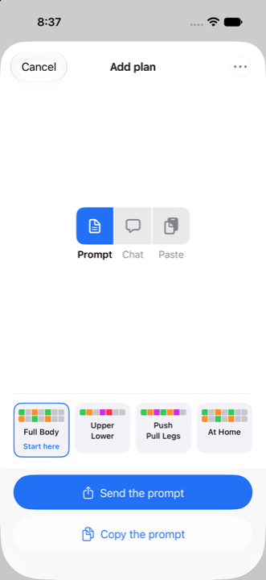

# Jimm's Bro+

[](LICENSE)

An iPhone app that runs your workout for you. Pick a plan and tap Start; it walks you through the day one set at a time, times your rest on the Lock Screen, remembers what you lifted, and tells you when to add weight. Plans come from four built-in routines or from a prompt a chatbot answers. No account, no server, no network connection.

<p align="center">
  
  
  
  
  
  
</p>

## What it does

- **Runs the workout.** In marks rather than sentences: a bar for the day, a dot per set, and a card with a cell per rep — the target solid, a line where you reached last time — with the weight you used already filled in. Swipe to look at the exercises before and after. Log what you did and the rest timer starts on its own — on the Lock Screen and in the Dynamic Island, with a notification when the phone is in your pocket. Warm-up, timed holds, supersets, drop sets, a walk between exercises.
- **Remembers.** Next time the weight is already filled in. Hit the top of your rep range and it suggests the next weight, snapped to what your plates can make. Every set is kept: a calendar with each day in its own colour, history, personal records, a chart per exercise, metrics over time.
- **Gets plans from a chatbot.** Tap **Send the prompt** and the share sheet hands it to ChatGPT or Claude — or copy it for a chatbot in a browser — then paste the reply back and use the plan. The same three steps ask for a progression, or for a change said in one sentence. A reply that came cut short can be finished one day at a time. Four built-in routines — Full Body, Upper Lower, Push Pull Legs, At Home — to start from.
- **Progresses.** Ask the chatbot for a progression from what you actually lifted, then earn each step by hitting it.
- **Keeps your data on the phone.** Back up to a file, export history as a spreadsheet, import from Strong or Hevy. Nothing leaves the phone unless you send it. [Privacy policy](docs/PRIVACY.md).

## Status

**v1.12**, built and green on every route ([docs/BUILD_STATUS.md](docs/BUILD_STATUS.md)). Not yet on the App Store: the submission is prepared in [docs/APP_STORE.md](docs/APP_STORE.md) and waits on the paid Developer Program and a release Xcode. Until then, build it yourself.

## Build it

Xcode 26 or later on a Mac, an iPhone on iOS 17 or later.

1. Open `JimmsBro.xcodeproj` and pick the shared `JimmsBro` scheme.
2. Signing & Capabilities → choose your team (a free Apple ID works for seven days at a time).
3. Plug in the phone, choose it as the destination, press Run. [docs/BUILD_PLAN.md](docs/BUILD_PLAN.md) has the one-time steps on the phone.

The tests run on three routes — the simulator, `swift test` on the host, and a portable runner that needs no Xcode — all run on this Mac by `tools/check_all.sh`. [GitHub Actions](.github/workflows/ci.yml) can run the same checks, but only when started by hand. The commands are below.

## License

[MIT](LICENSE).

---

## For the implementing agent

This folder contains the design package and the app, built through **v1 (M0–M7)**, **v1.1 (R0–R6)**, **v1.2 (V0–V8)**, **v1.3 (X0–X6)**, **v1.4 (Y0–Y5)**, **v1.5 (Z0–Z6)**, **v1.6 (U0–U7)**, **v1.7 (T0–T6)**, **v1.8 (S0–S4)**, **v1.9 (Q0–Q7)**, **v1.10 (P0–P7)**, **v1.11 (N0–N7)** and **v1.12 (L0–L8)**: the Core import pipeline and session engine, the JSON store, every screen, the workout's five fixed zones, plan editing, backup and restore, v1.2's warm-up, timed walk between exercises, loadable weight suggestions, anchored calendar, metrics and Lock Screen / Dynamic Island activity, and v1.3's narrower Island, changing an exercise mid-workout, JSON edits at every size, history as CSV in and out, and Progression — the chatbot round-trip run the other way; and v1.4's four built-in plans, the introduction, a workout that opens the moment it exists, and the store readiness (an opaque icon, version 1.4 on every target, the export-compliance answer, the privacy policy and the submission page); and v1.5's clearer Progression row and Copy prompt, an effort target (reps or seconds in reserve) in the plan format, a plan built in several pastes for free chatbot tiers, progression as steps you earn by performance with the calendar kept as a mode, and a goal per exercise; and v1.6's answer to the usability audit (`docs/UX_REVIEW_2026-09-09.md`): no false missed workouts, every menu confirmation an alert with a way out, the first five minutes made to ask for nothing unexplained (no warm-up on a fresh install, Start first set, the permission at the first log, a weight field that explains itself, the unit asked), and a hierarchy pass (Start under the thumb, Undo on the row, a strip that says what follows, presets) — with plain words (U4, the owner's Reading B) and a switch back to compact notation, and a Lock Screen activity that no longer outlives the app (U7); and v1.7's answer to "feels like a settings menu": Today as one card with the day's alternatives in one ···, two tabs (Today · History) with Plans behind Change plan and Settings behind a gear, the calendar in History, controls that appear when they first have something to do, and a colour per day; and v1.8's answer to "too much text, and too little use of visual cues": nothing on Today without a mark beside it, the week as a seven-square strip that replaces Another day, and a rest day that says Rest instead of naming the next workout; and v1.9's answer to "shift today's colour to the colour of the other day (without changing the plan itself)": a workout done on another day swaps two dates in a new `swaps.json` and leaves the plan alone, with a question on the day whose workout was taken (Rest, today's day, keep, or Slide), marks on the strip that show it, a ··· of two items drawn in squares, a day's exercises changed for one date — from this plan, another plan or a day written just for it — a JSON sheet that names what it edits and marks the error at its line, and Plans in squares with a circle to mark and a button to confirm; and v1.10's Workout screen in symbols, where colour says state — done in the day's colour, now in blue, not yet in grey: a header that is a bar with a segment per exercise as long as it usually takes you, the exercise as a name, a ? for its notes, a dot per set and a card of cells with a logged set changed in place, the walk between exercises as a count-up and a ring over the plan's new optional `restBetweenExercises`, pages to swipe between exercises, Change *day* as joined squares with a button that confirms, and cycles drawn seven squares to a row; and v1.11's answer to "it feels like an instruction manual": every point where the app hands text to a chatbot and takes its reply back is one screen in three states — Ask, Paste, Review, and a fourth for a refusal — with one control each, the trip as three joined squares, **Send the prompt** through the share sheet and Copy beneath it, the built-in plans as a row of squares, day by day offered only on a reply cut short, Progression as pre-marked tiles and ladders, today's exercises edited in place, **Say what should change** — one sentence out, a whole plan back, a diff to apply — and the text itself behind every ···; and v1.12's answer to "I don't want logic duplicates anywhere": one owner for each piece of logic — one reader of reps, a hold and a weight, one JSON grammar, one way a plan hands on its identity, one reading of the schedule, the session and the next step, one refusal and one ··· for the chatbot screens, one plural, one script that edits the project and the tests' helpers written once — with the places where two copies had disagreed settled one way each and logged, and four fixes first from an audit of the screens against each other (Edit the text keeps the progression, three destructive actions ask, a screen holding edits keeps them, a set reads reps first everywhere). Open `JimmsBro.xcodeproj` and select the shared `JimmsBro` scheme. What remains is the device checklist, which needs the owner's iPhone, and the submission itself — the Developer Program, a release Xcode and the form — which is the owner's to do from `docs/APP_STORE.md`. ChatGPT / Codex reads `AGENTS.md`; Claude Code reads the identical `CLAUDE.md`.

`tools/check_all.sh` runs every check CI would, on this Mac, and prints one line per check; each
check's output is in `build/check-<check>.log`. The commands it runs are below.

Run the iOS tests from this folder:

```sh
xcodebuild test -scheme JimmsBro -destination 'platform=iOS Simulator,name=iPhone 17'
```

That is **475 tests**; the pins that read the checkout skip on this route when the simulator's sandbox keeps it out of reach, which on v1.12's last run it did not — see below. The suite covers imports, steps, rest, the session engine, prefill, stats, progression, plan coordination, scheduling, calendar projection, prompts, the persistence store and its migration from v1.1's files, the app model behind the screens, the workout's input rules, timers, notifications and session lifecycle, history and metrics, plan editing, backup and restore, v1.2's warm-up, transition rest, weight rounding, suggestions, anchored schedule and Live Activity, v1.3's Island timer range, exercise substitution, JSON splices, history CSV and Progression, v1.4's start-before-the-side-effects rule, the four built-in plans and the introduction, v1.5's effort target, the outline-then-days draft, the progression's earned steps and the goals, v1.6's usability rules — the missed-workout guard, the chip and calendar-label rules, the first-five-minutes defaults, the Summary's next line and plain words — v1.7's Today card, tab list, calendar line, earned controls and day colours, v1.8's cueless card, week strip and rest-day rules, and v1.9's day swaps and Slide, the strip's marks and question, the ··· in squares, a day changed for one date, the JSON sheet's points and its line locator, and Plans in squares, v1.10's mark states, the bar and its pace, the rep cells and dots, the walk's ring, the pages, and Change *day* in squares, and v1.11's round trip — the trip's stages, strip and buttons, Add plan's transitions and its refusals, the draft on a reply cut short, the progression screen's tiles and its ladders, a day's edits and the names the app knows, and the plan diff behind Say what should change, and v1.12's one owner for each piece of logic — each case pinning the side a disagreement settled on, and source reads that fail when a copy grows back. Imports use the 118 fixtures and the manifest verbatim (the original 111, four for the effort target and, in v1.10, three for the walk between exercises). There are no third-party dependencies, and the signing team is already set for both targets.

Core can also be checked with the independently installed Command Line Tools:

```sh
python3 tools/check_core.py --filter ImportTests
python3 tools/check_core.py
```

This portable runner compiles the actual Core sources in Swift 5 language mode and executes the same test bodies using assertion adapters. It reports a nonzero exit code on any failure; it does not run XCTest or certify app bundle/simulator behavior.

```sh
swift test
```

runs Core as an ordinary Swift Package. This route had not compiled since `AppModel` became `@Observable` — `Package.swift` declared macOS 13 and Observation needs 14 — and v1.2's V1 fixed it. It is also where the pins the simulator may skip always run: they pin `Prompts.swift` to `docs/PROMPT.md`, SPEC's tab list and gate table to `Core/Tabs.swift` and `Core/Gates.swift`, and Core's words to the views' own source — the introduction's copy, D50's sentences, the palette in `DaySquare.swift`, Today's pins, the swaps' declarations (TQ12), Plan detail's one way to change plan (TQ37), and the Workout screen's state colours, its wordless header, its zone 2 and pager, and the one joined strip of squares (TP2, TP6, TP15, TP28, TP41) — all outside the simulator's sandbox. See `docs/BUILD_STATUS.md` for results and remaining verification.

An iOS simulator runtime must be installed in Xcode; the commands above name the iPhone 17 simulator (the one Xcode 27 ships), and any installed iPhone works.

```sh
python3 tools/check_release.py
```

checks what a script can about App Store readiness (v1.4, D49): the icon has no alpha channel, the three targets agree on a version and `docs/APP_STORE.md` says the same, the export-compliance answer is in the binary, the policy and the submission page exist, and every built-in plan is bundled. The other half is a Release build, `xcodebuild build -scheme JimmsBro -configuration Release -destination 'platform=iOS Simulator,name=iPhone 17'`.

```sh
python3 tools/check_bundle.py
```

fails when `HANDOFF_BUNDLE.md` or the zip has drifted from the files it is built from. Both are derived but committed, because the owner hands them to a chatbot that cannot read a folder — which is only safe with a check that says when they have gone stale.

| File | What it is | Who reads it |
|---|---|---|
| `AGENTS.md` / `CLAUDE.md` | Handoff instructions and hard rules (identical; one per agent convention) | the agent |
| `docs/SPEC.md` | Product spec: decisions, platform, screens, exact behaviors, data model, persistence | you first, then the agent |
| `docs/PLAN_FORMAT.md` | The JSON plan format, what's accepted leniently, every error/warning code | the agent |
| `docs/PROMPT.md` | The exact prompt the app copies for ChatGPT/Claude, and the fix-it prompt | you, the agent |
| `docs/TEST_CASES.md` | About 930 test cases, unit / ui / manual / check | the agent; you for the manual checklist |
| `docs/BUILD_PLAN.md` | Milestones M0–M8 and how to install on your iPhone | both |
| `docs/ITERATION_2_PLAN.md` | The v1.1 plan: milestones R0–R6 | both |
| `docs/ITERATION_3_PLAN.md` | The v1.2 plan: milestones V0–V8 | both |
| `docs/ITERATION_4_PLAN.md` | The v1.3 plan: milestones X0–X6 | both |
| `docs/ITERATION_5_PLAN.md` | The v1.4 plan: milestones Y0–Y5 | both |
| `docs/ITERATION_6_PLAN.md` | The v1.5 plan: milestones Z0–Z6, and the owner's readings of the notes | both |
| `docs/ITERATION_7_PLAN.md` | The v1.6 plan: milestones U0–U7 from the usability audit; plain words (U4) as the owner's Reading B | both |
| `docs/ITERATION_8_PLAN.md` | The v1.7 plan: milestones T0–T6 — Today as one card, two tabs, the calendar in History, earned controls, a colour per day | both |
| `docs/ITERATION_9_PLAN.md` | The v1.8 plan: milestones S0–S4 — no words without a cue, the week as a seven-square strip, a rest day that says rest | both |
| `docs/ITERATION_10_PLAN.md` | The v1.9 plan: milestones Q0–Q7 — a day swapped, not a plan changed, and Slide; the swap's marks on Today; the ··· in squares; a day changed for one date; the JSON sheet redone; Plans in squares | both |
| `docs/ITERATION_11_PLAN.md` | The v1.10 plan: milestones P0–P7 — three states, three colours, and the header as a bar; the exercise in symbols; the walk as a count-up and a ring; pages; a bar that learns your pace; Change *day* in squares, and squares that join | both |
| `docs/ITERATION_12_PLAN.md` | The v1.11 plan: milestones N0–N7 — every chatbot point as one screen in three states (Ask, Paste, Review) and a fourth for a refusal; Send the prompt through the share sheet; the built-ins as squares; day by day on a reply cut short; Progression as tiles and ladders; today's exercises edited in place; Say what should change; the text behind the ···. Cut for a parallel build: a trunk, four independent tracks, a merge | both |
| `docs/ITERATION_13_PLAN.md` | The v1.12 plan: milestones L0–L8 — one owner for each piece of logic (D96), where two copies disagreed SPEC decides, and the review's other findings parked for the plan after it | both |
| `docs/PRIVACY.md` | The privacy policy the App Store needs a URL for | you |
| `docs/APP_STORE.md` | The App Store submission: the order of things, every field, the review notes, the screenshots, the choices only you can make | you |
| `docs/PROGRESSION_FORMAT.md` | The progression reply format (D44): fields, leniency, codes | both |
| `docs/CODE_HEALTH_REVIEW.md` | The 2026-09-07 review that prompted half of v1.2, and what became of each finding | you |
| `docs/UX_REVIEW_2026-09-09.md` | The 2026-09-09 usability audit v1.6 answers: friction points, twelve defects and ideas, judged for a coach, a great-grandparent and a five-year-old | you |
| `docs/DEVICE_CHECKLIST.md` | The manual cases to run on your iPhone, one section per release, with a place to record results | you |
| `docs/BUILD_STATUS.md` | What is built, what was verified and how to reproduce it | you |
| `schema/plan.schema.json` | JSON Schema of the strict plan shape | the agent |
| `examples/` | 111 fixture files + `manifest.json` with expected results | the agent's tests |
| `tools/reference_import.py` | Python reference implementation; `python3 tools/reference_import.py` checks every fixture | the agent, as an oracle |
| `tools/generate_fixtures.py` | Regenerates all of `examples/` from scratch | the agent, if it only has the bundle |
| `tools/check_release.py` | Checks what a script can about store readiness: the icon, the versions, the compliance answer, the built-in plans | both |
| `HANDOFF_BUNDLE.md` | Everything above except the fixtures, in one file for pasting or uploading into a chat | ChatGPT (web) |
| `JimmsBro-design-package.zip` | The whole folder, for uploading into a chat | ChatGPT (web) |

Before handing off, read `docs/SPEC.md` §1 (decisions made for you) and §2 (why a native iOS app, and what the free vs $99 Apple routes mean). Change anything you disagree with in the docs first; the agent builds what the docs say.
