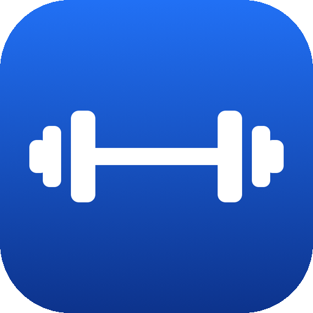
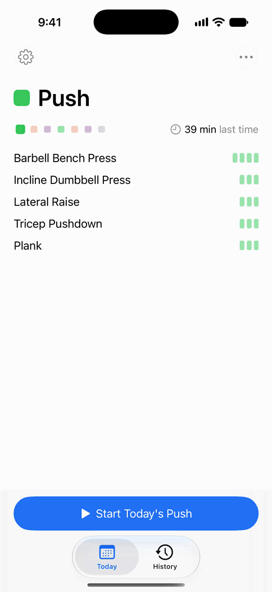
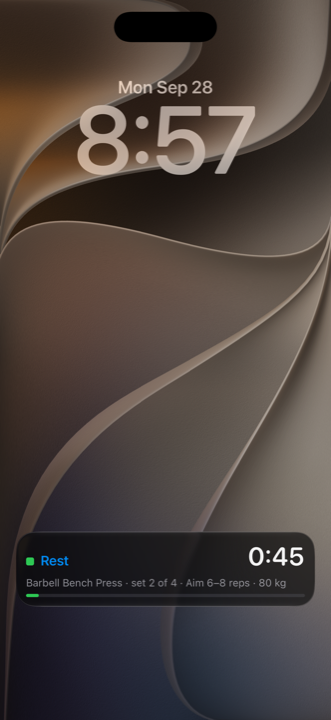

  

<h1 align="center">Jimm's Bro+</h1>

<strong>Rest timed. Sets logged. Weight remembered.</strong>

  
  
  
  

An iPhone app that runs your workout for you. Log a set and the rest is timed on the Lock Screen and in the Dynamic Island, with a notification when the phone is in your pocket. It walks you through the day one set at a time, remembers what you lifted, and tells you when to add weight. Pick a plan from four built-in routines, or ask a chatbot for one. No account, no server, no network connection.

  
   
  Start, log a set, and the rest runs on its own.

## Features

- **A chatbot writes the plan.** Tap **Send the prompt**, hand it to ChatGPT or Claude from the share sheet, paste the reply back, and the plan is in. The same three steps ask for a progression, or for a change said in one sentence.
- **Marks instead of sentences.** A bar for the day, a dot per set, a cell per rep, and the weight you used last time already filled in. You can read it mid-set.
- **Progress you earn.** Hit the top of your rep range and the next weight is suggested, snapped to what your plates can make. A progression's steps are earned by hitting them.
- **Your data stays on the phone.** Back up to a file, export history as a spreadsheet, import from Strong or Hevy. Nothing leaves the phone unless you send it.

## Screens

<table align="center">
  <tr>
    <td align="center"></td>
    <td align="center"></td>
    <td align="center"></td>
  </tr>
  <tr>
    <td align="center">Today: the day's card, one tap to start</td>
    <td align="center">The workout in marks: a bar, dots, cells</td>
    <td align="center">The rest on the Lock Screen</td>
  </tr>
  <tr>
    <td align="center"></td>
    <td align="center"></td>
    <td align="center"></td>
  </tr>
  <tr>
    <td align="center">History: the month, each day in its colour</td>
    <td align="center">Add plan: send the prompt, paste the reply</td>
    <td align="center">Progression: steps earned by hitting them</td>
  </tr>
</table>

## Get it

Not on the App Store yet: the submission is prepared and waits on the Developer Program. Until then, build it on your own phone with Xcode 26 or later on a Mac and an iPhone on iOS 17 or later:

1. Open `JimmsBro.xcodeproj` and pick the shared `JimmsBro` scheme.
2. Signing & Capabilities → choose your team. A free Apple ID works for seven days at a time.
3. Plug in the phone, choose it as the destination, press Run.

## Privacy

Nothing leaves the phone unless you send it. [Privacy policy](docs/PRIVACY.md).

## License

[MIT](LICENSE).

---

Built from a design package in <code>docs/</code>, with 475 tests on three routes. Developer notes: <a href="docs/DEVELOPING.md">docs/DEVELOPING.md</a>.
